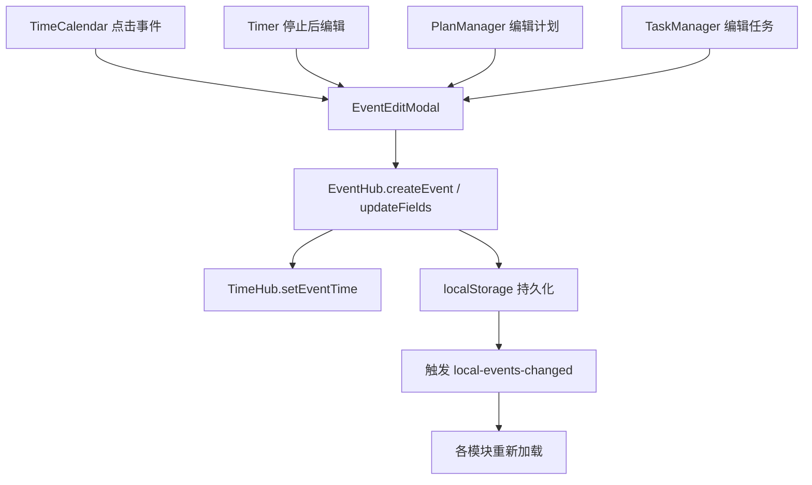
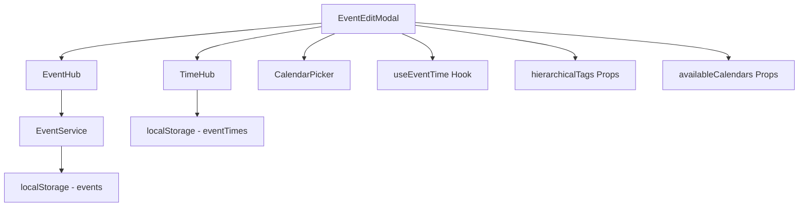

# ReMarkable EventEditModal 模块产品需求文档 (PRD)

> **AI 生成时间**: 2025-11-05  
> **关联代码版本**: master  
> **文档类型**: 功能模块 PRD  
> **依赖模块**: EventHub, TimeHub, TagManager, CalendarPicker  
> **关联文档**: [Timer 模块 PRD](./TIMER_MODULE_PRD.md), [TimeCalendar 模块 PRD](./TIMECALENDAR_MODULE_PRD.md)

---

## 📋 目录

1. [模块概述](#1-模块概述)
2. [用户场景](#2-用户场景)
3. [组件架构](#3-组件架构)
4. [Props 接口设计](#4-props-接口设计)
5. [状态管理](#5-状态管理)
6. [拖拽和调整大小](#6-拖拽和调整大小)
7. [表单字段详解](#7-表单字段详解)
8. [保存和删除逻辑](#8-保存和删除逻辑)
9. [标签选择器](#9-标签选择器)
10. [Timer 集成](#10-timer-集成)
11. [日志记录功能](#11-日志记录功能)

---

## 1. 模块概述

### 1.1 核心定位

EventEditModal 是 ReMarkable 的**统一事件编辑模态框**，承担以下职责：

- ✅ **跨模块复用**：TimeCalendar、Timer、PlanManager、TaskManager 共享同一编辑 UI
- ✅ **完整字段编辑**：标题、时间、标签、日历、位置、描述（日志）
- ✅ **实时 Timer 支持**：运行中 Timer 的时间调整 + 时长实时显示
- ✅ **层级标签选择**：多选标签 + 搜索过滤 + 层级缩进显示
- ✅ **日历自动映射**：根据标签自动填充日历分组
- ✅ **EventHub 集成**：所有保存操作通过 EventHub 统一处理，自动同步时间到 TimeHub
- ✅ **日志容器功能**：description 字段作为会议纪要、资料收集、想法捕捉的承载体

### 1.2 设计理念

**"单一编辑入口，多场景适配"**



### 1.3 关键特性

| 特性 | 说明 | 价值 |
|------|------|------|
| **可选拖拽** | `draggable=true` 时支持拖动模态框 | PlanManager 等需要侧边栏模式的场景 |
| **可选调整大小** | `resizable=true` 时支持调整模态框尺寸 | 用户自定义舒适的编辑区域 |
| **全天/时段切换** | 自动转换时间格式（date ↔ datetime-local） | 适配不同事件类型 |
| **标签日历联动** | 选择标签后自动填充映射的日历 | 减少重复操作 |
| **Timer 时长提示** | 显示当前累计时长 + 修改提示 | Timer 场景的关键反馈 |
| **description 无损传递** | 使用 `??` 而非 `||` 保留空字符串 | 避免日志内容丢失 |

---

## 2. 用户场景

### 2.1 场景矩阵

| 调用模块 | 触发时机 | 典型操作 | draggable | resizable |
|---------|---------|---------|-----------|-----------|
| **TimeCalendar** | 点击日历事件 | 修改时间、标签、标题 | ❌ | ❌ |
| **TimeCalendar** | 拖拽空白区域 | 快速创建新事件 | ❌ | ❌ |
| **Timer** | 停止计时后 | 修改标题、添加日志 | ❌ | ❌ |
| **PlanManager** | 点击计划项 | 侧边栏编辑模式 | ✅ | ✅ |
| **TaskManager** | 点击任务 | 编辑任务详情 | ❌ | ❌ |

### 2.2 从 Timer 模块迁移的场景：日志记录

> **原文档位置**: [Timer PRD - 故事4: 随手记录日志](./TIMER_MODULE_PRD.md#故事-4-随手记录日志)

#### 场景 A: 会议纪要记录

**用户故事**：
> **作为** 需要记录会议纪要的用户  
> **我希望** 能够在计时的同时记录详细内容  
> **以便** 所有信息都按时间自动归档，无需额外思考"记在哪里"

**操作流程**：
1. 日历中已有下午 2:00 的"产品评审会议"事件
2. 会议开始时，打开 TimeCalendar 点击该事件
3. 在 **EventEditModal** 的 description 字段输入会议纪要：
   ```
   参会人员：张三、李四、王五
   讨论要点：
   1. 新功能 A 的技术方案确认
   2. UI 设计稿第二版反馈
   3. 下周发布时间表
   
   待办事项：
   - @张三 完成技术文档
   - @李四 修改设计稿
   ```
4. 保存后自动同步到 Outlook（通过 EventHub → Sync）
5. **价值体现**：
   - ✅ 会议纪要不会散落在不同笔记本中
   - ✅ 通过时间轴快速定位："上周二下午的会议讨论了什么"
   - ✅ Outlook 中也能查看完整纪要

#### 场景 B: 资料收集归档

**操作流程**：
1. 周二上午 10:00 开始搜集竞品分析资料
2. 点击 Timer 开始计时"#工作/#竞品分析"
3. 边搜索边在 **EventEditModal** 的 description 中粘贴：
   ```
   竞品 A：https://example.com/product-a
   - 核心功能：XXX
   - 定价策略：$99/月
   
   竞品 B：https://example.com/product-b
   - 核心功能：YYY
   - 截图：[图片链接]
   ```
4. 搜集完成后停止 Timer，保存事件

#### 场景 C: 实时想法捕捉

**操作流程**：
1. Timer 正在运行"#写作/#博客文章"
2. 写作过程中突然有灵感
3. **不停止 Timer**，直接点击 TimeCalendar 中的运行中事件
4. 在 **EventEditModal** 的 description 中追加内容：
   ```
   11:30 - 想到一个更好的开头
   11:45 - 需要补充的数据来源：[链接]
   12:00 - 文章结构调整：先讲案例再讲原理
   ```
5. 保存后继续计时，所有想法都追加到同一个事件

**设计理念**：
- ✅ **时间即索引**：用户不需要思考"记在哪里"，时间轴就是天然的索引
- ✅ **事件即容器**：每个事件都是一个信息容器，承载时长、标签、内容
- ✅ **无缝同步**：description 内容自动同步到 Outlook，跨设备可访问

**技术约束**（当前版本）：
- ⚠️ 仅支持纯文本，未来计划升级为富文本（Markdown/HTML）
- ⚠️ Outlook description 字段支持 HTML，但需考虑格式兼容性

---

## 3. 组件架构

### 3.1 文件结构

```
src/components/
├── EventEditModal.tsx       # 主组件（873 行）
├── EventEditModal.css       # 样式文件
├── CalendarPicker.tsx       # 日历多选组件
└── 调用方：
    ├── TimeCalendar.tsx     # 日历视图
    ├── Timer.tsx            # 计时器（间接，通过 TimeCalendar）
    ├── PlanManager.tsx      # 计划管理
    └── TaskManager.tsx      # 任务管理
```

### 3.2 依赖关系



---

## 4. Props 接口设计

### 4.1 完整接口定义

```typescript
// 位置：L19-32
interface EventEditModalProps {
  event: Event | null;                    // 要编辑的事件（null 时不显示）
  isOpen: boolean;                        // 控制模态框显示状态
  onClose: () => void;                    // 关闭回调
  onSave: (updatedEvent: Event) => void;  // 保存回调
  onDelete?: (eventId: string) => void;   // 删除回调（可选）
  hierarchicalTags: any[];                // 层级标签数据
  onStartTimeChange?: (newStartTime: number) => void; // Timer 时间调整回调
  globalTimer?: {                         // Timer 状态（Widget 模式使用）
    startTime: number;
    originalStartTime?: number;
    elapsedTime: number;
    isRunning: boolean;
  } | null;
  availableCalendars?: any[];             // 可选择的日历列表
  draggable?: boolean;                    // 是否可拖拽（默认 false）
  resizable?: boolean;                    // 是否可调整大小（默认 false）
}
```

### 4.2 Props 使用场景

#### TimeCalendar 调用示例

```typescript
// 位置：TimeCalendar.tsx L2606-2616
<EventEditModal
  event={editingEvent}
  isOpen={showEventEditModal}
  onClose={() => setShowEventEditModal(false)}
  onSave={handleSaveEvent}
  onDelete={handleDeleteEvent}
  hierarchicalTags={hierarchicalTags}
  availableCalendars={availableCalendars}
  draggable={false}   // 居中模态框
  resizable={false}
/>
```

#### PlanManager 调用示例

```typescript
// 位置：PlanManager.tsx L895-905
<EventEditModal
  event={selectedPlanAsEvent}
  isOpen={!!selectedPlan}
  onClose={() => setSelectedPlan(null)}
  onSave={handleSavePlanFromModal}
  hierarchicalTags={hierarchicalTags}
  availableCalendars={availableCalendars}
  draggable={true}    // 支持拖动到侧边栏位置
  resizable={true}    // 支持调整大小
/>
```

### 4.3 Props 设计原则

| Props | 设计原则 | 原因 |
|-------|---------|------|
| `event` | 传入完整 Event 对象 | 包含所有字段，避免部分字段丢失 |
| `onSave` | 回调中返回完整 Event | 调用方自行决定后续操作（刷新列表、关闭模态框等） |
| `hierarchicalTags` | 父组件负责数据结构 | EventEditModal 只负责展示和选择，不关心标签如何加载 |
| `globalTimer` | 可选参数 | 仅 Timer 场景需要，其他场景传 `null` 或 `undefined` |
| `draggable/resizable` | 可选布尔值 | 默认 false，仅特定场景（如 PlanManager）启用 |

---

## 5. 状态管理

### 5.1 核心状态定义

```typescript
// 位置：L47-56
const [formData, setFormData] = useState({
  title: '',
  description: '',
  startTime: '',             // 格式：YYYY-MM-DD 或 YYYY-MM-DDTHH:mm
  endTime: '',
  location: '',
  isAllDay: false,
  tags: [] as string[],      // 多选标签 ID 数组
  calendarIds: [] as string[], // 多选日历 ID 数组
});
```

### 5.2 UI 交互状态

```typescript
// 位置：L58-68
const [tagSearchQuery, setTagSearchQuery] = useState('');      // 标签搜索关键词
const [showTagDropdown, setShowTagDropdown] = useState(false); // 标签下拉显示状态

// 拖拽和调整大小状态
const [modalPosition, setModalPosition] = useState({ x: 0, y: 0 });
const [modalSize, setModalSize] = useState({ width: 600, height: 0 });
const [isDragging, setIsDragging] = useState(false);
const [isResizing, setIsResizing] = useState(false);
const [dragStart, setDragStart] = useState({ x: 0, y: 0 });
const [resizeStart, setResizeStart] = useState({ x: 0, y: 0, width: 0, height: 0 });
```

### 5.3 状态初始化逻辑

```typescript
// 位置：L197-244
useEffect(() => {
  if (event && isOpen) {
    // 🎯 优先使用 TimeHub 的快照（保证时间字段的一致性）
    const startStr = eventTime?.start || event.startTime || '';
    const endStr = eventTime?.end || event.endTime || '';

    // 根据 isAllDay 决定时间格式
    const isAllDay = !!event.isAllDay;
    const startTime = isAllDay
      ? formatDateForInput(startDateObj)      // YYYY-MM-DD
      : formatDateTimeForInput(startDateObj); // YYYY-MM-DDTHH:mm
    
    setFormData({
      title: event.title || '',
      description: event.description ?? '', // 🔍 使用 ?? 而非 ||，保留空字符串
      startTime,
      endTime,
      location: event.location || '',
      isAllDay: isAllDay,
      tags: event.tags || (event.tagId ? [event.tagId] : []),
      calendarIds: event.calendarIds || (event.calendarId ? [event.calendarId] : []),
    });
  }
}, [event, isOpen, eventTime?.start, eventTime?.end]);
```

**关键设计**：
- ✅ **优先使用 TimeHub 快照**：`eventTime?.start` 优先于 `event.startTime`，避免运行中 Timer 的时间不准确
- ✅ **description 无损传递**：使用 `??` 空值合并运算符，保留空字符串，避免用户清空日志后被还原
- ✅ **兼容单标签/多标签**：`event.tags` 优先，回退到 `event.tagId`（兼容旧数据）

---

*继续阅读下一部分...*
