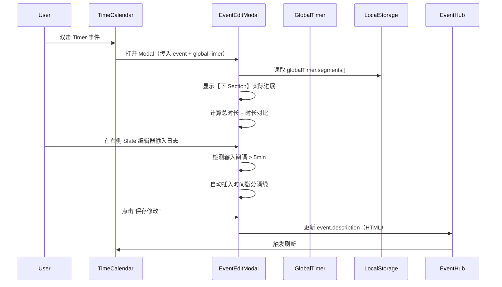
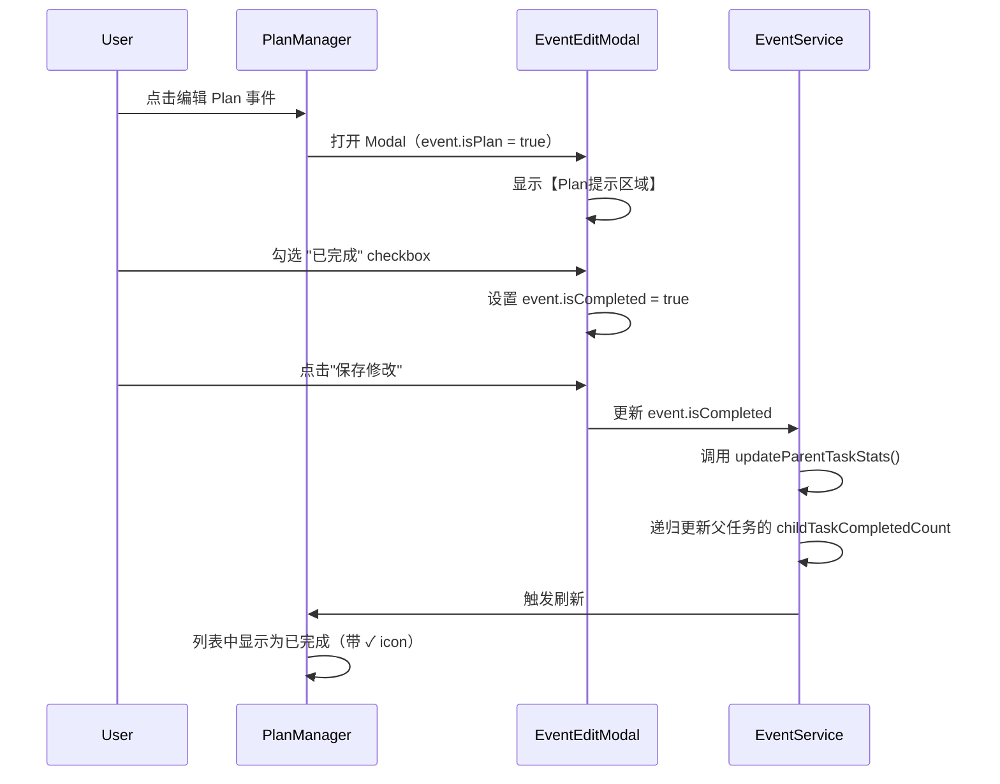
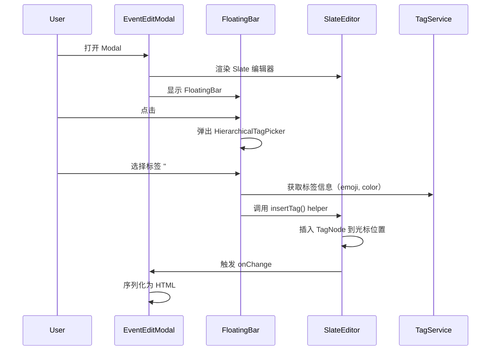
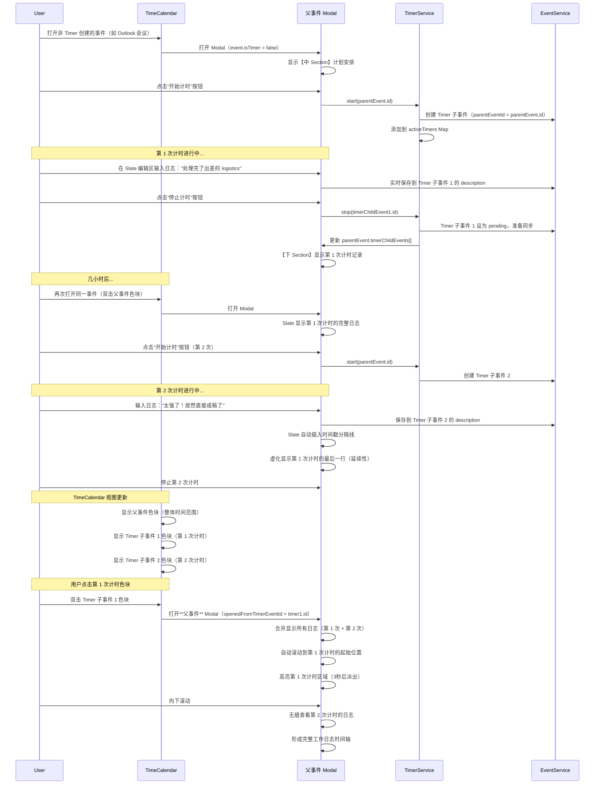

# EventEditModal v2 产品需求文档 (PRD)

> **版本**: v2.0.0  
> **创建时间**: 2025-11-06  
> **Figma 设计稿**: [EventEditModal v2 设计稿](https://www.figma.com/design/T0WLjzvZMqEnpX79ILhSNQ/ReMarkable-0.1?node-id=201-630&m=dev)  
> **基于**: EventEditModal v1 + Figma 设计稿  
> **依赖模块**: EventHub, TimeHub, UnifiedSlateEditor, HeadlessFloatingToolbar  
> **关联文档**: 
> - [EventEditModal v1 PRD](./EVENTEDITMODAL_MODULE_PRD.md)
> - [Timer 模块 PRD](./TIMER_MODULE_PRD.md)
> - [TimeCalendar 模块 PRD](./TIMECALENDAR_MODULE_PRD.md)
> - [TIME_ARCHITECTURE.md](../TIME_ARCHITECTURE.md)
> - [SLATE_DEVELOPMENT_GUIDE.md](../SLATE_DEVELOPMENT_GUIDE.md)

---

## 📋 目录

1. [版本升级说明](#版本升级说明)
2. [视图模式](#视图模式)
   - [详情视图](#详情视图-左右分栏)
   - [收缩视图](#收缩视图-单栏卡片)
3. [整体布局](#整体布局)
4. [左侧：Event Overview](#左侧event-overview)
5. [右侧：Event Log](#右侧event-log)
6. [数据字段扩展](#数据字段扩展)
7. [技术实现要点](#技术实现要点)
8. [用户交互流程](#用户交互流程)

---

## 版本升级说明

### v1 → v2 的核心变化

| 功能模块 | v1 实现 | v2 升级 |
|---------|--------|--------|
| **布局结构** | 单栏表单布局 | 左右分栏（左侧固定宽度 + 右侧可 resize，最小宽度 >= 左侧）+ **收缩视图** |
| **描述字段** | 纯文本 `<textarea>` | **UnifiedSlateEditor** 富文本编辑器 |
| **时间显示** | 单一时间字段 | **计划时间 vs 实际时间对比**（Timer 集成） |
| **日志记录** | 简单文本输入 | **时间戳分隔线 + 富文本日志** |
| **标签显示** | 单行 chips | **层级路径 + Event Log 区域展示** |
| **任务管理** | 无 | **Plan 集成 + 任务状态 + 关联任务** |
| **FloatingBar** | 无 | **集成 HeadlessFloatingToolbar**（emoji/tag/date 插入） |
| **Timer 集成** | 无 | **上下 Section 之间的计时按钮（含取消功能）** |
| **视图切换** | 无 | **详情视图 ↔ 收缩视图**（通过 "back" / "展开详情" 按钮切换） |

### 设计理念

**"左侧管理，右侧记录"**

- **左侧 Event Overview**: 聚焦事件的**元数据管理**（时间、人、地点、来源）
- **右侧 Event Log**: 聚焦**日志记录**（会议纪要、资料收集、实时想法）

**"收放自如，专注效率"**

- **详情视图**（Default）：完整的左右分栏，用于深度编辑和日志记录
- **收缩视图**（Compact）：单栏卡片，用于快速浏览和计时操作

---

## 视图模式

EventEditModal v2 支持两种视图模式，用户可根据使用场景切换：

### 详情视图（左右分栏）

**使用场景**:
- 需要编辑事件元数据（时间、参会人、位置等）
- 需要记录详细的会议日志或工作笔记
- 需要查看完整的事件信息和历史记录

**布局特点**:
- 左侧：Event Overview（固定宽度 360px）
- 右侧：Event Log（flex: 1, min-width: 360px）
- 支持右侧区域 resize

**切换方式**:
- 点击 Slate 编辑区右上角的 "back" 按钮 → 关闭右侧视图，进入收缩视图

---

### 收缩视图（单栏卡片）

**使用场景**:
- 只需要快速浏览事件基本信息
- 专注于计时操作（开始、暂停、结束）
- 需要同时查看多个事件（可并排显示多个收缩卡片）
- 减少屏幕占用，保持专注

**布局特点**:
- 单栏卡片（宽度 ~383px，高度 ~730px）
- 圆角设计（border-radius: 45px）
- 垂直布局：Emoji → 标题 → 标签 → 计时区域 → 计划安排 → 实际进展 → 底部按钮

**核心元素**:
```
┌─────────────────────────────────┐
│         🎯 Emoji (60px)          │ ← 点击可换 emoji
│                                 │
│       准备演讲稿 (18px Bold)     │ ← 标题
│   🔗 #👜工作/#🧐文档编辑 等      │ ← 标签 + 关联任务
│                                 │
│   ┌───────────────────────┐     │
│   │   [▶️ 开始专注]        │     │ ← 未计时状态：单个开始按钮
│   └───────────────────────┘     │
│         或                      │
│   ┌───────────────────────┐     │
│   │  ☑️ 🚀 Ⓜ️              │     │ ← 计时中：任务/里程碑状态
│   │                       │     │
│   │      25:30            │     │ ← 大号计时器（48px Bold）
│   │  开始时间 09:00        │     │
│   │                       │     │
│   │  [⏸️] [⏹️] [❌]       │     │ ← 暂停/结束/取消按钮（圆形小图标）
│   └───────────────────────┘     │
│                                 │
│   计划安排                       │
│   发起人：                       │
│   参会人：                       │
│   10:00 ──2h30min→ 12:00        │
│   来自 ●Outlook: 默认            │
│                                 │
│   实际进展                       │
│   🕐 10:00 ──2h30min→ 12:00     │
│   🕐 23:00 ──2h→ 01:00 +1       │
│   总时长：3小时                  │
│   ⚫ Milestone完成于...          │
│                                 │
│ [取消]   [展开详情]   [保存修改]  │ ← 底部三个文字按钮
└─────────────────────────────────┘
```

**切换方式**:
- 点击底部 "展开详情" 按钮 → 打开右侧 Event Log 视图，进入详情视图

**底部按钮**:
```tsx
<div className="compact-footer-buttons">
  <button className="footer-btn-text" onClick={handleCancel}>
    取消
  </button>
  <button className="footer-btn-text" onClick={handleExpandDetails}>
    展开详情
  </button>
  <button className="footer-btn-text" onClick={handleSave}>
    保存修改
  </button>
</div>
```

```css
.compact-footer-buttons {
  display: flex;
  justify-content: space-between;
  padding: 16px 24px;
  border-top: 1px solid #f3f4f6;
}

.footer-btn-text {
  font-family: 'Istok Web', sans-serif;
  font-size: 15px;
  color: #6b7280;
  background: none;
  border: none;
  cursor: pointer;
  padding: 8px;
  transition: color 0.2s;
}

.footer-btn-text:hover {
  color: #3b82f6;
}
```

**交互逻辑**:
```typescript
const handleExpandDetails = () => {
  // 从收缩视图切换到详情视图
  setViewMode('detail');
  // 打开右侧 Event Log 区域
};

const handleCancel = () => {
  // 关闭 Modal，不保存修改
  onClose();
};

const handleSave = async () => {
  // 保存修改并关闭 Modal
  await EventService.update(event.id, formData);
  onClose();
};
```

**Figma 设计稿**: [收缩视图](https://www.figma.com/design/T0WLjzvZMqEnpX79ILhSNQ/ReMarkable-0.1?node-id=208-968&m=dev)

---

## 整体布局（详情视图）

```
┌─────────────────────────────────────────────────────────────────┐
├───────────────────────┬─────────────────────────────────────────┤
│  Event Overview (左)   │  Event Log (右)                          │
│  固定宽度 360px        │  flex: 1, min-width: 360px              │
│                       │                                         │
│  ┌─────────────────┐  │  ┌───────────────────────────────────┐  │
│  │【上 Section】    │  │  │ 【标签区域】                       │  │
│  │ 🎯 准备演讲稿    │  │  │ #🚀工作/#📝文档编辑 #...           │  │
│  │ ☑ 任务模式       │  │  └───────────────────────────────────┘  │
│  │ #🚀工作/...等    │  │                                         │
│  └─────────────────┘  │  ┌───────────────────────────────────┐  │
│                       │  │ 【Plan提示区域】                    │  │
│  ┌─────────────────┐  │  │ ☑ ⏰ 🚩 创建于12h前，ddl还有2h30min │  │
│  │  [▶️ 开始计时]   │  │  └───────────────────────────────────┘  │
│  └─────────────────┘  │                                         │
│                       │  ┌───────────────────────────────────┐  │
│  ┌─────────────────┐  │  │ 【关联区域】                        │  │
│  │【中 Section】    │  │  │ 🔗 上级任务：Project Ace (5/7)     │  │
│  │ 计划安排         │  │  └───────────────────────────────────┘  │
│  │ 👥 Zoey; Jenny  │  │                                         │
│  │ 📅 10:00→12:00  │  │  ┌───────────────────────────────────┐  │
│  │ 📍 静安嘉里...   │  │  │ 【Slate 编辑区】                   │  │
│  │ 来自●Outlook    │  │  │                                    │  │
│  └─────────────────┘  │  │ ─────────────────────             │  │
│                       │  │ 2025-10-19 10:21:18               │  │
│  ┌─────────────────┐  │  │                                    │  │
│  │【下 Section】    │  │  │ 处理完了一些出差的logistics...     │  │
│  │ 实际进展         │  │  │ 准备先一个提纲丢给GPT...           │  │
│  │ 🕐 10:00→12:00  │  │  │                                    │  │
│  │ 🕐 23:00→01:00  │  │  │ ─────────────────────             │  │
│  │ 总时长：3小时    │  │  │ 2025-10-19 10:35:18 | 16min later │  │
│  │ 比计划多30min   │  │  │                                    │  │
│  └─────────────────┘  │  │ 太强了！居然直接成稿了...          │  │
│                       │  │                                    │  │
│                       │  │ [😊 # 📅 • 🎨 ✓]  FloatingBar     │  │
│                       │  └───────────────────────────────────┘  │
└───────────────────────┴─────────────────────────────────────────┘
│  [取消] [保存修改]                                               │
└─────────────────────────────────────────────────────────────────┘
```

---

## 左侧：Event Overview

### 【上 Section】- 事件标识

#### 1.1 Emoji（大图标）

**数据来源**:
```typescript
event.title: string  // 从标题首字符提取 emoji
```

**显示逻辑**:
```typescript
function getDisplayEmoji(event: Event, globalTimer: any): string {
  // 优先级 1: 标题中的 emoji（提取标题首个 emoji 字符）
  const titleEmoji = extractFirstEmoji(event.title);
  if (titleEmoji) return titleEmoji;
  
  // 优先级 2: 首个标签的 emoji
  if (event.tags && event.tags.length > 0) {
    const firstTag = getTagById(event.tags[0]);
    if (firstTag?.emoji) return firstTag.emoji;
  }
  
  // 优先级 3: Placeholder（根据 Timer 状态）
  const isTimerActive = globalTimer?.eventId === event.id;
  return isTimerActive ? '⏳' : '�';
}

/**
 * 从字符串中提取第一个 emoji 字符
 */
function extractFirstEmoji(text: string): string | null {
  if (!text) return null;
  
  // Emoji 正则表达式
  const emojiRegex = /[\p{Emoji_Presentation}\p{Extended_Pictographic}]/gu;
  const match = text.match(emojiRegex);
  
  return match ? match[0] : null;
}
```

**交互**:
- 点击弹出 EmojiPicker（见附件 `EmojiPicker.tsx`）
- 选中后的处理逻辑：
  ```typescript
  const handleEmojiSelect = (selectedEmoji: string) => {
    // 1. 移除标题中现有的 emoji（如果存在）
    let newTitle = formData.title;
    const existingEmoji = extractFirstEmoji(newTitle);
    if (existingEmoji) {
      newTitle = newTitle.replace(existingEmoji, '').trim();
    }
    
    // 2. 将新 emoji 添加到标题开头
    newTitle = `${selectedEmoji} ${newTitle}`;
    
    // 3. 更新表单数据
    setFormData({ ...formData, title: newTitle });
    
    // 4. 关闭 Picker
    setEmojiPickerVisible(false);
  };
  ```
- Emoji 自动显示在标题输入框的开头

**UI 样式**:
```css
.emoji-large {
  font-size: 48px;
  cursor: pointer;
  padding: 12px;
  border-radius: 8px;
  transition: background 0.2s;
}
.emoji-large:hover {
  background: #f3f4f6;
}
```

---

#### 1.2 标题输入框

**数据来源**: `event.title`

**显示逻辑**:
```typescript
<input
  type="text"
  value={formData.title}
  placeholder={getTitlePlaceholder(formData.tags)}
  onChange={(e) => setFormData({ ...formData, title: e.target.value })}
/>

function getTitlePlaceholder(tags: string[]): string {
  if (tags.length === 0) return '事件标题';
  const firstTag = getTagById(tags[0]);
  return firstTag?.name ? `${firstTag.name}事项` : '事件标题';
}
```

**验证规则**:
- 必填字段（除非选择了标签，则可用标签名称代替）
- 最大长度 200 字符

---

#### 1.3 标签显示

**数据来源**: `event.tags[]`

**显示逻辑**:
```typescript
function getTagsDisplayText(tags: string[]): string {
  if (tags.length === 0) return '选择标签...';
  
  const firstTag = getTagById(tags[0]);
  if (!firstTag) return '选择标签...';
  
  // 构建层级路径
  const path = getTagHierarchyPath(firstTag);  // 如 "🚀工作/📝文档编辑"
  
  if (tags.length > 1) {
    return `#${path} 等`;
  }
  return `#${path}`;
}
```

**交互**:
- 点击打开 HierarchicalTagPicker
- 支持多选
- 选中后立即更新显示

**UI 样式**:
```css
.tags-display {
  padding: 8px 12px;
  background: rgba(59, 130, 246, 0.1);
  border-radius: 6px;
  color: #3b82f6;
  cursor: pointer;
  font-size: 14px;
  font-weight: 500;
}
```

---

#### 1.4 任务勾选框（条件显示）

**显示条件**:
```typescript
function shouldShowTaskCheckbox(event: Event): boolean {
  return event.isPlan === true && event.isTask !== false;
  // 只有从 Plan 页面创建且用户没关闭 addTask 按钮的事件才显示
}
```

**数据来源**: `event.isTask: boolean`

**交互逻辑**:
```typescript
<input
  type="checkbox"
  checked={formData.isTask}
  onChange={(e) => setFormData({ ...formData, isTask: e.target.checked })}
/>
```

**显示效果**:
- 勾选 → 显示 ✓ icon，`isTask = true`
- 不勾选 → 隐藏 checkbox icon，`isTask = false`

---

### 【计时按钮】- Timer 集成（位于上下 Section 之间）

**显示条件**:
```typescript
// 始终显示计时按钮
```

**按钮状态**:
```typescript
interface TimerButtonState {
  isRunning: boolean;      // Timer 是否正在运行
  eventId: string | null;  // 当前绑定的事件 ID
  elapsedTime: number;     // 累积时长（毫秒）
}

function getTimerButtonConfig(event: Event, activeTimers: Map<string, TimerState>): TimerButtonConfig {
  const eventTimer = activeTimers.get(event.id);
  const isTimerRunning = eventTimer?.isRunning === true;
  const isTimerPaused = eventTimer?.isPaused === true;
  
  if (eventTimer && isTimerRunning) {
    // 🎯 当前事件正在计时 - 显示三个按钮：暂停、结束、取消
    return {
      buttons: [
        { icon: 'pause', text: '暂停计时', action: 'pause', color: 'gradient-red' },
        { icon: 'stop', text: '结束计时', action: 'stop', color: 'gray' },
        { icon: 'cancel', text: '取消计时', action: 'cancel', color: 'gray' }
      ],
      showTimer: true,
      timerDisplay: 'running'
    };
  } else if (eventTimer && isTimerPaused) {
    // ⏸️ 当前事件已暂停 - 显示三个按钮：继续、结束、取消
    return {
      buttons: [
        { icon: 'resume', text: '继续计时', action: 'resume', color: 'gradient-red' },
        { icon: 'stop', text: '结束计时', action: 'stop', color: 'gray' },
        { icon: 'cancel', text: '取消计时', action: 'cancel', color: 'gray' }
      ],
      showTimer: true,
      timerDisplay: 'paused'
    };
  } else {
    // ▶️ 当前事件未计时 - 显示单个开始按钮
    return {
      buttons: [
        { icon: 'start', text: '开始专注', action: 'start', color: 'default' }
      ],
      showTimer: false
    };
  }
}
```

**交互逻辑**:
```typescript
const handleTimerAction = async (action: 'start' | 'pause' | 'resume' | 'stop' | 'cancel') => {
  switch (action) {
    case 'start':
      // ▶️ 为当前事件启动新的 Timer
      await TimerService.start(event.id);
      break;
      
    case 'pause':
      // ⏸️ 暂停当前事件的 Timer
      await TimerService.pause(event.id);
      break;
      
    case 'resume':
      // ▶️ 继续当前事件的 Timer
      await TimerService.resume(event.id);
      break;
      
    case 'stop':
      // ⏹️ 结束计时并保存
      // - 创建 Timer 子事件（包含 startTime, endTime, segments, description）
      // - 保存到父事件的 timerChildEvents[]
      // - 清除当前活动 Timer
      await TimerService.stop(event.id);
      break;
      
    case 'cancel':
      // ❌ 取消计时（不保存）
      // - 直接清除当前活动 Timer
      // - 不创建 Timer 子事件
      await TimerService.cancel(event.id);
      break;
  }
};
```

**多 Timer 支持说明**：
- ✅ 支持多个 EventEditModal 同时打开，各自处于 Timer 状态
- ✅ 每个 Modal 独立管理各自事件的 Timer（一个 Modal 一个事件）
- ✅ 使用 `Map<eventId, TimerState>` 存储所有活动 Timer
- ✅ 用户可以同时为不同事件计时，互不影响
- ✅ 每个 Modal 的实际进展区域（【下 Section】）只显示自己事件的 Timer 数据

**UI 样式**:

**详情视图 - 单个开始按钮**（未计时状态）:
```css
.timer-button-start {
  width: 100%;
  padding: 12px;
  border-radius: 8px;
  border: 1px solid #e5e7eb;
  background: #fff;
  cursor: pointer;
  display: flex;
  align-items: center;
  justify-content: center;
  gap: 8px;
  font-size: 14px;
  font-weight: 500;
  transition: all 0.2s;
}

.timer-button-start:hover {
  background: #f9fafb;
  transform: translateY(-1px);
  box-shadow: 0 2px 8px rgba(0, 0, 0, 0.1);
}
```

**详情视图 - 三按钮组**（计时中/已暂停）:
```tsx
import PauseIcon from '@/assets/icons/pause.svg';
import StopIcon from '@/assets/icons/stop.svg';
import CancelIcon from '@/assets/icons/cancel.svg';

<div className="timer-buttons-group">
  <button 
    className="timer-button-circle gradient-red"
    onClick={() => handleTimerAction('pause')}
  >
    
  </button>
  <button 
    className="timer-button-circle gray"
    onClick={() => handleTimerAction('stop')}
  >
    
  </button>
  <button 
    className="timer-button-circle gray"
    onClick={() => handleTimerAction('cancel')}
  >
    
  </button>
</div>
```

```css
.timer-buttons-group {
  display: flex;
  gap: 12px;
  align-items: center;
  justify-content: center;
  width: 100%;
}

.timer-button-circle {
  width: 42px;
  height: 42px;
  border-radius: 20px;
  border: none;
  cursor: pointer;
  display: flex;
  align-items: center;
  justify-content: center;
  transition: all 0.2s;
}

.timer-button-circle.gradient-red {
  background: linear-gradient(135deg, #ef4444 0%, #dc2626 100%);
  box-shadow: 0 2px 8px rgba(239, 68, 68, 0.3);
}

.timer-button-circle.gray {
  background: #f3f4f6;
  border: 1px solid rgba(255, 255, 255, 0.4);
}

.timer-button-circle:hover {
  transform: scale(1.05);
}

.timer-button-circle img {
  width: 14px;
  height: 14px;
  object-fit: contain;
}

/* ✅ 图标来源说明：
   - pause.svg: 40x47px 原图，包含阴影效果
   - stop.svg: 40x47px 原图，包含阴影效果
   - cancel.svg: 40x47px 原图，包含阴影效果
   - 在详情视图中缩小至 14x14px 显示
*/
```

**收缩视图 - 圆形小图标**（计时中/已暂停）:
```tsx
import PauseIcon from '@/assets/icons/pause.svg';
import StopIcon from '@/assets/icons/stop.svg';
import CancelIcon from '@/assets/icons/cancel.svg';

<div className="timer-buttons-compact">
  <button 
    className="timer-icon-compact gradient-red"
    onClick={() => handleTimerAction('pause')}
  >
    
  </button>
  <button 
    className="timer-icon-compact gray"
    onClick={() => handleTimerAction('stop')}
  >
    
  </button>
  <button 
    className="timer-icon-compact gray"
    onClick={() => handleTimerAction('cancel')}
  >
    
  </button>
</div>
```

```css
.timer-buttons-compact {
  display: flex;
  gap: 8px;
  align-items: center;
  justify-content: flex-end;
  margin-top: 8px;
}

.timer-icon-compact {
  width: 25px;
  height: 25px;
  border-radius: 12px;
  border: none;
  cursor: pointer;
  display: flex;
  align-items: center;
  justify-content: center;
  transition: all 0.2s;
}

.timer-icon-compact.gradient-red {
  background: linear-gradient(135deg, #ef4444 0%, #dc2626 100%);
}

.timer-icon-compact.gray {
  background: #f3f4f6;
  border: 0.6px solid rgba(255, 255, 255, 0.4);
}

.timer-icon-compact img {
  width: 8px;
  height: 8px;
}
```

**计时器显示区域**（收缩视图）:
```tsx
{showTimer && (
  <div className="timer-display-compact">
    {/* 任务/里程碑状态图标 */}
    <div className="timer-status-icons">
      {event.isTask && <TaskGrayIcon />}
      {event.hasMilestone && <MilestoneGrayIcon />}
    </div>
    
    {/* 大号计时器 */}
    <div className="timer-countdown">25:30</div>
    <div className="timer-start-time">开始时间 09:00</div>
    
    {/* 操作按钮 */}
    <div className="timer-buttons-compact">
      <button className="timer-icon-compact gradient-red">
        
      </button>
      <button className="timer-icon-compact gray">
        
      </button>
      <button className="timer-icon-compact gray">
        
      </button>
    </div>
  </div>
)}
```

```css
.timer-display-compact {
  display: flex;
  flex-direction: column;
  align-items: center;
  padding: 20px;
  background: #fff;
  border-radius: 20px;
  margin: 16px 0;
}

.timer-status-icons {
  display: flex;
  gap: 8px;
  margin-bottom: 12px;
}

.timer-countdown {
  font-family: 'Outfit', sans-serif;
  font-size: 48px;
  font-weight: 700;
  background: linear-gradient(135deg, #a855f7 0%, #3b82f6 75%);
  -webkit-background-clip: text;
  -webkit-text-fill-color: transparent;
  text-shadow: 0px 4px 8px rgba(0, 0, 0, 0.05), 0px 4px 4px rgba(0, 0, 0, 0.1);
}

.timer-start-time {
  font-size: 14px;
  color: #6b7280;
  margin-top: 4px;
  margin-bottom: 12px;
}
```

**显示示例**（详情视图）:
```
┌──────────────────────────────┐
│   [▶️ 开始专注]              │  ← 未计时：单个文字按钮
└──────────────────────────────┘

        或

┌──────────────────────────────┐
│   [⏸️]  [⏹️]  [❌]          │  ← 计时中：三个圆形图标按钮
└──────────────────────────────┘
```

**显示示例**（收缩视图）:
```
┌────────────────────────┐
│  ☑️  Ⓜ️                 │  ← 任务/里程碑状态
│                        │
│       25:30            │  ← 渐变色大号计时器
│   开始时间 09:00        │
│                        │
│        [⏸️] [⏹️] [❌]  │  ← 右对齐的小图标按钮
└────────────────────────┘
```

**关联文档**: [Timer 模块 PRD](./TIMER_MODULE_PRD.md)
```

**显示示例**:
```tsx
<button 
  className={`timer-button ${buttonConfig.className}`}
  onClick={() => handleTimerAction(buttonConfig.action)}
>
  
  <span className="timer-text">{buttonConfig.text}</span>
</button>

// 图标映射
function getTimerIcon(iconType: string) {
  switch (iconType) {
    case 'start': return TimerStartIcon;
    case 'pause': return PauseIcon;
    case 'resume': return TimerStartIcon;
    default: return TimerStartIcon;
  }
**关联文档**: [Timer 模块 PRD](./TIMER_MODULE_PRD.md)

**图标资源** (已确认存在于 `src/assets/icons/`):
```typescript
import TimerStartIcon from '@/assets/icons/timer_start.svg';  // 开始计时 - 渐变色播放图标
import PauseIcon from '@/assets/icons/pause.svg';             // 暂停 - 红色渐变双竖线
import StopIcon from '@/assets/icons/stop.svg';               // 结束 - 灰色方形
import CancelIcon from '@/assets/icons/cancel.svg';           // 取消 - 蓝色渐变垃圾桶图标
```

**图标规格**:
- `timer_start.svg`: 20x20px, 渐变色 (#A855F7 → #3B82F6), 播放+计时器图标
- `pause.svg`: 40x47px (带阴影), 红色渐变 (#EF4444 → #DC2626), 双竖线
- `stop.svg`: 40x47px (带阴影), 灰色 (#F9FAFB), 实心方形
- `cancel.svg`: 40x47px (带阴影), 蓝色渐变 (#3B82F6 → #2563EB), 垃圾桶图标

**使用说明**:
- 详情视图（大按钮）：直接使用原图标（40x47px）
- 收缩视图（小按钮）：使用时缩小至 8x8px 或 14x14px（通过 CSS）

---

### 【中 Section】- 计划安排（条件显示）

**显示条件**:
```typescript
function shouldShowPlanSection(event: Event): boolean {
  // ✅ 修正：只要不是 Timer 直接创建的，就显示
  return event.isTimer !== true;
  
  // 说明：
  // - Timer 创建（isTimer = true）→ **不显示**（Timer 事件没有预设的计划时间）
  // - Remote 事件（microsoftEventId 存在）→ 显示
  // - Plan 页面创建（isPlan = true）→ 显示
  // - TimeCalendar 日历区域直接创建（isTimeCalendar = true）→ 显示
}
```

**字段说明**:
- `event.isTimer: boolean` - 是否从 Timer 直接创建（Timer 事件没有预设的参会人、位置等元数据）
- Timer 创建的事件只有标签、标题和实际计时数据，不需要显示"计划安排"section

---

#### 2.1 参会人（Attendees）

**数据来源**: `event.attendees[]`

**显示逻辑**:
```typescript
import { AttendeeIcon } from '@/assets/icons';

function renderAttendees(attendees: Contact[]): ReactNode {
  if (!attendees || attendees.length === 0) return null;
  
  const displayLimit = 3;
  const displayNames = attendees.slice(0, displayLimit).map(a => a.name).join('; ');
  
  return (
    <div className="attendee-row">
      
      <span>
        {displayNames}
        {attendees.length > displayLimit && ` +${attendees.length - displayLimit}`}
      </span>
    </div>
  );
}
```

**交互**:
- 点击查看完整列表（弹出 Modal 或展开面板）
- 可编辑（跳转到 v1 的参会人管理界面）

---

#### 2.2 时间范围

**数据来源**:
```typescript
import { DatetimeIcon } from '@/assets/icons';

// 优先使用 TimeHub 快照
const eventTime = useEventTime(event.id);
const startTime = eventTime?.start 
  ? new Date(eventTime.start) 
  : (event.startTime ? new Date(event.startTime) : null);
const endTime = eventTime?.end 
  ? new Date(eventTime.end) 
  : (event.endTime ? new Date(event.endTime) : null);
```

**显示逻辑**:
```typescript
function renderTimeRange(start: Date, end: Date, isAllDay: boolean): ReactNode {
  const dateStr = dayjs(start).format('YYYY-MM-DD（ddd）');
  
  if (isAllDay) {
    const isSingleDay = dayjs(start).isSame(end, 'day');
    if (isSingleDay) {
      return (
        <div className="time-row">
          
          <span>{dateStr} 全天</span>
        </div>
      );
    }
    const endDateStr = dayjs(end).format('YYYY-MM-DD（ddd）');
    return (
      <div className="time-row">
        
        <span>{dateStr} - {endDateStr} 全天</span>
      </div>
    );
  }
  
  const startTime = dayjs(start).format('HH:mm');
  const endTime = dayjs(end).format('HH:mm');
  const duration = calculateDuration(start, end);
  
  return (
    <div className="time-row">
      
      <span>
        {dateStr} {startTime} 
        <span className="duration-arrow">──{duration}→</span>
        {endTime}
      </span>
    </div>
  );
}

function calculateDuration(start: Date, end: Date): string {
  const diffMs = end.getTime() - start.getTime();
  const hours = Math.floor(diffMs / (1000 * 60 * 60));
  const minutes = Math.floor((diffMs % (1000 * 60 * 60)) / (1000 * 60));
  
  if (hours > 0) {
    return `${hours}h${minutes > 0 ? `${minutes}min` : ''}`;
  }
  return `${minutes}min`;
}
```

**UI 样式**:
```css
.duration-arrow {
  margin: 0 8px;
  color: #3b82f6;
  font-weight: 500;
  background: linear-gradient(to right, #22d3ee, #3b82f6);
  -webkit-background-clip: text;
  -webkit-text-fill-color: transparent;
}
```

---

#### 2.3 位置

**数据来源**: `event.location`

**显示逻辑**:
```typescript
import { LocationIcon } from '@/assets/icons';

{event.location && (
  <div className="location-row">
    
    <span>{event.location}</span>
  </div>
)}
```

**交互**:
- 点击复制到剪贴板
- 长按打开地图（未来功能）

---

#### 2.4 来源日历

**数据来源**: 
```typescript
import { OutlookIcon, GoogleCalendarIcon, ICloudIcon } from '@/assets/icons';

const calendar = availableCalendars.find(cal => cal.id === event.calendarId);
```

**显示逻辑**:
```typescript
function renderCalendarSource(calendar: Calendar): ReactNode {
  if (!calendar) return null;
  
  // 获取平台图标
  const getPlatformIcon = (provider: string) => {
    switch (provider) {
      case 'microsoft': return OutlookIcon;
      case 'google': return GoogleCalendarIcon;
      case 'apple': return ICloudIcon;
      default: return null;
    }
  };
  
  const platformIcon = getPlatformIcon(calendar.provider);
  
  return (
    <div className="calendar-source">
      <span>来自</span>
      <span 
        className="calendar-dot" 
        style={{ backgroundColor: calendar.color }}
      >
        ●
      </span>
      {platformIcon && (
        
      )}
      <span>{getPlatformName(calendar)}: {calendar.name}</span>
    </div>
  );
} 
        style={{ backgroundColor: calendar.color }}
      >
        ●
      </span>
      <span>{getPlatformName(calendar)}: {calendar.name}</span>
    </div>
  );
}

function getPlatformName(calendar: Calendar): string {
  if (calendar.provider === 'microsoft') return 'Outlook';
  if (calendar.provider === 'google') return 'Google';
  if (calendar.provider === 'apple') return 'iCloud';
  return 'ReMarkable';
}
```

**UI 样式**:
```css
.calendar-source {
  display: flex;
  align-items: center;
  gap: 6px;
  font-size: 14px;
  color: #6b7280;
}
.calendar-dot {
  font-size: 18px;
}
```

---

### 【下 Section】- 实际进展（条件显示）

**显示条件**:
```typescript
function shouldShowActualProgress(event: Event, activeTimers: Map<string, TimerState>): boolean {
  // 1. 当前事件有 Timer（运行中或已暂停）
  if (activeTimers.has(event.id)) return true;
  
  // 2. 当前事件有 Timer 子事件（历史计时记录）
  if (event.timerChildEvents && event.timerChildEvents.length > 0) return true;
  
  return false;
}
```

**核心概念 - 父事件多次计时**:
- ✅ 非 Timer 创建的事件（Remote/Plan/手动创建）可以被**多次计时**
- ✅ 每次计时生成一个 **Timer 子事件**（`parentEventId` 指向父事件）
- ✅ 所有 Timer 子事件的日志**合并显示**在父事件的 Slate 编辑区
- ✅ TimeCalendar 上同时显示父事件色块 + 多个 Timer 子事件色块
- ✅ 点击任意 Timer 子事件色块 → 打开**父事件** Modal，自动滚动到对应时间段

**数据来源**: 
- `activeTimers.get(event.id).segments[]` - 当前正在运行的 Timer 片段
- `event.timerChildEvents[]` - 历史计时记录（已完成的 Timer 子事件）
- `activeTimers.get(event.id).isRunning` - 当前是否运行中

---

#### 3.1 时间片段列表

**数据结构**:
```typescript
interface TimerSegment {
  start: number;        // 开始时间戳
  end: number;          // 结束时间戳
  duration: number;     // 时长（毫秒）
}

// globalTimer.segments: TimerSegment[]
```

**显示逻辑**:
```typescript
import { TimerCheckIcon } from '@/assets/icons';

function renderTimerSegments(segments: TimerSegment[]): ReactNode {
  return segments.map((segment, index) => {
    const start = new Date(segment.start);
    const end = new Date(segment.end);
    const dateStr = dayjs(start).format('YYYY-MM-DD（ddd）');
    const startTime = dayjs(start).format('HH:mm');
    const endTime = dayjs(end).format('HH:mm');
    const duration = calculateDuration(start, end);
    
    return (
      <div key={index} className="timer-segment">
        
        <span>{dateStr} {startTime}</span>
        <span className="duration-arrow">──{duration}→</span>
        <span>{endTime}</span>
      </div>
    );
  });
}
```

---

#### 3.2 总时长

**计算逻辑**:
```typescript
function calculateTotalElapsed(eventId: string, activeTimers: Map<string, TimerState>): number {
  const timer = activeTimers.get(eventId);
  if (!timer) return 0;
  
  const { elapsedTime, startTime, isRunning } = timer;
  
  // 安全检查
  if (!elapsedTime || isNaN(elapsedTime) || elapsedTime < 0) {
    console.warn('⚠️ 异常的 elapsedTime:', elapsedTime);
    return 0;
  }
  
  if (isRunning) {
    const now = Date.now();
    const currentRunTime = now - startTime;
    return elapsedTime + currentRunTime;
  }
  
  return elapsedTime;
}
```

**显示逻辑**:
```typescript
const totalElapsed = calculateTotalElapsed(event.id, activeTimers);
const hours = Math.floor(totalElapsed / (1000 * 60 * 60));
const minutes = Math.floor((totalElapsed % (1000 * 60 * 60)) / (1000 * 60));

return (
  <div className="total-duration">
    总时长：{hours > 0 ? `${hours}小时${minutes}分钟` : `${minutes}分钟`}
  </div>
);
```

---

#### 3.3 时长对比（如果有"计划安排"）

**计算逻辑**:
```typescript
function calculateDurationComparison(event: Event, actualElapsed: number): ReactNode {
  if (!event.startTime || !event.endTime) return null;
  
  const planned = new Date(event.endTime).getTime() - new Date(event.startTime).getTime();
  const diff = actualElapsed - planned;
  
  if (Math.abs(diff) < 5 * 60 * 1000) {
    // 差异小于 5 分钟，不显示
    return null;
  }
  
  const diffHours = Math.floor(Math.abs(diff) / (1000 * 60 * 60));
  const diffMinutes = Math.floor((Math.abs(diff) % (1000 * 60 * 60)) / (1000 * 60));
  
  if (diff > 0) {
    return (
      <div className="duration-comparison overtime">
        比计划多用 {diffHours > 0 ? `${diffHours}小时` : ''}{diffMinutes}分钟
      </div>
    );
  } else {
    return (
      <div className="duration-comparison ahead">
        提前 {diffHours > 0 ? `${diffHours}小时` : ''}{diffMinutes}分钟完成
      </div>
    );
  }
}
```

**UI 样式**:
```css
.duration-comparison {
  font-size: 14px;
  font-weight: 500;
  padding: 4px 8px;
  border-radius: 4px;
}
.duration-comparison.overtime {
  background: #fef3c7;
  color: #92400e;
}
.duration-comparison.ahead {
  background: #d1fae5;
  color: #065f46;
}
```

---

#### 3.4 ddl 完成状态（如果有 ddl）

**数据来源**: `event.dueDate`

**显示逻辑**:
```typescript
function renderDdlStatus(dueDate: string, actualElapsed: number, plannedEnd: string): ReactNode {
  if (!dueDate) return null;
  
  const ddlTime = new Date(dueDate).getTime();
  const actualEndTime = new Date(plannedEnd).getTime() + actualElapsed;
  
  if (actualEndTime < ddlTime) {
    // 提前完成
    const advanceTime = ddlTime - actualEndTime;
    const hours = Math.floor(advanceTime / (1000 * 60 * 60));
    return (
      <div className="ddl-status completed">
        🚩 ddl提前{hours}h完成于{formatDateTime(actualEndTime)}
      </div>
    );
  } else if (actualEndTime > ddlTime) {
    // 超期
    return (
      <div className="ddl-status overdue">
        ❌ ddl超期，实际完成于{formatDateTime(actualEndTime)}
      </div>
    );
  } else {
    // 准时
    return (
      <div className="ddl-status ontime">
        ✅ 准时完成ddl
      </div>
    );
  }
}
```

---

## 右侧：Event Log

### 【标签区域】

**数据来源**: `event.tags[]`

**显示逻辑**:
```typescript
<div className="event-log-tags">
  {event.tags.map(tagId => {
    const tag = getTagById(tagId);
    if (!tag) return null;
    
    return (
      <span 
        key={tagId} 
        className="tag-chip"
        style={{ color: tag.color }}
        onClick={() => jumpToTagManager(tagId)}
      >
        {tag.emoji}#{tag.name}
      </span>
    );
  })}
</div>
```

**交互**:
- 点击标签跳转到 TagManager 的该标签页面
- Hover 显示标签的完整层级路径

---

### 【Plan提示区域】（条件显示）

**显示条件**:
```typescript
function shouldShowPlanPrompt(event: Event): boolean {
  return event.isPlan === true || (event.startTime && event.endTime);
}
```

---

#### 4.1 创建时间 + ddl 倒计时（合并到同一行）

**数据来源**:
- `event.createdAt` → 计算相对时间
- `event.dueDate` → 计算剩余时间

**显示逻辑**:
```typescript
import { DdlWarnIcon, DdlCheckedIcon } from '@/assets/icons';

function renderPlanPrompt(event: Event): ReactNode {
  const createdAgo = calculateRelativeTime(event.createdAt);
  const ddlRemaining = event.dueDate ? calculateRemainingTime(event.dueDate) : null;
  
  // ✅ 修正：ddl 和 checkbox 合并到同一行
  return (
    <label className="plan-prompt-row">
      <input 
        type="checkbox" 
        checked={event.isCompleted}
        onChange={(e) => handleCompletedChange(e.target.checked)}
      />
      <span className="prompt-icons">
        
        {event.dueDate && (
          
        )}
      </span>
      <span className="prompt-text">
        创建于{createdAgo}
        {ddlRemaining && `，ddl还有${ddlRemaining}`}
      </span>
    </label>
  );
}

function calculateRelativeTime(timestamp: string): string {
  const now = Date.now();
  const created = new Date(timestamp).getTime();
  const diffHours = Math.floor((now - created) / (1000 * 60 * 60));
  
  if (diffHours < 24) return `${diffHours}h前`;
  const diffDays = Math.floor(diffHours / 24);
  return `${diffDays}天前`;
}

function calculateRemainingTime(dueDate: string): string {
  const now = Date.now();
  const due = new Date(dueDate).getTime();
  const diffMs = due - now;
  
  if (diffMs < 0) return '已超期';
  
  const hours = Math.floor(diffMs / (1000 * 60 * 60));
  const minutes = Math.floor((diffMs % (1000 * 60 * 60)) / (1000 * 60));
  
  if (hours < 24) {
    return `${hours}h${minutes}min`;
  }
  const days = Math.floor(hours / 24);
  return `${days}天`;
}
```

**UI 样式**:
```css
.plan-prompt-row {
  display: flex;
  align-items: center;
  gap: 8px;
  padding: 8px 12px;
  background: rgba(59, 130, 246, 0.05);
  border-radius: 6px;
  cursor: pointer;
  transition: background 0.2s;
}

.plan-prompt-row:hover {
  background: rgba(59, 130, 246, 0.1);
}

.plan-prompt-row input[type="checkbox"] {
  width: 18px;
  height: 18px;
  cursor: pointer;
}

.prompt-icons {
  font-size: 16px;
  line-height: 1;
}

.prompt-text {
  font-size: 14px;
  color: #374151;
  flex: 1;
}
```

**交互**:
- 勾选 checkbox → 设置 `event.isCompleted = true`
- 自动同步到 Plan 页面（刷新列表状态）

**显示示例**:
```
☑ ⏰ 🚩 创建于12h前，ddl还有2h30min
```

---

### 【关联区域】（条件显示）

**显示条件**:
```typescript
function shouldShowRelatedTasks(event: Event): boolean {
  return !!(event.parentTaskId || (event.childTaskCount && event.childTaskCount > 0));
}
```

---

#### 5.1 上级任务

**数据来源**: 
```typescript
event.parentTaskId?: string          // 父任务 ID
event.childTaskCount?: number        // 🆕 子任务总数
event.childTaskCompletedCount?: number  // 🆕 已完成子任务数
```

**显示逻辑**:
```typescript
import { LinkColorIcon } from '@/assets/icons';

function renderParentTask(event: Event): ReactNode {
  if (!event.parentTaskId) return null;
  
  const parentEvent = EventService.getEventById(event.parentTaskId);
  if (!parentEvent) return null;
  
  const progress = event.childTaskCount > 0
    ? `${event.childTaskCompletedCount}/${event.childTaskCount}`
    : '';
  
  return (
    <div 
      className="parent-task-link"
      onClick={() => jumpToTask(event.parentTaskId)}
    >
      
      <span>
        上级任务：{parentEvent.title}
        {progress && `，同级任务已完成${progress}`}
        ，点击查看和修改任务群
      </span>
    </div>
  );
}
```

**交互**:
- 点击跳转到父任务或任务群视图
- Hover 显示父任务的详细信息

---

### 【Slate 编辑区】

#### 6.1 核心组件集成 - 多 Timer 日志时间轴

**设计理念**: **"一个事件，多次处理，连续日志"**

```typescript
import { UnifiedSlateEditor } from '@/components/UnifiedSlateEditor/UnifiedSlateEditor';
import { parseExternalHtml } from '@/components/UnifiedSlateEditor/serialization';
import { slateNodesToRichHtml } from '@/components/UnifiedSlateEditor/serialization';

// 🆕 合并父事件 + 所有 Timer 子事件的日志
const [slateItems, setSlateItems] = useState<PlanItem[]>(() => {
  // 1. 获取父事件的基础日志
  let allLogs: PlanItem[] = [];
  if (event?.description) {
    allLogs = parseExternalHtml(event.description);
  }
  
  // 2. 获取所有 Timer 子事件的日志（按时间排序）
  if (event?.timerChildEvents && event.timerChildEvents.length > 0) {
    const sortedTimerEvents = event.timerChildEvents.sort((a, b) => 
      new Date(a.startTime).getTime() - new Date(b.startTime).getTime()
    );
    
    sortedTimerEvents.forEach(timerEvent => {
      if (timerEvent.description) {
        const timerLogs = parseExternalHtml(timerEvent.description);
        
        // 在日志前插入时间戳分隔线
        const timestampDivider = {
          type: 'timestamp-divider',
          timestamp: timerEvent.startTime,
          elapsed: calculateElapsedFromPrevious(timerEvent),
          children: [{ text: '' }],
        };
        
        allLogs.push(timestampDivider as any);
        allLogs.push(...timerLogs);
      }
    });
  }
  
  return allLogs.length > 0 
    ? allLogs 
    : [{ id: 'line-1', level: 0, title: '', content: '', tags: [] }];
});

// 🆕 点击 Timer 子事件色块时，自动滚动到对应日志位置
const scrollToTimerSection = useCallback((timerEventId: string) => {
  if (!slateEditorRef.current) return;
  
  // 1. 找到对应的 timestamp-divider 节点
  const timerEvent = event.timerChildEvents?.find(e => e.id === timerEventId);
  if (!timerEvent) return;
  
  // 2. 查找编辑器中的对应节点并滚动
  const editorElement = ReactEditor.toDOMNode(slateEditorRef.current, slateEditorRef.current);
  const timestampNodes = editorElement.querySelectorAll('.timestamp-divider');
  
  for (let node of timestampNodes) {
    const timestamp = node.getAttribute('data-timestamp');
    if (timestamp === timerEvent.startTime) {
      // 3. 平滑滚动到目标位置
      node.scrollIntoView({ behavior: 'smooth', block: 'start' });
      
      // 4. 高亮当前 Timer 区域（3秒后淡出）
      node.classList.add('timestamp-highlight');
      setTimeout(() => {
        node.classList.remove('timestamp-highlight');
      }, 3000);
      
      break;
    }
  }
}, [event]);

// 🆕 虚化显示上一段 Timer 的最后一行日志
const renderPreviousContextLine = (currentTimerIndex: number) => {
  if (currentTimerIndex === 0) return null;
  
  const previousTimer = event.timerChildEvents[currentTimerIndex - 1];
  if (!previousTimer?.description) return null;
  
  const previousLogs = parseExternalHtml(previousTimer.description);
  const lastLine = previousLogs[previousLogs.length - 1];
  
  return (
    <div className="context-line context-line-previous">
      <div className="context-fade-overlay" />
      {lastLine?.content || lastLine?.title}
    </div>
  );
};

const handleSlateChange = useCallback((updatedItems: PlanItem[]) => {
  setSlateItems(updatedItems);
  
  // 🆕 保存时需要区分：
  // - 父事件的基础日志
  // - 当前 Timer 子事件的增量日志
  const htmlContent = slateNodesToRichHtml(updatedItems);
  
  if (currentTimerEventId) {
    // 正在计时 → 保存到 Timer 子事件
    updateTimerEventDescription(currentTimerEventId, htmlContent);
  } else {
    // 未计时 → 保存到父事件
    setFormData({ ...formData, description: htmlContent });
  }
}, [formData, currentTimerEventId]);

return (
  <UnifiedSlateEditor
    items={slateItems}
    onChange={handleSlateChange}
    placeholder="输入'/'召唤表情、格式等，点击右下方问号浮窗查看更多高效快捷键哦"
    onEditorReady={(editor) => { 
      slateEditorRef.current = editor;
      
      // 如果是从 Timer 子事件打开，自动滚动到对应位置
      if (openedFromTimerEventId) {
        setTimeout(() => scrollToTimerSection(openedFromTimerEventId), 100);
      }
    }}
  />
);
```

**核心特性**:
1. **连续时间轴**: 父事件 + 所有 Timer 子事件的日志按时间合并
2. **智能定位**: 点击 Timer 色块 → 打开父事件 Modal → 自动滚动到对应时间段
3. **上下文提示**: 起始行前虚化显示上一段 Timer 的最后一行日志（延续性）
4. **增量保存**: 
   - 正在计时时 → 日志保存到当前 Timer 子事件
   - 未计时时 → 日志保存到父事件
5. **无缝追溯**: 用户可滚动查看所有历史处理记录，形成完整工作日志

**样式**:
```css
/* 上下文虚化行 */
.context-line {
  position: relative;
  padding: 8px 12px;
  color: #9ca3af;
  font-size: 14px;
  line-height: 1.6;
}

.context-line-previous {
  margin-bottom: 8px;
}

.context-fade-overlay {
  position: absolute;
  top: 0;
  left: 0;
  right: 0;
  bottom: 0;
  background: linear-gradient(to bottom, 
    rgba(255, 255, 255, 0.7) 0%, 
    rgba(255, 255, 255, 0.3) 100%
  );
  pointer-events: none;
}

/* Timer 区域高亮动画 */
.timestamp-highlight {
  background: rgba(59, 130, 246, 0.1);
  border-left: 3px solid #3b82f6;
  padding-left: 12px;
  transition: all 0.3s ease-in-out;
}

.timestamp-divider {
  transition: background 0.3s ease-in-out;
}
```

---

#### 6.2 时间戳分隔线（自动插入）

**插入时机**:
```typescript
// ✅ 修正：不是 Timer 停止时插入，而是用户输入间隔超过 5 分钟时自动插入
```

**实现逻辑**:
```typescript
// 1. 在 UnifiedSlateEditor 的 onChange 中检测输入时间
let lastInputTime = 0;

const handleSlateChange = (updatedItems: PlanItem[]) => {
  const now = Date.now();
  const timeSinceLastInput = now - lastInputTime;
  
  // 如果距离上次输入超过 5 分钟，插入时间戳分隔线
  if (lastInputTime > 0 && timeSinceLastInput > 5 * 60 * 1000) {
    const timestamp = formatTimeForStorage(new Date());
    const elapsedMinutes = Math.floor(timeSinceLastInput / (1000 * 60));
    
    // 插入 timestamp-divider 节点
    const timestampNode = {
      type: 'timestamp-divider',
      timestamp,
      elapsed: `${elapsedMinutes}min later`,
      children: [{ text: '' }],
    };
    
    // 在当前光标位置插入
    insertTimestampDivider(slateEditorRef.current, timestampNode);
  }
  
  lastInputTime = now;
  setSlateItems(updatedItems);
  
  // 保存为 HTML
  const htmlContent = slateNodesToRichHtml(updatedItems);
  setFormData({ ...formData, description: htmlContent });
};
```

**时间戳节点类型定义**:
```typescript
// src/components/UnifiedSlateEditor/types.ts
interface TimestampDividerNode {
  type: 'timestamp-divider';
  timestamp: string;        // ISO 8601 格式（本地时间）
  elapsed?: string;         // 距离上一个时间戳的间隔（如 "16min later"）
  children: [{ text: '' }];
}
```

**渲染组件**:
```typescript
// src/components/UnifiedSlateEditor/TimestampDivider.tsx
const TimestampDivider: React.FC<RenderElementProps> = ({ element, attributes, children }) => {
  const { timestamp, elapsed } = element as TimestampDividerNode;
  
  return (
    <div {...attributes} contentEditable={false} className="timestamp-divider">
      <div className="timestamp-line" />
      <div className="timestamp-text">
        {formatTimestamp(timestamp)}
        {elapsed && <span className="elapsed"> | {elapsed}</span>}
      </div>
      {children}
    </div>
  );
};

function formatTimestamp(timestamp: string): string {
  const date = new Date(timestamp);
  return dayjs(date).format('YYYY-MM-DD HH:mm:ss');
}
```

**样式**:
```css
.timestamp-divider {
  display: flex;
  align-items: center;
  margin: 16px 0;
  user-select: none;
}

.timestamp-line {
  flex: 1;
  height: 1px;
  background: #e5e7eb;
  margin-right: 12px;
}

.timestamp-text {
  color: #9ca3af;
  font-size: 14px;
  white-space: nowrap;
}

.timestamp-text .elapsed {
  color: #6b7280;
}
```

---

#### 6.3 FloatingBar 集成

```typescript
import { useFloatingToolbar } from '@/hooks/useFloatingToolbar';
import { HeadlessFloatingToolbar } from '@/components/FloatingToolbar/HeadlessFloatingToolbar';
import { insertTag, insertEmoji, insertDateMention } from '@/components/UnifiedSlateEditor/helpers';
import { 
  EmojiIcon, 
  TagSharpIcon, 
  DdlAddIcon, 
  BulletpointsIcon, 
  BackgroundColorIcon, 
  AddTaskColorIcon 
} from '@/assets/icons';

const rightPanelRef = useRef<HTMLDivElement>(null);
const slateEditorRef = useRef<Editor>(null);

const floatingToolbar = useFloatingToolbar({
  editorRef: rightPanelRef,
  enabled: true,
  menuItemCount: 6,
  onMenuSelect: (index) => setActivePickerIndex(index),
});

// FloatingBar 图标配置
const floatingBarIcons = [
  { icon: EmojiIcon, alt: '表情' },
  { icon: TagSharpIcon, alt: '标签' },
  { icon: DdlAddIcon, alt: '日期' },
  { icon: BulletpointsIcon, alt: '列表' },
  { icon: BackgroundColorIcon, alt: '颜色' },
  { icon: AddTaskColorIcon, alt: '添加任务' }
];

return (
  <div ref={rightPanelRef} className="modal-right-panel">
    {/* Slate 编辑器 */}
    <UnifiedSlateEditor
      items={slateItems}
      onChange={handleSlateChange}
      onEditorReady={(editor) => { slateEditorRef.current = editor; }}
    />
    
    {/* FloatingBar */}
    <HeadlessFloatingToolbar
      position={floatingToolbar.position}
      mode="menu_floatingbar"
      config={{ features: ['emoji', 'tag', 'dateRange', 'bullet', 'color', 'addTask'] }}
      icons={floatingBarIcons}
      activePickerIndex={activePickerIndex}
      onEmojiSelect={(emoji) => {
        if (slateEditorRef.current) {
          insertEmoji(slateEditorRef.current, emoji);
        }
      }}
      onTagSelect={(tagIds) => {
        if (slateEditorRef.current && tagIds.length > 0) {
          const tag = getTagById(tagIds[0]);
          insertTag(slateEditorRef.current, tag.id, tag.name, tag.color, tag.emoji);
        }
      }}
      onDateRangeSelect={(start, end) => {
        if (slateEditorRef.current) {
          const startStr = formatTimeForStorage(start);
          const endStr = formatTimeForStorage(end);
          insertDateMention(slateEditorRef.current, startStr, endStr);
        }
      }}
      availableTags={hierarchicalTags}
      currentTags={formData.tags}
    />
  </div>
);
```

---

## 数据字段扩展

### Event 类型新增字段

```typescript
interface Event {
  // ========== 现有字段 ==========
  id: string;
  title: string;  // 标题开头可包含 emoji（如 "🎯 准备演讲稿"）
  description?: string;
  startTime?: string;
  endTime?: string;
  dueDate?: string;
  tags?: string[];
  calendarId?: string;
  attendees?: Contact[];
  location?: string;
  microsoftEventId?: string;
  remarkableSource?: boolean;
  createdAt?: string;
  
  // ========== v2 新增字段 ==========
  
  /**
   * 是否从 TimeCalendar 日历区域直接创建
   * 用于区分显示"计划安排"section
   */
  isTimeCalendar?: boolean;
  
  /**
   * 是否从 Plan 页面创建
   * 用于显示任务勾选框和 Plan 提示区域
   */
  isPlan?: boolean;
  
  /**
   * 是否为任务模式
   * 显示 checkbox icon
   */
  isTask?: boolean;
  
  /**
   * 任务是否已完成
   * Plan 页面使用，勾选后在列表中显示为已完成
   */
  isCompleted?: boolean;
  
  /**
   * 父任务 ID
   * 用于显示"上级任务"链接
   */
  parentTaskId?: string;
  
  /**
   * 🆕 子任务总数
   * 多层任务嵌套时可以累加
   */
  childTaskCount?: number;
  
  /**
   * 🆕 已完成的子任务数量
   * 用于计算进度（如 "5/7"）
   */
  childTaskCompletedCount?: number;
  
  /**
   * 🆕 Timer 子事件列表
   * 非 Timer 创建的事件可以被多次计时，每次计时生成一个 Timer 子事件
   * Timer 子事件的日志会合并显示在父事件的 Slate 编辑区
   */
  timerChildEvents?: TimerChildEvent[];
  
  /**
   * 🆕 父事件 ID（用于 Timer 子事件）
   * Timer 子事件通过此字段关联到父事件
   */
  parentEventId?: string;
}

/**
 * Timer 子事件数据结构
 */
interface TimerChildEvent {
  id: string;                  // Timer 子事件 ID
  parentEventId: string;       // 父事件 ID
  startTime: string;           // 计时开始时间
  endTime: string;             // 计时结束时间
  duration: number;            // 计时时长（毫秒）
  description?: string;        // Timer 期间的日志（HTML 格式）
  segments: TimerSegment[];    // 时间片段（暂停/恢复产生的多个片段）
  isTimer: true;               // 标记为 Timer 创建的事件
  remarkableSource: true;      // ReMarkable 创建
  tags: string[];              // 继承父事件的标签
}
```

---

## 技术实现要点

### 0. 图标资源路径

所有 SVG 图标已存放在 `src/assets/icons/` 目录，按照 Figma 设计稿命名：

```typescript
// src/assets/icons/index.ts
export { default as BackIcon } from './back.svg';
export { default as LocationIcon } from './Location.svg';
export { default as AttendeeIcon } from './Attendee.svg';
export { default as DatetimeIcon } from './datetime.svg';
export { default as DdlWarnIcon } from './ddl_warn.svg';
export { default as DdlCheckedIcon } from './ddl_checked.svg';
export { default as DdlAddIcon } from './ddl_add.svg';
export { default as RotationColorIcon } from './rotation_color.svg';
export { default as TimerCheckIcon } from './timer_check.svg';
export { default as TimerStartIcon } from './timer_start.svg';
export { default as TimerColorIcon } from './timer_color.svg';
export { default as BackgroundColorIcon } from './backgroundcolor.svg';
export { default as BulletpointsIcon } from './bulletpoints.svg';
export { default as AddMediaIcon } from './add_media.svg';
export { default as AddPicIcon } from './add_pic.svg';
export { default as AddTaskColorIcon } from './Add_task_color.svg';
export { default as AddTaskGrayIcon } from './Add_task_gray.svg';
export { default as LinkColorIcon } from './link_color.svg';
export { default as LinkGrayIcon } from './link_gray.svg';
export { default as TaskGrayIcon } from './task_gray.svg';
export { default as SettingIcon } from './Setting.svg';
export { default as SyncIcon } from './Sync.svg';
export { default as PlanIcon } from './Plan.svg';
export { default as AppIcon } from './APP.svg';
export { default as TagIcon } from './Tag.svg';
export { default as TagSharpIcon } from './tag#.svg';
export { default as LogIcon } from './Log.svg';
export { default as TimeIcon } from './Time.svg';
export { default as HomeIcon } from './Home.svg';
export { default as EmojiIcon } from './emoji.svg';
export { default as NotificationIcon } from './Notification.svg';
export { default as ICloudIcon } from './iCloud.svg';
export { default as GoogleCalendarIcon } from './Google_Calendar.svg';
export { default as OutlookIcon } from './Outlook.svg';
export { default as ArrowBlueIcon } from './Arrow_blue.svg';
```

**使用示例**：
```tsx
import { TimerStartIcon, DatetimeIcon, AttendeeIcon } from '@/assets/icons';

// 在组件中使用


```

---

### 1. 左右布局实现

```css
/* EventEditModal.css */
.modal-body {
  display: flex;
  gap: 24px;
  height: calc(80vh - 120px);
  overflow: hidden;
}

/* ✅ 左侧：固定宽度 360px */
.modal-left-panel {
  width: 360px;
  flex-shrink: 0;        /* 不允许收缩 */
  display: flex;
  flex-direction: column;
  gap: 16px;
  overflow-y: auto;
  padding-right: 12px;
}

.modal-left-panel::-webkit-scrollbar {
  width: 6px;
}

.modal-left-panel::-webkit-scrollbar-thumb {
  background: #d1d5db;
  border-radius: 3px;
}

/* ✅ 右侧：flex: 1，可随窗口 resize，但最小宽度 >= 左侧 */
.modal-right-panel {
  flex: 1;
  min-width: 360px;      /* 最小宽度 = 左侧宽度 */
  border: 2px solid #e5e7eb;
  border-radius: 8px;
  padding: 16px;
  background: #fff;
  display: flex;
  flex-direction: column;
  gap: 12px;
  position: relative;
  overflow: hidden;
}

.event-slate-editor {
  flex: 1;
  overflow-y: auto;
  min-height: 300px;
}

/* FloatingBar 固定在右侧编辑区底部 */
.headless-floating-toolbar {
  position: absolute !important;
  bottom: 16px;
  left: 50%;
  transform: translateX(-50%);
  z-index: 100;
}
```

**布局说明**:
- **左侧面板**: 固定宽度 `360px`，使用 `flex-shrink: 0` 防止被压缩
- **右侧面板**: 使用 `flex: 1` 占据剩余空间，`min-width: 360px` 确保不会小于左侧
- **响应式行为**: 当窗口缩小时，右侧面板会跟随缩小，直到达到 360px 最小值；继续缩小窗口会出现横向滚动条

---

### 2. 时间戳分隔线实现

```typescript
// src/components/UnifiedSlateEditor/helpers.ts

/**
 * 插入时间戳分隔线
 */
export function insertTimestampDivider(
  editor: Editor,
  timestamp: string,
  elapsed?: string
): boolean {
  try {
    const timestampNode: TimestampDividerNode = {
      type: 'timestamp-divider',
      timestamp,
      elapsed,
      children: [{ text: '' }],
    };
    
    ReactEditor.focus(editor as ReactEditor);
    
    // 插入到当前光标位置
    Transforms.insertNodes(editor, timestampNode as any);
    
    // 插入后移动光标到下一行
    Transforms.move(editor);
    
    return true;
  } catch (err) {
    console.error('[insertTimestampDivider] Failed:', err);
    return false;
  }
}
```

---

### 3. 子任务数量累加逻辑

```typescript
// EventHub 或 EventService 中添加

/**
 * 更新父任务的子任务统计
 * 当子任务的 isCompleted 状态变化时调用
 */
export async function updateParentTaskStats(childEventId: string): Promise<void> {
  const childEvent = await EventService.getEventById(childEventId);
  if (!childEvent || !childEvent.parentTaskId) return;
  
  // 递归向上更新所有父任务
  let currentParentId = childEvent.parentTaskId;
  
  while (currentParentId) {
    const parentEvent = await EventService.getEventById(currentParentId);
    if (!parentEvent) break;
    
    // 查询所有子任务
    const childEvents = await EventService.getEventsByParentId(currentParentId);
    
    // 计算统计数据
    const childTaskCount = childEvents.length;
    const childTaskCompletedCount = childEvents.filter(e => e.isCompleted).length;
    
    // 更新父任务
    await EventService.updateEvent(currentParentId, {
      childTaskCount,
      childTaskCompletedCount,
    });
    
    // 继续向上递归
    currentParentId = parentEvent.parentTaskId;
  }
}

/**
 * 当事件的 isCompleted 状态变化时调用
 */
export async function handleCompletedChange(eventId: string, isCompleted: boolean): Promise<void> {
  // 更新自身
  await EventService.updateEvent(eventId, { isCompleted });
  
  // 更新父任务统计
  await updateParentTaskStats(eventId);
  
  // 触发 UI 更新
  EventHub.emit('taskCompletedChanged', { eventId, isCompleted });
}
```

---

### 4. 输入间隔检测实现

```typescript
// 在 EventEditModal 组件中
const lastInputTimeRef = useRef<number>(0);

const handleSlateChange = useCallback((updatedItems: PlanItem[]) => {
  const now = Date.now();
  const timeSinceLastInput = now - lastInputTimeRef.current;
  
  // 如果距离上次输入超过 5 分钟，插入时间戳分隔线
  if (lastInputTimeRef.current > 0 && timeSinceLastInput > 5 * 60 * 1000) {
    const timestamp = formatTimeForStorage(new Date());
    const elapsedMinutes = Math.floor(timeSinceLastInput / (1000 * 60));
    
    // 调用 helper 函数插入
    if (slateEditorRef.current) {
      insertTimestampDivider(
        slateEditorRef.current,
        timestamp,
        `${elapsedMinutes}min later`
      );
    }
  }
  
  // 更新最后输入时间
  lastInputTimeRef.current = now;
  
  // 保存内容
  setSlateItems(updatedItems);
  const htmlContent = slateNodesToRichHtml(updatedItems);
  setFormData({ ...formData, description: htmlContent });
}, [formData]);
```

---

## 用户交互流程

### 流程 1: 编辑 Timer 事件（查看实际进展）



---

### 流程 2: 编辑 Plan 事件（勾选完成状态）



---

### 流程 3: 使用 FloatingBar 插入标签



---

### 流程 4: 多次计时 + 连续日志时间轴



**关键设计点**:

1. **父事件 vs Timer 子事件**:
   - 父事件：非 Timer 创建（Remote/Plan/手动），可被多次计时
   - Timer 子事件：每次计时生成，`parentEventId` 指向父事件
   - TimeCalendar 同时显示父事件色块 + 多个 Timer 子事件色块

2. **日志合并逻辑**:
   ```typescript
   // 合并顺序：父事件基础日志 → Timer 1 日志 → Timer 2 日志 → ...
   allLogs = [
     ...parseHtml(parentEvent.description),      // 父事件初始内容
     timestampDivider(timer1.startTime),         // 时间戳分隔线
     ...parseHtml(timer1.description),           // 第 1 次计时日志
     timestampDivider(timer2.startTime),         // 时间戳分隔线
     ...parseHtml(timer2.description),           // 第 2 次计时日志
   ]
   ```

3. **智能滚动定位**:
   - 点击父事件色块 → 显示完整日志，默认在顶部
   - 点击 Timer 子事件色块 → 显示完整日志，但滚动到对应时间段起始位置
   - 高亮当前 Timer 区域 3 秒（视觉反馈）

4. **上下文延续性**:
   - 每个 Timer 区域起始行前，虚化显示上一段的最后一行
   - 用户可感知"这是延续之前的工作"

5. **用户价值**:
   - ✅ 无需切换多个笔记查找历史记录
   - ✅ 一个事件的所有处理过程连成连续时间轴
   - ✅ 自动追溯，节省回忆和查找的认知负担
   - ✅ 支持碎片化工作场景（多次中断、恢复）

---

## 📝 开发检查清单

### Phase 1: 布局重构
- [ ] 修改 `.modal-body` 为 Flex 左右布局（左固定 360px，右 flex: 1 + min-width: 360px）
- [ ] 实现 `.modal-left-panel`（固定宽度，flex-shrink: 0）
- [ ] 实现 `.modal-right-panel`（可 resize，最小宽度 >= 左侧）
- [ ] 添加 Emoji 大图标 + Emoji Picker
- [ ] 实现标签层级路径显示

### Phase 2: 左侧元数据面板
- [ ] 【上 Section】：标题、标签、任务勾选框
- [ ] 【计时按钮】：实现 Timer 状态检测（开始/暂停/继续/切换）
- [ ] 【中 Section】：参会人、时间范围、位置、来源
- [ ] 【下 Section】：Timer segments、总时长、时长对比、ddl 状态
- [ ] 实现条件显示逻辑（isTimeCalendar、isPlan、globalTimer）

### Phase 3: 右侧 Slate 编辑器
- [ ] 集成 UnifiedSlateEditor
- [ ] 实现 HTML ↔ Slate 序列化
- [ ] 创建 TimestampDividerNode 类型
- [ ] 实现 TimestampDivider 渲染组件
- [ ] 实现输入间隔检测逻辑（5 分钟）

### Phase 4: FloatingBar 集成
- [ ] 使用 useFloatingToolbar hook
- [ ] 集成 HeadlessFloatingToolbar
- [ ] 实现 onEmojiSelect 回调
- [ ] 实现 onTagSelect 回调
- [ ] 实现 onDateRangeSelect 回调

### Phase 5: 数据字段扩展
- [ ] 在 Event 类型中添加新字段（emoji, isTimeCalendar, childTaskCount 等）
- [ ] 实现 updateParentTaskStats() 函数
- [ ] 实现 handleCompletedChange() 函数
- [ ] 更新 EventHub/TimeHub 架构文档

### Phase 6: 测试与优化
- [ ] 测试新建事件（各种来源）
- [ ] 测试编辑事件（Timer、Plan、Remote）
- [ ] 测试时间戳分隔线自动插入
- [ ] 测试子任务统计累加
- [ ] 性能优化（Slate 编辑器防抖）

---

## 📚 相关文档更新

需要同步更新以下文档：

1. **EventHub/TimeHub 架构文档**
   - 添加 `childTaskCount` 和 `childTaskCompletedCount` 字段说明
   - 补充任务关联逻辑

2. **Slate 开发指南**
   - 添加 TimestampDividerNode 类型定义
   - 补充 insertTimestampDivider() helper 函数

3. **Event 类型定义**
   - 更新 `src/types.ts` 中的 Event 接口
   - 添加新字段的 JSDoc 注释

---

**最后更新**: 2025-11-06  
**维护者**: ReMarkable Team
