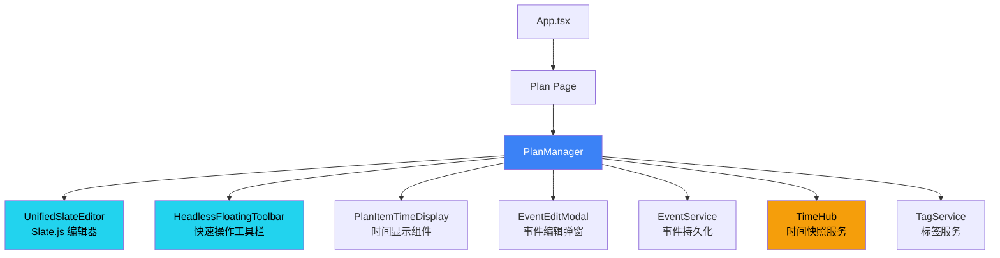
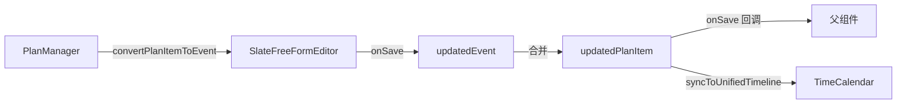

# PlanManager 模块 PRD

**模块路径**: `src/components/PlanManager.tsx`  
**代码行数**: 1641 lines  
**最后更新**: 2025-11-05  
**编写框架**: Copilot PRD Reverse Engineering Framework v1.0

---

## 1. 模块概述与定位

### 1.1 核心职责

PlanManager 是 ReMarkable 应用的 **计划项管理中心**，负责：

1. **展示与编辑计划列表**：以层级结构展示所有计划项（Plan Items）
2. **Slate.js 富文本编辑**：使用 UnifiedSlateEditor 提供现代化的编辑体验
3. **Plan ↔ Event 转换**：将计划项转换为日历事件，实现计划的时间化
4. **TimeHub 集成**：实时显示事件的起止时间和截止日期
5. **浮动工具栏**：提供快速操作（标签、Emoji、日期、优先级、颜色）
6. **双模式管理**：支持展示模式（只读）和编辑模式（可编辑）

### 1.2 在应用架构中的位置



### 1.3 与其他模块的关系

| 模块 | 关系 | 交互方式 |
|------|------|---------|
| **UnifiedSlateEditor** | 依赖 | PlanManager 使用 UnifiedSlateEditor 作为编辑器组件 |
| **TimeHub** | 订阅 | 通过 `useEventTime(itemId)` 订阅时间快照更新 |
| **EventEditModal** | 集成 | 双击计划项打开 EventEditModal 进行高级编辑 |
| **FloatingToolbar** | 依赖 | 使用 `useFloatingToolbar` hook 提供快速操作 |
| **EventService** | 调用 | 通过 `onSave`/`onDelete` 回调持久化数据 |
| **TagService** | 调用 | 获取可用标签列表、标签 ID ↔ 名称映射 |
| **TimeCalendar** | 协作 | Plan 转 Event 后在日历中显示 |

---

## 2. 核心接口与数据结构

### 2.1 PlanManagerProps

**位置**: L171-179

```typescript
export interface PlanManagerProps {
  items: Event[];                                    // 计划项列表（复用 Event 类型）
  onSave: (item: Event) => void;                     // 保存回调
  onDelete: (id: string) => void;                    // 删除回调
  availableTags?: string[];                          // 可用标签列表（可选）
  onCreateEvent?: (event: Event) => void;            // 创建事件回调（可选）
  onUpdateEvent?: (eventId: string, updates: Partial<Event>) => void; // 更新事件回调（可选）
}
```

**设计说明**：
- **复用 Event 类型**：Plan 不再是独立类型，而是 `Event` 的扩展
  - Plan 相关字段：`content`、`level`、`mode`、`emoji`、`color`、`priority`、`isCompleted`
  - Event 相关字段：`title`、`start`、`end`、`tags`、`duration`、`description`
- **回调模式**：数据持久化由父组件负责，PlanManager 只负责 UI 交互

### 2.2 Event 类型中的 Plan 字段

**位置**: `src/types.ts`

```typescript
export interface Event {
  // === 基础字段 ===
  id: string;
  title: string;
  
  // === Plan 专用字段 ===
  content?: string;                // 📝 计划项内容（富文本 HTML）
  level?: number;                  // 📊 层级深度（0=顶级，1=一级子项，2=二级子项...）
  mode?: 'edit' | 'display';       // 🎨 显示模式（edit=可编辑，display=只读）
  emoji?: string;                  // 😀 表情符号
  color?: string;                  // 🎨 颜色（十六进制，如 #3B82F6）
  priority?: number;               // ⭐ 优先级（1-5）
  isCompleted?: boolean;           // ✅ 是否已完成
  isTask?: boolean;                // 📋 是否为任务（影响时间显示逻辑）
  
  // === Event 专用字段 ===
  start?: string;                  // ⏰ 开始时间（ISO 8601）
  end?: string;                    // ⏰ 结束时间（ISO 8601）
  startTime?: Date;                // [deprecated] 使用 start
  endTime?: Date;                  // [deprecated] 使用 end
  dueDate?: Date;                  // 📅 截止日期（任务专用）
  allDay?: boolean | string;       // 🌅 是否全天事件
  isAllDay?: boolean;              // [deprecated] 使用 allDay
  
  // === 共享字段 ===
  tags?: string[];                 // 🏷️ 标签列表
  description?: string;            // 📄 描述（支持富文本）
  duration?: number;               // ⏱️ 持续时长（秒）
  
  // === Outlook 同步字段 ===
  outlookEventId?: string;
  outlookCalendarId?: string;
}
```

**关键设计**：
- `content` vs `title`：
  - `content`：Plan 模式下的富文本内容（HTML 格式）
  - `title`：Event 模式下的纯文本标题
  - 转换时互相映射（`convertPlanItemToEvent` 函数）

---

## 3. 组件架构与状态管理

### 3.1 核心状态

**位置**: L181-207

```typescript
const [selectedItemId, setSelectedItemId] = useState<string | null>(null);     // 当前选中的 Plan Item ID
const [editingItem, setEditingItem] = useState<Event | null>(null);            // 正在编辑的 Plan Item
const [showEmojiPicker, setShowEmojiPicker] = useState(false);                 // 是否显示 Emoji 选择器
const [currentSelectedTags, setCurrentSelectedTags] = useState<string[]>([]);  // 当前选中的标签 ID 列表
const currentSelectedTagsRef = useRef<string[]>([]);                           // 标签 Ref（避免闭包问题）
const [currentFocusedLineId, setCurrentFocusedLineId] = useState<string | null>(null); // 当前聚焦的行 ID
const [currentFocusedMode, setCurrentFocusedMode] = useState<'title' | 'description'>('title'); // 聚焦行的模式
const [currentIsTask, setCurrentIsTask] = useState<boolean>(false);            // 当前行是否为任务
const lastTagInsertRef = useRef<{ lineId: string; tagId: string; time: number } | null>(null); // 防抖标记
const editorRegistryRef = useRef<Map<string, any>>(new Map());                 // Tiptap 编辑器实例注册表
const [showDateMention, setShowDateMention] = useState(false);                 // 是否显示日期提及弹窗
const [showUnifiedPicker, setShowUnifiedPicker] = useState(false);             // 是否显示统一日期时间选择器
const dateAnchorRef = useRef<HTMLElement | null>(null);                        // 日期选择器锚点元素
const caretRectRef = useRef<DOMRect | null>(null);                             // 光标矩形（用于虚拟定位）
const pickerTargetItemIdRef = useRef<string | null>(null);                     // 选择器目标 Item ID
const [replacingTagElement, setReplacingTagElement] = useState<HTMLElement | null>(null); // 正在替换的标签元素
const [showTagReplace, setShowTagReplace] = useState(false);                   // 是否显示标签替换弹窗
const editorContainerRef = useRef<HTMLDivElement>(null);                       // 编辑器容器 Ref
const [activePickerIndex, setActivePickerIndex] = useState<number | null>(null); // 激活的选择器索引
```

**状态分类**：

| 类别 | 状态 | 用途 |
|------|------|------|
| **选择状态** | `selectedItemId`, `editingItem` | 管理当前选中/编辑的 Plan Item |
| **选择器状态** | `showEmojiPicker`, `showDateMention`, `showUnifiedPicker`, `showTagReplace` | 控制各种选择器的显示/隐藏 |
| **焦点状态** | `currentFocusedLineId`, `currentFocusedMode`, `currentIsTask` | 跟踪当前聚焦的行及其属性 |
| **标签状态** | `currentSelectedTags`, `currentSelectedTagsRef` | 管理当前选中的标签列表 |
| **编辑器状态** | `editorRegistryRef`, `editorContainerRef` | 管理 Tiptap 编辑器实例 |
| **锚点状态** | `dateAnchorRef`, `caretRectRef`, `pickerTargetItemIdRef` | 管理选择器的定位锚点 |
| **工具栏状态** | `activePickerIndex` | 管理浮动工具栏的激活状态 |

### 3.2 FloatingToolbar 配置

**位置**: L211-228

```typescript
const toolbarConfig: ToolbarConfig = {
  mode: 'quick-action',
  features: [], // 由 HeadlessFloatingToolbar 根据 mode 自动决定
};

const floatingToolbar = useFloatingToolbar({
  editorRef: editorContainerRef as React.RefObject<HTMLElement>,
  enabled: true,
  menuItemCount: 6, // menu_floatingbar 有 6 个菜单项
  onMenuSelect: (menuIndex: number) => {
    setActivePickerIndex(menuIndex);
    // 延迟重置，确保 HeadlessFloatingToolbar 能接收到变化
    setTimeout(() => setActivePickerIndex(null), 100);
  },
});
```

**FloatingToolbar 菜单项**：

| 索引 | 功能 | 图标 | 快捷键 |
|------|------|------|--------|
| 0 | 添加标签 | 🏷️ | `Ctrl+T` |
| 1 | 选择 Emoji | 😀 | `Ctrl+E` |
| 2 | 设置日期范围 | 📅 | `@` |
| 3 | 设置优先级 | ⭐ | `Ctrl+P` |
| 4 | 设置颜色 | 🎨 | `Ctrl+K` |
| 5 | 添加任务 | ✅ | `Ctrl+Shift+T` |

---

## 4. TimeHub 集成与时间显示

### 4.1 PlanItemTimeDisplay 组件

**位置**: L29-164

```typescript
const PlanItemTimeDisplay: React.FC<{
  item: Event;
  onEditClick: (anchor: HTMLElement) => void;
}> = ({ item, onEditClick }) => {
  // 直接使用 item.id 订阅 TimeHub
  const eventTime = useEventTime(item.id);

  const startTime = eventTime.start ? new Date(eventTime.start) : (item.startTime ? new Date(item.startTime) : null);
  const endTime = eventTime.end ? new Date(eventTime.end) : (item.endTime ? new Date(item.endTime) : null);
  const dueDate = item.dueDate ? new Date(item.dueDate) : null;
  const isAllDay = eventTime.timeSpec?.allDay ?? item.isAllDay;
  
  // ... 渲染逻辑
};
```

**核心特性**：

1. **TimeHub 订阅**：
   - 使用 `useEventTime(item.id)` hook 订阅时间快照
   - 时间变更时自动触发重新渲染
   - 避免直接读取 `item.startTime`/`item.endTime`（可能过时）

2. **调试日志**（位置: L42-52）：
   ```typescript
   useEffect(() => {
     dbg('ui', '🖼️ PlanItemTimeDisplay 快照更新', {
       itemId: item.id,
       TimeHub快照start: eventTime.start,
       TimeHub快照end: eventTime.end,
       TimeHub快照allDay: eventTime.timeSpec?.allDay,
       item本地startTime: item.startTime,
       item本地endTime: item.endTime,
       最终渲染的start: startTime?.toISOString(),
       最终渲染的end: endTime?.toISOString(),
     });
   }, [item.id, eventTime.start, eventTime.end, eventTime.timeSpec?.allDay, item.startTime, item.endTime]);
   ```

3. **时间显示优先级**：
   ```typescript
   // 优先级 1: TimeHub 快照（实时）
   eventTime.start ? new Date(eventTime.start)
   // 优先级 2: item.startTime（本地存储）
   : (item.startTime ? new Date(item.startTime) : null)
   ```

### 4.2 时间显示的 4 种模式

**位置**: L54-164

#### 模式 1: 仅截止日期（任务）

```typescript
if (!startTime && dueDate) {
  const month = dueDate.getMonth() + 1;
  const day = dueDate.getDate();
  return (
    <span style={{ color: '#6b7280', whiteSpace: 'nowrap' }}>
      截止 {month}月{day}日
    </span>
  );
}
```

**适用场景**：
- `isTask: true` 且只有 `dueDate`，没有 `start`/`end`
- 典型例子："完成报告 截止 11月10日"

#### 模式 2: 单天全天事件

```typescript
const isSingleDay = dsStart.isSame(dsEnd, 'day');
const looksLikeSingleDayAllDay = isSingleDay && startTime.getHours() === 0 && startTime.getMinutes() === 0 && endTime.getHours() === 23 && endTime.getMinutes() === 59;

if ((isAllDay && isSingleDay) || looksLikeSingleDayAllDay) {
  return (
    <span
      style={{ color: '#6b7280', whiteSpace: 'nowrap', cursor: 'pointer' }}
      onClick={(e) => {
        e.stopPropagation();
        onEditClick(e.currentTarget as HTMLElement);
      }}
    >
      {dateStr} 全天
    </span>
  );
}
```

**触发条件**：
- `isAllDay: true` 且 `start` 和 `end` 在同一天
- 或者 `start` 为 `00:00`，`end` 为 `23:59`（隐式全天）

**示例**：
- "团队建设 2025-11-10（六） 全天"

#### 模式 3: 多天全天事件

```typescript
if (isAllDay && !isSingleDay) {
  const endDateStr = dsEnd.format('YYYY-MM-DD（ddd）');
  return (
    <div style={{ display: 'flex', alignItems: 'center', gap: 0, cursor: 'pointer' }}>
      <span>{dateStr}</span>
      <div style={{ /* 渐变"全天"标签 */ }}>全天</div>
      <span>{endDateStr}</span>
    </div>
  );
}
```

**示例**：
- "年度会议 2025-11-10（六） 全天 2025-11-12（一）"

#### 模式 4: 正常时间段

```typescript
const diffMinutes = Math.max(0, Math.floor((endTime.getTime() - startTime.getTime()) / 60000));
const hours = Math.floor(diffMinutes / 60);
const minutes = diffMinutes % 60;
const durationText = hours > 0 ? (minutes > 0 ? `${hours}h${minutes}m` : `${hours}h`) : `${minutes}m`;

return (
  <div style={{ display: 'flex', alignItems: 'center', gap: 0 }}>
    <span>{dateStr} {startTimeStr}</span>
    <div style={{ /* 渐变时长标签 + 箭头 */ }}>{durationText}</div>
    <span>{endTimeStr}</span>
  </div>
);
```

**特点**：
- 显示开始时间、持续时长、结束时间
- 持续时长用渐变蓝色高亮（`22d3ee` → `3b82f6`）
- 包含箭头 SVG 图标

**示例**：
- "周会 2025-11-10（六） 14:00 [2h] → 16:00"

---

## 5. Slate 编辑器集成

### 5.1 SlateFreeFormEditor 使用

**位置**: L903-943

```typescript
<SlateFreeFormEditor
  key={editingItem.id}
  event={convertPlanItemToEvent(editingItem)}
  mode="edit"
  onClose={() => {
    setEditingItem(null);
    setShowEmojiPicker(false);
  }}
  onSave={(updatedEvent) => {
    // 合并更新
    const updatedPlanItem: Event = {
      ...editingItem,
      ...updatedEvent,
      id: editingItem.id // 保留原 ID
    };
    onSave(updatedPlanItem);
    syncToUnifiedTimeline(updatedPlanItem);
    setEditingItem(null);
  }}
/>
```

**核心特性**：

1. **key 强制重新挂载**：使用 `editingItem.id` 作为 key，确保切换不同 Plan Item 时编辑器完全重新初始化

2. **convertPlanItemToEvent 转换**（位置: L617-664）：
   ```typescript
   const convertPlanItemToEvent = (item: Event): Event => {
     return {
       ...item,
       title: item.content || item.title || '',
       description: item.description || '',
       tags: item.tags || [],
       // ... 其他字段
     };
   };
   ```

3. **onSave 合并策略**：
   - 保留 `editingItem` 的所有字段
   - 覆盖 `updatedEvent` 的变更字段
   - 强制保留原 `id`（防止 SlateFreeFormEditor 生成新 ID）

### 5.2 键盘快捷键处理

**位置**: L295-393

#### @ 键触发日期输入

```typescript
if (e.key === '@' || (e.shiftKey && e.key === '2')) {
  e.preventDefault(); // 阻止 @ 字符输入
  
  const selection = window.getSelection();
  if (selection && selection.rangeCount > 0) {
    const range = selection.getRangeAt(0);
    
    // 记录光标矩形（用于虚拟定位）
    const rect = range.getBoundingClientRect();
    if (rect) caretRectRef.current = rect;
    
    // 创建 1px 锚点 span
    const anchor = document.createElement('span');
    anchor.className = 'temp-picker-anchor';
    anchor.style.cssText = 'display: inline-block; width: 1px; height: 1px; vertical-align: text-bottom;';
    range.insertNode(anchor);
    range.setStartAfter(anchor);
    range.collapse(true);
    selection.removeAllRanges();
    selection.addRange(range);
    dateAnchorRef.current = anchor;
    
    setShowDateMention(true);
  }
}
```

**设计要点**：
- **阻止默认行为**：`e.preventDefault()` 防止输入 `@` 字符
- **虚拟定位**：记录 `caretRect` 供 Tippy 使用 `getReferenceClientRect`
- **真实锚点**：插入 1px 不可见 span，确保后续可在此位置插入日期文本

#### Ctrl+; 触发统一日期时间选择器

```typescript
if (e.ctrlKey && (e.key === ';')) {
  e.preventDefault();
  
  // 同样的锚点创建逻辑...
  
  // 记录目标 itemId
  if (currentFocusedLineId) {
    pickerTargetItemIdRef.current = currentFocusedLineId.replace('-desc','');
  }
  setShowUnifiedPicker(true);
}
```

**与 @ 键的区别**：
- `@` 键：快速插入日期提及（如 `11月10日`）
- `Ctrl+;`：打开完整的日期时间选择器（可设置 `start`/`end`/`allDay`）

---

## 6. Plan ↔ Event 转换机制

### 6.1 转换函数

#### convertPlanItemToEvent（Plan → Event）

**位置**: L617-664

```typescript
const convertPlanItemToEvent = (item: Event): Event => {
  return {
    ...item,
    title: item.content || item.title || '',
    description: item.description || '',
    tags: item.tags || [],
    start: item.start || (item.startTime ? item.startTime.toISOString() : undefined),
    end: item.end || (item.endTime ? item.endTime.toISOString() : undefined),
    allDay: item.allDay ?? item.isAllDay ?? false,
    duration: item.duration || 0,
    
    // 保留 Plan 专用字段
    content: item.content,
    level: item.level,
    mode: item.mode,
    emoji: item.emoji,
    color: item.color,
    priority: item.priority,
    isCompleted: item.isCompleted,
    isTask: item.isTask,
    
    // Outlook 字段
    outlookEventId: item.outlookEventId,
    outlookCalendarId: item.outlookCalendarId,
  };
};
```

**映射规则**：

| Plan 字段 | Event 字段 | 转换逻辑 |
|-----------|-----------|---------|
| `content` | `title` | `content` → `title`（富文本转纯文本） |
| `startTime` | `start` | `Date` → ISO 8601 string |
| `endTime` | `end` | `Date` → ISO 8601 string |
| `isAllDay` | `allDay` | 布尔值保留 |
| `level`, `mode`, `emoji` 等 | 保留 | 原样传递（Event 支持这些字段） |

#### Event → Plan（逆向转换）

**位置**: L923-935（onSave 回调中）

```typescript
const updatedPlanItem: Event = {
  ...editingItem,        // 保留原 Plan 字段
  ...updatedEvent,       // 覆盖更新的 Event 字段
  id: editingItem.id     // 强制保留原 ID
};
```

**关键设计**：
- 使用展开运算符合并
- 优先级：`updatedEvent` > `editingItem`
- `id` 字段强制保留（防止 SlateFreeFormEditor 生成新 ID）

### 6.2 同步到统一时间线

**位置**: L666-724

```typescript
const syncToUnifiedTimeline = useCallback((planItem: Event) => {
  if (!onUpdateEvent) return;
  
  // 如果 Plan Item 有起止时间，同步到 Event
  if (planItem.start && planItem.end) {
    onUpdateEvent(planItem.id, {
      start: planItem.start,
      end: planItem.end,
      title: planItem.content || planItem.title,
      tags: planItem.tags,
      description: planItem.description,
      allDay: planItem.allDay,
      // ... 其他字段
    });
  }
}, [onUpdateEvent]);
```

**触发时机**：
- 用户在 SlateFreeFormEditor 中设置了时间
- 用户点击"添加到日历"按钮
- 用户通过 UnifiedDateTimePicker 设置了时间

**数据流**：


---

## 待续...

**下一部分将包含**：
- Section 7: 浮动工具栏集成（6 个菜单项的详细实现）
- Section 8: 标签管理与插入（防抖、编辑器注册、光标定位）
- Section 9: 日期提及与日期时间选择器
- Section 10: UI 渲染与样式（层级缩进、完成状态、优先级显示）
- Section 11: 已发现问题与优化建议

---

**代码位置总结（Part 1）**：

| 功能模块 | 文件 | 行号 | 关键函数/组件 |
|----------|------|------|---------------|
| **Props 定义** | `PlanManager.tsx` | L171-179 | PlanManagerProps |
| **核心状态** | `PlanManager.tsx` | L181-207 | 21个 useState + useRef |
| **FloatingToolbar 配置** | `PlanManager.tsx` | L211-228 | toolbarConfig, useFloatingToolbar |
| **TimeHub 订阅** | `PlanManager.tsx` | L29-164 | PlanItemTimeDisplay 组件 |
| **时间显示 - 截止日期** | `PlanManager.tsx` | L54-62 | 任务模式 |
| **时间显示 - 单天全天** | `PlanManager.tsx` | L83-95 | isAllDay 判断 |
| **时间显示 - 多天全天** | `PlanManager.tsx` | L98-113 | 渐变标签 |
| **时间显示 - 正常时间** | `PlanManager.tsx` | L116-157 | 持续时长 + 箭头 |
| **Slate 编辑器集成** | `PlanManager.tsx` | L903-943 | SlateFreeFormEditor |
| **@ 键快捷键** | `PlanManager.tsx` | L295-335 | 日期提及触发 |
| **Ctrl+; 快捷键** | `PlanManager.tsx` | L338-363 | 统一日期时间选择器 |
| **Plan → Event 转换** | `PlanManager.tsx` | L617-664 | convertPlanItemToEvent() |
| **同步到时间线** | `PlanManager.tsx` | L666-724 | syncToUnifiedTimeline() |
