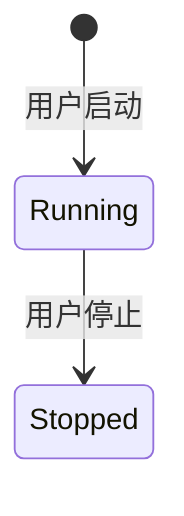
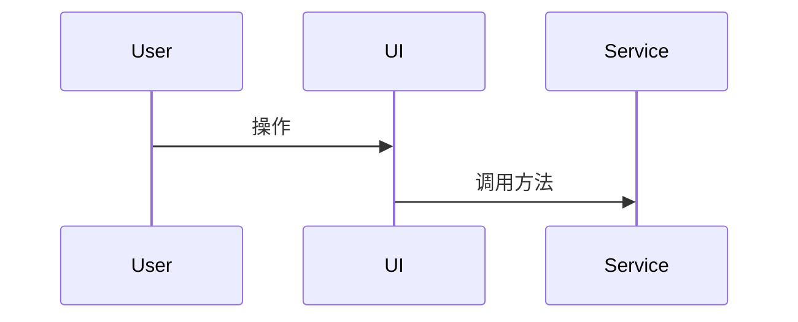

# ReMarkable 产品需求文档 (PRD) 目录

> **文档类型**: 产品需求文档集合  
> **最后更新**: 2025-11-05  
> **维护者**: GitHub Copilot  
> **生成框架**: [Copilot 驱动的 PRD 逆向工程与维护框架 v1.0](../architecture/Copilot%20驱动的%20PRD%20逆向工程与维护框架%20v1.0.md)

---

## 📋 文档清单

### 核心模块

| 文档 | 状态 | 描述 | 最后更新 |
|------|------|------|----------|
| [**同步机制 PRD**](./SYNC_MECHANISM_PRD.md) | ✅ 完成 | ActionBasedSyncManager、MicrosoftCalendarService、EventService 的完整同步架构 | 2025-11-05 |
| [**Timer 模块 PRD**](./TIMER_MODULE_PRD.md) | ✅ 完成 | 计时器生命周期、状态管理、与同步机制的集成 | 2025-11-05 |
| [**TimeCalendar 模块 PRD**](./TIMECALENDAR_MODULE_PRD.md) | 🚧 计划中 | 日历视图、事件 CRUD、拖拽编辑、与 Timer 的交互 | - |
| [**TagManager 模块 PRD**](./TAGMANAGER_MODULE_PRD.md) | 🚧 计划中 | 层级标签管理、日历映射、标签删除规则 | - |
| [**PlanManager 模块 PRD**](./PLANMANAGER_MODULE_PRD.md) | 🚧 计划中 | 计划项管理、与事件的关联、同步机制 | - |

---

## 🏗️ 文档架构

```
docs/
├── PRD/                          # 产品需求文档（本目录）
│   ├── README.md                 # 📋 文档目录（本文件）
│   ├── SYNC_MECHANISM_PRD.md     # 🔄 同步机制 PRD
│   ├── TIMER_MODULE_PRD.md       # ⏱️ Timer 模块 PRD
│   ├── TIMECALENDAR_MODULE_PRD.md # 📅 TimeCalendar 模块 PRD（待编写）
│   ├── TAGMANAGER_MODULE_PRD.md  # 🏷️ TagManager 模块 PRD（待编写）
│   └── PLANMANAGER_MODULE_PRD.md # 📝 PlanManager 模块 PRD（待编写）
│
├── architecture/                 # 技术架构文档
│   ├── Copilot 驱动的 PRD 逆向工程与维护框架 v1.0.md
│   ├── EventService-Architecture.md
│   ├── Sync-Architecture.md
│   └── ...
│
└── features/                     # 功能特性文档
    ├── FLOATING_BAR_SMART_ASSOCIATION.md
    ├── PLAN_EDITOR_QUICKSTART.md
    └── ...
```

---

## 📖 文档使用指南

### 1. 阅读顺序

**首次阅读推荐顺序**:

```
1. 同步机制 PRD（核心基础）
   ↓
2. Timer 模块 PRD（理解事件创建流程）
   ↓
3. TimeCalendar 模块 PRD（理解事件展示与编辑）
   ↓
4. TagManager 模块 PRD（理解标签与日历映射）
   ↓
5. PlanManager 模块 PRD（理解计划与事件的关联）
```

**按功能阅读**:
- 想了解计时功能 → **Timer 模块 PRD**
- 想了解日历视图 → **TimeCalendar 模块 PRD**
- 想了解同步原理 → **同步机制 PRD**
- 想了解标签系统 → **TagManager 模块 PRD**

### 2. 文档约定

#### 2.1 代码位置标注

所有代码引用都使用以下格式：

```
**代码位置**: `src/services/ActionBasedSyncManager.ts` L1021-1078
```

#### 2.2 状态转换图

使用 Mermaid 绘制状态机：



#### 2.3 序列图

使用 Mermaid 绘制交互流程：



#### 2.4 关联文档引用

使用相对路径引用其他文档：

```markdown
详见 [同步机制 PRD - 7.4 Timer 事件去重](./SYNC_MECHANISM_PRD.md#74-timer-事件去重)
```

### 3. 维护规范

#### 3.1 新增模块 PRD

1. 在本目录创建新的 PRD 文档
2. 更新本 README 的文档清单
3. 按照框架模板编写内容
4. 回顾并更新其他相关 PRD 的关联章节

#### 3.2 更新现有 PRD

1. 在文档顶部更新"最后更新"时间
2. 如果有重大变更，在文档末尾添加"变更日志"章节
3. 更新本 README 的"最后更新"列
4. 检查关联文档是否需要同步更新

#### 3.3 删除/归档 PRD

⚠️ **不要直接删除 PRD 文档！**

如果模块已废弃：
1. 将文档移动到 `docs/PRD/archived/` 目录
2. 在文档顶部添加"已废弃"标记
3. 更新本 README，标记为"🗄️ 已归档"
4. 保留至少 6 个月后再考虑删除

---

## 🔗 相关资源

### 内部文档

- [技术架构文档](../architecture/)
- [功能特性文档](../features/)
- [用户指南](../user-guide.md)
- [开发指南](../v1.0-development-guide.md)

### 外部资源

- [Microsoft Graph API 文档](https://docs.microsoft.com/en-us/graph/)
- [FullCalendar 文档](https://fullcalendar.io/docs)
- [Electron 文档](https://www.electronjs.org/docs)

---

## 📊 文档统计

| 指标 | 数值 |
|------|------|
| 总文档数 | 2 / 5 |
| 已完成 | 2 |
| 进行中 | 0 |
| 计划中 | 3 |
| 总字数 | ~15,000 |
| 总代码示例 | ~50 |

---

## 🤝 贡献指南

### 如何贡献

1. **发现错误**: 在相关 PRD 文档中直接修改，并在文档末尾添加变更说明
2. **补充内容**: 按照现有章节结构添加内容
3. **新增模块**: 按照 [PRD 逆向工程框架](../architecture/Copilot%20驱动的%20PRD%20逆向工程与维护框架%20v1.0.md) 创建新文档

### AI 使用指南

如果使用 GitHub Copilot 或其他 AI 助手维护 PRD：

```
指令模板:
"请按照 docs/PRD/README.md 的规范，更新 [模块名] PRD 的 [章节名] 部分，
新增内容：[具体描述]"
```

---

**文档版本**: v1.0  
**创建日期**: 2025-11-05  
**维护者**: GitHub Copilot  
**框架版本**: Copilot 驱动的 PRD 逆向工程与维护框架 v1.0
