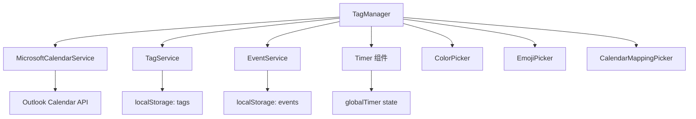

# TagManager 模块产品需求文档 (PRD)

**文档版本**: v1.0  
**最后更新**: 2025-11-05  
**文件位置**: `src/components/TagManager.tsx` (2555 lines)  
**框架**: Copilot PRD Reverse Engineering Framework v1.0

---

## 目录

- [1. 模块概述](#1-模块概述)
- [2. 核心接口与数据结构](#2-核心接口与数据结构)
- [3. 组件架构与状态管理](#3-组件架构与状态管理)
- [4. 持久化系统](#4-持久化系统)
- [5. 层级标签系统](#5-层级标签系统)
- [待续...](#待续)

---

## 1. 模块概述

### 1.1 模块定位

**TagManager** 是 ReMarkable 应用的**层级标签管理中心**，提供标签的创建、编辑、删除、排序、日历映射等全生命周期管理功能。

**核心职责**：
- 📂 **层级标签树管理**：支持无限层级（实际限制为父标签层级+1）
- 🎨 **可视化定制**：颜色、Emoji、名称、日历映射
- 🔢 **数据统计**：打卡次数、日均时长、递归事件分析
- ⌨️ **键盘优先交互**：Tab缩进、Enter新建、Shift+Alt+↑↓移动
- 📋 **批量操作**：复制/剪切/粘贴、批量日历映射、批量删除
- 💾 **持久化存储**：localStorage + 自动迁移

### 1.2 模块依赖



**依赖说明**：
- **MicrosoftCalendarService**: 获取可用日历列表，用于日历映射
- **TagService**: 标签 CRUD 操作的底层服务（未在代码中直接使用，通过 localStorage）
- **EventService**: 查询标签关联的事件，用于统计分析
- **globalTimer**: 实时显示计时器状态（tagId、isRunning、elapsedTime）
- **选择器组件**: ColorPicker、EmojiPicker（emoji-mart）、CalendarMappingPicker

### 1.3 使用场景

| 场景 | 用户操作 | 触发功能 |
|------|----------|----------|
| **快速建标签** | 点击底部灰色提示文字 | 创建新的一级标签 |
| **层级组织** | 按 Tab 键增加缩进 | 标签变为子标签，自动计算父标签 |
| **批量整理** | 选中多个标签，Ctrl+X 剪切 | 移动标签到新位置，保留 ID |
| **日历自动化** | 为 "工作" 标签映射到 Work Calendar | 后续事件选择该标签时自动同步到对应日历 |
| **打卡统计** | 点击打卡图标 | 增加 checkinCount，显示日均频率 |
| **实时计时** | 点击计时图标 | 启动 Timer，显示实时计时 |

---

## 2. 核心接口与数据结构

### 2.1 ExtendedHierarchicalTag 接口

**位置**: L1-32

```typescript
interface ExtendedHierarchicalTag extends HierarchicalTag {
  id: string;                    // 唯一标识符
  name: string;                  // 标签名称
  color: string;                 // 十六进制颜色 (如 "#3b82f6")
  emoji?: string;                // Emoji 表情（可选）
  
  // 🔹 层级系统字段
  level?: number;                // 层级深度 (0=顶级, 1=子级, ...)
  parentId?: string;             // 父标签 ID（顶级标签为 undefined）
  position?: number;             // 排序位置（用于维护显示顺序）
  
  // 🔹 日历映射
  calendarMapping?: {
    calendarId: string;          // Outlook Calendar ID
    calendarName: string;        // 显示名称（如 "Outlook: 工作日历"）
    color?: string;              // 日历颜色（继承自 Outlook）
  };
  
  // 🔹 统计数据
  dailyAvgCheckins?: number;     // 日均打卡次数
  dailyAvgDuration?: number;     // 日均时长（分钟）
  isRecurring?: boolean;         // 是否为递归事件（未来功能）
}
```

**字段设计说明**：

| 字段 | 必填 | 默认值 | 用途 |
|------|------|--------|------|
| `level` | ✅ | `0` | 控制缩进样式 `paddingLeft: ${level * 20}px` |
| `parentId` | ❌ | `undefined` | 用于 Tab 缩进时查找父标签 |
| `position` | ✅ | `index` | 排序依据，所有移动操作更新此字段 |
| `calendarMapping` | ❌ | `undefined` | 创建事件时自动填充 `outlookCalendarId` |
| `dailyAvgCheckins` | ❌ | `0` | 显示在打卡按钮旁边 |
| `dailyAvgDuration` | ❌ | `150` (2.5h) | 显示在计时按钮旁边 |

### 2.2 TagManagerProps 接口

**位置**: L34-50

```typescript
interface TagManagerProps {
  // 🔹 服务依赖
  microsoftService?: MicrosoftCalendarService;
  tagService?: any;
  availableCalendars?: Array<{
    id: string;
    name: string;
    color?: string;
  }>;
  
  // 🔹 计时器状态（来自父组件）
  globalTimer?: {
    tagId: string;
    isRunning: boolean;
    startTime: number;
    elapsedTime: number;
    status: 'running' | 'paused' | 'stopped';
  };
  
  // 🔹 回调函数
  onTagsChange?: (tags: ExtendedHierarchicalTag[]) => void;
  onTimerStart?: (tagId: string) => void;
  onTimerPause?: () => void;
  onTimerResume?: () => void;
}
```

**Props 使用说明**：
- **microsoftService**: 用于获取 Outlook 日历列表（L1154-1186 `getDefaultCalendarMapping`）
- **globalTimer**: 用于实时显示计时器状态（L2195-2226，每秒更新 UI）
- **onTagsChange**: 标签变更时通知父组件（L273-298，100ms 防抖）
- **onTimerStart/Pause/Resume**: 委托父组件管理全局 Timer 状态

---

## 3. 组件架构与状态管理

### 3.1 状态声明概览

**位置**: L52-175

TagManager 使用 React Hooks 管理以下核心状态：

```typescript
// 🔹 标签数据
const [tags, setTags] = useState<ExtendedHierarchicalTag[]>([]);
const [checkinCounts, setCheckinCounts] = useState<{ [tagId: string]: number }>({});

// 🔹 UI 交互状态
const [newTagId, setNewTagId] = useState<string | null>(null);          // 新建标签 ID
const [isCreatingNewTag, setIsCreatingNewTag] = useState(false);        // 创建模式标志
const [userClickedGrayText, setUserClickedGrayText] = useState(false);  // 意图检测

// 🔹 选择器状态
const [showColorPicker, setShowColorPicker] = useState({
  show: false,
  tagId: '',
  position: { x: 0, y: 0 }
});
const [showEmojiPicker, setShowEmojiPicker] = useState({
  show: false,
  tagId: '',
  position: { x: 0, y: 0 }
});
const [showCalendarPicker, setShowCalendarPicker] = useState({
  show: false,
  tagId: '',                    // 支持 "batch:id1,id2,id3" 格式
  position: { x: 0, y: 0 }
});

// 🔹 拖拽状态（Emoji 选择器）
const [isDragging, setIsDragging] = useState(false);
const [dragOffset, setDragOffset] = useState({ x: 0, y: 0 });

// 🔹 Hover 与选中状态
const [hoveredTagId, setHoveredTagId] = useState<string | null>(null);
const [selectedTagIds, setSelectedTagIds] = useState<string[]>([]);     // 批量操作
```

**状态分类**：
1. **数据状态** (`tags`, `checkinCounts`): 持久化到 localStorage
2. **临时状态** (`newTagId`, `isCreatingNewTag`): 仅在创建流程中使用
3. **选择器状态** (三个 Picker): 控制浮层显示位置
4. **交互状态** (`hoveredTagId`, `selectedTagIds`): 用于 UI 反馈

### 3.2 位置计算工具函数

**位置**: L135-161

```typescript
const calculateOptimalPosition = (rect: DOMRect) => {
  const viewportWidth = window.innerWidth;
  const viewportHeight = window.innerHeight;
  const scrollY = window.scrollY;
  
  const pickerWidth = 352;  // Emoji 选择器宽度
  const pickerHeight = 435; // Emoji 选择器高度
  
  let x = rect.left;
  let y = rect.bottom + 5;  // 默认在元素下方
  
  // 右边界检查
  if (x + pickerWidth > viewportWidth) {
    x = viewportWidth - pickerWidth - 10;
  }
  
  // 下边界检查
  if (y + pickerHeight > viewportHeight + scrollY) {
    y = rect.top - pickerHeight - 5; // 在元素上方显示
  }
  
  // 上边界检查
  if (y < scrollY + 10) {
    y = scrollY + 10;
  }
  
  return { x, y };
};
```

**使用场景**：
- 点击 Emoji 按钮时调用（L360-369）
- 自动处理边界溢出，优先下方显示，不足时切换到上方
- 支持滚动场景（考虑 `scrollY` 偏移）

---

## 4. 持久化系统

### 4.1 持久化工具函数

**位置**: L1-32（文件头部）

```typescript
// 🔹 保存标签到 localStorage
const saveTagsToStorage = (tags: ExtendedHierarchicalTag[]) => {
  try {
    localStorage.setItem('hierarchicalTags', JSON.stringify(tags));
    TagManagerLogger.log('✅ Tags saved to storage:', tags.length);
  } catch (error) {
    TagManagerLogger.error('❌ Failed to save tags:', error);
  }
};

// 🔹 从 localStorage 加载标签
const loadTagsFromStorage = (): ExtendedHierarchicalTag[] => {
  try {
    const saved = localStorage.getItem('hierarchicalTags');
    if (!saved) return [];
    
    const tags = JSON.parse(saved);
    TagManagerLogger.log('📥 Tags loaded from storage:', tags.length);
    return tags;
  } catch (error) {
    TagManagerLogger.error('❌ Failed to load tags:', error);
    return [];
  }
};

// 🔹 保存打卡计数
const saveCheckinCountsToStorage = (counts: { [tagId: string]: number }) => {
  localStorage.setItem('tagCheckinCounts', JSON.stringify(counts));
};

// 🔹 加载打卡计数
const loadCheckinCountsFromStorage = (): { [tagId: string]: number } => {
  try {
    const saved = localStorage.getItem('tagCheckinCounts');
    return saved ? JSON.parse(saved) : {};
  } catch (error) {
    return {};
  }
};
```

### 4.2 初始化与数据迁移

**位置**: L178-256

```typescript
useEffect(() => {
  const startTime = performance.now();
  TagManagerLogger.log('🚀 [TagManager] Component initializing...');
  
  const savedTags = loadTagsFromStorage();
  const savedCounts = loadCheckinCountsFromStorage();
  
  TagManagerLogger.log(`📦 [TagManager] Loaded ${savedTags.length} tags from storage`);
  
  // 🔹 智能迁移：根据 parentId 关系计算 level 层级
  const calculateTagLevel = (
    tag: ExtendedHierarchicalTag, 
    allTags: ExtendedHierarchicalTag[], 
    visited = new Set<string>()
  ): number => {
    // 如果已经有 level，直接返回
    if (tag.level !== undefined) {
      return tag.level;
    }
    
    // 如果没有 parentId，是顶级标签
    if (!tag.parentId) {
      return 0;
    }
    
    // 防止循环引用
    if (visited.has(tag.id)) {
      TagManagerLogger.warn('⚠️ 检测到循环引用:', tag.id, tag.name);
      return 0;
    }
    visited.add(tag.id);
    
    // 找到父标签
    const parent = allTags.find(t => t.id === tag.parentId);
    if (!parent) {
      TagManagerLogger.warn('⚠️ 找不到父标签:', tag.parentId, '对于标签:', tag.name);
      return 0;
    }
    
    // 递归计算父标签的 level，然后 +1
    return calculateTagLevel(parent, allTags, visited) + 1;
  };
  
  // 为所有标签计算 level
  const migratedTags = savedTags.map((tag, index) => ({
    ...tag,
    level: calculateTagLevel(tag, savedTags),
    parentId: tag.parentId || undefined,
    position: tag.position !== undefined ? tag.position : index
  }));
  
  // 🔹 诊断：输出所有标签的层级信息
  TagManagerLogger.log('📊 [TagManager] 标签层级信息:');
  console.table(migratedTags.map(tag => ({
    name: tag.name,
    level: tag.level,
    position: tag.position,
    parentId: tag.parentId || '(无)',
    hasLevel: tag.level !== undefined
  })));
  
  // 🔹 如果有标签的 level 被计算出来了，或者 position 被初始化了，保存回存储（一次性迁移）
  const hasLevelCalculated = migratedTags.some(tag => 
    tag.level !== undefined && tag.level > 0 && 
    savedTags.find(t => t.id === tag.id && t.level === undefined)
  );
  const hasPositionInitialized = migratedTags.some(tag =>
    tag.position !== undefined && 
    savedTags.find(t => t.id === tag.id && t.position === undefined)
  );
  
  if (hasLevelCalculated || hasPositionInitialized) {
    TagManagerLogger.log('💾 [TagManager] Saving calculated levels and positions to storage...');
    saveTagsToStorage(migratedTags);
  }
  
  setTags(migratedTags);
  setCheckinCounts(savedCounts);
  
  const duration = performance.now() - startTime;
  TagManagerLogger.log(`✅ [TagManager] Initialized in ${duration.toFixed(2)}ms`);
}, []);
```

**迁移策略说明**：
1. **自动 level 计算**：如果标签有 `parentId` 但没有 `level`，递归查找父标签并计算层级
2. **循环引用检测**：使用 `visited Set` 防止无限递归
3. **position 补全**：如果 `position` 缺失，使用数组索引作为默认值
4. **一次性迁移**：检测到数据升级后自动保存，避免重复计算

### 4.3 自动保存机制

**位置**: L258-271

```typescript
// 🔹 自动保存标签数据到 localStorage
useEffect(() => {
  if (tags.length > 0) {
    saveTagsToStorage(tags);
  }
}, [tags]);

// 🔹 自动保存打卡计数到 localStorage
useEffect(() => {
  if (Object.keys(checkinCounts).length > 0) {
    saveCheckinCountsToStorage(checkinCounts);
  }
}, [checkinCounts]);
```

**注意事项**：
- 仅在数据非空时保存，避免清空 localStorage
- 依赖 React 的批量更新机制，不会频繁触发

---

## 5. 层级标签系统

### 5.1 层级计算核心算法

**已在 4.2 节详述**，核心逻辑：
- **递归查找父标签**：`calculateTagLevel(parent, allTags, visited) + 1`
- **防御性编程**：处理循环引用、缺失父标签、未定义 level
- **自动修复**：检测到数据不一致时自动计算并保存

### 5.2 层级显示

**位置**: L2000-2100（UI 渲染部分）

```typescript
{tags
  .sort((a, b) => (a.position || 0) - (b.position || 0))
  .map((tag, index) => (
    <div key={tag.id} style={{
      display: 'flex',
      alignItems: 'center',
      paddingLeft: `${(tag.level || 0) * 20}px`,  // 🔹 每级缩进 20px
      // ...其他样式
    }}>
      {/* 标签内容 */}
    </div>
  ))
}
```

**缩进规则**：
- `level 0` (顶级): `paddingLeft: 0px`
- `level 1` (子级): `paddingLeft: 20px`
- `level 2` (孙级): `paddingLeft: 40px`
- 依此类推...

---

## 待续...

**下一部分将包含**：
- Section 6: 标签 CRUD 操作（创建、编辑、删除、移动）
- Section 7: 键盘快捷键系统（Tab、Enter、Esc、Shift+Alt+↑↓）
- Section 8: 批量操作（复制/剪切/粘贴、批量日历映射）
- Section 9: 选择器系统（颜色、Emoji、日历）
- Section 10: 日历映射与统计
- Section 11: UI 渲染与样式细节
- Section 12: 已发现问题汇总

---

**代码位置总结（Part 1）**：

| 功能 | 文件 | 行号 | 关键函数/状态 |
|------|------|------|---------------|
| 接口定义 | `TagManager.tsx` | L1-50 | ExtendedHierarchicalTag, TagManagerProps |
| 状态声明 | `TagManager.tsx` | L52-175 | useState hooks |
| 位置计算 | `TagManager.tsx` | L135-161 | calculateOptimalPosition() |
| 持久化工具 | `TagManager.tsx` | L1-32 | saveTagsToStorage, loadTagsFromStorage |
| 初始化迁移 | `TagManager.tsx` | L178-256 | useEffect + calculateTagLevel |
| 自动保存 | `TagManager.tsx` | L258-271 | useEffect(tags), useEffect(checkinCounts) |
| 层级显示 | `TagManager.tsx` | L2000-2100 | paddingLeft: level * 20px |

