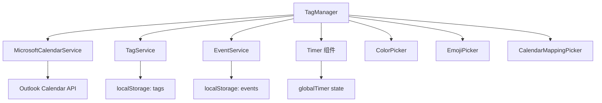

# TagManager 模块产品需求文档 (PRD)

**文档版本**: v1.0  
**最后更新**: 2025-11-05  
**文件位置**: `src/components/TagManager.tsx` (2555 lines)  
**框架**: Copilot PRD Reverse Engineering Framework v1.0

---

## 目录

- [1. 模块概述](#1-模块概述)
- [2. 核心接口与数据结构](#2-核心接口与数据结构)
- [3. 组件架构与状态管理](#3-组件架构与状态管理)
- [4. 持久化系统](#4-持久化系统)
- [5. 层级标签系统](#5-层级标签系统)
- [待续...](#待续)

---

## 1. 模块概述

### 1.1 模块定位

**TagManager** 是 ReMarkable 应用的**层级标签管理中心**，提供标签的创建、编辑、删除、排序、日历映射等全生命周期管理功能。

**核心职责**：
- 📂 **层级标签树管理**：支持无限层级（实际限制为父标签层级+1）
- 🎨 **可视化定制**：颜色、Emoji、名称、日历映射
- 🔢 **数据统计**：打卡次数、日均时长、递归事件分析
- ⌨️ **键盘优先交互**：Tab缩进、Enter新建、Shift+Alt+↑↓移动
- 📋 **批量操作**：复制/剪切/粘贴、批量日历映射、批量删除
- 💾 **持久化存储**：localStorage + 自动迁移

### 1.2 模块依赖



**依赖说明**：
- **MicrosoftCalendarService**: 获取可用日历列表，用于日历映射
- **TagService**: 标签 CRUD 操作的底层服务（未在代码中直接使用，通过 localStorage）
- **EventService**: 查询标签关联的事件，用于统计分析
- **globalTimer**: 实时显示计时器状态（tagId、isRunning、elapsedTime）
- **选择器组件**: ColorPicker、EmojiPicker（emoji-mart）、CalendarMappingPicker

### 1.3 使用场景

| 场景 | 用户操作 | 触发功能 |
|------|----------|----------|
| **快速建标签** | 点击底部灰色提示文字 | 创建新的一级标签 |
| **层级组织** | 按 Tab 键增加缩进 | 标签变为子标签，自动计算父标签 |
| **批量整理** | 选中多个标签，Ctrl+X 剪切 | 移动标签到新位置，保留 ID |
| **日历自动化** | 为 "工作" 标签映射到 Work Calendar | 后续事件选择该标签时自动同步到对应日历 |
| **打卡统计** | 点击打卡图标 | 增加 checkinCount，显示日均频率 |
| **实时计时** | 点击计时图标 | 启动 Timer，显示实时计时 |

---

## 2. 核心接口与数据结构

### 2.1 ExtendedHierarchicalTag 接口

**位置**: L1-32

```typescript
interface ExtendedHierarchicalTag extends HierarchicalTag {
  id: string;                    // 唯一标识符
  name: string;                  // 标签名称
  color: string;                 // 十六进制颜色 (如 "#3b82f6")
  emoji?: string;                // Emoji 表情（可选）
  
  // 🔹 层级系统字段
  level?: number;                // 层级深度 (0=顶级, 1=子级, ...)
  parentId?: string;             // 父标签 ID（顶级标签为 undefined）
  position?: number;             // 排序位置（用于维护显示顺序）
  
  // 🔹 日历映射
  calendarMapping?: {
    calendarId: string;          // Outlook Calendar ID
    calendarName: string;        // 显示名称（如 "Outlook: 工作日历"）
    color?: string;              // 日历颜色（继承自 Outlook）
  };
  
  // 🔹 统计数据
  dailyAvgCheckins?: number;     // 日均打卡次数
  dailyAvgDuration?: number;     // 日均时长（分钟）
  isRecurring?: boolean;         // 是否为递归事件（未来功能）
}
```

**字段设计说明**：

| 字段 | 必填 | 默认值 | 用途 |
|------|------|--------|------|
| `level` | ✅ | `0` | 控制缩进样式 `paddingLeft: ${level * 20}px` |
| `parentId` | ❌ | `undefined` | 用于 Tab 缩进时查找父标签 |
| `position` | ✅ | `index` | 排序依据，所有移动操作更新此字段 |
| `calendarMapping` | ❌ | `undefined` | 创建事件时自动填充 `outlookCalendarId` |
| `dailyAvgCheckins` | ❌ | `0` | 显示在打卡按钮旁边 |
| `dailyAvgDuration` | ❌ | `150` (2.5h) | 显示在计时按钮旁边 |

### 2.2 TagManagerProps 接口

**位置**: L34-50

```typescript
interface TagManagerProps {
  // 🔹 服务依赖
  microsoftService?: MicrosoftCalendarService;
  tagService?: any;
  availableCalendars?: Array<{
    id: string;
    name: string;
    color?: string;
  }>;
  
  // 🔹 计时器状态（来自父组件）
  globalTimer?: {
    tagId: string;
    isRunning: boolean;
    startTime: number;
    elapsedTime: number;
    status: 'running' | 'paused' | 'stopped';
  };
  
  // 🔹 回调函数
  onTagsChange?: (tags: ExtendedHierarchicalTag[]) => void;
  onTimerStart?: (tagId: string) => void;
  onTimerPause?: () => void;
  onTimerResume?: () => void;
}
```

**Props 使用说明**：
- **microsoftService**: 用于获取 Outlook 日历列表（L1154-1186 `getDefaultCalendarMapping`）
- **globalTimer**: 用于实时显示计时器状态（L2195-2226，每秒更新 UI）
- **onTagsChange**: 标签变更时通知父组件（L273-298，100ms 防抖）
- **onTimerStart/Pause/Resume**: 委托父组件管理全局 Timer 状态

---

## 3. 组件架构与状态管理

### 3.1 状态声明概览

**位置**: L52-175

TagManager 使用 React Hooks 管理以下核心状态：

```typescript
// 🔹 标签数据
const [tags, setTags] = useState<ExtendedHierarchicalTag[]>([]);
const [checkinCounts, setCheckinCounts] = useState<{ [tagId: string]: number }>({});

// 🔹 UI 交互状态
const [newTagId, setNewTagId] = useState<string | null>(null);          // 新建标签 ID
const [isCreatingNewTag, setIsCreatingNewTag] = useState(false);        // 创建模式标志
const [userClickedGrayText, setUserClickedGrayText] = useState(false);  // 意图检测

// 🔹 选择器状态
const [showColorPicker, setShowColorPicker] = useState({
  show: false,
  tagId: '',
  position: { x: 0, y: 0 }
});
const [showEmojiPicker, setShowEmojiPicker] = useState({
  show: false,
  tagId: '',
  position: { x: 0, y: 0 }
});
const [showCalendarPicker, setShowCalendarPicker] = useState({
  show: false,
  tagId: '',                    // 支持 "batch:id1,id2,id3" 格式
  position: { x: 0, y: 0 }
});

// 🔹 拖拽状态（Emoji 选择器）
const [isDragging, setIsDragging] = useState(false);
const [dragOffset, setDragOffset] = useState({ x: 0, y: 0 });

// 🔹 Hover 与选中状态
const [hoveredTagId, setHoveredTagId] = useState<string | null>(null);
const [selectedTagIds, setSelectedTagIds] = useState<string[]>([]);     // 批量操作
```

**状态分类**：
1. **数据状态** (`tags`, `checkinCounts`): 持久化到 localStorage
2. **临时状态** (`newTagId`, `isCreatingNewTag`): 仅在创建流程中使用
3. **选择器状态** (三个 Picker): 控制浮层显示位置
4. **交互状态** (`hoveredTagId`, `selectedTagIds`): 用于 UI 反馈

### 3.2 位置计算工具函数

**位置**: L135-161

```typescript
const calculateOptimalPosition = (rect: DOMRect) => {
  const viewportWidth = window.innerWidth;
  const viewportHeight = window.innerHeight;
  const scrollY = window.scrollY;
  
  const pickerWidth = 352;  // Emoji 选择器宽度
  const pickerHeight = 435; // Emoji 选择器高度
  
  let x = rect.left;
  let y = rect.bottom + 5;  // 默认在元素下方
  
  // 右边界检查
  if (x + pickerWidth > viewportWidth) {
    x = viewportWidth - pickerWidth - 10;
  }
  
  // 下边界检查
  if (y + pickerHeight > viewportHeight + scrollY) {
    y = rect.top - pickerHeight - 5; // 在元素上方显示
  }
  
  // 上边界检查
  if (y < scrollY + 10) {
    y = scrollY + 10;
  }
  
  return { x, y };
};
```

**使用场景**：
- 点击 Emoji 按钮时调用（L360-369）
- 自动处理边界溢出，优先下方显示，不足时切换到上方
- 支持滚动场景（考虑 `scrollY` 偏移）

---

## 4. 持久化系统

### 4.1 持久化工具函数

**位置**: L1-32（文件头部）

```typescript
// 🔹 保存标签到 localStorage
const saveTagsToStorage = (tags: ExtendedHierarchicalTag[]) => {
  try {
    localStorage.setItem('hierarchicalTags', JSON.stringify(tags));
    TagManagerLogger.log('✅ Tags saved to storage:', tags.length);
  } catch (error) {
    TagManagerLogger.error('❌ Failed to save tags:', error);
  }
};

// 🔹 从 localStorage 加载标签
const loadTagsFromStorage = (): ExtendedHierarchicalTag[] => {
  try {
    const saved = localStorage.getItem('hierarchicalTags');
    if (!saved) return [];
    
    const tags = JSON.parse(saved);
    TagManagerLogger.log('📥 Tags loaded from storage:', tags.length);
    return tags;
  } catch (error) {
    TagManagerLogger.error('❌ Failed to load tags:', error);
    return [];
  }
};

// 🔹 保存打卡计数
const saveCheckinCountsToStorage = (counts: { [tagId: string]: number }) => {
  localStorage.setItem('tagCheckinCounts', JSON.stringify(counts));
};

// 🔹 加载打卡计数
const loadCheckinCountsFromStorage = (): { [tagId: string]: number } => {
  try {
    const saved = localStorage.getItem('tagCheckinCounts');
    return saved ? JSON.parse(saved) : {};
  } catch (error) {
    return {};
  }
};
```

### 4.2 初始化与数据迁移

**位置**: L178-256

```typescript
useEffect(() => {
  const startTime = performance.now();
  TagManagerLogger.log('🚀 [TagManager] Component initializing...');
  
  const savedTags = loadTagsFromStorage();
  const savedCounts = loadCheckinCountsFromStorage();
  
  TagManagerLogger.log(`📦 [TagManager] Loaded ${savedTags.length} tags from storage`);
  
  // 🔹 智能迁移：根据 parentId 关系计算 level 层级
  const calculateTagLevel = (
    tag: ExtendedHierarchicalTag, 
    allTags: ExtendedHierarchicalTag[], 
    visited = new Set<string>()
  ): number => {
    // 如果已经有 level，直接返回
    if (tag.level !== undefined) {
      return tag.level;
    }
    
    // 如果没有 parentId，是顶级标签
    if (!tag.parentId) {
      return 0;
    }
    
    // 防止循环引用
    if (visited.has(tag.id)) {
      TagManagerLogger.warn('⚠️ 检测到循环引用:', tag.id, tag.name);
      return 0;
    }
    visited.add(tag.id);
    
    // 找到父标签
    const parent = allTags.find(t => t.id === tag.parentId);
    if (!parent) {
      TagManagerLogger.warn('⚠️ 找不到父标签:', tag.parentId, '对于标签:', tag.name);
      return 0;
    }
    
    // 递归计算父标签的 level，然后 +1
    return calculateTagLevel(parent, allTags, visited) + 1;
  };
  
  // 为所有标签计算 level
  const migratedTags = savedTags.map((tag, index) => ({
    ...tag,
    level: calculateTagLevel(tag, savedTags),
    parentId: tag.parentId || undefined,
    position: tag.position !== undefined ? tag.position : index
  }));
  
  // 🔹 诊断：输出所有标签的层级信息
  TagManagerLogger.log('📊 [TagManager] 标签层级信息:');
  console.table(migratedTags.map(tag => ({
    name: tag.name,
    level: tag.level,
    position: tag.position,
    parentId: tag.parentId || '(无)',
    hasLevel: tag.level !== undefined
  })));
  
  // 🔹 如果有标签的 level 被计算出来了，或者 position 被初始化了，保存回存储（一次性迁移）
  const hasLevelCalculated = migratedTags.some(tag => 
    tag.level !== undefined && tag.level > 0 && 
    savedTags.find(t => t.id === tag.id && t.level === undefined)
  );
  const hasPositionInitialized = migratedTags.some(tag =>
    tag.position !== undefined && 
    savedTags.find(t => t.id === tag.id && t.position === undefined)
  );
  
  if (hasLevelCalculated || hasPositionInitialized) {
    TagManagerLogger.log('💾 [TagManager] Saving calculated levels and positions to storage...');
    saveTagsToStorage(migratedTags);
  }
  
  setTags(migratedTags);
  setCheckinCounts(savedCounts);
  
  const duration = performance.now() - startTime;
  TagManagerLogger.log(`✅ [TagManager] Initialized in ${duration.toFixed(2)}ms`);
}, []);
```

**迁移策略说明**：
1. **自动 level 计算**：如果标签有 `parentId` 但没有 `level`，递归查找父标签并计算层级
2. **循环引用检测**：使用 `visited Set` 防止无限递归
3. **position 补全**：如果 `position` 缺失，使用数组索引作为默认值
4. **一次性迁移**：检测到数据升级后自动保存，避免重复计算

### 4.3 自动保存机制

**位置**: L258-271

```typescript
// 🔹 自动保存标签数据到 localStorage
useEffect(() => {
  if (tags.length > 0) {
    saveTagsToStorage(tags);
  }
}, [tags]);

// 🔹 自动保存打卡计数到 localStorage
useEffect(() => {
  if (Object.keys(checkinCounts).length > 0) {
    saveCheckinCountsToStorage(checkinCounts);
  }
}, [checkinCounts]);
```

**注意事项**：
- 仅在数据非空时保存，避免清空 localStorage
- 依赖 React 的批量更新机制，不会频繁触发

---

## 5. 层级标签系统

### 5.1 层级计算核心算法

**已在 4.2 节详述**，核心逻辑：
- **递归查找父标签**：`calculateTagLevel(parent, allTags, visited) + 1`
- **防御性编程**：处理循环引用、缺失父标签、未定义 level
- **自动修复**：检测到数据不一致时自动计算并保存

### 5.2 层级显示

**位置**: L2000-2100（UI 渲染部分）

```typescript
{tags
  .sort((a, b) => (a.position || 0) - (b.position || 0))
  .map((tag, index) => (
    <div key={tag.id} style={{
      display: 'flex',
      alignItems: 'center',
      paddingLeft: `${(tag.level || 0) * 20}px`,  // 🔹 每级缩进 20px
      // ...其他样式
    }}>
      {/* 标签内容 */}
    </div>
  ))
}
```

**缩进规则**：
- `level 0` (顶级): `paddingLeft: 0px`
- `level 1` (子级): `paddingLeft: 20px`
- `level 2` (孙级): `paddingLeft: 40px`
- 依此类推...

---

## 6. 标签 CRUD 操作

### 6.1 创建新标签

#### 6.1.1 获取默认日历映射

**位置**: L1154-1186

```typescript
const getDefaultCalendarMapping = async () => {
  if (!microsoftService) return undefined;
  
  try {
    const calendars = await microsoftService.getAllCalendars();
    if (calendars && calendars.length > 0) {
      // 使用第一个日历作为默认日历，通常这是用户的主日历
      const defaultCalendar = calendars[0];
      return {
        calendarId: defaultCalendar.id || '',
        calendarName: `Outlook: ${defaultCalendar.name || '日历'}`,
        color: convertMicrosoftColorToHex(defaultCalendar.color) || '#3b82f6'
      };
    }
  } catch (error) {
    TagManagerLogger.warn('获取默认日历失败:', error);
  }
  return undefined;
};
```

**颜色转换映射**：

```typescript
const convertMicrosoftColorToHex = (colorName?: string): string => {
  const colorMap: { [key: string]: string } = {
    'lightBlue': '#5194f0',
    'lightGreen': '#42b883', 
    'lightOrange': '#ff8c42',
    'lightGray': '#9ca3af',
    'lightYellow': '#f1c40f',
    'lightTeal': '#48c9b0',
    'lightPink': '#f48fb1',
    'lightBrown': '#a0826d',
    'lightRed': '#e74c3c',
    'maxColor': '#6366f1'
  };
  
  if (!colorName) return '#3b82f6';
  return colorMap[colorName] || '#3b82f6';
};
```

#### 6.1.2 创建新标签核心函数

**位置**: L1188-1347

```typescript
const createNewTag = (level: number = 0, afterTagId?: string) => {
  const newId = `new-${Date.now()}`;
  
  setTags(prevTags => {
    let newPosition: number;
    let newParentId: string | undefined = undefined;
    let updatedTags: ExtendedHierarchicalTag[];
    
    // 🔹 如果是子标签 (level > 0)，需要找到父标签
    if (level > 0) {
      const sortedTags = [...prevTags].sort((a, b) => (a.position || 0) - (b.position || 0));
      const insertIndex = afterTagId ? 
        sortedTags.findIndex(tag => tag.id === afterTagId) + 1 : 
        sortedTags.length;
      
      // 向前查找第一个层级比当前 level 小的标签作为父标签
      for (let i = insertIndex - 1; i >= 0; i--) {
        if ((sortedTags[i].level || 0) < level) {
          newParentId = sortedTags[i].id;
          TagManagerLogger.log('🔍 [createNewTag] Found parent for new tag:', {
            newTagId: newId,
            newTagLevel: level,
            parentId: newParentId,
            parentName: sortedTags[i].name,
            parentLevel: sortedTags[i].level
          });
          break;
        }
      }
    }
    
    if (afterTagId) {
      // 找到要插入位置的标签，基于 position 值而不是数组索引
      const afterTag = prevTags.find(tag => tag.id === afterTagId);
      if (!afterTag) {
        TagManagerLogger.error('❌ After tag not found:', afterTagId);
        return prevTags;
      }
      
      const afterPosition = afterTag.position || 0;
      
      // 新标签的位置就是 afterPosition + 1
      newPosition = afterPosition + 1;
      
      TagManagerLogger.log('📍 Creating new tag after tagId:', afterTagId, 
        'afterPosition:', afterPosition, 'newPosition:', newPosition);
      
      // 将所有 position > afterPosition 的标签 +1（为新标签腾出空间）
      const shiftedTags = prevTags.map(tag => {
        if ((tag.position || 0) > afterPosition) {
          TagManagerLogger.log(`  🔄 Shifting tag "${tag.name}" from position ${tag.position} to ${(tag.position || 0) + 1}`);
          return { ...tag, position: (tag.position || 0) + 1 };
        }
        return tag;
      });
      
      const newTag: ExtendedHierarchicalTag = {
        id: newId,
        name: '',
        color: '#3b82f6',
        emoji: '❓',
        level,
        parentId: newParentId,
        position: newPosition,
        dailyAvgCheckins: 0,
        dailyAvgDuration: 150,
        isRecurring: false
      };
      
      updatedTags = [...shiftedTags, newTag];
      TagManagerLogger.log('✅ Created tag at position', newPosition);
    } else {
      // 在列表末尾创建
      newPosition = prevTags.length;
      
      const newTag: ExtendedHierarchicalTag = {
        id: newId,
        name: '',
        color: '#3b82f6',
        emoji: '❓',
        level,
        parentId: newParentId,
        position: newPosition,
        dailyAvgCheckins: 0,
        dailyAvgDuration: 150,
        isRecurring: false
      };
      
      updatedTags = [...prevTags, newTag];
    }
    
    return updatedTags;
  });

  // 🔹 异步设置日历映射 - 子标签继承父标签，否则使用默认映射
  (async () => {
    let calendarMapping: { calendarId: string; calendarName: string; color?: string } | undefined = undefined;
    
    // 如果是子标签 (level > 0)，尝试找到父标签并继承其日历映射
    if (level > 0) {
      const sortedTags = [...tags].sort((a, b) => (a.position || 0) - (b.position || 0));
      const currentIndex = afterTagId ? 
        sortedTags.findIndex(tag => tag.id === afterTagId) + 1 :
        sortedTags.length;
      
      // 从当前位置向前查找最近的父标签
      for (let i = currentIndex - 1; i >= 0; i--) {
        const potentialParent = sortedTags[i];
        if ((potentialParent.level || 0) < level && potentialParent.calendarMapping) {
          calendarMapping = potentialParent.calendarMapping;
          TagManagerLogger.log('👨‍👧 子标签继承父标签日历映射:', {
            childLevel: level,
            parentTag: potentialParent.name,
            parentLevel: potentialParent.level || 0,
            inheritedMapping: calendarMapping
          });
          break;
        }
      }
    }
    
    // 如果没有找到父标签映射，使用默认映射
    if (!calendarMapping) {
      calendarMapping = await getDefaultCalendarMapping();
      TagManagerLogger.log('🗓️ 使用默认日历映射:', calendarMapping);
    }
    
    if (calendarMapping) {
      setTags(prevTags => 
        prevTags.map(tag => 
          tag.id === newId 
            ? { ...tag, calendarMapping: calendarMapping }
            : tag
        )
      );
    }
  })();

  setCheckinCounts(prev => ({ ...prev, [newId]: 0 }));
  setNewTagId(newId);
  
  // 🔹 自动聚焦到新标签 - 增加延迟和重试机制
  const focusNewTag = (retryCount = 0) => {
    const element = document.querySelector(`[data-tag-id="${newId}"]`) as HTMLElement;
    if (element) {
      TagManagerLogger.log('✅ Successfully found and focusing new tag:', newId);
      element.focus();
      return;
    }
    
    // 如果没找到元素且重试次数少于 5 次，继续重试
    if (retryCount < 5) {
      TagManagerLogger.log(`🔄 Retrying focus for tag ${newId}, attempt ${retryCount + 1}`);
      setTimeout(() => focusNewTag(retryCount + 1), 50);
    } else {
      TagManagerLogger.error('❌ Failed to focus new tag after 5 attempts:', newId);
    }
  };
  
  setTimeout(() => focusNewTag(), 100);

  return newId;
};
```

**创建流程说明**：
1. **生成唯一 ID**：`new-${Date.now()}`
2. **计算 position**：在指定位置后插入，所有后续标签 position +1
3. **计算 parentId**：如果 `level > 0`，向前查找最近的更低层级标签
4. **继承日历映射**：子标签优先继承父标签，否则使用默认 Outlook 日历
5. **自动聚焦**：重试机制确保 DOM 渲染完成后能成功聚焦

#### 6.1.3 激活新标签创建区域

**位置**: L1349-1379

```typescript
const handleNewTagActivation = () => {
  TagManagerLogger.log('👆 handleNewTagActivation called!');
  TagManagerLogger.log('🖱️ 用户点击了灰色文本:', userClickedGrayText);
  
  // 只有当用户明确点击了灰色文本时才激活
  if (!userClickedGrayText) {
    TagManagerLogger.log('🚫 阻止激活：用户没有明确点击灰色文本');
    return;
  }
  
  setIsCreatingNewTag(true); // 进入创建模式
  
  // 找到所有标签中 position 最大的标签，在其后面创建新的一级标签
  const sortedTags = [...tags].sort((a, b) => (a.position || 0) - (b.position || 0));
  const lastTag = sortedTags[sortedTags.length - 1];
  const lastTagId = lastTag?.id;
  
  TagManagerLogger.log('📍 [NewTagActivation] Creating new tag after last tag:', {
    lastTagId,
    lastTagName: lastTag?.name,
    lastTagPosition: lastTag?.position,
    newTagLevel: 0
  });
  
  // 如果有标签，在最后一个标签后面创建；否则直接创建
  if (lastTagId) {
    createNewTag(0, lastTagId);
  } else {
    createNewTag(0);
  }
};
```

**意图检测机制**：
- 使用 `userClickedGrayText` 标志防止意外激活（如 Tab 键导航触发 focus 事件）
- 仅在用户明确点击灰色提示文字时创建新标签

#### 6.1.4 取消新标签创建

**位置**: L1381-1387

```typescript
const handleCancelNewTag = () => {
  TagManagerLogger.log('❌ Cancelling new tag creation');
  setIsCreatingNewTag(false);
  setNewTagId(null);
  setUserClickedGrayText(false); // 重置点击标记
};
```

### 6.2 编辑标签

#### 6.2.1 保存标签内容

**位置**: L1917-1938

```typescript
const handleTagSave = (tagId: string, content: string) => {
  if (content.trim() === '') {
    // 删除空标签
    setTags(prev => prev.filter(tag => tag.id !== tagId));
    setCheckinCounts(prev => {
      const newCounts = { ...prev };
      delete newCounts[tagId];
      return newCounts;
    });
  } else {
    // 保存标签内容
    setTags(prev => prev.map(tag => 
      tag.id === tagId ? { ...tag, name: content.trim() } : tag
    ));
  }
  
  // 重置新标签状态
  if (tagId === newTagId) {
    setNewTagId(null);
  }
};
```

**保存触发时机**：
- `contentEditable` 元素的 `onBlur` 事件
- 用户点击标签外部区域时自动保存

#### 6.2.2 标签名称实时编辑

**位置**: L2095-2115

```typescript
<span 
  data-tag-id={tag.id}
  style={{ 
    color: tag.color,
    fontSize: '16px',
    fontWeight: (tag.level || 0) === 0 ? 'bold' : 'normal',
    marginLeft: '8px',
    outline: 'none',
    border: 'none',
    background: 'transparent',
    display: 'inline-block',
    minWidth: 'fit-content',
    cursor: 'text',
    userSelect: 'text',
    WebkitUserSelect: 'text',
    MozUserSelect: 'text'
  }}
  contentEditable
  suppressContentEditableWarning
  onBlur={(e) => {
    const newName = e.currentTarget.textContent || '';
    handleTagSave(tag.id, newName);
  }}
  onKeyDown={(e) => handleTagKeyDown(e, tag.id, tag.level || 0)}
  onMouseDown={(e) => {
    e.stopPropagation(); // 阻止事件冒泡，确保可以选择文字
  }}
>
  {tag.name}
</span>
```

**编辑特性**：
- 使用 `contentEditable` 实现原地编辑
- 支持文字选择和复制（通过 `userSelect: 'text'`）
- 自动触发键盘快捷键（如 Enter、Tab、Esc）

### 6.3 删除标签

**删除有两种方式**：
1. **输入空内容后失焦**：`handleTagSave` 自动删除（见 6.2.1）
2. **批量删除**：通过 Delete 键删除选中的多个标签（见 Section 8）

### 6.4 移动标签位置

#### 6.4.1 验证并修复 position 值

**位置**: L1605-1625

```typescript
const validateAndFixPositions = (tagsToCheck: ExtendedHierarchicalTag[]): ExtendedHierarchicalTag[] => {
  const sortedTags = [...tagsToCheck].sort((a, b) => (a.position || 0) - (b.position || 0));
  
  // 检查是否有重复的 position
  const positions = sortedTags.map(tag => tag.position || 0);
  const uniquePositions = Array.from(new Set(positions));
  
  if (positions.length !== uniquePositions.length) {
    TagManagerLogger.warn('⚠️ Found duplicate positions:', positions);
    TagManagerLogger.warn('🔧 Synchronously fixing positions...');
    // 立即修复重复的 position
    return sortedTags.map((tag, index) => ({
      ...tag,
      position: index
    }));
  }
  
  return tagsToCheck;
};
```

**修复触发时机**：
- 在 `moveTagUp` 和 `moveTagDown` 开始时自动调用
- 确保 position 唯一性，防止排序异常

#### 6.4.2 向上移动标签

**位置**: L1633-1726

```typescript
const moveTagUp = (tagId: string) => {
  TagManagerLogger.log('⬆️ moveTagUp called with tagId:', tagId);
  
  setTags(prevTags => {
    // 先验证和修复 position
    const validatedTags = validateAndFixPositions(prevTags);
    const sortedTags = [...validatedTags].sort((a, b) => (a.position || 0) - (b.position || 0));
    
    const currentIndex = sortedTags.findIndex(tag => tag.id === tagId);
    
    if (currentIndex <= 0) {
      TagManagerLogger.log('🚫 Tag is already at the top, no movement needed');
      return validatedTags;
    }
    
    // 与上一个标签交换位置
    const currentTag = sortedTags[currentIndex];
    const previousTag = sortedTags[currentIndex - 1];
    
    // 🔹 如果移动到第一行，必须设置为一级标签
    const newLevel = currentIndex === 1 ? 0 : currentTag.level;
    
    const newTags = validatedTags.map(tag => {
      if (tag.id === tagId) {
        // 计算移动后的合理层级
        let adjustedLevel = newLevel;
        if (currentIndex > 1) {
          // 不是移动到顶部，需要检查新位置的上一个标签
          const newPreviousTag = sortedTags[currentIndex - 2];
          const newPreviousLevel = newPreviousTag.level || 0;
          // 确保层级不超过新位置上一个标签的层级 +1
          adjustedLevel = Math.min(currentTag.level || 0, newPreviousLevel + 1);
          
          TagManagerLogger.log('📊 层级调整检查:', {
            originalLevel: currentTag.level,
            newPreviousTagLevel: newPreviousLevel,
            adjustedLevel: adjustedLevel
          });
        }
        
        return { ...tag, position: previousTag.position, level: adjustedLevel };
      } else if (tag.id === previousTag.id) {
        return { ...tag, position: currentTag.position };
      }
      return tag;
    });
    
    return newTags;
  });
};
```

**层级自动调整**：
- 移动到顶部时强制设置 `level = 0`
- 移动到中间时，层级不能超过新位置上一个标签的层级 +1
- 防止出现层级跳跃（如从 level 0 直接到 level 3）

#### 6.4.3 向下移动标签

**位置**: L1728-1827

```typescript
const moveTagDown = (tagId: string) => {
  TagManagerLogger.log('⬇️ moveTagDown called with tagId:', tagId);
  
  setTags(prevTags => {
    const validatedTags = validateAndFixPositions(prevTags);
    const sortedTags = [...validatedTags].sort((a, b) => (a.position || 0) - (b.position || 0));
    
    const currentIndex = sortedTags.findIndex(tag => tag.id === tagId);
    
    if (currentIndex < 0 || currentIndex >= sortedTags.length - 1) {
      TagManagerLogger.log('🚫 Tag is already at the bottom or not found');
      return validatedTags;
    }
    
    // 与下一个标签交换位置
    const currentTag = sortedTags[currentIndex];
    const nextTag = sortedTags[currentIndex + 1];
    
    const newTags = validatedTags.map(tag => {
      if (tag.id === tagId) {
        // 计算移动后的合理层级
        let adjustedLevel = currentTag.level || 0;
        
        const newPreviousLevel = nextTag.level || 0;
        const newNextTag = currentIndex + 2 < sortedTags.length ? sortedTags[currentIndex + 2] : null;
        
        // 级别约束检查：
        // 1. 不能超过新位置上一个标签的层级 +1
        // 2. 如果有下一个标签，当前层级不能比下一个标签小太多
        let maxAllowedLevel = newPreviousLevel + 1;
        
        if (newNextTag) {
          const nextTagLevel = newNextTag.level || 0;
          maxAllowedLevel = Math.max(maxAllowedLevel, nextTagLevel);
        }
        
        adjustedLevel = Math.min(currentTag.level || 0, maxAllowedLevel);
        
        return { ...tag, position: nextTag.position, level: adjustedLevel };
      } else if (tag.id === nextTag.id) {
        return { ...tag, position: currentTag.position };
      }
      return tag;
    });
    
    return newTags;
  });
};
```

### 6.5 光标导航

#### 6.5.1 移动到上一个标签

**位置**: L1389-1405

```typescript
const focusPreviousTag = (currentTagId: string) => {
  const sortedTags = tags.sort((a, b) => (a.position || 0) - (b.position || 0));
  const currentIndex = sortedTags.findIndex(tag => tag.id === currentTagId);
  
  if (currentIndex > 0) {
    const previousTag = sortedTags[currentIndex - 1];
    // 自动保存当前标签
    saveTagsToStorage(tags);
    // 聚焦到上一个标签
    setTimeout(() => {
      const element = document.querySelector(`[data-tag-id="${previousTag.id}"]`) as HTMLElement;
      if (element) {
        element.focus();
      }
    }, 10);
  }
};
```

#### 6.5.2 移动到下一个标签

**位置**: L1407-1423

```typescript
const focusNextTag = (currentTagId: string) => {
  const sortedTags = tags.sort((a, b) => (a.position || 0) - (b.position || 0));
  const currentIndex = sortedTags.findIndex(tag => tag.id === currentTagId);
  
  if (currentIndex < sortedTags.length - 1) {
    const nextTag = sortedTags[currentIndex + 1];
    // 自动保存当前标签
    saveTagsToStorage(tags);
    // 聚焦到下一个标签
    setTimeout(() => {
      const element = document.querySelector(`[data-tag-id="${nextTag.id}"]`) as HTMLElement;
      if (element) {
        element.focus();
      }
    }, 10);
  }
};
```

**使用场景**：
- 按 `↑` 键：移动到上一个标签
- 按 `↓` 键：移动到下一个标签
- 自动保存当前标签内容（防止丢失）

---

## 待续...

**下一部分将包含**：
- Section 7: 键盘快捷键系统（Tab、Enter、Esc、Shift+Alt+↑↓）
- Section 8: 批量操作（复制/剪切/粘贴、批量删除、批量移动、批量日历映射）
- Section 9: 选择器系统（颜色、Emoji、日历）
- Section 10: 日历映射与统计
- Section 11: UI 渲染与样式细节
- Section 12: 已发现问题汇总

---

**代码位置总结（Part 1-2）**：

| 功能 | 文件 | 行号 | 关键函数/状态 |
|------|------|------|---------------|
| 接口定义 | `TagManager.tsx` | L1-50 | ExtendedHierarchicalTag, TagManagerProps |
| 状态声明 | `TagManager.tsx` | L52-175 | useState hooks |
| 位置计算 | `TagManager.tsx` | L135-161 | calculateOptimalPosition() |
| 持久化工具 | `TagManager.tsx` | L1-32 | saveTagsToStorage, loadTagsFromStorage |
| 初始化迁移 | `TagManager.tsx` | L178-256 | useEffect + calculateTagLevel |
| 自动保存 | `TagManager.tsx` | L258-271 | useEffect(tags), useEffect(checkinCounts) |
| 层级显示 | `TagManager.tsx` | L2000-2100 | paddingLeft: level * 20px |
| **默认日历映射** | `TagManager.tsx` | L1154-1186 | getDefaultCalendarMapping() |
| **创建新标签** | `TagManager.tsx` | L1188-1347 | createNewTag() |
| **激活创建区域** | `TagManager.tsx` | L1349-1379 | handleNewTagActivation() |
| **取消创建** | `TagManager.tsx` | L1381-1387 | handleCancelNewTag() |
| **保存标签** | `TagManager.tsx` | L1917-1938 | handleTagSave() |
| **标签名编辑** | `TagManager.tsx` | L2095-2115 | contentEditable + onBlur |
| **验证 position** | `TagManager.tsx` | L1605-1625 | validateAndFixPositions() |
| **向上移动** | `TagManager.tsx` | L1633-1726 | moveTagUp() |
| **向下移动** | `TagManager.tsx` | L1728-1827 | moveTagDown() |
| **上一个标签** | `TagManager.tsx` | L1389-1405 | focusPreviousTag() |
| **下一个标签** | `TagManager.tsx` | L1407-1423 | focusNextTag() |

