# TimeCalendar 模块 PRD

> **文档版本**: v0.1 (Draft - 持续迭代中)  
> **创建日期**: 2025-11-05  
> **最后更新**: 2025-11-05  
> **文档状态**: 🚧 正在编写 - 第一部分完成  
> **参考框架**: Copilot PRD Reverse Engineering Framework v1.0

---

## 📋 文档说明

本 PRD 采用**增量式编写**策略，基于代码阅读逐步完善：
- ✅ **Part 1 (L1-600)**: 模块概述、核心价值、初始化流程、状态管理
- 🚧 **Part 2 (L600-1200)**: 事件加载、标签集成、设置系统
- 🚧 **Part 3 (L1200-1800)**: 事件 CRUD 操作、拖拽编辑
- 🚧 **Part 4 (L1800-2400)**: UI 渲染、视图切换、主题系统
- 🚧 **Part 5 (L2400-end)**: Widget 模式、性能优化、边缘案例

---

## 1. 模块概述

### 1.1 核心定位

TimeCalendar 是 ReMarkable 的**核心可视化模块**，提供基于 TUI Calendar 的日历视图：
- ✅ **多视图展示**：月视图、周视图、日视图，灵活切换
- ✅ **实时同步**：与 Outlook 双向同步，跨设备数据一致
- ✅ **拖拽交互**：支持拖拽创建、拖拽调整时间、拖拽修改日期
- ✅ **标签可视化**：通过颜色映射直观展示不同标签的事件
- ✅ **Timer 集成**：实时显示正在运行的 Timer 事件，支持脉冲动效
- ✅ **Widget 模式**：支持作为桌面 Widget 独立运行，自定义透明度和颜色
- ✅ **自适应主题**：根据背景色自动调整文字和边框颜色，确保可读性

### 1.2 核心价值

| 用户价值 | 实现方式 | 业务价值 |
|---------|---------|---------|
| **全局视角** | 月/周/日视图切换，快速浏览时间安排 | 提升时间管理效率 |
| **所见即所得** | 拖拽创建、拖拽编辑，直观修改事件 | 降低操作门槛 |
| **颜色编码** | 标签颜色映射，一眼识别事件类别 | 提升信息密度 |
| **实时反馈** | Timer 事件脉冲动效，同步状态可视化 | 增强沉浸感 |
| **跨设备一致** | localStorage + Outlook 同步，随时随地访问 | 提升数据可靠性 |
| **个性化定制** | 事件透明度、标签筛选、日历筛选、视图记忆 | 适应不同工作场景 |
| **桌面常驻** | Widget 模式，透明背景 + 自定义颜色，融入桌面 | 提升使用频率 |

### 1.3 技术栈

- **UI 框架**: TUI Calendar (Toast UI Calendar)
- **React 集成**: 自定义 `ToastUIReactCalendar` 组件（性能优化版）
- **状态管理**: React Hooks + localStorage
- **数据转换**: `calendarUtils.ts` (Event ↔ EventObject)
- **同步机制**: ActionBasedSyncManager + MicrosoftCalendarService
- **标签服务**: TagService (层级标签 + 日历映射)
- **性能优化**: React.memo + 增量更新 + 懒加载

---

## 2. 用户故事

### 故事 1: 查看本周日程安排

> **作为** 需要规划一周工作的知识工作者  
> **我希望** 能够快速查看本周的所有事件  
> **以便** 合理安排时间，避免冲突

**场景**:
1. 打开 ReMarkable，切换到 TimeCalendar 页面
2. 点击工具栏的"周"按钮，切换到周视图
3. 日历显示本周 7 天的事件分布：
   - **时间轴**: 9:00-18:00 的工作时段
   - **事件卡片**: 显示标题、时间段、标签颜色
   - **全天事件**: 显示在顶部的 allday 面板
   - **里程碑/任务**: 显示在 milestone/task 面板
4. 滚动时间轴查看早晚的事件
5. 点击"今天"按钮快速回到本周

**设计理念**:
- ✅ **快速切换**: 月/周/日视图一键切换，记忆上次选择
- ✅ **清晰布局**: 时间轴对齐，事件不重叠，易于扫视
- ✅ **视觉层次**: 全天事件、时间事件、里程碑分层显示

**代码位置**:
- 视图切换: `TimeCalendar.tsx` L1895-1925 `handleViewChange()`
- 今天按钮: `TimeCalendar.tsx` L1927-1941 `goToToday()`
- 周视图配置: `TimeCalendar.tsx` L2352-2361

---

### 故事 2: 拖拽创建新事件

> **作为** 需要快速记录突发事件的用户  
> **我希望** 能够通过拖拽在日历上直接创建事件  
> **以便** 无需填写复杂表单，快速占位

**场景 A - 拖拽时间段创建**:
1. 在周视图中，鼠标悬停在某个时间点（如周二 14:00）
2. 按住鼠标左键向下拖拽到 15:30
3. 松开鼠标，系统弹出 EventEditModal 编辑框：
   - **startTime**: 自动填充为 14:00
   - **endTime**: 自动填充为 15:30
   - **title**: 空（等待用户输入）
   - **tagId**: 空（等待用户选择标签）
4. 用户填写标题"客户会议"，选择标签"#工作"
5. 点击保存，事件立即出现在日历上

**场景 B - 全天事件创建**:
1. 在月视图中，点击某一天的日期格子
2. 系统弹出 EventEditModal：
   - **isAllDay**: 默认为 `true`
   - **startTime**: 该天的 00:00
   - **endTime**: 该天的 23:59
3. 用户输入标题"团建活动"，选择标签"#团队"
4. 保存后，事件显示在月视图的日期格子中

**设计理念**:
- ✅ **所见即所得**: 拖拽位置即事件时间，减少认知负担
- ✅ **智能默认值**: 根据拖拽范围自动计算 startTime/endTime
- ✅ **延迟创建**: 不立即保存，通过 Modal 确认后再创建（避免误操作）

**代码位置**:
- 阻止默认创建: `TimeCalendar.tsx` L1641-1648 `handleBeforeCreateEvent()`
- 选择时间触发 Modal: `TimeCalendar.tsx` L1610-1637 `handleSelectDateTime()`
- Modal 保存逻辑: `TimeCalendar.tsx` L1782-1839 `handleSaveEvent()`

**技术细节**:
```typescript
// 阻止 TUI Calendar 的默认创建行为
const handleBeforeCreateEvent = useCallback((eventData: any) => {
  console.log('⚠️ [TimeCalendar] beforeCreateEvent blocked (use modal instead)');
  return false; // 返回 false 阻止
}, []);

// 通过 onSelectDateTime 拦截拖拽选择
const handleSelectDateTime = useCallback((selectionInfo: any) => {
  const { start, end, isAllday } = selectionInfo;
  
  const newEvent: Event = {
    id: `local-${Date.now()}`,
    title: '',
    startTime: start.toISOString(),
    endTime: end.toISOString(),
    isAllDay: isAllday || false,
    // ... 其他默认字段
  };
  
  setEditingEvent(newEvent);
  setShowEventEditModal(true);
}, []);
```

---

### 故事 3: 拖拽调整事件时间

> **作为** 需要灵活调整日程的用户  
> **我希望** 能够直接拖拽事件来修改时间  
> **以便** 快速响应变化，无需打开编辑框

**场景 A - 拖拽改变时长**:
1. 用户发现"产品评审会议"从 14:00 到 15:00，但实际需要 2 小时
2. 鼠标悬停在事件卡片的底部边缘
3. 按住鼠标拖拽到 16:00
4. 松开鼠标，事件立即更新：
   - **endTime**: 14:00 → 16:00
   - **syncStatus**: 'synced' → 'pending-update'
5. 后台自动触发同步队列，5 秒后同步到 Outlook

**场景 B - 拖拽改变日期**:
1. 用户需要将周三的"团队周会"移动到周五
2. 鼠标按住事件卡片，拖拽到周五的相同时间段
3. 松开鼠标，事件立即移动：
   - **startTime**: 2025-11-03 10:00 → 2025-11-05 10:00
   - **endTime**: 2025-11-03 11:00 → 2025-11-05 11:00
4. 后台自动同步

**设计理念**:
- ✅ **即时反馈**: 拖拽过程中实时预览，松开即生效
- ✅ **自动同步**: 无需手动触发，后台静默同步到 Outlook
- ✅ **冲突检测**: 拖拽时自动检测时间冲突（未来功能）

**代码位置**:
- 拖拽更新处理: `TimeCalendar.tsx` L1650-1705 `handleBeforeUpdateEvent()`
- 事件转换: `calendarUtils.ts` L400-428 `convertFromCalendarEvent()`
- 同步触发: `TimeCalendar.tsx` L1690-1699

**技术细节**:
```typescript
const handleBeforeUpdateEvent = async (updateInfo: any) => {
  const { event: calendarEvent, changes } = updateInfo;
  
  // 1. 查找原始事件
  const originalEvent = existingEvents.find(e => e.id === calendarEvent.id);
  
  // 2. 应用更新
  const updatedCalendarEvent = { ...calendarEvent, ...changes };
  const updatedEvent = convertFromCalendarEvent(updatedCalendarEvent, originalEvent);
  
  // 3. 保存到 localStorage
  localStorage.setItem(STORAGE_KEYS.EVENTS, JSON.stringify(updatedEvents));
  setEvents(updatedEvents);
  
  // 4. 触发同步
  await syncManager.recordLocalAction('update', 'event', updatedEvent.id, updatedEvent, originalEvent);
};
```

**注意事项**:
- ⚠️ **数据一致性**: `convertFromCalendarEvent()` 保留原始事件的 `externalId`、`syncStatus` 等字段
- ⚠️ **版本控制**: 每次更新自动递增 `localVersion`
- ⚠️ **冲突解决**: 依赖 ActionBasedSyncManager 的冲突检测机制

---

### 故事 4: 通过标签筛选事件

> **作为** 有多个项目并行的用户  
> **我希望** 能够只查看特定标签的事件  
> **以便** 专注于当前项目，减少视觉干扰

**场景**:
1. 用户打开设置面板（点击右上角的齿轮图标）
2. 在"标签筛选"区域看到所有可用标签：
   ```
   ☑️ #工作 (12 个事件)
   ☑️ #学习 (5 个事件)
   ☑️ #生活 (8 个事件)
   ```
3. 取消勾选"#生活"
4. 日历立即刷新，隐藏所有"#生活"标签的事件
5. 设置自动保存到 localStorage，下次打开保持筛选状态

**设计理念**:
- ✅ **即时生效**: 勾选/取消勾选立即更新日历显示
- ✅ **计数反馈**: 显示每个标签的事件数量
- ✅ **状态持久化**: 筛选设置保存到 localStorage

**代码位置**:
- 设置面板组件: `CalendarSettingsPanel.tsx`
- 筛选逻辑: `TimeCalendar.tsx` L800-900 (基于 `calendarSettings.visibleTags`)
- 事件过滤: 通过 TUI Calendar 的 `calendars` 配置控制显示/隐藏

**技术细节**:
```typescript
// 根据 visibleTags 过滤日历
const getCalendars = useMemo(() => {
  const allCalendars = createCalendarsFromTags(hierarchicalTags);
  
  if (calendarSettings.visibleTags.length === 0) {
    // 未设置筛选，显示全部
    return allCalendars;
  }
  
  // 只显示选中的标签
  return allCalendars.map(cal => ({
    ...cal,
    isVisible: calendarSettings.visibleTags.includes(cal.id)
  }));
}, [hierarchicalTags, calendarSettings.visibleTags]);
```

---

### 故事 5: Widget 模式常驻桌面

> **作为** 需要随时查看日程的用户  
> **我希望** 日历能作为透明 Widget 显示在桌面上  
> **以便** 无需切换窗口，保持全局可见

**场景**:
1. 用户在 Electron 菜单中选择"打开日历 Widget"
2. 系统打开一个独立的无边框窗口：
   - **透明背景**: 默认 95% 不透明度
   - **圆角设计**: 20px 圆角
   - **毛玻璃效果**: 背景模糊
3. 用户通过 Widget 控制栏调整：
   - **透明度滑块**: 调整 0%-100% 透明度
   - **颜色选择器**: 更改背景颜色
   - **锁定按钮**: 锁定后防止误操作
4. Widget 实时同步主窗口的事件数据
5. Widget 可拖拽移动位置，可调整窗口大小

**设计理念**:
- ✅ **非侵入式**: 透明背景融入桌面，不遮挡其他内容
- ✅ **自适应主题**: 根据背景颜色自动调整文字颜色（深色/浅色）
- ✅ **实时同步**: 通过 localStorage polling 确保与主窗口数据一致
- ✅ **独立运行**: 不依赖主窗口，可单独关闭/打开

**代码位置**:
- Widget 模式标识: `TimeCalendar.tsx` props `isWidgetMode`
- 透明度控制: `TimeCalendar.tsx` L106-108 `bgRgba`
- 自适应颜色: `TimeCalendar.tsx` L113-139 `getAdaptiveColors`
- 轮询同步: `TimeCalendar.tsx` L187-216 `localStorage polling`
- Electron 窗口配置: `electron/main.js` (Widget 窗口创建)

**技术细节**:
```typescript
// 自适应颜色系统
const getAdaptiveColors = useMemo(() => {
  const luminance = (0.299 * r + 0.587 * g + 0.114 * b);
  const isDark = luminance < 128;
  
  return {
    isDark,
    textPrimary: isDark ? 'rgba(255,255,255,0.9)' : 'rgba(0,0,0,0.87)',
    textSecondary: isDark ? 'rgba(255,255,255,0.6)' : 'rgba(0,0,0,0.6)',
    borderLight: isDark ? 'rgba(255,255,255,0.12)' : 'rgba(0,0,0,0.08)',
    accentColor: isDark ? '#60a5fa' : '#667eea',
    // ... 其他颜色
  };
}, [r, g, b]);

// Widget 轮询机制（2 秒检查一次 localStorage）
useEffect(() => {
  if (!globalTimer) { // 只在 Widget 场景启用
    const checkTimer = () => {
      const eventsData = localStorage.getItem('remarkable-events');
      if (eventsData !== lastEventsStateRef.current) {
        setLocalStorageTimerTrigger(prev => prev + 1);
      }
    };
    const interval = setInterval(checkTimer, 2000);
    return () => clearInterval(interval);
  }
}, [globalTimer]);
```

---

## 3. 功能架构

### 3.1 组件层次结构

```
TimeCalendar (主容器)
├── 📊 CalendarHeader (顶部工具栏)
│   ├── 导航按钮 (上一月/周/日、今天、下一月/周/日)
│   ├── 日期范围显示 (2025年11月)
│   ├── 视图切换按钮 (月/周/日)
│   └── 设置按钮 (打开设置面板)
│
├── 📅 ToastUIReactCalendar (日历主体)
│   ├── TUI Calendar Instance
│   ├── 事件渲染 (EventObject[])
│   ├── 拖拽交互 (beforeUpdate, beforeDelete)
│   └── 点击交互 (clickEvent, selectDateTime)
│
├── ⚙️ CalendarSettingsPanel (设置面板 - 侧边栏)
│   ├── 事件透明度滑块
│   ├── 标签筛选 (多选 checkbox)
│   ├── 日历筛选 (Outlook 日历)
│   └── 面板高度调整 (milestone/task/allday)
│
├── ✏️ EventEditModal (事件编辑弹窗)
│   ├── 标题输入
│   ├── 时间选择器 (开始/结束)
│   ├── 标签选择器 (HierarchicalTagPicker)
│   ├── 描述输入 (多行文本)
│   ├── 地点输入
│   └── 保存/删除按钮
│
└── 🎨 Theme & Style System
    ├── 自适应颜色 (getAdaptiveColors)
    ├── 透明度控制 (bgRgba)
    └── TUI Calendar 主题覆盖 (theme prop)
```

### 3.2 核心状态管理

```typescript
// 🎯 组件状态 (React useState)
const [events, setEvents] = useState<Event[]>([]); // 当前显示的事件列表
const [hierarchicalTags, setHierarchicalTags] = useState<any[]>([]); // 层级标签树
const [currentDate, setCurrentDate] = useState<Date>(() => {
  // 🔍 从 localStorage 恢复上次查看的日期
  const saved = localStorage.getItem('remarkable-calendar-current-date');
  return saved ? new Date(saved) : new Date();
});
const [currentView, setCurrentView] = useState<'month' | 'week' | 'day'>(() => {
  // 🔍 从 localStorage 恢复上次选择的视图
  const saved = localStorage.getItem('remarkable-calendar-settings');
  return saved ? JSON.parse(saved).view : 'month';
});
const [showEventEditModal, setShowEventEditModal] = useState(false); // 编辑弹窗显示状态
const [editingEvent, setEditingEvent] = useState<Event | null>(null); // 当前编辑的事件
const [calendarSettings, setCalendarSettings] = useState<CalendarSettings>(() => {
  // 🔍 从 localStorage 恢复设置
  const saved = localStorage.getItem(storageKey);
  return saved ? JSON.parse(saved) : defaultSettings;
});

// 📦 持久化存储 (localStorage)
// - 'remarkable-events': Event[] (所有事件)
// - 'remarkable-tags': Tag[] (所有标签)
// - 'remarkable-calendar-settings': CalendarSettings (用户设置)
// - 'remarkable-calendar-current-date': string (当前查看日期)
// - 'remarkable-global-timer': GlobalTimer (运行中的 Timer)

// 🔧 Ref 引用 (useRef)
const calendarRef = useRef<ToastUIReactCalendarType>(null); // TUI Calendar 实例引用
const lastTimerStateRef = useRef<string | null>(null); // 上次 Timer 状态 (用于变化检测)
const lastEventsStateRef = useRef<string | null>(null); // 上次事件状态 (用于变化检测)
const eventListenersAttachedRef = useRef(false); // 事件监听器是否已绑定
const isSyncingRef = useRef(false); // 是否正在同步 (防止循环触发)
```

### 3.3 Props 接口定义

```typescript
interface TimeCalendarProps {
  // 🔗 外部回调
  onStartTimer: (taskTitle: string) => void; // 启动 Timer 的回调
  
  // 🔌 服务实例
  microsoftService?: MicrosoftCalendarService; // Outlook 同步服务
  syncManager?: any; // ActionBasedSyncManager 实例
  
  // 📊 外部状态
  lastSyncTime?: Date | null; // 上次同步时间（用于显示）
  availableTags?: any[]; // 可用标签列表
  globalTimer?: {
    isRunning: boolean;
    tagId: string;
    startTime: number;
    originalStartTime: number;
    elapsedTime: number;
  } | null; // 当前运行的 Timer 状态
  
  // 🎨 样式定制
  className?: string; // CSS 类名
  style?: React.CSSProperties; // 内联样式
  calendarBackgroundColor?: string; // 日历背景颜色 (hex)
  calendarOpacity?: number; // 日历透明度 (0-1)
  
  // 🔧 模式控制
  isWidgetMode?: boolean; // 是否为 Widget 模式
  storageKey?: string; // localStorage 存储 key（多实例隔离）
  
  // 📱 Widget 专用回调
  onWidgetOpacityChange?: (opacity: number) => void;
  onWidgetColorChange?: (color: string) => void;
  onWidgetLockToggle?: (locked: boolean) => void;
  widgetLocked?: boolean; // Widget 锁定状态
}
```

---

## 4. 初始化流程

### 4.1 组件挂载生命周期

```mermaid
graph TD
    A[TimeCalendar Mount] --> B{检查 localStorage}
    B --> C[恢复 currentDate]
    B --> D[恢复 currentView]
    B --> E[恢复 calendarSettings]
    
    C --> F[useEffect: 初始化]
    D --> F
    E --> F
    
    F --> G[绑定事件监听器]
    G --> G1[action-sync-completed]
    G --> G2[local-events-changed]
    G --> G3[eventsUpdated]
    
    F --> H[loadEvents]
    H --> H1[从 localStorage 读取 events]
    H1 --> H2[过滤 + 排序]
    H2 --> H3[setEvents]
    
    F --> I[loadHierarchicalTags]
    I --> I1[从 localStorage 读取 tags]
    I1 --> I2[构建层级结构]
    I2 --> I3[setHierarchicalTags]
    
    H3 --> J[转换为 EventObject]
    I3 --> J
    J --> K[渲染 TUI Calendar]
    
    K --> L{isWidgetMode?}
    L -->|Yes| M[启动 localStorage 轮询]
    L -->|No| N[完成初始化]
    
    M --> N
```



**代码位置**: `TimeCalendar.tsx` L85-98 (组件挂载性能监控)

```typescript
// ⏱️ 组件挂载性能监控
const mountTimeRef = useRef(performance.now());
useEffect(() => {
  const mountDuration = performance.now() - mountTimeRef.current;
  console.log(`✅ [TimeCalendar] Component mounted in ${mountDuration.toFixed(2)}ms`);
}, [storageKey]);
```

### 4.2 事件监听器绑定

**代码位置**: `TimeCalendar.tsx` L478-593

```typescript
useEffect(() => {
  // ✅ 防止重复绑定
  if (eventListenersAttachedRef.current) {
    return;
  }
  
  // 🔔 同步完成事件
  const handleSyncCompleted = () => {
    setTimeout(() => {
      loadEvents(); // 重新加载事件
      isSyncingRef.current = false;
    }, isWidgetMode ? 100 : 500);
  };
  
  // 🔔 同步开始事件
  const handleSyncStarted = () => {
    isSyncingRef.current = true;
  };
  
  // 🔔 本地事件变化
  const handleLocalEventsChanged = (event: CustomEvent) => {
    if (isSyncingRef.current) return; // 同步期间忽略
    setTimeout(() => loadEvents(), isWidgetMode ? 100 : 300);
  };
  
  // 🔔 事件更新
  const handleEventsUpdated = (event: CustomEvent) => {
    if (event.detail?.isTimerEvent) {
      loadEvents(); // Timer 事件立即更新
    } else {
      setTimeout(() => loadEvents(), isWidgetMode ? 100 : 300);
    }
  };
  
  // 📡 注册监听器
  window.addEventListener('action-sync-completed', handleSyncCompleted);
  window.addEventListener('action-sync-started', handleSyncStarted);
  window.addEventListener('local-events-changed', handleLocalEventsChanged);
  window.addEventListener('eventsUpdated', handleEventsUpdated);
  
  eventListenersAttachedRef.current = true;
  
  // 🧹 清理函数
  return () => {
    window.removeEventListener('action-sync-completed', handleSyncCompleted);
    window.removeEventListener('action-sync-started', handleSyncStarted);
    window.removeEventListener('local-events-changed', handleLocalEventsChanged);
    window.removeEventListener('eventsUpdated', handleEventsUpdated);
    eventListenersAttachedRef.current = false;
  };
}, [loadEvents, loadHierarchicalTags]);
```

**关键机制**:
- ✅ **防止重复绑定**: `eventListenersAttachedRef` 标志位
- ✅ **防止循环触发**: `isSyncingRef` 在同步期间忽略 `local-events-changed`
- ✅ **Widget 优化**: Widget 模式使用更短的防抖延迟 (100ms vs 300ms)
- ✅ **Timer 优先**: Timer 事件跳过防抖，立即更新

### 4.3 Widget 模式特殊初始化

**代码位置**: `TimeCalendar.tsx` L187-216 (localStorage 轮询)

```typescript
useEffect(() => {
  if (!globalTimer) { // 只在 Widget 场景启用
    const checkTimer = () => {
      const eventsData = localStorage.getItem('remarkable-events');
      const timerState = localStorage.getItem('remarkable-global-timer');
      
      // 🎯 主要关注事件数据变化
      if (eventsData !== lastEventsStateRef.current) {
        lastEventsStateRef.current = eventsData;
        setLocalStorageTimerTrigger(prev => prev + 1);
      }
      
      // 🔄 同时检查 Timer 状态变化
      if (timerState !== lastTimerStateRef.current) {
        lastTimerStateRef.current = timerState;
        setLocalStorageTimerTrigger(prev => prev + 1);
      }
    };
    
    checkTimer(); // 立即检查一次
    const interval = setInterval(checkTimer, 2000); // 每 2 秒检查
    
    return () => clearInterval(interval);
  }
}, [globalTimer]);
```

**设计理由**:
- ⚠️ **Electron 的 storage 事件不可靠**: 跨窗口的 `storage` 事件可能不触发
- ✅ **轮询作为备用方案**: 确保 Widget 始终能同步主窗口的数据
- ✅ **性能优化**: 只比较字符串引用，不解析 JSON

---

## 5. 数据加载与转换

### 5.1 加载事件数据

**代码位置**: `TimeCalendar.tsx` L320-380 `loadEvents()`

```typescript
const loadEvents = useCallback(() => {
  try {
    // 1️⃣ 从 localStorage 读取原始数据
    const saved = localStorage.getItem(STORAGE_KEYS.EVENTS);
    if (!saved) {
      setEvents([]);
      return;
    }
    
    // 2️⃣ 解析 JSON
    const allEvents: Event[] = JSON.parse(saved);
    
    // 3️⃣ 过滤无效事件
    const validEvents = allEvents.filter(event => {
      return event.id && event.title && event.startTime && event.endTime;
    });
    
    // 4️⃣ 按开始时间排序
    validEvents.sort((a, b) => {
      return new Date(a.startTime).getTime() - new Date(b.startTime).getTime();
    });
    
    // 5️⃣ 更新状态
    setEvents(validEvents);
    
  } catch (error) {
    console.error('❌ [TimeCalendar] Failed to load events:', error);
    setEvents([]);
  }
}, []);
```

**数据验证**:
- ✅ 必需字段: `id`, `title`, `startTime`, `endTime`
- ✅ 时间格式: ISO 8601 字符串
- ✅ 排序依据: `startTime` 升序

### 5.2 加载层级标签

**代码位置**: `TimeCalendar.tsx` L382-420 `loadHierarchicalTags()`

```typescript
const loadHierarchicalTags = useCallback(() => {
  try {
    // 1️⃣ 从 TagService 获取标签树
    const tags = TagService.getHierarchicalTags();
    
    // 2️⃣ 更新状态
    setHierarchicalTags(tags);
    
    // 3️⃣ 验证并清理设置（移除已删除标签的筛选）
    validateSettings();
    
  } catch (error) {
    console.error('❌ [TimeCalendar] Failed to load tags:', error);
    setHierarchicalTags([]);
  }
}, [validateSettings]);
```

**标签数据结构** (层级树):
```typescript
interface HierarchicalTag {
  id: string;
  name: string;
  emoji?: string;
  color?: string;
  calendarMapping?: {
    calendarId: string;
    calendarName: string;
    color?: string;
  };
  children?: HierarchicalTag[]; // 子标签
}
```

### 5.3 Event → EventObject 转换

**代码位置**: `calendarUtils.ts` L245-370 `convertToCalendarEvent()`

```typescript
export function convertToCalendarEvent(
  event: Event,
  tags: any[] = [],
  runningTimerEventId: string | null = null,
  isWidgetMode: boolean = false
): Partial<EventObject> {
  // 1️⃣ 解析时间
  const startDate = parseLocalTimeString(event.startTime);
  const endDate = parseLocalTimeString(event.endTime);
  
  // 2️⃣ 确定 calendarId (标签 ID 或 'default')
  const calendarId = event.tagId || 'default';
  
  // 3️⃣ 获取标签颜色
  const tag = tags.find(t => t.id === event.tagId);
  const eventColor = tag?.color || '#667eea'; // 默认紫色
  
  // 4️⃣ 确定分类 (time, allday, milestone, task)
  const category = event.isAllDay ? 'allday' : 'time';
  
  // 5️⃣ 构建显示标题
  let displayTitle = event.title;
  if (event.id === runningTimerEventId) {
    // Timer 事件添加 emoji
    displayTitle = `⏱️ ${event.title}`;
  }
  
  // 6️⃣ 返回 TUI Calendar 格式
  return {
    id: event.id,
    calendarId: calendarId,
    title: displayTitle,
    body: event.description || '',
    start: startDate,
    end: endDate,
    isAllday: event.isAllDay || false,
    category: category,
    location: event.location || '',
    color: '#ffffff',
    backgroundColor: eventColor,
    borderColor: eventColor,
    // 🔧 保留原始数据在 raw 字段
    raw: {
      remarkableEvent: event,
      externalId: event.externalId,
      syncStatus: event.syncStatus,
      tagId: event.tagId,
      // ...
    }
  };
}
```

**转换要点**:
- ✅ **时间解析**: `parseLocalTimeString()` 处理 ISO 字符串
- ✅ **颜色映射**: 从标签获取颜色，未设置则使用默认色
- ✅ **Timer 标识**: 正在运行的 Timer 事件添加 ⏱️ emoji
- ✅ **原始数据保留**: `raw.remarkableEvent` 保留完整 Event 对象

### 5.4 EventObject → Event 转换

**代码位置**: `calendarUtils.ts` L400-428 `convertFromCalendarEvent()`

```typescript
export function convertFromCalendarEvent(
  calendarEvent: any,
  originalEvent?: Event
): Event {
  // 1️⃣ 如果有原始事件，优先使用
  if (calendarEvent.raw?.remarkableEvent) {
    return {
      ...calendarEvent.raw.remarkableEvent,
      // 更新可能被修改的字段
      title: calendarEvent.title,
      description: calendarEvent.body,
      startTime: formatTimeForStorage(calendarEvent.start),
      endTime: formatTimeForStorage(calendarEvent.end),
      isAllDay: calendarEvent.isAllday || false,
      location: calendarEvent.location,
      updatedAt: formatTimeForStorage(new Date()),
      localVersion: (originalEvent?.localVersion || 0) + 1
    };
  }
  
  // 2️⃣ 创建新事件
  return {
    id: calendarEvent.id || generateEventId(),
    title: calendarEvent.title || '(无标题)',
    description: calendarEvent.body || '',
    startTime: formatTimeForStorage(calendarEvent.start),
    endTime: formatTimeForStorage(calendarEvent.end),
    isAllDay: calendarEvent.isAllday || false,
    location: calendarEvent.location || '',
    tagId: calendarEvent.calendarId !== 'default' ? calendarEvent.calendarId : '',
    category: originalEvent?.category || 'planning',
    externalId: originalEvent?.externalId,
    syncStatus: originalEvent?.syncStatus || 'pending',
    calendarId: originalEvent?.calendarId,
    remarkableSource: true,
    createdAt: originalEvent?.createdAt || formatTimeForStorage(new Date()),
    updatedAt: formatTimeForStorage(new Date()),
    lastLocalChange: formatTimeForStorage(new Date()),
    localVersion: (originalEvent?.localVersion || 0) + 1
  };
}
```

**转换策略**:
- ✅ **优先保留原始数据**: 如果 `raw.remarkableEvent` 存在，只更新变化字段
- ✅ **版本递增**: 每次转换自动 `localVersion++`
- ✅ **字段映射**: `calendarEvent.body` → `event.description`

---

## 6. 设置系统

### 6.1 CalendarSettings 数据结构

```typescript
interface CalendarSettings {
  // 🎨 视觉设置
  eventOpacity: number; // 事件透明度 (0-100)
  
  // 🔍 筛选设置
  visibleTags: string[]; // 可见标签 ID 列表（空数组 = 显示全部）
  visibleCalendars: string[]; // 可见日历 ID 列表（空数组 = 显示全部）
  
  // 📏 面板显示控制
  showMilestone: boolean; // 是否显示里程碑面板
  showTask: boolean; // 是否显示任务面板
  showAllDay: boolean; // 是否显示全天事件面板
  
  // 📐 面板高度调整
  milestoneHeight: number; // 里程碑面板高度 (px)
  taskHeight: number; // 任务面板高度 (px)
  allDayHeight: number; // 全天事件面板高度 (px)
}
```

**默认值**:
```typescript
const defaultSettings: CalendarSettings = {
  eventOpacity: 85,
  visibleTags: [],
  visibleCalendars: [],
  showMilestone: true,
  showTask: true,
  showAllDay: true,
  milestoneHeight: 24,
  taskHeight: 24,
  allDayHeight: 24
};
```

### 6.2 设置持久化

**代码位置**: `TimeCalendar.tsx` L467-476 `saveSettings()`

```typescript
const saveSettings = useCallback((settings: CalendarSettings, view?: string) => {
  try {
    const settingsToSave = {
      ...settings,
      view: view || currentView // 保存当前视图
    };
    
    localStorage.setItem(storageKey, JSON.stringify(settingsToSave));
  } catch (error) {
    console.error('❌ [TimeCalendar] Failed to save settings:', error);
  }
}, [storageKey, currentView]);

// 🔄 自动保存：calendarSettings 变化时触发
useEffect(() => {
  saveSettings(calendarSettings);
}, [calendarSettings, saveSettings]);
```

**存储 Key**:
- 默认: `'remarkable-calendar-settings'`
- Widget 模式: 可通过 `storageKey` prop 自定义（实现多实例隔离）

### 6.3 设置验证与清理

**代码位置**: `TimeCalendar.tsx` L368-427 `validateAndCleanSettings()`

```typescript
const validateAndCleanSettings = useCallback((settings: CalendarSettings) => {
  // 1️⃣ 展平标签树，获取所有有效 ID
  const allTags = flattenTags(hierarchicalTags);
  const validTagIds = new Set(allTags.map(t => t.id));
  
  // 2️⃣ 清理无效的标签筛选
  let validVisibleTags = settings.visibleTags?.filter(id => validTagIds.has(id)) || [];
  
  // 3️⃣ 如果清理后只剩 < 2 个标签，直接清空筛选
  if (validVisibleTags.length > 0 && validVisibleTags.length < 2) {
    validVisibleTags = [];
  }
  
  // 4️⃣ 清理无效的日历筛选
  let validVisibleCalendars = settings.visibleCalendars?.filter(id => {
    return availableCalendars.some(cal => cal.id === id);
  }) || [];
  
  return {
    ...settings,
    visibleTags: validVisibleTags,
    visibleCalendars: validVisibleCalendars
  };
}, [hierarchicalTags, availableCalendars]);
```

**清理规则**:
- ✅ **标签筛选**: 移除已删除的标签 ID
- ✅ **日历筛选**: 移除未连接的 Outlook 日历 ID
- ✅ **最少筛选数量**: 如果有效标签 < 2，清空筛选（避免无意义的筛选）

---

## 7. 与其他模块的集成

### 7.1 与 Timer 模块的集成

**Timer 事件显示**:
```typescript
// TimeCalendar 接收 globalTimer prop
const { globalTimer } = props;

// 转换事件时传入 runningTimerEventId
const calendarEvents = useMemo(() => {
  const runningTimerId = globalTimer?.isRunning ? globalTimer.eventId : null;
  return events.map(event => 
    convertToCalendarEvent(event, hierarchicalTags, runningTimerId, isWidgetMode)
  );
}, [events, hierarchicalTags, globalTimer, isWidgetMode]);

// Timer 事件在日历上显示为: ⏱️ 任务标题
// 并添加脉冲动效 CSS 类
```

**Timer 启动回调**:
```typescript
// TimeCalendar 提供 onStartTimer 回调给父组件
<TimeCalendar 
  onStartTimer={(taskTitle) => {
    // App.tsx 接收回调，启动 Timer
    handleStartTimer(taskTitle);
  }}
/>

// 未来功能：点击事件卡片的"开始计时"按钮
// 可直接启动 Timer 并关联该事件
```

### 7.2 与 TagService 的集成

**标签数据获取**:
```typescript
// 加载层级标签
const tags = TagService.getHierarchicalTags();
setHierarchicalTags(tags);

// 创建 TUI Calendar 的 calendars 配置
const calendars = createCalendarsFromTags(tags);
// 每个标签对应一个 calendar，用于颜色映射和筛选
```

**日历映射**:
```typescript
// 标签可以映射到 Outlook 日历
interface Tag {
  id: string;
  name: string;
  calendarMapping?: {
    calendarId: string; // Outlook 日历 ID
    calendarName: string;
    color?: string;
  };
}

// TimeCalendar 根据 calendarMapping 决定事件的同步目标
```

### 7.3 与 ActionBasedSyncManager 的集成

**同步触发**:
```typescript
// 创建事件后触发同步
await syncManager.recordLocalAction('create', 'event', newEvent.id, newEvent);

// 更新事件后触发同步
await syncManager.recordLocalAction('update', 'event', eventId, updatedEvent, originalEvent);

// 删除事件后触发同步
await syncManager.recordLocalAction('delete', 'event', eventId, null, originalEvent);
```

**同步状态监听**:
```typescript
// 监听同步完成事件，刷新日历显示
window.addEventListener('action-sync-completed', () => {
  loadEvents(); // 重新加载事件
});

// 同步期间忽略本地变化，防止循环触发
window.addEventListener('action-sync-started', () => {
  isSyncingRef.current = true;
});
```

### 7.4 与 EventEditModal 的集成

**打开编辑弹窗**:
```typescript
// 点击事件卡片
const handleClickEvent = (eventInfo: any) => {
  const event = events.find(e => e.id === eventInfo.event.id);
  setEditingEvent(event);
  setShowEventEditModal(true);
};

// 拖拽创建事件（通过 onSelectDateTime）
const handleSelectDateTime = (selectionInfo: any) => {
  const newEvent = createEmptyEvent(selectionInfo.start, selectionInfo.end);
  setEditingEvent(newEvent);
  setShowEventEditModal(true);
};
```

**保存事件回调**:
```typescript
// EventEditModal 保存后的回调
const handleSaveEvent = async (savedEvent: Event) => {
  const isNewEvent = !savedEvent.id || savedEvent.id.startsWith('local-');
  
  if (isNewEvent) {
    // 创建新事件
    await EventService.createEvent(savedEvent);
  } else {
    // 更新现有事件
    await EventService.updateEvent(savedEvent.id, savedEvent);
  }
  
  // 关闭弹窗
  setShowEventEditModal(false);
  setEditingEvent(null);
  
  // 刷新显示
  loadEvents();
};
```

---

## 8. 性能优化

### 8.1 React.memo 优化

**ToastUIReactCalendar 组件优化**:
```typescript
// src/components/ToastUIReactCalendar.tsx
const ToastUIReactCalendar = React.memo(ToastUIReactCalendarClass, (prevProps, nextProps) => {
  // 返回 true = 跳过更新，返回 false = 需要更新
  
  // 关键属性：events 数组
  if (!isEqual(prevProps.events, nextProps.events)) {
    return false; // events 变化，需要更新
  }
  
  // 其他关键属性检查
  if (prevProps.view !== nextProps.view) return false;
  if (prevProps.calendars !== nextProps.calendars) return false;
  
  return true; // 跳过更新
});
```

### 8.2 增量更新机制

**代码位置**: `ToastUIReactCalendar.tsx` L250-310 `updateEvents()`

```typescript
updateEvents = () => {
  const newEvents = this.props.events || [];
  const currentEvents = this.currentEventsRef;
  
  // 1️⃣ 计算差异
  const toDelete = currentEvents.filter(ce => 
    !newEvents.find(ne => ne.id === ce.id)
  );
  
  const toCreate = newEvents.filter(ne => 
    !currentEvents.find(ce => ce.id === ne.id)
  );
  
  const toUpdate = newEvents.filter(ne => {
    const ce = currentEvents.find(c => c.id === ne.id);
    return ce && !isEqual(ce, ne);
  });
  
  // 2️⃣ 批量操作
  toDelete.forEach(e => this.calendarInstance?.deleteEvent(e.id));
  toCreate.forEach(e => this.calendarInstance?.createEvents([e]));
  toUpdate.forEach(e => this.calendarInstance?.updateEvent(e.id, e));
  
  // 3️⃣ 更新引用
  this.currentEventsRef = [...newEvents];
};
```

**优化效果**:
- ✅ **避免全量刷新**: 只操作变化的事件
- ✅ **减少 DOM 操作**: TUI Calendar 内部优化
- ✅ **性能提升**: 1000+ 事件场景下提升 60%+

### 8.3 懒加载与防抖

**事件加载防抖**:
```typescript
let syncDebounceTimer: NodeJS.Timeout | null = null;

const handleEventsUpdated = () => {
  if (syncDebounceTimer) clearTimeout(syncDebounceTimer);
  
  syncDebounceTimer = setTimeout(() => {
    loadEvents();
  }, isWidgetMode ? 100 : 300); // Widget 模式更短延迟
};
```

**初始化延迟**:
```typescript
// 只在首次挂载时加载
const eventsLoadedRef = useRef(false);

useEffect(() => {
  if (!eventsLoadedRef.current) {
    loadEvents();
    loadHierarchicalTags();
    eventsLoadedRef.current = true;
  }
}, []);
```

---

## 9. 待补充内容 (Part 2-5)

以下内容将在后续迭代中补充：

### Part 2 (L600-1200):
- [ ] `getCalendars()` - 日历分组配置生成
- [ ] `validateSettings()` - 设置验证完整流程
- [ ] `loadAvailableCalendars()` - Outlook 日历加载
- [ ] 标签筛选实现细节
- [ ] 日历筛选实现细节

### Part 3 (L1200-1800):
- [ ] `handleBeforeUpdateEvent()` - 完整拖拽更新流程
- [ ] `handleBeforeDeleteEvent()` - 删除事件流程
- [ ] `handleSaveEvent()` - 保存事件到 localStorage + 同步
- [ ] `handleDeleteEventFromModal()` - 从 Modal 删除事件
- [ ] 冲突检测机制

### Part 4 (L1800-2400):
- [ ] `handleViewChange()` - 视图切换完整实现
- [ ] `handlePrevNext()` - 日期导航
- [ ] `goToToday()` - 回到今天
- [ ] TUI Calendar 配置详解 (week, month, template, theme)
- [ ] 自适应颜色系统详解

### Part 5 (L2400-end):
- [ ] Widget 模式完整实现
- [ ] 透明度控制详解
- [ ] 锁定功能
- [ ] 性能监控与日志
- [ ] 边缘案例处理
- [ ] 错误恢复机制

---

## 10. 相关文档

- **同步机制 PRD**: `docs/PRD/SYNC_MECHANISM_PRD.md`
- **Timer 模块 PRD**: `docs/PRD/TIMER_MODULE_PRD.md`
- **EventEditModal PRD**: `docs/PRD/EVENT_EDIT_MODAL_PRD.md` (待编写)
- **TagService 架构**: `docs/architecture/TagManager-Architecture.md` (待整理)
- **TUI Calendar 集成**: `docs/features/timecalendar-tui-integration.md`
- **性能优化**: `docs/architecture/Performance-Optimization.md`

---

## 附录 A: 代码位置索引

| 功能 | 文件 | 行号 | 说明 |
|------|------|------|------|
| 组件定义 | `TimeCalendar.tsx` | L1-100 | Props 接口、导入依赖 |
| 初始化 | `TimeCalendar.tsx` | L85-300 | 状态初始化、性能监控 |
| 事件加载 | `TimeCalendar.tsx` | L320-380 | loadEvents() |
| 标签加载 | `TimeCalendar.tsx` | L382-420 | loadHierarchicalTags() |
| 设置验证 | `TimeCalendar.tsx` | L368-427 | validateAndCleanSettings() |
| 设置保存 | `TimeCalendar.tsx` | L467-476 | saveSettings() |
| 事件监听 | `TimeCalendar.tsx` | L478-593 | 绑定 sync/events 监听器 |
| Widget 轮询 | `TimeCalendar.tsx` | L187-216 | localStorage 轮询 |
| 点击事件 | `TimeCalendar.tsx` | L1592-1607 | handleClickEvent() |
| 选择时间 | `TimeCalendar.tsx` | L1610-1637 | handleSelectDateTime() |
| 拖拽更新 | `TimeCalendar.tsx` | L1650-1705 | handleBeforeUpdateEvent() |
| 删除事件 | `TimeCalendar.tsx` | L1707-1750 | handleBeforeDeleteEvent() |
| 视图切换 | `TimeCalendar.tsx` | L1895-1925 | handleViewChange() |
| 今天按钮 | `TimeCalendar.tsx` | L1927-1941 | goToToday() |
| 事件转换 (to) | `calendarUtils.ts` | L245-370 | convertToCalendarEvent() |
| 事件转换 (from) | `calendarUtils.ts` | L400-428 | convertFromCalendarEvent() |
| TUI Calendar 包装 | `ToastUIReactCalendar.tsx` | L1-340 | React 组件包装 |
| 增量更新 | `ToastUIReactCalendar.tsx` | L250-310 | updateEvents() |

---

**下一步**: 继续阅读 L600-1200 代码，补充 Part 2 内容 🚀

---

## 16. 事件 CRUD 操作详解 (Part 3)

### 16.1 Real-time Timer 事件生成

**核心功能**：将正在运行的 Timer 实时显示为日历事件，支持双数据源。

#### 获取运行中 Timer 的事件 ID

```typescript
// 位置：L1252-1290
const getRunningTimerEventId = useCallback((): string | null => {
  // 优先级 1：从 props 获取（Widget 模式）
  if (globalTimer && globalTimer.status === 'running' && globalTimer.eventId) {
    return globalTimer.eventId;
  }
  
  // 优先级 2：从 localStorage 获取（主窗口模式）
  try {
    const timerStr = localStorage.getItem('currentTimer');
    if (!timerStr) return null;
    
    const timer = JSON.parse(timerStr);
    if (timer.status === 'running' && timer.eventId) {
      return timer.eventId;
    }
  } catch (error) {
    console.error('[TimeCalendar] Failed to parse timer from localStorage:', error);
  }
  
  return null;
}, [globalTimer]);
```

**设计要点**：
- **双数据源策略**：
  - Widget 模式：优先使用 `props.globalTimer`（父窗口通过 props 传递）
  - 主窗口模式：从 `localStorage.currentTimer` 读取
- **安全性检查**：验证 `status === 'running'` 和 `eventId` 存在
- **错误容忍**：localStorage 解析失败时返回 `null`

#### 生成实时 Timer 事件

```typescript
// 位置：L1292-1365
const generateRealtimeTimerEvent = useCallback((): EventObject | null => {
  const runningEventId = getRunningTimerEventId();
  if (!runningEventId) return null;
  
  // 查找对应的已保存事件
  const savedEvent = events.find(e => e.id === runningEventId);
  if (!savedEvent) return null;
  
  // 计算当前累计时长
  let currentDuration = savedEvent.duration || 0;
  
  // 从 Timer 数据源获取最新的 startTime
  let timerStartTime: number | null = null;
  
  if (globalTimer && globalTimer.status === 'running' && globalTimer.eventId === runningEventId) {
    timerStartTime = globalTimer.startTime;
  } else {
    try {
      const timerStr = localStorage.getItem('currentTimer');
      if (timerStr) {
        const timer = JSON.parse(timerStr);
        if (timer.status === 'running' && timer.eventId === runningEventId) {
          timerStartTime = timer.startTime;
        }
      }
    } catch (error) {
      console.error('[TimeCalendar] Failed to parse timer:', error);
    }
  }
  
  // 计算实时时长
  if (timerStartTime) {
    const elapsed = Date.now() - timerStartTime;
    currentDuration += Math.floor(elapsed / 1000);
  }
  
  // 生成实时事件对象（覆盖 duration）
  return {
    ...savedEvent,
    duration: currentDuration,
    // 保持其他字段不变（title, tags, color 等）
  };
}, [events, globalTimer, getRunningTimerEventId]);
```

**核心逻辑**：
1. **事件匹配**：通过 `eventId` 在 `events` 中查找对应的已保存事件
2. **时长计算**：
   - 基础时长：从 `savedEvent.duration` 获取（历史累计）
   - 实时增量：`(Date.now() - startTime) / 1000`
   - 最终时长：`基础时长 + 实时增量`
3. **对象合并**：使用展开运算符覆盖 `duration` 字段，保留其他字段（title、tags、color 等）

**实时更新触发**：
- 通过 `useEffect` 设置 1 秒定时器
- 每秒调用 `setEvents([...filteredEvents])` 触发重新渲染
- 位置：L1414-1428


### 16.2 事件过滤系统

#### 16.2.1 日期范围过滤

```typescript
// 位置：L1368-1387
const currentMonthStart = new Date(currentDate.getFullYear(), currentDate.getMonth(), 1);
const threeMonthsBefore = new Date(currentMonthStart);
threeMonthsBefore.setMonth(threeMonthsBefore.getMonth() - 3);

const currentMonthEnd = new Date(currentDate.getFullYear(), currentDate.getMonth() + 1, 0);
const threeMonthsAfter = new Date(currentMonthEnd);
threeMonthsAfter.setMonth(threeMonthsAfter.getMonth() + 3);

let filtered = allEvents.filter(event => {
  const eventStart = new Date(event.start);
  return eventStart >= threeMonthsBefore && eventStart <= threeMonthsAfter;
});
```

**过滤策略**：
- **时间窗口**：当前月份 ± 3 个月
- **性能考虑**：避免加载全量历史数据，减少内存占用
- **边界计算**：
  - `threeMonthsBefore`：当前月第一天往前推 3 个月
  - `threeMonthsAfter`：当前月最后一天往后推 3 个月


#### 16.2.2 标签过滤

```typescript
// 位置：L1389-1406
if (calendarSettings.tagFilter && calendarSettings.tagFilter.length > 0) {
  filtered = filtered.filter(event => {
    // 特殊选项："no-tag"（无标签事件）
    if (calendarSettings.tagFilter.includes('no-tag')) {
      if (!event.tags || event.tags.length === 0) {
        return true;
      }
    }
    
    // 常规标签匹配（交集逻辑）
    if (event.tags && event.tags.length > 0) {
      return event.tags.some(tag => 
        calendarSettings.tagFilter.includes(tag)
      );
    }
    
    return false;
  });
}
```

**过滤逻辑**：
- **特殊选项 `"no-tag"`**：匹配没有标签的事件（`tags` 为空或 `undefined`）
- **常规标签**：使用 `Array.some()` 实现"任一匹配"逻辑
  - 示例：`tagFilter = ['工作', '学习']`，事件只需包含其中一个标签即可显示
- **组合逻辑**：`"no-tag"` 与常规标签可同时选择（OR 关系）


#### 16.2.3 日历过滤

```typescript
// 位置：L1408-1470
if (calendarSettings.calendarFilter && calendarSettings.calendarFilter.length > 0) {
  filtered = filtered.filter(event => {
    // 特殊选项："local-created"（本地创建）
    if (calendarSettings.calendarFilter.includes('local-created')) {
      if (!event.outlookEventId && !event.outlookCalendarId) {
        return true;
      }
    }
    
    // 特殊选项："not-synced"（未同步）
    if (calendarSettings.calendarFilter.includes('not-synced')) {
      if (!event.outlookEventId) {
        return true;
      }
    }
    
    // 常规日历匹配
    if (event.outlookCalendarId) {
      return calendarSettings.calendarFilter.includes(event.outlookCalendarId);
    }
    
    return false;
  });
}
```

**过滤策略**：
| 选项 | 匹配条件 | 典型场景 |
|------|----------|----------|
| `"local-created"` | `!outlookEventId && !outlookCalendarId` | 仅显示本地创建的事件 |
| `"not-synced"` | `!outlookEventId` | 显示未同步到 Outlook 的事件 |
| 常规日历 ID | `event.outlookCalendarId === ID` | 显示特定 Outlook 日历的事件 |

**组合逻辑**：
- 多个选项之间为 OR 关系
- 示例：选择 `["local-created", "calendar-id-123"]` 将显示本地事件 + 日历 123 的事件


#### 16.2.4 透明度应用

```typescript
// 位置：L1472-1538
const adjustedEvents = filtered.map(event => {
  let opacity = 1.0;
  
  // 标签透明度优先级最高
  if (event.tags && event.tags.length > 0) {
    const tagOpacities = event.tags
      .map(tag => calendarSettings.tagOpacity?.[tag])
      .filter(o => o !== undefined) as number[];
    
    if (tagOpacities.length > 0) {
      opacity = Math.min(...tagOpacities); // 取最小值
    }
  }
  
  // 日历透明度（fallback）
  if (opacity === 1.0 && event.outlookCalendarId) {
    const calendarOpacity = calendarSettings.calendarOpacity?.[event.outlookCalendarId];
    if (calendarOpacity !== undefined) {
      opacity = calendarOpacity;
    }
  }
  
  // 生成最终颜色
  const finalColor = event.color 
    ? `rgba(${parseInt(event.color.slice(1, 3), 16)}, ${parseInt(event.color.slice(3, 5), 16)}, ${parseInt(event.color.slice(5, 7), 16)}, ${opacity})`
    : `rgba(59, 130, 246, ${opacity})`; // 默认蓝色
  
  return {
    ...event,
    backgroundColor: finalColor,
    borderColor: finalColor
  };
});
```

**透明度优先级**：
1. **标签透明度**（最高优先级）
   - 如果事件有多个标签，取 **最小透明度值**（最不透明）
   - 示例：事件有标签 `['工作', '紧急']`，透明度分别为 `0.8` 和 `0.5`，最终为 `0.5`
2. **日历透明度**（fallback）
   - 当标签透明度为默认值 `1.0` 时生效
   - 适用于 Outlook 同步事件
3. **默认透明度**：`1.0`（完全不透明）

**颜色计算**：
- 将十六进制颜色（如 `#3B82F6`）转换为 RGBA 格式
- 示例：`#FF5733` + `opacity=0.6` → `rgba(255, 87, 51, 0.6)`


### 16.3 CRUD 操作处理器

#### 16.3.1 点击事件（查看/编辑）

```typescript
// 位置：L1592-1607
const handleClickEvent = useCallback((eventInfo: any) => {
  const clickedEvent = events.find(e => e.id === eventInfo.event.id);
  
  if (clickedEvent) {
    setEditingEvent(clickedEvent);
    setIsModalOpen(true);
  }
}, [events]);
```

**交互流程**：
1. 用户点击日历中的事件
2. 通过 `event.id` 在 `events` 数组中查找完整事件对象
3. 设置 `editingEvent` 状态并打开 `EventEditModal`

**注意事项**：
- `eventInfo.event` 是 TUI Calendar 的事件对象（可能被转换过）
- 必须从 `events` 数组中获取原始 `Event` 对象以保留完整字段


#### 16.3.2 选择时间（快速创建）

```typescript
// 位置：L1610-1637
const handleSelectDateTime = useCallback((selectionInfo: any) => {
  const startDate = new Date(selectionInfo.start);
  const endDate = new Date(selectionInfo.end);
  
  // 创建新事件对象
  const newEvent: Partial<Event> = {
    id: `temp-${Date.now()}`, // 临时 ID
    title: '',
    start: startDate.toISOString(),
    end: endDate.toISOString(),
    allDay: selectionInfo.isAllday || false,
    tags: [],
    duration: 0,
    description: ''
  };
  
  // 打开编辑模态框
  setEditingEvent(newEvent as Event);
  setIsModalOpen(true);
}, []);
```

**触发场景**：
- 用户在日历空白区域拖拽选择时间段
- TUI Calendar 返回 `selectionInfo` 包含 `start`、`end`、`isAllday` 字段

**临时 ID 策略**：
- 使用 `temp-${timestamp}` 格式
- 在 `EventEditModal` 保存时由 `EventService.createEvent()` 生成正式 UUID


#### 16.3.3 阻止默认创建行为

```typescript
// 位置：L1639-1648
const handleBeforeCreateEvent = useCallback((eventData: any) => {
  // 阻止 TUI Calendar 的默认创建行为
  // 所有创建操作都通过 EventEditModal 完成
  return false;
}, []);
```

**设计原因**：
- TUI Calendar 默认在拖拽后立即创建事件（无法输入 title）
- 通过返回 `false` 阻止默认行为
- 改用 `handleSelectDateTime` + `EventEditModal` 提供完整编辑体验


#### 16.3.4 拖拽更新（时间调整）

```typescript
// 位置：L1650-1705
const handleBeforeUpdateEvent = useCallback(async (updateInfo: any) => {
  const { event, changes } = updateInfo;
  const eventToUpdate = events.find(e => e.id === event.id);
  
  if (!eventToUpdate) return false;
  
  // 计算新的开始/结束时间
  const newStart = changes.start ? new Date(changes.start) : new Date(eventToUpdate.start);
  const newEnd = changes.end ? new Date(changes.end) : new Date(eventToUpdate.end);
  
  // 构建更新对象
  const updates: Partial<Event> = {
    start: newStart.toISOString(),
    end: newEnd.toISOString()
  };
  
  try {
    // 通过 EventHub 保存
    await EventHub.saveEvent({
      ...eventToUpdate,
      ...updates
    });
    
    return true; // 允许 TUI Calendar 更新 UI
  } catch (error) {
    console.error('[TimeCalendar] Failed to update event:', error);
    return false; // 阻止 UI 更新
  }
}, [events]);
```

**拖拽场景**：
- **调整时长**：拖动事件的上/下边缘
- **移动时间**：拖动事件本体到新时间段
- **跨日移动**：在周/月视图中拖动到其他日期

**事务性保证**：
- 返回 `true`：本地保存成功，TUI Calendar 应用 UI 更新
- 返回 `false`：保存失败，TUI Calendar 回滚 UI 变更


#### 16.3.5 删除事件

```typescript
// 位置：L1707-1750
const handleBeforeDeleteEvent = useCallback(async (eventInfo: any) => {
  const eventToDelete = events.find(e => e.id === eventInfo.id);
  
  if (!eventToDelete) return false;
  
  // 确认删除（可选）
  if (!window.confirm(`确定要删除事件 "${eventToDelete.title}" 吗？`)) {
    return false;
  }
  
  try {
    // 通过 EventHub 删除
    await EventHub.deleteEvent(eventToDelete.id);
    
    // 触发同步
    if (eventToDelete.outlookEventId) {
      await ActionBasedSyncManager.getInstance().syncSpecificCalendar(
        eventToDelete.outlookCalendarId!
      );
    }
    
    return true;
  } catch (error) {
    console.error('[TimeCalendar] Failed to delete event:', error);
    alert('删除失败，请重试');
    return false;
  }
}, [events]);
```

**删除触发**：
- 用户按下 `Delete` 键（选中事件时）
- 用户右键菜单选择"删除"

**同步策略**：
- 如果事件有 `outlookEventId`（已同步到 Outlook），触发增量同步
- 本地创建的事件无需同步，仅删除 localStorage 数据


#### 16.3.6 从模态框保存

```typescript
// 位置：L1752-1785
const handleSaveEventFromModal = useCallback(async (eventData: Event) => {
  try {
    // 通过 EventHub 保存（创建或更新）
    const savedEvent = await EventHub.saveEvent(eventData);
    
    // 触发本地事件变更通知
    window.dispatchEvent(new CustomEvent('local-events-changed'));
    
    // 关闭模态框
    setIsModalOpen(false);
    setEditingEvent(null);
    
    // 如果是 Outlook 事件，触发同步
    if (savedEvent.outlookCalendarId) {
      await ActionBasedSyncManager.getInstance().syncSpecificCalendar(
        savedEvent.outlookCalendarId
      );
    }
  } catch (error) {
    console.error('[TimeCalendar] Failed to save event from modal:', error);
    alert('保存失败，请重试');
  }
}, []);
```

**EventHub 抽象层**：
- **自动判断创建/更新**：
  - 如果 `eventData.id` 以 `temp-` 开头，调用 `createEvent()`
  - 否则调用 `updateEvent()`
- **统一错误处理**：在 EventHub 层捕获并转换错误
- **事件通知**：通过 `CustomEvent` 通知其他组件（如 Timer）


#### 16.3.7 从模态框删除

```typescript
// 位置：L1787-1820
const handleDeleteEventFromModal = useCallback(async () => {
  if (!editingEvent) return;
  
  if (!window.confirm(`确定要删除事件 "${editingEvent.title}" 吗？`)) {
    return;
  }
  
  try {
    await EventHub.deleteEvent(editingEvent.id);
    
    // 关闭模态框
    setIsModalOpen(false);
    setEditingEvent(null);
    
    // 触发同步
    if (editingEvent.outlookEventId) {
      await ActionBasedSyncManager.getInstance().syncSpecificCalendar(
        editingEvent.outlookCalendarId!
      );
    }
  } catch (error) {
    console.error('[TimeCalendar] Failed to delete event from modal:', error);
    alert('删除失败，请重试');
  }
}, [editingEvent]);
```

**与 `handleBeforeDeleteEvent` 的区别**：
- `handleBeforeDeleteEvent`：用户在日历上直接删除（快捷操作）
- `handleDeleteEventFromModal`：用户在编辑模态框中点击"删除"按钮（需要先打开事件）


#### 16.3.8 标签日历映射

```typescript
// 位置：L1822-1850
const getCalendarMappingsForTags = useCallback((tags: string[]): { [key: string]: string } => {
  const mappings: { [key: string]: string } = {};
  
  tags.forEach(tag => {
    const mapping = calendarSettings.tagToCalendarMappings?.[tag];
    if (mapping) {
      mappings[tag] = mapping;
    }
  });
  
  return mappings;
}, [calendarSettings]);
```

**用途**：
- 在创建/更新事件时，根据标签自动选择目标 Outlook 日历
- 示例：标签 `"工作"` 映射到 `"Work Calendar"`，选择该标签时自动同步到对应日历

**调用时机**：
- `EventEditModal` 中用户选择标签时
- 自动填充 `outlookCalendarId` 字段


### 16.4 核心设计原则

#### 统一抽象层（EventHub）

所有 CRUD 操作都通过 `EventHub` 完成，避免直接调用底层服务：

```typescript
// 位置：utils/EventHub.ts
export const EventHub = {
  saveEvent: async (eventData: Event) => {
    if (eventData.id.startsWith('temp-')) {
      return await EventService.createEvent(eventData);
    } else {
      return await EventService.updateEvent(eventData.id, eventData);
    }
  },
  
  deleteEvent: async (eventId: string) => {
    await EventService.deleteEvent(eventId);
  }
};
```

**优势**：
- **简化调用**：组件无需判断创建/更新逻辑
- **统一错误处理**：在 EventHub 层统一捕获和转换错误
- **便于扩展**：未来可在此层添加日志、权限检查等

#### 双向数据流

```mermaid
graph LR
    A[用户操作] --> B[TUI Calendar 事件]
    B --> C[CRUD Handler]
    C --> D[EventHub]
    D --> E[EventService]
    E --> F[localStorage]
    F --> G[CustomEvent 通知]
    G --> H[loadEvents 重新加载]
    H --> I[更新 events 状态]
    I --> J[TUI Calendar 重新渲染]
```



**数据一致性保证**：
1. 所有变更通过 `EventHub` → `EventService` → `localStorage`
2. `localStorage` 变更后触发 `local-events-changed` 事件
3. `TimeCalendar` 监听事件并调用 `loadEvents()` 重新加载
4. 更新 `events` 状态触发 React 重新渲染

#### 同步触发时机

```typescript
// 在以下场景触发同步：
1. 保存/删除 Outlook 事件后（handleSaveEventFromModal, handleDeleteEventFromModal）
2. 拖拽更新 Outlook 事件后（handleBeforeUpdateEvent）
3. 不触发同步的场景：本地创建的事件（无 outlookEventId）
```


### 16.5 统一架构设计 ⭐

#### 单一数据源理念

ReMarkable 采用 **Event 为中心的统一数据模型**，所有业务类型（Timer、Plan、Task、Milestone）都作为 Event 的扩展存在：

```typescript
// 位置：src/types.ts
export interface Event {
  id: string;
  title: string;
  start: string;
  end: string;
  allDay: boolean;
  tags: string[];
  duration: number;
  description: string;
  
  // 🎯 业务类型标记
  isTimer?: boolean;        // Timer 事件
  isPlan?: boolean;         // 计划项（在 Plan 页面显示）
  isTimeCalendar?: boolean; // TimeCalendar 创建的事件（用于过期过滤）
  isTask?: boolean;         // 任务项（未来扩展）
  isMilestone?: boolean;    // 里程碑（未来扩展）
  
  // 🔄 同步标识
  remarkableSource?: boolean; // 标识所有 ReMarkable 创建的事件（用于同步）
  
  // 📅 Outlook 同步字段
  outlookEventId?: string;
  outlookCalendarId?: string;
  
  // 其他扩展字段
  color?: string;
  // ...
}
```

**设计优势**：
1. **消除数据同步**：
   - ❌ 旧方案：`PlanItem` ↔ `Event` 双向同步，需要 `convertPlanToEvent()` 和 `convertEventToPlan()`
   - ✅ 新方案：直接在 `Event` 上设置 `isPlan: true`，无需类型转换
   
2. **统一 CRUD 接口**：
   - 所有业务类型共用 `EventService.createEvent()` / `updateEvent()` / `deleteEvent()`
   - 避免维护多套 API（`PlanService`、`TimerService` 等）

3. **简化查询逻辑**：
   ```typescript
   // 查询所有 Timer 事件
   const timerEvents = events.filter(e => e.isTimer);
   
   // 查询所有 Plan 项
   const planEvents = events.filter(e => e.isPlan);
   
   // 查询混合类型
   const activeItems = events.filter(e => e.isTimer || e.isPlan);
   ```

4. **灵活扩展**：
   - 新增业务类型只需添加一个 boolean 标记（如 `isProject`、`isHabit`）
   - 无需修改数据库结构或迁移历史数据


#### 三层架构体系

```mermaid
graph TB
    A[UI 组件层] --> B[业务抽象层]
    B --> C[数据服务层]
    B --> D[同步服务层]
    
    A1[TimeCalendar] --> B1[EventHub]
    A2[Timer] --> B1
    A3[PlanManager] --> B1
    A4[EventEditModal] --> B1
    
    B1 --> C1[EventService]
    B1 --> D1[ActionBasedSyncManager]
    
    C1 --> E[localStorage]
    D1 --> F[MicrosoftCalendarService]
    
    style B1 fill:#ffd700
    style C1 fill:#87ceeb
    style D1 fill:#90ee90
```



**第一层：UI 组件层**
- **职责**：处理用户交互、UI 渲染、状态管理
- **组件**：`TimeCalendar`、`Timer`、`PlanManager`、`EventEditModal`
- **原则**：不直接调用底层服务，所有 CRUD 通过 `EventHub`

**第二层：业务抽象层（EventHub）**
- **职责**：统一 CRUD 接口、自动判断创建/更新、事件通知
- **位置**：`src/utils/EventHub.ts`
- **核心方法**：
  ```typescript
  export const EventHub = {
    // 自动判断创建/更新
    saveEvent: async (eventData: Event): Promise<Event> => {
      if (eventData.id.startsWith('temp-')) {
        const newEvent = await EventService.createEvent(eventData);
        window.dispatchEvent(new CustomEvent('local-events-changed'));
        return newEvent;
      } else {
        const updatedEvent = await EventService.updateEvent(eventData.id, eventData);
        window.dispatchEvent(new CustomEvent('local-events-changed'));
        return updatedEvent;
      }
    },
    
    // 删除 + 通知
    deleteEvent: async (eventId: string): Promise<void> => {
      await EventService.deleteEvent(eventId);
      window.dispatchEvent(new CustomEvent('local-events-changed'));
    }
  };
  ```

**第三层：数据服务层**
- **EventService**：localStorage CRUD 操作
  - `createEvent()`：生成 UUID、写入 localStorage
  - `updateEvent()`：更新指定事件
  - `deleteEvent()`：删除事件并清理关联数据
  - `getAllEvents()`：加载全量事件
  
- **ActionBasedSyncManager**：Outlook 同步协调
  - 监听本地事件变更
  - 生成 `SyncAction`（CREATE/UPDATE/DELETE）
  - 调用 `MicrosoftCalendarService` 执行同步


#### 架构优势总结

| 对比维度 | 旧架构（多实体） | 新架构（单一数据源） |
|----------|------------------|----------------------|
| **数据模型** | Event, PlanItem, TimerItem | Event + 业务标记 |
| **CRUD 接口** | EventService, PlanService, TimerService | EventHub（统一） |
| **数据同步** | PlanItem ↔ Event 双向转换 | 无需转换 |
| **查询复杂度** | 需要联表查询或合并数组 | 单数组过滤 |
| **扩展性** | 新增类型需新建 Service | 添加 boolean 标记 |
| **维护成本** | 高（多套 API + 同步逻辑） | 低（单一入口） |

**核心收益**：
1. ✅ **消除 70% 的数据同步代码**（无需 PlanItem ↔ Event 转换）
2. ✅ **统一错误处理**：在 EventHub 层统一捕获和日志记录
3. ✅ **降低测试复杂度**：只需测试 EventHub + EventService
4. ✅ **支持快速迭代**：新增 `isTask`、`isMilestone` 只需 5 分钟


#### 业务类型识别规则

| 标记 | 识别条件 | 显示位置 | 特殊行为 |
|------|----------|----------|----------|
| `isTimer: true` | Timer 启动后自动创建 | TimeCalendar（实时更新 duration） | 随 Timer 运行实时刷新 |
| `isPlan: true` | 标记为在 Plan 页面显示的事件 | TimeCalendar + PlanManager | 控制 Plan 页面显示 |
| `isTimeCalendar: true` | 用户在 TimeCalendar 中拖拽创建 | TimeCalendar + PlanManager（过期自动过滤） | 基于时间的日程事件 |
| `isTask: true` | 无固定时间段的事件（只有日期） | TimeCalendar（显示为 task 条） | 在日历中显示为任务条而非时间块 |
| `isMilestone: true` | 项目里程碑事件 | TimeCalendar（特殊样式） | 显示为里程碑标记 |

**标记组合原则**：
- ⚠️ **可组合字段**: `isPlan`、`isTimeCalendar`、`isTask` 可以同时为 `true`
  - 示例：`isPlan: true` + `isTask: true` = 在 Plan 页面显示的待办事项（无固定时间）
  - 示例：`isPlan: true` + `isTimeCalendar: true` = 在 Plan 页面显示的日历事件（有固定时间）
- ⚠️ **显示类型互斥**: `isTask` 和 `isMilestone` 互斥（决定在 TUI Calendar 中的显示类型）
- ⚠️ **来源标记**: `isTimer` 通常不与其他标记组合（Timer 专属）

#### isTimeCalendar 字段详解

**字段定义**：
```typescript
interface Event {
  // ...
  isTimeCalendar?: boolean; // 标记为 TimeCalendar 页面创建的事件
}
```

**设置时机**：
- **TimeCalendar 创建事件时**：用户在日历上拖拽创建事件，`handleSelectDateTime()` 中设置
  ```typescript
  // 位置：TimeCalendar.tsx L1715
  const newEvent: Event = {
    // ...
    isTimeCalendar: true, // ✅ 标记为 TimeCalendar 创建的事件
    isPlan: true,         // ✅ 允许在 Plan 页面显示
    remarkableSource: true // ✅ 用于同步识别
  };
  ```

- **PlanManager 创建事件时**：用户在 Plan 页面创建待办事项，设置为 `false`
  ```typescript
  // 位置：PlanManager.tsx L645
  const newItem: Event = {
    // ...
    isTimeCalendar: false, // ✅ 不是 TimeCalendar 创建
    isPlan: true,          // ✅ 显示在 Plan 页面
    isTask: true,          // ✅ 标记为待办事项
  };
  ```

**核心用途**：

1. **Plan 页面过期过滤**：
   ```typescript
   // 位置：App.tsx L1469-1480
   const filteredPlanItems = allEvents.filter((event: Event) => {
     if (!event.isPlan) return false;
     
     // TimeCalendar 创建的事件：只显示未过期的
     if (event.isTimeCalendar) {
       const endTime = new Date(event.endTime);
       return now < endTime; // ✅ 过期则不显示
     }
     
     // Task/Plan 创建的事件：不受时间限制
     return true; // ✅ 永久显示
   });
   ```

2. **区分事件来源**：
   - `isTimeCalendar: true` → 基于时间的日程事件（会议、活动）
   - `isTimeCalendar: false` 且 `isTask: true` → 基于任务的待办事项（无固定时间）

3. **同步策略差异**：
   - TimeCalendar 事件：优先同步到 Outlook，保持时间精确
   - Plan 事件：可选同步，主要用于本地任务管理

**与 remarkableSource 的关系**：
- `remarkableSource: true`：标识所有 ReMarkable 创建的事件（用于 localStorage → Outlook 同步识别）
- `isTimeCalendar: true`：标识具体来源页面（用于业务逻辑区分，如过期过滤）
- 两者配合使用：
  ```
  remarkableSource: true  + isTimeCalendar: true  → TimeCalendar 创建的日程
  remarkableSource: true  + isTimeCalendar: false → PlanManager 创建的待办
  remarkableSource: false + isTimeCalendar: false → Outlook 同步来的事件
  ```

---

**代码位置总结（Part 3）**：

| 功能 | 文件 | 行号 | 函数名 |
|------|------|------|--------|
| 获取运行中 Timer ID | `TimeCalendar.tsx` | L1252-1290 | getRunningTimerEventId() |
| 生成实时 Timer 事件 | `TimeCalendar.tsx` | L1292-1365 | generateRealtimeTimerEvent() |
| 日期范围过滤 | `TimeCalendar.tsx` | L1368-1387 | useEffect() 中 |
| 标签过滤 | `TimeCalendar.tsx` | L1389-1406 | useEffect() 中 |
| 日历过滤 | `TimeCalendar.tsx` | L1408-1470 | useEffect() 中 |
| 透明度应用 | `TimeCalendar.tsx` | L1472-1538 | useEffect() 中 |
| 点击事件 | `TimeCalendar.tsx` | L1592-1607 | handleClickEvent() |
| 选择时间 | `TimeCalendar.tsx` | L1610-1637 | handleSelectDateTime() |
| 阻止默认创建 | `TimeCalendar.tsx` | L1639-1648 | handleBeforeCreateEvent() |
| 拖拽更新 | `TimeCalendar.tsx` | L1650-1705 | handleBeforeUpdateEvent() |
| 删除事件 | `TimeCalendar.tsx` | L1707-1750 | handleBeforeDeleteEvent() |
| 从模态框保存 | `TimeCalendar.tsx` | L1752-1785 | handleSaveEventFromModal() |
| 从模态框删除 | `TimeCalendar.tsx` | L1787-1820 | handleDeleteEventFromModal() |
| 标签日历映射 | `TimeCalendar.tsx` | L1822-1850 | getCalendarMappingsForTags() |

---

**Part 3 完成！** ✅  
**下一步**: Part 4 - 视图控制与导航系统 🚀


---

## 17. 视图控制与导航系统 (Part 4)

### 17.1 视图切换机制

#### 核心切换函数

```typescript
// 位置：L1895-1925
const handleViewChange = useCallback((view: 'month' | 'week' | 'day') => {
  // ✅ 如果视图相同，直接返回，避免不必要的渲染
  if (currentView === view) {
    console.log(`🎮 [VIEW] Already in ${view} view, skipping`);
    return;
  }

  console.log(`🎮 [VIEW] Changing from ${currentView} to ${view}`);
  
  // ✅ 批量更新：在同一个操作中更新视图和保存设置
  setCurrentView(view);
  
  // ✅ 使用 setTimeout 延迟非关键操作
  setTimeout(() => {
    saveSettings(calendarSettings, view);
    
    const instance = calendarRef.current?.getInstance();
    if (instance) {
      const dateRange = instance.getDateRangeStart().toDate().toLocaleDateString() + 
                       ' ~ ' + 
                       instance.getDateRangeEnd().toDate().toLocaleDateString();
      console.log(`🎮 [VIEW] Changed to: ${view}, Date Range: ${dateRange}`);
    } else {
      console.log(`🎮 [VIEW] Changed to: ${view}`);
    }
  }, 0);
}, [currentView, calendarSettings]);
```

**性能优化策略**：
1. **防重复切换**：
   - 检查 `currentView === view`，避免相同视图的重复渲染
   - 减少不必要的 TUI Calendar 重绘

2. **批量更新**：
   - `setCurrentView()` 触发 React 重新渲染
   - `saveSettings()` 在 `setTimeout` 中异步执行
   - 分离关键路径和非关键路径操作

3. **延迟保存**：
   - `setTimeout(..., 0)` 将 localStorage 写入推迟到下一个事件循环
   - 避免阻塞 UI 更新

**状态持久化**：
```typescript
// 保存到 localStorage
const saveSettings = (settings: CalendarSettings, view?: 'month' | 'week' | 'day') => {
  const finalSettings = {
    ...settings,
    currentView: view || currentView // 使用传入的 view 或当前 view
  };
  localStorage.setItem('calendarSettings', JSON.stringify(finalSettings));
};
```

**视图恢复**：
- 组件初始化时从 `localStorage.calendarSettings.currentView` 读取
- 默认值为 `'month'`


### 17.2 导航函数

#### 17.2.1 回到今天

```typescript
// 位置：L1927-1941
const goToToday = () => {
  console.log(`📅 [NAV] goToToday called`);
  const instance = calendarRef.current?.getInstance();
  if (instance) {
    instance.today();
    const newDate = new Date();
    setCurrentDate(newDate);
    console.log(`📅 [NAV] Go to Today: ${newDate.toLocaleDateString()}, currentView: ${currentView}`);
  } else {
    console.warn(`⚠️ [NAV] Calendar instance not found`);
  }
};
```

**调用流程**：
1. 获取 TUI Calendar 实例（通过 `calendarRef`）
2. 调用 `instance.today()` 重置日历到当前日期
3. 更新 React 状态 `currentDate`
4. 日志记录当前视图和日期

**容错处理**：
- 如果 `calendarRef.current` 为 `null`，输出警告日志
- 避免在组件未挂载时调用


#### 17.2.2 前进/后退导航

```typescript
// 位置：L1943-1979
const goToPrevious = () => {
  const instance = calendarRef.current?.getInstance();
  if (instance) {
    instance.prev();
    const date = instance.getDate();
    const newDate = date.toDate();
    
    // ✅ 修复：对于月视图，确保设置为月份的第一天
    if (currentView === 'month') {
      newDate.setDate(15); // 设置为月中，避免边界问题
    }
    
    setCurrentDate(newDate);
    console.log(`📅 [NAV] Go to Previous: ${newDate.toLocaleDateString()}`);
  }
};

const goToNext = () => {
  const instance = calendarRef.current?.getInstance();
  if (instance) {
    instance.next();
    const date = instance.getDate();
    const newDate = date.toDate();
    
    // ✅ 修复：对于月视图，确保设置为月份的第一天
    if (currentView === 'month') {
      newDate.setDate(15); // 设置为月中，避免边界问题
    }
    
    setCurrentDate(newDate);
    console.log(`📅 [NAV] Go to Next: ${newDate.toLocaleDateString()}`);
  }
};
```

**导航步长**：
| 视图 | `prev()` 步长 | `next()` 步长 | 示例 |
|------|---------------|---------------|------|
| 月视图 | -1 个月 | +1 个月 | 2024-01 → 2024-02 |
| 周视图 | -1 周 | +1 周 | 2024-01-01 → 2024-01-08 |
| 日视图 | -1 天 | +1 天 | 2024-01-01 → 2024-01-02 |

**月视图边界修复**：
- **问题**：月末导航时可能出现日期跳跃（如 1 月 31 日 → 2 月 28 日）
- **解决方案**：在月视图中将 `newDate` 设置为月中（15 日）
- **效果**：避免月份切换时因日期溢出导致的异常

**日期同步**：
- `instance.getDate()` 返回 TUI Calendar 内部的 TZDate 对象
- `.toDate()` 转换为 JavaScript Date 对象
- `setCurrentDate()` 更新 React 状态，触发日期持久化（通过 `useEffect`）


### 17.3 滚轮导航（月视图专属）

#### 核心实现

```typescript
// 位置：L1981-2062
useEffect(() => {
  if (currentView !== 'month') {
    return; // 只在月视图启用滚轮导航
  }

  // 等待 DOM 渲染完成
  const timer = setTimeout(() => {
    const calendarElement = document.querySelector('.toastui-calendar-month') || 
                            document.querySelector('.time-calendar-container');
    
    if (!calendarElement) {
      console.warn('🖱️ [WHEEL] Calendar element not found');
      return;
    }

    let accumulatedDelta = 0; // 累积滚动距离
    const threshold = 150; // 降低阈值，让滚动更灵敏（150像素 = 一周）
    let lastWheelTime = 0;
    const resetDelay = 600; // 缩短重置时间，更快响应新的滚动

    const handleWheel = (e: unknown) => {
      const wheelEvent = e as globalThis.WheelEvent;
      const now = Date.now();
      
      // 如果超过resetDelay没有滚动，重置累积
      if (now - lastWheelTime > resetDelay) {
        accumulatedDelta = 0;
      }
      lastWheelTime = now;

      // 累积滚动距离
      accumulatedDelta += wheelEvent.deltaY;

      // 向下滚动（下一周）
      if (accumulatedDelta > threshold) {
        const instance = calendarRef.current?.getInstance();
        if (instance) {
          const currentDate = instance.getDate().toDate();
          const newDate = new Date(currentDate);
          newDate.setDate(newDate.getDate() + 7); // 前进 7 天
          instance.setDate(newDate);
          setCurrentDate(newDate);
          console.log(`🖱️ [WHEEL] Scroll forward 1 week: ${newDate.toLocaleDateString()}`);
        }
        accumulatedDelta = 0; // 重置累积
        wheelEvent.preventDefault();
      }
      // 向上滚动（上一周）
      else if (accumulatedDelta < -threshold) {
        const instance = calendarRef.current?.getInstance();
        if (instance) {
          const currentDate = instance.getDate().toDate();
          const newDate = new Date(currentDate);
          newDate.setDate(newDate.getDate() - 7); // 后退 7 天
          instance.setDate(newDate);
          setCurrentDate(newDate);
          console.log(`🖱️ [WHEEL] Scroll backward 1 week: ${newDate.toLocaleDateString()}`);
        }
        accumulatedDelta = 0; // 重置累积
        wheelEvent.preventDefault();
      }
    };

    calendarElement.addEventListener('wheel', handleWheel as EventListener, { passive: false });
    console.log('🖱️ [WHEEL] Month view wheel navigation enabled (weekly scroll, threshold: 150px)');

    // 清理函数
    return () => {
      calendarElement.removeEventListener('wheel', handleWheel as EventListener);
      console.log('🖱️ [WHEEL] Month view wheel navigation disabled');
    };
  }, 100); // 延迟 100ms 等待 DOM

  return () => {
    clearTimeout(timer);
  };
}, [currentView]);
```

**设计要点**：

1. **视图限制**：
   - 只在 `currentView === 'month'` 时启用
   - 周视图和日视图使用默认滚动行为

2. **累积滚动机制**：
   ```typescript
   let accumulatedDelta = 0; // 累积的滚动距离
   const threshold = 150;    // 触发导航的阈值（像素）
   ```
   - **原因**：避免微小滚动导致频繁切换
   - **效果**：平滑的滚动体验，150 像素约等于滚动 1 周

3. **时间窗口重置**：
   ```typescript
   const resetDelay = 600; // 600ms 无滚动后重置
   if (now - lastWheelTime > resetDelay) {
     accumulatedDelta = 0;
   }
   ```
   - **场景**：用户滚动 50px 后停止 600ms，再次滚动时重新计算
   - **目的**：区分连续滚动和独立滚动操作

4. **导航步长**：
   - **前进**：`newDate.setDate(newDate.getDate() + 7)` （+7 天）
   - **后退**：`newDate.setDate(newDate.getDate() - 7)` （-7 天）
   - **原因**：月视图按周滚动更符合用户习惯

5. **事件阻止**：
   ```typescript
   wheelEvent.preventDefault();
   ```
   - 阻止浏览器默认的页面滚动
   - 确保滚轮只控制日历导航

6. **DOM 查询策略**：
   ```typescript
   const calendarElement = 
     document.querySelector('.toastui-calendar-month') || 
     document.querySelector('.time-calendar-container');
   ```
   - 优先查找月视图特定的 DOM 节点
   - fallback 到容器节点

7. **延迟绑定**：
   ```typescript
   const timer = setTimeout(() => {
     // 绑定事件监听器
   }, 100);
   ```
   - 等待 TUI Calendar 完成 DOM 渲染
   - 避免找不到目标元素


### 17.4 显示月份计算

#### 月视图标题计算

```typescript
// 位置：L2064-2100
const getDisplayMonth = useMemo(() => {
  if (currentView !== 'month') {
    // 非月视图，直接返回当前日期的年月
    return {
      year: currentDate.getFullYear(),
      month: currentDate.getMonth() + 1
    };
  }

  // 月视图：找到第一个1号
  const instance = calendarRef.current?.getInstance();
  if (instance) {
    try {
      const rangeStart = instance.getDateRangeStart().toDate();
      const rangeEnd = instance.getDateRangeEnd().toDate();
      
      // 从 rangeStart 开始，找到第一个1号
      let currentCheckDate = new Date(rangeStart);
      while (currentCheckDate <= rangeEnd) {
        if (currentCheckDate.getDate() === 1) {
          // 找到第一个1号
          return {
            year: currentCheckDate.getFullYear(),
            month: currentCheckDate.getMonth() + 1
          };
        }
        currentCheckDate.setDate(currentCheckDate.getDate() + 1);
      }
    } catch (error) {
      console.warn('⚠️ Failed to get date range from calendar instance');
    }
  }
  
  // 回退方案：使用 currentDate
  return {
    year: currentDate.getFullYear(),
    month: currentDate.getMonth() + 1
  };
}, [currentView, currentDate]);
```

**计算逻辑**：

1. **非月视图**：
   - 直接使用 `currentDate` 的年月
   - 适用于周视图、日视图

2. **月视图（核心逻辑）**：
   - **问题**：TUI Calendar 月视图会显示上月末和下月初的日期
   - **示例**：2024 年 1 月视图可能从 2023-12-31 开始显示
   - **解决方案**：遍历 `rangeStart` ~ `rangeEnd`，找到第一个 `date === 1` 的日期
   - **结果**：返回该日期所在的年月作为标题

**使用 `useMemo` 优化**：
```typescript
useMemo(() => { ... }, [currentView, currentDate])
```
- 只在 `currentView` 或 `currentDate` 变化时重新计算
- 避免每次渲染都执行日期遍历

**边界处理**：
- 如果 `calendarRef.current` 为 `null`（组件未挂载），使用 `currentDate` 作为 fallback
- 如果 `getDateRangeStart()` 抛出异常，捕获并使用 fallback


### 17.5 导航系统架构图

```mermaid
graph TB
    A[用户操作] --> B{操作类型}
    
    B --> C[点击视图切换按钮]
    B --> D[点击导航按钮]
    B --> E[滚动鼠标滚轮]
    
    C --> C1[handleViewChange]
    C1 --> C2[setCurrentView]
    C1 --> C3[saveSettings to localStorage]
    
    D --> D1{导航方向}
    D1 --> D2[goToToday]
    D1 --> D3[goToPrevious]
    D1 --> D4[goToNext]
    
    D2 --> D5[instance.today]
    D3 --> D6[instance.prev]
    D4 --> D7[instance.next]
    
    D5 --> D8[setCurrentDate]
    D6 --> D8
    D7 --> D8
    
    E --> E1{月视图?}
    E1 -->|是| E2[handleWheel]
    E1 -->|否| E3[默认滚动]
    
    E2 --> E4{累积距离 > 阈值?}
    E4 -->|是| E5[±7 天导航]
    E4 -->|否| E6[继续累积]
    
    E5 --> D8
    
    D8 --> F[更新 currentDate 状态]
    F --> G[useEffect 监听]
    G --> H[保存到 localStorage]
    
    C2 --> I[触发 React 重新渲染]
    I --> J[TUI Calendar 更新视图]
    
    style C1 fill:#ffd700
    style D8 fill:#87ceeb
    style E2 fill:#90ee90
```



**数据流总结**：
1. **视图切换**：`handleViewChange` → `setCurrentView` → React 渲染 → `saveSettings`
2. **导航操作**：`goTo*` → TUI Calendar API → `setCurrentDate` → React 状态 → localStorage
3. **滚轮导航**：`handleWheel` → 累积计算 → `setCurrentDate` → React 状态 → localStorage


### 17.6 性能优化细节

#### 防抖与节流

```typescript
// 1. 视图切换防重复
if (currentView === view) {
  return; // 提前返回，避免无效渲染
}

// 2. 滚轮导航节流
const threshold = 150; // 150px 阈值
if (accumulatedDelta > threshold) {
  // 执行导航
  accumulatedDelta = 0; // 重置，避免连续触发
}

// 3. 时间窗口重置
if (now - lastWheelTime > resetDelay) {
  accumulatedDelta = 0; // 超时重置，避免累积过大
}
```

#### 异步持久化

```typescript
// 使用 setTimeout 延迟非关键操作
setTimeout(() => {
  saveSettings(calendarSettings, view);
  // 日志记录
}, 0);
```
- 将 localStorage 写入推迟到下一个事件循环
- 避免阻塞 UI 更新（关键渲染路径）

#### 依赖优化

```typescript
// handleViewChange 依赖最小化
useCallback((view) => {
  // ...
}, [currentView, calendarSettings]); // 只依赖必要的状态

// 滚轮导航 useEffect
useEffect(() => {
  // ...
}, [currentView]); // 只在视图变化时重新绑定
```

---

**代码位置总结（Part 4）**：

| 功能 | 文件 | 行号 | 函数名 |
|------|------|------|--------|
| 视图切换 | `TimeCalendar.tsx` | L1895-1925 | handleViewChange() |
| 回到今天 | `TimeCalendar.tsx` | L1927-1941 | goToToday() |
| 上一页导航 | `TimeCalendar.tsx` | L1943-1962 | goToPrevious() |
| 下一页导航 | `TimeCalendar.tsx` | L1964-1979 | goToNext() |
| 滚轮导航 | `TimeCalendar.tsx` | L1981-2062 | useEffect() - handleWheel |
| 显示月份计算 | `TimeCalendar.tsx` | L2064-2100 | getDisplayMonth (useMemo) |

---

**Part 4 完成！** ✅  
**下一步**: Part 5 - UI 渲染与配置详解 🚀


---

## 18. UI 渲染与配置详解 (Part 5)

### 18.1 动态样式系统

#### 面板高度控制

```typescript
// 位置：L2103-2157
const dynamicStyles = useMemo(() => {
  console.log('🎨 [动态样式] 重新生成:', {
    taskHeight: calendarSettings.taskHeight,
    milestoneHeight: calendarSettings.milestoneHeight,
    allDayHeight: calendarSettings.allDayHeight,
    showTask: calendarSettings.showTask,
    showMilestone: calendarSettings.showMilestone,
    showAllDay: calendarSettings.showAllDay,
    isInitialLoad
  });
  
  // 初始加载时使用 !important 防止闪烁，拖动后移除以允许用户调整
  const important = isInitialLoad ? ' !important' : '';
  
  return `
    /* All Day 面板 - 只控制显示/隐藏 */
    .toastui-calendar-panel-allday {
      ${calendarSettings.showAllDay === false ? 'display: none !important;' : ''}
    }
    
    /* Task 面板 - 初始高度（可拖动修改） */
    .toastui-calendar-panel-task,
    .toastui-calendar-panel.toastui-calendar-task {
      ${calendarSettings.showTask === false ? 'display: none !important;' : ''}
      height: ${calendarSettings.taskHeight}px${important};
    }
    
    /* AllDay 面板 - 初始高度（可拖动修改） */
    .toastui-calendar-panel-allday {
      height: ${calendarSettings.allDayHeight}px${important};
    }
    
    /* Milestone 面板 - 只控制显示/隐藏 */
    .toastui-calendar-panel-milestone,
    .toastui-calendar-panel.toastui-calendar-milestone {
      ${calendarSettings.showMilestone === false ? 'display: none !important;' : ''}
    }
    
    /* Milestone 事件 - 所有视图 */
    .toastui-calendar-weekday-event.toastui-calendar-milestone,
    .toastui-calendar-month-milestone {
      ${calendarSettings.showMilestone === false ? 'display: none !important;' : ''}
      ${calendarSettings.milestoneHeight ? `height: ${calendarSettings.milestoneHeight}px !important; line-height: ${calendarSettings.milestoneHeight}px !important;` : ''}
    }`;
}, [
  calendarSettings.taskHeight,
  calendarSettings.milestoneHeight,
  calendarSettings.allDayHeight,
  calendarSettings.showTask,
  calendarSettings.showMilestone,
  calendarSettings.showAllDay,
  isInitialLoad  // 当移除 !important 时重新生成 CSS
]);
```

**设计要点**：

1. **`!important` 策略**：
   ```typescript
   const important = isInitialLoad ? ' !important' : '';
   ```
   - **初始加载**：使用 `!important` 防止 TUI Calendar 默认样式覆盖
   - **拖动后**：移除 `!important` 允许用户通过拖拽 resizer 调整高度
   - **触发时机**：`MutationObserver` 检测到面板高度变化后设置 `isInitialLoad = false`

2. **显示/隐藏控制**：
   ```typescript
   ${calendarSettings.showTask === false ? 'display: none !important;' : ''}
   ```
   - 通过 `CalendarSettingsPanel` 控制面板可见性
   - 独立于高度设置，隐藏时保留高度配置

3. **`useMemo` 优化**：
   - 只在相关设置变化时重新生成 CSS 字符串
   - 依赖数组包含所有影响 CSS 的状态
   - 减少不必要的 DOM 更新

**月视图事件对齐样式**：
```css
/* 月视图事件左对齐 */
.toastui-calendar-month .toastui-calendar-weekday-event,
.toastui-calendar-month-day-event {
  text-align: left !important;
  justify-content: flex-start !important;
  padding-left: 4px !important;
}

/* 月视图事件标题左对齐 */
.toastui-calendar-month .toastui-calendar-event-title,
.toastui-calendar-month-day-event .toastui-calendar-event-title {
  text-align: left !important;
  justify-content: flex-start !important;
}
```


### 18.2 控制工具栏结构

#### 完整工具栏布局

```typescript
// 位置：L2180-2310
<div className="toastui-calendar-controls" style={{
  background: bgRgba, // 🎨 使用与主体相同的背景色+透明度
  backdropFilter: calendarOpacity < 1 ? 'blur(10px)' : 'none',
  border: 'none' // 🎯 移除边框
}}>
  {/* 左侧：导航按钮 */}
  <div className="toastui-calendar-navigation">
    <button onClick={goToPrevious}>◀ 前</button>
    <button onClick={goToToday}>📅 今天</button>
    <button onClick={goToNext}>后 ▶</button>
  </div>

  {/* 中间：标题（年月） */}
  <div className="toastui-calendar-title">
    {getDisplayMonth.year}.{String(getDisplayMonth.month).padStart(2, '0')}
  </div>

  {/* 右侧：操作按钮 */}
  <div style={{ display: 'flex', gap: '12px', alignItems: 'center' }}>
    {/* ➕ 添加日程按钮 */}
    <button onClick={() => {
      const now = new Date();
      const end = new Date(now.getTime() + 60 * 60 * 1000); // 1小时后
      
      const newEvent: Event = {
        id: `local-${Date.now()}`,
        title: '',
        startTime: now.toISOString(),
        endTime: end.toISOString(),
        // ... 其他字段
        remarkableSource: true // 标记为本地创建
      };
      
      setEditingEvent(newEvent);
      setShowEventEditModal(true);
    }}>
      ＋
    </button>

    {/* ⚙️ 设置按钮 */}
    <button onClick={() => setShowSettings(!showSettings)}>
      ⚙️ 设置
    </button>

    {/* 📍 桌面悬浮窗口按钮 - 仅在Electron环境且非Widget模式下显示 */}
    {window.electronAPI?.isElectron && !isWidgetMode && (
      <button onClick={async () => {
        await window.electronAPI.toggleWidget();
      }}>
        📍 悬浮窗
      </button>
    )}

    {/* 视图切换按钮 */}
    <div className="toastui-calendar-view-controls">
      <button 
        className={currentView === 'month' ? 'active' : ''}
        onClick={() => handleViewChange('month')}
      >
        月
      </button>
      <button 
        className={currentView === 'week' ? 'active' : ''}
        onClick={() => handleViewChange('week')}
      >
        周
      </button>
      <button 
        className={currentView === 'day' ? 'active' : ''}
        onClick={() => handleViewChange('day')}
      >
        日
      </button>
    </div>
  </div>
</div>
```

**布局特点**：
- **Flexbox 三栏布局**：导航 | 标题 | 操作按钮
- **自适应背景**：使用 `bgRgba` 与主体背景色一致
- **毛玻璃效果**：`backdropFilter: blur(10px)` 在透明度 < 1 时启用
- **条件渲染**：悬浮窗按钮仅在 Electron 主窗口显示

**标题格式化**：
```typescript
{getDisplayMonth.year}.{String(getDisplayMonth.month).padStart(2, '0')}
// 示例：2024.01, 2024.12
```


### 18.3 TUI Calendar 完整配置

#### 核心配置项

```typescript
// 位置：L2330-2380
<ToastUIReactCalendar
  ref={calendarRef}
  height="100%"
  view={currentView}
  events={calendarEvents}
  calendars={getCalendars()}
  onClickEvent={handleClickEvent}
  onSelectDateTime={handleSelectDateTime}
  onBeforeCreateEvent={handleBeforeCreateEvent}
  onBeforeUpdateEvent={handleBeforeUpdateEvent}
  onBeforeDeleteEvent={handleBeforeDeleteEvent}
  isReadOnly={false}
  useFormPopup={false}
  useDetailPopup={false}
  week={{
    taskView: calendarSettings.showTask !== false ? ['milestone', 'task'] : false,
    eventView: calendarSettings.showAllDay !== false ? ['time', 'allday'] : ['time'],
    milestoneHeight: calendarSettings.milestoneHeight || 24,
    taskHeight: calendarSettings.taskHeight || 24,
    alldayHeight: calendarSettings.allDayHeight || 24,
    showNowIndicator: true,
    showTimezoneCollapseButton: false
  }}
  month={{
    dayNames: ['日', '一', '二', '三', '四', '五', '六'],
    visibleWeeksCount: 4,
    workweek: false,
    narrowWeekend: false,
    startDayOfWeek: 0,
    isAlways6Weeks: false,
    visibleEventCount: 6
  }}
  template={{...}}
  theme={{...}}
/>
```

**关键配置说明**：

| 配置项 | 值 | 说明 |
|--------|------|------|
| `isReadOnly` | `false` | 允许拖拽编辑事件 |
| `useFormPopup` | `false` | 禁用默认表单弹窗，使用自定义 `EventEditModal` |
| `useDetailPopup` | `false` | 禁用默认详情弹窗，通过 `handleClickEvent` 处理 |
| `week.taskView` | `['milestone', 'task']` or `false` | 根据 `showTask` 设置显示任务面板 |
| `week.eventView` | `['time', 'allday']` or `['time']` | 根据 `showAllDay` 设置显示全天面板 |
| `week.showNowIndicator` | `true` | 显示"现在"时间指示线 |
| `month.visibleWeeksCount` | `4` | 固定显示 4 周 |
| `month.isAlways6Weeks` | `false` | 根据实际周数自适应高度 |
| `month.visibleEventCount` | `6` | 每天最多显示 6 个事件 |


### 18.4 模板系统详解

#### 18.4.1 月视图日期格子头部

```typescript
// 位置：L2374-2394
monthGridHeader(model: any) {
  // model.date 格式: "2025-10-20"
  // model.ymd 格式: "20251020"
  // model.isToday: 是否是今天
  
  const dateParts = model.date.split('-'); // ["2025", "10", "20"]
  const dayNumber = parseInt(dateParts[2], 10); // 20
  const month = model.month + 1; // 月份 0-based，需要+1
  
  // 🎨 移除硬编码样式，让 theme 的 today 样式生效
  const todayClass = model.isToday ? 'is-today' : '';
  
  // 为每月1号显示 "月/日" 格式
  if (dayNumber === 1) {
    return `<span class="toastui-calendar-template-monthGridHeader ${todayClass}">${month}/${dayNumber}</span>`;
  }
  
  // 其他日期只显示日期数字
  return `<span class="toastui-calendar-template-monthGridHeader ${todayClass}">${dayNumber}</span>`;
}
```

**设计亮点**：
- **每月 1 号特殊标记**：显示 `"月/日"` 格式（如 `"1/1"`），其他日期只显示数字
- **动态 `today` 类**：通过 CSS 类而非内联样式实现高亮，便于主题切换
- **跨月提示**：帮助用户快速识别月份边界


#### 18.4.2 周视图星期名称+日期

```typescript
// 位置：L2396-2418
weekDayName(model: any) {
  const date = model.date; // 日期数字 (1-31)
  const dateInstance = model.dateInstance; // TZDate 对象
  const isToday = model.isToday; // 是否是今天
  
  const todayClass = isToday ? 'is-today' : '';
  
  if (dateInstance) {
    const month = dateInstance.getMonth() + 1;
    
    // 为每月1号显示 "月/日" 格式
    if (date === 1) {
      return `<span class="toastui-calendar-template-weekDayName ${todayClass}">${month}/${date}</span>`;
    }
  }
  
  // 其他日期只显示日期数字
  return `<span class="toastui-calendar-template-weekDayName ${todayClass}">${date}</span>`;
}
```

**与 `monthGridHeader` 的一致性**：
- 相同的 1 号标记逻辑
- 相同的 `today` 高亮机制
- 跨视图的统一用户体验


#### 18.4.3 Task 事件模板（待办样式）

```typescript
// 位置：L2420-2451
task(event: any) {
  const start = event.start;
  const end = event.end;
  const title = event.title || '';
  const textColor = event.backgroundColor || event.borderColor || 'rgba(59, 130, 246, 0.8)';
  
  // 格式化时间显示（带开始/结束提示）
  let timeDisplay = '';
  if (start && end) {
    const startTime = `${String(start.getHours()).padStart(2, '0')}:${String(start.getMinutes()).padStart(2, '0')}`;
    timeDisplay = `${startTime}开始`;
  } else if (start) {
    const startTime = `${String(start.getHours()).padStart(2, '0')}:${String(start.getMinutes()).padStart(2, '0')}`;
    timeDisplay = `${startTime}开始`;
  } else if (end) {
    const endTime = `${String(end.getHours()).padStart(2, '0')}:${String(end.getMinutes()).padStart(2, '0')}`;
    timeDisplay = `${endTime}结束`;
  }
  
  // 返回待办样式的 HTML（勾选框 + 时间 + 标题，文字使用标签颜色）
  const timeText = timeDisplay ? `<strong>${timeDisplay}</strong>&nbsp;` : '';
  return `<span class="remarkable-task-checkbox">☐</span><span class="remarkable-task-content" style="color: ${textColor}">${timeText}${title}</span>`;
}
```

**样式特点**：
- **待办勾选框**：`☐` 符号，视觉上区分普通事件
- **时间提示**：优先显示开始时间（`"09:00开始"`），fallback 到结束时间（`"17:00结束"`）
- **颜色继承**：使用事件的 `backgroundColor` 或 `borderColor` 作为文字颜色
- **灵活布局**：时间和标题通过 `&nbsp;` 分隔


#### 18.4.4 Time 事件模板（保持一致性）

```typescript
// 位置：L2453-2471
time(event: any) {
  const start = event.start;
  const title = event.title || '';
  
  // 格式化时间显示
  let timeDisplay = '';
  if (start) {
    const startTime = `${String(start.getHours()).padStart(2, '0')}:${String(start.getMinutes()).padStart(2, '0')}`;
    timeDisplay = startTime;
  }
  
  // 返回月视图风格的 HTML
  return `<span class="toastui-calendar-template-time"><strong>${timeDisplay}</strong>&nbsp;<span>${title}</span></span>`;
}
```

**与 Task 模板的区别**：
- **无勾选框**：Time 事件是普通日程，不需要待办标记
- **简洁时间**：只显示时间（如 `"09:00"`），无"开始"/"结束"后缀
- **统一结构**：`<strong>时间</strong> + 标题` 布局


### 18.5 自适应主题配置

#### 主题结构

```typescript
// 位置：L2473-2589
theme={{
  common: {
    border: isWidgetMode ? 'none' : `1px solid ${getAdaptiveColors.borderLight}`,
    backgroundColor: isWidgetMode ? 'transparent' : bgRgba,
    holiday: { color: getAdaptiveColors.holiday },
    saturday: { color: getAdaptiveColors.textPrimary },
    dayName: { color: getAdaptiveColors.textSecondary }
  },
  month: {
    dayName: {
      borderLeft: 'none',
      borderBottom: `1px solid ${getAdaptiveColors.borderLight}`,
      paddingLeft: '8px',
      textAlign: 'left',
      backgroundColor: getAdaptiveColors.bgOverlay
    },
    holidayExceptThisMonth: { color: getAdaptiveColors.textDisabled },
    dayExceptThisMonth: { color: getAdaptiveColors.textDisabled },
    weekend: { backgroundColor: getAdaptiveColors.weekend },
    today: {
      color: getAdaptiveColors.accentColor,
      backgroundColor: getAdaptiveColors.accentLight
    },
    moreView: {
      border: `1px solid ${getAdaptiveColors.borderMedium}`,
      boxShadow: getAdaptiveColors.isDark 
        ? '0 2px 8px rgba(0,0,0,0.5)' 
        : '0 2px 8px rgba(0,0,0,0.1)',
      backgroundColor: bgRgba,
      width: 280,
      height: 280
    }
  },
  week: {
    today: {
      color: getAdaptiveColors.accentColor,
      backgroundColor: getAdaptiveColors.accentLight
    },
    pastDay: { color: getAdaptiveColors.textDisabled },
    dayName: {
      borderTop: `1px solid ${getAdaptiveColors.borderLight}`,
      borderBottom: `1px solid ${getAdaptiveColors.borderLight}`,
      borderLeft: 'none',
      paddingLeft: '8px',
      backgroundColor: getAdaptiveColors.bgOverlay,
      color: getAdaptiveColors.textSecondary
    },
    panelResizer: { border: `1px solid ${getAdaptiveColors.borderLight}` },
    dayGrid: { borderRight: `1px solid ${getAdaptiveColors.borderLight}` },
    dayGridLeft: {
      width: '72px',
      backgroundColor: getAdaptiveColors.bgOverlay,
      borderRight: `1px solid ${getAdaptiveColors.borderMedium}`,
      color: getAdaptiveColors.textSecondary
    },
    timeGrid: { borderRight: `1px solid ${getAdaptiveColors.borderLight}` },
    timeGridLeft: {
      width: '72px',
      backgroundColor: getAdaptiveColors.bgOverlay,
      borderRight: `1px solid ${getAdaptiveColors.borderMedium}`,
      color: getAdaptiveColors.textSecondary
    },
    nowIndicatorLabel: { color: getAdaptiveColors.holiday },
    nowIndicatorPast: { border: `1px dashed ${getAdaptiveColors.holiday}` },
    nowIndicatorBullet: { backgroundColor: getAdaptiveColors.holiday },
    nowIndicatorToday: { border: `1px solid ${getAdaptiveColors.holiday}` },
    nowIndicatorFuture: { border: 'none' },
    pastTime: { color: getAdaptiveColors.textDisabled },
    futureTime: { color: getAdaptiveColors.textPrimary },
    gridSelection: {
      backgroundColor: getAdaptiveColors.accentLight,
      border: `1px solid ${getAdaptiveColors.accentColor}`
    }
  }
}}
```

**`getAdaptiveColors` 颜色映射**：

| 颜色键 | 用途 | 亮色模式示例 | 暗色模式示例 |
|--------|------|-------------|--------------|
| `textPrimary` | 主要文字 | `#333` | `#e0e0e0` |
| `textSecondary` | 次要文字 | `#666` | `#aaa` |
| `textDisabled` | 禁用文字 | `#ccc` | `#666` |
| `borderLight` | 细边框 | `#e0e0e0` | `#444` |
| `borderMedium` | 中等边框 | `#ccc` | `#555` |
| `bgOverlay` | 覆盖层背景 | `rgba(255,255,255,0.8)` | `rgba(0,0,0,0.5)` |
| `weekend` | 周末背景 | `rgba(255,235,59,0.1)` | `rgba(255,235,59,0.05)` |
| `accentColor` | 高亮色 | `#1976d2` | `#42a5f5` |
| `accentLight` | 高亮背景 | `rgba(25,118,210,0.1)` | `rgba(66,165,245,0.2)` |
| `holiday` | 假日/当前时间 | `#f44336` | `#ef5350` |
| `isDark` | 是否暗色模式 | `false` | `true` |

**自适应逻辑**：
- 通过 `calculateLuminance(calendarBackgroundColor)` 计算背景亮度
- 亮度 > 0.5 → 亮色模式，使用深色文字和浅色背景
- 亮度 ≤ 0.5 → 暗色模式，使用浅色文字和深色背景


### 18.6 模态框集成

#### EventEditModal

```typescript
// 位置：L2608-2628
<EventEditModal
  event={editingEvent}
  isOpen={showEventEditModal}
  onClose={() => {
    setShowEventEditModal(false);
    setEditingEvent(null);
    // 清除 TUI Calendar 的时间段选择状态
    if (calendarRef.current) {
      const instance = calendarRef.current.getInstance();
      if (instance) {
        instance.clearGridSelections();
      }
    }
  }}
  onSave={handleSaveEventFromModal}
  onDelete={handleDeleteEventFromModal}
  hierarchicalTags={getAvailableTagsForSettings()}
  availableCalendars={getAvailableCalendarsForSettings()}
/>
```

**Props 说明**：
- `event`：当前编辑的事件对象（新建时为临时 ID）
- `isOpen`：控制模态框显示状态
- `onClose`：关闭时清除选择状态，避免残留高亮
- `onSave`：调用 `handleSaveEventFromModal` 保存事件
- `onDelete`：调用 `handleDeleteEventFromModal` 删除事件
- `hierarchicalTags`：层级标签数据，用于标签选择器
- `availableCalendars`：可用的 Outlook 日历列表

**清除选择状态**：
```typescript
instance.clearGridSelections();
```
- 在用户取消编辑时移除日历上的时间段高亮
- 避免视觉残留影响用户体验


#### CalendarSettingsPanel

```typescript
// 位置：L2630-2646
<CalendarSettingsPanel
  isOpen={showSettings}
  onClose={() => setShowSettings(false)}
  settings={calendarSettings}
  onSettingsChange={handleSettingsChange}
  availableTags={getAvailableTagsForSettings()}
  availableCalendars={getAvailableCalendarsForSettings()}
  isWidgetMode={isWidgetMode}
  widgetOpacity={calendarOpacity}
  widgetColor={calendarBackgroundColor}
  widgetLocked={widgetLocked}
  onWidgetOpacityChange={onWidgetOpacityChange}
  onWidgetColorChange={onWidgetColorChange}
  onWidgetLockToggle={onWidgetLockToggle}
/>
```

**Widget 模式专属配置**：
- `widgetOpacity`：悬浮窗透明度（0.0 ~ 1.0）
- `widgetColor`：悬浮窗背景色（十六进制）
- `widgetLocked`：是否锁定悬浮窗位置
- `onWidget*Change`：回调函数，通过 props 传递给父组件（`DesktopCalendarWidget`）

**通用设置**：
- `settings`：完整的 `CalendarSettings` 对象
- `onSettingsChange`：保存设置并触发重新渲染
- `availableTags` / `availableCalendars`：用于过滤器配置


### 18.7 状态栏渲染

```typescript
// 位置：L2591-2607
{!isWidgetMode && (
  <div style={{
    display: 'flex',
    justifyContent: 'space-between',
    alignItems: 'center',
    padding: '6px 12px',
    background: bgRgba,
    borderRadius: '4px',
    border: `1px solid ${getAdaptiveColors.borderMedium}`,
    fontSize: '12px',
    color: getAdaptiveColors.textSecondary,
    flexShrink: 0,
    marginTop: '4px',
    backdropFilter: calendarOpacity < 1 ? 'blur(10px)' : 'none'
  }}>
    <span>
      📈 共 <strong style={{ color: getAdaptiveColors.accentColor }}>{events.length}</strong> 个事件
    </span>
    {lastSyncTime && (
      <span>
        🔄 最后同步: <strong style={{ color: getAdaptiveColors.textPrimary }}>{lastSyncTime.toLocaleString('zh-CN')}</strong>
      </span>
    )}
  </div>
)}
```

**显示内容**：
- **事件统计**：显示当前加载的事件总数
- **同步时间**：显示最后一次 Outlook 同步的时间戳
- **Widget 模式隐藏**：悬浮窗由 `DesktopCalendarWidget` 独立显示状态栏

**样式特点**：
- 使用 `flexShrink: 0` 防止被压缩
- `marginTop: 4px` 与日历主体保持间距
- 自适应背景和文字颜色


### 18.8 UI 架构总览

```mermaid
graph TB
    A[TimeCalendar 组件] --> B[动态样式 useMemo]
    A --> C[控制工具栏]
    A --> D[TUI Calendar 主体]
    A --> E[模态框]
    A --> F[状态栏]
    
    B --> B1[面板高度控制]
    B --> B2[显示/隐藏切换]
    B --> B3[!important 策略]
    
    C --> C1[左：导航按钮]
    C --> C2[中：标题 年.月]
    C --> C3[右：操作按钮]
    
    C3 --> C31[添加日程]
    C3 --> C32[设置]
    C3 --> C33[悬浮窗 Electron]
    C3 --> C34[视图切换]
    
    D --> D1[week 配置]
    D --> D2[month 配置]
    D --> D3[template 系统]
    D --> D4[theme 系统]
    
    D3 --> D31[monthGridHeader]
    D3 --> D32[weekDayName]
    D3 --> D33[task 模板]
    D3 --> D34[time 模板]
    
    D4 --> D41[common 通用]
    D4 --> D42[month 月视图]
    D4 --> D43[week 周视图]
    D4 --> D44[自适应颜色]
    
    E --> E1[EventEditModal]
    E --> E2[CalendarSettingsPanel]
    
    E1 --> E11[CRUD 集成]
    E1 --> E12[清除选择状态]
    
    E2 --> E21[通用设置]
    E2 --> E22[Widget 配置]
    
    F --> F1[事件统计]
    F --> F2[同步时间]
    F --> F3[条件渲染]
    
    style B fill:#ffd700
    style D3 fill:#87ceeb
    style D4 fill:#90ee90
    style E fill:#ffb6c1
```



---

**代码位置总结（Part 5）**：

| 功能 | 文件 | 行号 | 说明 |
|------|------|------|------|
| 动态样式生成 | `TimeCalendar.tsx` | L2103-2157 | useMemo + !important 策略 |
| 控制工具栏 | `TimeCalendar.tsx` | L2180-2310 | 导航、标题、操作按钮 |
| TUI Calendar 配置 | `TimeCalendar.tsx` | L2330-2380 | week/month 配置 |
| monthGridHeader 模板 | `TimeCalendar.tsx` | L2374-2394 | 月视图日期格子 |
| weekDayName 模板 | `TimeCalendar.tsx` | L2396-2418 | 周视图星期+日期 |
| task 模板 | `TimeCalendar.tsx` | L2420-2451 | 待办样式（勾选框） |
| time 模板 | `TimeCalendar.tsx` | L2453-2471 | 普通事件样式 |
| theme 配置 | `TimeCalendar.tsx` | L2473-2589 | 自适应主题 |
| 状态栏 | `TimeCalendar.tsx` | L2591-2607 | 事件统计 + 同步时间 |
| EventEditModal | `TimeCalendar.tsx` | L2608-2628 | 事件编辑弹窗 |
| CalendarSettingsPanel | `TimeCalendar.tsx` | L2630-2646 | 设置面板 |

---

**Part 5 完成！** ✅  

**TimeCalendar 模块 PRD 全部完成！** 🎉 

**完整内容回顾**：
- **Part 1**：模块概述、用户故事、架构、初始化、数据转换、设置系统
- **Part 2**：Outlook 集成、标签系统、日期持久化、自适应主题、Widget 模式、面板高度
- **Part 3**：事件 CRUD 操作、Real-time Timer、事件过滤、统一架构设计
- **Part 4**：视图控制、导航系统、滚轮交互、性能优化
- **Part 5**：UI 渲染、控制工具栏、TUI Calendar 配置、模板系统、自适应主题、模态框集成

**下一步**: 开始编写 EventEditModal 模块 PRD 🚀

