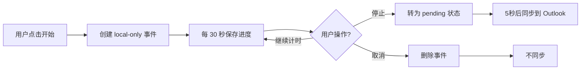
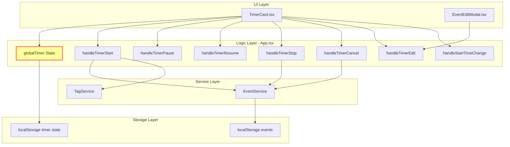
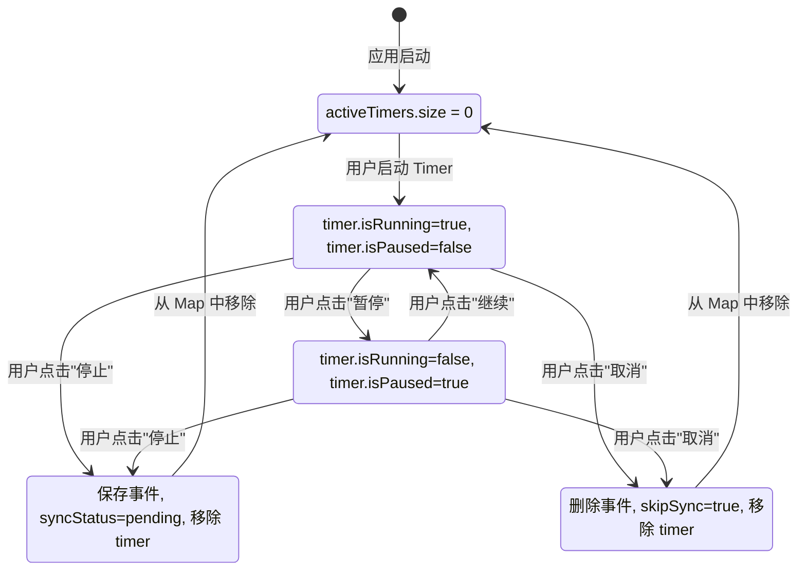
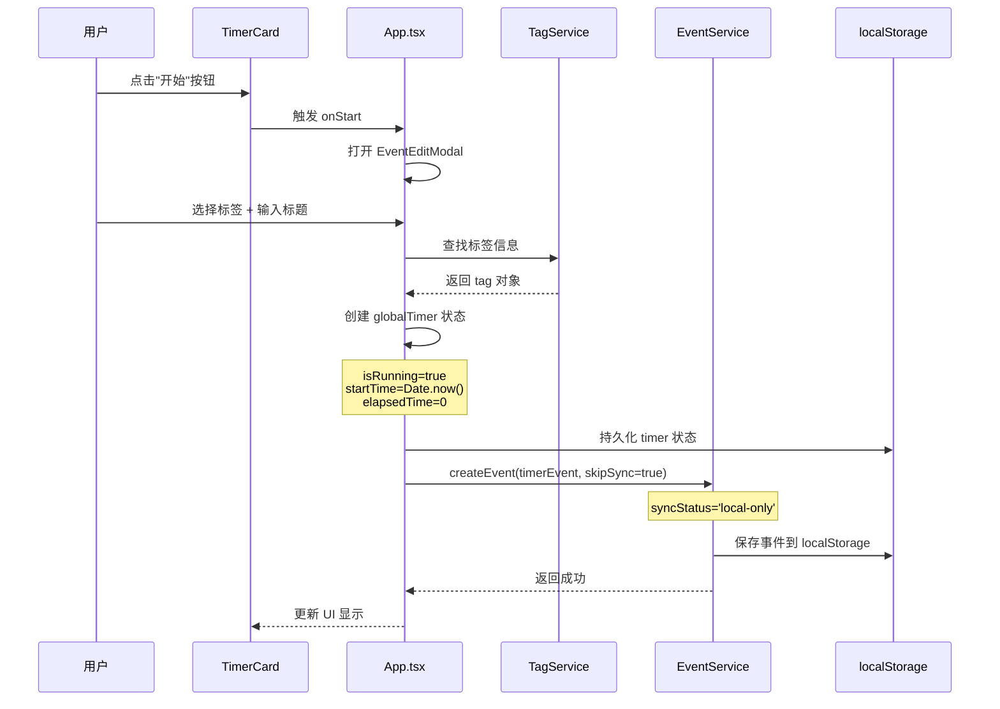
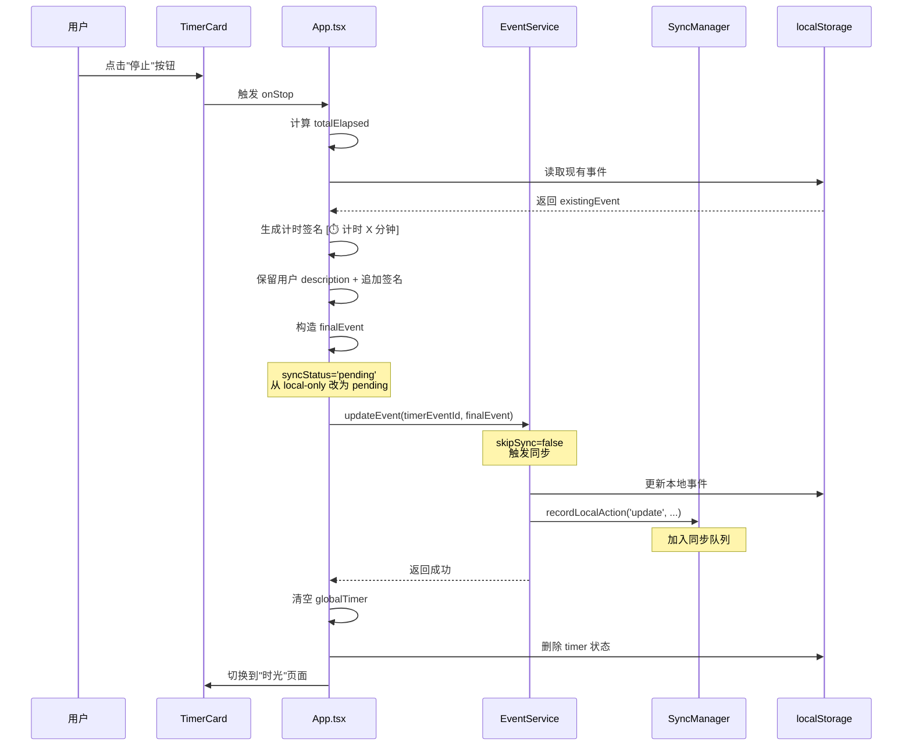
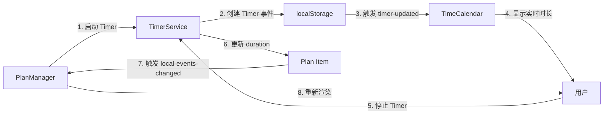
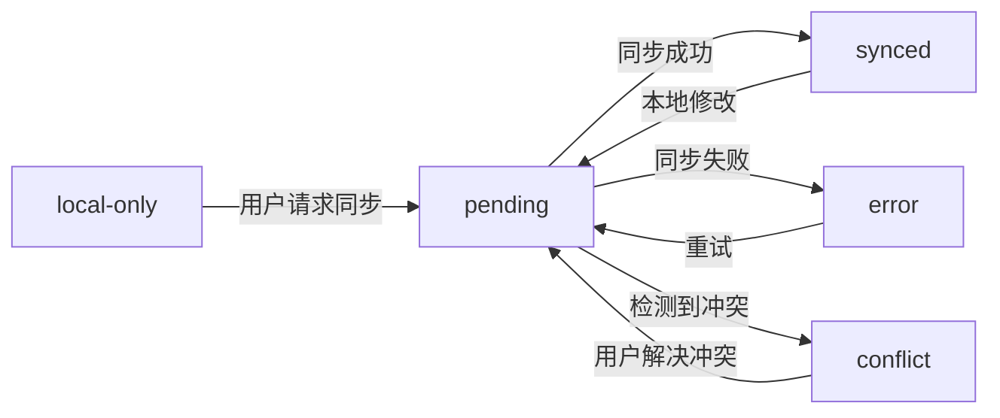

# ReMarkable Timer 模块产品需求文档 (PRD)

> **AI 生成时间**: 2025-11-05  
> **关联代码版本**: master  
> **文档类型**: 功能模块 PRD  
> **依赖模块**: 同步机制, TagService, EventService  
> **关联文档**: [同步机制 PRD](./SYNC_MECHANISM_PRD.md)

---

## ⚠️ 时间字段规范

**严禁使用 ISO 8601 标准时间格式（带 Z 或时区偏移）！**

所有时间字段必须使用 `timeUtils.ts` 中的工具函数处理：
- ✅ **存储时间**: 使用 `formatTimeForStorage(date)` - 返回本地时间字符串（如 `2025-11-06T14:30:00`）
- ✅ **解析时间**: 使用 `parseLocalTimeString(timeString)` - 将字符串解析为 Date 对象
- ❌ **禁止**: 直接使用 `new Date().toISOString()` 或 `date.toISOString()`
- ❌ **禁止**: 时间字符串包含 `Z` 后缀或 `+08:00` 等时区标记

**原因**: ISO 格式会导致时区转换问题，18:06 的事件可能在同步后显示为 10:06（UTC 时间）。

**参考文件**: `src/utils/timeUtils.ts`

---

## 📋 目录

1. [模块概述](#1-模块概述)
2. [用户场景](#2-用户场景)
3. [功能架构](#3-功能架构)
4. [状态管理](#4-状态管理)
5. [生命周期](#5-生命周期)
6. [UI 交互](#6-ui-交互)
7. [同步集成](#7-同步集成)
8. [数据持久化](#8-数据持久化)

---

## 1. 模块概述

### 1.1 核心目标

Timer 模块是 ReMarkable 的核心功能之一，为用户提供**自主时间记录**能力：
- ✅ 帮助用户追踪任务的实际耗时，**不打断心流状态**
- ✅ 自动创建时间事件，无需手动记录
- ✅ 支持暂停/恢复/取消，灵活应对工作中断
- ✅ 与标签系统深度集成，实现分类计时
- ✅ **无定时提醒、无强制休息**，用户完全自主决定计时节奏
- ✅ **时间即索引，事件即容器**：支持在计时事件中记录详细日志、会议纪要、资料收集等

### 1.2 核心价值

| 用户价值 | 实现方式 | 业务价值 |
|---------|---------|---------|
| **无感记录** | 自动保存为日历事件 | 提升数据完整性 |
| **自主掌控** | 用户完全控制开始/停止时机，无提醒打断 | 尊重心流状态 |
| **灵活调整** | 支持修改开始时间、标题、标签 | 适应真实工作场景 |
| **持久化** | localStorage + Widget 读取 | 跨窗口状态同步 |
| **可视化** | 实时时长显示 + 脉冲动效 | 轻量级反馈，不干扰专注 |
| **日志容器** | 事件 description 字段承载会议纪要、资料收集等内容 | 时间轴即信息检索入口 |
| **跨平台同步** | description 内容同步到 Outlook | 信息不受设备限制 |

### 1.3 设计理念

**"开始即创建，停止即同步"**



---

## 2. 用户场景

### 2.1 典型用户故事

#### 故事 1: 自主专注计时

> **作为** 需要记录工作时间的知识工作者  
> **我希望** 能够自由地开始和结束计时  
> **以便** 追踪我的实际专注时长，并在日历中回顾我的时间分布

**流程**:
1. 打开 ReMarkable 首页
2. 点击 TimerCard 的"开始"按钮
3. 选择标签"#工作/#产品设计"
4. 输入任务标题"设计用户流程图"
5. 开始计时，进入心流状态
6. 当任务完成或需要休息时，点击"停止"
7. 自动创建日历事件，同步到 Outlook

**设计理念**: 
- ✅ **不打断用户**: 没有任何定时提醒或强制休息通知
- ✅ **尊重心流**: 让用户自己决定何时开始、何时停止
- ✅ **无感记录**: 专注时不需要关注时间，停止时自动生成完整记录

#### 故事 2: 需要中断的任务

> **作为** 需要处理临时事务的工作者  
> **我希望** 能够暂停/恢复计时  
> **以便** 准确记录实际专注时长，排除中断时间

**流程**:
1. 开始计时"#开发/#Bug修复"
2. 10 分钟后收到会议通知或需要处理临时任务
3. 点击"暂停"，离开当前任务
4. 处理完临时事务后，点击"继续"
5. 再工作 15 分钟后，感觉任务告一段落，点击"停止"
6. 最终事件显示"专注 25 分钟"（自动排除了中断时间）

**设计理念**: 
- ✅ **真实反映专注时长**: 只记录用户实际工作的时间
- ✅ **无心理负担**: 暂停/继续随时可用，不会影响记录完整性

#### 故事 3: 需要调整开始时间

> **作为** 沉浸在工作中忘记开启计时的用户  
> **我希望** 能够回溯开始时间  
> **以便** 准确记录真实的任务时长

**流程**:
1. 9:00 开始工作，完全沉浸在任务中，忘记开 Timer
2. 9:30 想起来要记录时间，点击"开始"
3. 点击"开始时间 09:30"，弹出编辑框
4. 修改为 9:00（回溯真实开始时间）
5. Timer 显示已经运行 30 分钟
6. 继续工作直到任务完成...

**设计理念**: 
- ✅ **弥补遗忘**: 沉浸工作时忘记开 Timer 是正常的，允许事后补救
- ✅ **数据准确**: 回溯功能确保时间记录反映真实情况
- ✅ **无惩罚机制**: 忘记开 Timer 不会损失任何数据

#### 故事 4: 随手记录日志

> **作为** 需要记录会议纪要、资料收集等碎片信息的用户  
> **我希望** 能够在计时的同时记录详细内容  
> **以便** 所有信息都按时间自动归档，无需额外思考"记在哪里"

**场景 A - 会议纪要记录**:
1. 日历中已有下午 2:00 的"产品评审会议"事件
2. 会议开始时，打开 TimeCalendar 的该事件
3. 点击编辑，在 description 字段直接输入会议纪要：
   ```
   参会人员：张三、李四、王五
   讨论要点：
   1. 新功能 A 的技术方案确认
   2. UI 设计稿第二版反馈
   3. 下周发布时间表
   
   待办事项：
   - @张三 完成技术文档
   - @李四 修改设计稿
   ```
4. 保存后自动同步到 Outlook
5. **价值体现**: 
   - ✅ 再也不需要回忆"某个会议在什么时间开"
   - ✅ 会议纪要不会散落在不同的笔记本中
   - ✅ 时间、地点、人物已经在日程中，纪要只需记录内容本身

**场景 B - 资料收集归档**:
1. 周二上午 10:00 开始搜集竞品分析资料
2. 点击 Timer 开始计时"#工作/#竞品分析"
3. 边搜索边在 description 中粘贴：
   ```
   竞品 A：https://example.com/product-a
   - 核心功能：XXX
   - 定价策略：$99/月
   - 用户评价：4.5星
   
   竞品 B：https://example.com/product-b
   - 核心功能：YYY
   - 截图：[图片链接]
   ```
4. 搜集完成后停止 Timer
5. **价值体现**: 
   - ✅ 不需要思考"这些资料记在哪个笔记上"
   - ✅ 通过时间轴快速定位："上周二我搜了什么资料"
   - ✅ 资料与计时自动关联，清晰记录任务投入时长

**场景 C - 实时想法捕捉**:
1. Timer 正在运行"#写作/#博客文章"
2. 写作过程中突然有灵感或需要记录的想法
3. 不停止 Timer，直接点击编辑按钮
4. 在 description 中追加内容：
   ```
   11:30 - 想到一个更好的开头
   11:45 - 需要补充的数据来源：[链接]
   12:00 - 文章结构调整：先讲案例再讲原理
   ```
5. 继续计时，所有想法都实时追加到同一个事件中

**设计理念**: 
- ✅ **时间即索引**: 用户不需要思考"记在哪里"，时间轴就是天然的索引
- ✅ **事件即容器**: 每个事件都是一个信息容器，承载时长、标签、内容、附件
- ✅ **无缝同步**: description 内容自动同步到 Outlook，跨设备可访问
- ✅ **未来扩展**: 当前支持纯文本，未来升级为富文本"日志"：
  - 支持 Markdown 格式
  - 支持图片、附件上传
  - 支持语音记录
  - 与 Outlook description 字段的富文本互通（需考虑格式兼容性）

**技术挑战** (未来考虑):
- 📝 **富文本同步**: Outlook 的 description 字段支持 HTML，但需要处理：
  - 本地富文本 → HTML 的转换
  - 图片/附件的云端存储与引用
  - 不同客户端（Outlook Web/Desktop/Mobile）的显示一致性
- 📝 **大文本性能**: description 可能包含大量内容，需要优化：
  - 分页加载或懒加载
  - 搜索性能优化
  - 同步时的差异检测（避免全量上传）

---

## 3. 功能架构

### 3.1 组件结构



### 3.2 文件清单

| 文件路径 | 职责 | 代码行数 |
|---------|------|---------|
| `src/components/TimerCard.tsx` | Timer UI 组件 | 244 行 |
| `src/components/EventEditModal.tsx` | 事件编辑模态框 | ~800 行 |
| `src/App.tsx` (Timer 部分) | Timer 逻辑控制 | ~600 行 |
| `src/services/EventService.ts` | 事件 CRUD 入口 | ~200 行 |
| `src/services/TagService.ts` | 标签管理服务 | ~300 行 |

---

## 4. 状态管理

### 4.1 多 Timer 架构

**核心理念**: 支持多个事件同时计时，Timer 状态独立于 UI 组件存在

**架构变更**:
- ❌ ~~单一 `globalTimer` 对象~~
- ✅ **`activeTimers: Map<eventId, TimerState>`** - 支持多个 Timer 同时运行
- ✅ Timer 生命周期独立于 Modal 打开/关闭
- ✅ 用户可以为不同事件同时计时，互不干扰

### 4.2 TimerState 数据结构

**代码位置**: `src/App.tsx` L147-161

```typescript
interface TimerState {
  eventId: string;             // 关联的事件 ID（唯一标识）
  isRunning: boolean;          // 是否正在运行
  isPaused: boolean;           // 是否暂停
  tagId: string;               // 关联的标签 ID
  tagName: string;             // 标签名称
  tagEmoji?: string;           // 标签 emoji
  tagColor?: string;           // 标签颜色
  startTime: number;           // 当前计时周期的开始时间戳（用于计算运行时长）
  originalStartTime: number;   // 用户设定的真实开始时间戳（可回溯修改）
  elapsedTime: number;         // 已累积的时长（毫秒），包含暂停前的时长
  eventEmoji?: string;         // 用户自定义事件 emoji（覆盖标签 emoji）
  eventTitle?: string;         // 用户自定义事件标题（覆盖标签名称）
  segments: TimerSegment[];    // 时间片段数组
}

interface TimerSegment {
  start: number;               // 片段开始时间戳
  end: number;                 // 片段结束时间戳（暂停/停止时记录）
  duration: number;            // 片段时长（毫秒）
}
```

**存储位置**: 
- 内存: `useState<Map<string, TimerState>>(new Map())`
- 持久化: `localStorage['remarkable-active-timers']` - 存储为 `{ [eventId]: TimerState }`

### 4.3 状态转换图



**多 Timer 并发状态**:
- ✅ 多个 Timer 可以同时处于 Running 状态
- ✅ 每个 Timer 独立管理自己的状态（运行/暂停/停止）
- ✅ Timer 状态与 UI 解耦，Modal 关闭不影响 Timer 运行
- ✅ `activeTimers.get(eventId)` 查询特定 Timer 状态

### 4.4 时长计算逻辑

**核心公式**: 

```typescript
// 获取指定事件的 Timer 状态
const timer = activeTimers.get(eventId);
if (!timer) return 0;

// 运行中
if (timer.isRunning && !timer.isPaused) {
  totalElapsed = timer.elapsedTime + (Date.now() - timer.startTime);
}

// 暂停时
if (timer.isPaused) {
  totalElapsed = timer.elapsedTime;
}
```

**字段含义**:
- `elapsedTime`: 之前所有计时周期累积的时长（包含暂停前的）
- `startTime`: 当前这轮计时的开始时间（每次恢复都会重置）
- `Date.now() - startTime`: 当前这轮运行的时长

**示例**:

| 操作 | elapsedTime | startTime | Date.now() | totalElapsed |
|------|------------|-----------|-----------|-------------|
| 开始计时 | 0 | 9:00:00 | 9:10:00 | 10 分钟 |
| 暂停 | 10 分钟 | - | - | 10 分钟 |
| 继续 | 10 分钟 | 9:15:00 | 9:25:00 | 20 分钟 |
| 再次暂停 | 20 分钟 | - | - | 20 分钟 |
| 继续 | 20 分钟 | 9:30:00 | 9:35:00 | 25 分钟 |
| 停止 | 25 分钟 | - | - | 25 分钟 |

---

## 5. 生命周期

### 5.1 启动流程 (handleTimerStart)

**代码位置**: `src/App.tsx` L322-345 + L667-736



**关键代码**:

```typescript
// App.tsx L667-736
const handleTimerEditSave = async (updatedEvent) => {
  if (!globalTimer) {
    // 新建 Timer
    const tagId = updatedEvent.tags[0];
    const tag = TagService.getFlatTags().find(t => t.id === tagId);
    
    const timerStartTime = eventStartTime.getTime();
    const realTimerEventId = `timer-${tagId}-${eventStartTime.getTime()}`;
    
    const timerEvent: Event = {
      id: realTimerEventId,
      title: eventTitle,
      startTime: formatTimeForStorage(eventStartTime),
      endTime: formatTimeForStorage(now),
      tags: [tagId],
      tagId: tagId,
      syncStatus: 'local-only', // ✅ 关键：不加入同步队列
      remarkableSource: true,
      isTimer: true,
      // ...
    };
    
    // skipSync=true：避免频繁同步运行中的事件
    await EventService.createEvent(timerEvent, true);
    
    // 设置 globalTimer 状态
    setGlobalTimer({
      isRunning: true,
      tagId: tagId,
      tagName: tag.name,
      startTime: Date.now(),
      originalStartTime: timerStartTime,
      elapsedTime: 0,
      isPaused: false,
      eventId: realTimerEventId
    });
    
    // 持久化
    localStorage.setItem('remarkable-global-timer', JSON.stringify(timerState));
  }
};
```

### 5.2 运行中保存流程（每 30 秒）

**代码位置**: `src/App.tsx` L774-853 (useEffect)

```typescript
useEffect(() => {
  if (!globalTimer || !globalTimer.isRunning || globalTimer.isPaused) {
    return;
  }

  const saveTimerEvent = async () => {
    const now = Date.now();
    const totalElapsed = globalTimer.elapsedTime + (now - globalTimer.startTime);
    const startTime = new Date(globalTimer.originalStartTime || globalTimer.startTime);
    const endTime = new Date(startTime.getTime() + totalElapsed);
    
    const timerEventId = `timer-${globalTimer.tagId}-${startTime.getTime()}`;
    
    // 🔧 [BUG FIX] 读取现有事件，保留用户的 description 和 location
    const saved = localStorage.getItem(STORAGE_KEYS.EVENTS);
    const existingEvents: Event[] = saved ? JSON.parse(saved) : [];
    const existingEvent = existingEvents.find(e => e.id === timerEventId);
    
    const timerEvent: Event = {
      id: timerEventId,
      title: eventTitle,
      startTime: formatTimeForStorage(startTime),
      endTime: formatTimeForStorage(endTime),
      description: existingEvent?.description || '计时中的事件', // 🔧 保留用户输入
      location: existingEvent?.location || '',
      syncStatus: 'local-only', // ✅ 仍然是 local-only
      // ...
    };
    
    // 🔧 直接更新 localStorage，不调用 EventService（避免触发同步）
    const updatedEvents = existingEvents.map(e => 
      e.id === timerEventId ? timerEvent : e
    );
    if (!existingEvents.some(e => e.id === timerEventId)) {
      updatedEvents.push(timerEvent);
    }
    
    localStorage.setItem(STORAGE_KEYS.EVENTS, JSON.stringify(updatedEvents));
    
    // 触发 UI 更新
    window.dispatchEvent(new CustomEvent('eventsUpdated', {
      detail: { isTimerEvent: true }
    }));
  };

  // 立即保存一次
  saveTimerEvent();
  
  // 每 30 秒保存一次
  const interval = setInterval(saveTimerEvent, 30000);
  
  return () => clearInterval(interval);
}, [globalTimer, /* ... */]);
```

**设计考量**:
- ✅ **不触发同步**: 直接操作 localStorage，避免 EventService 触发 `recordLocalAction`
- ✅ **保留用户输入**: 从 localStorage 读取现有事件的 description 和 location
  - **关键**: 配合 `handleTimerEditSave` 的即时保存机制
  - 用户通过 EventEditModal 编辑 description → `handleTimerEditSave` 立即写入 localStorage
  - 30 秒后 `saveTimerEvent` 读取 → 获得最新的用户输入 → 不覆盖
  - 详见 [6.2 EventEditModal 集成 - 已修复的 Bug](#62-eventeditmodal-集成)
- ✅ **30秒间隔**: 平衡数据安全和性能（避免过于频繁的 I/O）
- ✅ **实时 endTime 更新**: 每次保存都重新计算 `endTime = startTime + totalElapsed`，确保日历显示准确的时长

**数据覆盖策略**:

```typescript
// 保留的字段（从 existingEvent 读取）:
- description  // 🔧 用户可编辑，必须保留
- location     // 🔧 用户可编辑，必须保留
- createdAt    // 首次创建时间，不变

// 覆盖的字段（Timer 自动管理）:
- title        // 从 globalTimer.eventTitle 获取（可能被用户修改过）
- startTime    // 从 globalTimer.originalStartTime 获取（固定）
- endTime      // 实时计算 = startTime + totalElapsed
- syncStatus   // 始终为 'local-only'（运行中不同步）
- updatedAt    // 每次保存都更新为当前时间
```

### 5.3 停止流程 (handleTimerStop)

**代码位置**: `src/App.tsx` L510-575



**关键代码**:

```typescript
// App.tsx L510-575
const handleTimerStop = async () => {
  const totalElapsed = globalTimer.elapsedTime + 
    (globalTimer.isRunning ? (Date.now() - globalTimer.startTime) : 0);
  
  const startTime = new Date(globalTimer.originalStartTime || globalTimer.startTime);
  const timerEventId = `timer-${globalTimer.tagId}-${startTime.getTime()}`;
  
  // 读取现有事件
  const existingEvent = existingEvents.find(e => e.id === timerEventId);
  
  // 生成计时签名
  const timerSignature = `[⏱️ 计时 ${Math.floor(totalElapsed / 60000)} 分钟]`;
  
  // 🔧 智能合并 description
  let finalDescription = existingEvent?.description || '';
  if (finalDescription.includes('[⏱️ 计时')) {
    // 替换旧签名
    finalDescription = finalDescription.replace(/\[⏱️ 计时 \d+ 分钟\]/, timerSignature);
  } else if (finalDescription && finalDescription !== '计时中的事件') {
    // 追加签名
    finalDescription = finalDescription + '\n' + timerSignature;
  } else {
    // 使用签名作为默认内容
    finalDescription = timerSignature;
  }
  
  const finalEvent: Event = {
    id: timerEventId,
    title: globalTimer.eventTitle || tagName,
    description: finalDescription,
    syncStatus: 'pending', // ✅ 从 local-only 改为 pending
    // ...
  };
  
  // 使用 EventService 更新事件（skipSync=false）
  const result = await EventService.updateEvent(timerEventId, finalEvent);
  
  if (result.success) {
    // 清空 Timer 状态
    setGlobalTimer(null);
    localStorage.removeItem('remarkable-global-timer');
    
    // 跳转到时光页面
    setCurrentPage('time');
  }
};
```

**同步时机**: 
- ✅ 立即加入队列: `recordLocalAction('update', 'event', ...)`
- ✅ 5 秒后首次同步（由 SyncManager 的延迟机制保证）
- ✅ 同步成功后获得 `externalId`

### 5.4 取消流程 (handleTimerCancel)

**代码位置**: `src/App.tsx` L384-415

```typescript
const handleTimerCancel = () => {
  if (!globalTimer) return;
  
  if (window.confirm('确定要取消计时吗？当前计时将不会被保存')) {
    const startTime = new Date(globalTimer.originalStartTime || globalTimer.startTime);
    const timerEventId = `timer-${globalTimer.tagId}-${startTime.getTime()}`;
    
    // 使用 EventService 删除事件（skipSync=true）
    EventService.deleteEvent(timerEventId, true).then(result => {
      if (result.success) {
        console.log('❌ Timer cancelled, event deleted:', timerEventId);
      }
    });
    
    // 清空状态
    setGlobalTimer(null);
    localStorage.removeItem('remarkable-global-timer');
  }
};
```

**设计决策**: `skipSync=true` 不同步删除操作，因为：
1. 取消的事件从未同步到 Outlook（syncStatus='local-only'）
2. 即使有 externalId，用户主动取消意味着不希望保留记录
3. 避免产生"创建 → 立即删除"的垃圾数据

---

## 6. UI 交互

### 6.1 TimerCard 组件

**代码位置**: `src/components/TimerCard.tsx`

**Props 接口**:

```typescript
interface TimerCardProps {
  tagId?: string;              // 标签 ID
  tagName?: string;            // 标签名称
  tagEmoji?: string;           // 标签 emoji
  tagPath?: string;            // 完整标签路径（层级显示）
  tagColor?: string;           // 标签颜色（最底层标签的颜色）
  startTime?: number;          // 当前计时周期开始时间
  originalStartTime?: number;  // 真实开始时间（可修改）
  elapsedTime?: number;        // 已累积时长
  isRunning?: boolean;         // 是否运行中
  eventEmoji?: string;         // 用户自定义 emoji
  eventTitle?: string;         // 用户自定义标题
  onPause?: () => void;        // 暂停回调
  onStop?: () => void;         // 停止回调
  onCancel?: () => void;       // 取消回调
  onEdit: () => void;          // 编辑回调
  onStart?: () => void;        // 开始回调
  onStartTimeChange?: (newStartTime: number) => void; // 修改开始时间
}
```

**UI 布局**:

```
┌─────────────────────────┐
│      [Emoji 图标]       │ ← 可点击编辑
├─────────────────────────┤
│     [事件标题]          │ ← 可点击编辑
├─────────────────────────┤
│   [#标签/路径/显示]     │ ← 可点击编辑，显示颜色
├─────────────────────────┤
│  [暂停] [停止] [取消]   │ ← 按钮组（运行时）
│      [开始]             │ ← 初始状态
├─────────────────────────┤
│       01:25:36          │ ← 实时时长（脉冲动效）
├─────────────────────────┤
│  开始时间 09:30         │ ← 可点击修改
└─────────────────────────┘
```

**交互细节**:

1. **脉冲动效**: 每到整分钟（seconds === 0）触发 0.6s 脉冲动画
   ```typescript
   useEffect(() => {
     if (isRunning && seconds === 0 && minutes > 0) {
       setIsPulsing(true);
       const timeout = setTimeout(() => setIsPulsing(false), 600);
       return () => clearTimeout(timeout);
     }
   }, [seconds, minutes, isRunning]);
   ```

2. **时长格式化**:
   - 小于 1 小时: `MM:SS` (如 `25:36`)
   - 大于 1 小时: `HH:MM:SS` (如 `01:25:36`)
   - 异常数据: 显示 `--:--` 并打印错误日志

3. **安全检查**: 防止异常数据导致 UI 崩溃
   ```typescript
   const safeElapsedTime = (elapsedTime && !isNaN(elapsedTime) && elapsedTime >= 0) ? elapsedTime : 0;
   const safeStartTime = (startTime && !isNaN(startTime) && startTime > 0) ? startTime : now;
   ```

### 6.2 EventEditModal 集成

**打开时机**: 点击 TimerCard 的任意可编辑区域

**编辑字段**:
- 事件标题 (eventTitle)
- Emoji (eventEmoji)
- 标签选择 (tagId)
- 开始时间 (startTime)
- **描述 (description)**: 
  - 当前支持纯文本（多行 textarea）
  - 可在计时过程中随时编辑，实时保存
  - 用于记录会议纪要、资料链接、想法捕捉等
  - 自动同步到 Outlook 的 description 字段
  - **未来规划**: 升级为富文本编辑器，支持 Markdown、图片、附件、语音
- 地点 (location)

**保存逻辑**: `App.tsx L651-780 handleTimerEditSave`

**关键特性**:
1. **区分新建与编辑**: 通过 `globalTimer` 是否为 null 判断
2. **保留用户输入**: 从 localStorage 读取现有事件，保留 description 和 location
3. **实时反馈**: 修改后立即更新 globalTimer 状态，UI 实时响应

**🐛 已修复的 Bug**: **Timer 运行中编辑 description 被覆盖**

**问题描述**:
- 用户在 Timer 运行时通过 EventEditModal 编辑 description
- 保存后，`handleTimerEditSave` 只更新了 `globalTimer` 的 `eventTitle` 和 `eventEmoji`
- **但没有将 description 和 location 保存到 localStorage 中的事件对象**
- 30 秒后 `saveTimerEvent` 自动运行，从 localStorage 读取事件
- 读取到的仍然是旧的 description，从而覆盖了用户的编辑

**修复方案** (`App.tsx` L748-780):

```typescript
// 更新现有计时器中的自定义内容
setGlobalTimer({
  ...globalTimer,
  eventTitle: updatedEvent.title,
  eventEmoji: possibleEmoji,
  // ... 更新标签信息
});

// 🔧 [BUG FIX] 立即保存用户编辑的 description 和 location 到 localStorage
// 这样 saveTimerEvent 每30秒运行时会读取到最新的用户输入
if (globalTimer.eventId) {
  try {
    const saved = localStorage.getItem(STORAGE_KEYS.EVENTS);
    const existingEvents: Event[] = saved ? JSON.parse(saved) : [];
    const eventIndex = existingEvents.findIndex((e: Event) => e.id === globalTimer.eventId);
    
    if (eventIndex !== -1) {
      // 只更新用户可编辑的字段，保持其他字段不变
      existingEvents[eventIndex] = {
        ...existingEvents[eventIndex],
        description: updatedEvent.description,
        location: updatedEvent.location,
        title: updatedEvent.title,
        updatedAt: formatTimeForStorage(new Date())
      };
      
      localStorage.setItem(STORAGE_KEYS.EVENTS, JSON.stringify(existingEvents));
      AppLogger.log('💾 [Timer Edit] Saved user edits to localStorage');
    }
  } catch (error) {
    AppLogger.error('💾 [Timer Edit] Failed to save user edits:', error);
  }
}
```

**数据流对比**:

**修复前（错误）**:
```
用户编辑 description
  ↓
handleTimerEditSave 只更新 globalTimer.eventTitle
  ↓
localStorage 中的事件对象仍然是旧的 description
  ↓
30秒后 saveTimerEvent 读取 localStorage
  ↓
覆盖事件对象（包括旧的 description）
  ↓
用户的编辑丢失 ❌
```

**修复后（正确）**:
```
用户编辑 description
  ↓
handleTimerEditSave 更新 globalTimer + 立即保存到 localStorage
  ↓
localStorage 中的事件对象已更新为新的 description
  ↓
30秒后 saveTimerEvent 读取 localStorage
  ↓
读取到最新的 description，不覆盖
  ↓
用户的编辑保留 ✅
```

**设计要点**:
- ✅ **双重更新**: 既更新 `globalTimer` 状态（UI 立即响应），又更新 `localStorage`（数据持久化）
- ✅ **部分更新**: 只更新用户编辑的字段（description、location、title），不影响 startTime、endTime 等 Timer 自动管理的字段
- ✅ **错误容忍**: 使用 try-catch 包裹，避免 localStorage 异常导致 Timer 崩溃

---

## 7. 同步集成

### 7.1 与同步机制的协作

**核心原则**: **开始即创建（local-only），停止即同步（pending）**

| Timer 状态 | 事件 syncStatus | 是否同步 | 原因 |
|-----------|----------------|---------|------|
| 启动 | `local-only` | ❌ | 避免频繁同步运行中的事件 |
| 运行中保存（30秒） | `local-only` | ❌ | 同上，直接操作 localStorage |
| 停止 | `pending` | ✅ | 最终结果需要同步到云端 |
| 取消 | - | ❌ | 用户主动取消，不需要同步 |

### 7.2 事件 ID 生成规则

**格式**: `timer-{tagId}-{originalStartTime}`

**示例**: `timer-tag-123-1699887600000`

**优势**:
1. **全局唯一**: 同一标签、同一时间只会有一个 Timer 事件
2. **可追溯**: 从 ID 可以解析出标签和开始时间
3. **IndexMap 友好**: 便于通过 externalId 匹配

### 7.3 Timer 事件去重逻辑

**问题**: Timer 停止后同步到 Outlook，20秒后远程同步回写时，如何避免创建重复事件？

**解决方案**: 参考 [同步机制 PRD - 7.4 Timer 事件去重](./SYNC_MECHANISM_PRD.md#74-timer-事件去重)

**核心步骤**:
1. Timer 停止 → 同步到 Outlook → 获得 `externalId` → 更新本地事件
2. 立即更新 IndexMap: `eventIndexMap.set(externalId, timerEvent)`
3. 远程同步回写时: 通过 `externalId` 找到 Timer 事件 → 更新而不是创建
4. Timer 优先级: Timer 事件的 `externalId` 索引不会被其他事件覆盖

---

## 8. 数据持久化

### 8.1 localStorage 存储

**Timer 状态**: `localStorage['remarkable-global-timer']`

```typescript
interface StoredTimerState {
  isRunning: boolean;
  tagId: string;
  tagName: string;
  tagEmoji?: string;
  tagColor?: string;
  startTime: number;
  originalStartTime: number;
  elapsedTime: number;
  isPaused: boolean;
  eventEmoji?: string;
  eventTitle?: string;
  eventId?: string;
}
```

**用途**:
- ✅ 页面刷新后恢复 Timer 状态
- ✅ Widget 读取当前 Timer 信息
- ✅ 多窗口状态同步（通过 storage 事件）

**Timer 事件**: `localStorage['events']`

```typescript
{
  id: "timer-tag-123-1699887600000",
  title: "产品设计",
  startTime: "2024-11-13T09:00:00",
  endTime: "2024-11-13T09:25:36",
  tags: ["tag-123"],
  tagId: "tag-123",
  syncStatus: "local-only", // 运行中
  isTimer: true,
  remarkableSource: true,
  // ...
}
```

### 8.2 页面刷新恢复

**代码位置**: `src/App.tsx` L854-950

```typescript
useEffect(() => {
  const savedTimer = localStorage.getItem('remarkable-global-timer');
  if (savedTimer) {
    try {
      const timerState = JSON.parse(savedTimer);
      
      // 验证数据有效性
      if (timerState.tagId && timerState.startTime) {
        setGlobalTimer(timerState);
        console.log('🔄 Restored timer state from localStorage:', timerState);
      }
    } catch (error) {
      console.error('❌ Failed to restore timer:', error);
      localStorage.removeItem('remarkable-global-timer');
    }
  }
}, []);
```

**处理边缘情况**:
- ✅ 数据格式错误: 删除损坏的数据，避免应用崩溃
- ✅ 标签被删除: 显示"未找到标签"，允许用户重新选择
- ✅ 时间戳异常: 验证 startTime 和 originalStartTime 的有效性

### 8.3 跨窗口同步（Widget 集成）

**Widget 读取逻辑**:

```typescript
// DesktopCalendarWidget.tsx
const [timerState, setTimerState] = useState(() => {
  const saved = localStorage.getItem('remarkable-global-timer');
  return saved ? JSON.parse(saved) : null;
});

// 监听 storage 变化
useEffect(() => {
  const handleStorageChange = (e: StorageEvent) => {
    if (e.key === 'remarkable-global-timer') {
      setTimerState(e.newValue ? JSON.parse(e.newValue) : null);
    }
  };
  
  window.addEventListener('storage', handleStorageChange);
  return () => window.removeEventListener('storage', handleStorageChange);
}, []);
```

**实现效果**:
- ✅ 主窗口启动 Timer → Widget 实时显示
- ✅ 主窗口停止 Timer → Widget 清空显示
- ✅ 跨窗口时长同步更新

---

## 9. 边缘情况处理

### 9.1 时间戳异常

**问题**: `startTime` 或 `elapsedTime` 出现负数、NaN 或超大数值

**解决方案**:

```typescript
// TimerCard.tsx L74-82
const safeElapsedTime = (elapsedTime && !isNaN(elapsedTime) && elapsedTime >= 0) 
  ? elapsedTime 
  : 0;

const safeStartTime = (startTime && !isNaN(startTime) && startTime > 0) 
  ? startTime 
  : Date.now();
```

**UI 降级**:
- 显示 `--:--`
- 打印错误日志到控制台
- 允许用户点击"取消"清除状态

### 9.2 标签被删除

**场景**: Timer 运行中，用户在 TagManager 中删除了该标签

**处理方案**:

```typescript
const tag = TagService.getFlatTags().find(t => t.id === globalTimer.tagId);
if (!tag) {
  console.warn('⚠️ Tag not found for timer:', globalTimer.tagId);
  // 显示占位符
  displayTagName = '(已删除的标签)';
  displayTagPath = '未选择标签';
  // 允许用户重新编辑选择新标签
}
```

### 9.3 页面刷新中 Timer 丢失

**问题**: 用户在 Timer 运行中刷新页面，`useEffect` 每 30 秒保存可能刚好在刷新前

**解决方案**: `handleBeforeUnload` 钩子

**代码位置**: `src/App.tsx` L827-876

```typescript
useEffect(() => {
  const handleBeforeUnload = (event: BeforeUnloadEvent) => {
    if (globalTimer && globalTimer.isRunning) {
      // 立即保存 Timer 状态
      const now = Date.now();
      const totalElapsed = globalTimer.elapsedTime + (now - globalTimer.startTime);
      const startTime = new Date(globalTimer.originalStartTime || globalTimer.startTime);
      const endTime = new Date(startTime.getTime() + totalElapsed);
      
      const timerEventId = `timer-${globalTimer.tagId}-${startTime.getTime()}`;
      
      // 读取现有事件，保留用户输入
      const saved = localStorage.getItem(STORAGE_KEYS.EVENTS);
      const existingEvents: Event[] = saved ? JSON.parse(saved) : [];
      const existingEvent = existingEvents.find(e => e.id === timerEventId);
      
      const timerEvent: Event = {
        id: timerEventId,
        description: existingEvent?.description || '计时事件（已自动保存）',
        syncStatus: 'local-only',
        // ...
      };
      
      // 同步保存（不能使用 async）
      const updatedEvents = existingEvents.map(e => 
        e.id === timerEventId ? timerEvent : e
      );
      localStorage.setItem(STORAGE_KEYS.EVENTS, JSON.stringify(updatedEvents));
      
      // 提示用户
      event.preventDefault();
      event.returnValue = '计时器正在运行中，确定要离开吗？';
    }
  };

  window.addEventListener('beforeunload', handleBeforeUnload);
  return () => window.removeEventListener('beforeunload', handleBeforeUnload);
}, [globalTimer]);
```

**效果**:
- ✅ 刷新前弹窗提示用户
- ✅ 同步保存最新的 Timer 事件数据
- ✅ 刷新后通过 localStorage 恢复状态

---

## 10. 性能优化

### 10.1 UI 更新频率控制

**问题**: Timer 运行时每秒触发 re-render，可能影响性能

**优化方案**:

1. **使用 currentTime 状态**: 只更新时间戳，不重新渲染整个组件树
   ```typescript
   const [currentTime, setCurrentTime] = useState(Date.now());
   
   useEffect(() => {
     if (isRunning) {
       const interval = setInterval(() => {
         setCurrentTime(Date.now());
       }, 1000);
       return () => clearInterval(interval);
     }
   }, [isRunning]);
   ```

2. **避免父组件 re-render**: App.tsx 每秒强制更新 globalTimer 触发子组件更新
   ```typescript
   // App.tsx L1157-1172
   useEffect(() => {
     if (globalTimer?.isRunning) {
       const updateInterval = setInterval(() => {
         // 触发 globalTimer 引用变化，但不改变数据
         setGlobalTimer(prev => prev ? { ...prev } : null);
       }, 1000);
       return () => clearInterval(updateInterval);
     }
   }, [globalTimer?.isRunning]);
   ```

**性能数据**:
- Timer 运行时 CPU 占用: ~1-2%
- 每秒 re-render 次数: 1 次（仅 TimerCard 组件）

### 10.2 存储写入频率优化

**策略**:
- ✅ 运行中: 每 30 秒写入一次 localStorage
- ✅ 状态变更（暂停/继续）: 立即写入
- ✅ 页面刷新: `beforeunload` 钩子立即写入

**避免过度写入**:
```typescript
// 错误做法：每秒写入
setInterval(() => {
  localStorage.setItem('events', JSON.stringify(events)); // ❌ 性能浪费
}, 1000);

// 正确做法：30秒写入
setInterval(() => {
  localStorage.setItem('events', JSON.stringify(events)); // ✅ 平衡性能和安全
}, 30000);
```

---

## 11. 已知问题与修复历史

### 11.1 已修复: Timer 运行中编辑 description 被覆盖

**修复日期**: 2025-11-05  
**影响版本**: v1.0 (修复前)  
**修复版本**: v1.1 (修复后)

**问题现象**:
- 用户在 Timer 运行时打开 EventEditModal 编辑 description
- 保存后，description 显示已更新
- 30 秒后（或下次自动保存触发时），用户的编辑内容被覆盖为旧内容

**根本原因**:

Timer 模块有两个保存逻辑：

1. **`handleTimerEditSave`** (用户主动编辑): 只更新了 `globalTimer` 状态和 `eventTitle/eventEmoji`，**但没有将 description/location 保存到 localStorage 的事件对象中**

2. **`saveTimerEvent`** (每 30 秒自动执行): 从 localStorage 读取现有事件的 description → 仍然是旧值 → 覆盖整个事件对象

**数据流分析**:

```
T=0s:  用户编辑 description = "新内容"
        ↓
       handleTimerEditSave 执行
        ↓
       只更新: globalTimer.eventTitle
       未更新: localStorage 中的事件.description (仍是 "旧内容")
        ↓
T=30s: saveTimerEvent 自动执行
        ↓
       从 localStorage 读取事件 → description = "旧内容"
        ↓
       构造新事件对象 → description = existingEvent.description = "旧内容"
        ↓
       写回 localStorage → 覆盖
        ↓
       用户的编辑丢失 ❌
```

**修复方案**:

在 `handleTimerEditSave` 中，当更新运行中的 Timer 时，立即将 description、location、title 同步到 localStorage 的事件对象：

```typescript
// App.tsx L748-780
if (globalTimer.eventId) {
  try {
    const saved = localStorage.getItem(STORAGE_KEYS.EVENTS);
    const existingEvents: Event[] = saved ? JSON.parse(saved) : [];
    const eventIndex = existingEvents.findIndex((e: Event) => e.id === globalTimer.eventId);
    
    if (eventIndex !== -1) {
      existingEvents[eventIndex] = {
        ...existingEvents[eventIndex],
        description: updatedEvent.description,  // 🔧 立即保存
        location: updatedEvent.location,        // 🔧 立即保存
        title: updatedEvent.title,              // 🔧 立即保存
        updatedAt: formatTimeForStorage(new Date())
      };
      
      localStorage.setItem(STORAGE_KEYS.EVENTS, JSON.stringify(existingEvents));
    }
  } catch (error) {
    AppLogger.error('💾 [Timer Edit] Failed to save user edits:', error);
  }
}
```

**修复后的数据流**:

```
T=0s:  用户编辑 description = "新内容"
        ↓
       handleTimerEditSave 执行
        ↓
       更新: globalTimer.eventTitle
       更新: localStorage 中的事件.description = "新内容" ✅
        ↓
T=30s: saveTimerEvent 自动执行
        ↓
       从 localStorage 读取事件 → description = "新内容" ✅
        ↓
       构造新事件对象 → description = existingEvent.description = "新内容"
        ↓
       写回 localStorage → 不覆盖用户内容
        ↓
       用户的编辑保留 ✅
```

**测试验证**:

1. 启动 Timer
2. 点击编辑，修改 description 为"测试内容"
3. 保存并关闭模态框
4. 等待 30 秒（或触发自动保存）
5. 再次打开编辑模态框
6. **预期**: description 仍然是"测试内容" ✅
7. **修复前**: description 被覆盖为"计时中的事件" ❌

**相关代码位置**:
- 修复代码: `src/App.tsx` L748-780 (handleTimerEditSave)
- 自动保存: `src/App.tsx` L782-850 (saveTimerEvent useEffect)
- PRD 说明: [6.2 EventEditModal 集成](#62-eventeditmodal-集成)

---

## 📊 总结

### 核心特性

| 特性 | 实现方式 | 用户价值 |
|------|---------|---------|
| **无感记录** | 自动创建日历事件 | 无需手动记录时间 |
| **灵活调整** | 支持修改开始时间、标题、标签 | 适应真实工作场景 |
| **数据安全** | 30秒保存 + 页面刷新钩子 | 防止数据丢失 |
| **跨窗口同步** | localStorage + storage 事件 | Widget 实时显示 |
| **智能同步** | 停止时转为 pending，运行中不同步 | 避免频繁 API 调用 |
| **实时编辑保护** | 用户编辑立即持久化 | description/location 不被自动保存覆盖 |

### 关键数据流

```
用户启动 Timer
    ↓
创建 local-only 事件
    ↓
每 30 秒保存进度（直接写 localStorage）
    ↓
用户停止 Timer
    ↓
syncStatus: local-only → pending
    ↓
EventService.updateEvent (skipSync=false)
    ↓
加入同步队列
    ↓
5 秒后同步到 Outlook
    ↓
获得 externalId → 更新 IndexMap
    ↓
远程同步回写时通过 externalId 匹配
    ↓
避免重复事件
```

### 与其他模块的关联

| 模块 | 关联点 | 数据流向 |
|------|-------|---------|
| **同步机制** | Timer 停止触发同步 | Timer → EventService → SyncManager |
| **TagService** | 标签选择、日历映射 | Timer → TagService → 获取标签信息 |
| **TimeCalendar** | Timer 事件显示、日志编辑 | Timer 保存事件 → TimeCalendar 渲染<br/>TimeCalendar 编辑 description → 更新 Timer 事件 |
| **EventEditModal** | Timer 编辑入口、日志编辑界面 | Timer → 打开 Modal → 编辑 description/其他字段 → 保存回 Timer |
| **Outlook 同步** | description 字段同步 | Timer description → Graph API body.content (纯文本)<br/>未来: 富文本 → HTML 格式转换 |

---

## 9. 与 PlanManager 的集成

### 9.1 Plan Item 启动 Timer

**场景**: 用户在 PlanManager 中点击 Plan Item 的"开始计时"按钮

**数据流**:
```
用户点击 Plan Item 的"开始计时"按钮
    ↓
PlanManager 调用 TimerService.startTimer(planItemId)
    ↓
Timer 查找对应的 Event（通过 planItemId）
    ↓
创建 Timer 事件：
  - eventId: planItemId（关联原 Plan Item）
  - title: Plan Item 的 content/title
  - tags: Plan Item 的 tags
  - startTime: Date.now()
    ↓
保存到 localStorage.currentTimer
    ↓
触发 EventHub 'timer-updated' 事件
    ↓
PlanManager 和 TimeCalendar 监听并更新 UI
```

**关键代码位置**（推测，需要在 PlanManager 中实现）:
```typescript
// PlanManager.tsx（待实现）
const handleStartTimer = (planItem: Event) => {
  TimerService.startTimer(planItem.id);
};
```

**Timer 端处理**（TimerService.ts）:
```typescript
// 支持传入 eventId 参数
static startTimer(eventId?: string) {
  if (this.isRunning) {
    throw new Error('Timer is already running');
  }
  
  // 如果传入 eventId，查找对应的 Event
  let initialTitle = '';
  let initialTags: string[] = [];
  if (eventId) {
    const event = EventService.getEventById(eventId);
    if (event) {
      initialTitle = event.title || event.content || '';
      initialTags = event.tags || [];
    }
  }
  
  const timer: Timer = {
    eventId: eventId || `timer-${Date.now()}`,
    title: initialTitle,
    tags: initialTags,
    startTime: Date.now(),
    duration: 0,
    status: 'running'
  };
  
  this.saveTimer(timer);
  this.startInterval();
  EventHub.emit('timer-updated', timer);
}
```

### 9.2 Timer 结束后更新 Plan Item

**场景**: 用户停止 Timer 后，需要更新原 Plan Item 的 `duration` 字段

**数据流**:
```
用户停止 Timer
    ↓
TimerService.stopTimer()
    ↓
计算总时长：currentDuration + (Date.now() - startTime)
    ↓
更新 Event 的 duration 字段
    ↓
如果 eventId 是 Plan Item ID，同时更新 Plan Item
    ↓
触发 'local-events-changed' 事件
    ↓
PlanManager 重新加载数据，显示更新后的 duration
```

**关键实现**（TimerService.ts）:
```typescript
static stopTimer() {
  if (!this.isRunning) return;
  
  const timer = this.getCurrentTimer();
  if (!timer) return;
  
  // 计算总时长
  const finalDuration = timer.duration + Math.floor((Date.now() - timer.startTime) / 1000);
  
  // 更新事件
  const event = EventService.getEventById(timer.eventId);
  if (event) {
    EventService.updateEvent(timer.eventId, {
      ...event,
      duration: finalDuration,
      syncStatus: 'pending' // 标记为待同步
    });
  }
  
  // 触发事件变更通知
  EventHub.emit('local-events-changed');
  
  // 清除 Timer
  localStorage.removeItem('currentTimer');
  this.stopInterval();
  EventHub.emit('timer-updated', null);
}
```

### 9.3 Plan Item 与 Timer 事件的关系

**数据结构对比**:

| 字段 | Plan Item | Timer 事件 | 说明 |
|------|-----------|-----------|------|
| `id` | `line-{timestamp}` | `line-{timestamp}` | 相同（Timer 使用 Plan Item 的 ID） |
| `title/content` | Plan 内容 | Timer 标题 | Timer 继承自 Plan |
| `tags` | Plan 标签 | Timer 标签 | Timer 继承自 Plan |
| `duration` | 累计时长 | 实时时长 | Timer 停止后更新 Plan 的 duration |
| `startTime` | Plan 的计划开始时间 | Timer 的实际开始时间 | **不同**：Timer 记录实际计时开始时间 |
| `endTime` | Plan 的计划结束时间 | Timer 的实际结束时间 | **不同**：Timer 记录实际计时结束时间 |
| `mode` | `'title'` or `'description'` | N/A | Plan 特有字段 |
| `level` | 层级深度 | N/A | Plan 特有字段 |

**关键区别**:
- **Plan Item 的 `startTime`/`endTime`**: 用户计划的时间
- **Timer 事件的 `startTime`/`endTime`**: 实际计时的时间
- **`duration` 字段**: Timer 停止后，累加到 Plan Item 的 duration

### 9.4 双向数据流



**关键事件**:
1. `timer-updated`: Timer 启动/停止时触发，TimeCalendar 监听并更新 UI
2. `local-events-changed`: Plan Item 的 duration 更新后触发，PlanManager 监听并重新加载

### 9.5 已知问题与注意事项

#### Issue #1: Plan Item 与 Timer 事件的 ID 冲突

**问题**: 如果 Timer 使用 Plan Item 的 ID，可能导致以下问题：
- TimeCalendar 中同时显示 Plan Item 和 Timer 事件，导致重复
- Timer 事件覆盖 Plan Item 的原始数据

**解决方案**（推荐）:
```typescript
// 方案 A: Timer 使用独立 ID
const timerId = `timer-${planItemId}-${Date.now()}`;

// 方案 B: Timer 事件添加 sourceType 字段
const timerEvent = {
  id: planItemId,
  sourceType: 'timer', // 🆕 标识来源
  originalPlanItem: planItemId, // 🆕 关联原始 Plan Item
  // ...
};

// TimeCalendar 过滤逻辑
const events = allEvents.filter(e => {
  // 如果是 Timer 事件，且对应的 Plan Item 存在，则隐藏 Plan Item
  if (e.sourceType === 'plan') {
    const hasRunningTimer = allEvents.some(t => 
      t.sourceType === 'timer' && t.originalPlanItem === e.id
    );
    return !hasRunningTimer;
  }
  return true;
});
```

#### Issue #2: Timer 停止后 Plan Item 的 startTime 被覆盖

**问题**: Timer 停止时，如果直接更新 Event，可能覆盖 Plan Item 的计划时间

**解决方案**:
```typescript
// Timer 停止时，只更新特定字段
EventService.updateEvent(timer.eventId, {
  duration: finalDuration, // ✅ 更新时长
  // ❌ 不更新 startTime/endTime，保留 Plan Item 的计划时间
});
```

---

## 10. EventHub API 规范补充

### 10.1 EventHub.saveEvent() 返回值

**类型定义**:
```typescript
/**
 * 保存事件（创建或更新）
 * @param eventData 事件数据
 * @returns 保存后的完整 Event 对象（包含生成的 ID）
 */
async saveEvent(eventData: Event): Promise<Event>
```

**返回值说明**:
- 如果 `eventData.id` 以 `temp-` 或 `timer-` 开头，调用 `EventService.createEvent()`，返回生成的 UUID
- 否则调用 `EventService.updateEvent()`，返回更新后的 Event 对象
- 返回值包含所有字段，包括 `outlookEventId`、`outlookCalendarId`（如果已同步）

**使用示例**（TimeCalendar PRD L1645）:
```typescript
const savedEvent = await EventHub.saveEvent(eventData);

// 如果是 Outlook 事件，触发同步
if (savedEvent.outlookCalendarId) {
  await ActionBasedSyncManager.getInstance().syncSpecificCalendar(
    savedEvent.outlookCalendarId
  );
}
```

### 10.2 syncStatus 枚举定义

**类型定义**:
```typescript
type SyncStatus = 
  | 'local-only'    // 本地创建，未同步
  | 'synced'        // 已同步到 Outlook
  | 'pending'       // 等待同步
  | 'conflict'      // 同步冲突
  | 'error';        // 同步失败
```

**状态转换**:


**各状态说明**:

| 状态 | 触发时机 | UI 显示 | 用户操作 |
|------|----------|---------|---------|
| `local-only` | 创建事件、Timer 启动 | 无同步图标 | 可点击"同步到 Outlook" |
| `pending` | Timer 停止、用户修改事件 | 同步中图标（旋转） | 等待同步完成 |
| `synced` | 同步成功 | 对勾图标 | 可继续编辑（会重新进入 pending） |
| `error` | 网络错误、API 限流 | 错误图标 | 点击重试 |
| `conflict` | 本地和远程版本不一致 | 警告图标 | 打开冲突解决界面 |

---

**文档版本**: v1.2  
**最后更新**: 2025-11-05  
**维护者**: GitHub Copilot  
**更新日志**:
- v1.2 (2025-11-05): **新增 Section 9**（与 PlanManager 的集成）和 **Section 10**（EventHub API 规范补充）
- v1.2 (2025-11-05): 补充 `EventHub.saveEvent()` 返回值定义和 `syncStatus` 枚举
- v1.1 (2025-11-05): 添加"已知问题与修复历史"章节，记录 description 覆盖 bug 的修复
- v1.1 (2025-11-05): 完善 6.2 节，详细说明 `handleTimerEditSave` 的双重更新机制
- v1.1 (2025-11-05): 更新 5.2 节，说明 `saveTimerEvent` 如何配合用户编辑保存
- v1.0 (2025-11-05): 初始版本，完整记录 Timer 模块的设计与实现

**相关文档**:
- [PlanManager PRD](./PLANMANAGER_MODULE_PRD.md)
- [TimeCalendar PRD](./TIMECALENDAR_MODULE_PRD.md)
- [EventEditModal PRD](./EVENTEDITMODAL_MODULE_PRD.md)
