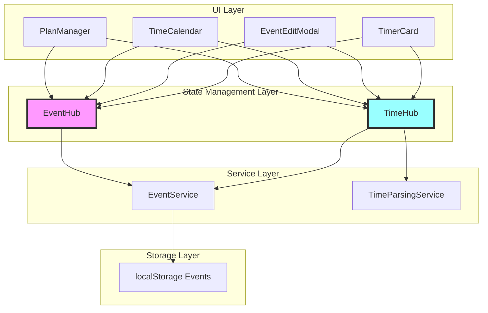
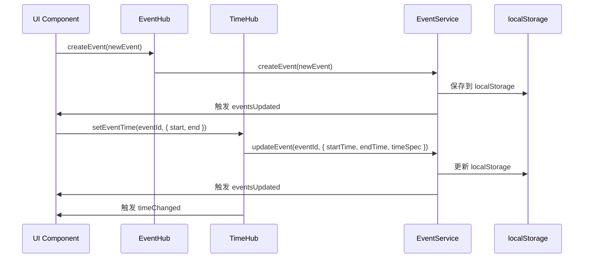
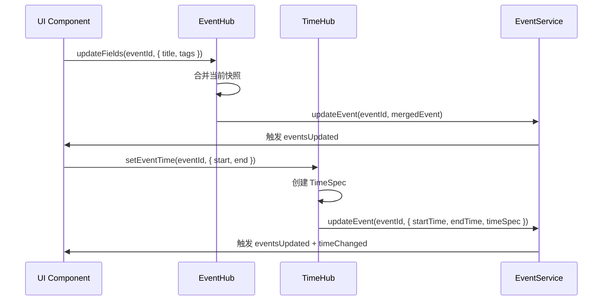
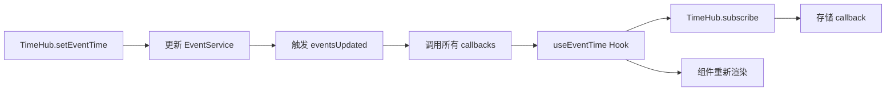
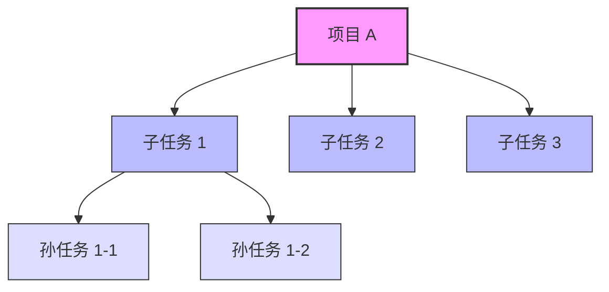
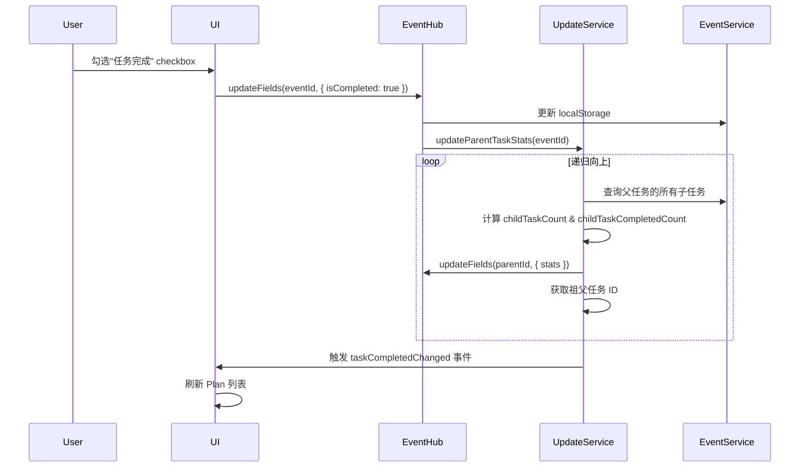

# EventHub & TimeHub 统一架构文档

> **文档版本**: v1.0  
> **创建时间**: 2025-11-06  
> **关联模块**: EventHub, TimeHub, EventService, TimeParsingService  
> **文档类型**: 核心架构文档

---

## 📋 目录

1. [架构概述](#1-架构概述)
2. [EventHub - 事件状态管理中心](#2-eventhub---事件状态管理中心)
3. [TimeHub - 时间意图管理中心](#3-timehub---时间意图管理中心)
4. [集成模式](#4-集成模式)
5. [数据流向](#5-数据流向)
6. [最佳实践](#6-最佳实践)
7. [常见问题](#7-常见问题)

---

## 1. 架构概述

### 1.1 设计理念

**EventHub** 和 **TimeHub** 是 ReMarkable 应用的两个核心状态管理中心，共同实现了**单一数据源（Single Source of Truth）**原则：

- **EventHub**: 管理事件的**所有非时间字段**（标题、标签、描述、优先级、组织者、参会人等）
- **TimeHub**: 管理事件的**时间字段和时间意图**（start/end/allDay/TimeSpec）

> **注意**: 组织者（organizer）和参会人（attendees）字段由 EventHub 管理，这些字段主要用于与 Microsoft Outlook 同步，支持会议协作场景。详见 [EventEditModal PRD](../PRD/EVENTEDITMODAL_MODULE_PRD.md#event-数据结构)。

### 1.2 版本更新历史

| 版本 | 日期 | 主要变更 |
|------|------|----------|
| **v1.0** | 2025-11-06 | 初始版本，定义 EventHub/TimeHub 职责 |
| **v1.1** | 2025-11-06 | 添加 EventEditModal v2 新字段支持（emoji, isTimeCalendar, 任务关联字段） |

### 1.2 架构图



### 1.3 职责划分

| 组件 | 职责 | 数据类型 | 代码位置 |
|------|------|----------|----------|
| **EventHub** | 事件状态管理、增量更新、缓存 | Event (非时间字段) | `src/services/EventHub.ts` |
| **TimeHub** | 时间意图管理、TimeSpec 存储、订阅通知 | TimeSpec, start/end | `src/services/TimeHub.ts` |
| **EventService** | 事件 CRUD 统一入口、持久化 | Event (完整) | `src/services/EventService.ts` |
| **TimeParsingService** | 自然语言时间解析 | rawText → TimeSpec | `src/services/TimeParsingService.ts` |

---

## 2. EventHub - 事件状态管理中心

### 2.1 核心概念

**EventHub** 是事件的**内存快照管理器**，提供：
- ✅ **快照缓存**: 避免频繁读取 localStorage
- ✅ **增量更新**: 只更新变化的字段，避免覆盖
- ✅ **全局通知**: 通过 `eventUpdated` 事件通知 UI

### 2.2 核心 API

#### 2.2.1 getSnapshot - 获取事件快照

```typescript
EventHub.getSnapshot(eventId: string): Event | null
```

**用途**: 获取事件的最新状态（从缓存或 EventService）

**示例**:
```typescript
const event = EventHub.getSnapshot('event-123');
if (event) {
  console.log('当前标题:', event.title);
  console.log('当前标签:', event.tags);
}
```

**特性**:
- 优先从内存缓存读取（快速）
- 缓存未命中时从 EventService 冷加载
- 返回副本，防止外部修改

#### 2.2.2 updateFields - 增量更新

```typescript
EventHub.updateFields(
  eventId: string,
  updates: Partial<Event>,
  options?: { skipSync?: boolean; source?: string }
): Promise<Result>
```

**用途**: 只更新指定字段，避免覆盖其他字段

**示例**:
```typescript
// ✅ 正确：只更新标题和标签
await EventHub.updateFields('event-123', {
  title: '新标题',
  tags: ['tag1', 'tag2']
}, { source: 'PlanManager' });

// ❌ 错误：覆盖整个对象
const event = EventHub.getSnapshot('event-123');
event.title = '新标题';
await EventService.updateEvent('event-123', event); // 会覆盖 description 等字段！
```

**特性**:
- 自动合并当前快照
- 记录字段变化（调试用）
- 更新缓存 + 持久化到 EventService
- 发出 `eventUpdated` 全局事件

#### 2.2.3 setEventTime - 时间字段便捷方法

```typescript
EventHub.setEventTime(
  eventId: string,
  timeInput: {
    start?: string | Date;
    end?: string | Date;
    kind?: TimeKind;
    allDay?: boolean;
    source?: TimeSource;
  },
  options?: { skipSync?: boolean }
): Promise<Result>
```

**用途**: 通过 EventHub 调用 TimeHub，简化时间更新

**示例**:
```typescript
await EventHub.setEventTime('event-123', {
  start: '2025-11-06T09:00:00',
  end: '2025-11-06T10:00:00',
  kind: 'range',
  source: 'picker'
});
```

#### 2.2.4 createEvent - 创建事件

```typescript
EventHub.createEvent(event: Event, options?: { skipSync?: boolean }): Promise<Result>
```

**用途**: 创建新事件并缓存

#### 2.2.5 deleteEvent - 删除事件

```typescript
EventHub.deleteEvent(eventId: string, options?: { skipSync?: boolean }): Promise<Result>
```

**用途**: 删除事件并清除缓存

#### 2.2.6 invalidate - 清除缓存

```typescript
EventHub.invalidate(eventId: string): void
EventHub.invalidateAll(): void
```

**用途**: 强制下次 `getSnapshot` 从 EventService 重新加载

---

## 3. TimeHub - 时间意图管理中心

### 3.1 核心概念

**TimeHub** 是时间字段的**单一数据源**，管理：
- ✅ **TimeSpec**: 用户的原始时间意图（如 "下周"、"明天9点"）
- ✅ **标准化时间**: start/end 的 ISO 字符串
- ✅ **订阅机制**: React Hook 订阅时间变化

### 3.2 TimeSpec 数据结构

```typescript
interface TimeSpec {
  kind: 'fixed' | 'range' | 'all-day' | 'deadline' | 'window' | 'fuzzy';
  source: 'picker' | 'parser' | 'timer' | 'import' | 'system';
  rawText?: string;           // 原始输入（如 "下周"）
  policy?: TimePolicy;        // 时间策略（weekStart, defaultTimeOfDay 等）
  start?: string;             // 标准化开始时间
  end?: string;               // 标准化结束时间
  allDay?: boolean;           // 是否全天
  resolved?: { start, end };  // 解析后的具体时间
  window?: { start, end, label }; // 窗口类型的边界
}
```

### 3.3 核心 API

#### 3.3.1 getSnapshot - 获取时间快照

```typescript
TimeHub.getSnapshot(eventId: string): TimeGetResult
```

**返回值**:
```typescript
interface TimeGetResult {
  timeSpec?: TimeSpec;
  start?: string;
  end?: string;
}
```

**示例**:
```typescript
const timeData = TimeHub.getSnapshot('event-123');
console.log('开始时间:', timeData.start);
console.log('结束时间:', timeData.end);
console.log('原始输入:', timeData.timeSpec?.rawText);
```

#### 3.3.2 setEventTime - 设置时间

```typescript
TimeHub.setEventTime(
  eventId: string,
  input: SetEventTimeInput,
  options?: { skipSync?: boolean }
): Promise<Result>
```

**输入参数**:
```typescript
interface SetEventTimeInput {
  start?: string | Date;
  end?: string | Date;
  kind?: TimeKind;
  allDay?: boolean;
  source?: TimeSource;
  policy?: Partial<TimePolicy>;
  rawText?: string;
  timeSpec?: TimeSpec;  // 直接替换 TimeSpec
}
```

**示例**:
```typescript
// 方式 1: 直接设置时间
await TimeHub.setEventTime('event-123', {
  start: '2025-11-06T09:00:00',
  end: '2025-11-06T10:00:00',
  kind: 'range',
  source: 'picker'
});

// 方式 2: 解析自然语言
await TimeHub.setFuzzy('event-123', '下周一早上9点');
```

#### 3.3.3 setFuzzy - 自然语言解析

```typescript
TimeHub.setFuzzy(
  eventId: string,
  rawText: string,
  options?: { policy?: Partial<TimePolicy> }
): Promise<Result>
```

**用途**: 解析自然语言时间（如 "下周"、"明天9点"）

**示例**:
```typescript
await TimeHub.setFuzzy('event-123', '下周一到周五');
// → 自动解析为 window: { start: '2025-11-11', end: '2025-11-15' }
```

#### 3.3.4 subscribe - 订阅时间变化

```typescript
TimeHub.subscribe(eventId: string, callback: () => void): () => void
```

**用途**: 监听某个事件的时间变化

**示例**:
```typescript
const unsubscribe = TimeHub.subscribe('event-123', () => {
  console.log('事件时间已更新');
  const newTime = TimeHub.getSnapshot('event-123');
  updateUI(newTime);
});

// 取消订阅
unsubscribe();
```

#### 3.3.5 setTimerWindow - Timer 专用更新

```typescript
TimeHub.setTimerWindow(
  eventId: string,
  input: { start: Date; end: Date }
): Promise<Result>
```

**用途**: Timer 运行中更新时间窗口，跳过外部同步

---

## 4. 集成模式

### 4.1 React Hook: useEventTime

**代码位置**: `src/hooks/useEventTime.ts`

**用途**: 在 React 组件中订阅事件时间

**示例**:
```typescript
function EventTimeDisplay({ eventId }: { eventId: string }) {
  const { start, end, timeSpec, setEventTime } = useEventTime(eventId);
  
  return (
    <div>
      <p>开始: {start}</p>
      <p>结束: {end}</p>
      <p>原始输入: {timeSpec?.rawText}</p>
      
      <button onClick={() => setEventTime({
        start: '2025-11-06T14:00:00',
        end: '2025-11-06T15:00:00'
      })}>
        更新时间
      </button>
    </div>
  );
}
```

**特性**:
- 使用 `useSyncExternalStore` 实现
- 自动订阅/取消订阅
- eventId 为空时返回冻结的空快照

### 4.2 组件集成最佳实践

#### 4.2.1 PlanManager 集成

```typescript
// ✅ 推荐：使用 TimeHub 订阅
const EventTimeComponent = ({ itemId }: { itemId: string }) => {
  const eventTime = useEventTime(itemId);
  
  return (
    <span>
      {eventTime.start ? formatTime(eventTime.start) : 'No time'}
    </span>
  );
};

// ✅ 更新时间通过 TimeHub
await TimeHub.setEventTime(itemId, {
  start: newStart,
  end: newEnd
});

// ✅ 更新非时间字段通过 EventHub
await EventHub.updateFields(itemId, {
  title: newTitle,
  tags: newTags
});
```

#### 4.2.2 FloatingToolbar 集成

```typescript
<HeadlessFloatingToolbar
  eventId={itemId}
  useTimeHub={true}  // ✅ 启用 TimeHub
  onTimeApplied={(eventId, { start, end }) => {
    // TimeHub 已自动更新，这里只更新 UI
    console.log('时间已更新:', start, end);
    
    // ⚠️ 不要再调用 syncToUnifiedTimeline
    // 因为 TimeHub 已经更新了 Event 的时间字段
  }}
/>
```

#### 4.2.3 EventEditModal 集成

```typescript
const handleSave = async (updatedEvent: Event) => {
  // ✅ 增量更新非时间字段
  await EventHub.updateFields(eventId, {
    title: updatedEvent.title,
    description: updatedEvent.description,
    tags: updatedEvent.tags,
    priority: updatedEvent.priority
  });
  
  // ✅ 更新时间字段
  await TimeHub.setEventTime(eventId, {
    start: updatedEvent.startTime,
    end: updatedEvent.endTime,
    allDay: updatedEvent.isAllDay,
    source: 'picker'
  });
};
```

---

## 5. 数据流向

### 5.1 创建事件流程



### 5.2 更新事件流程



### 5.3 订阅机制



---

## 6. 最佳实践

### 6.1 何时使用 EventHub vs EventService

| 场景 | 使用 | 原因 |
|------|------|------|
| **增量更新部分字段** | EventHub.updateFields | 避免覆盖其他字段 |
| **批量更新多个字段** | EventHub.updateFields | 一次性更新，性能更好 |
| **查询最新状态** | EventHub.getSnapshot | 优先使用缓存，快速 |
| **创建新事件** | EventHub.createEvent | 自动缓存 |
| **删除事件** | EventHub.deleteEvent | 自动清除缓存 |
| **需要跳过同步** | EventService 直接调用 | 提供 skipSync 参数 |

### 6.2 何时使用 TimeHub

| 场景 | 使用 | 原因 |
|------|------|------|
| **设置时间字段** | TimeHub.setEventTime | 保留时间意图 |
| **解析自然语言** | TimeHub.setFuzzy | 自动创建 TimeSpec |
| **订阅时间变化** | TimeHub.subscribe 或 useEventTime | 响应式更新 |
| **Timer 更新** | TimeHub.setTimerWindow | 跳过外部同步 |
| **获取时间快照** | TimeHub.getSnapshot | 获取 TimeSpec |

### 6.3 避免常见错误

#### ❌ 错误 1: 直接修改 getSnapshot 返回值

```typescript
// ❌ 错误
const event = EventHub.getSnapshot('event-123');
event.title = '新标题';
await EventService.updateEvent('event-123', event);
```

**问题**: 没有通过 EventHub 更新，缓存不一致

**✅ 正确**:
```typescript
await EventHub.updateFields('event-123', {
  title: '新标题'
});
```

#### ❌ 错误 2: 覆盖整个事件对象

```typescript
// ❌ 错误
const updatedEvent = {
  ...existingEvent,
  title: '新标题'
  // description 可能被覆盖为 undefined！
};
await EventService.updateEvent('event-123', updatedEvent);
```

**✅ 正确**:
```typescript
await EventHub.updateFields('event-123', {
  title: '新标题'
  // 其他字段保持不变
});
```

#### ❌ 错误 3: 时间更新后再调用 syncToUnifiedTimeline

```typescript
// ❌ 错误
await TimeHub.setEventTime(eventId, { start, end });
syncToUnifiedTimeline(item); // ⚠️ 会覆盖 TimeHub 刚写入的时间！
```

**✅ 正确**:
```typescript
await TimeHub.setEventTime(eventId, { start, end });
// 时间已更新，无需再同步
```

#### ❌ 错误 4: 不使用 TimeHub 直接更新时间

```typescript
// ❌ 错误
await EventService.updateEvent(eventId, {
  startTime: newStart,
  endTime: newEnd
  // timeSpec 丢失了！
});
```

**✅ 正确**:
```typescript
await TimeHub.setEventTime(eventId, {
  start: newStart,
  end: newEnd,
  source: 'picker'
  // 自动创建/更新 timeSpec
});
```

---

## 7. 常见问题

### 7.1 Q: EventHub 和 TimeHub 的缓存会过期吗？

**A**: 
- **EventHub**: 缓存永不过期，除非调用 `invalidate()`。依赖 `eventsUpdated` 事件保持同步。
- **TimeHub**: 缓存永不过期，除非调用 `cache.delete()`。依赖 `eventsUpdated` 事件保持同步。

### 7.2 Q: 为什么需要两个 Hub？

**A**: 职责分离：
- **EventHub**: 处理事件的**数据层面**（CRUD、缓存、增量更新）
- **TimeHub**: 处理时间的**意图层面**（TimeSpec、自然语言、窗口解析）

### 7.3 Q: Timer 事件为什么需要特殊处理？

**A**: Timer 运行中频繁更新时间（每30秒），需要：
- 使用 `local-only` syncStatus 避免频繁同步
- 使用 `setTimerWindow` 跳过外部同步
- Timer 停止后再同步到 Outlook

### 7.4 Q: 如何调试 EventHub/TimeHub？

**A**: 
```typescript
// 查看 EventHub 缓存
console.log(EventHub.getSnapshot('event-123'));

// 查看 TimeHub 快照
console.log(TimeHub.getSnapshot('event-123'));

// 监听更新事件
window.addEventListener('eventUpdated', (e: any) => {
  console.log('事件更新:', e.detail);
});

window.addEventListener('timeChanged', (e: any) => {
  console.log('时间更新:', e.detail);
});
```

### 7.5 Q: TimeSpec 的 policy 如何工作？

**A**: 
```typescript
// 默认策略 (src/config/time.config.ts)
export const defaultTimePolicy: TimePolicy = {
  weekStart: 1,  // 周一作为每周第一天
  windowResolution: 'snap-to-start',
  defaultTimeOfDay: '09:00'
};

// 组件可以覆盖策略
await TimeHub.setFuzzy('event-123', '下周', {
  policy: {
    weekStart: 0  // 临时使用周日作为每周第一天
  }
});
```

---

## 8. Event 类型字段完整定义

### 8.1 核心字段

```typescript
interface Event {
  // ========== 基础标识 ==========
  id: string;                      // 事件唯一标识
  title: string;                   // 事件标题
  description?: string;            // 事件描述（HTML 格式）
  emoji?: string;                  // 🆕 v1.1：事件 Emoji 图标
  
  // ========== 时间字段（由 TimeHub 管理） ==========
  startTime?: string;              // 开始时间（ISO 8601 本地时间）
  endTime?: string;                // 结束时间（ISO 8601 本地时间）
  dueDate?: string;                // 截止日期
  isAllDay?: boolean;              // 是否全天事件
  timeSpec?: TimeSpec;             // 时间意图对象（TimeHub 专用）
  
  // ========== 分类与标签 ==========
  tags?: string[];                 // 标签 ID 数组
  calendarId?: string;             // 所属日历 ID
  priority?: number;               // 优先级（1-5）
  
  // ========== 协作字段（EventHub 管理） ==========
  organizer?: Contact;             // 组织者
  attendees?: Contact[];           // 参会人列表
  location?: string;               // 地点
  
  // ========== 来源标识 ==========
  remarkableSource?: boolean;      // 是否由 ReMarkable 创建
  microsoftEventId?: string;       // Outlook 事件 ID
  isPlan?: boolean;                // 🆕 v1.1：是否从 Plan 页面创建
  isTimeCalendar?: boolean;        // 🆕 v1.1：是否从 TimeCalendar 日历区域直接创建
  
  // ========== 任务模式（EventEditModal v2） ==========
  isTask?: boolean;                // 🆕 v1.1：是否为任务模式
  isCompleted?: boolean;           // 🆕 v1.1：任务是否已完成
  
  // ========== 任务关联（EventEditModal v2） ==========
  parentTaskId?: string;           // 🆕 v1.1：父任务 ID
  childTaskCount?: number;         // 🆕 v1.1：子任务总数
  childTaskCompletedCount?: number; // 🆕 v1.1：已完成子任务数量
  
  // ========== 元数据 ==========
  createdAt?: string;              // 创建时间
  updatedAt?: string;              // 更新时间
  syncStatus?: 'synced' | 'pending' | 'error' | 'local-only'; // 同步状态
}
```

### 8.2 新增字段详解（v1.1）

#### 8.2.1 emoji - 事件图标

```typescript
emoji?: string;  // 如 "🎯"、"📝"
```

**用途**: 显示在 EventEditModal v2 顶部左侧的大图标

**显示优先级**:
1. `event.emoji`（用户手动选择）
2. `event.tags[0].emoji`（首个标签的 emoji）
3. 默认图标 `'📝'`

**关联文档**: [EventEditModal v2 PRD § 1.1](../PRD/EVENTEDITMODAL_V2_PRD.md#11-emoji大图标)

---

#### 8.2.2 isTimeCalendar - 日历区域创建标识

```typescript
isTimeCalendar?: boolean;
```

**用途**: 区分事件的创建来源，决定是否显示"计划安排"section

**显示条件**:
```typescript
// EventEditModal v2 的【中 Section】显示条件
function shouldShowPlanSection(event: Event): boolean {
  // 只要不是 TimeCalendar 日历区域直接创建的，就显示
  return event.isTimeCalendar !== true;
}
```

**关联文档**: [EventEditModal v2 PRD § 2](../PRD/EVENTEDITMODAL_V2_PRD.md#中-section---计划安排条件显示)

---

#### 8.2.3 isTask - 任务模式标识

```typescript
isTask?: boolean;
```

**用途**: 显示任务勾选框（checkbox icon）

**显示条件**:
```typescript
function shouldShowTaskCheckbox(event: Event): boolean {
  // 只有从 Plan 页面创建且用户没关闭 addTask 按钮的事件才显示
  return event.isPlan === true && event.isTask !== false;
}
```

**关联文档**: [EventEditModal v2 PRD § 1.4](../PRD/EVENTEDITMODAL_V2_PRD.md#14-任务勾选框条件显示)

---

#### 8.2.4 isCompleted - 任务完成状态

```typescript
isCompleted?: boolean;
```

**用途**: 
- 在 Plan 页面列表中显示为已完成（带 ✓ icon）
- EventEditModal v2 的【Plan提示区域】勾选框绑定此字段

**更新时机**:
```typescript
// 用户勾选 Plan 提示区域的 checkbox
const handleCompletedChange = async (isCompleted: boolean) => {
  await EventHub.updateFields(eventId, { isCompleted });
  
  // 更新父任务的统计数据
  await updateParentTaskStats(eventId);
};
```

**关联文档**: [EventEditModal v2 PRD § 4.1](../PRD/EVENTEDITMODAL_V2_PRD.md#41-创建时间--ddl-倒计时)

---

#### 8.2.5 parentTaskId - 父任务关联

```typescript
parentTaskId?: string;
```

**用途**: 建立任务层级关系，支持多层嵌套

**显示示例**:
```tsx
// EventEditModal v2【关联区域】
<div onClick={() => jumpToTask(event.parentTaskId)}>
  🔗 上级任务：{parentEvent.title}
  ，同级任务已完成{event.childTaskCompletedCount}/{event.childTaskCount}
  ，点击查看和修改任务群
</div>
```

**关联文档**: [EventEditModal v2 PRD § 5.1](../PRD/EVENTEDITMODAL_V2_PRD.md#51-上级任务)

---

#### 8.2.6 childTaskCount & childTaskCompletedCount - 子任务统计

```typescript
childTaskCount?: number;         // 子任务总数
childTaskCompletedCount?: number; // 已完成子任务数量
```

**用途**: 显示任务进度（如 "5/7"），支持多层嵌套累加

**更新逻辑**:
```typescript
/**
 * 递归向上更新所有父任务的子任务统计
 * 当子任务的 isCompleted 状态变化时调用
 */
export async function updateParentTaskStats(childEventId: string): Promise<void> {
  const childEvent = await EventService.getEventById(childEventId);
  if (!childEvent || !childEvent.parentTaskId) return;
  
  // 递归向上更新所有父任务
  let currentParentId = childEvent.parentTaskId;
  
  while (currentParentId) {
    const parentEvent = await EventService.getEventById(currentParentId);
    if (!parentEvent) break;
    
    // 查询所有子任务
    const childEvents = await EventService.getEventsByParentId(currentParentId);
    
    // 计算统计数据
    const childTaskCount = childEvents.length;
    const childTaskCompletedCount = childEvents.filter(e => e.isCompleted).length;
    
    // 更新父任务
    await EventHub.updateFields(currentParentId, {
      childTaskCount,
      childTaskCompletedCount,
    });
    
    // 继续向上递归
    currentParentId = parentEvent.parentTaskId;
  }
}
```

**使用示例**:
```typescript
// 当任务完成状态变化时
const handleTaskCompleted = async (eventId: string, isCompleted: boolean) => {
  // 1. 更新自身状态
  await EventHub.updateFields(eventId, { isCompleted });
  
  // 2. 递归更新所有父任务的统计数据
  await updateParentTaskStats(eventId);
  
  // 3. 触发 UI 更新
  EventHub.emit('taskCompletedChanged', { eventId, isCompleted });
};
```

**关联文档**: [EventEditModal v2 PRD § 5.1](../PRD/EVENTEDITMODAL_V2_PRD.md#51-上级任务)

---

### 8.3 字段管理职责划分

| 字段类型 | 管理者 | 更新方式 |
|---------|--------|----------|
| **时间字段** (startTime, endTime, timeSpec) | **TimeHub** | `TimeHub.setEventTime()` |
| **非时间字段** (title, tags, description, emoji, etc.) | **EventHub** | `EventHub.updateFields()` |
| **任务统计** (childTaskCount, childTaskCompletedCount) | **EventHub** | `updateParentTaskStats()` 自动计算 |
| **协作字段** (organizer, attendees) | **EventHub** | `EventHub.updateFields()` |

---

## 9. 任务关联功能实现指南

### 9.1 任务层级结构



### 9.2 统计数据更新流程



### 9.3 EventService 新增方法

需要在 `src/services/EventService.ts` 中添加以下方法：

```typescript
/**
 * 根据父任务 ID 查询所有子任务
 */
export function getEventsByParentId(parentTaskId: string): Event[] {
  const allEvents = getAllEvents();
  return allEvents.filter(event => event.parentTaskId === parentTaskId);
}

/**
 * 检查是否存在子任务
 */
export function hasChildTasks(eventId: string): boolean {
  const childTasks = getEventsByParentId(eventId);
  return childTasks.length > 0;
}
```

### 9.4 最佳实践

#### ✅ 创建子任务时自动关联

```typescript
// 创建子任务
const newChildTask: Event = {
  id: generateId(),
  title: '子任务标题',
  parentTaskId: parentEvent.id,  // ✅ 设置父任务 ID
  isPlan: true,
  isTask: true,
  // ... 其他字段
};

await EventHub.createEvent(newChildTask);

// ✅ 更新父任务的 childTaskCount
await updateParentTaskStats(newChildTask.id);
```

#### ✅ 删除子任务时更新统计

```typescript
// 删除子任务
await EventHub.deleteEvent(childTaskId);

// ✅ 更新父任务统计
if (childEvent.parentTaskId) {
  await updateParentTaskStats(childEvent.parentTaskId);
}
```

#### ✅ 显示任务进度

```typescript
function renderTaskProgress(event: Event): ReactNode {
  if (!event.childTaskCount || event.childTaskCount === 0) {
    return null;
  }
  
  const progress = event.childTaskCompletedCount || 0;
  const total = event.childTaskCount;
  const percentage = Math.round((progress / total) * 100);
  
  return (
    <div className="task-progress">
      <span className="progress-text">{progress}/{total}</span>
      <div className="progress-bar">
        <div 
          className="progress-fill" 
          style={{ width: `${percentage}%` }}
        />
      </div>
    </div>
  );
}
```

---

## 📚 相关文档

- [TIME_ARCHITECTURE.md](../TIME_ARCHITECTURE.md) - 统一时间架构
- [EventHub-Migration-Guide.md](../../_archive/legacy-docs/reports/EventHub-Migration-Guide.md) - EventHub 迁移指南
- [SYNC_MECHANISM_PRD.md](./SYNC_MECHANISM_PRD.md) - 同步机制文档

---

**文档版本**: v1.0  
**最后更新**: 2025-11-06  
**维护者**: GitHub Copilot
