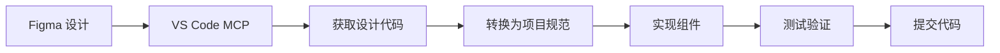

# ReMarkable v1.0 开发规范文档

## 项目概述

ReMarkable v1.0 是一个基于 React + TypeScript 的智能时间管理与日历同步工具，采用设计驱动开发流程，通过 Figma 集成实现高效的设计到代码转换。

## 版本信息

- **当前版本**: v1.0.0
- **开发起点**: v1.0.0-dev
- **技术栈**: React 18 + TypeScript + 原生 CSS
- **设计工具**: Figma + VS Code MCP 集成
- **同步服务**: Microsoft Graph API

## 核心功能架构

### 1. 日历同步系统
- **ActionBasedSyncManager**: 核心同步引擎，支持增量同步和冲突解决
- **MicrosoftCalendarService**: Microsoft Graph API 集成服务
- **错误处理**: deletedEventIds 跟踪，防止重复事件和删除回滚

### 2. 标签管理系统
- **TagService**: 层次化标签管理服务
- **TagManager**: 标签管理主界面组件
- **TagManagement**: 基于 Figma 设计的标签管理页面组件

### 3. 时间线展示
- **UnifiedTimeline**: 统一时间线组件
- **EventManager**: 事件管理组件

## 设计系统规范

基于 Figma 设计文件: `T0WLjzvZMqEnpX79ILhSNQ`

### 色彩系统
```css
/* 主色调 */
--primary-blue: #3b82f6;
--primary-blue-dark: #2164d1;
--primary-blue-darker: #1b55b3;

/* 功能色彩 */
--success-green: #10b981;
--warning-yellow: #f59e0b;
--error-red: #ef4444;

/* 中性色 */
--text-primary: #111827;
--text-secondary: #6b7280;
--text-muted: #9ca3af;
--background: #f8f9fa;
--surface: #ffffff;
```

### 字体系统
```css
/* 字体族 */
--font-primary: 'Microsoft YaHei', Arial;

/* 字体大小 */
--text-xs: 12px;
--text-sm: 14px;
--text-base: 16px;
--text-lg: 18px;
--text-xl: 20px;
--text-2xl: 24px;

/* 行高 */
--leading-tight: 1.25;
--leading-normal: 1.5;
--leading-loose: 1.75;
```

### 间距系统
```css
/* 间距变量 */
--spacing-xs: 4px;
--spacing-sm: 8px;
--spacing-md: 16px;
--spacing-lg: 24px;
--spacing-xl: 32px;
--spacing-2xl: 48px;
```

### 阴影系统
```css
/* 阴影效果 */
--shadow-sm: 0 1px 2px rgba(0, 0, 0, 0.05);
--shadow-md: 5px 5px 10px rgba(0, 0, 0, 0.05);
--shadow-lg: 0 25px 50px rgba(0, 0, 0, 0.3);
--shadow-button: 0px 2px 2px rgba(0, 0, 0, 0.25);
```

## 组件架构规范

### 1. 标签管理页面 (TagManagement)

基于 Figma 设计节点: `82:487`

#### 主要组件结构:
```
TagManagement
├── TagSettingCard (主容器)
│   ├── 标签层次结构显示区域
│   ├── 日历映射显示区域  
│   ├── 统计信息显示区域
│   └── 操作按钮区域
├── FocusSettingCard (专注配置)
└── 搜索和过滤功能
```

#### 设计规范:
- **容器尺寸**: 1041x853px
- **圆角**: 20px
- **背景**: 白色，带阴影 `5px 5px 10px rgba(0,0,0,0.05)`
- **字体**: Microsoft Yahei Regular 13px

#### 交互规范:
- 🎯 点击 Emoji 修改表情
- ⌨️ Tab 键进入下一级标签
- ⬆️⬇️ Shift+Alt+↑/↓ 上移/下移标签
- 🔍 搜索功能支持实时过滤

### 2. 图标系统

#### 内置图标组件:
- **RecycleColor**: 回收/频率图标
- **TimingColor**: 时间/持续时间图标  
- **LsiconFindFilled**: 搜索图标

#### 状态指示器:
- 🔵 蓝色圆点: 工作相关标签
- 🟢 绿色圆点: 生活相关标签
- 🟡 黄色圆点: 运动相关标签
- 🟣 紫色圆点: 娱乐相关标签

## 开发工作流程

### 1. 设计驱动开发流程



### 2. 组件开发步骤

1. **设计分析**: 使用 `mcp_figma_get_metadata` 获取设计结构
2. **代码生成**: 使用 `mcp_figma_get_code` 获取实现代码
3. **代码转换**: 将 Tailwind 转换为项目 CSS 规范
4. **功能实现**: 添加交互逻辑和状态管理
5. **测试验证**: 确保与设计完全一致

### 3. Git 工作流程

```bash
# 功能开发
git checkout -b feature/component-name
git add .
git commit -m "feat: 实现组件功能"

# 合并到主分支
git checkout master
git merge feature/component-name
git tag v1.0.x
```

## 文件组织结构

```
src/
├── components/           # React 组件
│   ├── TagManagement.tsx    # 标签管理页面
│   ├── TagManager.tsx       # 标签管理器
│   ├── CalendarSync.tsx     # 日历同步
│   └── *.css               # 组件样式
├── services/            # 业务服务
│   ├── TagService.ts        # 标签服务
│   ├── ActionBasedSyncManager.ts
│   └── MicrosoftCalendarService.ts
├── utils/               # 工具函数
│   ├── timeUtils.ts
│   └── persistentStorage.ts
├── types.ts             # 类型定义
└── constants/           # 常量定义
```

## 质量标准

### 1. 代码质量
- ✅ TypeScript 严格模式
- ✅ ESLint 规则检查
- ✅ 组件单一职责原则
- ✅ 完整的类型定义

### 2. 设计还原
- ✅ 像素级精确度 (±2px)
- ✅ 色彩完全匹配
- ✅ 字体和间距一致
- ✅ 交互效果还原

### 3. 性能要求
- ✅ 组件懒加载
- ✅ 避免不必要的重渲染
- ✅ 内存泄漏检查
- ✅ 同步操作优化

## 下一步开发计划

1. **完成标签管理页面**: 基于 Figma 设计实现完整的标签管理界面
2. **专注表盘功能**: 实现专注时间统计和管理
3. **高级搜索功能**: 支持多维度事件搜索和过滤
4. **批量操作**: 支持批量标签分配和事件管理
5. **数据可视化**: 时间分布图表和统计分析

---

*文档版本: v1.0.0*  
*最后更新: 2025-10-13*