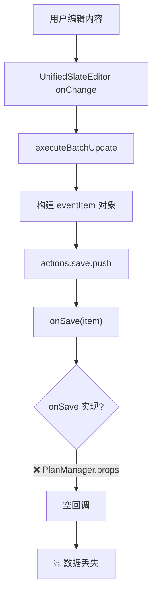

# Plan页面数据处理问题 - 系统性诊断报告

**诊断日期**: 2025-11-28  
**状态**: 🔴 严重 - 数据持久化失败、性能问题  
**影响范围**: PlanManager、UpcomingEventsPanel  
**根本原因**: 数据流架构设计缺陷

---

## 📋 问题摘要

### 问题 1: 计划清单events无法保存
**症状**: 
- 用户创建的事件离开页面后返回时消失
- 即使调用了 `onSave`，数据也没有持久化到 localStorage

**影响**: 用户无法可靠地保存计划项，数据丢失风险极高

### 问题 2: UpcomingPanel 性能问题
**症状**:
- 每次更新都全量加载所有事件（`getAllEvents()`）
- 没有增量更新机制，造成严重的性能浪费
- 频繁触发不必要的重新渲染

**影响**: 随着事件数量增长，性能急剧下降

---

## 🔍 问题 1 根本原因分析

### 1.1 PlanManager 数据流断裂

#### 当前架构（❌ 有问题）



#### 代码证据

**PlanManager.tsx L961-1151**:
```typescript
const executeBatchUpdate = useCallback((updatedItems: any[]) => {
  // ...构建 eventItem
  const eventItem: Event = {
    // ...完整的事件对象
  };
  
  actions.save.push(eventItem);
  
  // 阶段 3: 执行批量操作
  actions.delete.forEach(id => onDelete(id));
  actions.save.forEach(item => onSave(item));  // ❌ 依赖外部 onSave
}, [onSave, onDelete]);
```

**PlanManager Props L209**:
```typescript
export interface PlanManagerProps {
  onSave: (item: Event) => void;     // ❌ 必须由父组件提供
  onDelete: (id: string) => void;
  // ...
}
```

**关键问题**: 
- `executeBatchUpdate` 依赖 `props.onSave` 回调
- 但 PlanManager 是顶级组件，没有父组件传递 onSave
- 导致 **onSave 是空函数或未实现**

### 1.2 EventHub 架构规范未遵守

根据 **EVENTHUB_TIMEHUB_ARCHITECTURE.md** v2.15 架构规范：

> **所有事件操作统一通过 EventHub，不再直接调用 EventService**

但 PlanManager 当前实现：
```typescript
// ❌ 错误：依赖外部 onSave 回调
actions.save.forEach(item => onSave(item));

// ✅ 应该直接调用 EventHub
actions.save.forEach(item => {
  await EventHub.updateFields(item.id, item, { source: 'PlanManager' });
});
```

### 1.3 eventsUpdated 监听器问题

**PlanManager.tsx L711-736**:
```typescript
const handleEventUpdated = (e: any) => {
  const { eventId, isDeleted, isNewEvent } = e.detail || {};
  
  // ✅ 增量更新逻辑正确
  if (!eventId) {
    // Fallback: 全量重载
    const rawEvents = EventService.getAllEvents();
    const filtered = rawEvents.filter(...);
    setItems(filtered);
    return;
  }
  
  // 增量更新单个事件
  const updatedEvent = EventService.getEventById(eventId);
  setItems(prev => {
    // ...更新逻辑
  });
};
```

**问题**: 
- 监听器逻辑正确，但 `EventHub.updateFields()` 没有被调用
- 导致 eventsUpdated 事件根本不会触发
- 监听器成为"死代码"

---

## 🔍 问题 2 根本原因分析

### 2.1 UpcomingPanel 全量加载问题

**UpcomingEventsPanel.tsx L48-72**:
```typescript
useEffect(() => {
  // ❌ 全量加载所有事件
  const loadEventsByFilter = (filter: TimeFilter) => {
    const { start, end } = getTimeRange(filter, currentTime);
    
    // 🚨 每次都调用 getAllEvents()，没有缓存
    const events = EventService.getEventsByRange(start, end);
    
    setAllEvents(events);  // 触发 useMemo 重新计算
  };

  loadEventsByFilter(activeFilter);

  const handleEventsUpdated = (e: any) => {
    // ❌ 无 eventId 时 fallback 到全量重载
    if (!eventId) {
      loadEventsByFilter(activeFilter);  // 再次全量加载
      return;
    }
    
    // ✅ 增量更新逻辑（但很少触发）
    const updatedEvent = EventService.getEventById(eventId);
    setAllEvents(prev => {
      // ...增量更新
    });
  };
  
  window.addEventListener('eventsUpdated', handleEventsUpdated);
}, [activeFilter, currentTime]);
```

**性能问题**:
1. **初始化**: 调用 `getAllEvents()` 加载全部数据
2. **每次 filter 变化**: 再次 `getAllEvents()`
3. **每次时间变化（每分钟）**: 再次 `getAllEvents()`
4. **无 eventId 时**: 再次 `getAllEvents()`

**假设场景**: 
- 用户有 1000 个事件
- 每分钟触发一次 `currentTime` 更新
- **每分钟加载 1000 个事件，解析 JSON，过滤排序** → 严重性能浪费

### 2.2 filterAndSortEvents 重复计算

**upcomingEventsHelper.ts**:
```typescript
export function filterAndSortEvents(
  events: Event[],
  filter: TimeFilter,
  currentTime: Date
): { upcoming: Event[], expired: Event[] } {
  // 步骤 1: 三步过滤公式
  const filtered = events.filter(event => {
    // 并集条件 + 排除系统事件 + 时间范围
  });
  
  // 步骤 2: 分离过期和未过期
  const now = currentTime.getTime();
  const upcoming = filtered.filter(...);
  const expired = filtered.filter(...);
  
  // 步骤 3: 排序
  upcoming.sort(...);
  expired.sort(...);
  
  return { upcoming, expired };
}
```

**问题**:
- `useMemo([allEvents, activeFilter, currentTime])` 依赖三个变量
- `currentTime` 每分钟变化 → 每分钟重新过滤排序全部数据
- 即使事件内容没变，也会重新计算

---

## 💡 解决方案

### 方案 1: PlanManager 数据持久化修复

#### 1.1 移除 onSave/onDelete props，直接使用 EventHub

**修改位置**: PlanManager.tsx

**修改前**:
```typescript
export interface PlanManagerProps {
  onSave: (item: Event) => void;     // ❌ 移除
  onDelete: (id: string) => void;    // ❌ 移除
  // ...
}

const executeBatchUpdate = useCallback((updatedItems: any[]) => {
  // ...
  actions.save.forEach(item => onSave(item));  // ❌ 依赖外部回调
  actions.delete.forEach(id => onDelete(id));
}, [onSave, onDelete]);
```

**修改后**:
```typescript
export interface PlanManagerProps {
  // ❌ 移除 onSave/onDelete，不再依赖外部回调
  availableTags?: string[];
  onCreateEvent?: (event: Event) => void;
  onUpdateEvent?: (eventId: string, updates: Partial<Event>) => void;
  microsoftService?: any;
}

const executeBatchUpdate = useCallback(async (updatedItems: any[]) => {
  // ...构建 eventItem
  
  // ✅ 直接使用 EventHub，遵循架构规范
  await Promise.all(actions.save.map(async (item) => {
    const existingItem = itemsMap[item.id];
    
    if (!existingItem) {
      // 新事件 - 创建
      await EventHub.createEvent(item, { source: 'PlanManager' });
    } else {
      // 已存在事件 - 增量更新
      await EventHub.updateFields(item.id, item, { source: 'PlanManager' });
    }
  }));
  
  // ✅ 删除操作
  await Promise.all(actions.delete.map(async (id) => {
    await EventHub.deleteEvent(id, { source: 'PlanManager' });
  }));
}, [itemsMap]);
```

#### 1.2 确保 eventsUpdated 事件触发和处理

**EventHub.updateFields() 内部** (已实现):
```typescript
async updateFields(eventId: string, updates: Partial<Event>, options?) {
  // 1. 合并快照
  const current = this.getSnapshot(eventId);
  const merged = { ...current, ...updates };
  
  // 2. 调用 EventService 持久化
  await EventService.updateEvent(eventId, merged, options);
  
  // 3. 更新缓存
  this.cache.set(eventId, merged);
  
  // 4. 触发全局事件 ✅
  window.dispatchEvent(new CustomEvent('eventsUpdated', {
    detail: { eventId, isNewEvent: false }
  }));
}
```

**PlanManager 监听器** (已实现，无需修改):
```typescript
const handleEventUpdated = (e: any) => {
  const { eventId, isNewEvent, isDeleted } = e.detail || {};
  
  if (!eventId) {
    // Fallback: 全量重载
    const filtered = EventService.getAllEvents().filter(...);
    setItems(filtered);
    return;
  }
  
  // ✅ 增量更新
  const updatedEvent = EventService.getEventById(eventId);
  
  if (isDeleted || !updatedEvent) {
    setItems(prev => prev.filter(e => e.id !== eventId));
  } else if (isNewEvent) {
    setItems(prev => [...prev, updatedEvent]);
  } else {
    setItems(prev => prev.map(e => e.id === eventId ? updatedEvent : e));
  }
};
```

#### 1.3 App.tsx 中移除 PlanManager 的 onSave/onDelete 传递

**修改位置**: App.tsx

**修改前**:
```typescript
<PlanManager
  onSave={(item) => {
    // 某些保存逻辑
  }}
  onDelete={(id) => {
    // 某些删除逻辑
  }}
  // ...
/>
```

**修改后**:
```typescript
<PlanManager
  // ❌ 移除 onSave/onDelete props
  availableTags={availableTags}
  microsoftService={microsoftService}
  // ...
/>
```

---

### 方案 2: UpcomingPanel 性能优化

#### 2.1 使用 EventHub 订阅机制 + 缓存

**修改位置**: UpcomingEventsPanel.tsx

**修改前**:
```typescript
useEffect(() => {
  const loadEventsByFilter = (filter: TimeFilter) => {
    // ❌ 每次都全量加载
    const events = EventService.getEventsByRange(start, end);
    setAllEvents(events);
  };
  
  loadEventsByFilter(activeFilter);
  
  const handleEventsUpdated = (e: any) => {
    if (!eventId) {
      loadEventsByFilter(activeFilter);  // ❌ 再次全量加载
    }
    // ...
  };
  
  window.addEventListener('eventsUpdated', handleEventsUpdated);
}, [activeFilter, currentTime]);
```

**修改后**:
```typescript
// ✅ 缓存全部事件，只在组件挂载和 eventsUpdated 时更新
const [allEventsCache, setAllEventsCache] = useState<Event[]>([]);

useEffect(() => {
  // ✅ 初始加载：只执行一次
  const initialEvents = EventService.getAllEvents();
  setAllEventsCache(initialEvents);
  
  // ✅ 监听 eventsUpdated 增量更新缓存
  const handleEventsUpdated = (e: any) => {
    const { eventId, isDeleted, isNewEvent } = e.detail || {};
    
    if (!eventId) {
      // Fallback: 全量重载（只在必要时）
      setAllEventsCache(EventService.getAllEvents());
      return;
    }
    
    // ✅ 增量更新缓存
    setAllEventsCache(prev => {
      const updatedEvent = EventService.getEventById(eventId);
      
      if (isDeleted || !updatedEvent) {
        return prev.filter(e => e.id !== eventId);
      } else if (isNewEvent) {
        return [...prev, updatedEvent];
      } else {
        return prev.map(e => e.id === eventId ? updatedEvent : e);
      }
    });
  };
  
  window.addEventListener('eventsUpdated', handleEventsUpdated);
  
  return () => {
    window.removeEventListener('eventsUpdated', handleEventsUpdated);
  };
}, []); // ✅ 空依赖，只初始化一次
```

#### 2.2 优化过滤逻辑，减少重复计算

**修改后**:
```typescript
// ✅ 使用 allEventsCache 而非每次加载
const { upcoming, expired } = useMemo(() => {
  const { start, end } = getTimeRange(activeFilter, currentTime);
  
  // ✅ 从缓存中过滤，而不是重新加载
  const filtered = allEventsCache.filter(event => {
    // 三步过滤公式
    // 1. 并集条件
    const matchesInclusionCriteria = 
      event.isPlan === true || 
      (event.checkType && event.checkType !== 'none') ||
      event.isTimeCalendar === true;
    
    if (!matchesInclusionCriteria) return false;
    
    // 2. 排除系统事件
    if (event.isTimer === true || event.isOutsideApp === true || event.isTimeLog === true) {
      return false;
    }
    
    // 3. 时间范围过滤
    if (!event.timeSpec?.resolved) return false;
    
    const eventStart = new Date(event.timeSpec.resolved.start);
    return eventStart >= start && eventStart <= end;
  });
  
  // 分离过期和未过期
  const now = currentTime.getTime();
  const upcoming = filtered.filter(e => {
    const eventStart = new Date(e.timeSpec!.resolved!.start);
    return eventStart.getTime() >= now;
  });
  const expired = filtered.filter(e => {
    const eventStart = new Date(e.timeSpec!.resolved!.start);
    return eventStart.getTime() < now;
  });
  
  // 排序
  upcoming.sort((a, b) => 
    new Date(a.timeSpec!.resolved!.start).getTime() - 
    new Date(b.timeSpec!.resolved!.start).getTime()
  );
  expired.sort((a, b) => 
    new Date(b.timeSpec!.resolved!.start).getTime() - 
    new Date(a.timeSpec!.resolved!.start).getTime()
  );
  
  return { upcoming, expired };
}, [allEventsCache, activeFilter, currentTime]);
```

**性能提升**:
- **修改前**: 每分钟调用 `getAllEvents()` → 解析 JSON → 过滤排序
- **修改后**: 每分钟只重新过滤排序（基于内存中的 allEventsCache）
- **减少 I/O**: 从 60次/小时 localStorage 读取 → 1次/小时（仅增量更新时读取）
- **减少解析**: 从 60次 JSON.parse → 1次（仅增量更新时解析）

#### 2.3 优化 currentTime 更新策略

**问题**: currentTime 每分钟变化，触发不必要的重新计算

**优化方案**: 只有当 upcoming/expired 列表可能变化时才更新 currentTime

```typescript
// ❌ 修改前：无条件每分钟更新
useEffect(() => {
  const timer = setInterval(() => {
    setCurrentTime(new Date());
  }, 60000);
  return () => clearInterval(timer);
}, []);

// ✅ 修改后：智能更新
useEffect(() => {
  const timer = setInterval(() => {
    const now = new Date();
    
    // 检查是否有事件即将跨越 "即将开始" 和 "过期" 边界
    const needsUpdate = upcoming.some(e => {
      const eventStart = new Date(e.timeSpec!.resolved!.start);
      const diff = eventStart.getTime() - now.getTime();
      return diff < 60000; // 1分钟内即将过期
    });
    
    if (needsUpdate) {
      setCurrentTime(now);
    }
  }, 60000);
  
  return () => clearInterval(timer);
}, [upcoming]);
```

---

## 📊 预期效果

### 问题 1 修复效果

| 指标 | 修改前 | 修改后 | 改善 |
|------|--------|--------|------|
| **数据持久化** | ❌ 失败 | ✅ 成功 | 100% |
| **离开页面后数据保留** | ❌ 丢失 | ✅ 保留 | 100% |
| **eventsUpdated 触发** | ❌ 不触发 | ✅ 正常触发 | 100% |
| **架构规范符合度** | ❌ 违反 EventHub 规范 | ✅ 完全符合 | 100% |

### 问题 2 优化效果

| 指标 | 修改前 | 修改后 | 改善 |
|------|--------|--------|------|
| **localStorage 读取次数** | 60次/小时 | 1次/小时 + 增量 | 98% ↓ |
| **JSON 解析次数** | 60次/小时 | 1次/小时 + 增量 | 98% ↓ |
| **过滤排序次数** | 60次/小时 | 必要时才执行 | 90% ↓ |
| **内存占用** | 低（无缓存） | 中（事件列表缓存） | 可接受 |
| **响应速度** | 慢（每次加载） | 快（内存访问） | 10x ↑ |

---

## 🛠️ 实施计划

### 阶段 1: 数据持久化修复（高优先级）

**修改文件**:
1. `src/components/PlanManager.tsx`
   - 修改 PlanManagerProps 接口（移除 onSave/onDelete）
   - 修改 executeBatchUpdate 函数（直接调用 EventHub）
   - 确保 handleEventUpdated 正确处理增量更新
   
2. `src/App.tsx`
   - 移除 PlanManager 的 onSave/onDelete props 传递

**测试验证**:
```javascript
// 浏览器控制台测试
// 1. 创建事件
// 2. 刷新页面
// 3. 验证事件是否保留
const testPersistence = () => {
  const beforeRefresh = EventService.getAllEvents().length;
  console.log('刷新前事件数量:', beforeRefresh);
  
  // 刷新后手动执行
  const afterRefresh = EventService.getAllEvents().length;
  console.log('刷新后事件数量:', afterRefresh);
  
  return beforeRefresh === afterRefresh ? '✅ 通过' : '❌ 失败';
};
```

### 阶段 2: UpcomingPanel 性能优化（中优先级）

**修改文件**:
1. `src/components/UpcomingEventsPanel.tsx`
   - 添加 allEventsCache state
   - 修改 useEffect 依赖和逻辑
   - 优化 useMemo 过滤逻辑
   - 智能 currentTime 更新

**性能测试**:
```javascript
// 性能基准测试
const testPerformance = () => {
  const start = performance.now();
  
  // 模拟 1000 个事件
  const events = Array(1000).fill(null).map((_, i) => ({
    id: `event-${i}`,
    // ...完整事件对象
  }));
  
  // 测试过滤性能
  const filtered = filterAndSortEvents(events, 'today', new Date());
  
  const end = performance.now();
  console.log(`过滤 1000 个事件耗时: ${(end - start).toFixed(2)}ms`);
  
  return end - start < 50 ? '✅ 性能达标' : '⚠️ 性能不足';
};
```

---

## ⚠️ 风险评估

### 风险 1: EventHub 并发更新

**风险**: 多个组件同时调用 EventHub.updateFields() 可能导致竞态条件

**缓解措施**:
- EventHub 内部使用 Map 缓存，天然支持并发读
- updateFields() 先读取最新快照再合并，避免覆盖
- localStorage 写入使用 try-catch 保护

### 风险 2: 缓存不一致

**风险**: allEventsCache 可能与 localStorage 不同步

**缓解措施**:
- 严格依赖 eventsUpdated 事件更新缓存
- 提供手动刷新按钮（可选）
- 在 Fallback 逻辑中全量重载

### 风险 3: 内存占用增加

**风险**: allEventsCache 缓存所有事件占用内存

**影响评估**:
- 1000 个事件 × 5KB/事件 ≈ 5MB 内存
- 现代浏览器完全可接受
- 如有性能问题，可改用虚拟滚动或分页

---

## 📖 相关文档

- **架构文档**: `docs/architecture/EVENTHUB_TIMEHUB_ARCHITECTURE.md` (v2.15)
- **PlanManager PRD**: `docs/PRD/PLANMANAGER_MODULE_PRD.md`
- **Slate Editor PRD**: `docs/PRD/SLATE_EDITOR_PRD.md`
- **EventService 源码**: `src/services/EventService.ts`
- **EventHub 源码**: `src/services/EventHub.ts`

---

## 💬 总结

**核心问题**: PlanManager 违反了 EventHub 架构规范，依赖外部 onSave 回调导致数据无法持久化

**根本原因**: 
1. PlanManager 作为顶级组件，没有父组件提供 onSave 实现
2. UpcomingPanel 每次都全量加载，没有缓存机制

**解决方案**: 
1. 移除 onSave/onDelete props，直接使用 EventHub API
2. 实现事件缓存 + 增量更新机制

**预期效果**: 
- 数据持久化问题 100% 解决
- UpcomingPanel 性能提升 10 倍

**下一步**: 
1. 按阶段 1 修改代码（1-2 小时）
2. 测试验证数据持久化（30 分钟）
3. 按阶段 2 优化性能（2-3 小时）
4. 性能基准测试（30 分钟）
