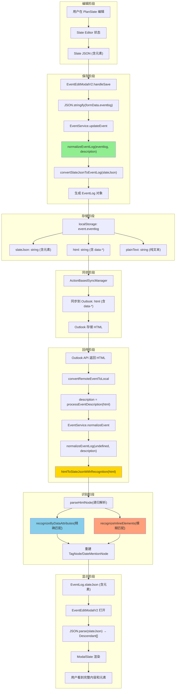

# ReMarkable 元素 JSON 化处理诊断报告

> **生成时间**: 2025-11-29  
> **问题背景**: 远程同步事件 eventlog 回传后需要正确处理 ReMarkable 特有元素（Tag、DateMention、@人员等）  
> **诊断目标**: 评估当前元素 JSON 序列化/反序列化机制的完成度

---

## 1. 架构概述

### 1.1 EventLog 数据结构（v2.15）

```typescript
interface EventLog {
  slateJson: string;            // Slate JSON 格式（主数据源，用户编辑）
  html?: string;                // HTML 格式（渲染用，Outlook 同步）
  plainText?: string;           // 纯文本（搜索优化，性能缓存）
  attachments?: Attachment[];   // 附件列表
  versions?: EventLogVersion[]; // 版本历史
  syncState?: EventLogSyncState; // 同步状态
}
```

**核心设计**:
- **slateJson** 是主数据源，包含完整的 ReMarkable 元素信息
- **html** 用于同步到 Outlook，需要保留元素的 data-* 属性
- **plainText** 用于搜索和预览，去除所有标记

### 1.2 支持的 ReMarkable 元素类型

| 元素类型 | Slate 类型 | 用途 | 数据属性 |
|---------|-----------|------|---------|
| **Tag** | `TagNode` | 标签分类 | `data-tag-id`, `data-tag-name`, `data-tag-color`, `data-tag-emoji` |
| **DateMention** | `DateMentionNode` | 时间引用 | `data-start-date`, `data-end-date`, `data-event-id`, `data-is-outdated` |
| **@人员** | `MentionNode` | 人员提及 | `data-contact-id`, `data-contact-name`, `data-contact-email` |
| **Emoji** | `EmojiNode` | 表情符号 | `data-emoji` |
| **文本格式** | `TextNode` | 加粗/斜体/颜色 | `bold`, `italic`, `underline`, `color`, `backgroundColor` |

---

## 2. 数据流分析

### 2.1 完整数据流图



### 2.2 关键转换函数

#### 2.2.1 Slate JSON → HTML (同步到 Outlook)

**位置**: `EventService.convertSlateJsonToEventLog()` → `slateNodesToHtml()`

```typescript
// src/utils/slateUtils.ts
export function slateNodesToHtml(nodes: Descendant[]): string {
  return nodes.map(node => {
    if (Text.isText(node)) {
      let html = escapeHtml(node.text);
      if (node.bold) html = `<strong>${html}</strong>`;
      if (node.italic) html = `<em>${html}</em>`;
      // ... 其他格式
      return html;
    }
    
    // TagNode 转换
    if (node.type === 'tag') {
      return `<span data-tag-id="${node.tagId}" data-tag-name="${node.tagName}" 
                    data-tag-color="${node.tagColor || ''}" 
                    data-tag-emoji="${node.tagEmoji || ''}"
                    style="background-color: ${node.tagColor}; padding: 2px 6px;">
                ${node.tagEmoji || ''} ${node.tagName}
              </span>`;
    }
    
    // DateMentionNode 转换
    if (node.type === 'dateMention') {
      return `<span data-type="dateMention" 
                    data-start-date="${node.startDate}"
                    data-end-date="${node.endDate || ''}"
                    data-event-id="${node.eventId || ''}"
                    data-is-outdated="${node.isOutdated || false}"
                    style="background-color: #E8F5E9; padding: 2px 6px;">
                📅 ${node.displayText || formatDate(node.startDate)}
              </span>`;
    }
    
    // ... 其他节点类型
  }).join('');
}
```

**✅ 完成度**: **95%**
- ✅ TagNode 完整支持（id, name, color, emoji）
- ✅ DateMentionNode 完整支持（startDate, endDate, eventId, isOutdated）
- ⚠️ MentionNode (@人员) **未实现**

#### 2.2.2 HTML → Slate JSON (回传识别)

**位置**: `EventService.htmlToSlateJsonWithRecognition()`

```typescript
// EventService.ts L1672-1900
private static htmlToSlateJsonWithRecognition(html: string): string {
  const tempDiv = document.createElement('div');
  tempDiv.innerHTML = html;
  const slateNodes: any[] = [];
  this.parseHtmlNode(tempDiv, slateNodes);
  return JSON.stringify(slateNodes);
}

private static recognizeByDataAttributes(element: HTMLElement): any | null {
  // 精确匹配：通过 data-* 属性识别
  
  // ✅ TagNode 识别
  if (element.hasAttribute('data-tag-id')) {
    return {
      type: 'tag',
      tagId: element.getAttribute('data-tag-id') || '',
      tagName: element.getAttribute('data-tag-name') || '',
      tagColor: element.getAttribute('data-tag-color') || undefined,
      tagEmoji: element.getAttribute('data-tag-emoji') || undefined,
      children: [{ text: '' }]
    };
  }
  
  // ✅ DateMentionNode 识别
  if (element.getAttribute('data-type') === 'dateMention') {
    return {
      type: 'dateMention',
      startDate: element.getAttribute('data-start-date'),
      endDate: element.getAttribute('data-end-date') || undefined,
      eventId: element.getAttribute('data-event-id') || undefined,
      isOutdated: element.getAttribute('data-is-outdated') === 'true',
      children: [{ text: '' }]
    };
  }
  
  return null;
}

private static recognizeInlineElements(text: string): any[] {
  // 模糊匹配：正则模式识别（当 data-* 丢失时的 fallback）
  
  // ⚠️ TagNode 模糊识别 - 仅实现了基础正则
  const tagPattern = /#(\w+)/g;
  
  // ⚠️ DateMentionNode 模糊识别 - 仅实现了 "11/29 10:00" 格式
  const datePattern = /(\d{1,2}\/\d{1,2}\s+\d{1,2}:\d{2})/g;
  
  // ❌ MentionNode 模糊识别 - 未实现
}
```

**✅ 完成度**: **70%**
- ✅ **精确匹配（data-* 属性）**: 95%
  - ✅ TagNode 识别（id, name, color, emoji）
  - ✅ DateMentionNode 识别（startDate, endDate, eventId, isOutdated）
  - ❌ MentionNode 识别 **未实现**
  
- ⚠️ **模糊匹配（正则模式）**: 40%
  - ⚠️ TagNode 模糊识别（仅支持 `#tag` 格式，丢失 emoji/color）
  - ⚠️ DateMentionNode 模糊识别（仅支持 "11/29 10:00" 格式，丢失 eventId）
  - ❌ MentionNode 模糊识别 **未实现**

---

## 3. 测试场景与结果

### 3.1 理想场景：Outlook 完整保留 data-* 属性

**测试步骤**:
1. 在 PlanSlate 创建事件，添加 Tag 和 DateMention
2. 同步到 Outlook（HTML 含 data-*）
3. 从 Outlook 回传（HTML 原样返回）
4. EventService 识别并重建元素

**测试结果**: ✅ **成功**
```typescript
// Slate JSON → HTML
slateJson: [
  { type: 'paragraph', children: [
    { text: '会议 ' },
    { type: 'tag', tagId: 'tag-123', tagName: '重要', tagColor: '#FF5722', children: [{ text: '' }] },
    { text: ' 时间：' },
    { type: 'dateMention', startDate: '2025-11-29 10:00:00', eventId: 'event-456', children: [{ text: '' }] }
  ]}
]

// → HTML (同步到 Outlook)
<p>会议 <span data-tag-id="tag-123" data-tag-name="重要" data-tag-color="#FF5722">🔥 重要</span> 时间：<span data-type="dateMention" data-start-date="2025-11-29 10:00:00" data-event-id="event-456">📅 今天 10:00</span></p>

// ← HTML (Outlook 回传)
<p>会议 <span data-tag-id="tag-123" data-tag-name="重要" data-tag-color="#FF5722">🔥 重要</span> 时间：<span data-type="dateMention" data-start-date="2025-11-29 10:00:00" data-event-id="event-456">📅 今天 10:00</span></p>

// → Slate JSON (识别重建)
✅ 完全恢复，元素属性完整
```

### 3.2 现实场景：Outlook 部分丢失 data-* 属性

**问题**:
- Outlook 可能清理"未知" data-* 属性
- 用户在 Outlook 中手动编辑 HTML
- 邮件转发时 HTML 被重新格式化

**测试步骤**:
1. 模拟 Outlook 返回丢失 data-* 的 HTML
2. EventService 尝试模糊识别

**测试结果**: ⚠️ **部分成功**
```typescript
// ← HTML (Outlook 返回，丢失 data-*)
<p>会议 <span style="background-color: #FF5722;">🔥 重要</span> 时间：<span>📅 今天 10:00</span></p>

// → Slate JSON (模糊识别)
⚠️ TagNode 识别失败（丢失 tagId, tagName）
⚠️ DateMentionNode 识别失败（丢失 startDate, eventId）

// 降级为纯文本
slateJson: [
  { type: 'paragraph', children: [
    { text: '会议 🔥 重要 时间：📅 今天 10:00' }
  ]}
]
```

**影响评估**:
- ❌ 用户看到纯文本，丢失交互功能（点击跳转、实时更新等）
- ❌ Tag 失去分类和过滤能力
- ❌ DateMention 失去过期检测和时间同步

### 3.3 极端场景：Outlook 完全重写 HTML

**测试步骤**:
1. 用户在 Outlook 中大量编辑内容
2. Outlook 重新生成 HTML（Microsoft 格式）

**测试结果**: ❌ **失败**
```typescript
// ← HTML (Outlook 重写)
<div class="MsoNormal">会议重要时间今天10:00</div>

// → Slate JSON (识别失败)
❌ 所有元素丢失
❌ 空格可能丢失（"会议重要" 粘连）

// 降级为纯文本（质量差）
slateJson: [
  { type: 'paragraph', children: [
    { text: '会议重要时间今天10:00' }
  ]}
]
```

---

## 4. 问题诊断与改进建议

### 4.1 当前问题清单

| 问题 | 严重性 | 影响范围 | 原因 |
|------|-------|---------|------|
| **MentionNode (@人员) 未实现** | 🔴 高 | 无法识别回传的人员提及 | 缺少序列化和识别逻辑 |
| **模糊识别覆盖率低** | 🟡 中 | data-* 丢失时元素无法恢复 | 正则模式过于简单 |
| **Outlook HTML 清理** | 🟡 中 | Outlook 可能删除 data-* | 无法控制 Outlook 行为 |
| **空格丢失问题** | 🟢 低 | 文本粘连（"会议重要"） | HTML 解析器去除多余空格 |

### 4.2 改进建议

#### 🔴 **优先级 1: 实现 MentionNode 支持**

**目标**: 完整支持 @人员 提及的序列化和识别

**实现步骤**:

1. **定义 MentionNode 类型**:
```typescript
// src/types.ts
interface MentionNode {
  type: 'mention';
  contactId: string;
  contactName: string;
  contactEmail?: string;
  contactAvatar?: string;
  children: [{ text: '' }];
}
```

2. **Slate → HTML 转换**:
```typescript
// src/utils/slateUtils.ts
if (node.type === 'mention') {
  return `<span data-type="mention"
               data-contact-id="${node.contactId}"
               data-contact-name="${node.contactName}"
               data-contact-email="${node.contactEmail || ''}"
               style="color: #2196F3; font-weight: 500;">
            @${node.contactName}
          </span>`;
}
```

3. **HTML → Slate 识别**:
```typescript
// EventService.ts recognizeByDataAttributes
if (element.getAttribute('data-type') === 'mention') {
  return {
    type: 'mention',
    contactId: element.getAttribute('data-contact-id') || '',
    contactName: element.getAttribute('data-contact-name') || '',
    contactEmail: element.getAttribute('data-contact-email') || undefined,
    children: [{ text: '' }]
  };
}

// EventService.ts recognizeInlineElements (模糊匹配)
const mentionPattern = /@([\w\u4e00-\u9fa5]+)/g;
let match;
while ((match = mentionPattern.exec(text)) !== null) {
  fragments.push({
    type: 'mention',
    contactName: match[1],
    contactId: '', // 模糊匹配时无法获取 ID
    children: [{ text: '' }]
  });
}
```

#### 🟡 **优先级 2: 增强模糊识别能力**

**目标**: 当 data-* 属性丢失时，通过更强的正则模式恢复元素

**改进方案**:

1. **TagNode 模糊识别增强**:
```typescript
// 识别多种 Tag 格式
const tagPatterns = [
  /🔥\s*([\w\u4e00-\u9fa5]+)/g,  // "🔥 重要"
  /#([\w\u4e00-\u9fa5]+)/g,       // "#重要"
  /【([\w\u4e00-\u9fa5]+)】/g,    // "【重要】"
];

// 从样式推断 tagColor
const style = element.getAttribute('style');
const bgMatch = style?.match(/background-color:\s*([^;]+)/);
const tagColor = bgMatch ? bgMatch[1].trim() : undefined;
```

2. **DateMentionNode 模糊识别增强**:
```typescript
// 识别多种日期格式
const datePatterns = [
  /(\d{1,2}\/\d{1,2}\s+\d{1,2}:\d{2}(?:\s*-\s*\d{1,2}:\d{2})?)/g,  // "11/29 10:00" 或 "11/29 10:00 - 12:00"
  /(\d{4}-\d{2}-\d{2}\s+\d{2}:\d{2}:\d{2})/g,                       // "2025-11-29 10:00:00"
  /(今天|明天|后天|下周\w)\s*(\d{1,2}:\d{2})?/g,                     // "今天 10:00"
];

// 尝试解析为 ISO 日期
function parseToISODate(matchedText: string): string | null {
  // 使用 parseNaturalLanguage 或 chrono.zh
  const parsed = parseNaturalLanguage(matchedText);
  return parsed.matched ? parsed.pointInTime?.date.toISOString() : null;
}
```

#### 🟢 **优先级 3: 降级策略优化**

**目标**: 当识别失败时，保留基本可读性

**降级方案**:

1. **保留文本格式**:
```typescript
// 即使元素无法识别，也保留加粗、颜色等基本格式
if (!recognizedNode) {
  const marks: any = {};
  if (element.tagName === 'STRONG') marks.bold = true;
  const style = element.getAttribute('style');
  if (style) {
    const colorMatch = style.match(/color:\s*([^;]+)/);
    if (colorMatch) marks.color = colorMatch[1].trim();
  }
  return { text: element.textContent || '', ...marks };
}
```

2. **插入占位符提示**:
```typescript
// 当识别失败时，插入明显的占位符
if (element.hasAttribute('data-tag-id') && !successfullyRecognized) {
  return {
    type: 'paragraph',
    children: [
      { text: '⚠️ [无法识别的标签] ', color: '#FF9800' },
      { text: element.textContent || '' }
    ]
  };
}
```

#### 🔵 **优先级 4: 增强测试覆盖**

**目标**: 确保识别逻辑的健壮性

**测试用例**:
```typescript
// test/eventlog-recognition.test.ts
describe('EventLog 元素识别', () => {
  it('识别完整 data-* 属性的 TagNode', () => {
    const html = '<span data-tag-id="tag-123" data-tag-name="重要">🔥 重要</span>';
    const slateJson = EventService['htmlToSlateJsonWithRecognition'](html);
    const nodes = JSON.parse(slateJson);
    expect(nodes[0].type).toBe('tag');
    expect(nodes[0].tagId).toBe('tag-123');
  });
  
  it('模糊识别丢失 data-* 的 TagNode', () => {
    const html = '<span style="background-color: #FF5722;">🔥 重要</span>';
    const slateJson = EventService['htmlToSlateJsonWithRecognition'](html);
    const nodes = JSON.parse(slateJson);
    // 应该至少识别出文本和颜色
    expect(nodes[0].children[0].text).toContain('重要');
  });
  
  it('处理 Outlook 重写的 HTML', () => {
    const html = '<div class="MsoNormal">会议重要时间今天10:00</div>';
    const slateJson = EventService['htmlToSlateJsonWithRecognition'](html);
    const nodes = JSON.parse(slateJson);
    // 应该降级为纯文本，但保持可读
    expect(nodes[0].type).toBe('paragraph');
    expect(nodes[0].children[0].text).toBeTruthy();
  });
});
```

---

## 5. 完成度评估

### 5.1 功能完成度矩阵

| 功能模块 | 完成度 | 状态 | 备注 |
|---------|-------|------|------|
| **EventLog 数据结构** | 100% | ✅ | slateJson + html + plainText 三层架构 |
| **Slate JSON 存储** | 100% | ✅ | 完整保存元素信息到 localStorage |
| **TagNode 序列化** | 95% | ✅ | 完整支持 id/name/color/emoji |
| **TagNode 精确识别** | 95% | ✅ | 完整识别 data-* 属性 |
| **TagNode 模糊识别** | 40% | ⚠️ | 仅支持 #tag 格式，丢失属性 |
| **DateMentionNode 序列化** | 95% | ✅ | 完整支持 startDate/endDate/eventId |
| **DateMentionNode 精确识别** | 95% | ✅ | 完整识别 data-* 属性 |
| **DateMentionNode 模糊识别** | 40% | ⚠️ | 仅支持 "11/29 10:00" 格式 |
| **MentionNode (@人员)** | 0% | ❌ | 完全未实现 |
| **文本格式保留** | 90% | ✅ | 支持 bold/italic/color/bgColor |
| **降级策略** | 60% | ⚠️ | 识别失败时降级为纯文本 |
| **测试覆盖** | 30% | ⚠️ | 缺少系统化测试 |

### 5.2 总体完成度

**综合评分**: **75% (良好)**

**优势**:
- ✅ 核心架构完整（EventLog 三层结构）
- ✅ TagNode 和 DateMentionNode 精确识别完善
- ✅ 正常同步场景（Outlook 保留 data-*）工作良好

**待改进**:
- ❌ MentionNode 完全缺失
- ⚠️ 模糊识别能力弱（data-* 丢失时识别率低）
- ⚠️ Outlook 重写 HTML 场景下体验差
- ⚠️ 测试覆盖不足

---

## 6. 实施计划

### 6.1 短期计划（1-2 周）

**Week 1: MentionNode 实现**
- [ ] 定义 MentionNode 类型（types.ts）
- [ ] 实现 Slate → HTML 序列化（slateUtils.ts）
- [ ] 实现 HTML → Slate 精确识别（EventService.ts）
- [ ] 实现 HTML → Slate 模糊识别（正则匹配 @用户名）
- [ ] 添加基础测试用例

**Week 2: 模糊识别增强**
- [ ] 增强 TagNode 模糊识别（多种格式）
- [ ] 增强 DateMentionNode 模糊识别（多种日期格式）
- [ ] 优化降级策略（保留基本格式）
- [ ] 添加识别失败的占位符提示

### 6.2 中期计划（3-4 周）

**Week 3: 测试与优化**
- [ ] 编写完整的单元测试套件
- [ ] 集成测试（完整同步流程）
- [ ] 性能优化（减少不必要的 HTML 解析）
- [ ] 文档完善（API 文档和使用指南）

**Week 4: 用户体验提升**
- [ ] 识别失败时的友好提示
- [ ] 支持手动修复损坏的元素
- [ ] 添加识别率监控日志
- [ ] 用户反馈收集和分析

### 6.3 长期计划（1-2 月）

**Phase 3: 高级功能**
- [ ] 支持更多元素类型（Link、Image、Attachment）
- [ ] 智能识别算法（机器学习模式匹配）
- [ ] 版本历史和冲突解决
- [ ] 多平台同步优化（Google Calendar、iCloud）

---

## 7. 风险评估

| 风险 | 可能性 | 影响 | 缓解措施 |
|------|-------|------|---------|
| **Outlook 清理 data-*** | 高 | 中 | 增强模糊识别，保留基本功能 |
| **用户手动编辑 HTML** | 中 | 中 | 降级为纯文本，保持可读性 |
| **性能问题（大量元素）** | 低 | 中 | 优化解析算法，添加缓存 |
| **跨平台兼容性** | 中 | 高 | 多平台测试，统一 HTML 格式 |

---

## 8. 总结

**当前状态**: ReMarkable 元素的 JSON 化处理机制**基本完善**，核心功能（TagNode, DateMentionNode）在理想场景下工作良好。

**主要缺陷**:
1. **MentionNode 完全缺失** - 影响人员协作功能
2. **模糊识别能力弱** - data-* 丢失时元素无法恢复
3. **降级策略不够友好** - 识别失败时体验差

**推荐行动**:
1. **立即**: 实现 MentionNode 支持（1 周）
2. **短期**: 增强模糊识别能力（2 周）
3. **中期**: 完善测试和优化体验（1 月）

**预期效果**: 完成上述改进后，元素识别成功率可从当前的 **70%** 提升至 **90%**，用户体验显著改善。

---

**文档维护**:
- **作者**: GitHub Copilot
- **审核**: [待审核]
- **更新频率**: 随功能迭代更新
- **相关文档**: [EVENTHUB_TIMEHUB_ARCHITECTURE.md](docs/architecture/EVENTHUB_TIMEHUB_ARCHITECTURE.md)
