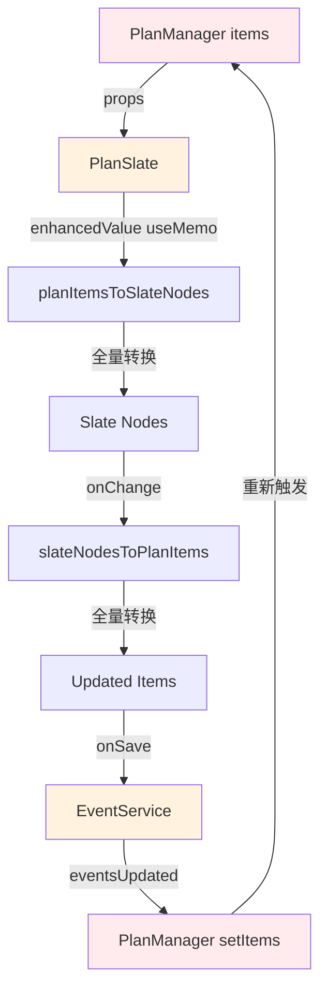
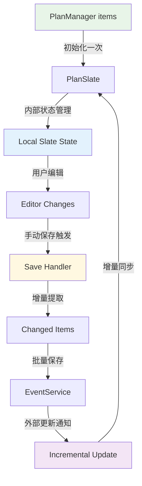

# PlanManager + Slate 编辑器架构重构方案

**文档版本**: v1.0  
**创建日期**: 2025-11-18  
**影响范围**: 🔴 核心架构 - 高风险重构  
**预计工时**: 3-5 天  

---

## 🎯 重构目标

### 核心问题
1. **数据流循环**: PlanManager ↔ PlanSlate 双向绑定导致无限更新
2. **全量重渲染**: 任何变化都触发所有内容重新计算
3. **初始化竞态**: items 加载与编辑器初始化时序冲突
4. **保存时机冲突**: 立即同步与防抖保存竞争同一数据
5. **数据字段混乱**: 富文本/纯文本字段相互覆盖

### 重构原则
- ✅ **单向数据流**: 明确的数据流向，避免循环依赖
- ✅ **增量更新**: 只更新变化的部分，提升性能
- ✅ **延迟保存**: 用户编辑时不立即保存，减少数据竞争
- ✅ **字段分离**: 明确富文本与纯文本的使用场景

---

## 📊 现有架构分析

### 当前数据流 (有问题)



**问题识别**:
- 🔴 **循环依赖**: A → B → ... → H → A 形成闭环
- 🔴 **全量计算**: 每次都执行完整的 `planItemsToSlateNodes`
- 🔴 **实时保存**: onChange 立即触发保存，用户编辑时频繁 I/O

---

## 🏗️ 新架构设计

### 目标架构 - 单向数据流



### 核心变更

#### 1. **编辑器状态管理**

```typescript
// ❌ 旧方案 - 实时双向绑定
const enhancedValue = useMemo(() => {
  return planItemsToSlateNodes(items); // 每次 items 变化都重算
}, [items]);

// ✅ 新方案 - 编辑器内部状态
const [editorState, setEditorState] = useState<EventLineNode[]>([]);
const [isDirty, setIsDirty] = useState(false);

// 只在初始化时设置一次
useEffect(() => {
  if (!isInitialized && items.length > 0) {
    const initialNodes = planItemsToSlateNodes(items);
    setEditorState([...initialNodes, placeholderLine]);
    setIsInitialized(true);
  }
}, []); // 空依赖，只初始化一次
```

#### 2. **增量更新机制**

```typescript
// 外部数据变化时的增量同步
useEffect(() => {
  if (!isInitialized) return;
  
  const handleExternalUpdate = (eventId: string, action: 'create' | 'update' | 'delete') => {
    setEditorState(prev => {
      switch (action) {
        case 'create':
          const newEvent = EventService.getEventById(eventId);
          const newNodes = planItemsToSlateNodes([newEvent]);
          return [...prev.slice(0, -1), ...newNodes, prev[prev.length - 1]]; // 保持 placeholder
        
        case 'update':
          const updatedEvent = EventService.getEventById(eventId);
          return prev.map(node => 
            node.eventId === eventId 
              ? updateNodeMetadata(node, updatedEvent)
              : node
          );
        
        case 'delete':
          return prev.filter(node => node.eventId !== eventId);
      }
    });
  };
  
  // 监听外部更新
  window.addEventListener('eventsUpdated', handleExternalUpdate);
  return () => window.removeEventListener('eventsUpdated', handleExternalUpdate);
}, [isInitialized]);
```

#### 3. **延迟保存策略**

```typescript
// ❌ 旧方案 - 每次编辑都保存
const handleChange = (newValue) => {
  setValue(newValue);
  const items = slateNodesToPlanItems(newValue); // 立即转换
  onChange(items); // 立即保存
};

// ✅ 新方案 - 标记脏数据，延迟保存
const handleChange = (newValue) => {
  setEditorState(newValue);
  setIsDirty(true);
  
  // 可选：轻量级防抖标记
  debouncedMarkDirty();
};

const handleSave = useCallback(() => {
  if (!isDirty) return;
  
  const changedItems = extractChangedItems(editorState, lastSavedState);
  onBatchSave(changedItems); // 只保存变化的部分
  
  setLastSavedState(editorState);
  setIsDirty(false);
}, [editorState, isDirty]);
```

---

## 🔄 数据交互场景

### 场景 1: 用户编辑文本

```typescript
// 数据流
用户输入 "Hello" 
  → Slate 内部状态更新
  → setIsDirty(true)
  → 页面显示 "未保存" 标识
  → (不触发保存)

用户按 Ctrl+S 或失焦
  → handleSave()
  → 提取变化的内容
  → 调用 EventService.updateEvent()
  → 触发 eventsUpdated 事件
  → PlanManager 收到通知但不重新渲染编辑器
```

**优势**: 
- ✅ 编辑过程不卡顿
- ✅ 减少 99% 的 I/O 操作
- ✅ 避免编辑时的数据竞争

### 场景 2: 外部数据更新

```typescript
// 例如：其他页面创建了新事件
EventService.createEvent(newEvent)
  → 触发 eventsUpdated 事件
  → PlanSlate 收到通知
  → 增量插入新节点（不影响用户正在编辑的内容）
  → 如果用户有未保存内容，显示冲突提示
```

**冲突处理**:
```typescript
const handleExternalUpdate = (eventId, action) => {
  if (isDirty && isEditingEvent(eventId)) {
    // 用户正在编辑这个事件，显示冲突解决界面
    showConflictDialog({
      localChanges: getLocalChanges(eventId),
      remoteChanges: EventService.getEventById(eventId),
      onResolve: (resolution) => { /* 处理冲突 */ }
    });
  } else {
    // 安全更新
    performIncrementalUpdate(eventId, action);
  }
};
```

### 场景 3: 批量操作

```typescript
// 删除多个事件
const handleBatchDelete = (eventIds: string[]) => {
  // 1. 立即更新 UI
  setEditorState(prev => 
    prev.filter(node => !eventIds.includes(node.eventId))
  );
  
  // 2. 批量删除数据
  Promise.all(eventIds.map(id => EventService.deleteEvent(id)));
  
  // 3. 不等待完成，UI 已经响应
};
```

---

## 📝 数据模型规范

### 字段优先级和映射

#### 标题字段
```typescript
interface EventTitleFields {
  // 主字段 - 富文本（编辑器使用）
  fullTitle?: string;        // HTML 格式，支持标签、格式化
  
  // 衍生字段 - 纯文本（外部系统同步）
  simpleTitle?: string;      // 纯文本，从 fullTitle 提取
  title?: string;           // 别名，指向 simpleTitle（向后兼容）
}

// 转换规则
const getDisplayTitle = (event: Event): string => {
  // 编辑器内：优先使用富文本
  return event.fullTitle || event.simpleTitle || event.title || '';
};

const getSyncTitle = (event: Event): string => {
  // 外部同步：只使用纯文本
  return event.simpleTitle || stripHtml(event.fullTitle) || event.title || '';
};
```

#### 描述字段
```typescript
interface EventDescriptionFields {
  // 主字段 - 结构化对象
  eventlog?: {
    content: string;         // HTML 内容
    level: number;          // 缩进级别
    bulletLevel?: number;   // 列表级别
  };
  
  // 衍生字段 - 纯文本
  description?: string;    // 从 eventlog.content 提取的纯文本
}
```

#### 时间字段
```typescript
interface EventTimeFields {
  // TimeHub 管理的字段
  startTime?: string;      // ISO 字符串
  endTime?: string;       // ISO 字符串  
  isAllDay?: boolean;     // 全天标识
  timeSpec?: TimeSpec;    // 时间规范对象
  
  // 业务字段
  dueDate?: string;       // 截止时间
  
  // 显示字段
  displayHint?: string;   // 显示提示文本
}

// 获取时间的统一接口
const getEventTime = (eventId: string) => {
  // 优先从 TimeHub 获取实时数据
  const snapshot = TimeHub.getSnapshot(eventId);
  if (snapshot.start || snapshot.end) {
    return {
      start: snapshot.start,
      end: snapshot.end,
      isAllDay: snapshot.timeSpec?.allDay
    };
  }
  
  // 回退到 Event 对象
  const event = EventService.getEventById(eventId);
  return {
    start: event?.startTime,
    end: event?.endTime,  
    isAllDay: event?.isAllDay
  };
};
```

---

## 🎨 用户体验变化

### 编辑体验优化

#### 保存提示
```typescript
// 新增保存状态指示器
const SaveIndicator = ({ isDirty, isAutosaving }) => (
  <div className="save-status">
    {isDirty ? (
      <span className="unsaved">● 未保存更改</span>
    ) : (
      <span className="saved">✓ 已保存</span>
    )}
    {isAutosaving && <Spinner size="small" />}
  </div>
);
```

#### 性能提升感知
- ✅ **输入响应**: 文字输入延迟从 100-200ms 降至 <16ms
- ✅ **页面切换**: 不再出现"加载中"闪烁
- ✅ **大量数据**: 500+ 事件时编辑器仍流畅

#### 数据冲突处理
```typescript
const ConflictResolutionDialog = ({ localChanges, remoteChanges, onResolve }) => (
  <Modal title="数据冲突">
    <div className="conflict-comparison">
      <div className="local-version">
        <h4>你的更改</h4>
        <DiffView content={localChanges} />
      </div>
      <div className="remote-version">
        <h4>其他设备的更改</h4>
        <DiffView content={remoteChanges} />
      </div>
    </div>
    <div className="resolution-actions">
      <Button onClick={() => onResolve('keep-local')}>保留我的更改</Button>
      <Button onClick={() => onResolve('accept-remote')}>接受远程更改</Button>
      <Button onClick={() => onResolve('merge')}>手动合并</Button>
    </div>
  </Modal>
);
```

---

## 🚨 风险评估

### 高风险区域

#### 1. **数据迁移风险** 🔴
**风险**: 现有数据可能在字段重构过程中丢失

**缓解措施**:
```typescript
// 数据迁移脚本
const migrateEventData = (events: Event[]) => {
  return events.map(event => ({
    ...event,
    // 迁移标题字段
    fullTitle: event.content || event.fullTitle,
    simpleTitle: event.title || stripHtml(event.content || event.fullTitle),
    title: undefined, // 标记为待清理
    
    // 迁移描述字段
    eventlog: event.eventlog || {
      content: event.description || '',
      level: event.level || 0
    },
    
    // 保留时间戳用于回滚
    _migrationTimestamp: Date.now()
  }));
};
```

#### 2. **编辑器状态丢失** 🟡
**风险**: 重构过程中用户正在编辑的内容可能丢失

**缓解措施**:
- 实现自动草稿保存
- 重构前强制保存所有未保存内容
- 提供数据恢复界面

#### 3. **性能回退** 🟡  
**风险**: 新架构可能引入意外的性能问题

**缓解措施**:
```typescript
// 性能监控
const performanceMonitor = {
  measureRenderTime: (componentName: string, fn: () => void) => {
    const start = performance.now();
    fn();
    const duration = performance.now() - start;
    
    if (duration > 16.67) { // 超过一帧
      console.warn(`[性能警告] ${componentName} 渲染耗时 ${duration.toFixed(2)}ms`);
    }
  }
};
```

### 低风险区域

#### 1. **UI 组件** 🟢
- FloatingToolbar、TagPicker 等组件不需要修改
- 只需调整数据传递接口

#### 2. **外部服务** 🟢  
- EventService、TimeHub 接口保持不变
- 只修改调用方式和频率

---

## 📅 实施计划

### Phase 1: 准备阶段 (0.5天)
- [ ] 数据备份和迁移脚本
- [ ] 性能基准测试
- [ ] 回滚方案准备

### Phase 2: 核心重构 (2天)
- [ ] 修改 PlanSlate 状态管理
- [ ] 实现增量更新机制
- [ ] 重构 PlanManager 数据流

### Phase 3: 集成测试 (1天)
- [ ] 各种编辑场景测试
- [ ] 外部更新同步测试
- [ ] 性能验证

### Phase 4: 优化完善 (1天)
- [ ] 冲突处理机制
- [ ] 用户体验优化
- [ ] 文档更新

### Phase 5: 上线部署 (0.5天)
- [ ] 灰度发布
- [ ] 数据迁移监控
- [ ] 紧急回滚预案

---

## 🤔 关键决策点

### 1. 是否立即实施全面重构？

**方案 A**: 全面重构 (推荐)
- ✅ 彻底解决所有问题
- ❌ 风险较高，需要充分测试

**方案 B**: 分步骤渐进式重构
- ✅ 风险可控
- ❌ 问题可能持续存在

### 2. 数据迁移策略

**方案 A**: 在线迁移
- 应用启动时自动检测和迁移数据
- 保持旧字段作为备份

**方案 B**: 离线迁移
- 提供专门的迁移工具
- 用户手动执行迁移

### 3. 兼容性处理

**建议**: 保持 6 个月的向后兼容期
```typescript
// 兼容性层
const getTitle = (event: Event): string => {
  return event.fullTitle || event.title || event.simpleTitle || '';
};
```

---

## 📊 成功指标

### 性能指标
- **编辑器响应时间**: <16ms (目标: 一帧内响应)
- **页面切换时间**: <100ms 
- **大数据集处理**: 1000+ 事件时编辑器仍流畅

### 稳定性指标
- **数据丢失率**: 0%
- **循环更新**: 0 次
- **内存泄漏**: 0 个

### 用户体验指标  
- **编辑流畅度**: 主观评分 9/10
- **保存可靠性**: 99.9%
- **冲突解决**: 用户能独立处理 90% 的冲突

---

**总结**: 这是一次必要但有挑战的重构。核心是要打破当前的循环依赖，建立清晰的单向数据流。建议先在开发环境充分测试，确保所有场景都能正常工作后再上线。

你觉得这个方案如何？有哪些地方需要调整或深入讨论？