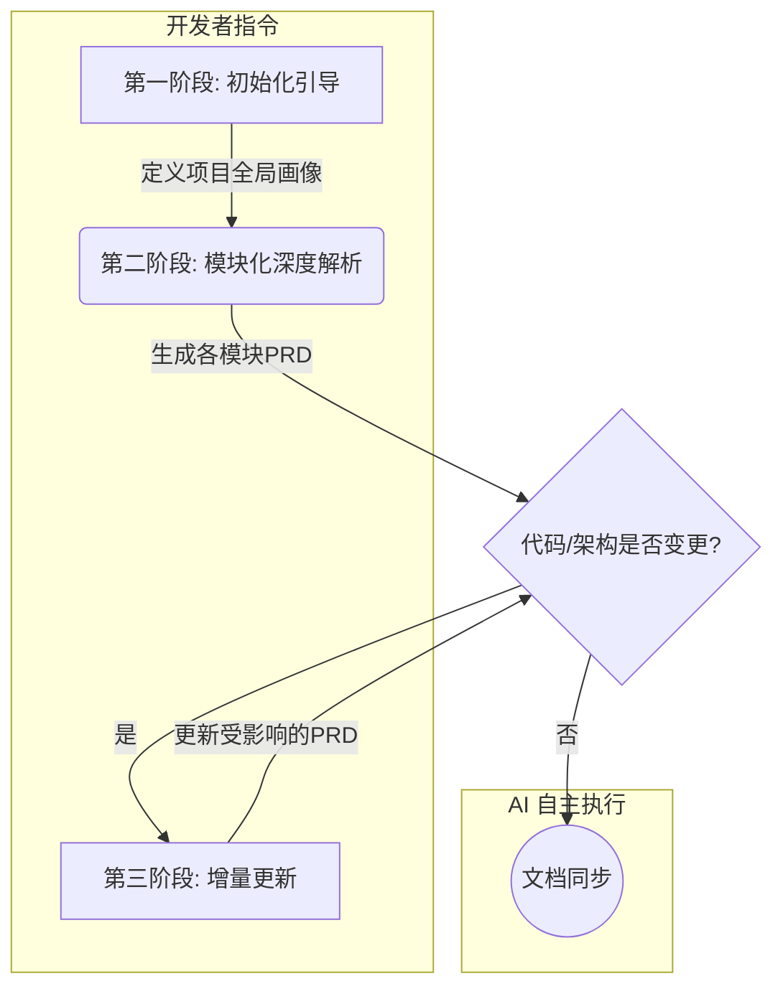

# **Copilot 驱动的 PRD 逆向工程与维护框架 v1.0**

> **目标**: 建立一个标准化流程，使 AI 助手（Copilot）能够自主地、模块化地阅读项目代码，逆向生成并持续维护高质量的产品需求文档（PRD）。
> **核心原则**: 指令清晰、范围限定、分层解析、结果结构化。
> **适用对象**: 开发者（Owner）、AI 助手（Executor）

---

## **目录**

1.  [**核心理念与工作流**](#1-核心理念与工作流)
2.  [**第一阶段：初始化引导 (Initial Bootstrap)**](#2-第一阶段初始化引导-initial-bootstrap)
3.  [**第二阶段：模块化深度解析 (Modular Deep Dive)**](#3-第二阶段模块化深度解析-modular-deep-dive)
4.  [**第三阶段：增量更新与维护 (Incremental Update & Maintenance)**](#4-第三阶段增量更新与维护-incremental-update--maintenance)
5.  [**附录：关键概念定义**](#5-附录关键概念定义)

---

## **1. 核心理念与工作流**

### **1.1 AI 的角色定位**

Copilot 在此框架中扮演**“产品分析师 + 技术文档工程师”**的角色。其核心任务是：
- **观察 (Observe)**: 阅读和解析指定范围的代码。
- **理解 (Understand)**: 识别代码背后的用户场景、业务逻辑和技术实现。
- **抽象 (Abstract)**: 将代码逻辑提炼为人类可读的业务规则和用户流程。
- **记录 (Document)**: 按照标准模板，生成结构化的 PRD 文档。

### **1.2 工作流概览**

整个过程分为三个主要阶段，形成一个可循环的系统：



---

## **2. 第一阶段：初始化引导 (Initial Bootstrap)**

**目标**: 让 Copilot 对整个项目建立一个宏观的、鸟瞰式的理解。这是所有后续工作的基础。

**开发者指令**:

> “Copilot，现在启动 **[项目名]** 的 **PRD 逆向工程初始化**。请遵循框架 `copilot-prd-framework` v1.0 的第一阶段指南。
>
> 1.  **代码入口**: `[提供你的项目根目录的 GitHub 仓库 URL 或本地文件系统路径]`
> 2.  **核心目标**: [用一句话描述你的 App，例如："一个集成了活动追踪的个人时空叙事富文本编辑器。"]
> 3.  **技术栈**: [例如："React (Vite), TypeScript, Slate.js, Electron, TailwindCSS, Playwright"]
>
> 请扫描整个项目结构，并生成一份 **《项目全局画像报告》**，内容需严格遵循以下模板。”

### **产出模板：《项目全局画像报告》**

```markdown
# 项目全局画像报告 - [项目名]

> **AI 生成时间**: [YYYY-MM-DD HH:MM]
> **代码版本**: [Git Commit Hash]

## 1. 项目核心目标 (由开发者提供)
[AI 复制开发者提供的核心目标]

## 2. 推断的用户画像
- **主要用户**: [例如：知识工作者、作家、研究人员]
- **核心诉求**: [例如：记录想法、复盘工作、管理个人知识]

## 3. 技术栈摘要 (由开发者提供)
- **前端**: [React, Slate.js, ...]
- **桌面端**: [Electron, ...]
- **测试**: [Playwright, Jest, ...]
- **样式**: [TailwindCSS, ...]

## 4. 目录结构分析与核心职责推断
- `src/components/`: **UI 组件库**。通用及特定功能的 React 组件。
- `src/editor/`: **编辑器核心**。封装 Slate.js，包含插件、平台适配。
- `src/services/`: **业务服务层**。处理后台逻辑，如活动追踪、文件上传。
- `src/data/`: **数据模型层**。定义核心数据结构、验证和序列化。
- `src/hooks/`: **自定义 Hooks**。封装可复用的 React 逻辑。
- `src/pages/` or `src/views/`: **页面/视图层**。应用的顶层路由页面。
- `electron/`: **桌面端主进程**。处理原生系统交互。
- ... [AI 根据实际目录结构补充]

## 5. 关键依赖库与作用分析
- **`slate` / `slate-react`**: 富文本编辑器的核心框架。
- **`@tanstack/react-virtual`**: 用于长文档的虚拟滚动性能优化。
- **`zod`**: 用于数据模型的运行时验证，确保数据一致性。
- **`electron`**: 用于构建跨平台桌面应用。
- **`playwright`**: 用于端到端（E2E）测试，模拟用户操作。
- ... [AI 根据 `package.json` 补充]

## 6. 模块化拆分建议
根据代码结构和职责推断，建议将项目拆分为以下 **主功能模块** 进行深度解析 (请开发者确认/调整):
- **[M-01] 富文本编辑核心**
- **[M-02] ContextMarker 时间轴**
- **[M-03] 活动追踪服务**
- **[M-04] 数据同步与存储**
- **[M-05] 移动端适配**
- **[M-06] 协同编辑** (如果存在)
- ... [AI 建议，等待开发者确认]
```

---

## **3. 第二阶段：模块化深度解析 (Modular Deep Dive)**

**目标**: 逐个击破，对每个核心模块进行“像素级”的分析，生成独立的、详细的 PRD。

**开发者指令 (示例)**:

> “Copilot，现在启动 **[M-02] ContextMarker 时间轴** 模块的 **深度解析**。请遵循框架 `copilot-prd-framework` v1.0 的第二阶段指南。
>
> 1.  **主要代码入口**:
>     - `src/editor/plugins/withContextMarkers.ts`
>     - `src/components/Timeline/`
>     - `src/services/ActivityService.ts`
>     - `src/types/document.ts` (参考 `ContextMarkerElement` 和 `ActivitySpan` 类型)
> 2.  **关联模块**: [M-03] 活动追踪服务 (数据来源)
>
> 请分析以上代码，并生成一份 **《[M-02] ContextMarker 时间轴 - 产品需求文档》**，严格遵循 PRD 模板。”

### **产出模板：《模块产品需求文档 (PRD)》**

```markdown
# [模块编号] [模块名称] - 产品需求文档

> **AI 生成时间**: [YYYY-MM-DD HH:MM]
> **关联代码版本**: [Git Commit Hash]
> **关联代码文件**:
> - `src/editor/plugins/withContextMarkers.ts`
> - `src/components/Timeline/TimelineAxis.tsx`
> - ...

## 1. 模块概述 (Elevator Pitch)
[AI 生成一句话概述，例如：该模块负责在用户编辑间歇时，自动抓取并展示一段时间内的电脑活动，形成情境时间轴，嵌入文档中。]

## 2. 用户故事 (User Stories)
- **作为用户**，我希望在我长时间未输入后，编辑器能自动记录我刚才在做什么，帮助我回忆上下文。
- **作为用户**，我希望看到一个可视化的时间轴，清晰地展示各个 App 的使用时长和标题。
- **作为用户**，我希望可以与时间轴交互，例如展开查看详情或折叠以节省空间。

## 3. 功能流程图 (Flowchart)
[AI 使用 Mermaid 语法生成流程图]
graph TD
    subgraph "用户操作"
        A[用户在编辑器中持续输入] --> B{停止输入超过 5 分钟?}
    end
    
    subgraph "系统后台逻辑 (withContextMarkers.ts)"
        B -- 是 --> C[触发 insertContextMarker 函数]
        C --> D{调用 ActivityService}
        D --> E[获取 startTime 到 endTime 间的活动数据]
        E --> F{过滤掉时长 < 10 秒的活动}
        F --> G{数据是否为空?}
        G -- 否 --> H[创建 ContextMarkerElement 节点]
        H --> I[在当前光标上方插入节点]
    end
    
    subgraph "UI 渲染 (ContextMarker.tsx, TimelineAxis.tsx)"
        I --> J[UI 层监听到数据变化]
        J --> K[渲染时间轴 UI]
        K --> L[根据活动数据渲染每个 ActivitySpan]
    end

## 4. 业务规则与逻辑约束 (Business Logic & Constraints)

### 4.1 触发条件
- **规则**: 当用户停止输入操作的时间超过 `INACTIVITY_THRESHOLD` (当前值为 **5 分钟**) 时触发。
- **代码定位**: `withContextMarkers.ts` L:15 `const INACTIVITY_THRESHOLD = 5 * 60 * 1000;`

### 4.2 数据获取与处理
- **规则**: 调用 `ActivityService` 获取从 `lastModifiedTimestamp` 到当前时间的所有活动。
- **约束**: 过滤掉持续时间小于 `MIN_ACTIVITY_DURATION` (当前值为 **10 秒**) 的活动，以减少噪音。
- **代码定位**: `withContextMarkers.ts` L:16 `const MIN_ACTIVITY_DURATION = 10;`

### 4.3 UI 渲染规则
- **规则**: 每个 `ActivitySpan` 根据其 `appColor` 属性渲染背景色。
- **规则**: 活动时长决定了 `ActivitySpan` 在时间轴上的相对高度。
- **规则**: 如果 `isCompressed` 为 `true`，则渲染为简化模式。
- **代码定位**: `ActivitySpan.tsx` L:25 `style={{ backgroundColor: activity.appColor, height: ... }}`

## 5. 数据模型 (Data Schema)
[AI 从 `types/document.ts` 中提取并格式化]
- **`ContextMarkerElement`**:
  - `type`: 'context-marker' (Literal)
  - `id`: string (UUID)
  - `timestamp`: ISODateTimeString
  - `activities`: `ActivitySpan[]`
  - ...
- **`ActivitySpan`**:
  - `appId`: string
  - `appName`: string
  - `duration`: number (秒)
  - ...

## 6. 边缘情况与异常处理 (Edge Cases & Error Handling)
- **场景**: `ActivityService` 获取活动失败。
- **处理**: 流程静默失败，在控制台打印错误，不中断用户编辑。
- **代码定位**: `withContextMarkers.ts` L:70 `catch (error) { console.error(...) }`
- **场景**: 获取到的有效活动为空。
- **处理**: 不插入任何 `ContextMarker` 节点。
- **代码定位**: `withContextMarkers.ts` L:45 `if (validActivities.length === 0) { return; }`

## 7. 未解决的问题或待办事项 (Open Questions / TODOs)
[AI 扫描代码中的 `// TODO:`, `// FIXME:`, `// @ts-ignore` 等注释]
- **TODO**: `ActivityService.ts` L:120 - "移动端活动提供者尚未实现"。
- **FIXME**: `TimelineAxis.tsx` L:98 - "当活动数量过多时，UI 会重叠"。
```

---

## **4. 第三阶段：增量更新与维护 (Incremental Update & Maintenance)**

**目标**: 当代码发生变化时，能够快速、准确地更新受影响的 PRD，而不是重新生成所有文档。

**开发者指令 (示例)**:

> “Copilot，现在启动 **PRD 增量更新**。请遵循框架 `copilot-prd-framework` v1.0 的第三阶段指南。
>
> 1.  **变更范围**: 我刚刚在 `withContextMarkers.ts` 中将 `INACTIVITY_THRESHOLD` 从 5 分钟修改为了 10 分钟。
> 2.  **Git Diff**: `[可以提供 git diff 的文本内容]`
>
> 请分析此变更，并更新所有受影响的 PRD 文档。请只输出变更的部分。”

### **产出模板：《PRD 变更日志》**

```markdown
# PRD 变更日志

> **AI 生成时间**: [YYYY-MM-DD HH:MM]
> **代码变更版本**: [Git Commit Hash of the change]

## 1. 受影响的模块
- **[M-02] ContextMarker 时间轴**

## 2. 变更详情

### 文件: `[M-02] ContextMarker 时间轴 - 产品需求文档`

#### **章节 4.1 触发条件**:
- **变更前**:
  - **规则**: 当用户停止输入操作的时间超过 `INACTIVITY_THRESHOLD` (当前值为 **5 分钟**) 时触发。
- **变更后**:
  - **规则**: 当用户停止输入操作的时间超过 `INACTIVITY_THRESHOLD` (当前值为 **10 分钟**) 时触发。
- **变更依据**: `withContextMarkers.ts` L:15 `const INACTIVITY_THRESHOLD = 10 * 60 * 1000;`

---
**[AI 分析]:** 本次变更仅影响业务规则参数，不涉及流程或数据模型，其他 PRD 文档无需更新。
```

---

## **5. 附录：关键概念定义**

- **模块 (Module)**: 一个相对独立的、高内聚的功能集合。例如“富文本编辑核心”或“数据同步”。
- **入口 (Entry Point)**: 理解一个模块最核心的起始代码文件。
- **全局画像 (Global Profile)**: 对整个项目的顶层认知，是模块化分析的基础。
- **逆向工程 (Reverse Engineering)**: 从最终产物（代码）推导出设计意图（需求）的过程。
- **增量更新 (Incremental Update)**: 只更新发生变化的部分，而非全量替换，以保证效率和历史可追溯性。

---
