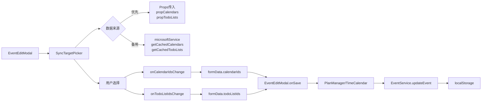

# 4DNote EventEditModal 模块产品需求文档 (PRD)

> **AI 生成时间**: 2025-11-05  
> **最后更新**: 2025-11-13 (v1.8 - SyncTargetPicker 升级)  
> **关联代码版本**: master  
> **文档类型**: 功能模块 PRD  
> **依赖模块**: EventHub, TimeHub, TagManager, SyncTargetPicker  
> **关联文档**: [Timer 模块 PRD](./TIMER_MODULE_PRD.md), [TimeCalendar 模块 PRD](./TIMECALENDAR_MODULE_PRD.md)

---

## ⚠️ 时间字段规范

**严禁使用 ISO 8601 标准时间格式（带 Z 或时区偏移）！**

所有时间字段必须使用 `timeUtils.ts` 中的工具函数处理：
- ✅ **存储时间**: 使用 `formatTimeForStorage(date)` - 返回本地时间字符串（如 `2025-11-06T14:30:00`）
- ✅ **解析时间**: 使用 `parseLocalTimeString(timeString)` - 将字符串解析为 Date 对象
- ❌ **禁止**: 直接使用 `new Date().toISOString()` 或 `date.toISOString()`
- ❌ **禁止**: 时间字符串包含 `Z` 后缀或 `+08:00` 等时区标记

**原因**: ISO 格式会导致时区转换问题，18:06 的事件可能在同步后显示为 10:06（UTC 时间）。

**参考文件**: `src/utils/timeUtils.ts`

---

## Event 数据结构

### 核心字段定义

Event 对象的完整类型定义位于 `src/types.ts`，包含以下核心字段：

```typescript
interface Event {
  // 基础标识
  id: string;
  title: string;
  description?: string;
  
  // 时间相关（必须使用 timeUtils 工具）
  start: string;      // 本地时间字符串，如 "2025-11-06T14:30:00"
  end: string;        // 本地时间字符串，如 "2025-11-06T16:00:00"
  
  // 日历与标签
  calendarId: string;
  tag?: string;
  
  // 组织者与参会人
  organizer?: {
    name?: string;
    email?: string;
  };
  attendees?: Array<{
    name?: string;
    email?: string;
    type?: string;      // "required" | "optional" | "resource"
    status?: string;    // "accepted" | "declined" | "tentative" | "none"
  }>;
  
  // 同步相关
  microsoftEventId?: string;
  isOutlookEvent?: boolean;
  
  // 其他元数据
  isAllDay?: boolean;
  location?: string;
  category?: string;
  body?: string;
  recurrenceRule?: string;
  raw?: any;
}
```

### 组织者与参会人字段说明

#### 基础字段定义

**organizer（组织者）**
```typescript
{
  name?: string;           // 组织者姓名
  email?: string;          // 组织者邮箱
  avatarUrl?: string;      // 头像 URL（可选）
  isReMarkable?: boolean;  // 是否为 4DNote 本地联系人
  isOutlook?: boolean;     // 是否从 Outlook 同步
  isGoogle?: boolean;      // 是否从 Google 同步（预留）
  isiCloud?: boolean;      // 是否从 iCloud 同步（预留）
}
```

**attendees（参会人列表）**
```typescript
Array<{
  name?: string;           // 参会人姓名
  email?: string;          // 参会人邮箱
  avatarUrl?: string;      // 头像 URL（可选）
  type?: string;           // "required" | "optional" | "resource"
  status?: string;         // "accepted" | "declined" | "tentative" | "none"
  isReMarkable?: boolean;  // 是否为 4DNote 本地联系人
  isOutlook?: boolean;     // 是否从 Outlook 同步
  isGoogle?: boolean;      // 是否从 Google 同步（预留）
  isiCloud?: boolean;      // 是否从 iCloud 同步（预留）
}>
```

#### 平台标识系统

**设计理念**: 统一的联系人管理，支持多平台融合

- **isReMarkable**: 标识为 4DNote 本地联系人，仅需姓名，邮箱可选
- **isOutlook**: 标识从 Outlook 同步的联系人，必须有有效邮箱
- **isGoogle/isiCloud**: 预留字段，用于未来扩展

**优先级规则**:
1. Outlook 同步时，有邮箱的使用 `isOutlook=true`
2. 4DNote 本地添加的使用 `isReMarkable=true`
3. 同一联系人可以同时有多个标识

#### UI 功能特性

**1. 组织者输入**
- 位置：EventEditModal 表单中部
- 字段：姓名输入框、邮箱输入框
- 头像：自动根据邮箱加载 Gravatar 或使用默认头像
- 验证：邮箱格式验证（可选填）

**2. 参会人管理**
- **添加方式**:
  - 手动输入：姓名 + 邮箱 + 参会类型
  - 批量导入：通过联系人选择器（ContactPicker）从已保存联系人中选择
- **显示信息**:
  - 头像（圆形）
  - 姓名（主标题）
  - 邮箱（副标题，灰色小字）
  - 参会类型（必需/可选/资源）
  - 响应状态徽章（已接受/已拒绝/待定）
- **交互操作**:
  - 修改参会类型（下拉选择）
  - 删除参会人（X 按钮）
  - 查看冲突警告（黄色感叹号图标）

**3. 响应状态显示**
- ✅ **已接受** (accepted): 绿色徽章
- ❌ **已拒绝** (declined): 红色徽章
- ❓ **暂定** (tentative): 黄色徽章
- ⚪ **未响应** (none): 灰色徽章

**4. 会议冲突检测**
- 实时检测参会人时间冲突
- 黄色警告框显示冲突详情
- 列出冲突的参会人和冲突事件
- 建议调整时间或移除冲突参会人

**5. 联系人选择器（ContactPicker）**
- 搜索功能：按姓名或邮箱搜索
- 批量选择：支持多选参会人
- 快速添加：点击联系人卡片即可添加
- 联系人来源：
  - 4DNote 本地联系人
  - Outlook 同步的联系人
  - 最近使用的联系人

#### 同步行为

**1. 创建/更新事件 (Local → Outlook)**

- **符合 Outlook 格式的联系人**:
  - 必须有有效邮箱地址
  - 直接同步到 Outlook 的 `organizer` 和 `attendees` 字段
  - 设置 `isOutlook=true`

- **不符合 Outlook 格式的联系人**:
  - 4DNote 本地联系人（仅有姓名）
  - 邮箱格式无效的联系人
  - **处理方式**: 整合到 `description` 字段开头
    ```
    【组织者】张三
    【参会人】李四/王五/赵六
    ─────────────────
    [原有的描述内容]
    ```
  - 使用特殊标记 `<!--REMARKABLE_CONTACTS-->` 便于识别和提取

**2. 从 Outlook 同步回来 (Outlook → Local)**

- **提取 Outlook 联系人**:
  - 读取 `organizer.emailAddress` 和 `attendees[]`
  - 设置 `isOutlook=true`
  - 自动填充姓名、邮箱、响应状态

- **提取 ReMarkable 联系人**:
  - 检测 description 中的特殊标记
  - 解析 `【组织者】` 和 `【参会人】` 行
  - 恢复为 `isReMarkable=true` 的联系人对象
  - 清理 description，移除联系人标记

**3. 更新同步策略**

每次同步时检查是否需要更新 description：
- 比较本地联系人和 Outlook 联系人
- 如果 ReMarkable 联系人有变化，更新 description
- 如果 description 中的联系人标记已过期，清理

#### 头像系统

**头像加载优先级**:
1. 用户上传的头像（`avatarUrl` 字段）
2. Gravatar（根据邮箱 MD5 生成）
3. 默认头像（首字母圆形背景）

**Avatar 组件**:
```typescript
<Avatar 
  name="张三"
  email="zhangsan@example.com"
  avatarUrl={contact.avatarUrl}
  size={32}
/>
```

**性能优化**:
- 头像懒加载
- Gravatar 请求缓存
- 默认头像使用 CSS 渐变

#### 联系人服务（ContactService）

**功能**:
- `getAllContacts()`: 获取所有联系人（本地 + 同步）
- `searchContacts(query)`: 搜索联系人
- `saveContact(contact)`: 保存联系人到本地
- `getRecentContacts()`: 获取最近使用的联系人
- `mergeContacts()`: 合并重复联系人

**存储位置**: `localStorage['remarkable-contacts']`

#### 冲突检测服务（ConflictDetectionService）

**功能**:
- `checkConflicts(eventTime, attendees)`: 检测参会人时间冲突
- `getConflictingEvents(attendee, timeRange)`: 获取某人的冲突事件
- `suggestAlternativeTime()`: 建议无冲突的时间段（未来功能）

**检测逻辑**:
1. 遍历所有参会人
2. 查询每个人在该时间段的其他事件
3. 标记有冲突的参会人
4. 返回冲突详情数组

**UI 显示**:
```
⚠️ 时间冲突警告
以下参会人在此时间段有其他安排：
• 李四 - 与"产品评审会"冲突 (14:00-15:00)
• 王五 - 与"客户拜访"冲突 (14:30-16:00)
```

---

**关键点**：
- ✅ 记录初始尺寸（`resizeStart.width/height`）
- ✅ 计算增量（`deltaX/deltaY`）并应用最小值限制
- ✅ 调整手柄位于模态框右下角（CSS 实现，见 L858-870）

### 6.4 事件监听管理

```typescript
// 位置：L134-151
useEffect(() => {
  if (isDragging) {
    document.addEventListener('mousemove', handleDragMove);
    document.addEventListener('mouseup', handleDragEnd);
  }
  if (isResizing) {
    document.addEventListener('mousemove', handleResizeMove);
    document.addEventListener('mouseup', handleResizeEnd);
  }
  return () => {
    // 清理监听器，避免内存泄漏
    document.removeEventListener('mousemove', handleDragMove);
    document.removeEventListener('mouseup', handleDragEnd);
    document.removeEventListener('mousemove', handleResizeMove);
    document.removeEventListener('mouseup', handleResizeEnd);
  };
}, [isDragging, isResizing, handleDragMove, handleDragEnd, handleResizeMove, handleResizeEnd]);

**最佳实践**：
- ✅ 使用 `useCallback` 避免重复创建监听器
- ✅ 在 `useEffect` 清理函数中移除监听器
- ✅ 依赖数组包含所有回调函数

### 6.5 样式适配

```typescript
// 位置：L555-564
const modalStyle: React.CSSProperties = draggable || resizable ? {
  position: 'fixed',
  left: modalPosition.x || '50%',
  top: modalPosition.y || '50%',
  transform: modalPosition.x ? 'none' : 'translate(-50%, -50%)', // 初始居中
  width: modalSize.width,
  maxWidth: 'none',
  height: resizable && modalSize.height ? modalSize.height : 'auto',
  maxHeight: resizable ? 'none' : '90vh',
} : {};
```

**设计要点**：
- ✅ 初始位置居中（`left: 50%, top: 50%, transform: translate(-50%, -50%)`）
- ✅ 拖拽后取消 `transform`，使用绝对定位（`left/top` 为像素值）
- ✅ 调整大小后固定高度，否则使用 `auto`

---

## 7. 标签处理

### 7.1 层级扁平化

**目的**：将层级标签树转换为扁平数组，便于搜索和渲染

```typescript
// 位置：L153-184
const flatTags = useMemo(() => {
  // 检测是否已经是扁平结构
  const isAlreadyFlat = hierarchicalTags.length > 0 && 
                       hierarchicalTags[0].level !== undefined && 
                       !hierarchicalTags[0].children;
  
  if (isAlreadyFlat) {
    return hierarchicalTags;
  }
  
  const flatten = (tags: any[], level: number = 0, parentPath: string = ''): any[] => {
    let result: any[] = [];
    tags.forEach(tag => {
      const path = parentPath ? `${parentPath} > ${tag.name}` : tag.name;
      const flattenedTag = {
        ...tag,
        level,                                    // 层级深度（用于缩进）
        path,                                     // 完整路径（用于搜索）
        displayName: '  '.repeat(level) + tag.name // 带缩进的显示名称
      };
      result.push(flattenedTag);
      
      if (tag.children && tag.children.length > 0) {
        result = result.concat(flatten(tag.children, level + 1, path));
      }
    });
    return result;
  };
  
  return flatten(hierarchicalTags);
}, [hierarchicalTags]);
```

**数据结构示例**：

```typescript
// 输入（层级结构）
[
  {
    id: '1',
    name: '工作',
    children: [
      { id: '1-1', name: '产品设计', children: [] },
      { id: '1-2', name: '开发', children: [] }
    ]
  }
]

// 输出（扁平结构）
[
  { id: '1', name: '工作', level: 0, path: '工作', displayName: '工作' },
  { id: '1-1', name: '产品设计', level: 1, path: '工作 > 产品设计', displayName: '  产品设计' },
  { id: '1-2', name: '开发', level: 1, path: '工作 > 开发', displayName: '  开发' }
]
```

### 7.2 搜索过滤

```typescript
// 位置：L186-194
const filteredTags = useMemo(() => {
  if (!tagSearchQuery.trim()) return flatTags;
  const query = tagSearchQuery.toLowerCase();
  return flatTags.filter(tag => 
    tag.name.toLowerCase().includes(query) ||
    tag.path.toLowerCase().includes(query)  // 支持搜索完整路径
  );
}, [flatTags, tagSearchQuery]);
```

**搜索示例**：
- 搜索 `"产品"` → 匹配 `"产品设计"`
- 搜索 `"工作 > 产品"` → 匹配 `"工作 > 产品设计"`

### 7.3 标签日历自动映射

```typescript
// 位置：L246-264
useEffect(() => {
  if (formData.tags.length > 0 && availableCalendars.length > 0) {
    // 收集所有选中标签的日历映射
    const mappedCalendarIds = formData.tags
      .map(tagId => {
        const tag = getTagById(tagId);
        return tag?.calendarMapping?.calendarId; // 从标签配置中读取映射
      })
      .filter((id): id is string => Boolean(id));
    
    // 去重并自动添加到日历选择中
    const uniqueCalendarIds = Array.from(new Set([
      ...formData.calendarIds, 
      ...mappedCalendarIds
    ]));
    
    if (uniqueCalendarIds.length !== formData.calendarIds.length) {
      setFormData(prev => ({
        ...prev,
        calendarIds: uniqueCalendarIds
      }));
    }
  }
}, [formData.tags, availableCalendars]);
```

**工作流程**：
1. 用户选择标签 `"工作/#产品设计"`
2. 系统检测该标签有 `calendarMapping: { calendarId: 'work-calendar-id' }`
3. 自动将 `'work-calendar-id'` 添加到 `formData.calendarIds`
4. CalendarPicker 组件显示该日历已选中

**设计价值**：
- ✅ 减少用户重复操作（不需要手动选择日历）
- ✅ 确保标签和日历的一致性（标签规则自动应用）

---

## 8. 保存与删除逻辑（核心业务流程）

### 8.1 handleSave 概览

来源：`EventEditModal.tsx` L300-384

- 行为：构建最终事件对象（包含时间、标签、日历、description 等），并通过 `EventHub` 进行创建或更新。
- 流程分支：
  1. 若 `EventHub.getSnapshot(event.id)` 返回空 → 视为"新建"（create）
  2. 否则视为编辑（update）→ 先调用 `EventHub.setEventTime()` 更新时间，再调用 `EventHub.updateFields()` 更新其它字段

### 8.2 新建事件细节 & 建议修复

当前实现：
- 代码先调用 `await EventHub.createEvent(newEvent);`，
- 然后通过 `EventHub.getSnapshot(event.id)` 读取创建后的事件并 `onSave(createdEvent)`。

问题/风险：
- 如果 `event.id` 为临时 ID（如 `temp-...`）或者 `EventHub.createEvent` 在内部生成新的 UUID，直接使用 `event.id` 查询 snapshot 可能失败或不稳定。

建议修复（低风险）：
1. 修改 `EventHub.createEvent()` 的 contract：返回创建后的完整事件对象（含最终 id）。
2. 在 `EventEditModal.handleSave()` 中使用 `const created = await EventHub.createEvent(newEvent); onSave(created);`，而不是 `getSnapshot(event.id)`。

理由：
- 明确返回值可以避免 race condition 和不确定的 id 查找逻辑。  
- 提高错误可观测性（create 失败时直接抛出并被 catch）。

### 8.3 编辑/更新细节（skipSync 场景）

- 先更新时间（`EventHub.setEventTime`），再更新其它字段（`EventHub.updateFields`）。
- 对于运行中的 Timer（代码中以 `event.syncStatus === 'local-only'` 检测），会设置 `skipSync = true` 防止在计时中触发外部同步操作。

注意点与建议：
- 建议在项目的同步文档中统一 `syncStatus` 枚举（例如：`local-only`、`pending`、`synced`），并把检测逻辑抽到 `EventHub.isRunningTimer(event)` 或类似工具函数，避免不同模块重复实现软编码判断。
- `skipSync` 应当仅在短期内生效（比如本次更新），后续在合适时机（Timer 停止）再进行一次合并/同步。

### 8.4 删除逻辑

- `handleDelete()` 调用父组件的 `onDelete(event.id)` 并关闭模态框；UI 层做了浏览器原生确认弹窗。
- 在调用端（如 TimeCalendar）若删除的是 Outlook 已同步事件，应触发 `ActionBasedSyncManager.syncSpecificCalendar(outlookCalendarId)` 以保证远端一致性（参见 TimeCalendar 的删除逻辑）。

---

## 9. 时间处理与 Timer 集成

（来源：`EventEditModal.tsx` L420-600）

### 9.1 时间格式化/解析

- `formatDateTimeForInput()`：将 Date 或 ISO 字符串格式化为 `YYYY-MM-DDTHH:mm`，用于 `<input type="datetime-local">` 控件的 value。
- 全天模式（`isAllDay`）使用 `YYYY-MM-DD`（`date` 类型）并在保存时构建 `00:00:00 ~ 23:59:59` 的区间。

边界校验：
- 对于无效日期（`isNaN(d.getTime())`）函数会返回空字符串以避免控件报错。

### 9.2 编辑开始时间回调（Timer 场景）

- `handleStartTimeEdit(newStartTimeStr)`：用户在控件中修改开始时间时，除了更新 `formData.startTime`，若 `onStartTimeChange` 和 `globalTimer` 存在，会解析字符串并调用 `onStartTimeChange(newStartTimeNumber)`，用于通知上层 Timer 模块调整计时器的开始时间。

建议改进：
- 将 `onStartTimeChange` 的调用引入短期防抖（debounce）或节流，避免快速手动输入导致高频回调，尤其当 `onStartTimeChange` 会触发昂贵的操作（如持久化或 UI 重新渲染）。

### 9.3 实时时长计算（calculateDuration）

- 逻辑要点：
  - 若 `globalTimer.isRunning` 且提供 `originalStartTime`，优先使用 `now - originalStartTime` 的简化计算；
  - 否则使用 `globalTimer.elapsedTime + (now - globalTimer.startTime)` 的兼容逻辑；
  - 对输入做严格校验（`elapsedTime`/`startTime` 非法时返回 `null`）；
  - 如果计算值异常（> 1 年）则视为错误并返回 `null`。

安全性/可解释性：
- 代码中包含丰富的 console 日志（用于调试 running timer 场景），便于在复杂时序问题下追踪值来源。

---

## 10. 表单互操作小细节

- `toggleTag(tagId)`：在 `formData.tags` 中切换 tag 的选中状态（多选）。
- `getTagById(tagId)`：从 `flatTags` 中查找标签对象（用于展示颜色、emoji），会返回 `undefined` 当 tag CSV 不存在。

兼容性考虑：
- 代码兼容 `event.tags`（数组）与旧字段 `event.tagId`（单值），避免历史数据破坏。

---

## 11. 日志（description）承载与未来演进

- `description` 字段作为事件的日志容器；当前实现使用纯文本 `textarea`，并在初始化时使用 `event.description ?? ''` 保证空字符串不被误替换。

未来增强建议：
1. 富文本（Markdown）支持：在客户端保存 Markdown，同时提供 HTML 转换用于 Outlook 同步（需设计图片/附件引用策略）。
2. 增量保存：在长文本编辑场景下（会议纪要），提供自动保存草稿以防止数据丢失。
3. 变更历史：为 description 提供简易版本记录（例如最近 5 次），便于恢复误删内容。

---

接下来我将把文件的最后一部分（UI 渲染、按钮、可访问性与样式）整理为 PRD，并把上文中提到的建议补充回早期章节（Props、状态、save 流程）。

  isOpen={showEventEditModal}
  onClose={() => setShowEventEditModal(false)}
  onSave={handleSaveEvent}
  onDelete={handleDeleteEvent}
  hierarchicalTags={hierarchicalTags}
  availableCalendars={availableCalendars}
  draggable={false}   // 居中模态框
  resizable={false}
/>
```

#### PlanManager 调用示例

```typescript
// 位置：PlanManager.tsx L895-905
<EventEditModal
  event={selectedPlanAsEvent}
  isOpen={!!selectedPlan}
  onClose={() => setSelectedPlan(null)}
  onSave={handleSavePlanFromModal}
  hierarchicalTags={hierarchicalTags}
  availableCalendars={availableCalendars}
  draggable={true}    // 支持拖动到侧边栏位置
  resizable={true}    // 支持调整大小
/>
```

### 4.3 Props 设计原则

| Props | 设计原则 | 原因 |
|-------|---------|------|
| `event` | 传入完整 Event 对象 | 包含所有字段，避免部分字段丢失 |
| `onSave` | 回调中返回完整 Event | 调用方自行决定后续操作（刷新列表、关闭模态框等） |
| `hierarchicalTags` | 父组件负责数据结构 | EventEditModal 只负责展示和选择，不关心标签如何加载 |
| `globalTimer` | 可选参数 | 仅 Timer 场景需要，其他场景传 `null` 或 `undefined` |
| `draggable/resizable` | 可选布尔值 | 默认 false，仅特定场景（如 PlanManager）启用 |

---

## 5. 状态管理

### 5.1 核心状态定义

```typescript
// 位置：L47-56
const [formData, setFormData] = useState({
  title: '',
  description: '',
  startTime: '',             // 格式：YYYY-MM-DD 或 YYYY-MM-DDTHH:mm
  endTime: '',
  location: '',
  isAllDay: false,
  tags: [] as string[],      // 多选标签 ID 数组
  calendarIds: [] as string[], // 多选日历 ID 数组
});
```

### 5.2 UI 交互状态

```typescript
// 位置：L58-68
const [tagSearchQuery, setTagSearchQuery] = useState('');      // 标签搜索关键词
const [showTagDropdown, setShowTagDropdown] = useState(false); // 标签下拉显示状态

// 拖拽和调整大小状态
const [modalPosition, setModalPosition] = useState({ x: 0, y: 0 });
const [modalSize, setModalSize] = useState({ width: 600, height: 0 });
const [isDragging, setIsDragging] = useState(false);
const [isResizing, setIsResizing] = useState(false);
const [dragStart, setDragStart] = useState({ x: 0, y: 0 });
const [resizeStart, setResizeStart] = useState({ x: 0, y: 0, width: 0, height: 0 });
```

### 5.3 状态初始化逻辑

```typescript
// 位置：L197-244
useEffect(() => {
  if (event && isOpen) {
    // 🎯 优先使用 TimeHub 的快照（保证时间字段的一致性）
    const startStr = eventTime?.start || event.startTime || '';
    const endStr = eventTime?.end || event.endTime || '';

    // 根据 isAllDay 决定时间格式
    const isAllDay = !!event.isAllDay;
    const startTime = isAllDay
      ? formatDateForInput(startDateObj)      // YYYY-MM-DD
      : formatDateTimeForInput(startDateObj); // YYYY-MM-DDTHH:mm
    
    setFormData({
      title: event.title || '',
      description: event.description ?? '', // 🔍 使用 ?? 而非 ||，保留空字符串
      startTime,
      endTime,
      location: event.location || '',
      isAllDay: isAllDay,
      tags: event.tags || (event.tagId ? [event.tagId] : []),
      calendarIds: event.calendarIds || (event.calendarId ? [event.calendarId] : []),
    });
  }
}, [event, isOpen, eventTime?.start, eventTime?.end]);
```

**关键设计**：
- ✅ **优先使用 TimeHub 快照**：`eventTime?.start` 优先于 `event.startTime`，避免运行中 Timer 的时间不准确
- ✅ **description 无损传递**：使用 `??` 空值合并运算符，保留空字符串，避免用户清空日志后被还原
- ✅ **兼容单标签/多标签**：`event.tags` 优先，回退到 `event.tagId`（兼容旧数据）

---

## 6. 拖拽和调整大小

### 6.1 功能设计

**启用条件**：
- `draggable=true` 时启用拖拽
- `resizable=true` 时启用调整大小
- 通常用于 **PlanManager** 的侧边栏编辑模式

### 6.2 拖拽实现

```typescript
// 位置：L92-102
const handleDragStart = (e: React.MouseEvent) => {
  if (!draggable) return;
  setIsDragging(true);
  setDragStart({ 
    x: e.clientX - modalPosition.x, 
    y: e.clientY - modalPosition.y 
  });
};

const handleDragMove = useCallback((e: MouseEvent) => {
  if (!isDragging || !draggable) return;
  setModalPosition({
    x: e.clientX - dragStart.x,
    y: e.clientY - dragStart.y,
  });
}, [isDragging, draggable, dragStart]);
```

**关键点**：
- ✅ 记录鼠标按下时的偏移量（`dragStart`）
- ✅ 移动时计算新位置（`e.clientX - dragStart.x`）
- ✅ 在 `document` 上监听 `mousemove` 和 `mouseup` 事件（避免鼠标移出模态框时失效）

### 6.3 调整大小实现

```typescript
// 位置：L108-131
const handleResizeStart = (e: React.MouseEvent) => {
  if (!resizable) return;
  e.stopPropagation(); // 防止触发拖拽
  setIsResizing(true);
  const rect = modalRef.current?.getBoundingClientRect();
  if (rect) {
    setResizeStart({ 
      x: e.clientX, 
      y: e.clientY, 
      width: rect.width, 
      height: rect.height 
    });
  }
};

const handleResizeMove = useCallback((e: MouseEvent) => {
  if (!isResizing || !resizable) return;
  const deltaX = e.clientX - resizeStart.x;
  const deltaY = e.clientY - resizeStart.y;
  setModalSize({
    width: Math.max(400, resizeStart.width + deltaX),  // 最小宽度 400px
    height: Math.max(300, resizeStart.height + deltaY), // 最小高度 300px
  });
}, [isResizing, resizable, resizeStart]);
```

**关键点**：
- ✅ 记录初始尺寸（`resizeStart.width/height`）
- ✅ 计算增量（`deltaX/deltaY`）并应用最小值限制
- ✅ 调整手柄位于模态框右下角（CSS 实现，见 L858-870）

### 6.4 事件监听管理

```typescript
// 位置：L134-151
useEffect(() => {
  if (isDragging) {
    document.addEventListener('mousemove', handleDragMove);
    document.addEventListener('mouseup', handleDragEnd);
  }
  if (isResizing) {
    document.addEventListener('mousemove', handleResizeMove);
    document.addEventListener('mouseup', handleResizeEnd);
  }
  return () => {
    // 清理监听器，避免内存泄漏
    document.removeEventListener('mousemove', handleDragMove);
    document.removeEventListener('mouseup', handleDragEnd);
    document.removeEventListener('mousemove', handleResizeMove);
    document.removeEventListener('mouseup', handleResizeEnd);
  };
}, [isDragging, isResizing, handleDragMove, handleDragEnd, handleResizeMove, handleResizeEnd]);
```

**最佳实践**：
- ✅ 使用 `useCallback` 避免重复创建监听器
- ✅ 在 `useEffect` 清理函数中移除监听器
- ✅ 依赖数组包含所有回调函数

### 6.5 样式适配

```typescript
// 位置：L555-564
const modalStyle: React.CSSProperties = draggable || resizable ? {
  position: 'fixed',
  left: modalPosition.x || '50%',
  top: modalPosition.y || '50%',
  transform: modalPosition.x ? 'none' : 'translate(-50%, -50%)', // 初始居中
  width: modalSize.width,
  maxWidth: 'none',
  height: resizable && modalSize.height ? modalSize.height : 'auto',
  maxHeight: resizable ? 'none' : '90vh',
} : {};
```

**设计要点**：
- ✅ 初始位置居中（`left: 50%, top: 50%, transform: translate(-50%, -50%)`）
- ✅ 拖拽后取消 `transform`，使用绝对定位（`left/top` 为像素值）
- ✅ 调整大小后固定高度，否则使用 `auto`

---

## 7. 标签处理

### 7.1 层级扁平化

**目的**：将层级标签树转换为扁平数组，便于搜索和渲染

```typescript
// 位置：L153-184
const flatTags = useMemo(() => {
  // 检测是否已经是扁平结构
  const isAlreadyFlat = hierarchicalTags.length > 0 && 
                       hierarchicalTags[0].level !== undefined && 
                       !hierarchicalTags[0].children;
  
  if (isAlreadyFlat) {
    return hierarchicalTags;
  }
  
  const flatten = (tags: any[], level: number = 0, parentPath: string = ''): any[] => {
    let result: any[] = [];
    tags.forEach(tag => {
      const path = parentPath ? `${parentPath} > ${tag.name}` : tag.name;
      const flattenedTag = {
        ...tag,
        level,                                    // 层级深度（用于缩进）
        path,                                     // 完整路径（用于搜索）
        displayName: '  '.repeat(level) + tag.name // 带缩进的显示名称
      };
      result.push(flattenedTag);
      
      if (tag.children && tag.children.length > 0) {
        result = result.concat(flatten(tag.children, level + 1, path));
      }
    });
    return result;
  };
  
  return flatten(hierarchicalTags);
}, [hierarchicalTags]);
```

**数据结构示例**：

```typescript
// 输入（层级结构）
[
  {
    id: '1',
    name: '工作',
    children: [
      { id: '1-1', name: '产品设计', children: [] },
      { id: '1-2', name: '开发', children: [] }
    ]
  }
]

// 输出（扁平结构）
[
  { id: '1', name: '工作', level: 0, path: '工作', displayName: '工作' },
  { id: '1-1', name: '产品设计', level: 1, path: '工作 > 产品设计', displayName: '  产品设计' },
  { id: '1-2', name: '开发', level: 1, path: '工作 > 开发', displayName: '  开发' }
]
```

### 7.2 搜索过滤

```typescript
// 位置：L186-194
const filteredTags = useMemo(() => {
  if (!tagSearchQuery.trim()) return flatTags;
  const query = tagSearchQuery.toLowerCase();
  return flatTags.filter(tag => 
    tag.name.toLowerCase().includes(query) ||
    tag.path.toLowerCase().includes(query)  // 支持搜索完整路径
  );
}, [flatTags, tagSearchQuery]);
```

**搜索示例**：
- 搜索 `"产品"` → 匹配 `"产品设计"`
- 搜索 `"工作 > 产品"` → 匹配 `"工作 > 产品设计"`

### 7.3 标签日历自动映射

```typescript
// 位置：L246-264
useEffect(() => {
  if (formData.tags.length > 0 && availableCalendars.length > 0) {
    // 收集所有选中标签的日历映射
    const mappedCalendarIds = formData.tags
      .map(tagId => {
        const tag = getTagById(tagId);
        return tag?.calendarMapping?.calendarId; // 从标签配置中读取映射
      })
      .filter((id): id is string => Boolean(id));
    
    // 去重并自动添加到日历选择中
    const uniqueCalendarIds = Array.from(new Set([
      ...formData.calendarIds, 
      ...mappedCalendarIds
    ]));
    
    if (uniqueCalendarIds.length !== formData.calendarIds.length) {
      setFormData(prev => ({
        ...prev,
        calendarIds: uniqueCalendarIds
      }));
    }
  }
}, [formData.tags, availableCalendars]);
```

**工作流程**：
1. 用户选择标签 `"工作/#产品设计"`
2. 系统检测该标签有 `calendarMapping: { calendarId: 'work-calendar-id' }`
3. 自动将 `'work-calendar-id'` 添加到 `formData.calendarIds`
4. CalendarPicker 组件显示该日历已选中

**设计价值**：
- ✅ 减少用户重复操作（不需要手动选择日历）
- ✅ 确保标签和日历的一致性（标签规则自动应用）

---

## 12. UI 渲染与交互细节（视图层）

来源：`EventEditModal.tsx` L564-873

### 12.1 覆盖层与关闭行为

- 外层容器为 `.event-edit-modal-overlay`：点击空白区域关闭模态框（除非 `draggable` 为 true，此时 overlay 点击不关闭以支持侧边栏交互）。
- 建议为 overlay 添加 `role="dialog" aria-modal="true" aria-labelledby="event-edit-title"` 以提升可访问性。

### 12.2 标题与头部交互

- `.modal-header` 包含标题和关闭按钮 `✕`；当 `draggable` 启用时，`onMouseDown` 绑定 `handleDragStart` 以允许拖动。
- 建议：关闭按钮应有 `aria-label="关闭编辑"` 并支持键盘焦点。

### 12.3 表单字段布局

- 标题：单行文本输入（`required`）
- 时间：开始/结束在同一行，控件类型根据 `isAllDay` 在 `date` 和 `datetime-local` 之间切换；输入变化会触发 `handleStartTimeEdit`（Timer 场景）或直接更新 `formData`。
- 标签：集成 inline 搜索 + 已选标签 chips + 下拉层级列表（带缩进和颜色/emoji 显示）
- **同步目标选择器 (SyncTargetPicker)**：统一的日历与待办列表选择组件（支持多选，详见 12.7）
- 位置：文本输入
- 描述：`textarea`（rows=4），用于日志/会议纪要

### 12.4 按钮行为与校验

- 底部 `modal-footer` 包含左侧的 `删除`（仅当 `onDelete` 存在时显示）与右侧的 `取消/保存`。
- `保存` 按钮禁用条件：当 `!formData.title && formData.tags.length === 0`（无标题且无标签时禁用），以避免创建完全空的事件。
- 建议：在保存期间将 `保存` 置为 loading 状态并避免重复提交。

### 12.5 可访问性与键盘支持（建议）

建议改进列表：
1. 为表单字段添加 `id` 并把 `<label htmlFor>` 显式关联，便于屏幕阅读器识别。
2. 支持 `Enter` 提交（在 `textarea` 内保留 `Shift+Enter` 插入换行），或提供 `Ctrl+Enter` 提交快捷键。
3. 按钮增加可聚焦样式（outline）并支持 `aria-disabled` 状态。

### 12.6 样式文件与响应式

- 样式位于 `EventEditModal.css`，建议注意：
  - 对 `.tag-dropdown` 的高度使用 `max-height` 并启用滚动，以避免在标签数量多时撑开模态框。  
  - 为移动设备/窄屏提供全屏模态样式（`@media` 查询），避免 datetime-local 控件在部分移动浏览器表现不一致。

### 12.7 同步目标选择器 (SyncTargetPicker) - v1.8 新增

**功能概述**：
SyncTargetPicker 是 EventEditModal 中用于选择同步目标的统一组件，支持 **Outlook 日历** 和 **Microsoft To Do Lists** 的多选。

**代码位置**：`src/components/EventEditModal/SyncTargetPicker.tsx`

**核心特性**：
- ✅ **双模式切换**：根据事件类型自动切换
  - 非任务事件：显示 Outlook 日历列表
  - 任务事件 (`isTask=true`)：显示 To Do Lists
- ✅ **智能加载**：优先使用缓存，支持从 `microsoftService` 动态加载
- ✅ **搜索过滤**：实时搜索日历/待办列表
- ✅ **多选支持**：可同时选择多个目标（日历/待办列表）
- ✅ **数据持久化**：选择结果保存到 `event.calendarIds` 和 `event.todoListIds`

**数据流链路**：



**Props 接口**：

```typescript
interface SyncTargetPickerProps {
  // 🔌 数据源
  microsoftService?: MicrosoftCalendarService;  // Microsoft Graph API 服务
  propCalendars?: Calendar[];                   // 外部传入的日历列表（优先级高）
  propTodoLists?: TodoList[];                   // 外部传入的待办列表（优先级高）
  
  // 🎯 选择状态
  selectedCalendarIds: string[];                // 已选日历 ID 数组
  selectedTodoListIds: string[];                // 已选待办列表 ID 数组
  
  // 🔄 回调
  onCalendarIdsChange: (ids: string[]) => void; // 日历选择变化回调
  onTodoListIdsChange: (ids: string[]) => void; // 待办列表选择变化回调
  
  // 🎨 显示控制
  isTask: boolean;                              // 是否为任务（决定显示日历/待办列表）
}
```

**使用示例（EventEditModal 中）**：

```typescript
// 1. 状态管理
const [formData, setFormData] = useState({
  calendarIds: event.calendarIds || [],      // 日历 ID 数组
  todoListIds: event.todoListIds || [],      // 待办列表 ID 数组
  // ...
});

// 2. 回调处理
const handleCalendarIdsChange = useCallback((calendarIds: string[]) => {
  setFormData(prev => ({ ...prev, calendarIds }));
}, []);

const handleTodoListIdsChange = useCallback((todoListIds: string[]) => {
  setFormData(prev => ({ ...prev, todoListIds }));
}, []);

// 3. 组件渲染
<SyncTargetPicker
  microsoftService={microsoftService}
  selectedCalendarIds={formData.calendarIds || []}
  selectedTodoListIds={formData.todoListIds || []}
  onCalendarIdsChange={handleCalendarIdsChange}
  onTodoListIdsChange={handleTodoListIdsChange}
  isTask={formData.isTask || false}
/>

// 4. 保存时合并到事件对象
const updatedEvent: Event = {
  ...event,
  calendarIds: formData.calendarIds,          // 保存日历 ID 数组
  todoListIds: formData.todoListIds,          // 保存待办列表 ID 数组
  // ...
};
onSave(updatedEvent);
```

**数据格式**：

```typescript
// Event 对象中的同步目标字段
interface Event {
  // ...
  calendarIds?: string[];   // Outlook 日历 ID 数组
  todoListIds?: string[];   // Microsoft To Do Lists ID 数组
  // ...
}

// 日历对象格式
interface Calendar {
  id: string;               // 日历 ID
  name: string;             // 日历名称
  color?: string;           // 颜色（Microsoft Graph 返回）
  isDefaultCalendar?: boolean;
}

// 待办列表对象格式
interface TodoList {
  id: string;               // 待办列表 ID
  displayName: string;      // 显示名称
  isOwner?: boolean;
  isShared?: boolean;
  wellknownListName?: string; // 预定义列表名称（如 "defaultList"）
}
```

**加载优先级**：

1. **Props 传入**（优先）：
   ```typescript
   if (propCalendars) {
     setAvailableCalendars(propCalendars);
   }
   ```

2. **MicrosoftService 缓存**（备用）：
   ```typescript
   else if (microsoftService?.getCachedCalendars) {
     const cached = microsoftService.getCachedCalendars();
     setAvailableCalendars(cached);
   }
   ```

3. **远程加载**（兜底）：
   ```typescript
   else if (microsoftService?.getAllCalendarsData) {
     const { calendars } = await microsoftService.getAllCalendarsData();
     setAvailableCalendars(calendars);
   }
   ```

**PlanManager 集成示例**：

```typescript
// PlanManager.tsx 中的 EventEditModal 调用
<EventEditModal
  event={convertPlanItemToEvent(editingItem)}
  onSave={(updatedEvent) => {
    const updatedPlanItem: Event = {
      ...editingItem,
      ...updatedEvent,              // 包含 calendarIds 和 todoListIds
    };
    onSave(updatedPlanItem);        // 保存到 EventService
    syncToUnifiedTimeline(updatedPlanItem); // 触发同步
  }}
  microsoftService={microsoftService} // 传递服务实例
  hierarchicalTags={existingTags}
/>
```

**syncToUnifiedTimeline 数据保留**：

```typescript
// PlanManager.tsx - syncToUnifiedTimeline 函数
const event: Event = {
  // ...
  calendarIds: item.calendarIds || calendarIds, // 优先保留已有值
  todoListIds: item.todoListIds,                 // 保留待办列表映射
  // ...
};
```

**convertPlanItemToEvent 数据恢复**：

```typescript
// PlanManager.tsx - convertPlanItemToEvent 函数
return {
  // ...
  calendarIds: item.calendarIds || (calendarIds.length > 0 ? calendarIds : undefined),
  todoListIds: item.todoListIds, // 🔧 保留已保存的待办列表
  // ...
};
```

---

### 12.8 完整集成场景对比

EventEditModal 在以下 4 个场景中被使用，数据链路各有特点：

#### **场景 1: PlanManager（计划管理）**

**触发时机**：用户点击 Plan 列表中的事件

**数据流**：
```
PlanManager.items → convertPlanItemToEvent() → EventEditModal
                                                    ↓ onSave
                  PlanManager.onSave ← 合并 updatedEvent
                       ↓
              App.handleSavePlanItem → EventService.updateEvent
                       ↓
              syncToUnifiedTimeline → EventService.updateEvent (再次保存)
                       ↓
                  localStorage
```

**关键代码**：
```typescript
// 1. 打开 Modal
<EventEditModal
  event={convertPlanItemToEvent(editingItem)}
  microsoftService={microsoftService}
  hierarchicalTags={existingTags}
/>

// 2. convertPlanItemToEvent - 恢复已保存的同步目标
return {
  calendarIds: item.calendarIds || (fromTagMapping ? calendarIds : undefined),
  todoListIds: item.todoListIds, // ✅ 关键：保留已保存的值
};

// 3. onSave - 合并所有字段
const updatedPlanItem: Event = {
  ...editingItem,
  ...updatedEvent, // ✅ 包含 calendarIds 和 todoListIds
};

// 4. syncToUnifiedTimeline - 再次保留
const event: Event = {
  calendarIds: item.calendarIds || calendarIds,
  todoListIds: item.todoListIds, // ✅ 必须保留
};
```

**注意事项**：
- ⚠️ **双重保存**：`handleSavePlanItem` 和 `syncToUnifiedTimeline` 都会调用 EventService
- ⚠️ **数据一致性**：两个保存点都必须保留 `calendarIds` 和 `todoListIds`

---

#### **场景 2: TimeCalendar（日历视图）**

**触发时机**：
- 用户点击日历上的事件
- 用户拖拽创建新事件

**数据流**：
```
TimeCalendar.events → EventEditModal
                           ↓ onSave
      handleSaveEventFromModal → EventHub.updateFields (增量更新)
                           ↓
                   EventService.updateEvent
                           ↓
                      localStorage
```

**关键代码**：
```typescript
// 1. 打开 Modal
<EventEditModal
  event={editingEvent}
  microsoftService={microsoftService}
  hierarchicalTags={getAvailableTagsForSettings()}
  availableCalendars={getAvailableCalendarsForSettings()}
/>

// 2. onSave - 通过 EventHub 增量更新
const handleSaveEventFromModal = async (updatedEvent: Event) => {
  // EventHub 已经通过 EventService 完成了所有更新
  // TimeCalendar 只需要等待 eventsUpdated 事件
  
  // ✅ calendarIds 和 todoListIds 已在 EventEditModal.onSave 中保存
};
```

**注意事项**：
- ✅ **单次保存**：EventEditModal 内部通过 EventHub 保存，不需要重复调用
- ✅ **增量更新**：监听 `eventsUpdated` 事件自动刷新 UI
- ✅ **无需额外处理**：EventEditModal 的 onSave 已经处理了所有字段

---

#### **场景 3: App.tsx（Timer 事件编辑）**

**触发时机**：用户编辑正在运行的 Timer 事件

**数据流**：
```
timerEditModal.event → EventEditModal
                            ↓ onSave
        handleTimerEditSave → 创建/更新 Timer
                            ↓
                EventService.createEvent (skipSync=true)
                            ↓
                       localStorage
```

**关键代码**：
```typescript
// 1. 打开 Modal
{timerEditModal.isOpen && timerEditModal.event && (
  <EventEditModal
    event={timerEditModal.event}
    onSave={handleTimerEditSave}
    hierarchicalTags={hierarchicalTags}
    availableCalendars={availableCalendars}
    globalTimer={globalTimer}
    onStartTimeChange={handleStartTimeChange}
  />
)}

// 2. onSave - 创建 Timer 事件
const handleTimerEditSave = async (updatedEvent: Event) => {
  const timerEvent: Event = {
    id: realTimerEventId,
    title: updatedEvent.title,
    tags: [tagId],
    calendarIds: updatedEvent.calendarIds,    // ✅ 保留用户选择
    todoListIds: updatedEvent.todoListIds,    // ✅ 保留用户选择
    syncStatus: 'local-only', // 运行中不同步
    // ...
  };
  
  await EventService.createEvent(timerEvent, true); // skipSync=true
};
```

**注意事项**：
- ⚠️ **skipSync=true**：Timer 运行中不同步到 Outlook
- ✅ **停止时同步**：Timer 停止时会将 `syncStatus` 改为 `'pending'` 并触发同步
- ✅ **保留同步目标**：用户在 Timer 运行时选择的日历/待办列表会在停止后同步

---

### 12.9 数据链路对比总结

| 场景 | 保存次数 | calendarIds 保留 | todoListIds 保留 | 同步触发 |
|------|---------|-----------------|-----------------|---------|
| **PlanManager** | 2次（handleSavePlanItem + syncToUnifiedTimeline） | ✅ 两处都保留 | ✅ 两处都保留 | ✅ ActionBasedSyncManager |
| **TimeCalendar** | 1次（EventHub.updateFields） | ✅ 自动保留 | ✅ 自动保留 | ✅ EventService 触发 |
| **App.tsx (Timer)** | 1次（EventService.createEvent） | ✅ 手动保留 | ✅ 手动保留 | ⚠️ skipSync=true（停止时同步） |

**修复优先级**：
1. ✅ **PlanManager** - 已修复（v1.8）
2. ✅ **TimeCalendar** - 无需修改（EventHub 自动处理）
3. ✅ **Timer** - 无需修改（已正确保留）

**注**: TaskManager.tsx 已归档至 `_archive/legacy-components/`（死代码，功能已被 PlanManager 取代）

---

**关键注意事项**：

1. **数据持久化**：
   - `calendarIds` 和 `todoListIds` 必须在所有数据转换函数中保留
   - `convertPlanItemToEvent()` 和 `syncToUnifiedTimeline()` 都需要保留这两个字段

2. **显示名称映射**：
   - To Do Lists 使用 `displayName` 字段（不是 `name`）
   - 日历使用 `name` 字段

3. **同步状态**：
   - 有 `calendarIds` 或 `todoListIds` 时，`syncStatus` 应设为 `'pending'`
   - ActionBasedSyncManager 会自动处理同步

4. **兼容性**：
   - 旧版本可能使用单数 `calendarId`，需要在读取时转换为数组
   - EventService 保存时会自动合并所有字段

---

## 13. 已发现的问题与建议汇总（需要后续动作）

1. ~~EventHub.createEvent 的返回值应明确：建议返回创建后的完整事件对象，避免依赖外部 snapshot 查询（见第 8.2）。~~ 
2. 将 `syncStatus` 的枚举值在项目级别定义并统一使用（`local-only`、`pending`、`synced`）；为运行中 Timer 的识别提供统一工具函数。  
3. `onStartTimeChange` 回调应防抖/节流以避免高频回调带来的性能问题。  
4. 建议为保存操作提供 loading/disabled 状态，防止重复提交。  
5. 可访问性改进：增加 aria 属性、label 对齐、键盘快捷支持。
6. ✅ **v1.8 已解决**：SyncTargetPicker 替代 CalendarPicker，支持日历和待办列表的统一选择

---

## 14. 版本更新记录

### v1.8 (2025-11-13) - SyncTargetPicker 升级

**新增功能**：
- ✅ **SyncTargetPicker 组件**：替代旧的 CalendarPicker，支持 Outlook 日历和 Microsoft To Do Lists 的统一选择
- ✅ **多目标同步**：事件可同时同步到多个日历和待办列表
- ✅ **智能模式切换**：根据事件类型自动显示日历或待办列表选择器
- ✅ **数据持久化**：`calendarIds` 和 `todoListIds` 完整保存和恢复

**修复问题**：
- 🔧 **PlanManager 数据丢失**：修复 `convertPlanItemToEvent()` 和 `syncToUnifiedTimeline()` 忽略同步目标字段的问题
- 🔧 **calendarIds 数组格式**：统一使用数组格式替代单数 `calendarId`
- 🔧 **To Do Lists 名称显示**：修复使用 `displayName` 而非 `name` 字段

**数据链路优化**：
```
EventEditModal → formData → onSave → PlanManager/TimeCalendar → EventService → localStorage
```

---

## 15. 完成度与下一步计划

- 当前 PRD 覆盖了 `EventEditModal.tsx` 的完整实现细节（873 行），包括：界面布局、拖拽/调整大小、标签扁平化、时间处理、保存/删除流程与 Timer 集成。
- 下一步（可立即执行）：
  1. 将 PRD 中的 `建议修复` 提交为 issues（EventHub 返回值、syncStatus 枚举、onStartTimeChange 防抖）。
  2. 在 `EventHub` 中变更 createEvent 返回值（若同意），并修改 `EventEditModal` 中的调用处使用返回值而非 snapshot。  
  3. 为 `EventEditModal` 增加单元测试（表单验证、时间转换、标签映射、skipSync 行为）。

总结：EventEditModal 实现稳健、可复用，少数接口契约（EventHub）和可访问性/UX 改进建议可以进一步提升可靠性和体验。

