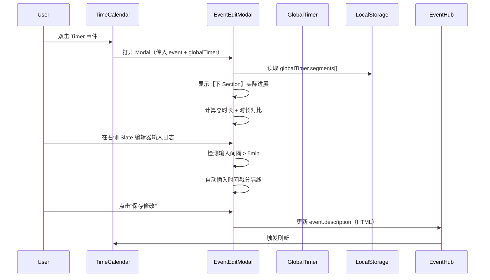
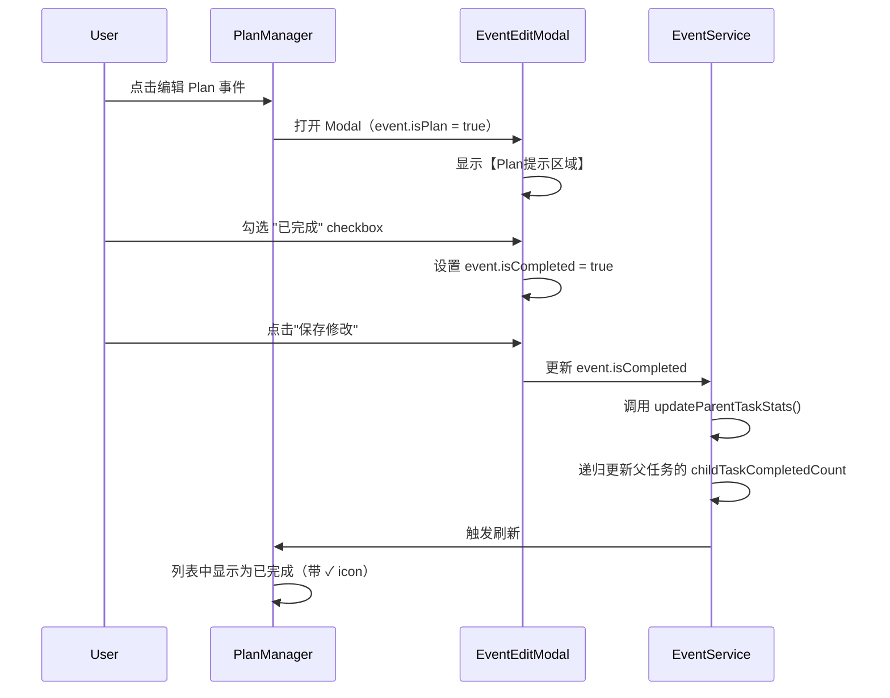
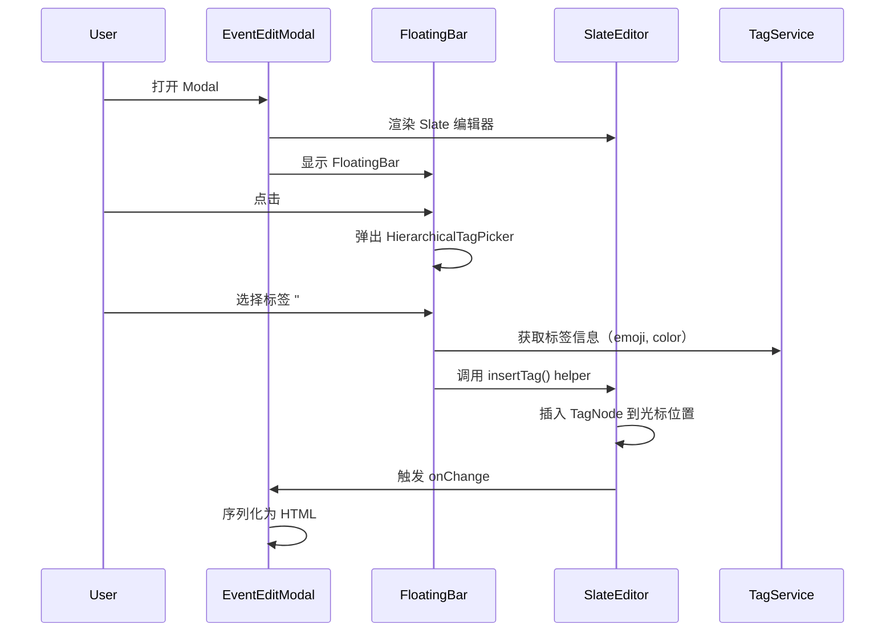
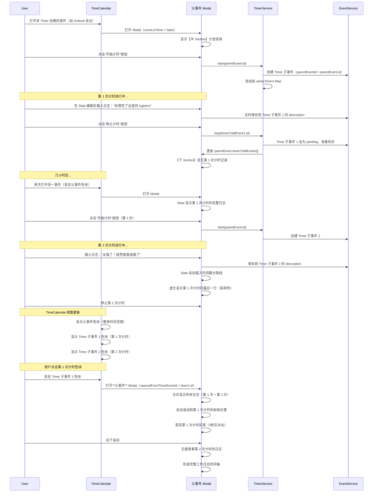

# EventEditModal v2 产品需求文档 (PRD)

> **版本**: v2.0.0  
> **创建时间**: 2025-11-06  
> **Figma 设计稿**: [EventEditModal v2 设计稿](https://www.figma.com/design/T0WLjzvZMqEnpX79ILhSNQ/ReMarkable-0.1?node-id=201-630&m=dev)  
> **基于**: EventEditModal v1 + Figma 设计稿  
> **依赖模块**: EventHub, TimeHub, UnifiedSlateEditor, HeadlessFloatingToolbar  
> **关联文档**: 
> - [EventEditModal v1 PRD](./EVENTEDITMODAL_MODULE_PRD.md)
> - [Timer 模块 PRD](./TIMER_MODULE_PRD.md)
> - [TimeCalendar 模块 PRD](./TIMECALENDAR_MODULE_PRD.md)
> - [TIME_ARCHITECTURE.md](../TIME_ARCHITECTURE.md)
> - [SLATE_DEVELOPMENT_GUIDE.md](../SLATE_DEVELOPMENT_GUIDE.md)

---

## 📋 目录

1. [版本升级说明](#版本升级说明)
2. [视图模式](#视图模式)
   - [详情视图](#详情视图-左右分栏)
   - [收缩视图](#收缩视图-单栏卡片)
3. [整体布局](#整体布局)
4. [左侧：Event Overview](#左侧event-overview)
5. [右侧：Event Log](#右侧event-log)
6. [数据字段扩展](#数据字段扩展)
7. [技术实现要点](#技术实现要点)
8. [用户交互流程](#用户交互流程)

---

## 版本升级说明

### v1 → v2 的核心变化

| 功能模块 | v1 实现 | v2 升级 |
|---------|--------|--------|
| **布局结构** | 单栏表单布局 | 左右分栏（左侧固定宽度 + 右侧可 resize，最小宽度 >= 左侧）+ **收缩视图** |
| **描述字段** | 纯文本 `<textarea>` | **UnifiedSlateEditor** 富文本编辑器 |
| **时间显示** | 单一时间字段 | **计划时间 vs 实际时间对比**（Timer 集成） |
| **日志记录** | 简单文本输入 | **时间戳分隔线 + 富文本日志** |
| **标签显示** | 单行 chips | **层级路径 + Event Log 区域展示** |
| **任务管理** | 无 | **Plan 集成 + 任务状态 + 关联任务** |
| **FloatingBar** | 无 | **集成 HeadlessFloatingToolbar**（emoji/tag/date 插入） |
| **Timer 集成** | 无 | **上下 Section 之间的计时按钮（含取消功能）** |
| **视图切换** | 无 | **详情视图 ↔ 收缩视图**（通过 "back" / "展开详情" 按钮切换） |

### 设计理念

**"左侧管理，右侧记录"**

- **左侧 Event Overview**: 聚焦事件的**元数据管理**（时间、人、地点、来源）
- **右侧 Event Log**: 聚焦**日志记录**（会议纪要、资料收集、实时想法）

**"收放自如，专注效率"**

- **详情视图**（Default）：完整的左右分栏，用于深度编辑和日志记录
- **收缩视图**（Compact）：单栏卡片，用于快速浏览和计时操作

---

## 视图模式

EventEditModal v2 支持两种视图模式，用户可根据使用场景切换：

### 详情视图（左右分栏）

**使用场景**:
- 需要编辑事件元数据（时间、参会人、位置等）
- 需要记录详细的会议日志或工作笔记
- 需要查看完整的事件信息和历史记录

**布局特点**:
- 左侧：Event Overview（固定宽度 360px）
- 右侧：Event Log（flex: 1, min-width: 360px）
- 支持右侧区域 resize

**切换方式**:
- 点击 Slate 编辑区右上角的 "back" 按钮 → 关闭右侧视图，进入收缩视图

---

### 收缩视图（单栏卡片）

**使用场景**:
- 只需要快速浏览事件基本信息
- 专注于计时操作（开始、暂停、结束）
- 需要同时查看多个事件（可并排显示多个收缩卡片）
- 减少屏幕占用，保持专注

**布局特点**:
- 单栏卡片（宽度 ~383px，高度 ~730px）
- 圆角设计（border-radius: 45px）
- 垂直布局：Emoji → 标题 → 标签 → 计时区域 → 计划安排 → 实际进展 → 底部按钮

**核心元素**:
```
┌─────────────────────────────────┐
│         🎯 Emoji (60px)          │ ← 点击可换 emoji
│                                 │
│       准备演讲稿 (18px Bold)     │ ← 标题
│   🔗 #👜工作/#🧐文档编辑 等      │ ← 标签 + 关联任务
│                                 │
│   ┌───────────────────────┐     │
│   │   [▶️ 开始专注]        │     │ ← 未计时状态：单个开始按钮
│   └───────────────────────┘     │
│         或                      │
│   ┌───────────────────────┐     │
│   │  ☑️ 🚀 Ⓜ️              │     │ ← 计时中：任务/里程碑状态
│   │                       │     │
│   │      25:30            │     │ ← 大号计时器（48px Bold）
│   │  开始时间 09:00        │     │
│   │                       │     │
│   │  [⏸️] [⏹️] [❌]       │     │ ← 暂停/结束/取消按钮（圆形小图标）
│   └───────────────────────┘     │
│                                 │
│   计划安排                       │
│   发起人：                       │
│   参会人：                       │
│   10:00 ──2h30min→ 12:00        │
│   来自 ●Outlook: 默认            │
│        📥 只接收同步             │ ← 来源日历 + 同步模式选择器
│                                 │
│   实际进展         总时长：3小时  │ ← 标题左侧，总时长右侧
│   🕐 10:00 ──2h30min→ 12:00     │
│   🕐 23:00 ──2h→ 01:00 +1       │
│   同步 ●Outlook: 工作等          │
│        🔄 双向同步               │ ← 同步日历 + 同步模式选择器
│   ⚫ Milestone完成于...          │
│                                 │
│ [取消]                [保存修改] │ ← 底部左右两个文字按钮
└─────────────────────────────────┘
```

**切换方式**:
- 收缩视图默认显示，用户可以直接编辑和保存
- 如需查看完整日志，可展开为详情视图（带右侧 Event Log）

**底部按钮**:
```tsx
<div className="compact-footer-buttons">
  <button className="footer-btn-text" onClick={handleCancel}>
    取消
  </button>
  <button className="footer-btn-text" onClick={handleSave}>
    保存修改
  </button>
</div>
```

```css
.compact-footer-buttons {
  display: flex;
  justify-content: space-between;
  padding: 16px 24px;
  border-top: 1px solid #f3f4f6;
}

.footer-btn-text {
  font-family: 'Istok Web', sans-serif;
  font-size: 15px;
  color: #6b7280;
  background: none;
  border: none;
  cursor: pointer;
  padding: 8px;
  transition: color 0.2s;
}

.footer-btn-text:hover {
  color: #3b82f6;
}
```

**交互逻辑**:
```typescript

const handleCancel = () => {
  // 关闭 Modal，不保存修改
  onClose();
};

const handleSave = async () => {
  // 保存修改并关闭 Modal
  await EventService.update(event.id, formData);
  onClose();
};
```

**Figma 设计稿**: [收缩视图](https://www.figma.com/design/T0WLjzvZMqEnpX79ILhSNQ/ReMarkable-0.1?node-id=208-968&m=dev)

---

## 整体布局（详情视图）

```
┌─────────────────────────────────────────────────────────────────┐
├───────────────────────┬─────────────────────────────────────────┤
│  Event Overview (左)   │  Event Log (右)                          │
│  固定宽度 360px        │  flex: 1, min-width: 360px              │
│                       │                                         │
│  ┌─────────────────┐  │  ┌───────────────────────────────────┐  │
│  │【上 Section】    │  │  │ 【标签区域】                       │  │
│  │ 🎯 准备演讲稿    │  │  │ #🚀工作/#📝文档编辑 #...           │  │
│  │ ☑ 任务模式       │  │  └───────────────────────────────────┘  │
│  │ #🚀工作/...等    │  │                                         │
│  └─────────────────┘  │  ┌───────────────────────────────────┐  │
│                       │  │ 【Plan提示区域】                    │  │
│  ┌─────────────────┐  │  │ ☑ ⏰ 🚩 创建于12h前，ddl还有2h30min │  │
│  │  [▶️ 开始计时]   │  │  └───────────────────────────────────┘  │
│  └─────────────────┘  │                                         │
│                       │  ┌───────────────────────────────────┐  │
│  ┌─────────────────┐  │  │ 【关联区域】                        │  │
│  │【中 Section】    │  │  │ 🔗 上级任务：Project Ace (5/7)     │  │
│  │ 计划安排         │  │  └───────────────────────────────────┘  │
│  │ 👥 Zoey; Jenny  │  │                                         │
│  │ 📅 10:00→12:00  │  │  ┌───────────────────────────────────┐  │
│  │ 📍 静安嘉里...   │  │  │ 【Slate 编辑区】                   │  │
│  │ 来自●Outlook:默认│  │  │                                    │  │
│  │      📥只接收同步│  │  │ ─────────────────────             │  │ ← 来源日历+同步模式
│  └─────────────────┘  │  │ 2025-10-19 10:21:18               │  │
│                       │  │                                    │  │
│  ┌─────────────────┐  │  │ 处理完了一些出差的logistics...     │  │
│  │【下 Section】    │  │  │ 准备先一个提纲丢给GPT...           │  │ 
│  │实际进展 总时长:3h│  │  │                                    │  │ ← 标题+总时长右侧
│  │ 🕐 10:00→12:00  │  │  │ ─────────────────────             │  │
│  │ 🕐 23:00→01:00  │  │  │ 2025-10-19 10:35:18 | 16min later │  │
│  │ 同步●Outlook:工作│  │  │                                    │  │
│  │      🔄双向同步  │  │  │                                    │  │ ← 同步日历+同步模式
│  │ 比计划多30min   │  │  │                                    │  │
│  └─────────────────┘  │  │                                    │  │
│                       │  │ 太强了！居然直接成稿了...          │  │
│                       │  │                                    │  │
│                       │  │ [😊 # 📅 • 🎨 ✓]  FloatingBar     │  │
│                       │  └───────────────────────────────────┘  │
└───────────────────────┴─────────────────────────────────────────┘
│  [取消]                                           [保存修改]     │ ← 左右布局
└─────────────────────────────────────────────────────────────────┘
```

**底部按钮**:
```tsx
<div className="modal-footer-buttons">
  <button className="footer-btn-cancel" onClick={handleCancel}>
    取消
  </button>
  <button className="footer-btn-save" onClick={handleSave}>
    保存修改
  </button>
</div>
```

```css
.modal-footer-buttons {
  display: flex;
  justify-content: space-between;
  padding: 16px 24px;
  border-top: 1px solid #e5e7eb;
}

.footer-btn-cancel,
.footer-btn-save {
  font-family: 'Istok Web', sans-serif;
  font-size: 15px;
  background: none;
  border: none;
  cursor: pointer;
  padding: 8px 16px;
  transition: color 0.2s;
}

.footer-btn-cancel {
  color: #9ca3af;
}

.footer-btn-cancel:hover {
  color: #6b7280;
}

.footer-btn-save {
  color: #3b82f6;
}

.footer-btn-save:hover {
  color: #2563eb;
}
```

---

## 左侧：Event Overview

### 【上 Section】- 事件标识

#### 1.1 Emoji（大图标）

**数据来源**:
```typescript
event.title: string  // 从标题首字符提取 emoji
```

**显示逻辑**:
```typescript
function getDisplayEmoji(event: Event, globalTimer: any): string {
  // 优先级 1: 标题中的 emoji（提取标题首个 emoji 字符）
  const titleEmoji = extractFirstEmoji(event.title);
  if (titleEmoji) return titleEmoji;
  
  // 优先级 2: 首个标签的 emoji
  if (event.tags && event.tags.length > 0) {
    const firstTag = getTagById(event.tags[0]);
    if (firstTag?.emoji) return firstTag.emoji;
  }
  
  // 优先级 3: Placeholder（根据 Timer 状态）
  const isTimerActive = globalTimer?.eventId === event.id;
  return isTimerActive ? '⏳' : '�';
}

/**
 * 从字符串中提取第一个 emoji 字符
 */
function extractFirstEmoji(text: string): string | null {
  if (!text) return null;
  
  // Emoji 正则表达式
  const emojiRegex = /[\p{Emoji_Presentation}\p{Extended_Pictographic}]/gu;
  const match = text.match(emojiRegex);
  
  return match ? match[0] : null;
}
```

**交互**:
- 点击弹出 EmojiPicker（见附件 `EmojiPicker.tsx`）
- 选中后的处理逻辑：
  ```typescript
  const handleEmojiSelect = (selectedEmoji: string) => {
    // 1. 移除标题中现有的 emoji（如果存在）
    let newTitle = formData.title;
    const existingEmoji = extractFirstEmoji(newTitle);
    if (existingEmoji) {
      newTitle = newTitle.replace(existingEmoji, '').trim();
    }
    
    // 2. 将新 emoji 添加到标题开头
    newTitle = `${selectedEmoji} ${newTitle}`;
    
    // 3. 更新表单数据
    setFormData({ ...formData, title: newTitle });
    
    // 4. 关闭 Picker
    setEmojiPickerVisible(false);
  };
  ```
- Emoji 自动显示在标题输入框的开头

**UI 样式**:
```css
.emoji-large {
  font-size: 48px;
  cursor: pointer;
  padding: 12px;
  border-radius: 8px;
  transition: background 0.2s;
}
.emoji-large:hover {
  background: #f3f4f6;
}
```

---

#### 1.2 标题输入框

**数据读取**:
```typescript
// 🔍 读取标题：Timer 子事件显示父事件的标题
function getDisplayTitle(event: Event): string {
  if (event.isTimer && event.parentEventId) {
    const parentEvent = EventService.getEventById(event.parentEventId);
    return parentEvent?.title || event.title;
  }
  return event.title;
}
```

**显示逻辑**:
```typescript
<input
  type="text"
  value={formData.title}
  placeholder={getTitlePlaceholder(formData.tags)}
  onChange={(e) => handleTitleChange(e.target.value)}
/>

function getTitlePlaceholder(tags: string[]): string {
  if (tags.length === 0) return '事件标题';
  const firstTag = getTagById(tags[0]);
  return firstTag?.name ? `${firstTag.name}事项` : '事件标题';
}
```

**数据保存**（Timer 子事件情况）:
```typescript
const handleTitleChange = async (newTitle: string) => {
  // 🔍 如果当前是 Timer 子事件（isTimer = true），保存到父事件
  if (event.isTimer && event.parentEventId) {
    const parentEvent = EventService.getEventById(event.parentEventId);
    if (!parentEvent) return;
    
    // ✅ 直接更新父事件的标题
    await EventService.update(parentEvent.id, {
      title: newTitle
    });
    
    setFormData({ ...formData, title: newTitle });
    return;
  }
  
  // ✅ 非 Timer 子事件，正常保存到自己
  setFormData({ ...formData, title: newTitle });
};
```

**用户体验说明**:
- ✅ 所有计时记录共享同一个标题（用户视角：这就是同一个事件）
- ✅ 修改标题时，如果是 Timer 子事件，自动同步到父事件
- ✅ TimeCalendar 上所有相关色块的标题会同步更新

**验证规则**:
- 必填字段（除非选择了标签，则可用标签名称代替）
- 最大长度 200 字符

---

#### 1.3 标签显示

**数据来源**: `event.tags[]`

**显示逻辑**:
```typescript
function getTagsDisplayText(tags: string[]): string {
  if (tags.length === 0) return '选择标签...';
  
  const firstTag = getTagById(tags[0]);
  if (!firstTag) return '选择标签...';
  
  // 构建层级路径
  const path = getTagHierarchyPath(firstTag);  // 如 "🚀工作/📝文档编辑"
  
  if (tags.length > 1) {
    return `#${path} 等`;
  }
  return `#${path}`;
}
```

**交互**:
- 点击打开 HierarchicalTagPicker
- 支持多选
- 选中后立即更新显示

**UI 样式**:
```css
.tags-display {
  padding: 8px 12px;
  background: rgba(59, 130, 246, 0.1);
  border-radius: 6px;
  color: #3b82f6;
  cursor: pointer;
  font-size: 14px;
  font-weight: 500;
}
```

---

#### 1.4 任务勾选框（条件显示）

**显示条件**:
```typescript
function shouldShowTaskCheckbox(event: Event): boolean {
  return event.isPlan === true && event.isTask !== false;
  // 只有从 Plan 页面创建且用户没关闭 addTask 按钮的事件才显示
}
```

**数据来源**: `event.isTask: boolean`

**交互逻辑**:
```typescript
<input
  type="checkbox"
  checked={formData.isTask}
  onChange={(e) => setFormData({ ...formData, isTask: e.target.checked })}
/>
```

**显示效果**:
- 勾选 → 显示 ✓ icon，`isTask = true`
- 不勾选 → 隐藏 checkbox icon，`isTask = false`

---

### 【计时按钮】- Timer 集成（位于上下 Section 之间）

**显示条件**:
```typescript
// 始终显示计时按钮
```

**按钮状态**:
```typescript
interface TimerButtonState {
  isRunning: boolean;      // Timer 是否正在运行
  eventId: string | null;  // 当前绑定的事件 ID
  elapsedTime: number;     // 累积时长（毫秒）
}

function getTimerButtonConfig(event: Event, activeTimers: Map<string, TimerState>): TimerButtonConfig {
  const eventTimer = activeTimers.get(event.id);
  const isTimerRunning = eventTimer?.isRunning === true;
  const isTimerPaused = eventTimer?.isPaused === true;
  
  if (eventTimer && isTimerRunning) {
    // 🎯 当前事件正在计时 - 显示三个按钮：暂停、结束、取消
    return {
      buttons: [
        { icon: 'pause', text: '暂停计时', action: 'pause', color: 'gradient-red' },
        { icon: 'stop', text: '结束计时', action: 'stop', color: 'gray' },
        { icon: 'cancel', text: '取消计时', action: 'cancel', color: 'gray' }
      ],
      showTimer: true,
      timerDisplay: 'running'
    };
  } else if (eventTimer && isTimerPaused) {
    // ⏸️ 当前事件已暂停 - 显示三个按钮：继续、结束、取消
    return {
      buttons: [
        { icon: 'resume', text: '继续计时', action: 'resume', color: 'gradient-red' },
        { icon: 'stop', text: '结束计时', action: 'stop', color: 'gray' },
        { icon: 'cancel', text: '取消计时', action: 'cancel', color: 'gray' }
      ],
      showTimer: true,
      timerDisplay: 'paused'
    };
  } else {
    // ▶️ 当前事件未计时 - 显示单个开始按钮
    return {
      buttons: [
        { icon: 'start', text: '开始专注', action: 'start', color: 'default' }
      ],
      showTimer: false
    };
  }
}
```

**交互逻辑**:
```typescript
const handleTimerAction = async (action: 'start' | 'pause' | 'resume' | 'stop' | 'cancel') => {
  switch (action) {
    case 'start':
      // ▶️ 为当前事件启动新的 Timer
      
      // 🆕 特殊处理：独立 Timer 事件的二次计时
      if (event.isTimer && !event.parentEventId && event.segments && event.segments.length > 0) {
        // 检测到这是独立 Timer 的二次计时，自动升级为父子结构
        
        // Step 1: 创建父事件（继承原 Timer 的所有元数据）
        const parentEvent = {
          id: generateId(),
          title: event.title,
          description: event.description,
          emoji: event.emoji,
          tags: event.tags,
          color: event.color,
          source: 'local',
          isTimer: false,          // ✅ 不再是 Timer
          isTimeCalendar: true,    // 标记为 TimeCalendar 创建
          timerChildEvents: [event.id], // 将原 Timer 作为第一个子事件
          createdAt: event.createdAt,
          updatedAt: new Date().toISOString(),
          // 继承其他所有元数据...
        };
        
        // Step 2: 将原 Timer 转为子事件
        event.parentEventId = parentEvent.id;
        await EventService.updateEvent(event);
        
        // Step 3: 保存父事件
        await EventService.createEvent(parentEvent);
        
        // Step 4: 为父事件启动新 Timer（将生成第二个子事件）
        await TimerService.start(parentEvent.id);
        
        // Step 5: 更新当前 Modal 显示的事件为父事件
        // （让用户无感知地看到汇总数据）
        setCurrentEvent(parentEvent);
        
      } else {
        // 普通情况：直接启动 Timer
        await TimerService.start(event.id);
      }
      break;
      
    case 'pause':
      // ⏸️ 暂停当前事件的 Timer
      await TimerService.pause(event.id);
      break;
      
    case 'resume':
      // ▶️ 继续当前事件的 Timer
      await TimerService.resume(event.id);
      break;
      
    case 'stop':
      // ⏹️ 结束计时并保存
      // - 创建 Timer 子事件（包含 startTime, endTime, segments, description）
      // - 保存到父事件的 timerChildEvents[]
      // - 清除当前活动 Timer
      await TimerService.stop(event.id);
      break;
      
    case 'cancel':
      // ❌ 取消计时（不保存）
      // - 直接清除当前活动 Timer
      // - 不创建 Timer 子事件
      await TimerService.cancel(event.id);
      break;
  }
};
```

**🆕 独立 Timer 事件二次计时自动升级机制**:

**触发条件**:
```typescript
// 检测条件
const shouldUpgradeToParentChild = (event: Event): boolean => {
  return (
    event.isTimer === true &&           // 是 Timer 事件
    event.parentEventId == null &&      // 无父事件（独立 Timer）
    event.segments &&                   // 已有计时记录
    event.segments.length > 0           // 至少有一次完整计时
  );
};
```

**升级流程**:
1. **创建父事件**：继承原 Timer 的所有元数据（标题、标签、emoji、描述等）
2. **转换子事件**：将原 Timer 标记为子事件（设置 `parentEventId`）
3. **更新关联**：父事件的 `timerChildEvents` 包含原 Timer ID
4. **启动新计时**：为父事件启动新 Timer（将生成第二个子事件）
5. **无缝切换**：Modal 自动切换显示父事件，用户无感知

**数据示例**:
```typescript
// === 升级前 ===
const timerBefore = {
  id: 'timer-1',
  title: '学习英语',
  isTimer: true,
  parentEventId: null,  // 独立 Timer
  segments: [{ start: '10:00', end: '10:30', duration: 1800 }]
};

// === 升级后 ===
const parentEvent = {
  id: 'event-parent',
  title: '学习英语',         // 继承
  isTimer: false,
  isTimeCalendar: true,
  timerChildEvents: ['timer-1', 'timer-2']
};

const timerAfter = {
  id: 'timer-1',
  title: '学习英语',
  isTimer: true,
  parentEventId: 'event-parent', // ✅ 已挂载
  segments: [{ start: '10:00', end: '10:30', duration: 1800 }]
};

const newTimer = {
  id: 'timer-2',
  title: '学习英语',
  isTimer: true,
  parentEventId: 'event-parent', // ✅ 挂载到父事件
  segments: [{ start: '14:00', end: '14:45', duration: 2700 }]
};
```

**用户体验保证**:
- ✅ **完全无感知**：用户只看到计时继续，不知道发生了升级
- ✅ **数据完整**：所有元数据（标题、标签、emoji、描述）完整保留
- ✅ **视图一致**：Modal 自动切换显示父事件，汇总所有计时
- ✅ **可追溯**：TimeCalendar 上显示父事件 + 所有子事件色块

**多 Timer 支持说明**：
- ✅ 支持多个 EventEditModal 同时打开，各自处于 Timer 状态
- ✅ 每个 Modal 独立管理各自事件的 Timer（一个 Modal 一个事件）
- ✅ 使用 `Map<eventId, TimerState>` 存储所有活动 Timer
- ✅ 用户可以同时为不同事件计时，互不影响
- ✅ 每个 Modal 的实际进展区域（【下 Section】）只显示自己事件的 Timer 数据

**UI 样式**:

**详情视图 - 单个开始按钮**（未计时状态）:
```css
.timer-button-start {
  width: 100%;
  padding: 12px;
  border-radius: 8px;
  border: 1px solid #e5e7eb;
  background: #fff;
  cursor: pointer;
  display: flex;
  align-items: center;
  justify-content: center;
  gap: 8px;
  font-size: 14px;
  font-weight: 500;
  transition: all 0.2s;
}

.timer-button-start:hover {
  background: #f9fafb;
  transform: translateY(-1px);
  box-shadow: 0 2px 8px rgba(0, 0, 0, 0.1);
}
```

**详情视图 - 三按钮组**（计时中/已暂停）:
```tsx
import PauseIcon from '@/assets/icons/pause.svg';
import StopIcon from '@/assets/icons/stop.svg';
import CancelIcon from '@/assets/icons/cancel.svg';

<div className="timer-buttons-group">
  <button 
    className="timer-button-circle gradient-red"
    onClick={() => handleTimerAction('pause')}
  >
    
  </button>
  <button 
    className="timer-button-circle gray"
    onClick={() => handleTimerAction('stop')}
  >
    
  </button>
  <button 
    className="timer-button-circle gray"
    onClick={() => handleTimerAction('cancel')}
  >
    
  </button>
</div>
```

```css
.timer-buttons-group {
  display: flex;
  gap: 12px;
  align-items: center;
  justify-content: center;
  width: 100%;
}

.timer-button-circle {
  width: 42px;
  height: 42px;
  border-radius: 20px;
  border: none;
  cursor: pointer;
  display: flex;
  align-items: center;
  justify-content: center;
  transition: all 0.2s;
}

.timer-button-circle.gradient-red {
  background: linear-gradient(135deg, #ef4444 0%, #dc2626 100%);
  box-shadow: 0 2px 8px rgba(239, 68, 68, 0.3);
}

.timer-button-circle.gray {
  background: #f3f4f6;
  border: 1px solid rgba(255, 255, 255, 0.4);
}

.timer-button-circle:hover {
  transform: scale(1.05);
}

.timer-button-circle img {
  width: 14px;
  height: 14px;
  object-fit: contain;
}

/* ✅ 图标来源说明：
   - pause.svg: 40x47px 原图，包含阴影效果
   - stop.svg: 40x47px 原图，包含阴影效果
   - cancel.svg: 40x47px 原图，包含阴影效果
   - 在详情视图中缩小至 14x14px 显示
*/
```

**收缩视图 - 圆形小图标**（计时中/已暂停）:
```tsx
import PauseIcon from '@/assets/icons/pause.svg';
import StopIcon from '@/assets/icons/stop.svg';
import CancelIcon from '@/assets/icons/cancel.svg';

<div className="timer-buttons-compact">
  <button 
    className="timer-icon-compact gradient-red"
    onClick={() => handleTimerAction('pause')}
  >
    
  </button>
  <button 
    className="timer-icon-compact gray"
    onClick={() => handleTimerAction('stop')}
  >
    
  </button>
  <button 
    className="timer-icon-compact gray"
    onClick={() => handleTimerAction('cancel')}
  >
    
  </button>
</div>
```

```css
.timer-buttons-compact {
  display: flex;
  gap: 8px;
  align-items: center;
  justify-content: flex-end;
  margin-top: 8px;
}

.timer-icon-compact {
  width: 25px;
  height: 25px;
  border-radius: 12px;
  border: none;
  cursor: pointer;
  display: flex;
  align-items: center;
  justify-content: center;
  transition: all 0.2s;
}

.timer-icon-compact.gradient-red {
  background: linear-gradient(135deg, #ef4444 0%, #dc2626 100%);
}

.timer-icon-compact.gray {
  background: #f3f4f6;
  border: 0.6px solid rgba(255, 255, 255, 0.4);
}

.timer-icon-compact:hover {
  transform: scale(1.05);
}

.timer-icon-compact img {
  width: 8px;
  height: 8px;
  object-fit: contain;
}

/* ✅ 图标来源说明：
   - 使用相同的 SVG 图标（pause.svg, stop.svg, cancel.svg）
   - 在收缩视图中进一步缩小至 8x8px
   - 保留原图标的阴影和渐变效果
*/
```

**计时器显示区域**（收缩视图）:
```tsx
{showTimer && (
  <div className="timer-display-compact">
    {/* 任务/里程碑状态图标 */}
    <div className="timer-status-icons">
      {event.isTask && <TaskGrayIcon />}
      {event.hasMilestone && <MilestoneGrayIcon />}
    </div>
    
    {/* 大号计时器 */}
    <div className="timer-countdown">25:30</div>
    <div className="timer-start-time">开始时间 09:00</div>
    
    {/* 操作按钮 */}
    <div className="timer-buttons-compact">
      <button className="timer-icon-compact gradient-red">
        
      </button>
      <button className="timer-icon-compact gray">
        
      </button>
      <button className="timer-icon-compact gray">
        
      </button>
    </div>
  </div>
)}
```

```css
.timer-display-compact {
  display: flex;
  flex-direction: column;
  align-items: center;
  padding: 20px;
  background: #fff;
  border-radius: 20px;
  margin: 16px 0;
}

.timer-status-icons {
  display: flex;
  gap: 8px;
  margin-bottom: 12px;
}

.timer-countdown {
  font-family: 'Outfit', sans-serif;
  font-size: 48px;
  font-weight: 700;
  background: linear-gradient(135deg, #a855f7 0%, #3b82f6 75%);
  -webkit-background-clip: text;
  -webkit-text-fill-color: transparent;
  text-shadow: 0px 4px 8px rgba(0, 0, 0, 0.05), 0px 4px 4px rgba(0, 0, 0, 0.1);
}

.timer-start-time {
  font-size: 14px;
  color: #6b7280;
  margin-top: 4px;
  margin-bottom: 12px;
}
```

**显示示例**（详情视图）:
```
┌──────────────────────────────┐
│   [▶️ 开始专注]              │  ← 未计时：单个文字按钮
└──────────────────────────────┘

        或

┌──────────────────────────────┐
│   [⏸️]  [⏹️]  [❌]          │  ← 计时中：三个圆形图标按钮
└──────────────────────────────┘
```

**显示示例**（收缩视图）:
```
┌────────────────────────┐
│  ☑️🚩                 │  ← 任务/ddl状态
│                        │
│       25:30            │  ← 渐变色大号计时器
│   开始时间 09:00        │
│                        │
│        [⏸️] [⏹️] [❌]  │  ← 右对齐的小图标按钮
└────────────────────────┘
```

**关联文档**: [Timer 模块 PRD](./TIMER_MODULE_PRD.md)
```

**显示示例**:
```tsx
<button 
  className={`timer-button ${buttonConfig.className}`}
  onClick={() => handleTimerAction(buttonConfig.action)}
>
  
  <span className="timer-text">{buttonConfig.text}</span>
</button>

// 图标映射
function getTimerIcon(iconType: string) {
  switch (iconType) {
    case 'start': return TimerStartIcon;
    case 'pause': return PauseIcon;
    case 'resume': return TimerStartIcon;
    default: return TimerStartIcon;
  }
**关联文档**: [Timer 模块 PRD](./TIMER_MODULE_PRD.md)

**图标资源** (已确认存在于 `src/assets/icons/`):
```typescript
import TimerStartIcon from '@/assets/icons/timer_start.svg';  // 开始计时 - 渐变色播放图标
import PauseIcon from '@/assets/icons/pause.svg';             // 暂停 - 红色渐变双竖线
import StopIcon from '@/assets/icons/stop.svg';               // 结束 - 灰色方形
import CancelIcon from '@/assets/icons/cancel.svg';           // 取消 - 蓝色渐变垃圾桶图标
```

**图标规格**:
- `timer_start.svg`: 20x20px, 渐变色 (#A855F7 → #3B82F6), 播放+计时器图标
- `pause.svg`: 40x47px (带阴影), 红色渐变 (#EF4444 → #DC2626), 双竖线
- `stop.svg`: 40x47px (带阴影), 灰色 (#F9FAFB), 实心方形
- `cancel.svg`: 40x47px (带阴影), 蓝色渐变 (#3B82F6 → #2563EB), 垃圾桶图标

**使用说明**:
- 详情视图（大按钮）：直接使用原图标（40x47px）
- 收缩视图（小按钮）：使用时缩小至 8x8px 或 14x14px（通过 CSS）

---

### 【中 Section】- 计划安排（条件显示）

**显示条件**:
```typescript
function shouldShowPlanSection(event: Event): boolean {
  // 🆕 情况 1: 如果是 Timer 子事件，显示父事件的计划安排
  if (event.isTimer === true && event.parentEventId) {
    const parentEvent = EventService.getEventById(event.parentEventId);
    return parentEvent !== null; // 有父事件就显示计划安排
  }
  
  // 🆕 情况 2: 如果是独立的 Timer 事件（没有父事件），不显示
  if (event.isTimer === true && !event.parentEventId) {
    return false; // 独立 Timer 事件没有预设的计划时间
  }
  
  // 情况 3: 非 Timer 事件，正常显示
  return true;
  
  // 说明：
  // - Timer 子事件（isTimer = true + parentEventId 存在）→ **显示父事件的计划安排**
  // - 独立 Timer 事件（isTimer = true + 无 parentEventId）→ **不显示**
  // - Remote 事件（microsoftEventId 存在）→ 显示
  // - Plan 页面创建（isPlan = true）→ 显示
  // - TimeCalendar 日历区域直接创建（isTimeCalendar = true）→ 显示
}
```

**数据读取**（Timer 子事件情况）:
```typescript
function getPlanSectionData(event: Event) {
  // 🔍 如果是 Timer 子事件，从父事件读取计划数据
  if (event.isTimer && event.parentEventId) {
    const parentEvent = EventService.getEventById(event.parentEventId);
    if (!parentEvent) return null;
    
    // ⚠️ 用户视角：显示的是"这个事件"的计划安排（实际是父事件的数据）
    return {
      attendees: parentEvent.attendees,
      startTime: parentEvent.startTime,
      endTime: parentEvent.endTime,
      location: parentEvent.location,
      calendar: parentEvent.calendarId,
      parentEventId: parentEvent.id  // 用于保存时回写
    };
  }
  
  // 非 Timer 子事件，使用自己的数据
  return {
    attendees: event.attendees,
    startTime: event.startTime,
    endTime: event.endTime,
    location: event.location,
    calendar: event.calendarId,
    parentEventId: null
  };
}
```

**数据保存**（Timer 子事件修改计划安排时）:
```typescript
const handlePlanDataChange = async (field: string, value: any) => {
  // 🔍 如果当前是 Timer 子事件（isTimer = true），保存到父事件
  if (event.isTimer && event.parentEventId) {
    const parentEvent = EventService.getEventById(event.parentEventId);
    if (!parentEvent) return;
    
    // ✅ 直接更新父事件的数据
    await EventService.update(parentEvent.id, {
      [field]: value
    });
    
    // 刷新当前 Modal 的显示
    refreshPlanSectionData();
    return;
  }
  
  // ✅ 非 Timer 子事件，正常保存到自己
  await EventService.update(event.id, {
    [field]: value
  });
};
```

**用户体验说明**:
- ✅ **用户视角**：我在编辑"这个事件"的计划安排（参会人、时间、地点）
- ✅ **实际行为**：
  - 如果是 Timer 子事件 → 修改保存到父事件
  - 如果是普通事件 → 修改保存到自己
- ✅ **无需提示**：用户不需要知道底层的父子关系
- ✅ **数据一致性**：所有计时记录共享同一份计划数据

**字段说明**:
- `event.isTimer: boolean` - 是否是 Timer 事件（包括独立 Timer 和 Timer 子事件）
- `event.parentEventId: string | undefined` - 父事件 ID（Timer 子事件必有此字段）
- Timer 子事件的所有计划字段修改都会自动同步到父事件

---

#### 2.1 参会人（Organizer + Attendees）

**数据结构**:
```typescript
// 使用 EventHub 统一的 Contact 接口
interface Contact {
  id?: string;
  name?: string;
  email?: string;
  phone?: string;
  avatarUrl?: string;
  organization?: string;    // 公司/组织
  isReMarkable?: boolean;   // ReMarkable 本地联系人
  isOutlook?: boolean;      // Outlook 联系人
  isGoogle?: boolean;       // Google 联系人
  isiCloud?: boolean;       // iCloud 联系人
  type?: AttendeeType;      // 参会类型：required | optional | resource
  status?: AttendeeStatus;  // 响应状态：accepted | declined | tentative | none
  externalId?: string;      // 外部平台原始 ID
  notes?: string;           // 备注信息
}

interface Event {
  organizer?: Contact;      // 发起人（仅 Outlook/Google/iCloud 同步的事件有）
  attendees?: Contact[];    // 参会人列表
}

// 扩展字段（用于预览卡片和完整联系人卡片）
interface ContactWithExtras extends Contact {
  position?: string;        // 职务（ReMarkable 扩展字段，存储在 notes 中）
  tags?: string[];          // 标签（ReMarkable 扩展字段）
  recentEvents?: Event[];   // 关联的最近事件
  totalEvents?: number;     // 关联事件总数
}
```

**显示条件**:
```typescript
// 是否显示 organizer（加粗斜体下划线的发起人）
function shouldShowOrganizer(event: Event): boolean {
  // 1. Outlook/Google/iCloud 同步的事件：有 organizer 字段就显示
  if (event.organizer) return true;
  
  // 2. 用户自己创建的事件：如果 attendees 中有带邮箱的，用户自己就是 organizer
  const hasAttendeesWithEmail = event.attendees?.some(a => a.email);
  if (hasAttendeesWithEmail) return true;
  
  return false;
}

// attendees 不需要判断，有就显示，没有就空着（用户可以点击编辑）
// 整个参会人section始终显示（因为用户可能需要添加参会人）
```

**显示逻辑**:
```typescript
import { AttendeeIcon } from '@/assets/icons';

function renderAttendees(event: Event): ReactNode {
  if (!shouldShowAttendees(event)) return null;
  
  const participants: Contact[] = [];
  
  // 1. 添加发起人（如果存在，放在第一位）
  if (event.organizer) {
    participants.push(event.organizer);
  } else if (event.attendees?.some(a => a.email)) {
    // 用户自己创建的事件，有邮箱的参会人 → 发起人 = 用户自己
    participants.push({
      name: '我',  // 或从用户配置中获取
      email: UserService.getCurrentUserEmail(),
      source: 'remarkable'
    });
  }
  
  // 2. 添加参会人
  if (event.attendees) {
    participants.push(...event.attendees);
  }
  
  return (
    <div className="attendee-row">
      
      <div className="attendee-list">
        {participants.map((person, index) => (
          <span
            key={index}
            className={`attendee-name ${index === 0 ? 'organizer' : ''} ${person.email ? 'has-email' : ''}`}
            onMouseEnter={(e) => handleHoverStart(e, person)}
            onMouseLeave={handleHoverEnd}
            onClick={() => openAttendeeSearch(index)}
          >
            {person.name}
            {index < participants.length - 1 && '; '}
          </span>
        ))}
      </div>
    </div>
  );
}
```

**CSS 样式**:
```css
.attendee-row {
  display: flex;
  align-items: flex-start;
  gap: 8px;
  margin-bottom: 8px;
}

.attendee-list {
  flex: 1;
  line-height: 1.6;
}

.attendee-name {
  cursor: pointer;
  transition: color 0.2s;
}

.attendee-name:hover {
  color: #3b82f6;
}

/* 发起人样式：斜体 + 加粗 + 下划线 */
.attendee-name.organizer {
  font-weight: 700;
  font-style: italic;
  text-decoration: underline;
}

/* 有邮箱的参会人：下划线 */
.attendee-name.has-email {
  text-decoration: underline;
}
```

---

**交互 1: 点击展开搜索栏**

```typescript
**交互 1: 搜索与添加参会人**

```typescript
const [searchMode, setSearchMode] = useState(false);
const [searchQuery, setSearchQuery] = useState('');
const [searchResults, setSearchResults] = useState<Contact[]>([]);
const [selectedIndex, setSelectedIndex] = useState(0);

// 1. 打开搜索模式
const handleOpenSearch = (attendeeIndex: number) => {
  setSearchMode(true);
  setEditingIndex(attendeeIndex);
  setSearchQuery(participants[attendeeIndex]?.name || '');
};

// 2. 搜索输入
const handleSearchInput = async (query: string) => {
  setSearchQuery(query);
  const results = await searchContacts(query);
  setSearchResults(results);
};

// 3. 搜索逻辑（多来源合并 + 去重）
async function searchContacts(query: string): Promise<Contact[]> {
  // 3.1 搜索所有来源
  const platformContacts = await ContactService.searchPlatformContacts(query); // Outlook/Google/iCloud
  const remarkableContacts = await ContactService.searchLocalContacts(query);   // ReMarkable 本地联系人
  const historicalContacts = await EventService.searchHistoricalParticipants(query); // 历史事件参会人
  
  // 3.2 合并所有结果
  const allContacts = [
    ...platformContacts,
    ...remarkableContacts,
    ...historicalContacts
  ];
  
  // 3.3 去重（同一个人可能在多个来源都存在）
  const uniqueMap = new Map<string, Contact>();
  
  allContacts.forEach(contact => {
    const key = contact.email || contact.name; // 用邮箱或姓名作为唯一标识
    
    if (!uniqueMap.has(key)) {
      uniqueMap.set(key, contact);
    } else {
      // 同一个人存在多个来源时，根据优先级确定显示哪个来源标签
      const existing = uniqueMap.get(key)!;
      const newPriority = getSourcePriority(contact);
      const existingPriority = getSourcePriority(existing);
      
      if (newPriority < existingPriority) {
        uniqueMap.set(key, contact); // 用优先级更高的来源
      }
    }
  });
  
  return Array.from(uniqueMap.values());
}

// 4. 来源优先级（数字越小优先级越高）
function getSourcePriority(contact: Contact): number {
  if (contact.isOutlook || contact.isGoogle || contact.isiCloud) return 1;
  if (contact.isReMarkable) return 2;
  return 3; // 历史事件中的参会人（没有来源标识）
}

// 5. 格式化来源标签
function formatSource(contact: Contact): string {
  if (contact.isOutlook) return 'Outlook 联系人';
  if (contact.isGoogle) return 'Google 联系人';
  if (contact.isiCloud) return 'iCloud 联系人';
  if (contact.isReMarkable) return 'ReMarkable 联系人';
  return '历史参会人'; // 没有来源标识的，说明只在历史事件中出现过
}

// 6. 键盘交互
const handleKeyDown = (e: React.KeyboardEvent) => {
  switch (e.key) {
    case 'ArrowDown':
      e.preventDefault();
      setSelectedIndex(prev => Math.min(prev + 1, searchResults.length - 1));
      break;
      
    case 'ArrowUp':
      e.preventDefault();
      setSelectedIndex(prev => Math.max(prev - 1, 0));
      break;    window.SLATE_DEBUG = true
      
    case 'Enter':
      e.preventDefault();
      if (searchResults[selectedIndex]) {
        handleSelectContact(searchResults[selectedIndex]);
      }
      break;
      
    case 'Escape':
      setSearchMode(false);
      break;
  }
};
```

**搜索下拉菜单 UI**:
```tsx
{searchMode && (
  <div className="attendee-search-dropdown">
    {searchResults.map((contact, index) => (
      <div
        key={index}
        className={`search-result-item ${index === selectedIndex ? 'selected' : ''}`}
        onClick={() => handleSelectContact(contact)}
      >
        <div className="contact-name">{contact.name}</div>
        <div className="contact-source">{formatSource(contact)}</div>
      </div>
    ))}
  </div>
)}
```

---

**交互 2: 悬浮预览联系人卡片**

```typescript
const [hoverTimer, setHoverTimer] = useState<NodeJS.Timeout | null>(null);
const [previewContact, setPreviewContact] = useState<Contact | null>(null);
const [previewPosition, setPreviewPosition] = useState({ x: 0, y: 0 });
const [isMouseOverPreview, setIsMouseOverPreview] = useState(false);

// 1. 鼠标悬浮开始（1秒延迟）
const handleHoverStart = (e: React.MouseEvent, contact: Contact) => {
  const timer = setTimeout(async () => {
    // 获取完整联系人信息 + 最近 5 个关联事件
    const fullContact = await ContactService.getFullContactInfo(contact);
    const recentEvents = await EventService.getEventsByContact(contact.email || contact.name, 5);
    
    setPreviewContact({
      ...fullContact,
      recentEvents
    });
    
    // 设置卡片位置（鼠标右侧）
    setPreviewPosition({
      x: e.clientX + 10,
      y: e.clientY
    });
  }, 1000);
  
  setHoverTimer(timer);
};

// 2. 鼠标离开
const handleHoverEnd = () => {
  if (hoverTimer) {
    clearTimeout(hoverTimer);
    setHoverTimer(null);
  }
  // 延迟关闭，允许鼠标移入卡片
  setTimeout(() => {
    if (!isMouseOverPreview) {
      setPreviewContact(null);
    }
  }, 200);
};

// 3. 更新联系人字段
const updateContact = async (field: string, value: any) => {
  await ContactService.updateContact(previewContact.id, { [field]: value });
  
  // 如果当前是 Timer子事件，需要同步更新到父事件
  if (event.isTimer && event.parentEventId) {
    await EventService.updateAttendees(event.parentEventId, updatedAttendees);
  }
  
  // 刷新联系人信息
  const updated = await ContactService.getFullContactInfo(previewContact);
  setPreviewContact(updated);
};
```

**预览卡片 UI**:
```tsx
{previewContact && (
  <div
    className="contact-preview-card"
    style={{ left: previewPosition.x, top: previewPosition.y }}
    onMouseEnter={() => setIsMouseOverPreview(true)}
    onMouseLeave={() => {
      setIsMouseOverPreview(false);
      setPreviewContact(null);
    }}
  >
    {/* 卡片头部 */}
    <div className="preview-header">
      <h4 className="contact-name">{previewContact.name}</h4>
      <button 
        className="expand-btn"
        onClick={() => openFullContactCard(previewContact)}
      >
        展开
      </button>
    </div>
    
    {/* 可编辑字段（只显示有值的字段）*/}
    <div className="preview-fields">
      {previewContact.email && (
        <EditableField
          label="邮箱"
          value={previewContact.email}
          onSave={(value) => updateContact('email', value)}
        />
      )}
      {previewContact.phone && (
        <EditableField
          label="电话"
          value={previewContact.phone}
          onSave={(value) => updateContact('phone', value)}
        />
      )}
      {previewContact.organization && (
        <EditableField
          label="公司"
          value={previewContact.organization}
          onSave={(value) => updateContact('organization', value)}
        />
      )}
      {(previewContact as ContactWithExtras).position && (
        <EditableField
          label="职务"
          value={(previewContact as ContactWithExtras).position}
          onSave={(value) => updateContact('position', value)}
        />
      )}
      {(previewContact as ContactWithExtras).tags && (previewContact as ContactWithExtras).tags!.length > 0 && (
        <EditableField
          label="标签"
          value={(previewContact as ContactWithExtras).tags?.join(', ')}
          onSave={(value) => updateContact('tags', value.split(',').map(t => t.trim()))}
        />
      )}
      {previewContact.notes && (
        <EditableField
          label="备注"
          value={previewContact.notes}
          multiline
          onSave={(value) => updateContact('notes', value)}
        />
      )}
    </div>
    
    {/* 关联事件（如果有）*/}
    {(previewContact as ContactWithExtras).recentEvents && (previewContact as ContactWithExtras).recentEvents!.length > 0 && (
      <div className="preview-events">
        <h5>关联事件（最近 5 个）</h5>
        {(previewContact as ContactWithExtras).recentEvents?.map(event => (
          <div 
            key={event.id} 
            className="event-item"
            onClick={() => openEvent(event.id)}
          >
            <span className="event-emoji">{extractEmoji(event.title)}</span>
            <span className="event-title">{removeEmoji(event.title)}</span>
            <span className="event-date">{formatDate(event.startTime)}</span>
          </div>
        ))}
        {(previewContact as ContactWithExtras).totalEvents && (previewContact as ContactWithExtras).totalEvents! > 5 && (
          <button 
            className="view-more-btn"
            onClick={() => openFullContactCard(previewContact)}
          >
            查看全部 {(previewContact as ContactWithExtras).totalEvents} 个关联事件
          </button>
        )}
      </div>
    )}
  </div>
)}
```

---

**交互 3: 完整联系人卡片（点击"展开"按钮）**

用户点击预览卡片右上角的"展开"按钮时，打开完整的联系人编辑浮窗。

```typescript
const openFullContactCard = (contact: Contact) => {
  // 打开完整的联系人编辑 Modal
  setFullContactModal({
    visible: true,
    contact: contact
  });
};
```

**完整联系人卡片 UI**:
```tsx
{fullContactModal.visible && (
  <div className="full-contact-modal-overlay" onClick={() => setFullContactModal({ visible: false })}>
    <div className="full-contact-modal" onClick={(e) => e.stopPropagation()}>
      <div className="modal-header">
        <h3>{fullContactModal.contact.name}</h3>
        <button className="close-btn" onClick={() => setFullContactModal({ visible: false })}>✕</button>
      </div>
      
      <div className="modal-body">
        {/* 所有字段都可编辑，包括缺省字段 */}
        <EditableField
          label="姓名"
          value={fullContactModal.contact.name}
          onSave={(value) => updateFullContact('name', value)}
        />
        <EditableField
          label="邮箱"
          value={fullContactModal.contact.email}
          onSave={(value) => updateFullContact('email', value)}
        />
        <EditableField
          label="电话"
          value={fullContactModal.contact.phone}
          onSave={(value) => updateFullContact('phone', value)}
        />
        <EditableField
          label="公司"
          value={fullContactModal.contact.organization}
          onSave={(value) => updateFullContact('organization', value)}
        />
        <EditableField
          label="职务"
          value={(fullContactModal.contact as ContactWithExtras).position}
          onSave={(value) => updateFullContact('position', value)}
        />
        <EditableField
          label="标签"
          value={(fullContactModal.contact as ContactWithExtras).tags?.join(', ')}
          onSave={(value) => updateFullContact('tags', value.split(',').map(t => t.trim()))}
        />
        <EditableField
          label="备注"
          value={fullContactModal.contact.notes}
          multiline
          onSave={(value) => updateFullContact('notes', value)}
        />
        
        {/* 完整的关联事件列表（支持分页/滚动）*/}
        <div className="full-events-section">
          <h4>关联事件（共 {(fullContactModal.contact as ContactWithExtras).totalEvents} 个）</h4>
          <div className="events-list">
            {allRelatedEvents?.map(event => (
              <div 
                key={event.id} 
                className="event-item"
                onClick={() => openEvent(event.id)}
              >
                <span className="event-emoji">{extractEmoji(event.title)}</span>
                <span className="event-title">{removeEmoji(event.title)}</span>
                <span className="event-date">{formatDate(event.startTime)}</span>
              </div>
            ))}
          </div>
        </div>
      </div>
      
      <div className="modal-footer">
        <button className="save-btn" onClick={saveFullContact}>保存</button>
        <button className="cancel-btn" onClick={() => setFullContactModal({ visible: false })}>取消</button>
      </div>
    </div>
  </div>
)}
```

**说明**：
- **预览卡片**：只显示有值的字段，快速查看和编辑
- **完整卡片**：显示所有字段（包括空字段），可以添加新信息
- **编辑方式**：两者都使用内联编辑（点击字段→编辑模式）

---

**交互 4: 内联编辑字段组件**

```tsx
interface EditableFieldProps {
  label: string;
  value?: string;
  multiline?: boolean;
  onSave: (value: string) => void;
}

function EditableField({ label, value, multiline, onSave }: EditableFieldProps) {
  const [isEditing, setIsEditing] = useState(false);
  const [editValue, setEditValue] = useState(value || '');
  
  const handleSave = () => {
    onSave(editValue);
    setIsEditing(false);
  };
  
  const handleCancel = () => {
    setEditValue(value || '');
    setIsEditing(false);
  };
  
  return (
    <div className="editable-field">
      <label>{label}</label>
      {isEditing ? (
        <div className="edit-mode">
          {multiline ? (
            <textarea
              value={editValue}
              onChange={(e) => setEditValue(e.target.value)}
              autoFocus
            />
          ) : (
            <input
              type="text"
              value={editValue}
              onChange={(e) => setEditValue(e.target.value)}
              autoFocus
            />
          )}
          <div className="edit-actions">
            <button className="save-btn" onClick={handleSave}>✓</button>
            <button className="cancel-btn" onClick={handleCancel}>✕</button>
          </div>
        </div>
      ) : (
        <div className="view-mode" onClick={() => setIsEditing(true)}>
          <span className="field-value">{value || '点击添加'}</span>
        </div>
      )}
    </div>
  );
}
```

---

**CSS 样式**:
```css
.contact-preview-card {
  position: fixed;
  z-index: 1000;
  width: 360px;
  max-height: 500px;
  overflow-y: auto;
  background: white;
  border-radius: 12px;
  box-shadow: 0 8px 32px rgba(0, 0, 0, 0.12);
  padding: 16px;
}

.preview-header {
  display: flex;
  justify-content: space-between;
  align-items: center;
  margin-bottom: 16px;
  padding-bottom: 12px;
  border-bottom: 1px solid #e5e7eb;
}

.contact-name {
  font-size: 18px;
  font-weight: 600;
  margin: 0;
}

.expand-btn {
  font-size: 13px;
  color: #3b82f6;
  background: none;
  border: none;
  cursor: pointer;
  text-decoration: underline;
}

.preview-fields {
  display: flex;
  flex-direction: column;
  gap: 12px;
  margin-bottom: 16px;
}

.editable-field {
  display: flex;
  flex-direction: column;
  gap: 4px;
}

.editable-field label {
  font-size: 12px;
  color: #6b7280;
  font-weight: 500;
}

.editable-field .view-mode {
  padding: 6px 8px;
  border-radius: 4px;
  cursor: pointer;
  transition: background 0.2s;
  font-size: 14px;
}

.editable-field .view-mode:hover {
  background: #f3f4f6;
}

.editable-field .placeholder {
  color: #9ca3af;
  font-style: italic;
}

.editable-field .edit-mode {
  display: flex;
  gap: 4px;
  align-items: center;
}

.editable-field input,
.editable-field textarea {
  flex: 1;
  padding: 6px 8px;
  border: 1px solid #3b82f6;
  border-radius: 4px;
  font-size: 14px;
}

.editable-field textarea {
  min-height: 60px;
  resize: vertical;
}

.preview-events {
  padding-top: 12px;
  border-top: 1px solid #e5e7eb;
}

.preview-events h5 {
  font-size: 14px;
  font-weight: 600;
  margin: 0 0 8px 0;
}

.event-item {
  display: flex;
  align-items: center;
  gap: 8px;
  padding: 8px;
  border-radius: 6px;
  cursor: pointer;
  transition: background 0.2s;
  font-size: 13px;
}

.event-item:hover {
  background: #f3f4f6;
}

.event-emoji {
  font-size: 16px;
}

.event-title {
  flex: 1;
  overflow: hidden;
  text-overflow: ellipsis;
  white-space: nowrap;
}

.event-date {
  color: #6b7280;
  font-size: 12px;
}

.view-more-btn {
  width: 100%;
  padding: 8px;
  margin-top: 8px;
  background: #f3f4f6;
  border: none;
  border-radius: 6px;
  color: #3b82f6;
  font-size: 13px;
  cursor: pointer;
  transition: background 0.2s;
}

.view-more-btn:hover {
  background: #e5e7eb;
}

/* 搜索下拉菜单 */
.attendee-search-dropdown {
  position: absolute;
  top: 100%;
  left: 0;
  right: 0;
  max-height: 300px;
  overflow-y: auto;
  background: white;
  border: 1px solid #e5e7eb;
  border-radius: 8px;
  box-shadow: 0 4px 12px rgba(0, 0, 0, 0.1);
  margin-top: 4px;
  z-index: 100;
}

.search-result-item {
  display: flex;
  justify-content: space-between;
  align-items: center;
  padding: 10px 12px;
  cursor: pointer;
  transition: background 0.2s;
}

.search-result-item:hover,
.search-result-item.selected {
  background: #f3f4f6;
}

.contact-name {
  font-weight: 500;
  color: #1f2937;
}

.contact-source {
  font-size: 12px;
  color: #6b7280;
}
```

---

**数据保存**:
```typescript
const handleSelectContact = async (contact: Contact) => {
  // 更新参会人列表
  const updatedParticipants = [...participants];
  updatedParticipants[editingIndex] = contact;
  
  // 分离 organizer 和 attendees
  const [organizer, ...attendees] = updatedParticipants;
  
  // 🔍 如果是 Timer 子事件，保存到父事件
  if (event.isTimer && event.parentEventId) {
    await EventService.update(event.parentEventId, {
      organizer,
      attendees
    });
  } else {
    await EventService.update(event.id, {
      organizer,
      attendees
    });
  }
  
  setSearchMode(false);
  setSearchQuery('');
};
```

---

#### 2.2 时间范围

**数据来源**:
```typescript
import { DatetimeIcon } from '@/assets/icons';

// 优先使用 TimeHub 快照
const eventTime = useEventTime(event.id);
const startTime = eventTime?.start 
  ? new Date(eventTime.start) 
  : (event.startTime ? new Date(event.startTime) : null);
const endTime = eventTime?.end 
  ? new Date(eventTime.end) 
  : (event.endTime ? new Date(event.endTime) : null);
```

**显示逻辑**:
```typescript
const [isEditingTime, setIsEditingTime] = useState(false);
const [timeInputValue, setTimeInputValue] = useState('');
const [showDateTimePicker, setShowDateTimePicker] = useState(false);

// 点击时间进入编辑模式
const handleTimeClick = () => {
  setIsEditingTime(true);
  setShowDateTimePicker(true);
  
  // 初始化输入框的值
  const dateStr = dayjs(startTime).format('YYYY-MM-DD（ddd）');
  if (isAllDay) {
    setTimeInputValue(`${dateStr} 全天`);
  } else {
    const start = dayjs(startTime).format('HH:mm');
    const end = dayjs(endTime).format('HH:mm');
    const duration = calculateDuration(startTime, endTime);
    setTimeInputValue(`${dateStr} ${start} ──${duration}→ ${end}`);
  }
};

// 用户直接编辑文字
const handleTimeInputChange = (value: string) => {
  setTimeInputValue(value);
  // 尝试解析用户输入的时间（支持自然语言）
  const parsed = parseNaturalTimeInput(value);
  if (parsed) {
    updateEventTime(parsed.start, parsed.end, parsed.isAllDay);
  }
};

// 用户通过 DateTimePicker 选择时间
const handleDateTimePickerChange = (start: Date, end: Date, isAllDay: boolean) => {
  updateEventTime(start, end, isAllDay);
  
  // 同步更新输入框显示
  const dateStr = dayjs(start).format('YYYY-MM-DD（ddd）');
  if (isAllDay) {
    setTimeInputValue(`${dateStr} 全天`);
  } else {
    const startStr = dayjs(start).format('HH:mm');
    const endStr = dayjs(end).format('HH:mm');
    const duration = calculateDuration(start, end);
    setTimeInputValue(`${dateStr} ${startStr} ──${duration}→ ${endStr}`);
  }
};

// 渲染时间显示/编辑
function renderTimeRange(start: Date, end: Date, isAllDay: boolean): ReactNode {
  if (isEditingTime) {
    return (
      <div className="time-row editing">
        
        <input
          className="time-input"
          value={timeInputValue}
          onChange={(e) => handleTimeInputChange(e.target.value)}
          onBlur={() => setIsEditingTime(false)}
          autoFocus
        />
        {/* UnifiedDateTimePicker 浮层 */}
        {showDateTimePicker && (
          <UnifiedDateTimePicker
            startTime={start}
            endTime={end}
            isAllDay={isAllDay}
            onChange={handleDateTimePickerChange}
            onClose={() => setShowDateTimePicker(false)}
          />
        )}
      </div>
    );
  }
  
  const dateStr = dayjs(start).format('YYYY-MM-DD（ddd）');
  
  if (isAllDay) {
    const isSingleDay = dayjs(start).isSame(end, 'day');
    if (isSingleDay) {
      return (
        <div className="time-row" onClick={handleTimeClick}>
          
          <span className="time-text">{dateStr} 全天</span>
        </div>
      );
    }
    const endDateStr = dayjs(end).format('YYYY-MM-DD（ddd）');
    return (
      <div className="time-row" onClick={handleTimeClick}>
        
        <span className="time-text">{dateStr} - {endDateStr} 全天</span>
      </div>
    );
  }
  
  const startTime = dayjs(start).format('HH:mm');
  const endTime = dayjs(end).format('HH:mm');
  const duration = calculateDuration(start, end);
  
  return (
    <div className="time-row" onClick={handleTimeClick}>
      
      <span className="time-text">
        {dateStr} {startTime} 
        <span className="duration-arrow">──{duration}→</span>
        {endTime}
      </span>
    </div>
  );
}

function calculateDuration(start: Date, end: Date): string {
  const diffMs = end.getTime() - start.getTime();
  const hours = Math.floor(diffMs / (1000 * 60 * 60));
  const minutes = Math.floor((diffMs % (1000 * 60 * 60)) / (1000 * 60));
  
  if (hours > 0) {
    return `${hours}h${minutes > 0 ? `${minutes}min` : ''}`;
  }
  return `${minutes}min`;
}
```

**UI 样式**:
```css
.time-row {
  display: flex;
  align-items: center;
  gap: 8px;
  padding: 8px;
  border-radius: 6px;
  cursor: pointer;
  transition: background 0.2s;
}

.time-row:hover {
  background: #f3f4f6;
}

.time-row.editing {
  background: #f3f4f6;
}

.time-text {
  font-size: 14px;
  color: #1f2937;
}

.time-input {
  flex: 1;
  border: none;
  background: transparent;
  font-size: 14px;
  color: #1f2937;
  outline: none;
  padding: 2px 4px;
  font-family: inherit;
}

.duration-arrow {
  margin: 0 8px;
  color: #3b82f6;
  font-weight: 500;
  background: linear-gradient(to right, #22d3ee, #3b82f6);
  -webkit-background-clip: text;
  -webkit-text-fill-color: transparent;
}
```

**自然语言解析示例**:
```typescript
// 支持的输入格式示例
function parseNaturalTimeInput(input: string): { start: Date, end: Date, isAllDay: boolean } | null {
  // "2025-11-07 14:00 - 16:00"
  // "11-07 下午2点到4点"
  // "明天全天"
  // "下周一 9:00-17:00"
  // ... 调用现有的 NLP 解析工具
  return parseTimeString(input);
}
```

---

#### 2.3 位置

**数据来源**: `event.location`

**显示逻辑**:
```typescript
import { LocationIcon } from '@/assets/icons';

{event.location && (
  <div className="location-row">
    
    <span className="location-text">{event.location}</span>
  </div>
)}
```

**交互**:

**PC 版**:
- **点击位置字段**：进入编辑模式，可修改位置信息
- **选中文字**：可复制位置文本
- **右键位置区域**：弹出上下文菜单，包含"复制"选项

**移动端**:
- **点击位置字段**：进入编辑模式，可修改位置信息
- **长按位置**：打开地图应用（如果系统支持，未来功能）
- **双击位置文本**：选中并复制到剪贴板

---

#### 2.4 来源日历 + 同步机制选择

**位置**: 【中 Section】- 计划安排

**设计理念**:
- **"来自"** 表示事件的原始数据源（不可更改，只读显示）
- **同步机制** 允许用户选择该计划与外部日历的同步方式

**数据来源**: 
```typescript
import { OutlookIcon, GoogleCalendarIcon, ICloudIcon, SyncIcon } from '@/assets/icons';

const calendar = availableCalendars.find(cal => cal.id === event.calendarId);

// 事件的同步配置
type SyncConfig = {
  mode: 'receive-only' | 'send-only' | 'bidirectional';  // 同步模式
  targetCalendars: string[];  // 目标日历 ID 列表（实际进展专用）
};

// 获取同步配置（分为计划和实际）
const planSyncConfig = event.planSyncConfig || { mode: 'receive-only', targetCalendars: [] };
const actualSyncConfig = event.actualSyncConfig || null;  // null 表示继承计划配置
```

**显示逻辑**:
```typescript
function renderCalendarSourceWithSync(
  event: Event, 
  calendar?: Calendar,
  syncConfig?: SyncConfig,
  isActualProgress: boolean = false
): ReactNode {
  // 1. 获取事件来源信息
  const getEventSource = (): { icon: string, name: string, emoji?: string } => {
    // 🆕 特殊情况：Timer 子事件，显示父事件的来源
    if (event.isTimer && event.parentEventId) {
      const parentEvent = EventService.getEventById(event.parentEventId);
      if (parentEvent) {
        return getEventSourceForEvent(parentEvent);
      }
    }
    
    return getEventSourceForEvent(event);
  };
  
  // 辅助函数：获取指定事件的来源
  const getEventSourceForEvent = (evt: Event): { icon: string, name: string, emoji?: string } => {
    // 外部日历同步的事件（优先判断）
    if (evt.source === 'outlook' || evt.source === 'google' || evt.source === 'icloud') {
      const cal = availableCalendars.find(c => c.id === evt.calendarId) || calendar;
      switch (evt.source) {
        case 'outlook':
          return { icon: OutlookIcon, name: `Outlook: ${cal?.name || '默认'}` };
        case 'google':
          return { icon: GoogleCalendarIcon, name: `Google: ${cal?.name || '默认'}` };
        case 'icloud':
          return { icon: ICloudIcon, name: `iCloud: ${cal?.name || '默认'}` };
      }
    }
    
    // ReMarkable 本地创建的事件
    if (evt.source === 'local' || evt.remarkableSource) {
      // 独立 Timer 事件（没有父事件的 Timer）
      if (evt.isTimer && !evt.parentEventId) {
        return { emoji: '⏱️', name: 'ReMarkable计时' };
      }
      // 由 Plan 模块创建
      if (evt.isPlan) {
        return { emoji: '✅', name: 'ReMarkable计划' };
      }
      // 由 TimeCalendar 页面创建
      if (evt.isTimeCalendar) {
        return { emoji: '🚀', name: 'ReMarkable' };
      }
      // 其他本地事件
      return { emoji: '🚀', name: 'ReMarkable' };
    }
    
    // 兜底：显示 ReMarkable
    return { emoji: '🚀', name: 'ReMarkable' };
  };
  
  const source = getEventSource();
  const label = isActualProgress ? '同步' : '来自';
  
  // 2. 渲染来源/同步 + 同步机制选择器
  return (
    <div className="calendar-source-row">
      {/* 左侧：来源/同步日历显示 */}
      <div className="calendar-source">
        <span className="label">{label}</span>
        {calendar && (
          <span 
            className="calendar-dot" 
            style={{ backgroundColor: calendar.color }}
          >
            ●
          </span>
        )}
        {source.emoji && (
          <span className="source-emoji">{source.emoji}</span>
        )}
        {source.icon && (
          
        )}
        <span className="source-name">{source.name}</span>
      </div>
      
      {/* 右侧：同步机制选择器 */}
      <SyncModeSelector
        mode={syncConfig?.mode || 'receive-only'}
        disabled={!isActualProgress && event.source !== 'local'}  // 计划安排外部事件来源不可更改
        onChange={(newMode) => handleSyncModeChange(newMode, isActualProgress)}
      />
    </div>
  );
}

/**
 * 同步模式选择器组件
 * 用于选择与外部日历的同步模式
 */
function SyncModeSelector({ 
  mode, 
  disabled = false, 
  onChange 
}: { 
  mode: 'receive-only' | 'send-only' | 'bidirectional';
  disabled?: boolean;
  onChange: (mode: 'receive-only' | 'send-only' | 'bidirectional') => void;
}) {
  const modeConfig = {
    'receive-only': { icon: '📥', label: '只接收同步', color: '#4CAF50' },
    'send-only': { icon: '📤', label: '只发送同步', color: '#2196F3' },
    'bidirectional': { icon: '🔄', label: '双向同步', color: '#FF9800' }
  };
  
  const current = modeConfig[mode];
  
  return (
    <div className="sync-mode-selector">
      <button 
        className={`sync-mode-button ${disabled ? 'disabled' : ''}`}
        onClick={() => !disabled && cycleSyncMode(mode, onChange)}
        disabled={disabled}
        style={{ borderColor: current.color }}
      >
        <span className="sync-icon">{current.icon}</span>
        <span className="sync-label">{current.label}</span>
      </button>
    </div>
  );
}

/**
 * 日历多选器组件
 * 用于实际进展同步到多个日历
 */
function CalendarMultiSelector({ 
  selectedCalendars, 
  availableCalendars,
  onChange 
}: { 
  selectedCalendars: string[];
  availableCalendars: Calendar[];
  onChange: (calendarIds: string[]) => void;
}) {
  return (
    <div className="calendar-multi-selector">
      {availableCalendars.map(cal => (
        <label key={cal.id} className="calendar-checkbox">
          <input
            type="checkbox"
            checked={selectedCalendars.includes(cal.id)}
            onChange={(e) => {
              if (e.target.checked) {
                onChange([...selectedCalendars, cal.id]);
              } else {
                onChange(selectedCalendars.filter(id => id !== cal.id));
              }
            }}
          />
          <span className="calendar-dot" style={{ backgroundColor: cal.color }}>●</span>
          <span>{cal.name}</span>
        </label>
      ))}
    </div>
  );
}

// 同步模式循环切换
function cycleSyncMode(
  currentMode: 'receive-only' | 'send-only' | 'bidirectional',
  onChange: (mode: 'receive-only' | 'send-only' | 'bidirectional') => void
) {
  const modes: Array<'receive-only' | 'send-only' | 'bidirectional'> = ['receive-only', 'send-only', 'bidirectional'];
  const currentIndex = modes.indexOf(currentMode);
  const nextIndex = (currentIndex + 1) % modes.length;
  onChange(modes[nextIndex]);
}
```

**UI 样式**:

```css
/* 来源日历 + 同步机制选择器行 */
.calendar-source-row {
  display: flex;
  justify-content: space-between;
  align-items: center;
  padding: 12px 16px;
  background: #f5f5f5;
  border-radius: 8px;
  margin-bottom: 12px;
}

/* 左侧：来源/同步日历显示 */
.calendar-source {
  display: flex;
  align-items: center;
  gap: 8px;
  flex: 1;
}

.calendar-source .label {
  font-weight: 500;
  color: #666;
  min-width: 40px;
}

.calendar-source .calendar-dot {
  font-size: 14px;
  line-height: 1;
}

.calendar-source .source-emoji {
  font-size: 16px;
}

.calendar-source .icon-platform {
  width: 16px;
  height: 16px;
}

.calendar-source .source-name {
  font-weight: 500;
  color: #333;
}

/* 右侧：同步模式选择器 */
.sync-mode-selector {
  flex-shrink: 0;
}

.sync-mode-button {
  display: flex;
  align-items: center;
  gap: 6px;
  padding: 6px 12px;
  border: 2px solid;
  border-radius: 20px;
  background: white;
  cursor: pointer;
  transition: all 0.2s;
  font-size: 13px;
}

.sync-mode-button:hover:not(.disabled) {
  background: #f0f0f0;
  transform: scale(1.05);
}

.sync-mode-button.disabled {
  opacity: 0.5;
  cursor: not-allowed;
}

.sync-mode-button .sync-icon {
  font-size: 16px;
}

.sync-mode-button .sync-label {
  font-weight: 500;
}

/* 日历多选器 */
.calendar-multi-selector {
  display: flex;
  flex-direction: column;
  gap: 8px;
  margin-top: 12px;
  padding: 12px;
  background: white;
  border: 1px solid #e0e0e0;
  border-radius: 6px;
}

.calendar-checkbox {
  display: flex;
  align-items: center;
  gap: 8px;
  padding: 6px;
  cursor: pointer;
  border-radius: 4px;
  transition: background 0.2s;
}

.calendar-checkbox:hover {
  background: #f5f5f5;
}

.calendar-checkbox input[type="checkbox"] {
  width: 16px;
  height: 16px;
  cursor: pointer;
}

.calendar-checkbox .calendar-dot {
  font-size: 12px;
}
```

**同步机制交互逻辑**:

```typescript
// 处理同步模式变更
function handleSyncModeChange(
  newMode: 'receive-only' | 'send-only' | 'bidirectional',
  isActualProgress: boolean
) {
  if (isActualProgress) {
    // 实际进展同步模式变更
    event.actualSyncConfig = {
      ...event.actualSyncConfig,
      mode: newMode
    };
  } else {
    // 计划安排同步模式变更
    event.planSyncConfig = {
      ...event.planSyncConfig,
      mode: newMode
    };
  }
  
  // 触发同步
  syncEventToExternalCalendars(event);
}

// 处理实际进展多日历选择
function handleActualCalendarsChange(calendarIds: string[]) {
  event.actualSyncConfig = {
    ...event.actualSyncConfig,
    targetCalendars: calendarIds
  };
  
  // 自动应用标签映射
  applyTagMapping(event, calendarIds);
  
  // 触发多日历同步
  syncEventToMultipleCalendars(event);
}
```

#### 2.4.1 实际进展同步机制

**设计目标**:
- **多日历同步**: 实际进展可同步到多个外部日历
- **标签自动映射**: 根据日历类型自动应用对应标签
- **双向同步**: 支持与外部日历的双向数据同步
- **继承计划设置**: 默认继承计划安排的同步配置

**数据结构**:

```typescript
type ActualSyncConfig = {
  mode: 'receive-only' | 'send-only' | 'bidirectional';
  targetCalendars: string[];  // 目标日历ID列表
  tagMapping: { [calendarId: string]: string[] };  // 日历→标签映射
} | null;  // null表示继承planSyncConfig

event.actualSyncConfig = {
  mode: 'bidirectional',
  targetCalendars: ['outlook-work', 'google-personal'],
  tagMapping: {
    'outlook-work': ['工作', 'Outlook'],
    'google-personal': ['生活', 'Google']
  }
};
```

**UI渲染** (在"实际进展"区域):

```typescript
function renderActualProgressSync(event: Event): ReactNode {
  const actualConfig = event.actualSyncConfig || event.planSyncConfig;  // 继承计划配置
  
  return (
    <div className="actual-sync-section">
      {/* 1. 同步目标日历选择 */}
      <CalendarMultiSelector
        selectedCalendars={actualConfig.targetCalendars}
        availableCalendars={availableExternalCalendars}
        onChange={(calendarIds) => handleActualCalendarsChange(calendarIds)}
      />
      
      {/* 2. 同步模式选择 */}
      <SyncModeSelector
        mode={actualConfig.mode}
        disabled={false}  // 实际进展始终可更改同步模式
        onChange={(newMode) => handleSyncModeChange(newMode, true)}
      />
      
      {/* 3. 标签映射预览 */}
      <div className="tag-mapping-preview">
        {Object.entries(actualConfig.tagMapping).map(([calId, tags]) => (
          <div key={calId} className="mapping-row">
            <span className="calendar-name">{getCalendarName(calId)}</span>
            <span className="arrow">→</span>
            <div className="tags">
              {tags.map(tag => (
                <span key={tag} className="tag">{tag}</span>
              ))}
            </div>
          </div>
        ))}
      </div>
    </div>
  );
}
```

**标签自动映射规则**:

| 日历类型 | 自动添加标签 | 保留原有标签 |
|---------|------------|------------|
| Outlook | `['工作', 'Outlook']` | ✅ 保留 |
| Google Calendar | `['生活', 'Google']` | ✅ 保留 |
| iCloud | `['个人', 'iCloud']` | ✅ 保留 |

**同步行为**:

1. **添加标签**: 同步时自动为事件添加对应日历的标签
2. **保留原标签**: 用户手动添加的标签不会被覆盖
3. **去重处理**: 自动去除重复标签
4. **双向同步**: 外部日历的标签变更也会同步回 ReMarkable

**示例**:

```typescript
// 原事件标签
event.tags = ['重要', '项目A'];

// 同步到 Outlook 工作日历
syncToCalendar(event, 'outlook-work');
// → event.tags = ['重要', '项目A', '工作', 'Outlook']

// 同时同步到 Google 个人日历
syncToCalendar(event, 'google-personal');
// → event.tags = ['重要', '项目A', '工作', 'Outlook', '生活', 'Google']
```

**判断逻辑说明**:

| 优先级 | 判断条件 | 显示内容 | 说明 |
|--------|---------|---------|------|
| **1** | `event.isTimer && event.parentEventId` | **继承父事件来源** | Timer 子事件显示父事件的来源（可能是 Outlook/Plan/等任意来源） |
| **2** | `event.source === 'outlook'` | Outlook Icon + `Outlook: ${calendar.name}` | 从 Microsoft Outlook 同步的事件 |
| **2** | `event.source === 'google'` | Google Icon + `Google: ${calendar.name}` | 从 Google Calendar 同步的事件 |
| **2** | `event.source === 'icloud'` | iCloud Icon + `iCloud: ${calendar.name}` | 从 Apple iCloud 同步的事件 |
| **3** | `event.isTimer && !event.parentEventId` | ⏱️ + `ReMarkable计时` | **独立 Timer 事件**（直接从 Timer 页面创建，无父事件） |
| **3** | `event.isPlan === true` | ✅ + `ReMarkable计划` | 由 **Plan 模块**创建的计划事件 |
| **3** | `event.isTimeCalendar === true` | 🚀 + `ReMarkable` | 由 **TimeCalendar 页面**创建的事件 |
| **4** | `event.source === 'local'` 或 `event.remarkableSource === true` | 🚀 + `ReMarkable` | ReMarkable 本地创建的其他事件 |

**核心规则**:
1. **Timer 子事件优先继承父事件来源**
   - 例：对 Outlook 事件进行计时 → Timer 子事件显示 "Outlook: 工作"
   - 例：对 Plan 事件进行计时 → Timer 子事件显示 "✅ ReMarkable计划"
   
2. **独立 Timer 事件才显示 ⏱️ ReMarkable计时**
   - 仅当 `isTimer === true && !parentEventId` 时
   - 即：直接从 Timer 页面创建的独立计时事件

**重要说明**:
- ⚠️ `event.source` 字段记录的是**事件的原始来源**，在 ReMarkable 中编辑后**不会改变**
- ✅ 即使从 Outlook/Google/iCloud 同步的事件在 ReMarkable 中被多次编辑，依然显示原平台来源
- 🔄 `event.syncStatus` 字段标记同步状态（`pending`/`synced`/`error`），与来源显示无关
- 📝 本地编辑后，事件会标记为待同步（`syncStatus: 'pending'`），但来源标识保持不变

**示例 1: 外部平台事件编辑**
```typescript
// 从 Outlook 同步的事件
const outlookEvent = {
  id: 'outlook-123',
  title: '准备演讲稿',
  source: 'outlook',      // ✅ 原始来源，永不改变
  syncStatus: 'synced',   // 当前同步状态
  // ...
};

// 用户在 ReMarkable 中编辑标题
outlookEvent.title = '准备演讲稿 - 已修改';
outlookEvent.syncStatus = 'pending'; // ⚠️ 标记为待同步
// outlookEvent.source 依然是 'outlook' ✅

// 显示结果：Outlook Icon + "Outlook: 工作"
```

**示例 2: Timer 子事件继承父事件来源**
```typescript
// Plan 事件
const planEvent = {
  id: 'plan-456',
  title: '写代码',
  source: 'local',
  isPlan: true,
  // ...
};
// 显示：✅ ReMarkable计划

// 对该 Plan 事件进行计时，生成 Timer 子事件
const timerChildEvent = {
  id: 'timer-789',
  title: '写代码',         // 继承父事件标题
  source: 'local',
  isTimer: true,
  parentEventId: 'plan-456', // ✅ 指向父事件
  // ...
};
// 显示：✅ ReMarkable计划（继承自父事件，而不是 ⏱️ ReMarkable计时）

// 对 Outlook 事件进行计时
const outlookTimerChild = {
  id: 'timer-abc',
  title: '准备演讲稿',
  source: 'outlook',         // 继承父事件的 source
  isTimer: true,
  parentEventId: 'outlook-123',
  // ...
};
// 显示：Outlook Icon + "Outlook: 工作"（继承自父事件）
```

**示例 3: 独立 Timer 事件**
```typescript
// 直接从 Timer 页面创建的独立计时事件
const independentTimer = {
  id: 'timer-xyz',
  title: '自由计时',
  source: 'local',
  isTimer: true,
  parentEventId: null,  // ✅ 无父事件
  // ...
};
// 显示：⏱️ ReMarkable计时
```

**UI 样式**:
```css
.calendar-source {
  display: flex;
  align-items: center;
  gap: 6px;
  font-size: 14px;
  color: #6b7280;
}
.calendar-dot {
  font-size: 18px;
}
.source-emoji {
  font-size: 16px;
}
}
```

---

### 【下 Section】- 实际进展（条件显示）

**显示条件**:
```typescript
function shouldShowActualProgress(event: Event, activeTimers: Map<string, TimerState>): boolean {
  // 1. 如果是 Timer 子事件（有父事件），显示父事件的汇总数据
  if (event.isTimer && event.parentEventId) {
    const parentEvent = EventService.getEventById(event.parentEventId);
    // 递归判断父事件是否有计时数据
    return shouldShowActualProgress(parentEvent, activeTimers);
  }
  
  // 2. 如果是独立 Timer 事件（无父事件），显示自己的计时数据
  if (event.isTimer && !event.parentEventId) return true;
  
  // 3. 当前事件有活动 Timer（运行中或已暂停）
  if (activeTimers.has(event.id)) return true;
  
  // 4. 当前事件有 Timer 子事件（历史计时记录）
  if (event.timerChildEvents && event.timerChildEvents.length > 0) return true;
  
  return false;
}
```

**用户体验设计理念**:
- 🎯 **用户视角**：用户创建了一个事件，可以对它**反复计时**，查看总共花了多少时间
- ✅ **统一显示**：无论点击父事件还是 Timer 子事件，都显示**该事件的完整计时汇总**
- 🔄 **多次计时**：同一事件可以多次计时，所有计时记录累加显示
- 📊 **汇总数据**：显示所有计时的时间段、总时长、ddl 完成情况等
- 🆕 **智能升级**：独立 Timer 事件二次计时时，自动升级为父子结构，无需用户感知

**核心概念 - 父事件多次计时**（技术实现细节）:
- ✅ 非 Timer 创建的事件（Remote/Plan/手动创建）可以被**多次计时**
- ✅ 每次计时生成一个 **Timer 子事件**（`parentEventId` 指向父事件）
- ✅ 🆕 **独立 Timer 事件二次计时自动升级**：
  - 首次计时：创建独立 Timer 事件（`isTimer: true, parentEventId: null`）
  - 二次计时：自动创建父事件 + 将首次计时转为 Timer 子事件
  - 用户体验：无缝，依然看到完整的计时汇总
- ✅ 所有 Timer 子事件的日志**合并显示**在父事件的 Slate 编辑区
- ✅ TimeCalendar 上同时显示父事件色块 + 多个 Timer 子事件色块
- ✅ 点击任意 Timer 子事件色块 → 打开 Modal，显示**父事件的完整计时汇总**（而不是单次计时）

**数据来源**: 
```typescript
function getActualProgressData(event: Event, activeTimers: Map<string, TimerState>) {
  // 🆕 情况 1: Timer 子事件（有父事件）- 显示父事件的汇总数据
  if (event.isTimer && event.parentEventId) {
    const parentEvent = EventService.getEventById(event.parentEventId);
    if (parentEvent) {
      // 递归获取父事件的汇总数据
      return getActualProgressData(parentEvent, activeTimers);
    }
  }
  
  // 🆕 情况 2: 独立 Timer 事件（无父事件，但可能有子事件）
  // 注意：如果该 Timer 被二次计时，会自动升级为父事件
  if (event.isTimer && !event.parentEventId) {
    const activeTimer = activeTimers.get(event.id);
    const childEvents = event.timerChildEvents || [];
    
    // 如果有子事件（已升级为父事件），显示汇总
    if (childEvents.length > 0) {
      const allSegments = [
        ...(event.segments || []),        // 首次计时的数据
        ...(activeTimer?.segments || []), // 当前活动计时
        ...childEvents.flatMap(child => child.segments || []) // 后续计时
      ];
      
      const totalElapsed = allSegments.reduce((sum, seg) => sum + seg.duration, 0);
      
      return {
        segments: allSegments,
        totalElapsed,
        activeTimer,
        childEvents,
        isIndependentTimer: true,
        hasBeenUpgraded: true  // 标记已升级为父子结构
      };
    }
    
    // 如果无子事件（纯粹的独立 Timer），显示自己的数据
    return {
      segments: event.segments || activeTimer?.segments || [],
      totalElapsed: event.duration || activeTimer?.elapsedTime || 0,
      startTime: event.startTime,
      endTime: event.endTime,
      activeTimer,
      isIndependentTimer: true
    };
  }
  
  // 情况 3: 父事件（或普通事件）- 显示所有 Timer 子事件的汇总
  const activeTimer = activeTimers.get(event.id);
  const childEvents = event.timerChildEvents || [];
  
  // 合并活动 Timer 和历史 Timer 子事件
  const allSegments = [
    ...(activeTimer?.segments || []),
    ...childEvents.flatMap(child => child.segments || [])
  ];
  
  const totalElapsed = allSegments.reduce((sum, seg) => sum + seg.duration, 0);
  
  return {
    segments: allSegments,
    totalElapsed,
    activeTimer,
    childEvents,
    isIndependentTimer: false
  };
}
```

**用户场景示例**:

**场景 1: 用户对 Plan 事件进行多次计时**
```typescript
// 用户在 Plan 页面创建了一个事件
const planEvent = {
  id: 'plan-123',
  title: '写代码',
  isPlan: true,
  // ...
};

// 第一次计时（上午 10:00 - 11:00）
// 系统自动创建 Timer 子事件 timer-1
const timerChild1 = {
  id: 'timer-1',
  parentEventId: 'plan-123',
  startTime: '2025-11-08 10:00',
  endTime: '2025-11-08 11:00',
  duration: 3600,
  segments: [{ start: 10:00, end: 11:00, duration: 3600 }]
};

// 第二次计时（下午 14:00 - 15:30）
// 系统自动创建 Timer 子事件 timer-2
const timerChild2 = {
  id: 'timer-2',
  parentEventId: 'plan-123',
  startTime: '2025-11-08 14:00',
  endTime: '2025-11-08 15:30',
  duration: 5400,
  segments: [{ start: 14:00, end: 15:30, duration: 5400 }]
};

// 用户体验：
// 1. 点击 TimeCalendar 上的 planEvent 色块 → 打开 Modal
//    显示：总时长 2.5h（= 1h + 1.5h），所有时间段列表
// 
// 2. 点击 TimeCalendar 上的 timerChild1 色块 → 打开 Modal
//    显示：总时长 2.5h（= 1h + 1.5h），所有时间段列表（与点击父事件一致）
//
// 3. 点击 TimeCalendar 上的 timerChild2 色块 → 打开 Modal
//    显示：总时长 2.5h（= 1h + 1.5h），所有时间段列表（与点击父事件一致）
```

**场景 2: 独立 Timer 事件 - 二次计时自动升级**
```typescript
// === 首次计时 ===
// 用户在 Timer 页面创建并开始计时（没有关联任何事件）
const independentTimer = {
  id: 'timer-xyz',
  title: '学习英语',
  tags: ['#学习/#英语'],
  isTimer: true,
  parentEventId: null,  // ✅ 无父事件（独立 Timer）
  duration: 1800,
  segments: [{ start: '10:00', end: '10:30', duration: 1800 }]
};

// 用户体验：
// 点击该事件 → 显示：总时长 0.5h，单次时间段

// === 二次计时 ===
// 用户打开该 Timer 事件的 EditModal，点击"开始专注"按钮
// 系统检测到：这是独立 Timer 的二次计时，自动升级为父子结构

// Step 1: 创建父事件（继承原 Timer 的元数据）
const parentEvent = {
  id: 'event-abc',      // 🆕 新 ID
  title: '学习英语',     // 继承标题
  tags: ['#学习/#英语'], // 继承标签
  source: 'local',
  isTimer: false,       // ✅ 不再是 Timer
  isTimeCalendar: true, // 标记为 TimeCalendar 创建
  timerChildEvents: ['timer-xyz', 'timer-def'], // 子事件列表
  // 继承其他元数据（emoji, description, 等）
};

// Step 2: 将原 Timer 转为子事件
independentTimer.parentEventId = 'event-abc'; // ✅ 挂载到父事件

// Step 3: 创建第二次计时的子事件
const timerChild2 = {
  id: 'timer-def',
  title: '学习英语',
  parentEventId: 'event-abc', // ✅ 挂载到父事件
  isTimer: true,
  duration: 2700,
  segments: [{ start: '14:00', end: '14:45', duration: 2700 }]
};

// 用户体验（升级后）：
// 1. 点击 parentEvent → 显示：总时长 1.25h（= 0.5h + 0.75h）
// 2. 点击 timer-xyz（首次计时）→ 显示：总时长 1.25h（相同）
// 3. 点击 timer-def（二次计时）→ 显示：总时长 1.25h（相同）
// 
// ✅ 用户完全无感知升级过程，只看到计时累加
```

**场景 3: 从其他平台同步的事件计时**
```typescript
// Outlook 同步的事件
const outlookEvent = {
  id: 'outlook-123',
  title: '客户会议',
  source: 'outlook',
  calendarId: 'work-calendar',
  // ...
};

// 用户对该事件进行计时
// 系统自动创建 Timer 子事件
const timerChild = {
  id: 'timer-999',
  title: '客户会议',
  source: 'outlook',      // 继承父事件来源
  parentEventId: 'outlook-123',
  isTimer: true,
  // ...
};

// 用户体验：
// 点击任意入口 → 显示来源："Outlook: 工作"，总时长汇总
```

**关键设计原则**:
- ✅ **用户无感知**：用户不需要知道"父事件"和"子事件"的概念
- ✅ **统一体验**：无论从哪个入口打开，都显示该事件的完整计时汇总
- ✅ **数据一致**：同一事件的所有计时记录始终汇总显示
- 🆕 **智能升级**：独立 Timer 二次计时自动升级，用户体验无缝衔接
- 🆕 **信息保留**：升级时保留所有元数据（标题、标签、emoji、描述等）

---

#### 3.1 时间片段列表

**数据结构**:
```typescript
interface TimerSegment {
  start: number;        // 开始时间戳
  end: number;          // 结束时间戳
  duration: number;     // 时长（毫秒）
}

// globalTimer.segments: TimerSegment[]
```

**显示逻辑**:
```typescript
import { TimerCheckIcon } from '@/assets/icons';

function renderTimerSegments(segments: TimerSegment[]): ReactNode {
  return segments.map((segment, index) => {
    const start = new Date(segment.start);
    const end = new Date(segment.end);
    const dateStr = dayjs(start).format('YYYY-MM-DD（ddd）');
    const startTime = dayjs(start).format('HH:mm');
    const endTime = dayjs(end).format('HH:mm');
    const duration = calculateDuration(start, end);
    
    return (
      <div key={index} className="timer-segment">
        
        <span>{dateStr} {startTime}</span>
        <span className="duration-arrow">──{duration}→</span>
        <span>{endTime}</span>
      </div>
    );
  });
}
```

---

#### 3.2 实际进展整体渲染结构

**UI 布局**（根据 Figma 设计）:

```typescript
function renderActualProgressSection(event: Event, activeTimers: Map<string, TimerState>): ReactNode {
  if (!shouldShowActualProgress(event, activeTimers)) return null;
  
  const progressData = getActualProgressData(event, activeTimers);
  const { segments, totalElapsed } = progressData;
  
  // 计算总时长显示文本
  const hours = Math.floor(totalElapsed / (1000 * 60 * 60));
  const minutes = Math.floor((totalElapsed % (1000 * 60 * 60)) / (1000 * 60));
  const totalDurationText = hours > 0 
    ? `${hours}小时${minutes > 0 ? minutes + '分钟' : ''}` 
    : `${minutes}分钟`;
  
  return (
    <div className="section section-bottom">
      {/* 标题栏：左侧"实际进展"，右侧"总时长" */}
      <div className="section-header">
        <h4 className="section-title">实际进展</h4>
        <span className="total-duration">总时长：{totalDurationText}</span>
      </div>
      
      {/* 时间片段列表 */}
      <div className="timer-segments-list">
        {renderTimerSegments(segments)}
      </div>
      
      {/* 同步机制（如果有） */}
      {renderActualProgressSync(event)}
      
      {/* 时长对比（如果有计划安排） */}
      {calculateDurationComparison(event, totalElapsed)}
      
      {/* ddl 完成状态（如果有 ddl） */}
      {renderDdlStatus(event, totalElapsed)}
    </div>
  );
}
```

**CSS 样式**:

```css
/* 实际进展 Section */
.section-bottom {
  margin-top: 24px;
  padding: 16px 20px;
  background: #fafafa;
  border-radius: 12px;
}

/* 标题栏：左右布局 */
.section-header {
  display: flex;
  justify-content: space-between;
  align-items: center;
  margin-bottom: 16px;
}

.section-title {
  font-size: 15px;
  font-weight: 600;
  color: #374151;
  margin: 0;
}

/* 总时长：显示在标题右侧 */
.total-duration {
  font-size: 14px;
  font-weight: 500;
  color: #6b7280;
  white-space: nowrap;
}

/* 时间片段列表 */
.timer-segments-list {
  display: flex;
  flex-direction: column;
  gap: 8px;
  margin-bottom: 12px;
}
```

**关键设计要点**:

1. **总时长位置**：按照 Figma 设计，总时长显示在"实际进展"标题的右侧
2. **响应式布局**：使用 `justify-content: space-between` 确保左右对齐
3. **视觉层级**：标题更大更粗，总时长稍小，视觉上形成主次关系
4. **灰色背景**：整个实际进展区域使用浅灰背景，区分于其他 Section

---

#### 3.3 总时长计算逻辑

**计算函数**:
```typescript
function calculateTotalElapsed(eventId: string, activeTimers: Map<string, TimerState>): number {
  const timer = activeTimers.get(eventId);
  if (!timer) return 0;
  
  const { elapsedTime, startTime, isRunning } = timer;
  
  // 安全检查
  if (!elapsedTime || isNaN(elapsedTime) || elapsedTime < 0) {
    console.warn('⚠️ 异常的 elapsedTime:', elapsedTime);
    return 0;
  }
  
  if (isRunning) {
    const now = Date.now();
    const currentRunTime = now - startTime;
    return elapsedTime + currentRunTime;
  }
  
  return elapsedTime;
}
```

---

#### 3.4 时长对比（如果有"计划安排"）

**计算逻辑**:
```typescript
function calculateDurationComparison(event: Event, actualElapsed: number): ReactNode {
  if (!event.startTime || !event.endTime) return null;
  
  const planned = new Date(event.endTime).getTime() - new Date(event.startTime).getTime();
  const diff = actualElapsed - planned;
  
  if (Math.abs(diff) < 5 * 60 * 1000) {
    // 差异小于 5 分钟，不显示
    return null;
  }
  
  const diffHours = Math.floor(Math.abs(diff) / (1000 * 60 * 60));
  const diffMinutes = Math.floor((Math.abs(diff) % (1000 * 60 * 60)) / (1000 * 60));
  
  if (diff > 0) {
    return (
      <div className="duration-comparison overtime">
        比计划多用 {diffHours > 0 ? `${diffHours}小时` : ''}{diffMinutes}分钟
      </div>
    );
  } else {
    return (
      <div className="duration-comparison ahead">
        提前 {diffHours > 0 ? `${diffHours}小时` : ''}{diffMinutes}分钟完成
      </div>
    );
  }
}
```

**UI 样式**:
```css
.duration-comparison {
  font-size: 14px;
  font-weight: 500;
  padding: 4px 8px;
  border-radius: 4px;
}
.duration-comparison.overtime {
  background: #fef3c7;
  color: #92400e;
}
.duration-comparison.ahead {
  background: #d1fae5;
  color: #065f46;
}
```

---

#### 3.5 ddl 完成状态（如果有 ddl）

**数据来源**: `event.dueDate` + `actualElapsed` + `segments[]`

**设计理念**: 
- **彩蛋化提示**：根据用户的投入时间、完成进度、ddl距离等多维度数据，给予个性化的鼓励、庆祝或提醒
- **情感共鸣**：让用户感受到被认可、被赞美、被陪伴的温暖感
- **成就解锁**：通过不同的时长里程碑（1h、3h、5h、10h、15h+），营造"解锁成就"的愉悦感

**显示逻辑**:
```typescript
function renderDdlStatus(event: Event, actualElapsed: number): ReactNode {
  if (!event.dueDate) return null;
  
  const ddlTime = new Date(event.dueDate).getTime();
  const now = Date.now();
  const actualEndTime = event.segments && event.segments.length > 0
    ? new Date(event.segments[event.segments.length - 1].endTime).getTime()
    : now;
  
  const totalInvestedHours = actualElapsed / (1000 * 60 * 60);
  const isCompleted = event.segments && event.segments.length > 0 && 
                      event.segments[event.segments.length - 1].endTime != null;
  
  // ========== 场景 1: 任务已完成 ==========
  if (isCompleted) {
    const advanceTime = ddlTime - actualEndTime;
    const advanceHours = Math.floor(advanceTime / (1000 * 60 * 60));
    const advanceDays = Math.floor(advanceHours / 24);
    
    // 1.1 提前完成 - 根据提前时间和投入时间给予不同提示
    if (actualEndTime < ddlTime) {
      // 提前3天以上 + 投入时间较短（<2h）
      if (advanceDays >= 3 && totalInvestedHours < 2) {
        return <div className="ddl-status completed-epic">
          ⚡️ 闪电战！提前{advanceDays}天完成，仅用时{formatDuration(actualElapsed)}！效率之神！
        </div>;
      }
      // 提前3天以上 + 投入时间较长（>=5h）
      if (advanceDays >= 3 && totalInvestedHours >= 5) {
        return <div className="ddl-status completed-epic">
          🏆 提前{advanceDays}天完成大挑战！投入{formatDuration(actualElapsed)}，你的专注令人敬佩！
        </div>;
      }
      // 提前1-3天 + 投入时间适中（1-5h）
      if (advanceDays >= 1 && totalInvestedHours >= 1 && totalInvestedHours < 5) {
        return <div className="ddl-status completed-great">
          🎉 提前{advanceDays}天完工！{formatDuration(actualElapsed)}的投入换来从容，太棒了！
        </div>;
      }
      // 提前1-3天 + 投入时间很长（>=10h）
      if (advanceDays >= 1 && totalInvestedHours >= 10) {
        return <div className="ddl-status completed-epic">
          💎 史诗级成就解锁！提前{advanceDays}天完成，累计{formatDuration(actualElapsed)}专注时光！
        </div>;
      }
      // 提前12-24小时
      if (advanceHours >= 12 && advanceHours < 24) {
        return <div className="ddl-status completed-great">
          🌟 提前{advanceHours}小时完成！投入{formatDuration(actualElapsed)}，稳稳上岸！
        </div>;
      }
      // 提前6-12小时 + 投入时间短（<1h）
      if (advanceHours >= 6 && advanceHours < 12 && totalInvestedHours < 1) {
        return <div className="ddl-status completed-good">
          🚀 快准狠！提前{advanceHours}h完成，仅用{Math.floor(totalInvestedHours * 60)}分钟！
        </div>;
      }
      // 提前6-12小时 + 投入时间长（>=3h）
      if (advanceHours >= 6 && advanceHours < 12 && totalInvestedHours >= 3) {
        return <div className="ddl-status completed-good">
          ✨ 提前{advanceHours}h完成！{formatDuration(actualElapsed)}的努力没有白费！
        </div>;
      }
      // 提前3-6小时
      if (advanceHours >= 3 && advanceHours < 6) {
        return <div className="ddl-status completed-good">
          🎯 提前{advanceHours}h达成！投入{formatDuration(actualElapsed)}，完美收官！
        </div>;
      }
      // 提前1-3小时 + 投入时间很长（>=15h）
      if (advanceHours >= 1 && advanceHours < 3 && totalInvestedHours >= 15) {
        return <div className="ddl-status completed-legendary">
          🔥 传说级投入！{formatDuration(actualElapsed)}的坚持，提前{advanceHours}h完成！你是真正的勇士！
        </div>;
      }
      // 提前1-3小时
      if (advanceHours >= 1 && advanceHours < 3) {
        return <div className="ddl-status completed-good">
          ✅ 提前{advanceHours}h完成！{formatDuration(actualElapsed)}换来从容，干得漂亮！
        </div>;
      }
      // 提前30分钟-1小时 + 投入时间长（>=5h）
      if (advanceHours < 1 && advanceHours >= 0.5 && totalInvestedHours >= 5) {
        return <div className="ddl-status completed-clutch">
          💪 惊险上岸！投入{formatDuration(actualElapsed)}，踩点完成，你太强了！
        </div>;
      }
      // 提前30分钟-1小时
      if (advanceHours < 1 && advanceHours >= 0.5) {
        return <div className="ddl-status completed-clutch">
          🎊 险胜！提前{Math.floor(advanceHours * 60)}分钟完成，心跳加速的感觉真爽！
        </div>;
      }
      // 提前不到30分钟 + 投入时间长（>=3h）
      if (advanceHours < 0.5 && totalInvestedHours >= 3) {
        return <div className="ddl-status completed-clutch">
          🔥 压哨绝杀！{formatDuration(actualElapsed)}的投入，最后时刻完成，太刺激了！
        </div>;
      }
      // 提前不到30分钟
      if (advanceHours < 0.5) {
        return <div className="ddl-status completed-clutch">
          ⏰ 压线完成！提前{Math.floor(advanceHours * 60)}分钟，心跳瞬间！
        </div>;
      }
    }
    
    // 1.2 准时完成（误差±10分钟内）
    if (Math.abs(actualEndTime - ddlTime) <= 10 * 60 * 1000) {
      if (totalInvestedHours >= 10) {
        return <div className="ddl-status completed-ontime">
          🎯 完美卡点！{formatDuration(actualElapsed)}的专注，准时达成！时间管理大师！
        </div>;
      }
      if (totalInvestedHours >= 5) {
        return <div className="ddl-status completed-ontime">
          🎉 分秒不差！投入{formatDuration(actualElapsed)}，准时完成，太稳了！
        </div>;
      }
      return <div className="ddl-status completed-ontime">
        ✨ 准时完成！踩点达成，完美！
      </div>;
    }
    
    // 1.3 超期完成 - 根据超期时间和投入时间给予鼓励
    if (actualEndTime > ddlTime) {
      const overdueTime = actualEndTime - ddlTime;
      const overdueHours = Math.floor(overdueTime / (1000 * 60 * 60));
      const overdueDays = Math.floor(overdueHours / 24);
      
      // 超期但投入时间非常长（>=15h）
      if (totalInvestedHours >= 15) {
        return <div className="ddl-status completed-overdue-effort">
          💪 虽然晚了{overdueDays > 0 ? `${overdueDays}天` : `${overdueHours}h`}，但{formatDuration(actualElapsed)}的坚持让人动容！完成就是胜利！
        </div>;
      }
      // 超期但投入时间很长（>=10h）
      if (totalInvestedHours >= 10) {
        return <div className="ddl-status completed-overdue-effort">
          🌟 晚了{overdueDays > 0 ? `${overdueDays}天` : `${overdueHours}h`}，但{formatDuration(actualElapsed)}的努力值得肯定！继续加油！
        </div>;
      }
      // 超期但投入时间中等（>=5h）
      if (totalInvestedHours >= 5) {
        return <div className="ddl-status completed-overdue-effort">
          ✊ ddl虽过，但{formatDuration(actualElapsed)}的投入没有白费！下次提前规划，你一定能做得更好！
        </div>;
      }
      // 超期且投入时间较短（<2h）
      if (totalInvestedHours < 2) {
        return <div className="ddl-status completed-overdue-light">
          ⚠️ 晚了{overdueDays > 0 ? `${overdueDays}天` : `${overdueHours}h`}完成。下次试试提前开始？ReMarkable会陪你一起进步！
        </div>;
      }
      // 超期一般情况
      return <div className="ddl-status completed-overdue">
        📌 ddl已过，但完成了就是好样的！投入{formatDuration(actualElapsed)}，继续保持！
      </div>;
    }
  }
  
  // ========== 场景 2: 任务进行中 ==========
  if (!isCompleted) {
    const timeUntilDdl = ddlTime - now;
    const hoursUntilDdl = timeUntilDdl / (1000 * 60 * 60);
    const daysUntilDdl = Math.floor(hoursUntilDdl / 24);
    
    // 2.1 ddl已过，但用户还在继续
    if (timeUntilDdl < 0) {
      // ddl已过 + 投入时间很长（>=10h）
      if (totalInvestedHours >= 10) {
        return <div className="ddl-status ongoing-overdue-effort">
          💪 ddl虽过，但你已投入{formatDuration(actualElapsed)}！坚持就是胜利，冲刺到底！
        </div>;
      }
      // ddl已过 + 投入时间中等（>=3h）
      if (totalInvestedHours >= 3) {
        return <div className="ddl-status ongoing-overdue-effort">
          ✊ ddl已过，但{formatDuration(actualElapsed)}的努力不会白费！继续加油，完成它！
        </div>;
      }
      // ddl已过 + 投入时间很少（<1h）
      if (totalInvestedHours < 1) {
        return <div className="ddl-status ongoing-overdue-warning">
          ⏰ ddl已过，但还没开始发力？现在行动，还来得及！
        </div>;
      }
      // ddl已过，一般情况
      return <div className="ddl-status ongoing-overdue">
        📍 ddl已过，已投入{formatDuration(actualElapsed)}。加把劲，尽快完成吧！
      </div>;
    }
    
    // 2.2 ddl临近（<24h）
    if (hoursUntilDdl < 24) {
      // 距离ddl不到6小时 + 投入时间很少（<30分钟）
      if (hoursUntilDdl < 6 && totalInvestedHours < 0.5) {
        return <div className="ddl-status ongoing-urgent-warning">
          🚨 距ddl仅剩{Math.floor(hoursUntilDdl)}h，才投入{Math.floor(totalInvestedHours * 60)}分钟！快快快，时间不等人！
        </div>;
      }
      // 距离ddl不到6小时 + 投入时间中等（>=2h）
      if (hoursUntilDdl < 6 && totalInvestedHours >= 2) {
        return <div className="ddl-status ongoing-urgent-effort">
          🔥 最后{Math.floor(hoursUntilDdl)}h冲刺！已投入{formatDuration(actualElapsed)}，加把劲冲过终点！
        </div>;
      }
      // 距离ddl不到6小时
      if (hoursUntilDdl < 6) {
        return <div className="ddl-status ongoing-urgent">
          ⚡️ 仅剩{Math.floor(hoursUntilDdl)}h！已投入{formatDuration(actualElapsed)}，最后冲刺！
        </div>;
      }
      // 距离ddl 6-12小时 + 投入时间很少（<1h）
      if (hoursUntilDdl < 12 && totalInvestedHours < 1) {
        return <div className="ddl-status ongoing-warning">
          ⏳ 距ddl剩{Math.floor(hoursUntilDdl)}h，才投入{Math.floor(totalInvestedHours * 60)}分钟。该认真对待了！
        </div>;
      }
      // 距离ddl 6-12小时 + 投入时间充足（>=5h）
      if (hoursUntilDdl < 12 && totalInvestedHours >= 5) {
        return <div className="ddl-status ongoing-good">
          💪 距ddl剩{Math.floor(hoursUntilDdl)}h，已投入{formatDuration(actualElapsed)}！稳扎稳打，胜利在望！
        </div>;
      }
      // 距离ddl 12-24小时 + 投入时间少（<2h）
      if (hoursUntilDdl < 24 && totalInvestedHours < 2) {
        return <div className="ddl-status ongoing-reminder">
          ⏰ 距ddl还有{Math.floor(hoursUntilDdl)}h，已投入{formatDuration(actualElapsed)}。要加速了哦！
        </div>;
      }
      // 距离ddl 12-24小时 + 投入时间充足（>=5h）
      if (hoursUntilDdl < 24 && totalInvestedHours >= 5) {
        return <div className="ddl-status ongoing-great">
          ✨ 距ddl还有{Math.floor(hoursUntilDdl)}h，已投入{formatDuration(actualElapsed)}！节奏很好，继续保持！
        </div>;
      }
    }
    
    // 2.3 ddl较远（1-3天）
    if (daysUntilDdl >= 1 && daysUntilDdl <= 3) {
      // 投入时间很少（<1h）
      if (totalInvestedHours < 1) {
        return <div className="ddl-status ongoing-early-warning">
          📅 距ddl还有{daysUntilDdl}天，才投入{Math.floor(totalInvestedHours * 60)}分钟。早点开始，后面更从容！
        </div>;
      }
      // 投入时间中等（1-5h）
      if (totalInvestedHours >= 1 && totalInvestedHours < 5) {
        return <div className="ddl-status ongoing-early-good">
          👍 距ddl还有{daysUntilDdl}天，已投入{formatDuration(actualElapsed)}。节奏不错，继续！
        </div>;
      }
      // 投入时间充足（>=5h）
      if (totalInvestedHours >= 5) {
        return <div className="ddl-status ongoing-early-great">
          🌟 距ddl还有{daysUntilDdl}天，已投入{formatDuration(actualElapsed)}！提前布局，稳操胜券！
        </div>;
      }
    }
    
    // 2.4 ddl很远（>3天）
    if (daysUntilDdl > 3) {
      // 投入时间已经很长（>=10h）
      if (totalInvestedHours >= 10) {
        return <div className="ddl-status ongoing-far-epic">
          🏆 距ddl还有{daysUntilDdl}天，已投入{formatDuration(actualElapsed)}！你是时间管理的典范！
        </div>;
      }
      // 投入时间中等（>=3h）
      if (totalInvestedHours >= 3) {
        return <div className="ddl-status ongoing-far-good">
          ✨ 距ddl还有{daysUntilDdl}天，已投入{formatDuration(actualElapsed)}。提前行动，智者之选！
        </div>;
      }
      // 投入时间较少（<3h）
      if (totalInvestedHours < 3) {
        return <div className="ddl-status ongoing-far-start">
          � 距ddl还有{daysUntilDdl}天，已投入{formatDuration(actualElapsed)}。时间充裕，稳扎稳打！
        </div>;
      }
    }
  }
  
  return null;
}

// 辅助函数：格式化时长
function formatDuration(ms: number): string {
  const hours = Math.floor(ms / (1000 * 60 * 60));
  const minutes = Math.floor((ms % (1000 * 60 * 60)) / (1000 * 60));
  
  if (hours >= 1) {
    return minutes > 0 ? `${hours}h${minutes}min` : `${hours}h`;
  }
  return `${minutes}min`;
}
```

**样式定义**:
```css
/* 完成状态 - 不同等级 */
.ddl-status.completed-epic {
  background: linear-gradient(135deg, #ffd700 0%, #ffed4e 100%);
  color: #7c2d12;
  font-weight: 600;
  animation: celebrate 0.6s ease-out;
}

.ddl-status.completed-legendary {
  background: linear-gradient(135deg, #ff6b6b 0%, #ffd93d 50%, #6bcf7f 100%);
  color: #fff;
  font-weight: 700;
  text-shadow: 0 1px 2px rgba(0,0,0,0.3);
  animation: celebrate 0.8s ease-out;
}

.ddl-status.completed-great {
  background: #d1fae5;
  color: #065f46;
  font-weight: 600;
}

.ddl-status.completed-good {
  background: #dbeafe;
  color: #1e40af;
}

.ddl-status.completed-clutch {
  background: #fef3c7;
  color: #92400e;
  font-weight: 600;
}

.ddl-status.completed-ontime {
  background: #e0e7ff;
  color: #3730a3;
  font-weight: 600;
}

.ddl-status.completed-overdue-effort {
  background: #fce7f3;
  color: #831843;
}

.ddl-status.completed-overdue-light {
  background: #fee2e2;
  color: #991b1b;
}

.ddl-status.completed-overdue {
  background: #fecaca;
  color: #7f1d1d;
}

/* 进行中状态 - 不同紧急度 */
.ddl-status.ongoing-overdue-effort {
  background: #fce7f3;
  color: #831843;
  border-left: 4px solid #db2777;
}

.ddl-status.ongoing-overdue-warning {
  background: #fee2e2;
  color: #991b1b;
  border-left: 4px solid #dc2626;
  animation: pulse 2s ease-in-out infinite;
}

.ddl-status.ongoing-overdue {
  background: #fecaca;
  color: #7f1d1d;
  border-left: 4px solid #b91c1c;
}

.ddl-status.ongoing-urgent-warning {
  background: #fee2e2;
  color: #991b1b;
  font-weight: 700;
  border-left: 4px solid #dc2626;
  animation: urgent-pulse 1s ease-in-out infinite;
}

.ddl-status.ongoing-urgent-effort {
  background: #fed7aa;
  color: #7c2d12;
  font-weight: 600;
  border-left: 4px solid #ea580c;
}

.ddl-status.ongoing-urgent {
  background: #fef3c7;
  color: #92400e;
  border-left: 4px solid #f59e0b;
}

.ddl-status.ongoing-warning {
  background: #fef3c7;
  color: #92400e;
  border-left: 4px solid #f59e0b;
}

.ddl-status.ongoing-good {
  background: #dbeafe;
  color: #1e40af;
  border-left: 4px solid #3b82f6;
}

.ddl-status.ongoing-great {
  background: #d1fae5;
  color: #065f46;
  border-left: 4px solid #10b981;
}

.ddl-status.ongoing-reminder {
  background: #e0e7ff;
  color: #3730a3;
  border-left: 4px solid #6366f1;
}

.ddl-status.ongoing-early-warning {
  background: #fef3c7;
  color: #92400e;
}

.ddl-status.ongoing-early-good {
  background: #dbeafe;
  color: #1e40af;
}

.ddl-status.ongoing-early-great {
  background: #d1fae5;
  color: #065f46;
}

.ddl-status.ongoing-far-epic {
  background: linear-gradient(135deg, #e0e7ff 0%, #dbeafe 100%);
  color: #1e3a8a;
  font-weight: 600;
}

.ddl-status.ongoing-far-good {
  background: #dbeafe;
  color: #1e40af;
}

.ddl-status.ongoing-far-start {
  background: #f3f4f6;
  color: #374151;
}

/* 动画效果 */
@keyframes celebrate {
  0% { transform: scale(0.9); opacity: 0; }
  50% { transform: scale(1.05); }
  100% { transform: scale(1); opacity: 1; }
}

@keyframes pulse {
  0%, 100% { opacity: 1; }
  50% { opacity: 0.7; }
}

@keyframes urgent-pulse {
  0%, 100% { 
    opacity: 1; 
    box-shadow: 0 0 0 0 rgba(220, 38, 38, 0.4);
  }
  50% { 
    opacity: 0.9;
    box-shadow: 0 0 0 6px rgba(220, 38, 38, 0);
  }
}

.ddl-status {
  padding: 10px 14px;
  border-radius: 8px;
  margin-top: 8px;
  font-size: 13px;
  line-height: 1.5;
}
```

---

## 右侧：Event Log

### 【标签区域】

**数据来源**: `event.tags[]`

**核心设计**: 标签区域本质是一个 **Slate Editor**，用户可以像编辑文本一样编辑标签（删除、插入）

**显示逻辑**:
```typescript
// 标签以完整层级路径展示
// 例如：#🎯工作/#💼项目/#🚀产品迭代

<div className="event-log-tags-container">
  <SlateEditor
    ref={tagEditorRef}
    value={tagSlateValue}
    onChange={handleTagSlateChange}
    placeholder="添加标签..."
    className="tag-slate-editor"
    readOnly={false}
    // 集成 TagPicker
    onKeyDown={(e) => {
      if (e.key === '#') {
        // 触发 TagPicker
        showTagPicker();
      }
    }}
  >
    {event.tags.map(tagId => {
      const tag = getTagById(tagId);
      if (!tag) return null;
      
      // 构建完整层级路径
      const fullPath = buildTagPath(tag);
      // 例如：#🎯工作/#💼项目/#🚀产品迭代
      
      return (
        <TagMention
          key={tagId}
          tagId={tagId}
          fullPath={fullPath}
          color={tag.color}
          onHover={() => showTagPopover(tagId)}
          onClick={() => showTagPopover(tagId)}
        >
          {fullPath}
        </TagMention>
      );
    })}
  </SlateEditor>
</div>

// 构建标签完整路径
function buildTagPath(tag: Tag): string {
  const path: string[] = [];
  let currentTag = tag;
  
  // 递归向上查找父标签
  while (currentTag) {
    path.unshift(`#${currentTag.emoji}${currentTag.name}`);
    currentTag = currentTag.parentId ? getTagById(currentTag.parentId) : null;
  }
  
  return path.join('/');
}
```

**交互 1: Slate 编辑能力**

参考 [SLATE_DEVELOPMENT_GUIDE.md](../SLATE_DEVELOPMENT_GUIDE.md)

- **删除标签**: 
  - 光标定位到标签末尾，按 `Backspace` 删除整个标签
  - 光标定位到标签内部，按 `Delete` 删除整个标签
  - 选中标签，按 `Backspace` 或 `Delete` 删除

- **插入标签**:
  - 在标签末尾或标签之间输入 `#` → 自动呼出 TagPicker
  - 在空白处输入 `#` → 自动呼出 TagPicker
  - **直接输入标签名称** → TagPicker 实时搜索并过滤
  - TagPicker 支持层级导航、智能搜索、快速选择

- **光标导航**:
  - 使用方向键 `←` `→` 在标签之间移动光标
  - 使用 `Home` / `End` 跳转到行首/行尾

**TagPicker 智能搜索逻辑**:

```typescript
interface TagPickerProps {
  anchorElement: HTMLElement;
  onSelect: (tagId: string) => void;
  onClose: () => void;
  excludeIds?: string[]; // 已选标签，避免重复
}

function TagPicker({ anchorElement, onSelect, onClose, excludeIds = [] }: TagPickerProps) {
  const [searchQuery, setSearchQuery] = useState('');
  const [filteredTags, setFilteredTags] = useState<Tag[]>([]);
  const [selectedIndex, setSelectedIndex] = useState(0);
  
  // 获取所有标签
  const allTags = getAllTags();
  
  // 智能搜索过滤
  useEffect(() => {
    if (!searchQuery.trim()) {
      // 无搜索词：显示常用标签 + 层级树
      const frequentTags = getFrequentTags(10);
      setFilteredTags(frequentTags);
      return;
    }
    
    // 有搜索词：智能过滤
    const results = smartFilterTags(allTags, searchQuery, excludeIds);
    setFilteredTags(results);
  }, [searchQuery, allTags, excludeIds]);
  
  // 键盘导航
  const handleKeyDown = (e: KeyboardEvent) => {
    if (e.key === 'ArrowDown') {
      e.preventDefault();
      setSelectedIndex(prev => (prev + 1) % filteredTags.length);
    } else if (e.key === 'ArrowUp') {
      e.preventDefault();
      setSelectedIndex(prev => (prev - 1 + filteredTags.length) % filteredTags.length);
    } else if (e.key === 'Enter') {
      e.preventDefault();
      if (filteredTags[selectedIndex]) {
        onSelect(filteredTags[selectedIndex].id);
        onClose();
      }
    } else if (e.key === 'Escape') {
      e.preventDefault();
      onClose();
    }
  };
  
  return (
    <Popover 
      anchorElement={anchorElement} 
      placement="bottom-start"
      onClose={onClose}
    >
      <div className="tag-picker" onKeyDown={handleKeyDown}>
        {/* 搜索输入框 */}
        <div className="tag-picker-search">
          <input
            type="text"
            placeholder="输入标签名称搜索..."
            value={searchQuery}
            onChange={(e) => setSearchQuery(e.target.value)}
            autoFocus
            className="tag-search-input"
          />
          {searchQuery && (
            <button 
              className="clear-search-btn"
              onClick={() => setSearchQuery('')}
            >
              ✕
            </button>
          )}
        </div>
        
        {/* 搜索结果列表 */}
        <div className="tag-picker-results">
          {filteredTags.length > 0 ? (
            filteredTags.map((tag, index) => (
              <TagPickerItem
                key={tag.id}
                tag={tag}
                isSelected={index === selectedIndex}
                searchQuery={searchQuery}
                onSelect={() => {
                  onSelect(tag.id);
                  onClose();
                }}
                onHover={() => setSelectedIndex(index)}
              />
            ))
          ) : (
            <div className="tag-picker-empty">
              <p>未找到匹配的标签</p>
              {searchQuery && (
                <button 
                  className="create-tag-btn"
                  onClick={() => {
                    const newTagId = createNewTag(searchQuery);
                    onSelect(newTagId);
                    onClose();
                  }}
                >
                  创建新标签 "{searchQuery}"
                </button>
              )}
            </div>
          )}
        </div>
        
        {/* 底部提示 */}
        <div className="tag-picker-footer">
          <span className="keyboard-hint">
            ↑↓ 导航 · Enter 选择 · Esc 关闭
          </span>
        </div>
      </div>
    </Popover>
  );
}

// ========== 智能过滤算法 ==========

/**
 * 智能过滤标签
 * 
 * 过滤规则：
 * 1. 过滤掉完全无关的标签
 * 2. 若匹配到子标签，保留完整的父标签树路径
 * 3. 按相关度排序（完全匹配 > 前缀匹配 > 包含匹配）
 */
function smartFilterTags(
  allTags: Tag[], 
  query: string, 
  excludeIds: string[]
): Tag[] {
  const normalizedQuery = query.toLowerCase().trim();
  
  // 第一步：找到所有匹配的标签
  const matchedTags = allTags.filter(tag => {
    if (excludeIds.includes(tag.id)) return false;
    
    const tagName = tag.name.toLowerCase();
    const tagEmoji = tag.emoji;
    
    // 匹配标签名称或 emoji
    return tagName.includes(normalizedQuery) || 
           tagEmoji.includes(normalizedQuery);
  });
  
  // 第二步：收集所有需要显示的标签（包括父标签）
  const tagsToShow = new Set<string>();
  
  matchedTags.forEach(tag => {
    // 添加匹配的标签
    tagsToShow.add(tag.id);
    
    // 添加完整的父标签链
    let currentTag = tag;
    while (currentTag.parentId) {
      tagsToShow.add(currentTag.parentId);
      currentTag = allTags.find(t => t.id === currentTag.parentId);
      if (!currentTag) break;
    }
  });
  
  // 第三步：构建结果列表（保持层级结构）
  const results = allTags.filter(tag => tagsToShow.has(tag.id));
  
  // 第四步：排序（相关度 + 层级）
  const sortedResults = results.sort((a, b) => {
    const aName = a.name.toLowerCase();
    const bName = b.name.toLowerCase();
    
    // 优先级 1: 完全匹配
    const aExactMatch = aName === normalizedQuery;
    const bExactMatch = bName === normalizedQuery;
    if (aExactMatch && !bExactMatch) return -1;
    if (!aExactMatch && bExactMatch) return 1;
    
    // 优先级 2: 前缀匹配
    const aStartsWith = aName.startsWith(normalizedQuery);
    const bStartsWith = bName.startsWith(normalizedQuery);
    if (aStartsWith && !bStartsWith) return -1;
    if (!aStartsWith && bStartsWith) return 1;
    
    // 优先级 3: 包含匹配位置（越靠前越优先）
    const aIndex = aName.indexOf(normalizedQuery);
    const bIndex = bName.indexOf(normalizedQuery);
    if (aIndex !== bIndex) return aIndex - bIndex;
    
    // 优先级 4: 标签层级（顶层优先）
    const aDepth = getTagDepth(a);
    const bDepth = getTagDepth(b);
    if (aDepth !== bDepth) return aDepth - bDepth;
    
    // 优先级 5: 字母顺序
    return aName.localeCompare(bName);
  });
  
  return sortedResults;
}

// 获取标签层级深度
function getTagDepth(tag: Tag): number {
  let depth = 0;
  let currentTag = tag;
  
  while (currentTag.parentId) {
    depth++;
    currentTag = getTagById(currentTag.parentId);
    if (!currentTag) break;
  }
  
  return depth;
}

// ========== TagPickerItem 组件 ==========

interface TagPickerItemProps {
  tag: Tag;
  isSelected: boolean;
  searchQuery: string;
  onSelect: () => void;
  onHover: () => void;
}

function TagPickerItem({ 
  tag, 
  isSelected, 
  searchQuery, 
  onSelect, 
  onHover 
}: TagPickerItemProps) {
  const fullPath = buildTagPath(tag);
  const depth = getTagDepth(tag);
  
  // 高亮匹配文本
  const highlightText = (text: string, query: string) => {
    if (!query) return text;
    
    const normalizedText = text.toLowerCase();
    const normalizedQuery = query.toLowerCase();
    const index = normalizedText.indexOf(normalizedQuery);
    
    if (index === -1) return text;
    
    return (
      <>
        {text.slice(0, index)}
        <mark className="search-highlight">
          {text.slice(index, index + query.length)}
        </mark>
        {text.slice(index + query.length)}
      </>
    );
  };
  
  return (
    <div
      className={`tag-picker-item ${isSelected ? 'selected' : ''}`}
      onClick={onSelect}
      onMouseEnter={onHover}
      style={{ paddingLeft: `${12 + depth * 16}px` }}
    >
      <span className="tag-emoji">{tag.emoji}</span>
      <div className="tag-info">
        <div className="tag-name">
          {highlightText(tag.name, searchQuery)}
        </div>
        {depth > 0 && (
          <div className="tag-path-hint">{fullPath}</div>
        )}
      </div>
      <div className="tag-usage-count">
        {getTagUsageCount(tag.id)}
      </div>
    </div>
  );
}
```

**样式定义（TagPicker）**:

```css
/* ========== TagPicker ========== */
.tag-picker {
  width: 360px;
  max-height: 400px;
  background: white;
  border-radius: 8px;
  box-shadow: 0 4px 20px rgba(0, 0, 0, 0.15);
  overflow: hidden;
  display: flex;
  flex-direction: column;
}

.tag-picker-search {
  position: relative;
  padding: 12px;
  border-bottom: 1px solid #e5e7eb;
}

.tag-search-input {
  width: 100%;
  padding: 8px 32px 8px 12px;
  border: 1px solid #d1d5db;
  border-radius: 6px;
  font-size: 14px;
  outline: none;
}

.tag-search-input:focus {
  border-color: #3b82f6;
  box-shadow: 0 0 0 3px rgba(59, 130, 246, 0.1);
}

.clear-search-btn {
  position: absolute;
  right: 20px;
  top: 50%;
  transform: translateY(-50%);
  width: 20px;
  height: 20px;
  border: none;
  background: #9ca3af;
  color: white;
  border-radius: 50%;
  font-size: 12px;
  cursor: pointer;
  display: flex;
  align-items: center;
  justify-content: center;
  transition: background 0.2s;
}

.clear-search-btn:hover {
  background: #6b7280;
}

.tag-picker-results {
  flex: 1;
  overflow-y: auto;
  max-height: 300px;
}

.tag-picker-item {
  display: flex;
  align-items: center;
  gap: 10px;
  padding: 10px 12px;
  cursor: pointer;
  transition: background 0.15s;
  border-left: 3px solid transparent;
}

.tag-picker-item:hover {
  background: #f9fafb;
}

.tag-picker-item.selected {
  background: #eff6ff;
  border-left-color: #3b82f6;
}

.tag-picker-item .tag-emoji {
  font-size: 16px;
  flex-shrink: 0;
}

.tag-picker-item .tag-info {
  flex: 1;
  min-width: 0;
}

.tag-picker-item .tag-name {
  font-size: 14px;
  color: #1f2937;
  font-weight: 500;
  overflow: hidden;
  text-overflow: ellipsis;
  white-space: nowrap;
}

.tag-picker-item .tag-path-hint {
  font-size: 11px;
  color: #9ca3af;
  margin-top: 2px;
  overflow: hidden;
  text-overflow: ellipsis;
  white-space: nowrap;
}

.tag-picker-item .tag-usage-count {
  font-size: 12px;
  color: #9ca3af;
  flex-shrink: 0;
}

.search-highlight {
  background: #fef3c7;
  color: #92400e;
  font-weight: 600;
  padding: 0 2px;
  border-radius: 2px;
}

.tag-picker-empty {
  padding: 40px 20px;
  text-align: center;
}

.tag-picker-empty p {
  font-size: 14px;
  color: #9ca3af;
  margin-bottom: 16px;
}

.create-tag-btn {
  padding: 8px 16px;
  border: 1px dashed #d1d5db;
  background: #f9fafb;
  color: #374151;
  font-size: 13px;
  border-radius: 6px;
  cursor: pointer;
  transition: all 0.2s;
}

.create-tag-btn:hover {
  background: #f3f4f6;
  border-color: #9ca3af;
  color: #1f2937;
}

.tag-picker-footer {
  padding: 8px 12px;
  border-top: 1px solid #e5e7eb;
  background: #fafafa;
}

.keyboard-hint {
  font-size: 11px;
  color: #9ca3af;
  display: flex;
  align-items: center;
  justify-content: center;
}
```

**交互 2: Hover/点击标签 → 展示标签卡片**

```typescript
interface TagPopoverProps {
  tagId: string;
  anchorElement: HTMLElement;
}

function TagPopover({ tagId, anchorElement }: TagPopoverProps) {
  const tag = getTagById(tagId);
  const fullPath = buildTagPath(tag);
  
  // 获取该标签下的事件
  const upcomingEvents = getUpcomingEventsByTag(tagId, 5);
  const recentEvents = getRecentEventsByTag(tagId, 5);
  
  return (
    <Popover anchorElement={anchorElement} placement="bottom-start">
      <div className="tag-popover">
        {/* 卡片首行 */}
        <div className="tag-popover-header">
          <div className="tag-full-path">{fullPath}</div>
          <button 
            className="tag-edit-btn"
            onClick={() => openTagManagerFloating(tagId)}
          >
            编辑标签
          </button>
        </div>
        
        {/* 卡片内容 */}
        <div className="tag-popover-content">
          {/* 即将发生 */}
          <section className="upcoming-section">
            <h4 className="section-title">即将发生</h4>
            {upcomingEvents.length > 0 ? (
              <ul className="event-list">
                {upcomingEvents.map(event => (
                  <li key={event.id} className="event-item">
                    <span className="event-emoji">{event.emoji}</span>
                    <span className="event-title">{event.title}</span>
                    <span className="event-time">
                      {formatRelativeTime(event.startTime)}
                    </span>
                  </li>
                ))}
              </ul>
            ) : (
              <p className="empty-hint">暂无即将发生的事项</p>
            )}
          </section>
          
          {/* 最近发生 */}
          <section className="recent-section">
            <h4 className="section-title">最近发生</h4>
            {recentEvents.length > 0 ? (
              <ul className="event-list">
                {recentEvents.map(event => (
                  <li key={event.id} className="event-item">
                    <span className="event-emoji">{event.emoji}</span>
                    <span className="event-title">{event.title}</span>
                    <span className="event-time">
                      {formatRelativeTime(event.endTime || event.startTime)}
                    </span>
                  </li>
                ))}
              </ul>
            ) : (
              <p className="empty-hint">暂无最近发生的事项</p>
            )}
          </section>
        </div>
        
        {/* 卡片底部 */}
        <div className="tag-popover-footer">
          <button 
            className="view-all-btn"
            onClick={() => openTagTimelineView(tagId)}
          >
            查看全部
          </button>
        </div>
      </div>
    </Popover>
  );
}
```

**交互 3: 编辑标签按钮 → TagManager 浮窗**

点击卡片首行右侧的 "编辑标签" 按钮，呼出 **TagManager 的简化浮窗**：

```typescript
interface TagManagerFloatingProps {
  tagId: string;
  onClose: () => void;
}

function TagManagerFloating({ tagId, onClose }: TagManagerFloatingProps) {
  const tag = getTagById(tagId);
  
  return (
    <Modal 
      isOpen={true} 
      onClose={onClose}
      className="tag-manager-floating"
    >
      <div className="tag-manager-floating-content">
        {/* 只包含编辑区和日历映射按钮 */}
        
        {/* 编辑区 */}
        <div className="tag-edit-section">
          <div className="field">
            <label>标签名称</label>
            <input 
              type="text" 
              value={tag.name}
              onChange={(e) => updateTagName(tagId, e.target.value)}
            />
          </div>
          
          <div className="field">
            <label>Emoji</label>
            <EmojiPicker
              value={tag.emoji}
              onChange={(emoji) => updateTagEmoji(tagId, emoji)}
            />
          </div>
          
          <div className="field">
            <label>颜色</label>
            <ColorPicker
              value={tag.color}
              onChange={(color) => updateTagColor(tagId, color)}
            />
          </div>
          
          <div className="field">
            <label>父标签</label>
            <TagPicker
              value={tag.parentId}
              onChange={(parentId) => updateTagParent(tagId, parentId)}
              excludeIds={[tagId]} // 避免循环引用
            />
          </div>
        </div>
        
        {/* 日历映射按钮 */}
        <div className="calendar-mapping-section">
          <button 
            className="calendar-mapping-btn"
            onClick={() => openCalendarMappingDialog(tagId)}
          >
            📅 配置日历映射
          </button>
          <p className="hint">
            将此标签的事件自动同步到指定日历
          </p>
        </div>
        
        {/* 底部按钮 */}
        <div className="floating-footer">
          <button className="btn-secondary" onClick={onClose}>
            取消
          </button>
          <button 
            className="btn-primary" 
            onClick={() => {
              saveTagChanges(tagId);
              onClose();
            }}
          >
            保存
          </button>
        </div>
      </div>
    </Modal>
  );
}
```

**交互 4: 查看全部按钮 → 时光日志标签视图（待开发）**

点击卡片底部的 "查看全部" 按钮，展开 **时光日志的标签视图**：

```typescript
interface TagTimelineViewProps {
  tagId: string;
}

function TagTimelineView({ tagId }: TagTimelineViewProps) {
  const tag = getTagById(tagId);
  const fullPath = buildTagPath(tag);
  
  // 获取该标签的所有事件（按时间排序）
  const allEvents = getEventsByTag(tagId, { sortBy: 'time', order: 'desc' });
  
  // 获取该标签的时间统计
  const timeStats = calculateTagTimeStats(tagId);
  
  return (
    <div className="tag-timeline-view">
      {/* 左侧 */}
      <aside className="tag-timeline-sidebar">
        {/* 上方：月度日历 DatePicker */}
        <section className="calendar-section">
          <h3>日历</h3>
          <DatePicker
            mode="month"
            selectedDate={selectedDate}
            onDateChange={setSelectedDate}
            // 高亮有该标签事件的日期
            highlightDates={getTagEventDates(tagId)}
          />
        </section>
        
        {/* 下方：时间统计 */}
        <section className="stats-section">
          <h3>时间统计</h3>
          
          {/* By Range: 按时间范围统计 */}
          <div className="stats-by-range">
            <h4>By Range</h4>
            <div className="stat-item">
              <span className="label">本周</span>
              <span className="value">{timeStats.thisWeek}</span>
            </div>
            <div className="stat-item">
              <span className="label">本月</span>
              <span className="value">{timeStats.thisMonth}</span>
            </div>
            <div className="stat-item">
              <span className="label">今年</span>
              <span className="value">{timeStats.thisYear}</span>
            </div>
            <div className="stat-item">
              <span className="label">总计</span>
              <span className="value">{timeStats.total}</span>
            </div>
          </div>
          
          {/* By Event: 按事件数统计 */}
          <div className="stats-by-event">
            <h4>By Event</h4>
            <div className="stat-item">
              <span className="label">已完成</span>
              <span className="value">{timeStats.completedCount} 个</span>
            </div>
            <div className="stat-item">
              <span className="label">进行中</span>
              <span className="value">{timeStats.ongoingCount} 个</span>
            </div>
            <div className="stat-item">
              <span className="label">即将开始</span>
              <span className="value">{timeStats.upcomingCount} 个</span>
            </div>
          </div>
        </section>
      </aside>
      
      {/* 中间：主内容区 - 时间轴 */}
      <main className="tag-timeline-main">
        <header className="timeline-header">
          <h2>{fullPath}</h2>
          <p className="subtitle">所有相关事项</p>
        </header>
        
        <div className="timeline-container">
          {allEvents.map((event, index) => {
            const isNewDay = index === 0 || 
              !isSameDay(event.startTime, allEvents[index - 1].startTime);
            
            return (
              <React.Fragment key={event.id}>
                {/* 日期分隔线 */}
                {isNewDay && (
                  <div className="timeline-date-divider">
                    <span className="date-text">
                      {formatDate(event.startTime)}
                    </span>
                  </div>
                )}
                
                {/* 事件卡片 */}
                <div 
                  className={`timeline-event-card ${
                    event.isCompleted ? 'completed' : 
                    isUpcoming(event) ? 'upcoming' : 'ongoing'
                  }`}
                  onClick={() => openEventEditModal(event.id)}
                >
                  <div className="event-card-header">
                    <span className="event-emoji">{event.emoji}</span>
                    <span className="event-title">{event.title}</span>
                    <span className="event-time">
                      {formatTime(event.startTime)}
                      {event.endTime && ` - ${formatTime(event.endTime)}`}
                    </span>
                  </div>
                  
                  {/* 展示 description（富文本预览） */}
                  {event.description && (
                    <div className="event-description-preview">
                      <RichTextPreview content={event.description} maxLines={3} />
                    </div>
                  )}
                  
                  {/* 其他标签 */}
                  {event.tags.length > 1 && (
                    <div className="event-other-tags">
                      {event.tags
                        .filter(id => id !== tagId)
                        .map(id => {
                          const otherTag = getTagById(id);
                          return (
                            <span 
                              key={id} 
                              className="tag-chip-small"
                              style={{ color: otherTag.color }}
                            >
                              {otherTag.emoji}
                            </span>
                          );
                        })
                      }
                    </div>
                  )}
                </div>
              </React.Fragment>
            );
          })}
        </div>
      </main>
      
      {/* 右侧：简明版即将开始 */}
      <aside className="tag-timeline-upcoming">
        <h3>即将开始</h3>
        <div className="upcoming-list">
          {getUpcomingEventsByTag(tagId, 10).map(event => (
            <div 
              key={event.id} 
              className="upcoming-item"
              onClick={() => openEventEditModal(event.id)}
            >
              <div className="upcoming-time">
                {formatRelativeTime(event.startTime)}
              </div>
              <div className="upcoming-content">
                <span className="event-emoji">{event.emoji}</span>
                <span className="event-title">{event.title}</span>
              </div>
            </div>
          ))}
        </div>
      </aside>
    </div>
  );
}
```

**样式定义**:

```css
/* ========== 标签 Slate 编辑器 ========== */
.event-log-tags-container {
  margin-bottom: 16px;
}

.tag-slate-editor {
  min-height: 36px;
  padding: 8px 12px;
  border: 1px solid #e5e7eb;
  border-radius: 6px;
  font-size: 14px;
  line-height: 1.6;
  cursor: text;
}

.tag-slate-editor:hover {
  border-color: #d1d5db;
}

.tag-slate-editor:focus-within {
  border-color: #3b82f6;
  outline: none;
  box-shadow: 0 0 0 3px rgba(59, 130, 246, 0.1);
}

/* 标签 Mention 样式 */
.tag-slate-editor [data-slate-node="element"][data-type="tag-mention"] {
  display: inline-block;
  padding: 2px 8px;
  margin: 0 4px;
  border-radius: 4px;
  background: rgba(59, 130, 246, 0.1);
  color: var(--tag-color);
  font-weight: 500;
  cursor: pointer;
  transition: all 0.2s;
}

.tag-slate-editor [data-slate-node="element"][data-type="tag-mention"]:hover {
  background: rgba(59, 130, 246, 0.2);
  transform: translateY(-1px);
}

/* ========== 标签卡片 Popover ========== */
.tag-popover {
  width: 380px;
  max-height: 520px;
  background: white;
  border-radius: 12px;
  box-shadow: 0 10px 40px rgba(0, 0, 0, 0.15);
  overflow: hidden;
}

.tag-popover-header {
  display: flex;
  justify-content: space-between;
  align-items: center;
  padding: 16px 20px;
  border-bottom: 1px solid #f3f4f6;
  background: #fafafa;
}

.tag-full-path {
  font-size: 14px;
  font-weight: 600;
  color: #1f2937;
}

.tag-edit-btn {
  padding: 6px 12px;
  border: none;
  background: #3b82f6;
  color: white;
  font-size: 13px;
  border-radius: 6px;
  cursor: pointer;
  transition: background 0.2s;
}

.tag-edit-btn:hover {
  background: #2563eb;
}

.tag-popover-content {
  padding: 16px 20px;
  max-height: 360px;
  overflow-y: auto;
}

.upcoming-section,
.recent-section {
  margin-bottom: 20px;
}

.upcoming-section:last-child,
.recent-section:last-child {
  margin-bottom: 0;
}

.section-title {
  font-size: 13px;
  font-weight: 600;
  color: #6b7280;
  margin-bottom: 8px;
  text-transform: uppercase;
  letter-spacing: 0.5px;
}

.event-list {
  list-style: none;
  padding: 0;
  margin: 0;
}

.event-item {
  display: flex;
  align-items: center;
  gap: 8px;
  padding: 8px 0;
  border-bottom: 1px solid #f3f4f6;
  cursor: pointer;
  transition: background 0.2s;
}

.event-item:last-child {
  border-bottom: none;
}

.event-item:hover {
  background: #f9fafb;
  margin: 0 -8px;
  padding-left: 8px;
  padding-right: 8px;
  border-radius: 6px;
}

.event-item .event-emoji {
  font-size: 16px;
  flex-shrink: 0;
}

.event-item .event-title {
  flex: 1;
  font-size: 14px;
  color: #1f2937;
  overflow: hidden;
  text-overflow: ellipsis;
  white-space: nowrap;
}

.event-item .event-time {
  font-size: 12px;
  color: #6b7280;
  flex-shrink: 0;
}

.empty-hint {
  font-size: 13px;
  color: #9ca3af;
  text-align: center;
  padding: 20px 0;
}

.tag-popover-footer {
  padding: 12px 20px;
  border-top: 1px solid #f3f4f6;
  background: white;
  text-align: center;
}

.view-all-btn {
  width: 100%;
  padding: 8px 16px;
  border: 1px solid #d1d5db;
  background: white;
  color: #374151;
  font-size: 14px;
  font-weight: 500;
  border-radius: 6px;
  cursor: pointer;
  transition: all 0.2s;
}

.view-all-btn:hover {
  background: #f9fafb;
  border-color: #9ca3af;
}

/* ========== TagManager 浮窗 ========== */
.tag-manager-floating {
  width: 480px;
}

.tag-manager-floating-content {
  padding: 24px;
}

.tag-edit-section {
  margin-bottom: 24px;
}

.tag-edit-section .field {
  margin-bottom: 16px;
}

.tag-edit-section .field:last-child {
  margin-bottom: 0;
}

.tag-edit-section label {
  display: block;
  font-size: 13px;
  font-weight: 600;
  color: #374151;
  margin-bottom: 6px;
}

.tag-edit-section input[type="text"] {
  width: 100%;
  padding: 8px 12px;
  border: 1px solid #d1d5db;
  border-radius: 6px;
  font-size: 14px;
}

.calendar-mapping-section {
  margin-bottom: 24px;
  padding: 16px;
  background: white;
  border: 1px solid #e5e7eb;
  border-radius: 8px;
}

.calendar-mapping-btn {
  width: 100%;
  padding: 10px 16px;
  border: 1px solid #d1d5db;
  background: white;
  color: #374151;
  font-size: 14px;
  font-weight: 500;
  border-radius: 6px;
  cursor: pointer;
  transition: all 0.2s;
}

.calendar-mapping-btn:hover {
  background: #fafafa;
  border-color: #9ca3af;
}

.calendar-mapping-section .hint {
  font-size: 12px;
  color: #6b7280;
  margin-top: 8px;
  margin-bottom: 0;
}

.floating-footer {
  display: flex;
  gap: 12px;
  justify-content: flex-end;
}

.floating-footer .btn-secondary,
.floating-footer .btn-primary {
  padding: 8px 20px;
  border-radius: 6px;
  font-size: 14px;
  font-weight: 500;
  cursor: pointer;
  transition: all 0.2s;
}

.floating-footer .btn-secondary {
  border: 1px solid #d1d5db;
  background: white;
  color: #374151;
}

.floating-footer .btn-secondary:hover {
  background: #f9fafb;
}

.floating-footer .btn-primary {
  border: none;
  background: #3b82f6;
  color: white;
}

.floating-footer .btn-primary:hover {
  background: #2563eb;
}

/* ========== 时光日志标签视图 ========== */
.tag-timeline-view {
  display: grid;
  grid-template-columns: 280px 1fr 240px;
  gap: 24px;
  height: 100vh;
  background: #fafafa;
  padding: 24px;
}

/* 左侧边栏 */
.tag-timeline-sidebar {
  background: white;
  border-radius: 12px;
  padding: 20px;
  overflow-y: auto;
}

.tag-timeline-sidebar h3 {
  font-size: 16px;
  font-weight: 600;
  color: #1f2937;
  margin-bottom: 16px;
}

.calendar-section {
  margin-bottom: 24px;
  padding-bottom: 24px;
  border-bottom: 1px solid #f3f4f6;
}

.stats-section h4 {
  font-size: 13px;
  font-weight: 600;
  color: #6b7280;
  margin-bottom: 12px;
  text-transform: uppercase;
  letter-spacing: 0.5px;
}

.stats-by-range,
.stats-by-event {
  margin-bottom: 20px;
}

.stat-item {
  display: flex;
  justify-content: space-between;
  align-items: center;
  padding: 8px 0;
  font-size: 14px;
}

.stat-item .label {
  color: #6b7280;
}

.stat-item .value {
  color: #1f2937;
  font-weight: 600;
}

/* 中间主内容区 */
.tag-timeline-main {
  background: white;
  border-radius: 12px;
  padding: 24px;
  overflow-y: auto;
}

.timeline-header {
  margin-bottom: 24px;
  padding-bottom: 16px;
  border-bottom: 2px solid #f3f4f6;
}

.timeline-header h2 {
  font-size: 20px;
  font-weight: 700;
  color: #1f2937;
  margin-bottom: 4px;
}

.timeline-header .subtitle {
  font-size: 14px;
  color: #6b7280;
}

.timeline-date-divider {
  position: sticky;
  top: 0;
  background: white;
  padding: 12px 0;
  margin: 16px 0;
  z-index: 10;
}

.timeline-date-divider .date-text {
  display: inline-block;
  padding: 4px 12px;
  background: #f3f4f6;
  color: #6b7280;
  font-size: 12px;
  font-weight: 600;
  border-radius: 12px;
}

.timeline-event-card {
  padding: 16px;
  margin-bottom: 12px;
  border: 1px solid #e5e7eb;
  border-radius: 8px;
  cursor: pointer;
  transition: all 0.2s;
}

.timeline-event-card:hover {
  border-color: #3b82f6;
  box-shadow: 0 2px 8px rgba(59, 130, 246, 0.1);
  transform: translateY(-1px);
}

.timeline-event-card.completed {
  opacity: 0.7;
}

.timeline-event-card.upcoming {
  border-left: 4px solid #10b981;
}

.timeline-event-card.ongoing {
  border-left: 4px solid #3b82f6;
}

.event-card-header {
  display: flex;
  align-items: center;
  gap: 8px;
  margin-bottom: 8px;
}

.event-card-header .event-emoji {
  font-size: 18px;
}

.event-card-header .event-title {
  flex: 1;
  font-size: 15px;
  font-weight: 600;
  color: #1f2937;
}

.event-card-header .event-time {
  font-size: 13px;
  color: #6b7280;
}

.event-description-preview {
  margin-top: 8px;
  padding: 8px 12px;
  background: #f9fafb;
  border-radius: 6px;
  font-size: 13px;
  color: #4b5563;
  line-height: 1.5;
}

.event-other-tags {
  display: flex;
  gap: 6px;
  margin-top: 8px;
}

.tag-chip-small {
  font-size: 14px;
}

/* 右侧边栏 */
.tag-timeline-upcoming {
  background: white;
  border-radius: 12px;
  padding: 20px;
  overflow-y: auto;
}

.tag-timeline-upcoming h3 {
  font-size: 16px;
  font-weight: 600;
  color: #1f2937;
  margin-bottom: 16px;
}

.upcoming-list {
  display: flex;
  flex-direction: column;
  gap: 12px;
}

.upcoming-item {
  padding: 12px;
  background: white;
  border: 1px solid #f3f4f6;
  border-radius: 8px;
  cursor: pointer;
  transition: all 0.2s;
}

.upcoming-item:hover {
  background: #fafafa;
  border-color: #e5e7eb;
  transform: translateX(2px);
}

.upcoming-item .upcoming-time {
  font-size: 11px;
  color: #6b7280;
  margin-bottom: 6px;
  text-transform: uppercase;
  letter-spacing: 0.5px;
}

.upcoming-item .upcoming-content {
  display: flex;
  align-items: center;
  gap: 8px;
}

.upcoming-item .event-emoji {
  font-size: 16px;
}

.upcoming-item .event-title {
  font-size: 14px;
  color: #1f2937;
  font-weight: 500;
  overflow: hidden;
  text-overflow: ellipsis;
  white-space: nowrap;
}
```

---

### 【Plan提示区域】（条件显示）

**显示条件**:
```typescript
function shouldShowPlanPrompt(event: Event): boolean {
  return event.isPlan === true || (event.startTime && event.endTime);
}
```

---

#### 4.1 创建时间 + ddl 倒计时（合并到同一行）

**数据来源**:
- `event.createdAt` → 计算相对时间
- `event.dueDate` → 计算剩余时间

**显示逻辑**:
```typescript
import { DdlWarnIcon, DdlCheckedIcon } from '@/assets/icons';

interface PromptContext {
  createdHoursAgo: number;           // 创建时长（小时）
  ddlRemainingHours: number | null;  // DDL 剩余时长（小时，null = 无 DDL）
  isOverdue: boolean;                // 是否超期
  focusedHours: number;              // 用户在该事件上的累计专注时长（小时）
  todayEventCount: number;           // 今天的事件总数
  todayTotalFocusHours: number;      // 今天的累计专注时长（小时）
  recentCompletionCount: number;     // 最近 3 天完成的任务数
  lastCompletedDaysAgo: number;      // 距离上次完成任务的天数
  isCompleted: boolean;              // 当前任务是否已完成
}

function renderPlanPrompt(event: Event): ReactNode {
  const context = buildPromptContext(event);
  const promptMessage = generateSmartPrompt(context);
  
  return (
    <label className="plan-prompt-row">
      <input 
        type="checkbox" 
        checked={event.isCompleted}
        onChange={(e) => handleCompletedChange(e.target.checked)}
      />
      <span className="prompt-icons">
        {event.dueDate && (
          
        )}
      </span>
      <span className="prompt-text" dangerouslySetInnerHTML={{ __html: promptMessage }} />
    </label>
  );
}

// 构建提示词上下文
function buildPromptContext(event: Event): PromptContext {
  const now = Date.now();
  const created = new Date(event.createdAt).getTime();
  const createdHoursAgo = Math.floor((now - created) / (1000 * 60 * 60));
  
  let ddlRemainingHours: number | null = null;
  let isOverdue = false;
  if (event.dueDate) {
    const due = new Date(event.dueDate).getTime();
    const diffMs = due - now;
    ddlRemainingHours = Math.floor(diffMs / (1000 * 60 * 60));
    isOverdue = ddlRemainingHours < 0;
  }
  
  // 获取该事件的累计专注时长
  const focusedHours = calculateEventFocusTime(event);
  
  // 获取今天的整体数据
  const todayStats = getTodayStats();
  
  // 获取最近完成任务的数据
  const completionStats = getRecentCompletionStats();
  
  return {
    createdHoursAgo,
    ddlRemainingHours,
    isOverdue,
    focusedHours,
    todayEventCount: todayStats.eventCount,
    todayTotalFocusHours: todayStats.totalFocusHours,
    recentCompletionCount: completionStats.count,
    lastCompletedDaysAgo: completionStats.daysAgo,
    isCompleted: event.isCompleted || false,
  };
}

// 智能生成彩蛋提示词（30+ 场景）
function generateSmartPrompt(ctx: PromptContext): string {
  // ==================== 完成状态场景 ====================
  
  if (ctx.isCompleted) {
    // 场景 1: 刚刚完成，DDL 还很远
    if (ctx.ddlRemainingHours && ctx.ddlRemainingHours > 72) {
      return `🎉 太棒了！提前${Math.floor(ctx.ddlRemainingHours / 24)}天完成，你是时间管理大师！`;
    }
    
    // 场景 2: DDL 前完成，投入时间很长
    if (ctx.focusedHours > 8 && ctx.ddlRemainingHours && ctx.ddlRemainingHours > 0) {
      return `💪 投入${Math.floor(ctx.focusedHours)}h完成，这份专注和努力真的很了不起！`;
    }
    
    // 场景 3: 压线完成（DDL 前 24h 内）
    if (ctx.ddlRemainingHours !== null && ctx.ddlRemainingHours >= 0 && ctx.ddlRemainingHours <= 24) {
      return `🏆 惊险完成！虽然时间紧张，但你做到了，给自己一个大大的赞！`;
    }
    
    // 场景 4: 超期后完成
    if (ctx.isOverdue) {
      return `✨ 虽然晚了一点，但完成比完美更重要，继续加油！`;
    }
    
    // 场景 5: 快速完成（创建后 2h 内）
    if (ctx.createdHoursAgo < 2) {
      return `⚡️ 哇！创建后立即完成，这执行力简直无敌！`;
    }
    
    // 场景 6: 今天很忙但还是完成了
    if (ctx.todayEventCount > 8) {
      return `🌟 今天${ctx.todayEventCount}个任务，你依然完成了这个，真的超厉害！`;
    }
    
    // 场景 7: 连续完成多个任务
    if (ctx.recentCompletionCount >= 5) {
      return `🔥 最近完成${ctx.recentCompletionCount}个任务，你正处于巅峰状态！`;
    }
    
    // 默认完成提示
    return `✅ 任务完成！每一个勾选都是进步的脚印 🎈`;
  }
  
  // ==================== 未完成 - 紧急/压力场景 ====================
  
  // 场景 8: DDL 在 2 小时内
  if (ctx.ddlRemainingHours !== null && ctx.ddlRemainingHours >= 0 && ctx.ddlRemainingHours <= 2) {
    return `🚨 DDL 还有${ctx.ddlRemainingHours}h！深呼吸，专注此刻，你可以的！`;
  }
  
  // 场景 9: DDL 在 24 小时内
  if (ctx.ddlRemainingHours !== null && ctx.ddlRemainingHours > 2 && ctx.ddlRemainingHours <= 24) {
    const hours = Math.floor(ctx.ddlRemainingHours);
    return `⏰ 还有${hours}小时，时间刚好，稳住节奏就能完成！`;
  }
  
  // 场景 10: 已经超期
  if (ctx.isOverdue) {
    const overdueHours = Math.abs(ctx.ddlRemainingHours!);
    if (overdueHours < 24) {
      return `💙 超期${Math.floor(overdueHours)}h，别慌，现在开始依然来得及挽回`;
    } else {
      const overdueDays = Math.floor(overdueHours / 24);
      return `🌸 已经延迟${overdueDays}天了，要不要给自己一个重新开始的机会？`;
    }
  }
  
  // 场景 11: 今天日程特别满（8+ 事件）
  if (ctx.todayEventCount >= 8 && ctx.todayTotalFocusHours > 6) {
    return `🫂 今天${ctx.todayEventCount}个任务，已专注${Math.floor(ctx.todayTotalFocusHours)}h，记得休息哦`;
  }
  
  // 场景 12: 今天专注时间很长（10h+）
  if (ctx.todayTotalFocusHours >= 10) {
    return `🌙 今天已经专注${Math.floor(ctx.todayTotalFocusHours)}h了，累了就休息，明天继续加油！`;
  }
  
  // 场景 13: 今天专注时间很长但任务还没完成
  if (ctx.todayTotalFocusHours >= 8 && ctx.focusedHours > 4) {
    return `💖 你已经投入${Math.floor(ctx.focusedHours)}h了，坚持住，胜利就在前方！`;
  }
  
  // ==================== 未完成 - 拖延/愧疚场景 ====================
  
  // 场景 14: 创建很久（7+ 天）但没动过
  if (ctx.createdHoursAgo > 168 && ctx.focusedHours === 0) {
    const days = Math.floor(ctx.createdHoursAgo / 24);
    return `🥺 这个任务已经躺了${days}天了呢...要不要给它一点关注？`;
  }
  
  // 场景 15: 创建很久（3-7 天）且有 DDL，但没动过
  if (ctx.createdHoursAgo > 72 && ctx.createdHoursAgo <= 168 && ctx.ddlRemainingHours && ctx.ddlRemainingHours < 48 && ctx.focusedHours === 0) {
    return `😢 DDL 快到了，但还没开始...现在动手还来得及，我相信你！`;
  }
  
  // 场景 16: 很久没完成任何任务（7+ 天）
  if (ctx.lastCompletedDaysAgo >= 7) {
    return `🌧️ 已经${ctx.lastCompletedDaysAgo}天没完成任务了，是不是遇到困难了？要不从这个开始试试？`;
  }
  
  // 场景 17: 最近没完成任务（3-7 天）
  if (ctx.lastCompletedDaysAgo >= 3 && ctx.lastCompletedDaysAgo < 7) {
    return `🍃 ${ctx.lastCompletedDaysAgo}天没打勾了，好想看到你完成任务的样子...`;
  }
  
  // 场景 18: 创建后 1 天没动
  if (ctx.createdHoursAgo >= 24 && ctx.createdHoursAgo < 48 && ctx.focusedHours === 0) {
    return `🐱 创建一天了还没开始，是不是忘记我了？点一下开始计时吧～`;
  }
  
  // ==================== 未完成 - 正常/鼓励场景 ====================
  
  // 场景 19: 刚创建（2h 内）且有 DDL
  if (ctx.createdHoursAgo < 2 && ctx.ddlRemainingHours && ctx.ddlRemainingHours > 24) {
    return `🌱 新任务已创建，距离 DDL 还有${Math.floor(ctx.ddlRemainingHours / 24)}天，从容规划吧！`;
  }
  
  // 场景 20: 刚创建（2h 内）没 DDL
  if (ctx.createdHoursAgo < 2 && !ctx.ddlRemainingHours) {
    return `📝 新任务，新开始！什么时候想做都可以，我会陪着你的`;
  }
  
  // 场景 21: 已投入时间（2-4h）
  if (ctx.focusedHours >= 2 && ctx.focusedHours < 4) {
    return `🎯 已专注${Math.floor(ctx.focusedHours)}h，进展不错，继续保持！`;
  }
  
  // 场景 22: 已投入较长时间（4-8h）
  if (ctx.focusedHours >= 4 && ctx.focusedHours < 8) {
    return `💎 投入${Math.floor(ctx.focusedHours)}h了，这份坚持会有回报的！`;
  }
  
  // 场景 23: 投入时间很长（8h+）但还没完成
  if (ctx.focusedHours >= 8) {
    return `🏅 已经专注${Math.floor(ctx.focusedHours)}h，这是一场马拉松，你做得很棒！`;
  }
  
  // 场景 24: DDL 还很远（7+ 天）
  if (ctx.ddlRemainingHours && ctx.ddlRemainingHours > 168) {
    return `🌈 DDL 还有${Math.floor(ctx.ddlRemainingHours / 24)}天，时间充裕，慢慢来没关系`;
  }
  
  // 场景 25: DDL 适中（3-7 天）
  if (ctx.ddlRemainingHours && ctx.ddlRemainingHours > 72 && ctx.ddlRemainingHours <= 168) {
    return `📅 还有${Math.floor(ctx.ddlRemainingHours / 24)}天，合理安排时间，一切都会顺利的！`;
  }
  
  // 场景 26: 最近完成了一些任务（2-4 个）
  if (ctx.recentCompletionCount >= 2 && ctx.recentCompletionCount < 5) {
    return `🌟 最近完成${ctx.recentCompletionCount}个任务，状态不错！再接再厉～`;
  }
  
  // 场景 27: 今天任务不多（1-3 个）
  if (ctx.todayEventCount >= 1 && ctx.todayEventCount <= 3) {
    return `☀️ 今天只有${ctx.todayEventCount}个任务，轻松愉快的一天！`;
  }
  
  // 场景 28: 今天任务适中（4-6 个）
  if (ctx.todayEventCount >= 4 && ctx.todayEventCount <= 6) {
    return `💼 今天${ctx.todayEventCount}个任务，节奏刚好，加油！`;
  }
  
  // 场景 29: 刚开始投入（< 1h）
  if (ctx.focusedHours > 0 && ctx.focusedHours < 1) {
    return `🌸 刚开始${Math.floor(ctx.focusedHours * 60)}分钟，良好的开端是成功的一半！`;
  }
  
  // 场景 30: 创建后 2-24h，没 DDL，没动过
  if (ctx.createdHoursAgo >= 2 && ctx.createdHoursAgo < 24 && !ctx.ddlRemainingHours && ctx.focusedHours === 0) {
    return `🎈 创建${Math.floor(ctx.createdHoursAgo)}h了，要不要现在开始呢？`;
  }
  
  // 默认提示（兜底）
  if (ctx.ddlRemainingHours !== null) {
    const days = Math.floor(ctx.ddlRemainingHours / 24);
    const hours = Math.floor(ctx.ddlRemainingHours % 24);
    if (days > 0) {
      return `📌 DDL 还有${days}天${hours}h，一步步来，你能做到的！`;
    } else if (hours > 0) {
      return `📌 DDL 还有${hours}h，专注当下，加油！`;
    }
  }
  
  return `✨ 每一次努力都算数，ReMarkable 陪你一起前行`;
}

// 辅助函数：计算事件累计专注时长
function calculateEventFocusTime(event: Event): number {
  // 获取该事件的所有 Timer 记录
  const timerRecords = TimerService.getTimerRecordsByEventId(event.id);
  const totalMs = timerRecords.reduce((sum, record) => {
    if (record.endTime) {
      const start = new Date(record.startTime).getTime();
      const end = new Date(record.endTime).getTime();
      return sum + (end - start);
    }
    return sum;
  }, 0);
  
  return totalMs / (1000 * 60 * 60); // 转换为小时
}

// 辅助函数：获取今天的整体统计
function getTodayStats(): { eventCount: number; totalFocusHours: number } {
  const today = new Date();
  today.setHours(0, 0, 0, 0);
  
  const todayEvents = EventService.getEventsByDateRange(today, new Date());
  const eventCount = todayEvents.length;
  
  const totalFocusMs = todayEvents.reduce((sum, evt) => {
    const focusMs = calculateEventFocusTime(evt) * 1000 * 60 * 60;
    return sum + focusMs;
  }, 0);
  
  return {
    eventCount,
    totalFocusHours: totalFocusMs / (1000 * 60 * 60),
  };
}

// 辅助函数：获取最近完成任务的统计
function getRecentCompletionStats(): { count: number; daysAgo: number } {
  const recentCompletedEvents = EventService.getRecentCompletedEvents(30); // 最近 30 天
  const count = recentCompletedEvents.filter(evt => {
    const completedDate = new Date(evt.completedAt!);
    const threeDaysAgo = new Date();
    threeDaysAgo.setDate(threeDaysAgo.getDate() - 3);
    return completedDate >= threeDaysAgo;
  }).length;
  
  // 计算距离上次完成的天数
  let daysAgo = 999;
  if (recentCompletedEvents.length > 0) {
    const lastCompleted = new Date(recentCompletedEvents[0].completedAt!);
    const now = new Date();
    daysAgo = Math.floor((now.getTime() - lastCompleted.getTime()) / (1000 * 60 * 60 * 24));
  }
  
  return { count, daysAgo };
}

```

**UI 样式**:
```css
.plan-prompt-row {
  display: flex;
  align-items: center;
  gap: 8px;
  padding: 8px 12px;
  background: rgba(59, 130, 246, 0.05);
  border-radius: 6px;
  cursor: pointer;
  transition: background 0.2s;
  user-select: none;
}

.plan-prompt-row:hover {
  background: rgba(59, 130, 246, 0.1);
}

.plan-prompt-row input[type="checkbox"] {
  width: 18px;
  height: 18px;
  cursor: pointer;
  flex-shrink: 0;
}

.prompt-icons {
  font-size: 16px;
  line-height: 1;
  flex-shrink: 0;
}

.prompt-text {
  font-size: 14px;
  color: #374151;
  flex: 1;
  line-height: 1.5;
}

/* 不同情绪状态的文字颜色 */
.prompt-text.urgent {
  color: #dc2626; /* 紧急红色 */
  font-weight: 500;
}

.prompt-text.encouraging {
  color: #059669; /* 鼓励绿色 */
}

.prompt-text.celebrating {
  color: #7c3aed; /* 庆祝紫色 */
  font-weight: 500;
}

.prompt-text.gentle-guilt {
  color: #6b7280; /* 温柔灰色 */
  font-style: italic;
}

.prompt-text.caring {
  color: #0891b2; /* 关怀青色 */
}
```

**显示示例**:

**完成状态**:
- `🎉 太棒了！提前3天完成，你是时间管理大师！`
- `💪 投入12h完成，这份专注和努力真的很了不起！`
- `🏆 惊险完成！虽然时间紧张，但你做到了，给自己一个大大的赞！`

**紧急状态**:
- `� DDL 还有1h！深呼吸，专注此刻，你可以的！`
- `⏰ 还有18小时，时间刚好，稳住节奏就能完成！`

**拖延/愧疚状态**:
- `🥺 这个任务已经躺了7天了呢...要不要给它一点关注？`
- `😢 DDL 快到了，但还没开始...现在动手还来得及，我相信你！`
- `🌧️ 已经7天没完成任务了，是不是遇到困难了？要不从这个开始试试？`

**压力关怀状态**:
- `🫂 今天8个任务，已专注10h，记得休息哦`
- `🌙 今天已经专注12h了，累了就休息，明天继续加油！`

**鼓励状态**:
- `🎯 已专注3h，进展不错，继续保持！`
- `🌟 最近完成3个任务，状态不错！再接再厉～`
- `☀️ 今天只有2个任务，轻松愉快的一天！`

---

### 【关联区域】（条件显示）

**显示条件**:
```typescript
function shouldShowRelatedTasks(event: Event): boolean {
  return !!(event.parentTaskId || (event.childTaskCount && event.childTaskCount > 0));
}
```

---

#### 5.1 上级任务与关联区域

**数据来源**: 
```typescript
event.parentTaskId?: string          // 父任务 ID
event.childTaskCount?: number        // 🆕 子任务总数
event.childTaskCompletedCount?: number  // 🆕 已完成子任务数
```

**显示逻辑**:
```typescript
import { LinkColorIcon } from '@/assets/icons';

function renderParentTask(event: Event): ReactNode {
  if (!event.parentTaskId) return null;
  
  const parentEvent = EventService.getEventById(event.parentTaskId);
  if (!parentEvent) return null;
  
  const progress = event.childTaskCount > 0
    ? `${event.childTaskCompletedCount}/${event.childTaskCount}`
    : '';
  
  // 🆕 展开/收缩状态（默认展开）
  const [isExpanded, setIsExpanded] = useState(true);
  
  return (
    <div className="parent-task-section">
      {/* 收缩时：一行描述 */}
      {!isExpanded && (
        <div 
          className="parent-task-link collapsed"
          onClick={() => setIsExpanded(true)}
        >
          <button className="expand-btn" title="展开任务树">
            ▶
          </button>
          
          <span className="parent-task-summary">
            上级任务：{parentEvent.title}
            {progress && `，同级任务已完成${progress}`}
            ，点击查看和修改任务群
          </span>
        </div>
      )}
      
      {/* 展开时：完整 EventTree */}
      {isExpanded && (
        <div className="parent-task-expanded">
          <div className="parent-task-header">
            <button 
              className="collapse-btn" 
              onClick={() => setIsExpanded(false)}
              title="收起任务树"
            >
              ▼
            </button>
            
            <span className="header-title">关联任务树</span>
            {progress && (
              <span className="progress-badge">
                {event.childTaskCompletedCount}/{event.childTaskCount}
              </span>
            )}
          </div>
          
          {/* EventTree 完整显示 */}
          {renderRelatedTasksSection(event)}
        </div>
      )}
    </div>
  );
}
```

**样式定义**:
```css
/* ========== 关联区域容器 ========== */
.parent-task-section {
  margin-bottom: 20px;
}

/* 收缩状态：一行描述 */
.parent-task-link.collapsed {
  display: flex;
  align-items: center;
  gap: 8px;
  padding: 10px 14px;
  background: white;
  border-radius: 8px;
  cursor: pointer;
  transition: all 0.2s;
  border: 1px solid #e5e7eb;
}

.parent-task-link.collapsed:hover {
  background: #fafafa;
  border-color: #d1d5db;
}

.expand-btn {
  width: 20px;
  height: 20px;
  padding: 0;
  border: none;
  background: none;
  color: #6b7280;
  font-size: 12px;
  cursor: pointer;
  flex-shrink: 0;
  transition: all 0.2s;
}

.expand-btn:hover {
  color: #1f2937;
  transform: scale(1.1);
}

.icon-link {
  width: 18px;
  height: 18px;
  flex-shrink: 0;
}

.parent-task-summary {
  font-size: 14px;
  color: #374151;
  flex: 1;
  line-height: 1.5;
}

/* 展开状态：完整树形结构 */
.parent-task-expanded {
  background: white;
  border-radius: 8px;
  border: 1px solid #e5e7eb;
  overflow: hidden;
}

.parent-task-header {
  display: flex;
  align-items: center;
  gap: 8px;
  padding: 10px 14px;
  background: white;
  border-bottom: 1px solid #f3f4f6;
}

.collapse-btn {
  width: 20px;
  height: 20px;
  padding: 0;
  border: none;
  background: none;
  color: #6b7280;
  font-size: 12px;
  cursor: pointer;
  flex-shrink: 0;
  transition: all 0.2s;
}

.collapse-btn:hover {
  color: #1f2937;
  transform: scale(1.1);
}

.header-title {
  font-size: 14px;
  font-weight: 600;
  color: #374151;
  flex: 1;
}

.progress-badge {
  padding: 2px 8px;
  background: #3b82f6;
  color: white;
  font-size: 12px;
  font-weight: 500;
  border-radius: 12px;
  flex-shrink: 0;
}
```

---

**交互 1: 点击跳转到父任务的 EditModal**:

```typescript
// 点击跳转到父任务，打开 EditModal 时的特殊行为
function openParentTaskModal(parentTaskId: string) {
  const parentEvent = EventService.getEventById(parentTaskId);
  
  // 1. 获取用户对该 eventTree 的收缩状态（LocalStorage 持久化）
  const treeCollapseState = getEventTreeCollapseState(parentTaskId);
  
  // 2. 获取子任务的 TimeLog 显示状态
  const timeLogVisibility = getTimeLogVisibilityState(parentTaskId);
  
  // 3. 打开 Modal，传递状态
  openEventEditModal({
    event: parentEvent,
    initialState: {
      showEventTree: true,                    // 默认展开关联区域
      eventTreeCollapseState: treeCollapseState,  // 记住的收缩状态
      timeLogVisibility: timeLogVisibility,    // 子任务日志显示状态
    }
  });
}

// LocalStorage 持久化收缩状态
interface EventTreeCollapseState {
  [eventId: string]: boolean;  // true = 收缩，false = 展开
}

function getEventTreeCollapseState(rootEventId: string): EventTreeCollapseState {
  const key = `eventTree.collapse.${rootEventId}`;
  const stored = localStorage.getItem(key);
  return stored ? JSON.parse(stored) : {};
}

function saveEventTreeCollapseState(rootEventId: string, state: EventTreeCollapseState) {
  const key = `eventTree.collapse.${rootEventId}`;
  localStorage.setItem(key, JSON.stringify(state));
}

// TimeLog 可见性状态
interface TimeLogVisibilityState {
  [childEventId: string]: boolean;  // true = 显示，false = 隐藏
}

function getTimeLogVisibilityState(rootEventId: string): TimeLogVisibilityState {
  const key = `eventTree.timeLogVisibility.${rootEventId}`;
  const stored = localStorage.getItem(key);
  
  // 默认所有子任务的 TimeLog 都显示
  if (!stored) {
    const parentEvent = EventService.getEventById(rootEventId);
    const allChildIds = getAllChildEventIds(parentEvent);
    const defaultState: TimeLogVisibilityState = {};
    allChildIds.forEach(id => defaultState[id] = true);
    return defaultState;
  }
  
  return JSON.parse(stored);
}

function saveTimeLogVisibilityState(rootEventId: string, state: TimeLogVisibilityState) {
  const key = `eventTree.timeLogVisibility.${rootEventId}`;
  localStorage.setItem(key, JSON.stringify(state));
}
```

**交互 2: Hover 显示 EventTree 浮窗卡片**:

```typescript
interface EventTreePopoverProps {
  rootEventId: string;
  anchorElement: HTMLElement;
  onEventClick: (eventId: string) => void;
  onCheckChange: (eventId: string, checked: boolean) => void;
  onVisibilityToggle: (eventId: string, visible: boolean) => void;
}

function EventTreePopover({ 
  rootEventId, 
  anchorElement, 
  onEventClick,
  onCheckChange,
  onVisibilityToggle 
}: EventTreePopoverProps) {
  const rootEvent = EventService.getEventById(rootEventId);
  const eventTree = buildEventTree(rootEvent);
  const [visibilityState, setVisibilityState] = useState<TimeLogVisibilityState>(
    () => getTimeLogVisibilityState(rootEventId)
  );
  
  const handleVisibilityToggle = (eventId: string, e: React.MouseEvent) => {
    e.stopPropagation();
    const newState = !visibilityState[eventId];
    const updatedState = { ...visibilityState, [eventId]: newState };
    setVisibilityState(updatedState);
    saveTimeLogVisibilityState(rootEventId, updatedState);
    onVisibilityToggle(eventId, newState);
  };
  
  const handleCheckChange = (eventId: string, checked: boolean, e: React.MouseEvent) => {
    e.stopPropagation();
    onCheckChange(eventId, checked);
  };
  
  return (
    <div className="event-tree-popover">
      <div className="event-tree-header">
        <span className="tree-title">📋 任务树</span>
        <span className="tree-count">{eventTree.totalCount} 个任务</span>
      </div>
      
      <div className="event-tree-list">
        {renderEventTreeNodes(eventTree.root, 0)}
      </div>
    </div>
  );
  
  function renderEventTreeNodes(node: EventTreeNode, depth: number): ReactNode {
    return (
      <>
        <div 
          className={`event-tree-item depth-${depth}`}
          onClick={() => onEventClick(node.event.id)}
        >
          {/* 勾选框 */}
          <input
            type="checkbox"
            className="event-checkbox"
            checked={node.event.isCompleted || false}
            onChange={(e) => handleCheckChange(node.event.id, e.target.checked, e as any)}
            onClick={(e) => e.stopPropagation()}
          />
          
          {/* Hide/Unhide 眼睛按钮 */}
          <button
            className="visibility-toggle"
            onClick={(e) => handleVisibilityToggle(node.event.id, e)}
            title={visibilityState[node.event.id] ? '隐藏时间日志' : '显示时间日志'}
          >
            {visibilityState[node.event.id] ? '👁️' : '👁️‍🗨️'}
          </button>
          
          {/* 事件内容 */}
          <div className="event-content">
            {/* Emoji */}
            {node.event.emoji && (
              <span className="event-emoji">{node.event.emoji}</span>
            )}
            
            {/* 标题 */}
            <span className="event-title">{node.event.title}</span>
            
            {/* 标签（仅显示第一个） */}
            {node.event.tags && node.event.tags.length > 0 && (
              <span className="event-tag-simple">
                #{getFirstTagEmoji(node.event.tags[0])}{getFirstTagName(node.event.tags[0])}
              </span>
            )}
            
            {/* 计划时间 */}
            {renderPlannedTime(node.event)}
            
            {/* 实际时长 */}
            {renderActualDuration(node.event)}
          </div>
        </div>
        
        {/* 递归渲染子节点 */}
        {node.children.length > 0 && (
          <div className="event-tree-children">
            {node.children.map(child => renderEventTreeNodes(child, depth + 1))}
          </div>
        )}
      </>
    );
  }
}

// 渲染计划时间
function renderPlannedTime(event: Event): ReactNode {
  if (event.startTime && event.endTime) {
    return (
      <span className="planned-time">
        📅 {formatTime(event.startTime)} - {formatTime(event.endTime)}
      </span>
    );
  }
  
  if (event.fuzzyDate) {
    return (
      <span className="planned-time">
        📅 {event.fuzzyDate}
        {event.fuzzyTime && ` ${event.fuzzyTime}`}
      </span>
    );
  }
  
  if (event.date) {
    return (
      <span className="planned-time">
        📅 {formatDate(event.date)}
      </span>
    );
  }
  
  return null;
}

// 渲染实际时长
function renderActualDuration(event: Event): ReactNode {
  const totalDuration = calculateEventFocusTime(event);
  if (totalDuration === 0) return null;
  
  const hours = Math.floor(totalDuration);
  const minutes = Math.floor((totalDuration - hours) * 60);
  
  return (
    <span className="actual-duration">
      ⏱️ {hours > 0 ? `${hours}h` : ''}{minutes > 0 ? `${minutes}m` : ''}
    </span>
  );
}

// 构建事件树
interface EventTreeNode {
  event: Event;
  children: EventTreeNode[];
}

interface EventTree {
  root: EventTreeNode;
  totalCount: number;
}

function buildEventTree(rootEvent: Event): EventTree {
  let totalCount = 0;
  
  function buildNode(event: Event): EventTreeNode {
    totalCount++;
    
    const childEvents = EventService.getChildEvents(event.id);
    const children = childEvents.map(child => buildNode(child));
    
    return {
      event,
      children,
    };
  }
  
  return {
    root: buildNode(rootEvent),
    totalCount,
  };
}

// 获取所有子事件 ID（递归）
function getAllChildEventIds(event: Event): string[] {
  const childEvents = EventService.getChildEvents(event.id);
  const ids = childEvents.map(child => child.id);
  
  childEvents.forEach(child => {
    ids.push(...getAllChildEventIds(child));
  });
  
  return ids;
}

// 获取第一个标签的 emoji
function getFirstTagEmoji(tagId: string): string {
  const tag = TagService.getTagById(tagId);
  return tag?.emoji || '';
}

// 获取第一个标签的名称（不含层级）
function getFirstTagName(tagId: string): string {
  const tag = TagService.getTagById(tagId);
  return tag?.name || '';
}

function formatTime(timestamp: string): string {
  return dayjs(timestamp).format('HH:mm');
}

function formatDate(timestamp: string): string {
  return dayjs(timestamp).format('MM-DD');
}
```

**交互 3: EventTree 在关联区域的显示**:

```typescript
function renderRelatedTasksSection(event: Event): ReactNode {
  if (!shouldShowRelatedTasks(event)) return null;
  
  const [showEventTree, setShowEventTree] = useState(true);
  const [collapseState, setCollapseState] = useState<EventTreeCollapseState>(
    () => getEventTreeCollapseState(event.id)
  );
  const [timeLogVisibility, setTimeLogVisibility] = useState<TimeLogVisibilityState>(
    () => getTimeLogVisibilityState(event.id)
  );
  
  const handleCollapseToggle = (eventId: string) => {
    const newState = { ...collapseState, [eventId]: !collapseState[eventId] };
    setCollapseState(newState);
    saveEventTreeCollapseState(event.id, newState);
  };
  
  const handleVisibilityToggle = (eventId: string, visible: boolean) => {
    const newState = { ...timeLogVisibility, [eventId]: visible };
    setTimeLogVisibility(newState);
    saveTimeLogVisibilityState(event.id, newState);
    
    // 刷新 Slate 编辑器内容
    refreshSlateEditorWithVisibleTimeLogs(newState);
  };
  
  const handleEventCheck = (eventId: string, checked: boolean) => {
    EventService.updateEvent(eventId, { isCompleted: checked });
    // 刷新界面
    forceUpdate();
  };
  
  return (
    <div className="related-tasks-section">
      <div className="section-header">
        <h4>📋 关联任务树</h4>
        <button 
          className="collapse-all-btn"
          onClick={() => setShowEventTree(!showEventTree)}
        >
          {showEventTree ? '收起' : '展开'}
        </button>
      </div>
      
      {showEventTree && (
        <div className="event-tree-compact">
          {renderCompactEventTree(event, 0)}
        </div>
      )}
    </div>
  );
  
  function renderCompactEventTree(parentEvent: Event, depth: number): ReactNode {
    const childEvents = EventService.getChildEvents(parentEvent.id);
    const isCollapsed = collapseState[parentEvent.id] || false;
    const isVisible = timeLogVisibility[parentEvent.id] !== false;
    
    return (
      <>
        <div className={`event-tree-compact-item depth-${depth}`}>
          {/* 收缩箭头（如果有子任务） */}
          {childEvents.length > 0 && (
            <button 
              className="collapse-arrow"
              onClick={() => handleCollapseToggle(parentEvent.id)}
            >
              {isCollapsed ? '▶' : '▼'}
            </button>
          )}
          
          {/* 勾选框 */}
          <input
            type="checkbox"
            className="event-checkbox-compact"
            checked={parentEvent.isCompleted || false}
            onChange={(e) => handleEventCheck(parentEvent.id, e.target.checked)}
          />
          
          {/* Hide/Unhide 眼睛 */}
          <button
            className="visibility-toggle-compact"
            onClick={() => handleVisibilityToggle(parentEvent.id, !isVisible)}
            title={isVisible ? '隐藏时间日志' : '显示时间日志'}
          >
            {isVisible ? '👁️' : '👁️‍🗨️'}
          </button>
          
          {/* Emoji */}
          {parentEvent.emoji && (
            <span className="event-emoji-compact">{parentEvent.emoji}</span>
          )}
          
          {/* 标题 */}
          <span 
            className="event-title-compact"
            onClick={() => openEventEditModal({ event: parentEvent })}
          >
            {parentEvent.title}
          </span>
          
          {/* 第一个标签 */}
          {parentEvent.tags && parentEvent.tags.length > 0 && (
            <span className="event-tag-compact">
              #{getFirstTagEmoji(parentEvent.tags[0])}{getFirstTagName(parentEvent.tags[0])}
            </span>
          )}
          
          {/* 计划时间 */}
          <span className="planned-time-compact">
            {renderPlannedTimeCompact(parentEvent)}
          </span>
          
          {/* 实际时长 */}
          <span className="actual-duration-compact">
            {renderActualDurationCompact(parentEvent)}
          </span>
        </div>
        
        {/* 子任务（递归） */}
        {!isCollapsed && childEvents.length > 0 && (
          <div className="event-tree-children-compact">
            {childEvents.map(child => renderCompactEventTree(child, depth + 1))}
          </div>
        )}
      </>
    );
  }
}

function renderPlannedTimeCompact(event: Event): string {
  if (event.startTime && event.endTime) {
    return `📅 ${formatTime(event.startTime)}-${formatTime(event.endTime)}`;
  }
  if (event.fuzzyDate) {
    return `📅 ${event.fuzzyDate}${event.fuzzyTime ? ' ' + event.fuzzyTime : ''}`;
  }
  if (event.date) {
    return `📅 ${formatDate(event.date)}`;
  }
  return '';
}

function renderActualDurationCompact(event: Event): string {
  const totalDuration = calculateEventFocusTime(event);
  if (totalDuration === 0) return '';
  
  const hours = Math.floor(totalDuration);
  const minutes = Math.floor((totalDuration - hours) * 60);
  
  return `⏱️ ${hours > 0 ? `${hours}h` : ''}${minutes > 0 ? `${minutes}m` : ''}`;
}

// 根据可见性状态刷新 Slate 编辑器
function refreshSlateEditorWithVisibleTimeLogs(visibilityState: TimeLogVisibilityState) {
  const visibleEventIds = Object.entries(visibilityState)
    .filter(([_, visible]) => visible)
    .map(([eventId, _]) => eventId);
  
  // 重新组装 Slate 内容：只包含可见事件的 TimeLog
  const allLogs: PlanItem[] = [];
  
  visibleEventIds.forEach(eventId => {
    const event = EventService.getEventById(eventId);
    if (event?.description) {
      const logs = parseExternalHtml(event.description);
      
      // 添加事件分隔标识
      allLogs.push({
        type: 'event-log-divider',
        eventId: eventId,
        eventTitle: event.title,
        eventEmoji: event.emoji,
      });
      
      allLogs.push(...logs);
    }
  });
  
  setSlateItems(allLogs);
}
```

**样式定义**:

```css
/* ========== EventTree Popover ========== */
.event-tree-popover {
  width: 480px;
  max-height: 600px;
  background: white;
  border-radius: 12px;
  box-shadow: 0 4px 12px rgba(0, 0, 0, 0.08);
  overflow: hidden;
}

.event-tree-header {
  display: flex;
  justify-content: space-between;
  align-items: center;
  padding: 16px 20px;
  background: white;
  border-bottom: 1px solid #f3f4f6;
}

.tree-title {
  font-size: 15px;
  font-weight: 600;
  color: #1f2937;
}

.tree-count {
  font-size: 13px;
  color: #6b7280;
}

.event-tree-list {
  padding: 12px 0;
  overflow-y: auto;
  max-height: 520px;
}

.event-tree-item {
  display: flex;
  align-items: center;
  gap: 8px;
  padding: 8px 20px;
  cursor: pointer;
  transition: background 0.2s;
  border-left: 3px solid transparent;
}

.event-tree-item:hover {
  background: #f9fafb;
  border-left-color: #3b82f6;
}

.event-tree-item.depth-0 {
  padding-left: 20px;
}

.event-tree-item.depth-1 {
  padding-left: 40px;
}

.event-tree-item.depth-2 {
  padding-left: 60px;
}

.event-tree-item.depth-3 {
  padding-left: 80px;
}

.event-checkbox {
  width: 16px;
  height: 16px;
  flex-shrink: 0;
  cursor: pointer;
}

.visibility-toggle {
  width: 24px;
  height: 24px;
  padding: 0;
  border: none;
  background: none;
  font-size: 16px;
  cursor: pointer;
  flex-shrink: 0;
  opacity: 0.6;
  transition: opacity 0.2s;
}

.visibility-toggle:hover {
  opacity: 1;
}

.event-content {
  display: flex;
  align-items: center;
  gap: 6px;
  flex: 1;
  min-width: 0;
}

.event-emoji {
  font-size: 16px;
  flex-shrink: 0;
}

.event-title {
  font-size: 14px;
  color: #1f2937;
  font-weight: 500;
  flex: 1;
  overflow: hidden;
  text-overflow: ellipsis;
  white-space: nowrap;
}

.event-tag-simple {
  font-size: 12px;
  color: #6b7280;
  background: #f3f4f6;
  padding: 2px 6px;
  border-radius: 4px;
  flex-shrink: 0;
}

.planned-time {
  font-size: 12px;
  color: #059669;
  flex-shrink: 0;
}

.actual-duration {
  font-size: 12px;
  color: #dc2626;
  font-weight: 500;
  flex-shrink: 0;
}

.event-tree-children {
  /* 子节点容器 */
}

/* ========== EventTree Compact (关联区域) ========== */
.related-tasks-section {
  margin-bottom: 20px;
  padding: 16px;
  background: white;
  border: 1px solid #e5e7eb;
  border-radius: 8px;
}

.section-header {
  display: flex;
  justify-content: space-between;
  align-items: center;
  margin-bottom: 12px;
}

.section-header h4 {
  font-size: 14px;
  font-weight: 600;
  color: #374151;
  margin: 0;
}

.collapse-all-btn {
  padding: 4px 12px;
  border: 1px solid #d1d5db;
  background: white;
  color: #6b7280;
  font-size: 12px;
  border-radius: 4px;
  cursor: pointer;
  transition: all 0.2s;
}

.collapse-all-btn:hover {
  background: #fafafa;
  border-color: #9ca3af;
}

.event-tree-compact {
  background: white;
  border-radius: 6px;
  padding: 8px 0;
  border: 1px solid #f3f4f6;
}

.event-tree-compact-item {
  display: flex;
  align-items: center;
  gap: 6px;
  padding: 6px 12px;
  transition: background 0.2s;
  border-left: 2px solid transparent;
}

.event-tree-compact-item:hover {
  background: #f9fafb;
  border-left-color: #3b82f6;
}

.event-tree-compact-item.depth-0 {
  padding-left: 12px;
}

.event-tree-compact-item.depth-1 {
  padding-left: 32px;
}

.event-tree-compact-item.depth-2 {
  padding-left: 52px;
}

.event-tree-compact-item.depth-3 {
  padding-left: 72px;
}

.collapse-arrow {
  width: 20px;
  height: 20px;
  padding: 0;
  border: none;
  background: none;
  color: #6b7280;
  font-size: 10px;
  cursor: pointer;
  flex-shrink: 0;
  transition: transform 0.2s;
}

.collapse-arrow:hover {
  color: #1f2937;
}

.event-checkbox-compact {
  width: 14px;
  height: 14px;
  flex-shrink: 0;
  cursor: pointer;
}

.visibility-toggle-compact {
  width: 20px;
  height: 20px;
  padding: 0;
  border: none;
  background: none;
  font-size: 14px;
  cursor: pointer;
  flex-shrink: 0;
  opacity: 0.5;
  transition: opacity 0.2s;
}

.visibility-toggle-compact:hover {
  opacity: 1;
}

.event-emoji-compact {
  font-size: 14px;
  flex-shrink: 0;
}

.event-title-compact {
  font-size: 13px;
  color: #1f2937;
  font-weight: 500;
  flex: 1;
  overflow: hidden;
  text-overflow: ellipsis;
  white-space: nowrap;
  cursor: pointer;
  min-width: 80px;
}

.event-title-compact:hover {
  color: #3b82f6;
  text-decoration: underline;
}

.event-tag-compact {
  font-size: 11px;
  color: #6b7280;
  background: #f3f4f6;
  padding: 2px 4px;
  border-radius: 3px;
  flex-shrink: 0;
}

.planned-time-compact {
  font-size: 11px;
  color: #059669;
  flex-shrink: 0;
  white-space: nowrap;
}

.actual-duration-compact {
  font-size: 11px;
  color: #dc2626;
  font-weight: 500;
  flex-shrink: 0;
  white-space: nowrap;
}

.event-tree-children-compact {
  /* 紧凑子节点容器 */
}

/* ========== Event Log Divider（编辑区分隔线）========== */
.event-log-divider {
  display: flex;
  align-items: center;
  gap: 8px;
  padding: 12px 16px;
  margin: 16px 0;
  background: linear-gradient(to right, #eff6ff, transparent);
  border-left: 4px solid #3b82f6;
  border-radius: 4px;
  user-select: none;
}

.event-log-divider-emoji {
  font-size: 16px;
  flex-shrink: 0;
}

.event-log-divider-title {
  font-size: 14px;
  font-weight: 600;
  color: #1f2937;
  flex: 1;
}

.event-log-divider-toggle {
  padding: 4px 8px;
  border: 1px solid #d1d5db;
  background: white;
  color: #6b7280;
  font-size: 11px;
  border-radius: 4px;
  cursor: pointer;
  transition: all 0.2s;
}

.event-log-divider-toggle:hover {
  background: #f3f4f6;
  border-color: #9ca3af;
}
```

---

### 【Slate 编辑区】- TimeLog 集成

EventEditModal 的右侧编辑区直接集成 **TimeLog 模块**的 `UnifiedSlateEditor` 组件。

> **详细实现参见**: [TimeLog & Description PRD](./TimeLog_&_Description_PRD.md)

**集成要点**:

#### 1. TimeLog 数据初始化

```typescript
import { UnifiedSlateEditor } from '@/components/UnifiedSlateEditor/UnifiedSlateEditor';
import { parseExternalHtml, slateNodesToRichHtml } from '@/components/UnifiedSlateEditor/serialization';

// 从 event.description 解析 TimeLog 数据
const [slateItems, setSlateItems] = useState<PlanItem[]>(() => {
  return event?.description 
    ? parseExternalHtml(event.description)
    : [{ id: 'line-1', level: 0, title: '', content: '', tags: [] }];
});

const handleSlateChange = useCallback((updatedItems: PlanItem[]) => {
  setSlateItems(updatedItems);
  const htmlContent = slateNodesToRichHtml(updatedItems);
  setFormData({ ...formData, description: htmlContent });
}, [formData]);
```

#### 2. FloatingToolbar 集成

```typescript
import { HeadlessFloatingToolbar } from '@/components/HeadlessFloatingToolbar';
import { useFloatingToolbar } from '@/hooks/useFloatingToolbar';

const rightPanelRef = useRef<HTMLDivElement>(null);
const slateEditorRef = useRef<Editor>(null);

const floatingToolbar = useFloatingToolbar({
  editorRef: rightPanelRef,
  enabled: true,
  menuItemCount: 6,
  onMenuSelect: (index) => setActivePickerIndex(index),
});

// FloatingBar 图标配置
const floatingBarIcons = [
  { icon: EmojiIcon, alt: '表情' },
  { icon: TagSharpIcon, alt: '标签' },
  { icon: DdlAddIcon, alt: '日期' },
  { icon: BulletpointsIcon, alt: '列表' },
  { icon: BackgroundColorIcon, alt: '颜色' },
  { icon: AddTaskColorIcon, alt: '添加任务' }
];

return (
  <div ref={rightPanelRef} className="modal-right-panel">
    {/* Slate 编辑器 */}
    <UnifiedSlateEditor
      items={slateItems}
      onChange={handleSlateChange}
      placeholder="输入'/'召唤表情、格式等，点击右下方问号浮窗查看更多高效快捷键哦"
      onEditorReady={(editor) => { slateEditorRef.current = editor; }}
    />
    
    {/* FloatingBar */}
    <HeadlessFloatingToolbar
      position={floatingToolbar.position}
      mode="menu_floatingbar"
      config={{ features: ['emoji', 'tag', 'dateRange', 'bullet', 'color', 'addTask'] }}
      icons={floatingBarIcons}
      activePickerIndex={activePickerIndex}
      onEmojiSelect={(emoji) => insertEmoji(slateEditorRef.current, emoji)}
      onTagSelect={(tagIds) => {
        const tag = getTagById(tagIds[0]);
        insertTag(slateEditorRef.current, tag.id, tag.name, tag.color, tag.emoji);
      }}
      onDateRangeSelect={(start, end) => {
        insertDateMention(slateEditorRef.current, formatTimeForStorage(start), formatTimeForStorage(end));
      }}
      availableTags={hierarchicalTags}
      currentTags={formData.tags}
    />
  </div>
);
```

#### 3. 特殊场景：多 Timer 日志合并显示

当事件存在多个 Timer 子事件时，EventEditModal 会**合并显示所有 Timer 的日志**，形成完整的时间轴：

```typescript
// 🆕 合并父事件 + 所有 Timer 子事件的日志
const [slateItems, setSlateItems] = useState<PlanItem[]>(() => {
  let allLogs: PlanItem[] = [];
  
  // 1. 父事件的基础日志
  if (event?.description) {
    allLogs = parseExternalHtml(event.description);
  }
  
  // 2. 所有 Timer 子事件的日志（按时间排序）
  if (event?.timerChildEvents?.length > 0) {
    const sortedTimers = [...event.timerChildEvents].sort((a, b) => 
      new Date(a.startTime).getTime() - new Date(b.startTime).getTime()
    );
    
    sortedTimers.forEach(timerEvent => {
      if (timerEvent.description) {
        // 插入时间戳分隔线（见 TimeLog PRD 6.2 节）
        allLogs.push({
          type: 'event-log-divider',
          eventId: timerEvent.id,
          emoji: getEventEmoji(timerEvent),
          title: timerEvent.title,
          timestamp: timerEvent.startTime,
          children: [{ text: '' }],
        } as any);
        
        // 插入该 Timer 的日志
        allLogs.push(...parseExternalHtml(timerEvent.description));
      }
    });
  }
  
  return allLogs.length > 0 
    ? allLogs 
    : [{ id: 'line-1', level: 0, title: '', content: '', tags: [] }];
});
```

**用户体验**:
- ✅ 一个事件多次计时，所有日志按时间顺序合并显示
- ✅ 每个 Timer 日志段前有蓝色分隔线，标注时间和时长
- ✅ 点击 TimeCalendar 上的 Timer 色块 → 打开父事件 Modal → 自动滚动到对应日志位置
- ✅ 支持在任意 Timer 日志段中编辑，保存时自动分配到对应的 Timer 子事件

**关联文档**:
- [TimeLog & Description PRD](./TimeLog_&_Description_PRD.md) - UnifiedSlateEditor 详细实现
- [Timer 模块 PRD](./TIMER_MODULE_PRD.md) - Timer 子事件管理
- [SLATE_DEVELOPMENT_GUIDE.md](../SLATE_DEVELOPMENT_GUIDE.md) - Slate 开发指南

---

## 数据字段扩展

```typescript
import { UnifiedSlateEditor } from '@/components/UnifiedSlateEditor/UnifiedSlateEditor';
import { parseExternalHtml } from '@/components/UnifiedSlateEditor/serialization';
import { slateNodesToRichHtml } from '@/components/UnifiedSlateEditor/serialization';

// 🆕 合并父事件 + 所有 Timer 子事件的日志
const [slateItems, setSlateItems] = useState<PlanItem[]>(() => {
  // 1. 获取父事件的基础日志
  let allLogs: PlanItem[] = [];
  if (event?.description) {
    allLogs = parseExternalHtml(event.description);
  }
  
  // 2. 获取所有 Timer 子事件的日志（按时间排序）
  if (event?.timerChildEvents && event.timerChildEvents.length > 0) {
    const sortedTimerEvents = event.timerChildEvents.sort((a, b) => 
      new Date(a.startTime).getTime() - new Date(b.startTime).getTime()
    );
    
    sortedTimerEvents.forEach(timerEvent => {
      if (timerEvent.description) {
        const timerLogs = parseExternalHtml(timerEvent.description);
        
        // 在日志前插入时间戳分隔线
        const timestampDivider = {
          type: 'timestamp-divider',
          timestamp: timerEvent.startTime,
          elapsed: calculateElapsedFromPrevious(timerEvent),
          children: [{ text: '' }],
        };
        
        allLogs.push(timestampDivider as any);
        allLogs.push(...timerLogs);
      }
    });
  }
  
  return allLogs.length > 0 
    ? allLogs 
    : [{ id: 'line-1', level: 0, title: '', content: '', tags: [] }];
});

// 🆕 点击 Timer 子事件色块时，自动滚动到对应日志位置
const scrollToTimerSection = useCallback((timerEventId: string) => {
  if (!slateEditorRef.current) return;
  
  // 1. 找到对应的 timestamp-divider 节点
  const timerEvent = event.timerChildEvents?.find(e => e.id === timerEventId);
  if (!timerEvent) return;
  
  // 2. 查找编辑器中的对应节点并滚动
  const editorElement = ReactEditor.toDOMNode(slateEditorRef.current, slateEditorRef.current);
  const timestampNodes = editorElement.querySelectorAll('.timestamp-divider');
  
  for (let node of timestampNodes) {
    const timestamp = node.getAttribute('data-timestamp');
    if (timestamp === timerEvent.startTime) {
      // 3. 平滑滚动到目标位置
      node.scrollIntoView({ behavior: 'smooth', block: 'start' });
      
      // 4. 高亮当前 Timer 区域（3秒后淡出）
      node.classList.add('timestamp-highlight');
      setTimeout(() => {
        node.classList.remove('timestamp-highlight');
      }, 3000);
      
      break;
    }
  }
}, [event]);

// 🆕 虚化显示上一段 Timer 的最后一行日志
const renderPreviousContextLine = (currentTimerIndex: number) => {
  if (currentTimerIndex === 0) return null;
  
  const previousTimer = event.timerChildEvents[currentTimerIndex - 1];
  if (!previousTimer?.description) return null;
  
  const previousLogs = parseExternalHtml(previousTimer.description);
  const lastLine = previousLogs[previousLogs.length - 1];
  
  return (
    <div className="context-line context-line-previous">
      <div className="context-fade-overlay" />
      {lastLine?.content || lastLine?.title}
    </div>
  );
};

const handleSlateChange = useCallback((updatedItems: PlanItem[]) => {
  setSlateItems(updatedItems);
  
  // 🆕 保存时需要区分：
  // - 父事件的基础日志
  // - 当前 Timer 子事件的增量日志
  const htmlContent = slateNodesToRichHtml(updatedItems);
  
  if (currentTimerEventId) {
    // 正在计时 → 保存到 Timer 子事件
    updateTimerEventDescription(currentTimerEventId, htmlContent);
  } else {
    // 未计时 → 保存到父事件
    setFormData({ ...formData, description: htmlContent });
  }
}, [formData, currentTimerEventId]);

return (
  <UnifiedSlateEditor
    items={slateItems}
    onChange={handleSlateChange}
    placeholder="输入'/'召唤表情、格式等，点击右下方问号浮窗查看更多高效快捷键哦"
    onEditorReady={(editor) => { 
      slateEditorRef.current = editor;
      
      // 如果是从 Timer 子事件打开，自动滚动到对应位置
      if (openedFromTimerEventId) {
        setTimeout(() => scrollToTimerSection(openedFromTimerEventId), 100);
      }
    }}
  />
);
```

**核心特性**:
1. **连续时间轴**: 父事件 + 所有 Timer 子事件的日志按时间合并
2. **智能定位**: 点击 Timer 色块 → 打开父事件 Modal → 自动滚动到对应时间段
3. **上下文提示**: 起始行前虚化显示上一段 Timer 的最后一行日志（延续性）
4. **增量保存**: 
   - 正在计时时 → 日志保存到当前 Timer 子事件
   - 未计时时 → 日志保存到父事件
5. **无缝追溯**: 用户可滚动查看所有历史处理记录，形成完整工作日志

**样式**:
```css
/* 上下文虚化行 */
.context-line {
  position: relative;
  padding: 8px 12px;
  color: #9ca3af;
  font-size: 14px;
  line-height: 1.6;
}

.context-line-previous {
  margin-bottom: 8px;
}

.context-fade-overlay {
  position: absolute;
  top: 0;
  left: 0;
  right: 0;
  bottom: 0;
  background: linear-gradient(to bottom, 
    rgba(255, 255, 255, 0.7) 0%, 
    rgba(255, 255, 255, 0.3) 100%
  );
  pointer-events: none;
}

/* Timer 区域高亮动画 */
.timestamp-highlight {
  background: rgba(59, 130, 246, 0.1);
  border-left: 3px solid #3b82f6;
  padding-left: 12px;
  transition: all 0.3s ease-in-out;
}

.timestamp-divider {
  transition: background 0.3s ease-in-out;
}
```

---

#### 6.2 时间戳分隔线（自动插入）

**插入时机**:
```typescript
// ✅ 修正：不是 Timer 停止时插入，而是用户输入间隔超过 5 分钟时自动插入
```

**实现逻辑**:
```typescript
// 1. 在 UnifiedSlateEditor 的 onChange 中检测输入时间
let lastInputTime = 0;

const handleSlateChange = (updatedItems: PlanItem[]) => {
  const now = Date.now();
  const timeSinceLastInput = now - lastInputTime;
  
  // 如果距离上次输入超过 5 分钟，插入时间戳分隔线
  if (lastInputTime > 0 && timeSinceLastInput > 5 * 60 * 1000) {
    const timestamp = formatTimeForStorage(new Date());
    const elapsedMinutes = Math.floor(timeSinceLastInput / (1000 * 60));
    
    // 插入 timestamp-divider 节点
    const timestampNode = {
      type: 'timestamp-divider',
      timestamp,
      elapsed: `${elapsedMinutes}min later`,
      children: [{ text: '' }],
    };
    
    // 在当前光标位置插入
    insertTimestampDivider(slateEditorRef.current, timestampNode);
  }
  
  lastInputTime = now;
  setSlateItems(updatedItems);
  
  // 保存为 HTML
  const htmlContent = slateNodesToRichHtml(updatedItems);
  setFormData({ ...formData, description: htmlContent });
};
```

**时间戳节点类型定义**:
```typescript
// src/components/UnifiedSlateEditor/types.ts
interface TimestampDividerNode {
  type: 'timestamp-divider';
  timestamp: string;        // ISO 8601 格式（本地时间）
  elapsed?: string;         // 距离上一个时间戳的间隔（如 "16min later"）
  children: [{ text: '' }];
}
```

**渲染组件**:
```typescript
// src/components/UnifiedSlateEditor/TimestampDivider.tsx
const TimestampDivider: React.FC<RenderElementProps> = ({ element, attributes, children }) => {
  const { timestamp, elapsed } = element as TimestampDividerNode;
  
  return (
    <div {...attributes} contentEditable={false} className="timestamp-divider">
      <div className="timestamp-line" />
      <div className="timestamp-text">
        {formatTimestamp(timestamp)}
        {elapsed && <span className="elapsed"> | {elapsed}</span>}
      </div>
      {children}
    </div>
  );
};

function formatTimestamp(timestamp: string): string {
  const date = new Date(timestamp);
  return dayjs(date).format('YYYY-MM-DD HH:mm:ss');
}
```

**样式**:
```css
.timestamp-divider {
  display: flex;
  align-items: center;
  margin: 16px 0;
  user-select: none;
}

.timestamp-line {
  flex: 1;
  height: 1px;
  background: #e5e7eb;
  margin-right: 12px;
}

.timestamp-text {
  color: #9ca3af;
  font-size: 14px;
  white-space: nowrap;
}

.timestamp-text .elapsed {
  color: #6b7280;
}
```

---

#### 6.3 FloatingBar 集成

```typescript
import { useFloatingToolbar } from '@/components/FloatingToolbar/useFloatingToolbar';
import { HeadlessFloatingToolbar } from '@/components/FloatingToolbar/HeadlessFloatingToolbar';
import { insertTag, insertEmoji, insertDateMention } from '@/components/UnifiedSlateEditor/helpers';
import { 
  EmojiIcon, 
  TagSharpIcon, 
  DdlAddIcon, 
  BulletpointsIcon, 
  BackgroundColorIcon, 
  AddTaskColorIcon 
} from '@/assets/icons';

const rightPanelRef = useRef<HTMLDivElement>(null);
const slateEditorRef = useRef<Editor>(null);

const floatingToolbar = useFloatingToolbar({
  editorRef: rightPanelRef,
  enabled: true,
  menuItemCount: 6,
  onMenuSelect: (index) => setActivePickerIndex(index),
});

// FloatingBar 图标配置
const floatingBarIcons = [
  { icon: EmojiIcon, alt: '表情' },
  { icon: TagSharpIcon, alt: '标签' },
  { icon: DdlAddIcon, alt: '日期' },
  { icon: BulletpointsIcon, alt: '列表' },
  { icon: BackgroundColorIcon, alt: '颜色' },
  { icon: AddTaskColorIcon, alt: '添加任务' }
];

return (
  <div ref={rightPanelRef} className="modal-right-panel">
    {/* Slate 编辑器 */}
    <UnifiedSlateEditor
      items={slateItems}
      onChange={handleSlateChange}
      onEditorReady={(editor) => { slateEditorRef.current = editor; }}
    />
    
    {/* FloatingBar */}
    <HeadlessFloatingToolbar
      position={floatingToolbar.position}
      mode="menu_floatingbar"
      config={{ features: ['emoji', 'tag', 'dateRange', 'bullet', 'color', 'addTask'] }}
      icons={floatingBarIcons}
      activePickerIndex={activePickerIndex}
      onEmojiSelect={(emoji) => {
        if (slateEditorRef.current) {
          insertEmoji(slateEditorRef.current, emoji);
        }
      }}
      onTagSelect={(tagIds) => {
        if (slateEditorRef.current && tagIds.length > 0) {
          const tag = getTagById(tagIds[0]);
          insertTag(slateEditorRef.current, tag.id, tag.name, tag.color, tag.emoji);
        }
      }}
      onDateRangeSelect={(start, end) => {
        if (slateEditorRef.current) {
          const startStr = formatTimeForStorage(start);
          const endStr = formatTimeForStorage(end);
          insertDateMention(slateEditorRef.current, startStr, endStr);
        }
      }}
      availableTags={hierarchicalTags}
      currentTags={formData.tags}
    />
  </div>
);
```

---

## 数据字段扩展

### Event 类型新增字段

```typescript
interface Event {
  // ========== 现有字段 ==========
  id: string;
  title: string;  // 标题开头可包含 emoji（如 "🎯 准备演讲稿"）
  description?: string;
  startTime?: string;
  endTime?: string;
  dueDate?: string;
  tags?: string[];
  calendarId?: string;
  attendees?: Contact[];
  location?: string;
  microsoftEventId?: string;
  remarkableSource?: boolean;
  createdAt?: string;
  
  // ========== v2 新增字段 ==========
  
  /**
   * 是否从 TimeCalendar 日历区域直接创建
   * 用于区分显示"计划安排"section
   */
  isTimeCalendar?: boolean;
  
  /**
   * 是否从 Plan 页面创建
   * 用于显示任务勾选框和 Plan 提示区域
   */
  isPlan?: boolean;
  
  /**
   * 是否为任务模式
   * 显示 checkbox icon
   */
  isTask?: boolean;
  
  /**
   * 任务是否已完成
   * Plan 页面使用，勾选后在列表中显示为已完成
   */
  isCompleted?: boolean;
  
  /**
   * 父任务 ID
   * 用于显示"上级任务"链接
   */
  parentTaskId?: string;
  
  /**
   * 🆕 子任务总数
   * 多层任务嵌套时可以累加
   */
  childTaskCount?: number;
  
  /**
   * 🆕 已完成的子任务数量
   * 用于计算进度（如 "5/7"）
   */
  childTaskCompletedCount?: number;
  
  /**
   * 🆕 Timer 子事件列表
   * 非 Timer 创建的事件可以被多次计时，每次计时生成一个 Timer 子事件
   * Timer 子事件的日志会合并显示在父事件的 Slate 编辑区
   */
  timerChildEvents?: TimerChildEvent[];
  
  /**
   * 🆕 父事件 ID（用于 Timer 子事件）
   * Timer 子事件通过此字段关联到父事件
   */
  parentEventId?: string;
}

/**
 * Timer 子事件数据结构
 */
interface TimerChildEvent {
  id: string;                  // Timer 子事件 ID
  parentEventId: string;       // 父事件 ID
  startTime: string;           // 计时开始时间
  endTime: string;             // 计时结束时间
  duration: number;            // 计时时长（毫秒）
  description?: string;        // Timer 期间的日志（HTML 格式）
  segments: TimerSegment[];    // 时间片段（暂停/恢复产生的多个片段）
  isTimer: true;               // 标记为 Timer 创建的事件
  remarkableSource: true;      // ReMarkable 创建
  tags: string[];              // 继承父事件的标签
}
```

---

## 技术实现要点

### 0. 图标资源路径

所有 SVG 图标已存放在 `src/assets/icons/` 目录，按照 Figma 设计稿命名：

```typescript
// src/assets/icons/index.ts
export { default as BackIcon } from './back.svg';
export { default as LocationIcon } from './Location.svg';
export { default as AttendeeIcon } from './Attendee.svg';
export { default as DatetimeIcon } from './datetime.svg';
export { default as DdlWarnIcon } from './ddl_warn.svg';
export { default as DdlCheckedIcon } from './ddl_checked.svg';
export { default as DdlAddIcon } from './ddl_add.svg';
export { default as RotationColorIcon } from './rotation_color.svg';
export { default as TimerCheckIcon } from './timer_check.svg';
export { default as TimerStartIcon } from './timer_start.svg';
export { default as TimerColorIcon } from './timer_color.svg';
export { default as BackgroundColorIcon } from './backgroundcolor.svg';
export { default as BulletpointsIcon } from './bulletpoints.svg';
export { default as AddMediaIcon } from './add_media.svg';
export { default as AddPicIcon } from './add_pic.svg';
export { default as AddTaskColorIcon } from './Add_task_color.svg';
export { default as AddTaskGrayIcon } from './Add_task_gray.svg';
export { default as LinkColorIcon } from './link_color.svg';
export { default as LinkGrayIcon } from './link_gray.svg';
export { default as TaskGrayIcon } from './task_gray.svg';
export { default as SettingIcon } from './Setting.svg';
export { default as SyncIcon } from './Sync.svg';
export { default as PlanIcon } from './Plan.svg';
export { default as AppIcon } from './APP.svg';
export { default as TagIcon } from './Tag.svg';
export { default as TagSharpIcon } from './tag#.svg';
export { default as LogIcon } from './Log.svg';
export { default as TimeIcon } from './Time.svg';
export { default as HomeIcon } from './Home.svg';
export { default as EmojiIcon } from './emoji.svg';
export { default as NotificationIcon } from './Notification.svg';
export { default as ICloudIcon } from './iCloud.svg';
export { default as GoogleCalendarIcon } from './Google_Calendar.svg';
export { default as OutlookIcon } from './Outlook.svg';
export { default as ArrowBlueIcon } from './Arrow_blue.svg';
```

**使用示例**：
```tsx
import { TimerStartIcon, DatetimeIcon, AttendeeIcon } from '@/assets/icons';

// 在组件中使用


```

---

### 1. 左右布局实现

```css
/* EventEditModal.css */
.modal-body {
  display: flex;
  gap: 24px;
  height: calc(80vh - 120px);
  overflow: hidden;
}

/* ✅ 左侧：固定宽度 360px */
.modal-left-panel {
  width: 360px;
  flex-shrink: 0;        /* 不允许收缩 */
  display: flex;
  flex-direction: column;
  gap: 16px;
  overflow-y: auto;
  padding-right: 12px;
}

.modal-left-panel::-webkit-scrollbar {
  width: 6px;
}

.modal-left-panel::-webkit-scrollbar-thumb {
  background: #d1d5db;
  border-radius: 3px;
}

/* ✅ 右侧：flex: 1，可随窗口 resize，但最小宽度 >= 左侧 */
.modal-right-panel {
  flex: 1;
  min-width: 360px;      /* 最小宽度 = 左侧宽度 */
  border: 2px solid #e5e7eb;
  border-radius: 8px;
  padding: 16px;
  background: #fff;
  display: flex;
  flex-direction: column;
  gap: 12px;
  position: relative;
  overflow: hidden;
}

.event-slate-editor {
  flex: 1;
  overflow-y: auto;
  min-height: 300px;
}

/* FloatingBar 固定在右侧编辑区底部 */
.headless-floating-toolbar {
  position: absolute !important;
  bottom: 16px;
  left: 50%;
  transform: translateX(-50%);
  z-index: 100;
}
```

**布局说明**:
- **左侧面板**: 固定宽度 `360px`，使用 `flex-shrink: 0` 防止被压缩
- **右侧面板**: 使用 `flex: 1` 占据剩余空间，`min-width: 360px` 确保不会小于左侧
- **响应式行为**: 当窗口缩小时，右侧面板会跟随缩小，直到达到 360px 最小值；继续缩小窗口会出现横向滚动条

---

### 2. 时间戳分隔线实现

```typescript
// src/components/UnifiedSlateEditor/helpers.ts

/**
 * 插入时间戳分隔线
 */
export function insertTimestampDivider(
  editor: Editor,
  timestamp: string,
  elapsed?: string
): boolean {
  try {
    const timestampNode: TimestampDividerNode = {
      type: 'timestamp-divider',
      timestamp,
      elapsed,
      children: [{ text: '' }],
    };
    
    ReactEditor.focus(editor as ReactEditor);
    
    // 插入到当前光标位置
    Transforms.insertNodes(editor, timestampNode as any);
    
    // 插入后移动光标到下一行
    Transforms.move(editor);
    
    return true;
  } catch (err) {
    console.error('[insertTimestampDivider] Failed:', err);
    return false;
  }
}
```

---

### 3. 子任务数量累加逻辑

```typescript
// EventHub 或 EventService 中添加

/**
 * 更新父任务的子任务统计
 * 当子任务的 isCompleted 状态变化时调用
 */
export async function updateParentTaskStats(childEventId: string): Promise<void> {
  const childEvent = await EventService.getEventById(childEventId);
  if (!childEvent || !childEvent.parentTaskId) return;
  
  // 递归向上更新所有父任务
  let currentParentId = childEvent.parentTaskId;
  
  while (currentParentId) {
    const parentEvent = await EventService.getEventById(currentParentId);
    if (!parentEvent) break;
    
    // 查询所有子任务
    const childEvents = await EventService.getEventsByParentId(currentParentId);
    
    // 计算统计数据
    const childTaskCount = childEvents.length;
    const childTaskCompletedCount = childEvents.filter(e => e.isCompleted).length;
    
    // 更新父任务
    await EventService.updateEvent(currentParentId, {
      childTaskCount,
      childTaskCompletedCount,
    });
    
    // 继续向上递归
    currentParentId = parentEvent.parentTaskId;
  }
}

/**
 * 当事件的 isCompleted 状态变化时调用
 */
export async function handleCompletedChange(eventId: string, isCompleted: boolean): Promise<void> {
  // 更新自身
  await EventService.updateEvent(eventId, { isCompleted });
  
  // 更新父任务统计
  await updateParentTaskStats(eventId);
  
  // 触发 UI 更新
  EventHub.emit('taskCompletedChanged', { eventId, isCompleted });
}
```

---

### 4. 输入间隔检测实现

```typescript
// 在 EventEditModal 组件中
const lastInputTimeRef = useRef<number>(0);

const handleSlateChange = useCallback((updatedItems: PlanItem[]) => {
  const now = Date.now();
  const timeSinceLastInput = now - lastInputTimeRef.current;
  
  // 如果距离上次输入超过 5 分钟，插入时间戳分隔线
  if (lastInputTimeRef.current > 0 && timeSinceLastInput > 5 * 60 * 1000) {
    const timestamp = formatTimeForStorage(new Date());
    const elapsedMinutes = Math.floor(timeSinceLastInput / (1000 * 60));
    
    // 调用 helper 函数插入
    if (slateEditorRef.current) {
      insertTimestampDivider(
        slateEditorRef.current,
        timestamp,
        `${elapsedMinutes}min later`
      );
    }
  }
  
  // 更新最后输入时间
  lastInputTimeRef.current = now;
  
  // 保存内容
  setSlateItems(updatedItems);
  const htmlContent = slateNodesToRichHtml(updatedItems);
  setFormData({ ...formData, description: htmlContent });
}, [formData]);
```

---

## 用户交互流程

### 流程 1: 编辑 Timer 事件（查看实际进展）



---

### 流程 2: 编辑 Plan 事件（勾选完成状态）



---

### 流程 3: 使用 FloatingBar 插入标签



---

### 流程 4: 多次计时 + 连续日志时间轴



**关键设计点**:

1. **父事件 vs Timer 子事件**:
   - 父事件：非 Timer 创建（Remote/Plan/手动），可被多次计时
   - Timer 子事件：每次计时生成，`parentEventId` 指向父事件
   - TimeCalendar 同时显示父事件色块 + 多个 Timer 子事件色块

2. **日志合并逻辑**:
   ```typescript
   // 合并顺序：父事件基础日志 → Timer 1 日志 → Timer 2 日志 → ...
   allLogs = [
     ...parseHtml(parentEvent.description),      // 父事件初始内容
     timestampDivider(timer1.startTime),         // 时间戳分隔线
     ...parseHtml(timer1.description),           // 第 1 次计时日志
     timestampDivider(timer2.startTime),         // 时间戳分隔线
     ...parseHtml(timer2.description),           // 第 2 次计时日志
   ]
   ```

3. **智能滚动定位**:
   - 点击父事件色块 → 显示完整日志，默认在顶部
   - 点击 Timer 子事件色块 → 显示完整日志，但滚动到对应时间段起始位置
   - 高亮当前 Timer 区域 3 秒（视觉反馈）

4. **上下文延续性**:
   - 每个 Timer 区域起始行前，虚化显示上一段的最后一行
   - 用户可感知"这是延续之前的工作"

5. **用户价值**:
   - ✅ 无需切换多个笔记查找历史记录
   - ✅ 一个事件的所有处理过程连成连续时间轴
   - ✅ 自动追溯，节省回忆和查找的认知负担
   - ✅ 支持碎片化工作场景（多次中断、恢复）

---

### 流程 5: 点击 Timer 子事件（查看单次计时详情）

```mermaid
sequenceDiagram
    participant User
    participant TimeCalendar
    participant TimerChildModal
    participant ParentEvent
    participant EventService
    
    Note over User,TimeCalendar: 场景：用户想查看某次计时的详细信息
    
    User->>TimeCalendar: 双击 Timer 子事件色块
    TimeCalendar->>EventService: 获取 Timer 子事件数据
    EventService->>EventService: 检测到 event.isTimer = true && event.parentEventId 存在
    EventService->>TimerChildModal: 打开 Timer 子事件 Modal
    
    TimerChildModal->>EventService: 获取父事件数据（parentEventId）
    TimerChildModal->>TimerChildModal: 【中 Section】显示父事件的计划安排
    TimerChildModal->>TimerChildModal: 顶部显示 "来自父事件：{父事件标题}"
    TimerChildModal->>TimerChildModal: 【下 Section】显示该次计时的 segments
    TimerChildModal->>TimerChildModal: 【Slate 编辑区】显示该次计时的日志
    
    Note over TimerChildModal: 显示单次计时的独立信息
    TimerChildModal->>TimerChildModal: 时间范围：{startTime} → {endTime}
    TimerChildModal->>TimerChildModal: 总时长：{duration}
    TimerChildModal->>TimerChildModal: 与计划对比（如果父事件有计划时间）
### 流程 5: 点击不同的计时色块（查看不同时段的详情）

```mermaid
sequenceDiagram
    participant User
    participant TimeCalendar
    participant EventModal
    participant EventService
    
    Note over User,TimeCalendar: 场景：同一事件有多次计时记录
    
    User->>TimeCalendar: 双击第 1 次计时的色块
    TimeCalendar->>EventService: 获取该计时记录的事件数据
    EventService->>EventModal: 打开 Modal（event.isTimer = true, 有 parentEventId）
    
    EventModal->>EventService: 从父事件读取计划安排数据
    EventModal->>EventModal: 【上 Section】显示标题（共享，可编辑 → 同步到父事件）
    EventModal->>EventModal: 【中 Section】显示计划安排（共享，可编辑 → 同步到父事件）
    EventModal->>EventModal: 【下 Section】显示该次计时的 segments 和时长
    EventModal->>EventModal: 【Slate 编辑区】显示该次计时的独立日志
    
    Note over User,EventModal: 用户视角："这是这个事件的某次处理记录"
    
    User->>EventModal: 修改标题或计划安排
    EventModal->>EventService: 自动同步到父事件（isTimer = true 触发）
    EventService->>TimeCalendar: 刷新所有相关色块的标题
    
    User->>EventModal: 关闭 Modal
    
    Note over User,TimeCalendar: 切换到另一次计时
    User->>TimeCalendar: 双击第 2 次计时的色块
    TimeCalendar->>EventModal: 打开另一条计时记录的 Modal
    EventModal->>EventModal: 显示第 2 次计时的数据
    EventModal->>EventModal: 标题和计划安排依然是共享的（来自父事件）
    EventModal->>EventModal: 实际进展和日志是独立的（该次计时）
```

**关键设计点**:

1. **用户心智模型**:
   - ✅ **用户理解**："一个事件可以多次计时，每次查看不同时段的详情"
   - ✅ **无需理解**："父事件"、"子事件"、"底层数据结构"
   - ✅ **自然行为**：修改标题/计划时，自动同步到所有计时记录

2. **数据共享 vs 独立**:
   ```typescript
   // ✅ 共享数据（修改会同步）
   - 标题 (title)
   - 标签 (tags)
   - 计划安排（attendees, startTime, endTime, location, calendar）
   
   // ✅ 独立数据（仅影响当前计时）
   - 实际进展（segments, duration）
   - Slate 日志（description）
   ```

3. **保存逻辑判断**:
   ```typescript
   const handleFieldChange = async (field: string, value: any) => {
     // 🔍 判断：当且仅当 isTimer = true 时，才同步到父事件
     if (event.isTimer === true && event.parentEventId) {
       // 共享字段 → 保存到父事件
       if (['title', 'tags', 'attendees', 'startTime', 'endTime', 'location', 'calendarId'].includes(field)) {
         await EventService.update(event.parentEventId, { [field]: value });
         return;
       }
     }
     
     // 独立字段 → 保存到当前事件
     await EventService.update(event.id, { [field]: value });
   };
   ```

4. **数据显示模式**:
   | 字段 | 打开计时记录 Modal | 打开父事件 Modal (多次计时汇总) |
   |-----|-------------------|------------------------------|
   | **标题** | 共享（可编辑 → 同步到父事件） | 共享（可编辑） |
   | **计划安排** | 共享（可编辑 → 同步到父事件） | 共享（可编辑） |
   | **实际进展** | 显示该次计时数据 | 显示所有计时汇总 |
   | **Slate 日志** | 显示该次日志 | 显示合并日志时间轴 |

5. **用户价值**:
   - ✅ 灵活查看：既能看整体，也能看单次
   - ✅ 数据一致：标题和计划自动同步，无需手动维护
   - ✅ 独立记录：每次计时的日志独立保存，不互相干扰
   - ✅ 自然交互：用户不需要理解底层的父子关系

---

## 📝 开发检查清单

### Phase 1: 布局重构
- [ ] 修改 `.modal-body` 为 Flex 左右布局（左固定 360px，右 flex: 1 + min-width: 360px）
- [ ] 实现 `.modal-left-panel`（固定宽度，flex-shrink: 0）
- [ ] 实现 `.modal-right-panel`（可 resize，最小宽度 >= 左侧）
- [ ] 添加 Emoji 大图标 + Emoji Picker
- [ ] 实现标签层级路径显示

### Phase 2: 左侧元数据面板
- [ ] 【上 Section】：标题、标签、任务勾选框
- [ ] 【计时按钮】：实现 Timer 状态检测（开始/暂停/继续/切换）
- [ ] 【中 Section】：参会人、时间范围、位置、来源
- [ ] 【下 Section】：Timer segments、总时长、时长对比、ddl 状态
- [ ] 实现条件显示逻辑（isTimeCalendar、isPlan、globalTimer）

### Phase 3: 右侧 Slate 编辑器
- [ ] 集成 UnifiedSlateEditor
- [ ] 实现 HTML ↔ Slate 序列化
- [ ] 创建 TimestampDividerNode 类型
- [ ] 实现 TimestampDivider 渲染组件
- [ ] 实现输入间隔检测逻辑（5 分钟）

### Phase 4: FloatingBar 集成
- [ ] 使用 useFloatingToolbar hook
- [ ] 集成 HeadlessFloatingToolbar
- [ ] 实现 onEmojiSelect 回调
- [ ] 实现 onTagSelect 回调
- [ ] 实现 onDateRangeSelect 回调

### Phase 5: 数据字段扩展
- [ ] 在 Event 类型中添加新字段（emoji, isTimeCalendar, childTaskCount 等）
- [ ] 实现 updateParentTaskStats() 函数
- [ ] 实现 handleCompletedChange() 函数
- [ ] 更新 EventHub/TimeHub 架构文档

### Phase 6: 测试与优化
- [ ] 测试新建事件（各种来源）
- [ ] 测试编辑事件（Timer、Plan、Remote）
- [ ] 测试时间戳分隔线自动插入
- [ ] 测试子任务统计累加
- [ ] 性能优化（Slate 编辑器防抖）

---

## 📚 相关文档更新

需要同步更新以下文档：

1. **EventHub/TimeHub 架构文档**
   - 添加 `childTaskCount` 和 `childTaskCompletedCount` 字段说明
   - 补充任务关联逻辑

2. **Slate 开发指南**
   - 添加 TimestampDividerNode 类型定义
   - 补充 insertTimestampDivider() helper 函数

3. **Event 类型定义**
   - 更新 `src/types.ts` 中的 Event 接口
   - 添加新字段的 JSDoc 注释

---

**最后更新**: 2025-11-06  
**维护者**: ReMarkable Team
