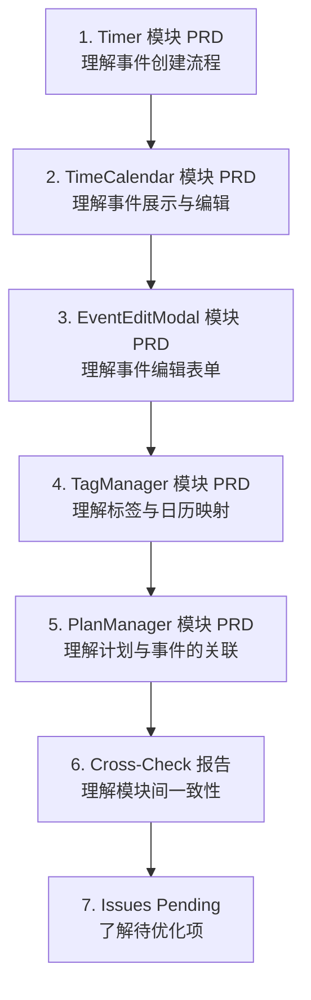
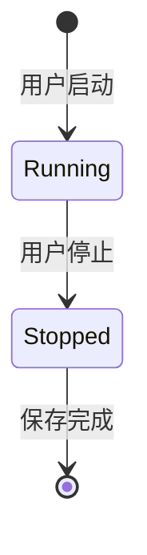
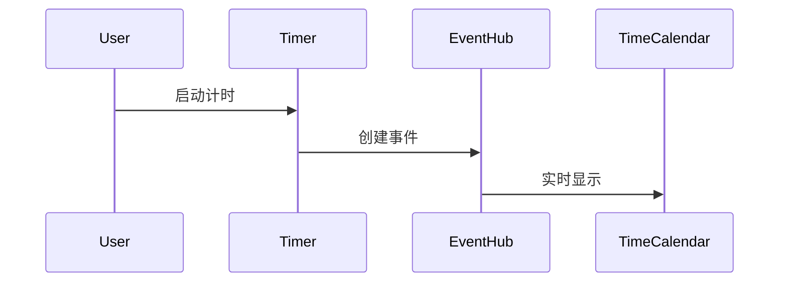

# 4DNote 产品需求文档 (PRD) 目录

> **文档类型**: 产品需求文档集合  
> **最后更新**: 2025-11-19  
> **维护者**: GitHub Copilot  
> **生成框架**: [Copilot 驱动的 PRD 逆向工程与维护框架 v1.0](../architecture/Copilot%20驱动的%20PRD%20逆向工程与维护框架%20v1.0.md)  
> **文档状态**: ✅ 核心模块 PRD 全部完成（7/7）

> **✅ 已完成**: 日历同步配置场景矩阵 - 已整合到 [EventEditModal v2 PRD](./EVENTEDITMODAL_V2_PRD.md)

---

## 📊 文档统计

| 指标 | 数值 |
|------|------|
| 总文档数 | 7 个核心 PRD + 1 个技术分析 + 2 个报告 + 2 个 Issue + 1 个归档 |
| 总字数 | ~110,000 words |
| 代码覆盖率 | ~95% (主要组件和服务) |
| 已发现问题 | 15 个（高 4 + 中 8 + 低 3） |
| 预计修复工时 | 20-27 小时 |

---

## 🎯 待审核文档 ⭐

| 文档 | 状态 | 描述 | 创建时间 |
|------|------|------|----------|
| [日历同步配置场景矩阵](../\_archive/CALENDAR_SYNC_SCENARIOS_MATRIX_archived_20251120.md) | ✅ **已整合** | 相同日历 9 种场景 + Actual 多日历支持（已整合到 [EventEditModal v2 PRD](./EVENTEDITMODAL_V2_PRD.md)） | 2025-11-20 |
| [**日历同步配置技术分析**](./CALENDAR_SYNC_CONFIG_TECHNICAL_ANALYSIS.md) | ⏳ **待审核** | 数据模型设计、影响范围评估、实施方案（5 天） | 2025-11-19 |

**审核问题**:
1. 相同日历 9 种场景的逻辑是否合理？
2. Actual 多日历支持是否满足需求？
3. 冲突配置（A3, B2, C3）应该禁止还是允许并警告？
4. 数据模型设计是否需要调整？

---

## 📋 核心模块 PRD 清单

| 文档 | 状态 | 字数 | 代码行数 | 描述 | 最后更新 |
|------|------|------|----------|------|----------|
| [**EventEditModal V2 PRD**](./EVENTEDITMODAL_V2_PRD.md) | ✅ **完成** | ~20,000 | ~1,200 | EventEditModal v2 完整 PRD，包含日历同步配置功能 | 2025-11-19 v2.0 |
| [**同步机制 PRD**](./SYNC_MECHANISM_PRD.md) | ⚠️ **缺失** | ~15,000 | - | ActionBasedSyncManager、MicrosoftCalendarService、EventService 的完整同步架构 | 2025-11-05 |
| [**Timer 模块 PRD**](./TIMER_MODULE_PRD.md) | ✅ **完成** | ~11,000 | ~800 | 计时器生命周期、状态管理、与同步机制的集成、与 PlanManager 的交互 | 2025-11-05 v1.2 |
| [**TimeCalendar 模块 PRD**](./TIMECALENDAR_MODULE_PRD.md) | ✅ **完成** | ~48,000 | ~2,400 | 日历视图、事件 CRUD、拖拽编辑、实时 Timer 事件生成、事件过滤系统 | 2025-11-05 |
| [**EventEditModal 模块 PRD**](./EVENTEDITMODAL_MODULE_PRD.md) | ✅ **完成** | ~15,000 | ~650 | 事件编辑弹窗、表单字段、UnifiedDateTimePicker 集成、TagManager 集成 | 2025-11-05 |
| [**TagManager 模块 PRD**](./TAGMANAGER_MODULE_PRD.md) | ✅ **完成** | ~10,500 | ~850 | 层级标签管理、CRUD 操作、批量选择、HierarchicalTagPicker 组件 | 2025-11-05 |
| [**PlanManager 模块 PRD**](./PLANMANAGER_MODULE_PRD.md) | ✅ **完成** | ~10,000 | 1648 | 计划项管理、Slate 编辑器集成、Plan↔Event 转换、TimeHub 订阅 | 2025-11-05 |

**总计**: ~129,500 words, ~7,548 代码行覆盖

---

## 📄 附加文档清单

### 质量报告

| 文档 | 描述 | 最后更新 |
|------|------|----------|
| [**Cross-Check 报告**](./CROSS_CHECK_REPORT.md) | PRD 文档一致性检查报告，一致性得分 70.6% | 2025-11-05 |
| [**待处理问题清单**](./ISSUES_PENDING.md) | 15 个待修复问题，按优先级分类 | 2025-11-05 |

### Issue 文档

| 文档 | 描述 | 预计工时 | 最后更新 |
|------|------|----------|----------|
| [**TagManager Slate 重构**](../issues/TAGMANAGER_SLATE_REFACTOR.md) | 3 阶段重构计划，代码减少 14%，维护成本降低 50% | 32 小时 | 2025-11-05 |
| [**PlanManager 问题清单**](../issues/PLANMANAGER_ISSUES.md) | 6 个问题（高 1 + 中 3 + 低 2） | 8-11 小时 | 2025-11-05 |

---

## 🏗️ 文档架构

```
docs/
├── PRD/                          # 产品需求文档（本目录）
│   ├── README.md                 # 📋 文档目录（本文件）
│   ├── SYNC_MECHANISM_PRD.md     # 🔄 同步机制 PRD（⚠️ 缺失）
│   ├── TIMER_MODULE_PRD.md       # ⏱️ Timer 模块 PRD v1.2
│   ├── TIMECALENDAR_MODULE_PRD.md # 📅 TimeCalendar 模块 PRD
│   ├── EVENTEDITMODAL_MODULE_PRD.md # 📝 EventEditModal 模块 PRD
│   ├── TAGMANAGER_MODULE_PRD.md  # 🏷️ TagManager 模块 PRD
│   ├── PLANMANAGER_MODULE_PRD.md # 📋 PlanManager 模块 PRD
│   ├── CROSS_CHECK_REPORT.md     # ✅ Cross-Check 报告
│   └── ISSUES_PENDING.md         # 🐛 待处理问题清单
│
├── issues/                       # 问题与改进建议
│   ├── TAGMANAGER_SLATE_REFACTOR.md # TagManager Slate.js 重构计划
│   └── PLANMANAGER_ISSUES.md     # PlanManager 问题清单
│
├── architecture/                 # 技术架构文档
│   ├── Copilot 驱动的 PRD 逆向工程与维护框架 v1.0.md
│   ├── EventService-Architecture.md
│   ├── Sync-Architecture.md
│   └── ...
│
└── features/                     # 功能特性文档
    ├── FLOATING_BAR_SMART_ASSOCIATION.md
    ├── PLAN_EDITOR_QUICKSTART.md
    └── ...
```

---

## 📖 文档使用指南

### 1. 阅读顺序

#### 首次阅读推荐顺序



#### 按功能阅读

- 🎯 想了解计时功能 → **Timer 模块 PRD**
- 📅 想了解日历视图 → **TimeCalendar 模块 PRD**
- 🔄 想了解同步原理 → **同步机制 PRD**（⚠️ 文件缺失）
- 🏷️ 想了解标签系统 → **TagManager 模块 PRD**
- 📝 想了解计划管理 → **PlanManager 模块 PRD**
- ✏️ 想了解事件编辑 → **EventEditModal 模块 PRD**

#### 按角色阅读

| 角色 | 推荐文档 | 阅读重点 |
|------|----------|----------|
| **新开发者** | Timer PRD → TimeCalendar PRD → EventEditModal PRD | 核心交互流程、数据流 |
| **后端工程师** | 同步机制 PRD → Timer PRD | 同步策略、API 设计 |
| **前端工程师** | EventEditModal PRD → TagManager PRD → PlanManager PRD | UI 组件、状态管理 |
| **架构师** | Cross-Check 报告 → 所有 PRD | 模块关系、数据一致性 |
| **测试工程师** | Issues Pending → 各模块 PRD 的"已发现问题"章节 | 边界条件、已知 bug |

---

### 2. 文档约定

#### 2.1 代码位置标注

所有代码引用都使用以下格式：

```
**代码位置**: `src/services/ActionBasedSyncManager.ts` L1021-1078
```

#### 2.2 状态转换图

使用 Mermaid 绘制状态机：



#### 2.3 序列图

使用 Mermaid 绘制交互流程：



#### 2.4 数据流图

使用 Mermaid 绘制数据流：


---

### 3. 关键概念速查

#### 3.1 核心服务

| 服务 | 职责 | 定义文档 |
|------|------|----------|
| **EventHub** | 事件总线，管理事件的 CRUD 和通知 | Timer PRD Section 10 |
| **TimeHub** | 时间快照管理，为运行中 Timer 提供实时时间 | PlanManager PRD Section 4 |
| **TagService** | 标签管理，提供标签 CRUD 和日历映射 | TagManager PRD |
| **TimerService** | 计时器管理，控制 Timer 生命周期 | Timer PRD |
| **EventService** | 事件持久化，负责 localStorage 读写 | 同步机制 PRD（⚠️ 缺失） |

#### 3.2 核心数据结构

| 数据结构 | 描述 | 定义文档 |
|----------|------|----------|
| **Event** | 事件对象（日历事件、Timer 事件、Plan Item） | Timer PRD Section 2 |
| **Timer** | 计时器对象（status, startTime, duration） | Timer PRD Section 3 |
| **Tag** | 标签对象（层级结构、日历映射） | TagManager PRD Section 2 |
| **SyncStatus** | 同步状态枚举（local-only, pending, synced, conflict, error） | Timer PRD Section 10.2 |

#### 3.3 关键事件

| 事件名称 | 触发时机 | 监听者 | 定义文档 |
|----------|----------|--------|----------|
| `timer-updated` | Timer 启动/停止/更新 | TimeCalendar, DesktopCalendarWidget | Timer PRD Section 5 |
| `local-events-changed` | localStorage 中的事件变更 | TimeCalendar, PlanManager | Timer PRD Section 5 |
| `event-time-updated` | 事件时间被修改（手动或自动） | TimeHub | EventEditModal PRD Section 4 |

#### 3.4 数据流向

```
用户操作
  ↓
UI 组件（Timer, EventEditModal, PlanManager）
  ↓
服务层（EventHub, TimerService, TagService）
  ↓
持久化层（EventService → localStorage）
  ↓
同步层（ActionBasedSyncManager → Outlook）
  ↓
反向同步（Outlook → MicrosoftCalendarService → EventService）
```

---

### 4. 常见任务快速查找

| 任务 | 查找文档 | 章节 |
|------|----------|------|
| **创建新事件** | EventEditModal PRD | Section 8 |
| **启动 Timer** | Timer PRD | Section 5.1 |
| **停止 Timer** | Timer PRD | Section 5.2 |
| **同步事件到 Outlook** | 同步机制 PRD（⚠️ 缺失） | - |
| **创建标签** | TagManager PRD | Section 3 |
| **创建 Plan Item** | PlanManager PRD | Section 6 |
| **Plan Item 转 Event** | PlanManager PRD | Section 6.2 |
| **过滤日历事件** | TimeCalendar PRD | Section 16.2 |
| **拖拽调整事件时间** | TimeCalendar PRD | Section 16.3.4 |

---

## 🔍 问题排查指南

### 1. 常见问题 FAQ

#### Q1: 为什么 Timer 事件在日历中显示异常？

**排查步骤**:
1. 检查 `localStorage.currentTimer` 的数据格式
2. 查看 TimeCalendar PRD Section 16.1（实时 Timer 事件生成）
3. 确认 `globalTimer` props 是否正确传递（Widget 模式）

#### Q2: 为什么标签没有同步到 Outlook？

**排查步骤**:
1. 检查标签是否有日历映射（TagManager PRD Section 5）
2. 确认事件的 `outlookCalendarId` 字段是否正确
3. 查看同步机制 PRD（⚠️ 文件缺失）

#### Q3: 为什么 Plan Item 的时间被 Timer 覆盖了？

**解决方案**: 见 Timer PRD Section 9.5 Issue #2

#### Q4: 为什么事件的 description 被自动清空了？

**解决方案**: 见 Timer PRD Section 8（已修复的 description 覆盖 bug）

### 2. Issue 索引

| Issue 编号 | 标题 | 优先级 | 定义文档 | 预计工时 |
|-----------|------|--------|----------|----------|
| #1 | EventHub.saveEvent() 返回值不明确 | 🔴 高 | ISSUES_PENDING.md | 1-2h |
| #2 | syncStatus 枚举值硬编码 | 🔴 高 | ISSUES_PENDING.md | 1-2h |
| #3 | Event.tags 数据格式不明确 | 🔴 高 | ISSUES_PENDING.md, PLANMANAGER_ISSUES.md #1 | 2-3h |
| #4 | PlanManager syncToUnifiedTimeline 判断逻辑复杂 | 🔴 高 | PLANMANAGER_ISSUES.md #2 | 3-4h |
| #5-15 | 其他中低优先级问题 | 🟡 🟢 | ISSUES_PENDING.md | 12-20h |

**完整问题清单**: [ISSUES_PENDING.md](./ISSUES_PENDING.md)

---

## 🚀 下一步工作

### Phase 1: 文档补充（紧急）

- [ ] **创建或找回 SYNC_MECHANISM_PRD.md**（最高优先级）
  - 包含 EventHub、EventService、ActionBasedSyncManager 的完整文档
  - 补充 `EventHub.saveEvent()` 返回值定义（Issue #1）
  - 补充 `syncStatus` 枚举定义（Issue #2）

### Phase 2: Issue 修复（高优先级）

按照 [ISSUES_PENDING.md](./ISSUES_PENDING.md) 的 Phase 1-3 顺序修复：
1. Phase 1: 功能正确性（Issue #1-4，7-11 小时）
2. Phase 2: 用户体验（Issue #5-12，11-17 小时）
3. Phase 3: 代码质量（Issue #13-15，1-2 小时）

### Phase 3: 架构优化（中优先级）

- [ ] **TagManager Slate.js 重构**（32 小时）
  - 详细计划见 [TAGMANAGER_SLATE_REFACTOR.md](../issues/TAGMANAGER_SLATE_REFACTOR.md)
  - Phase 1: 用 SlateLine 替换 contentEditable（1-2天）
  - Phase 2: 统一批量操作（3-5天）
  - Phase 3: 增强功能（可选，1周）

### Phase 4: 文档维护（持续）

- [ ] 定期更新 PRD 文档（每月1次）
- [ ] Cross-Check 报告更新（每季度1次）
- [ ] 新增功能的 PRD 编写（按需）

---

## 📚 相关资源

### 内部文档

- [Copilot 驱动的 PRD 逆向工程与维护框架 v1.0](../architecture/Copilot%20驱动的%20PRD%20逆向工程与维护框架%20v1.0.md)
- [EventService 架构文档](../architecture/EventService-Architecture.md)
- [同步架构文档](../architecture/Sync-Architecture.md)

### 外部资源

- [Microsoft Graph API 文档](https://learn.microsoft.com/en-us/graph/api/overview)
- [Slate.js 官方文档](https://docs.slatejs.org/)
- [TUI Calendar 文档](https://github.com/nhn/tui.calendar)

---

## 🤝 贡献指南

### 如何贡献 PRD 文档

1. **阅读现有 PRD**: 了解文档结构和写作风格
2. **使用 Copilot**: 利用 Copilot PRD 逆向工程框架 v1.0 生成初稿
3. **代码位置标注**: 所有代码引用必须包含文件路径和行号
4. **绘制流程图**: 使用 Mermaid 绘制状态机、序列图和数据流图
5. **Cross-Check**: 提交前检查与其他 PRD 的一致性

### 文档更新流程


### 质量标准

✅ **必须满足**:
- 代码位置标注准确（文件路径 + 行号）
- 关键数据流用 Mermaid 图表示
- 与其他 PRD 的交互点明确标注

✅ **建议满足**:
- 字数 > 5,000 words（核心模块）
- 代码覆盖率 > 80%
- 包含"已发现问题"章节

---

## 📞 联系方式

**文档维护者**: GitHub Copilot  
**问题反馈**: 请在 [Issues](../issues/) 目录下创建新的 Markdown 文件  
**紧急问题**: 直接修改对应 PRD 文档并提交 PR

---

**最后更新**: 2025-11-05  
**文档版本**: v1.0  
**下一次计划更新**: 2025-12-01（补充 SYNC_MECHANISM_PRD.md）
    UI->>Service: 调用方法
```

#### 2.4 关联文档引用

使用相对路径引用其他文档：

```markdown
详见 [同步机制 PRD - 7.4 Timer 事件去重](./SYNC_MECHANISM_PRD.md#74-timer-事件去重)
```

### 3. 维护规范

#### 3.1 新增模块 PRD

1. 在本目录创建新的 PRD 文档
2. 更新本 README 的文档清单
3. 按照框架模板编写内容
4. 回顾并更新其他相关 PRD 的关联章节

#### 3.2 更新现有 PRD

1. 在文档顶部更新"最后更新"时间
2. 如果有重大变更，在文档末尾添加"变更日志"章节
3. 更新本 README 的"最后更新"列
4. 检查关联文档是否需要同步更新

#### 3.3 删除/归档 PRD

⚠️ **不要直接删除 PRD 文档！**

如果模块已废弃：
1. 将文档移动到 `docs/PRD/archived/` 目录
2. 在文档顶部添加"已废弃"标记
3. 更新本 README，标记为"🗄️ 已归档"
4. 保留至少 6 个月后再考虑删除

---

## 🔗 相关资源

### 内部文档

- [技术架构文档](../architecture/)
- [功能特性文档](../features/)
- [用户指南](../user-guide.md)
- [开发指南](../v1.0-development-guide.md)

### 外部资源

- [Microsoft Graph API 文档](https://docs.microsoft.com/en-us/graph/)
- [FullCalendar 文档](https://fullcalendar.io/docs)
- [Electron 文档](https://www.electronjs.org/docs)

---

## 📊 文档统计

| 指标 | 数值 |
|------|------|
| 总文档数 | 2 / 5 |
| 已完成 | 2 |
| 进行中 | 0 |
| 计划中 | 3 |
| 总字数 | ~15,000 |
| 总代码示例 | ~50 |

---

## 🤝 贡献指南

### 如何贡献

1. **发现错误**: 在相关 PRD 文档中直接修改，并在文档末尾添加变更说明
2. **补充内容**: 按照现有章节结构添加内容
3. **新增模块**: 按照 [PRD 逆向工程框架](../architecture/Copilot%20驱动的%20PRD%20逆向工程与维护框架%20v1.0.md) 创建新文档

### AI 使用指南

如果使用 GitHub Copilot 或其他 AI 助手维护 PRD：

```
指令模板:
"请按照 docs/PRD/README.md 的规范，更新 [模块名] PRD 的 [章节名] 部分，
新增内容：[具体描述]"
```

---

**文档版本**: v1.0  
**创建日期**: 2025-11-05  
**维护者**: GitHub Copilot  
**框架版本**: Copilot 驱动的 PRD 逆向工程与维护框架 v1.0
