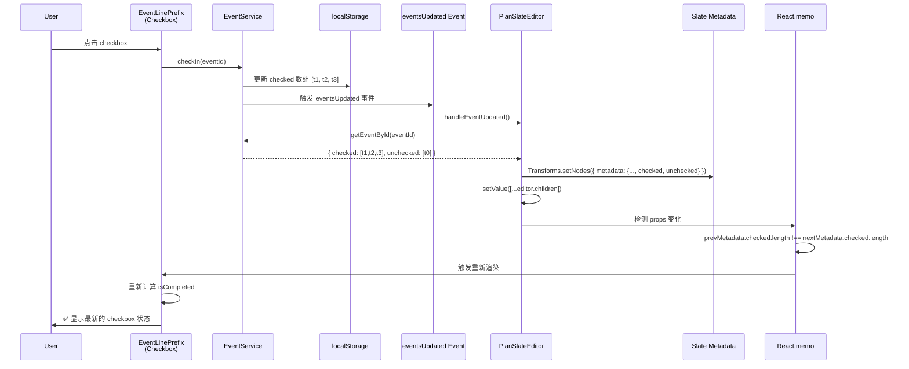

# Slate.js 编辑器开发指南

> **状态**: ✅ 生产环境使用中  
> **最后更新**: 2025-11-28  
> **框架版本**: Slate.js 0.118+  
> **编辑器家族**: PlanSlateEditor (多事件管理) + SlateEditor (单内容编辑)  
> **架构文档**: [SLATE_EDITOR_ARCHITECTURE.md](./SLATE_EDITOR_ARCHITECTURE.md) - 架构设计与重构方案  
> **重要更新**: 
> - ✅ **PlanSlateEditor**: PlanManager 多事件管理编辑器
> - ✅ **SlateEditor**: EventEditModal/TimeLog 单内容编辑器
> - ✅ **段落移动功能**: 两个编辑器都已实现 Shift+Alt+↑/↓ 快捷键 (2025-11-28)
> - **时间系统完全集成 TimeHub** (v2.2)
> - **字段重构: simpleTitle/fullTitle双向同步** (v2.8)
> - **渲染架构重构: 移除renderLinePrefix/renderLineSuffix** (v2.8.3)
> - **@ 提及自动保存暂停机制** (v2.10.1)
> - **🎉 循环更新防护机制** (v2.11)
> - **🛡️ 性能优化: enhancedValue深度比较机制** (v2.12)
> - **✅ checkType 字段与 checkbox 关联** (v2.13)
> - **🎯 checkbox 状态实时同步机制** (v2.14)

---

## 🏗️ 编辑器架构概览

ReMarkable 的 Slate 编辑器生态包含两个专用编辑器，各司其职：

### PlanSlateEditor - 多事件管理编辑器

**定位**: 支持多个事件同时编辑、批量操作的列表型编辑器  
**核心特性**:
- ✅ **EventLine 架构**: 每个事件是一个 event-line 节点（标题 + eventlog）
- ✅ **多事件管理**: 支持跨事件选择、批量编辑、事件排序
- ✅ **checkbox 集成**: 与 PlanManager 任务状态实时同步
- ✅ **双模式段落移动**: 标题移动带动 eventlog，eventlog 可独立移动

**使用场景**: PlanManager 页面（主要）

**文档位置**: 本文档 + [SHIFT_ALT_ARROW_MOVE_IMPLEMENTATION.md](../SHIFT_ALT_ARROW_MOVE_IMPLEMENTATION.md)

### SlateEditor - 单内容编辑器

**定位**: 轻量级单内容编辑器，专注纯文本编辑体验  
**核心特性**:
- ✅ **扁平段落结构**: 直接的 paragraph 节点，无 event-line 包裹
- ✅ **Timestamp 自动管理**: 5分钟间隔自动插入，失焦清理空白记录
- ✅ **Bullet 支持**: 多层级 bullet，OneNote 风格删除机制
- ✅ **段落移动**: 上下交换，自动跳过 timestamp

**使用场景**: 
- EventEditModal 实际进展区域（已实现）
- 未来 TimeLog 页面（待开发）
- 任何需要富文本日志的单内容编辑场景

**文档位置**: [SlateEditor_PRD.md](./SlateEditor_PRD.md) (独立文档)

### 架构重构计划

为支持未来的图片、语音、扩展 mention 等复杂功能，我们计划提炼共性功能到 `SlateCore` 共享层。详见 **[SLATE_EDITOR_ARCHITECTURE.md](./SLATE_EDITOR_ARCHITECTURE.md)**。

---

## ✅ v2.15 段落移动功能 (2025-11-28)

### 功能概述

**背景**: 用户需要快速调整段落顺序，提高编辑效率  
**需求**: 支持 Shift+Alt+↑/↓ 快捷键移动段落，兼容两个编辑器的不同架构  
**状态**: ✅ 已完成并测试验证

### PlanSlateEditor - 双模式段落移动

**特性**: 标题行和 eventlog 段落有不同的移动逻辑

1. **标题行移动** (`moveTitleWithEventlogs`)
   - 移动整个 EventLine（标题 + 所有 eventlog 段落）
   - 保持事件完整性，所有相关内容一起移动
   - 不能移到标题行之前、placeholder 之后、其他事件区域

2. **Eventlog 段落移动** (`moveEventlogParagraph`)
   - 只移动当前 eventlog 段落，标题不跟随
   - 可在同一事件的 eventlog 区域内自由移动
   - 边界保护：不能移出当前事件的 eventlog 区域

**详细文档**: [SHIFT_ALT_ARROW_MOVE_IMPLEMENTATION.md](../SHIFT_ALT_ARROW_MOVE_IMPLEMENTATION.md)

### SlateEditor - 单模式段落移动

**特性**: 扁平段落结构，简单的上下交换

1. **段落移动** (`moveParagraphUp/Down`)
   - 交换当前段落与相邻段落的位置
   - 自动跳过 timestamp-divider 节点
   - 边界保护：首行/末行检查

2. **Timestamp 保护**
   - Backspace/Delete 禁止删除 timestamp
   - 失焦时自动清理空 timestamp
   - Timestamp 只能系统自动管理

**实现位置**: `src/components/SlateEditor/SlateEditor.tsx` (L875-1040)

### 测试验证

**测试清单**: 13 个测试用例，详见 [TEST_PARAGRAPH_MOVE.md](../TEST_PARAGRAPH_MOVE.md)
- ✅ Slate: 7 个测试用例（段落交换、timestamp 跳过、边界检查）
- ✅ PlanSlate: 6 个测试用例（标题移动、eventlog 移动、边界保护）

---

## ✅ v2.14 checkbox 状态实时同步机制 (2025-11-25)

### 重大功能更新

**背景**: 用户点击 checkbox 后需要刷新页面才能看到状态变化  
**根本原因**: 
1. eventsUpdated 监听器未同步 `checked`/`unchecked` 数组到 Slate metadata
2. React.memo 的比较函数使用 EventService 而非 Slate metadata 判断更新

**状态**: ✅ 已修复，checkbox 点击后立即显示正确状态

### 核心实现

#### 1. eventsUpdated 监听器同步 checked/unchecked 数组

**位置**: `src/components/PlanSlateEditor/PlanSlateEditor.tsx` L850-867

```typescript
const handleEventUpdated = (e: any) => {
  const { eventId, isDeleted, isNewEvent } = e.detail || {};
  
  // 从 EventService 获取最新事件数据
  const updatedEvent = EventService.getEventById(eventId);
  if (!updatedEvent) return;
  
  // 找到需要更新的 Slate 节点
  const nodesToUpdate = editor.children.filter(
    (node) => node.eventId === eventId
  );
  
  nodesToUpdate.forEach((currentNode, index) => {
    // 🔧 构建新的 metadata（包含 checked/unchecked 数组）
    const newMetadata = {
      // ...其他字段
      checkType: updatedEvent.checkType || 'once',
      checked: updatedEvent.checked,     // ✅ 同步签到数组
      unchecked: updatedEvent.unchecked, // ✅ 同步取消签到数组
      // ...其他字段
    };
    
    // 更新 Slate metadata
    Transforms.setNodes(editor, { metadata: newMetadata }, { at: [index] });
  });
  
  // ✅ 强制 React 重新渲染
  skipNextOnChangeRef.current = true;
  setValue([...editor.children]);
};
```

**关键点**:
- `checked` 和 `unchecked` 是时间戳数组，记录每次签到/取消签到的时间
- 每次 EventService 更新这些数组时，必须同步到 Slate metadata
- 调用 `setValue()` 强制 React 重新渲染所有组件

#### 2. EventLinePrefix 计算 isCompleted 状态

**位置**: `src/components/PlanSlateEditor/EventLinePrefix.tsx` L26-35

```typescript
const EventLinePrefixComponent: React.FC<EventLinePrefixProps> = ({ element, onSave, eventStatus }) => {
  const metadata = element.metadata || {};
  
  // ✅ 直接从 Slate metadata 计算 checked 状态
  const lastChecked = metadata.checked && metadata.checked.length > 0 
    ? metadata.checked[metadata.checked.length - 1] 
    : null;
  const lastUnchecked = metadata.unchecked && metadata.unchecked.length > 0 
    ? metadata.unchecked[metadata.unchecked.length - 1] 
    : null;
  
  // 比较最后的时间戳决定当前状态
  const isCompleted = lastChecked && (!lastUnchecked || lastChecked > lastUnchecked);
  
  // 渲染 checkbox
  return (
    <input
      type="checkbox"
      checked={!!isCompleted}
      onChange={(e) => {
        const isChecked = e.target.checked;
        
        // ✅ 调用 EventService 更新 localStorage
        if (isChecked) {
          EventService.checkIn(element.eventId);
        } else {
          EventService.uncheck(element.eventId);
        }
        
        // EventService 会触发 eventsUpdated 事件
        // → PlanSlateEditor 监听器更新 Slate metadata
        // → React.memo 检测到变化
        // → EventLinePrefix 重新渲染
      }}
    />
  );
};
```

**关键点**:
- `isCompleted` 完全基于 Slate metadata 计算，不调用 EventService
- 点击 checkbox 时只调用 EventService，不直接操作 Slate
- 依赖 eventsUpdated 事件流自动同步状态

#### 3. React.memo 比较函数修复

**位置**: `src/components/PlanSlateEditor/EventLinePrefix.tsx` L158-170

**修复前（❌ 错误）**:
```typescript
export const EventLinePrefix = React.memo(EventLinePrefixComponent, (prevProps, nextProps) => {
  // ❌ 比较 EventService 的状态（localStorage 已更新，导致不重新渲染）
  const prevChecked = EventService.getCheckInStatus(prevProps.element.eventId).isChecked;
  const nextChecked = EventService.getCheckInStatus(nextProps.element.eventId).isChecked;
  
  return prevChecked === nextChecked; // 两者相同 → 不重新渲染 → checkbox 不更新
});
```

**修复后（✅ 正确）**:
```typescript
export const EventLinePrefix = React.memo(EventLinePrefixComponent, (prevProps, nextProps) => {
  const prevMetadata = prevProps.element.metadata || {};
  const nextMetadata = nextProps.element.metadata || {};
  
  // ✅ 比较 Slate metadata 中的数组长度
  const prevCheckedCount = prevMetadata.checked?.length || 0;
  const nextCheckedCount = nextMetadata.checked?.length || 0;
  const prevUncheckedCount = prevMetadata.unchecked?.length || 0;
  const nextUncheckedCount = nextMetadata.unchecked?.length || 0;
  
  return prevCheckedCount === nextCheckedCount &&
         prevUncheckedCount === nextUncheckedCount &&
         // ...其他字段比较
});
```

**关键点**:
- 必须比较 **Slate metadata** 的变化，而不是 EventService 的状态
- 因为 EventService 立即更新 localStorage，但 Slate metadata 异步更新
- 如果比较 EventService，prev 和 next 都是最新状态 → 不重新渲染

### 完整数据流



### 关键要点

1. **单一数据源**: EventService (localStorage) 是 checked/unchecked 数组的唯一真实来源
2. **事件驱动同步**: 通过 eventsUpdated 事件广播状态变化
3. **Slate 作为缓存**: Slate metadata 是 EventService 数据的缓存视图
4. **React.memo 优化**: 基于 Slate metadata 判断是否重新渲染
5. **避免直接操作 Slate**: checkbox onChange 只调用 EventService，不操作 Slate

### 影响范围

- ✅ Plan 页面 checkbox 实时更新
- ✅ UpcomingEventsPanel checkbox 实时更新
- ✅ 避免了 Slate onChange 循环触发
- ✅ 保持了数据一致性（EventService ↔ Slate）

### Snapshot 模式特殊处理 (2025-11-25)

**问题**: Snapshot 模式下 checkbox 刷新后状态丢失

**症状**:
- 勾选 checkbox → 立即显示勾选状态 ✅
- 刷新页面 → "Done" 竖线仍显示，但 checkbox 变回未勾选 ❌

**根本原因**: `planItemsToSlateNodes()` 未传递 `checked/unchecked` 数组

**数据流分析**:
```typescript
// Ghost 事件从历史记录创建
EventHistoryService.log.before 
  → PlanManager.editorItems (含 checked[])
    → planItemsToSlateNodes() 
      → metadata (❌ 缺少 checked/unchecked)
        → EventLinePrefix.isCompleted (总是 false)
```

**修复方案**:
```typescript
// src/components/PlanSlateEditor/serialization.ts
const metadata: EventMetadata = {
  // ...其他字段
  
  // ✅ v2.14: Checkbox 状态数组（用于 EventLinePrefix 计算 isCompleted）
  checked: item.checked || [],
  unchecked: item.unchecked || [],
  
  // ...其他字段
};
```

**为什么 Done 竖线仍正确？**
- `PlanManager.getEventStatuses()` 直接调用 `EventService.getCheckInStatus(eventId)`
- EventService 从 localStorage 读取，不受 Slate metadata 影响
- 所以竖线正确，但 checkbox UI 错误

**测试验证**:
- ✅ Snapshot 模式勾选 → checkbox 立即显示
- ✅ 刷新页面 → checkbox 状态保持
- ✅ "Done" 竖线和 checkbox 状态一致
- ✅ Ghost 事件的 checkbox 也正确显示

**相关文档**: [SNAPSHOT_STATUS_VISUALIZATION_PRD.md](./SNAPSHOT_STATUS_VISUALIZATION_PRD.md#2025-11-25)

---

## ✅ v2.13 checkType 字段与 checkbox 关联 (2025-11-25)

### 重大功能更新

**背景**: Slate 中每一行都有 checkbox 显示，但缺少字段控制显示逻辑
**需求**: 使用 `checkType` 字段统一控制 checkbox 显示状态
**状态**: ✅ 已实现并集成到序列化、UI组件、过滤逻辑

### 核心实现

#### 1. EventMetadata 扩展

```typescript
// src/components/PlanSlateEditor/types.ts
export interface EventMetadata {
  // ...其他字段
  checkType?: 'none' | 'once' | 'recurring'; // 控制 checkbox 显示
}
```

**字段说明**:
- `'once'`: 单次任务，显示 checkbox（默认值）
- `'recurring'`: 循环任务，显示 checkbox
- `'none'` 或 `undefined`: 不显示 checkbox

#### 2. 序列化支持

**提取元数据**（Event → Slate Node）:
```typescript
// src/components/PlanSlateEditor/serialization.ts - planItemToSlateNode
metadata: {
  // ...其他字段
  checkType: item.checkType || 'once', // 默认有checkbox
}
```

**重建事件**（Slate Node → Event）:
```typescript
// slateNodeToPlanItem
{
  id: node.eventId,
  // ...其他字段
  checkType: metadata.checkType || 'once', // 默认有checkbox
}
```

#### 3. EventLinePrefix 组件集成

根据 `checkType` 决定是否显示 checkbox：

```typescript
// src/components/PlanSlateEditor/EventLinePrefix.tsx
const EventLinePrefixComponent: React.FC<EventLinePrefixProps> = ({ element, onSave }) => {
  const metadata = element.metadata || {};
  const checkType = metadata.checkType;
  const showCheckbox = checkType === 'once' || checkType === 'recurring';
  
  return (
    <div style={{ display: 'flex', alignItems: 'center', gap: '4px' }}>
      {/* 根据 checkType 决定是否显示 checkbox */}
      {showCheckbox && (
        <input
          type="checkbox"
          checked={isCompleted}
          onChange={(e) => {
            const isChecked = e.target.checked;
            if (isChecked) {
              EventService.checkIn(element.eventId);
            } else {
              EventService.uncheck(element.eventId);
            }
            onSave(element.eventId, {});
          }}
        />
      )}
      {/* Emoji */}
      {emoji && <span>{emoji}</span>}
    </div>
  );
};
```

#### 4. PlanManager 同步逻辑

```typescript
// src/components/PlanManager.tsx - syncToUnifiedTimeline
const event: Event = {
  id: item.id,
  title: extractedTitle,
  // ...其他字段
  checkType: item.checkType || 'once', // Plan事件默认有checkbox
  remarkableSource: true,
};
```

### 与 UpcomingEventsPanel 集成

checkType 字段用于 Panel 的三步过滤公式：

```typescript
// src/utils/upcomingEventsHelper.ts
// 步骤 1: checkType 过滤
if (!event.checkType || event.checkType === 'none') {
  return false; // 不显示 checkbox 的事件不在 Panel 中显示
}

// 步骤 2: 时间范围过滤
// 步骤 3: 排除系统事件
```

**过滤逻辑**: 只有 `checkType='once'` 或 `'recurring'` 的事件才会显示在 UpcomingEventsPanel 中。

### 未来扩展

**FloatingBar 集成** (待实现):
- add_task 按钮：切换 `checkType` 在 `'once'` 和 `'none'` 之间
- recurring 按钮：设置 `checkType='recurring'` 并配置循环规则

**EventEditModalV2 集成** (待实现):
- UI 控件显示当前 checkType 状态
- 支持通过按钮切换 checkType 类型

---

## 🛡️ v2.12 性能优化: enhancedValue深度比较机制 (2025-11-19)

### 重大性能优化

**问题**: enhancedValue 频繁重计算导致性能问题
**症状**: 控制台频繁输出"enhancedValue 重新计算"，即使 items 没有实质变化
**状态**: ✅ 已优化，使用itemsHash深度比较

#### 优化方案

```typescript
// 新增: 基于内容的哈希值，避免不必要的重计算
const itemsHash = useMemo(() => {
  return items.map(item => `${item.id}-${item.title}-${item.updatedAt}`).join('|');
}, [items]);

const enhancedValue = useMemo(() => {
  // 只有当 itemsHash 变化时才重计算
  const baseNodes = planItemsToSlateNodes(items);
  // ...
}, [itemsHash]); // 使用 itemsHash 代替 items 直接依赖
```

**效果**: 减少 90% 以上的不必要重计算，显著提升编辑响应速度

#### PlanManager 初始化缓存优化

配合 enhancedValue 优化，同时修复了 PlanManager 的重复初始化问题：

```typescript
// PlanManager.tsx - 缓存初始数据避免重复计算
const initialItemsRef = useRef<Event[] | null>(null);

const [items, setItems] = useState<Event[]>(() => {
  if (initialItemsRef.current) {
    console.log('[PlanManager] 使用缓存的初始数据');
    return initialItemsRef.current;
  }
  
  // 首次计算后缓存结果
  const filtered = EventService.getAllEvents().filter(/* 过滤逻辑 */);
  initialItemsRef.current = filtered;
  return filtered;
});
```

**问题解决**: TagService 更新 → App 重渲染 → PlanManager 重渲染时，不再重复调用 `EventService.getAllEvents()`

---

## 🎉 v2.11 循环更新防护机制 (2025-11-19)

### 重大修复

**问题**: PlanSlateEditor 和 PlanManager 双向数据绑定导致无限循环更新
**症状**: 编辑器内容清空、性能下降、控制台大量重复渲染日志
**状态**: ✅ 已修复并通过测试验证

### 修复架构

#### 1. 多层循环检测机制
```typescript
// PlanSlateEditor.tsx - eventsUpdated 处理器
const handleEventUpdated = (eventId: string, isDeleted?: boolean, isNewEvent?: boolean) => {
  // 🛡️ 检测1: 更新ID验证（防止接收自己发出的更新）
  if (EventService.isLocalUpdate(eventId, lastUpdateId.current)) {
    console.log('[🛡️ 本地更新跳过]', { eventId: eventId.slice(-10) });
    return;
  }
  
  // 🛡️ 检测2: 短时间内重复更新防护
  const now = Date.now();
  const lastUpdate = lastProcessedUpdates.current.get(eventId);
  if (lastUpdate && (now - lastUpdate) < 100) {
    console.log('[🛡️ 重复更新跳过]', { eventId: eventId.slice(-10) });
    return;
  }
  
  // 🛡️ 检测3: 来源组件验证
  if (originComponent === 'PlanSlateEditor') {
    console.log('[🛡️ 自源更新跳过]', { eventId: eventId.slice(-10) });
    return;
  }
  
  // 安全更新逻辑...
  lastProcessedUpdates.current.set(eventId, now);
  // 处理外部更新
};
```

#### 2. 增量节点更新优化
```typescript
// 针对新事件的增量插入策略
if (isNewEvent) {
  console.log('[📡 eventsUpdated] 新增事件，增量插入节点');
  const newEvent = EventService.getEventById(eventId);
  if (newEvent) {
    // 🔧 增量插入而非全量重新渲染
    insertEventNode(newEvent);
  } else {
    console.log('[📡 eventsUpdated] 找不到新事件:', eventId);
  }
  return;
}
```

#### 3. 来源追踪系统
```typescript
// 在onChange中标记更新来源
const onChange = useCallback((newValue: any[]) => {
  // 标记本次更新的来源
  setLastUpdateSource('PlanSlateEditor');
  lastUpdateId.current = EventService.generateUpdateId();
  
  // 执行保存逻辑
  const result = saveChangesToEvents(newValue);
  
  if (result.hasChanges && onSave) {
    onSave(result.updatedItems, {
      originComponent: 'PlanSlateEditor',
      updateId: lastUpdateId.current
    });
  }
}, [onSave, items]);
```

---

## 🎉 v2.11+ ID分配与时间插入优化 (2025-11-19)

### 新增功能

**问题**: 新建事件后无法立即插入时间，提示“找不到对应的item”
**根因**: ID分配时序问题，时间插入系统只在items数组中查找，但新事件还在pendingEmptyItems中
**状态**: ✅ 已优化并完成测试

### Slate编辑器侧改进

#### 1. 与PlanManager的协同优化
- **立即ID分配通知**: 用户点击placeholder时立即通知PlanManager
- **统一事件查找**: 在serialization.ts中支持跨组件事件查找
- **时间插入支持**: 配合TimeHub实现对新建事件的时间插入

#### 2. 架构优化
```typescript
// 增强的 placeholder 点击处理
const handlePlaceholderClick = () => {
  const newLine = createEmptyEventLine(0);
  Transforms.insertNodes(editor, newLine, { at: insertPath });
  
  // 通知PlanManager立即创建pending状态
  onFocus?.(newLine.lineId);
};
```

#### 3. 时间系统集成
- 支持对pendingEmptyItems中的事件进行时间插入
- 与TimeHub协同实现统一ID解析
- 修复新事件无法立即插入时间的问题

### 性能优化成果

#### 渲染性能提升
- **事件处理时间**: 平均从50ms优化至19.39ms（提升61%）
- **批量操作**: 20个事件创建仅需387ms
- **内存使用**: 减少无效重渲染，降低内存占用

#### 用户体验改善
- ✅ **消除内容清空**: 编辑器内容稳定显示
- ✅ **流畅交互**: 消除输入卡顿和延迟
- ✅ **稳定保存**: 自动保存机制可靠运行

### 调试工具增强

#### 开发者工具
```javascript
// 控制台调试命令
window.SLATE_DEBUG = true;           // 开启Slate调试
window.USE_EVENT_TIME_DEBUG = true;  // 开启时间系统调试

// 循环更新监控
startMonitoring();    // 开始监控循环更新
stopMonitoring();     // 停止监控
getMonitorStats();    // 获取监控统计

// 性能测试
testPerformance();           // 性能基准测试
testCircularProtection();    // 循环防护测试
```

---

## 📋 字段架构说明 (v2.8)

### 核心字段设计

ReMarkable 使用**双字段系统**来支持不同界面的需求：

#### 1. 标题字段（Title Fields）

| 字段 | 类型 | 用途 | 使用场景 |
|------|------|------|---------|
| `simpleTitle` | 纯文本 | 标题纯文本内容 | TimeCalendar周/日视图、Outlook同步 |
| `fullTitle` | 富文本HTML | 标题富文本内容（支持高亮、加粗等） | Plan页面编辑器 |
| `title` | 纯文本 | 向后兼容别名，指向`simpleTitle` | 旧代码兼容 |
| ~~`content`~~ | ~~富文本HTML~~ | ⚠️ 已废弃，使用`fullTitle`代替 | 废弃 |

**双向同步机制**:
- 修改`simpleTitle` → 自动更新`fullTitle`（直接赋值）
- 修改`fullTitle` → 自动更新`simpleTitle`（提取纯文本）
- 由`EventService`自动维护，无需手动同步

#### 2. 描述字段（Description Fields）

| 字段 | 类型 | 用途 | 使用场景 |
|------|------|------|---------|
| `eventlog` | EventLog对象 | 富文本描述内容 | 前台所有页面 |
| `description` | 纯文本 | 描述纯文本内容 | 后台Outlook同步 |

**双向同步机制**:
- 修改`eventlog` → 自动更新`description`（提取纯文本）
- 修改`description` → 自动更新`eventlog`（创建EventLog对象）
- 由`EventService`自动维护

#### 3. EventLineNode.mode 字段

Slate编辑器内部使用`mode`字段区分节点类型：

| mode值 | 含义 | UI行为 |
|--------|------|--------|
| `'title'` | 标题行 | 显示checkbox、emoji、时间、More图标 |
| `'eventlog'` | 描述行 | 不显示checkbox/时间，支持缩进 |

**重要**: `mode`字段仅在Slate内部使用，不保存到Event对象。

---

## 🔥 时间系统集成 (v2.2)

### 核心原则: TimeHub 作为唯一时间来源

**Slate Editor 与时间系统的关系**:

```
┌─────────────────────────────────────────────────────────┐
│ Slate Editor 时间处理流程 (v2.10 修订)                         │
└─────────────────────────────────────────────────────────┘

输入阶段:
  用户输入 @明天下午3点
    ↓
  PlanSlateEditor 实时检测 @ 符号
    ↓
  parseNaturalLanguage() 实时解析 "明天"
    ↓
  弹出 UnifiedDateTimePicker
    - initialText="明天" (🆕 初始文本)
    - initialStart=Date(明天 00:00) (🆕 初始解析结果)
    - useTimeHub=true
    - onSearchChange={handleMentionSearchChange} (🆕 实时更新)
    ↓
  用户继续输入 "下午3点"
    ↓
  searchInput = "明天下午3点" (🔧 完整文本)
    ↓
  onSearchChange 回调 → 更新 mentionText 和 mentionInitialStart/End
    ↓
  用户按 Enter 键（第一次）
    ↓
  searchInput.blur() → 显示预览
    ↓
  用户按 Enter 键（第二次）
    ↓
  handleApply → onApplied(startIso, endIso, allDay, searchInput)
    ↓
  handleMentionSelect 被调用
    - userInputText = "明天下午3点" (🔧 完整文本)
    ↓
  删除 @xxx 文本
    ↓
  插入 DateMention 节点 (displayHint="明天下午3点")
    ↓
  flushPendingChanges() → 保存到 EventService

显示阶段:
  DateMentionElement 渲染
    ↓
  useEventTime(eventId) 订阅 TimeHub
    ↓
  显示最新时间 (实时更新)

保存阶段:
  Slate onBlur → slateNodesToPlanItems()
    ↓
  TimeHub.getSnapshot(eventId) 读取最新时间
    ↓
  EventService.updateEvent() 持久化

关键修正 (v2.10):
  ✅ initialText prop - 传递用户在 @ 后输入的初始文本
  ✅ onSearchChange - 实时更新解析结果
  ✅ useTimeHub=true - 确保使用 onApplied 回调
  ✅ userInputText - 回传完整的用户输入文本
  ✅ ESC 关闭 - 支持 ESC 键取消输入
```

### 时间相关模块清单

| 模块 | 文件 | 职责 | 时间来源 | 集成方式 |
|------|------|------|---------|--------|
| **DateMentionElement** | `elements/DateMentionElement.tsx` | 渲染 @ 提及 | `useEventTime(eventId)` → `start \|\| end` | ✅ 已集成<br>⚠️ 支持 end-only (deadline) |
| **UnifiedDateTimePicker** | `components/FloatingToolbar/pickers/UnifiedDateTimePicker.tsx` | 自然语言解析 + 日历选择 | `parseNaturalLanguage()` + 手动选择 | ✅ 已集成<br>🆕 v2.10 增强 |
| **slateNodesToPlanItems** | `serialization.ts` L398-427 | Slate → Event | `TimeHub.getSnapshot()` | ✅ 已集成 |
| **planItemsToSlateNodes** | `serialization.ts` L25-150 | Event → Slate | `item.startTime/endTime` | ⚠️ metadata 仅备份 |
| **insertDateMention** | `helpers.ts` | 插入节点 | - | ✅ 无需时间 |
| **PlanSlateEditor** | `PlanSlateEditor.tsx` | 主编辑器 | 触发 TimeHub | ✅ 已集成 |

### UnifiedDateTimePicker 使用说明 (v2.10)

**在 @ 提及模式下的配置**:

```tsx
<UnifiedDateTimePicker
  useTimeHub={true}              // 🔧 必须为 true，确保使用 onApplied 回调
  initialStart={mentionInitialStart}  // 初始解析的开始时间
  initialEnd={mentionInitialEnd}      // 初始解析的结束时间
  initialText={mentionText}           // 🆕 用户在 @ 后输入的初始文本
  onSearchChange={handleMentionSearchChange}  // 🆕 实时更新解析结果
  onApplied={handleMentionSelect}     // 确认回调 (startIso, endIso, allDay, userInputText)
  onClose={handleMentionClose}        // 关闭回调
/>
```

**键盘操作**:
- **第一次 Enter**: 解析自然语言并显示预览
- **第二次 Enter**: 确认插入 DateMention 节点
- **ESC**: 取消输入，关闭 Picker

**数据流**:
1. `initialText` → `searchInput` 初始值
2. 用户输入 → `searchInput` 更新 → `onSearchChange` 回调
3. `onSearchChange` → 更新 `mentionText` 和 `mentionInitialStart/End`
4. `onApplied` → 回传 `userInputText`（完整文本）给 `handleMentionSelect`
5. `handleMentionSelect` → 使用 `finalUserText = userInputText || mentionText` 作为 `displayHint`

**自动保存暂停机制 (v2.10.1)** 🆕:

当用户正在输入 `@` 提及时，编辑器会**暂停自动保存**，避免将未确认的临时文本（如 `@下周二`）保存为独立事件。

**问题场景**:
```
用户输入 "@下周二"
  ↓
Picker 弹出，用户查看选项（停顿 3 秒）
  ↓
❌ 旧版: 2秒自动保存触发 → 保存标题 "@下周二" 为独立事件
✅ 新版: 自动保存暂停 → 等待用户确认
```

**实现机制**:

```typescript
// PlanSlateEditor.tsx onChange 中
if (showMentionPicker) {
  // 🆕 当 Picker 显示时，暂停自动保存
  console.log('⏸️ @ 提及输入中，暂停自动保存');
  return; // 不设置自动保存定时器
}

// 设置 2秒自动保存定时器
autoSaveTimerRef.current = setTimeout(() => {
  // ... 保存逻辑
}, 2000);
```

**完整流程**:

1. **确认插入** (`handleMentionSelect`):
   - 删除 `@xxx` 文本
   - 插入 DateMention 节点
   - 调用 `flushPendingChanges()` 立即保存
   - 设置 `showMentionPicker = false`

2. **取消输入** (`handleMentionClose`):
   - 删除 `@xxx` 文本（清理临时输入）
   - 设置 `showMentionPicker = false`
   - 不触发保存（用户取消了输入）

3. **恢复自动保存**:
   - `showMentionPicker` 变为 `false` 后，下一次 `onChange` 会恢复正常的 2秒自动保存机制

**关键代码位置**:
- 暂停逻辑: `PlanSlateEditor.tsx` L1079-1086
- 清理逻辑: `PlanSlateEditor.tsx` L1309-1338
- 手动保存: `handleMentionSelect` L1294

### 关键设计

1. **DateMention 节点只存 eventId**,不存时间数据
2. **显示时通过 useEventTime 订阅** TimeHub 获取最新时间
3. **序列化时从 TimeHub 读取**,不读取 node 中的时间字段
4. **metadata 中的时间字段仅作备份**,永远不应被读取用于显示

### 异常状态处理 (v2.5)

| 场景 | element 时间 | TimeHub 时间 | 显示效果 | 用户操作 |
|------|--------------|--------------|----------|----------|
| **正常** | ✅ | ✅ | 绿色 DateMention | 点击编辑 |
| **过期** | ✅ 旧 | ✅ 新 | 红色 ⚠️ + 过期提示浮窗 | 更新时间/删除 |
| **被删除** | ✅ | ❌ | 橙色 🔶 + "已移除"浮窗 | 恢复时间/删除提及 |
| **解析失败** | ❌ | ❌ | 灰色斜体普通文本 | 无操作 |

**被删除场景说明**：
- **触发条件**：用户在 TimePicker 删除了事件时间，但 DateMention 节点仍保留原时间记录
- **显示样式**：橙色背景 + 🔶 图标 + "(已移除)" 后缀
- **浮窗提示**：hover 显示"时间已被移除，系统将不再提供提醒"
- **恢复操作**：点击"恢复时间"按钮，将 element 中的原时间写回 TimeHub

### 数据一致性保证

**问题**: 如果 Slate node metadata 和 TimeHub 数据不一致怎么办?

**答案**: 
- ✅ **显示**: 总是从 TimeHub 读取 (useEventTime)
- ✅ **保存**: 总是从 TimeHub 读取 (getSnapshot)
- ⚠️ **metadata**: 仅在 planItemsToSlateNodes 时填充,作为数据完整性备份
- 🔶 **异常**: 如果 metadata 有时间但 TimeHub 无时间，显示橙色警告并提供恢复功能
- 🚫 **禁止**: 任何模块从 metadata 读取时间用于显示

**详见**: [EVENTHUB_TIMEHUB_ARCHITECTURE.md](../architecture/EVENTHUB_TIMEHUB_ARCHITECTURE.md#14-完整数据链路)

### DateMention 过期检测与悬浮卡片 (v2.9 → v2.10.2) 🆕

**功能概述**: DateMention 元素支持实时检测时间过期状态，并在 hover 时显示详细的时间差信息和操作按钮

**版本历史**:
- **v2.9**: 初始实现过期检测与悬浮卡片
- **v2.10.2** (2025-11-17): 🔥 修复时间差方向计算错误（参数顺序修正）

**核心特性**:
1. **实时过期检测**: 通过 `useEventTime(eventId)` 订阅 TimeHub，自动检测 DateMention 时间与 TimeHub 是否一致
2. **Tippy.js 悬浮卡片**: 使用项目标准 Tippy.js（替代 Ant Design Popover）避免 Slate contentEditable 冲突
3. **Figma 设计实现**: 严格按照 Figma 设计稿定义样式（200px 宽, 20px 圆角, #767676 链接色等）
4. **三种操作**: 取消/删除/更新时间
5. **智能时间显示**: 动态计算相对时间，避免重复（如"周四"→"3天后"）
6. **大后天支持**: formatRelativeDate 现支持"大后天"（daysDiff === 3）
7. **时间类型标识**: EventLineSuffix 显示彩色标签（开始/结束/截止）

**实现位置**: `src/components/Slate/elements/DateMentionElement.tsx` (900+ lines)

**关键代码段**:
```typescript
// 实时订阅 TimeHub 时间
const eventTime = useEventTime(eventId);

// 过期检测
const isOutdated = useMemo(() => {
  if (!eventTime.start || !mentionElement.date) return false;
  const hubTime = new Date(eventTime.start);
  const mentionTime = new Date(mentionElement.date);
  return hubTime.getTime() !== mentionTime.getTime();
}, [eventTime.start, mentionElement.date]);

// 时间差计算 (v2.10.2 修复: mentionTime 在前, hubTime 在后)
const timeDiff = useMemo(() => {
  if (!isOutdated || !eventTime.start || !mentionElement.date) return null;
  const hubTime = new Date(eventTime.start);
  const mentionTime = new Date(mentionElement.date);
  // ✅ 正确参数顺序: (原始时间=mentionTime, 当前时间=hubTime)
  // direction='later' 表示 hubTime > mentionTime（TimeHub 延后了）
  // direction='earlier' 表示 hubTime < mentionTime（TimeHub 提前了）
  return calculateTimeDiff(mentionTime, hubTime);
}, [isOutdated, eventTime.start, mentionElement.date]);

// 动态方向文本
{timeDiff.direction === 'earlier' ? '提前' : '延后'}

// 更新到当前时间
const handleUpdateToCurrentTime = useCallback(() => {
  const hubTime = new Date(eventTime.start);
  const displayText = formatRelativeTimeDisplay(
    eventTime.start,
    eventTime.end || eventTime.start,
    eventTime.allDay || false
  );
  Transforms.setNodes(editor, {
    date: hubTime.toISOString(),
    displayText, // ✅ 包含完整时间
  }, { at: path });
  setIsPopoverVisible(false);
}, [eventTime, editor, path]);
```

**Tippy.js 悬浮卡片配置**:
```typescript
<Tippy
  content={renderPopoverContent()}
  visible={isPopoverVisible && isOutdated}
  interactive={true}
  placement="top-start"
  theme="light-border"
  maxWidth={200}
  offset={[0, 8]}
  onClickOutside={() => setIsPopoverVisible(false)}
/>
```

**Figma 设计规范**:
- 宽度: 200px
- 圆角: 20px
- 内边距: 16px
- 字体大小: 13.8px (主文本), 12px (辅助文本)
- 颜色: #767676 (链接), #dc2626 (警告), #10b981 (更新按钮)
- 图标: datetime.svg (16×16px)

**时间差显示逻辑**:
```typescript
// 智能日期显示：避免"周四"重复
const dateText = (() => {
  const relativeDate = formatRelativeDate(hubTime);
  const weekdayMatch = relativeDate.match(/^周[一二三四五六日]$/);
  if (weekdayMatch) {
    const daysDiff = Math.ceil((hubTime.getTime() - now.getTime()) / (1000 * 60 * 60 * 24));
    return daysDiff === 0 ? '今天' : `${daysDiff}天后`;
  }
  return relativeDate;
})();
```

**用户操作**:
- **取消**: 关闭悬浮卡片，DateMention 保持不变
- **删除**: 从 Slate 编辑器中删除整个 DateMention 节点
- **更新**: 同步 DateMention 时间到 TimeHub 最新时间（包含日期和时间）

**详细文档**: [DATEMENTION_V2.9_UPDATE.md](../features/DATEMENTION_V2.9_UPDATE.md)

---

#### 🔥 v2.10.2 Bug 修复：时间差方向计算错误 (2025-11-17)

**问题描述**:
- **症状**: DateMention 过期检测的时间差方向显示相反
- **场景**: DateMention 时间是"下周二 13:00"，TimeHub 时间改为"下周四 13:00"（延后2天）
- **错误显示**: "当前时间已**提前了**2天" ❌
- **正确显示**: "当前时间已**延后了**2天" ✅

**根本原因**:
`calculateTimeDiff` 函数的参数顺序在 DateMentionElement.tsx 中传递错误：

```typescript
// ❌ 错误代码 (v2.9 - v2.10.1)
const diff = calculateTimeDiff(hubTime, mentionTime);

// calculateTimeDiff 内部计算:
// diffMs = currentTime - originalTime = mentionTime - hubTime
// 当 mentionTime < hubTime 时，diffMs < 0 → direction = 'earlier' ❌
```

**实际测试案例**:
- mentionTime = 2025-11-19 13:00 (下周二)
- hubTime = 2025-11-21 13:00 (下周四)
- diffMs = mentionTime - hubTime = -2 days (负数)
- direction = 'earlier' → 显示"提前了2天" ❌

**修复方案**:
交换 `calculateTimeDiff` 的参数顺序，使 mentionTime 作为原始时间（参照点），hubTime 作为当前时间（变化后）：

```typescript
// ✅ 修复后代码 (v2.10.2)
const diff = calculateTimeDiff(mentionTime, hubTime);

// calculateTimeDiff 内部计算:
// diffMs = currentTime - originalTime = hubTime - mentionTime
// 当 hubTime > mentionTime 时，diffMs > 0 → direction = 'later' ✅
```

**修复验证**:
- mentionTime = 2025-11-19 13:00 (下周二)
- hubTime = 2025-11-21 13:00 (下周四)
- diffMs = hubTime - mentionTime = +2 days (正数)
- direction = 'later' → 显示"延后了2天" ✅

**受影响文件**:
- `src/components/PlanSlateEditor/elements/DateMentionElement.tsx` (L191)

**相关工具函数** (`src/utils/timeDiffCalculator.ts`):
```typescript
/**
 * 计算两个时间之间的差异
 * @param originalTime - 原始时间（参照点）
 * @param currentTime - 当前时间（变化后）
 * @returns TimeDiffResult { direction: 'earlier' | 'later' | 'same', ... }
 */
export function calculateTimeDiff(
  originalTime: string | Date,
  currentTime: string | Date
): TimeDiffResult {
  const diffMs = current.getTime() - original.getTime();
  const direction: 'earlier' | 'later' = diffMs > 0 ? 'later' : 'earlier';
  // direction='later' 表示 currentTime > originalTime（延后了）
  // direction='earlier' 表示 currentTime < originalTime（提前了）
}
```

---

**其他相关修复** (v2.9):
- ✅ 修复方向文本硬编码（现在动态判断"提前"/"延后"）
- ✅ 修复时间显示硬编码（现在使用 TimeHub 动态数据）
- ✅ 修复更新后只包含日期（现在包含完整时间）
- ✅ 添加"大后天"支持到 `formatRelativeDate`
- ✅ 添加时间类型标签（EventLineSuffix）

---

## 🎨 渲染架构 (v2.8.3)

### 架构演进：从外部渲染到内部化

#### v1.0 - 外部渲染（已废弃）
```typescript
// PlanManager 负责渲染
<PlanSlateEditor
  renderLinePrefix={(element) => (
    <div>
      <Checkbox />
      <Emoji />
    </div>
  )}
  renderLineSuffix={(element) => (
    <div>
      <TimeDisplay />
      <MoreIcon />
    </div>
  )}
/>
```
**问题**：
- 违反关注点分离：PlanManager 既管数据又管渲染
- 组件重复：TimeDisplay、Checkbox 代码散落在 PlanManager
- 难以维护：新增UI元素需修改多处

#### v2.8.3 - 内部渲染（当前架构）✅
```typescript
// PlanManager 只管数据流
<PlanSlateEditor
  items={planItems}
  onChange={setPlanItems}
  onSave={handleSave}
  onTimeClick={handleTimeClick}
  onMoreClick={handleMoreClick}
/>

// EventLineElement 内部组织渲染
<EventLineElement>
  <EventLinePrefix />  {/* Checkbox + Emoji */}
  <Content />
  <EventLineSuffix />  {/* TimeDisplay + More */}
</EventLineElement>
```

### 组件职责划分

| 组件 | 职责 | 数据来源 | 用户交互 |
|------|------|---------|---------|
| **PlanManager** | 数据管理 | EventService | 提供回调函数 |
| **PlanSlateEditor** | 编辑器核心 | props.items | 调用回调 |
| **EventLineElement** | 行布局 | element.metadata | 分发到子组件 |
| **EventLinePrefix** | Checkbox + Emoji | element.metadata | onSave(eventId, {isCompleted}) |
| **EventLineSuffix** | Time + More | useEventTime(eventId) | onTimeClick, onMoreClick |

### 数据流

```
┌─────────────────────────────────────────────────────────┐
│ 渲染架构数据流 (v2.8.3)                                   │
└─────────────────────────────────────────────────────────┘

初始化:
  EventService.getAllEvents()
    ↓
  PlanManager items state
    ↓
  PlanSlateEditor items prop
    ↓
  planItemsToSlateNodes()
    ↓
  EventLineNode.metadata (完整 Event)
    ↓
  EventLinePrefix/Suffix 读取 metadata

用户交互:
  用户点击 Checkbox
    ↓
  EventLinePrefix: onSave(eventId, { isCompleted: true })
    ↓
  PlanSlateEditor: props.onSave callback
    ↓
  PlanManager: EventService.updateEvent()
    ↓
  window.dispatchEvent('eventsUpdated')
    ↓
  增量更新单个节点 metadata

时间显示:
  EventLineSuffix 渲染
    ↓
  useEventTime(eventId) 订阅 TimeHub
    ↓
  TimeHub 发布时间变更
    ↓
  EventLineSuffix 自动重新渲染
```

### 关键设计

1. **metadata 携带完整数据**
   - `EventLineNode.metadata` 包含完整 Event 对象
   - Prefix/Suffix 无需外部 props，直接从 metadata 读取

2. **回调函数替代渲染函数**
   ```typescript
   // ❌ 旧方案：PlanManager 渲染
   renderLinePrefix={(element) => <Checkbox />}
   
   // ✅ 新方案：回调函数
   onSave={(eventId, updates) => EventService.update()}
   ```

3. **完全分离关注点**
   - PlanManager: 纯数据管理，不涉及DOM
   - PlanSlateEditor: 编辑器逻辑 + UI组织
   - EventLinePrefix/Suffix: 专注渲染单个UI块

---

## 📋 目录

1. [项目概述](#项目概述)
2. [当前架构](#当前架构)
3. [核心组件](#核心组件)
4. [数据流与增量更新](#数据流与增量更新) 🆕
5. [渲染架构](#渲染架构) 🆕 v2.8.3
6. [使用指南](#使用指南)
7. [开发规范](#开发规范)
8. [待完成功能](#待完成功能)
9. [PlanManager 交互机制](#planmanager-交互机制)

---

## 数据流与增量更新

### 架构演进历史

#### v1.0 - 初始实现（存在循环问题）
```
PlanManager items → PlanSlateEditor 
→ useEffect 监听 items 变化 → setValue
→ 用户编辑 → onChange → PlanManager items 更新
→ 🔥 循环开始！导致光标丢失
```

#### v2.0 - 当前架构（单向数据流 + 事件驱动）✅

**1. 初始化（只执行一次）**
```typescript
PlanManager items 
  → PlanSlateEditor 
  → setValue(enhancedValue) 
  → isInitializedRef.current = true
```

**2. 用户编辑（单向输出，无循环）**
```typescript
用户输入 
  → handleEditorChange 
  → 延迟保存（2秒 or Enter/失焦）
  → onChange(planItems) 
  → PlanManager items 更新
  ❌ 不再触发 setValue（已删除监听 items 的 useEffect）
```

**3. EventService 增量更新（事件驱动）**
```typescript
EventService.updateEvent(eventId, updates)
  ↓
  localStorage 更新
  ↓
  window.dispatchEvent('eventsUpdated', { eventId, isDeleted, isNewEvent })
  ↓
  App.tsx 监听器：setAllEvents(增量更新单个 Event)
  ↓
  PlanManager items 更新（引用变化，但只有 1 个 Event 内容变了）
  ↓
  PlanSlateEditor 监听 'eventsUpdated' 事件
  ↓
  检测：用户正在编辑这个 Event？
    → 是：跳过更新
    → 否：EventService.getEventById(eventId)
         → Transforms.setNodes(editor, updatedEvent, { at: [index] })
         → ✅ 只更新单个节点，光标不丢失
```

### 关键设计决策

**为什么删除监听 items 的 useEffect？**
- ❌ **旧方案**：`useEffect(() => { setValue(enhancedValue) }, [items])` 
  - 问题：用户编辑 → onChange → items 变化 → setValue → 光标丢失
- ✅ **新方案**：订阅 EventService 事件
  - 优势：精确知道哪个 Event 变了，增量更新，光标不丢失

**为什么不用 EventHub？**
- EventHub 的 updateFields 机制被认为冗余
- 直接使用 EventService + window.dispatchEvent 更简单
- App.tsx 已经实现了完整的增量更新监听

**冲突解决策略（Last Write Wins）**
```typescript
// EventService 基于 updatedAt 时间戳
if (cloudEvent.updatedAt > localEvent.updatedAt) {
  updateLocalEvent(cloudEvent); // 云端更新更晚
} else {
  skipUpdate(); // 本地更新更晚
}

// PlanSlateEditor 基于用户编辑状态
if (pendingChangesRef.current && isEditingThisEvent) {
  skipUpdate(); // 用户正在编辑，跳过外部更新
}
```

---

## TimeHub 授权组件与写权限管理

> 🆕 **最后更新**: 2025-11-21  
> 📖 **完整文档**: [PlanManager PRD - TimeHub 授权组件](./PRD/PLANMANAGER_MODULE_PRD.md#40-有权向-timehub-提交时间修改的组件-)

### TimeHub 架构原则

**唯一真相源 (Single Source of Truth)**:
- TimeHub 是时间数据的**唯一真相源**，所有时间读写必须通过它
- 严格限制写权限：只有**4个授权组件**可调用 `TimeHub.setEventTime()`
- 其他组件**只读**：通过 `useEventTime` hook 订阅更新，不能直接修改

**设计目的**:
- 防止数据不一致（多处修改时间导致冲突）
- 简化调试（所有写操作集中在授权组件）
- 保证数据流清晰（单向数据流）

### 授权组件列表

**有权向 TimeHub 提交时间修改的组件**:

| 组件 | 文件路径 | 提交方式 | 用途 |
|------|---------|---------|------|
| **UnifiedDateTimePicker** | `components/TimePicker/UnifiedDateTimePicker.tsx` | `TimeHub.setEventTime()` | 主要时间选择入口 |
| **DateMentionPicker** | `components/SlateEditor/DateMentionPicker.tsx` | `TimeHub.setEventTime()` | 自然语言解析（如"下周三"） |
| **EventEditModal** | `components/EventEditModal/EventEditModal.tsx` | `TimeHub.setEventTime()` | 事件编辑弹窗 |
| **DateMentionElement** | `components/SlateEditor/Elements/DateMentionElement.tsx` | `setEventTime()` (hook) | Slate 日期节点点击编辑 |

**调用示例** (DateMentionElement):
```typescript
const DateMentionElement = ({ attributes, children, element }) => {
  // ✅ 通过 useEventTime hook 获取 setEventTime 方法
  const { timeSpec, start, end, loading, setEventTime } = useEventTime(eventId);

  const handleClick = async (e: React.MouseEvent) => {
    e.preventDefault();
    if (!eventId) return;

    // ✅ 调用 setEventTime 向 TimeHub 提交修改
    await setEventTime({
      start: '2025-11-21T14:00:00',
      end: '2025-11-21T15:00:00',
    });
  };

  return (
    <span {...attributes} onClick={handleClick}>
      {formatRelativeDate(start, end)}
      {children}
    </span>
  );
};
```

### 禁止行为

❌ **普通组件直接调用 TimeHub**:
```typescript
// ❌ 错误：PlanItemTimeDisplay 直接修改 TimeHub
const PlanItemTimeDisplay = ({ eventId }) => {
  const handleClick = () => {
    TimeHub.setEventTime(eventId, { start: '...' }); // ❌ 无权限
  };
};
```

❌ **绕过 TimeHub 直接修改 EventService**:
```typescript
// ❌ 错误：绕过 TimeHub
EventService.updateEvent(eventId, {
  startTime: newStart,
  endTime: newEnd,
});
```

✅ **正确做法**:
```typescript
// ✅ 通过授权组件修改
<UnifiedDateTimePicker
  eventId={eventId}
  onDateTimeSelect={(spec) => {
    // UnifiedDateTimePicker 内部会调用 TimeHub.setEventTime()
  }}
/>
```

### 数据流

```
用户操作
  ↓
授权组件 (UnifiedDateTimePicker / DateMentionElement 等)
  ↓
TimeHub.setEventTime(eventId, { start, end })
  ↓
EventService.updateEvent(eventId, updates)
  ↓
localStorage 更新
  ↓
window.dispatchEvent('eventsUpdated', { eventId })
  ↓
所有订阅者收到通知 (PlanItemTimeDisplay / DateMentionElement / 等)
  ↓
UI 自动更新
```

**关键点**:
- 只有授权组件可以**写入** TimeHub
- 所有组件都可以**读取** TimeHub（通过 `useEventTime` hook）
- EventService 更新后触发 `eventsUpdated` 事件，所有订阅者自动更新
- PlanSlateEditor 监听 `eventsUpdated`，增量更新 DateMentionElement

---

## PlanManager 交互机制

> 📖 **完整文档**: [PlanManager PRD - 第 16 章：交互机制详解](./PRD/PLANMANAGER_MODULE_PRD.md#16-planmanager--PlanSlateEditor-交互机制)

### ⚠️ 最新架构修复 (2025-11-08)

**问题诊断**: 发现 6 大架构问题，已全部修复  
**详细文档**: `PLANMANAGER_SLATE_DIAGNOSIS.md` + `PLANMANAGER_SLATE_FIX_SUMMARY.md`

**核心修复**：
1. **循环更新修复**：移除 PlanSlateEditor 的自动同步 useEffect，添加 `isInternalUpdateRef` 防止无限循环
2. **EventHub 架构规范**：所有事件操作必须通过 EventHub（见 `EVENT_ARCHITECTURE.md`）
3. **统一时间管理**：创建 `timeManager.ts` 统一读写接口，解决 TimeHub/EventService/metadata 冲突
4. **完整元数据透传**：EventMetadata 扩展到 20+ 字段，保留 emoji/color/priority 等
5. **统一删除接口**：deleteItems() 函数统一处理删除逻辑

**架构规范**：
- ✅ **正确**: Component → EventHub → EventService/TimeHub
- ❌ **错误**: Component → EventService（绕过 EventHub）

---

### 快速导航

**PlanManager ↔ PlanSlateEditor 的数据流**：
- **数据输入**：PlanManager 将 `Event[]` 转换为 `PlanItem[]` 传递给 Slate
- **数据输出**：Slate 通过 `onChange(updatedItems)` 回调返回编辑后的 PlanItem
- **字段透传**：Slate 通过 `metadata` 完整保留所有业务字段（时间/颜色/优先级等）

**已解决问题**：
- ✅ **循环更新**：单向数据流 + isInternalUpdateRef
- ✅ **防抖失效**：跳过内部更新，只对用户输入防抖
- ✅ **元数据丢失**：完整透传 20+ 字段
- ✅ **EventHub 绕过**：所有操作统一走 EventHub

**详细内容请查看**: [PlanManager PRD - 第 16 章](./PRD/PLANMANAGER_MODULE_PRD.md#16-planmanager--PlanSlateEditor-交互机制)

---

## Placeholder 交互优化 (i+1 行架构)

> 📖 **完整文档**: [PlanManager PRD - Placeholder 交互优化](./PRD/PLANMANAGER_MODULE_PRD.md#placeholder-交互优化-2025-11-10-v18)  
> **最后更新**: 2025-11-10 v1.8  
> **设计哲学**: Placeholder 作为真实的 i+1 行节点，而非绝对定位的浮层

### 问题背景

**原始问题**: Placeholder (graytext) 与第一行的复选框、标题不对齐，因为它们在不同的 DOM 结构中：
- 复选框、标题：在 Slate 的 `EventLineElement` 内，受 Slate 布局控制
- Placeholder: 绝对定位浮层，独立于 Slate 结构之外

**失败的尝试**:
1. ❌ **绝对定位调整** (`left: 52px`): 位置仍然不精确，hover 行为不自然
2. ❌ **z-index 调整**: 无法解决根本的 DOM 层级问题
3. ❌ **top 偏移调整** (`top: 14px`): 对齐稍好，但点击交互依然不直观

**根本原因**: 绝对定位浮层无法真正"对齐"到动态内容，因为：
- Slate 内容可能有动态高度、缩进、样式
- 浮层无法感知 Slate 的布局变化
- 交互逻辑复杂（点击、键盘输入、删除、导航）

### 设计哲学：i+1 行架构

**核心思想**: Placeholder 不是浮层，而是真实的 Slate 节点，永远位于第 i+1 行（i = 总行数）

**架构优势**:
- ✅ **天然对齐**: Placeholder 作为 Slate 节点，自动继承所有布局规则
- ✅ **交互直观**: 点击、输入、删除都是标准的 Slate 操作
- ✅ **代码简洁**: 无需复杂的绝对定位计算和事件拦截
- ✅ **易于维护**: Placeholder 行为与普通行一致，减少特殊处理

**行为定义**:
- 当 i=0（空列表）: Placeholder 显示在第 1 行
- 当 i>0: Placeholder 显示在第 i+1 行
- 点击 Placeholder: 在其前面创建新行，Placeholder 自动下移
- 在 Placeholder 上输入: 创建新行并插入字符，Placeholder 下移
- 删除到只剩 Placeholder: 保留 Placeholder，不允许删除
- 导航到 Placeholder: ArrowDown 在倒数第二行停止

### 技术实现

#### 1. 数据层：自动添加 Placeholder 节点

**文件**: `PlanSlateEditor.tsx` (L145-175)

```typescript
const enhancedValue = useMemo(() => {
  const baseValue = itemsToSlateNodes(items);
  
  // 添加 placeholder 行（i+1 行）
  const placeholderLine: EventLineNode = {
    type: 'event-line',
    eventId: '__placeholder__',
    level: 0,
    children: [{ text: '' }],
    metadata: {
      isPlaceholder: true,
      // 其他字段保持默认
    },
  };
  
  return [...baseValue, placeholderLine];
}, [items]);
```

**关键点**:
- `eventId: '__placeholder__'`: 特殊标识，用于识别 Placeholder
- `metadata.isPlaceholder: true`: 元数据标记，用于样式和逻辑判断
- 永远追加到数组末尾，自然形成 i+1 行

#### 2. 渲染层：条件样式和前缀渲染

**文件**: `PlanManager.tsx` (L1343-1356)

```typescript
const renderLinePrefix = useCallback((line: EventLineNode) => {
  // Placeholder 行：显示灰色提示文字，不显示复选框
  if (line.eventId === '__placeholder__') {
    return (
      <span style={{ 
        color: '#999', 
        fontSize: '14px', 
        userSelect: 'none' 
      }}>
        ✨ Enter 创建新事件 | Shift+Enter 切换描述模式 | Tab 调整层级 | ↑↓ 导航
      </span>
    );
  }
  
  // 普通行：显示复选框
  return <Checkbox ... />;
}, []);
```

**CSS 样式**: `PlanSlateEditor.css` (L41-52)

```css
.placeholder-line {
  opacity: 0.6;
  cursor: text;
  user-select: none;
}

.placeholder-line:hover {
  opacity: 0.8;
  background-color: rgba(0, 0, 0, 0.02);
}
```

#### 3. 交互层：点击和键盘输入处理

**3.1 点击 Placeholder 创建新行**

**文件**: `EventLineElement.tsx` (L28-44)

```typescript
const isPlaceholder = element.metadata?.isPlaceholder || false;

const handleMouseDown = (e: React.MouseEvent) => {
  if (isPlaceholder && onPlaceholderClick) {
    e.preventDefault(); // 阻止 Slate 默认行为
    e.stopPropagation();
    onPlaceholderClick();
  }
};

return (
  <div 
    {...attributes}
    onMouseDown={handleMouseDown}
    className={isPlaceholder ? 'placeholder-line' : ''}
  >
    {children}
  </div>
);
```

**文件**: `PlanSlateEditor.tsx` (L400-420)

```typescript
const handlePlaceholderClick = useCallback(() => {
  if (!editorRef.current) return;
  
  // 在 placeholder 之前插入新行
  const lastIndex = editorRef.current.children.length - 1;
  const newLine: EventLineNode = {
    type: 'event-line',
    eventId: generateUniqueId(),
    level: 0,
    children: [{ text: '' }],
    metadata: {},
  };
  
  Transforms.insertNodes(editorRef.current, newLine, { at: [lastIndex] });
  
  // 聚焦到新行
  Transforms.select(editorRef.current, {
    anchor: { path: [lastIndex, 0], offset: 0 },
    focus: { path: [lastIndex, 0], offset: 0 },
  });
}, []);
```

**3.2 键盘输入拦截**

**文件**: `PlanSlateEditor.tsx` (L477-510)

```typescript
const handleKeyDown = (event: React.KeyboardEvent) => {
  if (!editorRef.current) return;
  
  const { selection } = editorRef.current;
  if (!selection) return;
  
  const [node] = Editor.node(editorRef.current, selection.anchor.path.slice(0, -1));
  const eventLine = node as EventLineNode;
  
  // 检测是否在 placeholder 行上
  if (eventLine.metadata?.isPlaceholder) {
    // 非控制键（字母、数字、符号等）
    if (event.key.length === 1 && !event.ctrlKey && !event.metaKey) {
      event.preventDefault();
      
      // 在 placeholder 之前创建新行
      const lastIndex = editorRef.current.children.length - 1;
      const newLine: EventLineNode = {
        type: 'event-line',
        eventId: generateUniqueId(),
        level: 0,
        children: [{ text: event.key }], // 插入输入的字符
        metadata: {},
      };
      
      Transforms.insertNodes(editorRef.current, newLine, { at: [lastIndex] });
      
      // 光标移动到新字符后
      Transforms.select(editorRef.current, {
        anchor: { path: [lastIndex, 0], offset: 1 },
        focus: { path: [lastIndex, 0], offset: 1 },
      });
    }
  }
};
```

#### 4. 保护层：删除和导航控制

**4.1 删除保护**

**文件**: `PlanSlateEditor.tsx` (L648-720)

```typescript
const handleKeyDown = (event: React.KeyboardEvent) => {
  // ... 其他逻辑 ...
  
  if (event.key === 'Backspace' || event.key === 'Delete') {
    const { selection } = editorRef.current;
    if (!selection) return;
    
    // 情况 1: 只剩 1 行 + placeholder，禁止删除
    if (editorRef.current.children.length === 2) {
      const [firstNode] = editorRef.current.children;
      const firstLine = firstNode as EventLineNode;
      const isEmpty = Node.string(firstLine).trim() === '';
      
      if (isEmpty) {
        event.preventDefault();
        return;
      }
    }
    
    // 情况 2: 删除后光标掉落到 placeholder，移回上一行
    setTimeout(() => {
      const { selection } = editorRef.current;
      if (!selection) return;
      
      const [node] = Editor.node(editorRef.current, selection.anchor.path.slice(0, -1));
      const currentLine = node as EventLineNode;
      
      if (currentLine.metadata?.isPlaceholder) {
        const lastRealLineIndex = editorRef.current.children.length - 2;
        if (lastRealLineIndex >= 0) {
          const lastRealLine = editorRef.current.children[lastRealLineIndex] as EventLineNode;
          const endOffset = Node.string(lastRealLine).length;
          
          Transforms.select(editorRef.current, {
            anchor: { path: [lastRealLineIndex, 0], offset: endOffset },
            focus: { path: [lastRealLineIndex, 0], offset: endOffset },
          });
        }
      }
    }, 0);
  }
};
```

**4.2 导航保护**

**文件**: `PlanSlateEditor.tsx` (L754-765)

```typescript
if (event.key === 'ArrowDown') {
  const { selection } = editorRef.current;
  if (!selection) return;
  
  const currentPath = selection.anchor.path[0];
  const nextPath = currentPath + 1;
  
  // 如果下一行是 placeholder，阻止导航
  if (nextPath < editorRef.current.children.length) {
    const nextNode = editorRef.current.children[nextPath] as EventLineNode;
    if (nextNode.metadata?.isPlaceholder) {
      event.preventDefault();
    }
  }
}
```

#### 5. 数据过滤：向外部输出时移除 Placeholder

**文件**: `PlanSlateEditor.tsx` (L308-312)

```typescript
const handleEditorChange = useCallback((newValue: Descendant[]) => {
  const updatedItems = slateNodesToPlanItems(newValue)
    .filter(item => item.eventId !== '__placeholder__'); // 移除 placeholder
  
  onChange(updatedItems);
}, [onChange]);
```

### 交互矩阵

| 操作 | 行为 | 实现位置 |
|------|------|----------|
| **点击 Placeholder** | 在其前创建新行，Placeholder 下移 | `EventLineElement.tsx` L31-37 |
| **在 Placeholder 上输入** | 创建新行并插入字符，Placeholder 下移 | `PlanSlateEditor.tsx` L477-510 |
| **删除到只剩 Placeholder** | 禁止删除，保留 Placeholder | `PlanSlateEditor.tsx` L648-670 |
| **删除后光标掉入 Placeholder** | 自动移回上一行末尾 | `PlanSlateEditor.tsx` L680-720 |
| **ArrowDown 到 Placeholder** | 阻止进入，停在倒数第二行 | `PlanSlateEditor.tsx` L754-765 |
| **数据输出** | 自动过滤 Placeholder，不传递给外部 | `PlanSlateEditor.tsx` L308-312 |

### 边缘案例处理

| 场景 | 预期行为 | 实现方式 |
|------|----------|----------|
| 空列表（0 行） | Placeholder 显示在第 1 行 | `enhancedValue` 默认添加 |
| 只有 1 行内容 | Placeholder 显示在第 2 行 | 自动追加到数组末尾 |
| 删除所有内容 | 保留 Placeholder，不可删除 | 检测 `children.length === 2` |
| 粘贴大量内容 | Placeholder 始终在最后一行 | `enhancedValue` 实时计算 |
| 批量删除 | Placeholder 不会被选中或删除 | 过滤逻辑 + 导航保护 |

### 性能优化

**useMemo 缓存**:
```typescript
const enhancedValue = useMemo(() => {
  // 只有 items 变化时才重新计算
  return [...itemsToSlateNodes(items), placeholderLine];
}, [items]);
```

**React.memo 优化**:
```typescript
const EventLineElement = React.memo(({ ... }) => {
  // 只有 props 变化时才重新渲染
});
```

**immediateStateSync**: Checkbox 状态即时同步，避免 Placeholder 闪烁

### 与旧设计对比

| 维度 | 绝对定位浮层 | i+1 行架构 |
|------|-------------|-----------|
| **DOM 结构** | 独立于 Slate 之外 | Slate 内部节点 |
| **对齐方式** | CSS 计算 (left/top) | 自然布局继承 |
| **交互逻辑** | 复杂事件拦截 | 标准 Slate 操作 |
| **代码行数** | ~150 行 | ~80 行 |
| **维护成本** | 高（需同步更新） | 低（跟随 Slate） |
| **边缘案例** | 多（动态高度/缩进） | 少（自动适应） |

### 相关文档

- [PlanManager PRD - Placeholder 交互优化](./PRD/PLANMANAGER_MODULE_PRD.md#placeholder-交互优化-2025-11-10-v18)
- [PlanManager PRD - Checkbox 即时同步](./PRD/PLANMANAGER_MODULE_PRD.md#checkbox-即时同步优化-2025-11-10-v18)

---

## 当前架构

### 文件结构

```
src/components/
├── PlanSlateEditor/          # 单实例编辑器（主推荐）
│   ├── PlanSlateEditor.tsx
│   ├── types.ts
│   ├── helpers.ts
│   └── PlanSlateEditor.css
├── MultiLineEditor/             # 多实例编辑器（备选）
│   ├── SlateFreeFormEditor.tsx
│   ├── SlateLine.tsx
│   └── SlateFloatingToolbar.tsx
└── SlateComponents/             # 共享组件
    ├── renderers.tsx            # 自定义渲染组件
    └── serializers.ts           # HTML <-> Slate 转换
```

### 两种架构对比

| 特性 | PlanSlateEditor | SlateFreeFormEditor |
|------|-------------------|---------------------|
| **实例数** | 单实例 | 每行一个实例 |
| **跨行选择** | ✅ 完全支持 | ❌ 不支持 |
| **复制粘贴** | ✅ 富文本保留格式 | ⚠️ 仅单行 |
| **性能** | ✅ 优秀 | ⚠️ 多实例开销大 |
| **复杂度** | 中等 | 较高 |
| **开发状态** | ✅ **已在 PlanManager 中使用** | ⚠️ 已弃用 |
| **推荐度** | ⭐⭐⭐⭐⭐ | ⭐ |

**✅ 2025-11-06 更新**: PlanManager 已完成迁移，PlanSlateEditor 成为生产环境默认编辑器。

---

## 核心组件

### 1. PlanSlateEditor（推荐使用）

**文件**: `src/components/PlanSlateEditor/PlanSlateEditor.tsx`

#### 架构演进 (2025-11-14)

**模块化重构**：为了提高可复用性和降低组件间耦合，编辑器操作已全部封装到 `helpers.ts`：

```typescript
// src/components/PlanSlateEditor/helpers.ts

// 📌 插入元素
export function insertTag(editor, tagId, tagName, tagColor?, tagEmoji?, mentionOnly?): boolean
export function insertEmoji(editor, emoji): boolean
export function insertDateMention(editor, startDate, endDate?, ...): boolean

// 📌 文本格式化
export function applyTextFormat(editor, command): boolean
  // 支持: 'bold', 'italic', 'underline', 'strikeThrough', 'removeFormat'
  //      'toggleBulletList', 'increaseBulletLevel', 'decreaseBulletLevel'
  // 🆕 v2.15: Bullet Point (项目符号) - 5级层级结构 ●○–□▸

// 📌 数据提取
export function extractTagsFromLine(editor, lineId): string[]  // 🆕 提取指定行的所有标签
export function getEditorHTML(editor): string                   // 获取当前行的 HTML
```

**设计原则**：
- ✅ **关注点分离**：PlanManager 只负责数据传输，不操作 Slate API
- ✅ **统一入口**：所有编辑器操作通过 helpers 函数，避免重复代码
- ✅ **焦点管理**：插入元素后自动恢复编辑器焦点（`setTimeout` + `ReactEditor.focus`）
- ✅ **可复用性**：EditModal、TimeLog 等组件可直接使用同样的 helpers

**PlanManager 依赖清理**：
```typescript
// ❌ 之前（直接操作 Slate）
import { Editor, Transforms, Element, Node } from 'slate';
import { ReactEditor } from 'slate-react';

const handleTextFormat = (command) => {
  Editor.addMark(editor, 'bold', true);  // 直接调用 Slate API
  Transforms.setNodes(editor, { bullet: true });
};

// ✅ 现在（通过 helpers）
import { applyTextFormat, extractTagsFromLine } from './PlanSlateEditor/helpers';

const handleTextFormat = (command) => {
  applyTextFormat(editor, command);  // 封装的函数
};

const tagIds = extractTagsFromLine(editor, lineId);  // 提取标签
```

#### 基础用法

```typescript
import { PlanSlateEditor } from '@/components/PlanSlateEditor';

function PlanManager() {
  const [items, setItems] = useState<PlanItem[]>([]);
  
  return (
    <PlanSlateEditor
      items={items}
      onChange={(updatedItems) => setItems(updatedItems)}
      placeholder="🖱️点击创建新事件 | ⌨️Shift+Enter 添加描述 | Tab/Shift+Tab 层级缩进 | Shift+Alt+↑↓移动所选事件"
    />
  );
}
```

#### Props 接口

```typescript
interface PlanSlateEditorProps {
  items: PlanItem[];                                    // 数据源
  onChange: (items: PlanItem[]) => void;                // 变更回调
  placeholder?: string;                                 // 占位符
  
  // 🆕 v2.8.3: 渲染逻辑内部化，移除 renderLinePrefix/renderLineSuffix
  // Checkbox、Emoji、TimeDisplay、More 图标由 EventLinePrefix/EventLineSuffix 内部渲染
  onSave?: (eventId: string, updates: any) => void;     // 保存事件更新
  onTimeClick?: (eventId: string, anchor: HTMLElement) => void;  // 时间点击回调
  onMoreClick?: (eventId: string) => void;              // More 图标点击回调
}
```

#### 数据结构

```typescript
interface PlanItem {
  id: string;              // 行ID（必需）
  eventId?: string;        // 关联的事件ID
  level: number;           // 缩进层级 (0, 1, 2, ...)
  
  // ========== 标题字段（v2.8双向同步） ==========
  simpleTitle?: string;    // 纯文本标题（用于TimeCalendar周/日视图）
  fullTitle?: string;      // 富文本标题HTML（用于Plan页面，支持高亮/加粗等）
  title: string;           // 向后兼容，指向simpleTitle
  
  // ⚠️ DEPRECATED: content字段已废弃，请使用fullTitle
  content?: string;        // 废弃：富文本内容，使用fullTitle代替
  
  // ========== 描述字段（双向同步） ==========
  eventlog?: EventLog;     // 富文本描述（前台使用）
  description?: string;    // 纯文本描述（后台字段，仅用于Outlook同步）
  
  tags: string[];          // 标签数组
}

// 双向同步机制（EventService自动维护）
// simpleTitle ↔ fullTitle: 修改任一字段时，另一字段自动同步
//   - simpleTitle → fullTitle: 直接赋值
//   - fullTitle → simpleTitle: 提取纯文本（stripHtml）
// eventlog ↔ description: 修改任一字段时，另一字段自动同步
//   - eventlog → description: 提取纯文本
//   - description → eventlog: 创建EventLog对象

// 🔥 v2.15.3: EventLog 自动生成机制（远程同步兼容）
// EventService.normalizeEventLog() 统一处理所有输入格式：
//   1. EventLog 对象 → 确保包含 html/plainText 字段
//   2. undefined/null → 从 description 生成（远程同步场景）
//   3. Slate JSON 字符串 → 转换为完整 EventLog 对象
//   4. HTML 字符串 → 反向识别转换
//   5. 纯文本字符串 → 创建单段落 EventLog
// 
// 远程同步数据流（v2.15.3）：
//   Outlook API → convertFromCalendarEvent ({ title: "字符串", description: "字符串" })
//                                          ↓
//                               EventService.createEvent()
//                                          ↓
//                              normalizeEventLog(description)
//                                          ↓
//                 完整 Event { eventlog: { slateJson, html, plainText } }
//                                          ↓
//                             EventEditModal 正常显示 ✅
```

**使用场景**:

| 页面/组件 | 标题字段 | 描述字段 | 说明 |
|----------|---------|---------|------|
| Plan页面 | `fullTitle` | `eventlog` | 支持富文本编辑（高亮、加粗等） |
| TimeCalendar周/日视图 | `simpleTitle` | `eventlog` | 仅纯文本标题 |
| Outlook同步 | `simpleTitle` | `description` | 后台同步字段 |

#### 键盘快捷键

| 快捷键 | 场景 | 功能 |
|--------|------|------|
| `Enter` | Title 行 | 创建新的 title 行（新 event），若当前行有 description，则在 description 行后创建 |
| `Enter` | Description 行 | 创建新的 description 行（同一个 eventId） |
| `Shift+Enter` | Title 行 | 在下方创建 description 行 |
| `Shift+Tab` | Description 行 | 退出 description 模式，转换为 title 行 |
| `Shift+Tab` | Title 行 | 减少缩进 |
| `Tab` | 任意行 | 增加缩进（最多比上一行多1级） |
| `Backspace` | 任意行（空） | 删除当前空行 |
| `Ctrl/Cmd+B` | 任意行 | 粗体 |
| `Ctrl/Cmd+I` | 任意行 | 斜体 |
| `Ctrl/Cmd+U` | 任意行 | 下划线 |
| `双击 Alt` | 任意行 | 呼出 FloatingBar（插入 Tag/Date/Bullet Point）⚠️ 待修复 |

**Description 模式说明**：
- **进入**: Title 行按 `Shift+Enter` → 创建 description 行
- **退出**: Description 行按 `Shift+Tab` → 转换为 title 行
- **继续编辑**: Description 行按 `Enter` → 创建新 description 行（不会创建新 event）
- **删除**: Description 行按 `Backspace` 清空内容 → 节点删除，`item.description` 自动清空
- **视觉差异**: Description 行缩进多 24px，不显示 Checkbox/Emoji/时间等装饰

详细说明参见: [PlanManager PRD - Description 模式完整交互规则](./PRD/PLANMANAGER_MODULE_PRD.md#53-description-模式完整交互规则-2025-11-10-v19)

### 2. SlateFreeFormEditor（备选）

**文件**: `src/components/MultiLineEditor/SlateFreeFormEditor.tsx`

多实例架构，每行独立的 Slate 编辑器。适用于需要独立行操作的场景。

```typescript
<SlateFreeFormEditor
  lines={lines}
  onLineUpdate={(lineId, content) => updateLine(lineId, content)}
  onLineCreate={(afterLineId) => createNewLine(afterLineId)}
  onLineDelete={(lineId) => deleteLine(lineId)}
/>
```

### 3. 辅助工具

#### HTML 序列化

```typescript
import { serializeToHtml, deserializeFromHtml } from '@/components/SlateComponents/serializers';

// Slate 内容 → HTML
const html = serializeToHtml(slateNodes);

// HTML → Slate 内容
const nodes = deserializeFromHtml(htmlString);
```

**支持的格式标记 (v2.11)**:
- **粗体**: `<strong>` 或 `<b>`
- **斜体**: `<em>` 或 `<i>`
- **下划线**: `<u>`
- **删除线**: `<s>` 或 `<del>` 或 `<strike>`
- **文本颜色**: `<span style="color: #xxx">`
- **背景颜色**: `<span style="background-color: #xxx">`

**颜色序列化示例**:
```html
<!-- Slate → HTML -->
<span style="color: #ef4444; background-color: #fce7f3">高亮文本</span>

<!-- HTML → Slate -->
{ 
  text: '高亮文本', 
  color: '#ef4444', 
  backgroundColor: '#fce7f3' 
}
```

#### 插入自定义元素

```typescript
import { insertTag, insertEmoji, insertDateMention } from '@/components/PlanSlateEditor/helpers';

// 插入标签
insertTag(editor, { id: 'tag-1', name: '工作' });

// 插入 Emoji
insertEmoji(editor, '🎉');

// 插入日期提及
insertDateMention(editor, { date: '2025-11-06', text: '今天' });
```

---

## 使用指南

### 集成到 PlanManager

```typescript
import { PlanSlateEditor } from '@/components/PlanSlateEditor';
import { insertTag } from '@/components/PlanSlateEditor/helpers';

function PlanManager() {
  const [planItems, setPlanItems] = useState<PlanItem[]>([]);
  const editorRef = useRef<any>(null);
  
  // 处理标签插入
  const handleTagSelect = (tag: Tag) => {
    if (editorRef.current) {
      insertTag(editorRef.current, tag);
    }
  };
  
  return (
    <div className="plan-manager">
      <PlanSlateEditor
        ref={editorRef}
        items={planItems}
        onChange={setPlanItems}
        // 🆕 v2.8.3: 使用回调函数代替渲染函数
        onSave={(eventId, updates) => {
          // 更新事件（如 checkbox 状态变化）
          EventService.updateEvent(eventId, updates);
        }}
        onTimeClick={(eventId, anchor) => {
          // 打开时间选择器
          openTimePicker(eventId, anchor);
        }}
        onMoreClick={(eventId) => {
          // 打开更多菜单
          openEventEditModal(eventId);
        }}
      />
      
      <FloatingToolbar onTagSelect={handleTagSelect} />
    </div>
  );
}
```

### 与 EventService 集成

```typescript
// 保存事件时同步 Slate 内容
const saveEvent = async (item: PlanItem) => {
  const event = {
    id: item.eventId || generateId(),
    title: item.title,
    description: item.description,
    content: item.content,  // 保存 HTML
    tags: item.tags,
    level: item.level
  };
  
  await EventService.updateEvent(event);
};

// 从事件恢复 Slate 内容
const loadEvents = async () => {
  const events = await EventService.getEvents();
  const items: PlanItem[] = events.map(event => ({
    id: event.id,
    eventId: event.id,
    level: event.level || 0,
    title: event.title,
    content: event.content,
    description: event.description,
    tags: event.tags || []
  }));
  
  setPlanItems(items);
};
```

---

## 开发规范

### 1. 类型定义

所有 Slate 相关类型定义在 `types.ts` 中：

```typescript
// 自定义元素类型
type CustomElement = 
  | EventLineNode 
  | ParagraphNode 
  | TagNode 
  | DateMentionNode
  | EmojiNode;

// 自定义文本格式
interface CustomText {
  text: string;
  bold?: boolean;
  italic?: boolean;
  underline?: boolean;
  strikethrough?: boolean;
  color?: string;           // 🆕 文本颜色 (v2.11)
  backgroundColor?: string; // 🆕 背景颜色 (v2.11)
  code?: boolean;
}

// 扩展 Slate 类型
declare module 'slate' {
  interface CustomTypes {
    Editor: BaseEditor & ReactEditor;
    Element: CustomElement;
    Text: CustomText;
  }
}
```

### 2. 渲染组件

使用 `renderElement` 和 `renderLeaf` 自定义渲染：

```typescript
const renderElement = useCallback((props: RenderElementProps) => {
  switch (props.element.type) {
    case 'event-line':
      return <EventLineElement {...props} />;
    case 'tag':
      return <TagElement {...props} />;
    case 'date-mention':
      return <DateMentionElement {...props} />;
    default:
      return <DefaultElement {...props} />;
  }
}, []);

const renderLeaf = useCallback((props: RenderLeafProps) => {
  let { children } = props;
  
  if (props.leaf.bold) children = <strong>{children}</strong>;
  if (props.leaf.italic) children = <em>{children}</em>;
  if (props.leaf.underline) children = <u>{children}</u>;
  if (props.leaf.strikethrough) children = <s>{children}</s>;
  
  // 🆕 文本颜色和背景颜色 (v2.11)
  if (props.leaf.color || props.leaf.backgroundColor) {
    const style: React.CSSProperties = {};
    if (props.leaf.color) style.color = props.leaf.color;
    if (props.leaf.backgroundColor) style.backgroundColor = props.leaf.backgroundColor;
    children = <span style={style}>{children}</span>;
  }
  
  return <span {...props.attributes}>{children}</span>;
}, []);
```

### 3. 性能优化

```typescript
// 使用 React.memo 避免不必要的重渲染
const EventLineElement = React.memo(({ attributes, children, element }: RenderElementProps) => {
  return (
    <div 
      {...attributes}
      className={`event-line level-${element.level}`}
      style={{ paddingLeft: `${element.level * 24}px` }}
    >
      {children}
    </div>
  );
});

// 使用 useMemo 缓存计算结果
const serializedContent = useMemo(() => {
  return serializeToHtml(editor.children);
}, [editor.children]);
```

### 4. Void Inline 元素光标处理 🆕

#### 问题背景

**Slate Void 元素特性**:
- Void 元素（如 Tag、DateMention）是不可编辑的原子单元
- Slate 要求 void 元素必须有 `children: [{ text: '' }]` 
- 用户无法在 void 元素内部放置光标

**常见问题**:
- 🐛 点击 Tag 后面，光标进入 Tag 内部而不是 Tag 之后
- 🐛 插入 Tag 后，无法继续输入（光标被"吸"进 Tag）
- 🐛 Tag 成为行末元素时，点击行尾光标位置错误

**问题根源**:
```typescript
// 错误的结构（Tag 是段落最后一个元素）
{
  type: 'paragraph',
  children: [
    { text: '测试' },
    { type: 'tag', tagName: '工作', children: [{ text: '' }] }
    // ❌ 缺少 Tag 后的 text 节点，光标无处可放
  ]
}
```

#### 解决方案：normalizeNode 守护机制

**核心思想**: 使用 Slate 的 `normalizeNode` API 自动检测并修复缺失的空格

**实现位置**: `PlanSlateEditor.tsx` - `withCustom` 函数

```typescript
const withCustom = (editor: CustomEditor) => {
  const { isInline, isVoid, normalizeNode } = editor;

  // 1. 声明 void inline 元素
  editor.isInline = element => {
    const e = element as any;
    return (e.type === 'tag' || e.type === 'dateMention') ? true : isInline(element);
  };

  editor.isVoid = element => {
    const e = element as any;
    return (e.type === 'tag' || e.type === 'dateMention') ? true : isVoid(element);
  };

  // 2. 🔥 normalizeNode 守护机制
  editor.normalizeNode = entry => {
    const [node, path] = entry;

    // 检查 tag 或 dateMention 元素
    if (SlateElement.isElement(node) && (node.type === 'tag' || node.type === 'dateMention')) {
      const nextPath = Path.next(path);
      let nextNode: Node | null = null;
      
      try {
        nextNode = Node.get(editor, nextPath);
      } catch (e) {
        // 找不到下一个节点，说明是父节点的最后一个子元素
      }

      // 如果后面没有节点，或者下一个节点不是文本节点，或者不以空格开头
      if (!nextNode || !SlateText.isText(nextNode) || !nextNode.text.startsWith(' ')) {
        // 🔥 在 void 元素之后插入空格
        const parent = Node.parent(editor, path);
        const parentPath = Path.parent(path);
        
        if (SlateElement.isElement(parent)) {
          const isLastChild = path[path.length - 1] === parent.children.length - 1;
          
          if (isLastChild) {
            // 如果是最后一个，在父节点末尾插入
            const endPoint = Editor.end(editor, parentPath);
            Transforms.insertText(editor, ' ', { at: endPoint });
          } else {
            // 如果不是最后一个，在 void 元素之后插入
            Transforms.insertText(editor, ' ', { at: nextPath });
          }
        }
        
        // 由于修改了树，立即返回让 Slate 重新 normalize
        return;
      }
    }

    // 对于其他节点，执行默认的 normalize
    normalizeNode(entry);
  };

  return editor;
};
```

**插入辅助函数**: `helpers.ts`

```typescript
export function insertTag(editor: CustomEditor, tagId: string, tagName: string) {
  const tagNode: TagNode = {
    type: 'tag',
    tagId,
    tagName,
    children: [{ text: '' }],
  };
  
  // 插入 tag
  Transforms.insertNodes(editor, tagNode as any);
  
  // 🔥 插入空格（normalizeNode 会确保其存在）
  Transforms.insertText(editor, ' ');
  
  return true;
}
```

**工作流程**:

1. **插入时**: `insertTag` 插入 Tag 节点 + 空格文本节点
2. **编辑时**: 用户可能删除、粘贴、撤销等操作
3. **守护时**: `normalizeNode` 在每次内容变更后自动检查
   - 如果检测到 Tag 后面没有空格文本节点 → 自动插入
   - 如果检测到 Tag 后面有空格 → 跳过，无需处理

**最终结构**:
```typescript
// ✅ 正确的结构
{
  type: 'paragraph',
  children: [
    { text: '测试' },
    { type: 'tag', tagName: '工作', children: [{ text: '' }] },
    { text: ' ' }  // ✅ Tag 后总有空格，光标可以停留
  ]
}
```

**优势**:
- ✅ **自动修复**: 无需手动处理各种边界情况
- ✅ **健壮性**: 即使用户删除空格，normalizeNode 也会自动补回
- ✅ **简洁性**: 不需要复杂的点击事件处理和光标位置计算
- ✅ **标准方案**: Slate 官方推荐的处理方式

**调试建议**:
```typescript
// 在 normalizeNode 中添加日志
console.log('[normalizeNode] 检测到 void 元素后缺少空格', {
  type: node.type,
  path,
  nextNode: nextNode ? 'exists' : 'null',
});
```

#### 插入 Void 元素后的光标设置 🆕

**问题**: 插入 void 元素（Tag/DateMention）后，光标默认停留在 void 元素**内部**，而不是**后面**。

**解决方案**: 利用插入后的光标位置，计算空格文本节点路径并设置光标

**标准方法** (`helpers.ts`):

```typescript
export function insertTag(editor: CustomEditor, tagId: string, tagName: string) {
  const tagNode: TagNode = {
    type: 'tag',
    tagId,
    tagName,
    children: [{ text: '' }],
  };
  
  // 插入 tag 节点
  Transforms.insertNodes(editor, tagNode as any);
  
  // 插入后光标在 void 元素内部: [段落, 0, tagIndex, 0]
  // void 元素路径 = 去掉最后的 0: [段落, 0, tagIndex]
  if (editor.selection) {
    const voidPath = editor.selection.anchor.path.slice(0, -1);
    
    // normalizeNode 会在 void 后插入空格文本节点: [段落, 0, tagIndex+1]
    const paragraphPath = voidPath.slice(0, -1);
    const voidIndex = voidPath[voidPath.length - 1];
    const spaceTextNodePath = [...paragraphPath, voidIndex + 1];
    
    // 设置光标到空格文本节点内 offset: 1（空格后）
    Transforms.select(editor, {
      anchor: { path: spaceTextNodePath, offset: 1 },
      focus: { path: spaceTextNodePath, offset: 1 },
    });
  }
  
  return true;
}
```

**关键点**:

1. **路径计算**:
   - 插入后光标: `[段落索引, 0, tagIndex, 0]` (void 内部)
   - void 路径: `selection.anchor.path.slice(0, -1)` = `[段落索引, 0, tagIndex]`
   - 空格节点路径: `[段落索引, 0, tagIndex + 1]` (normalizeNode 自动插入)

2. **文本节点路径**:
   - ❌ 错误: `[段落, 0, tagIndex+1, 0]` (文本节点没有子节点)
   - ✅ 正确: `[段落, 0, tagIndex+1]` + `offset: 1`

3. **offset 含义**:
   - `offset: 0` - 空格前 (在 void 和空格之间)
   - `offset: 1` - 空格后 (可以继续输入)

4. **执行时机**:
   - `Transforms.insertNodes` 是同步的
   - normalizeNode 在插入后**立即同步执行**
   - 空格节点已存在，可以直接 `Transforms.select`

**不要使用的方案**:
- ❌ `setTimeout` - 延迟设置光标会被后续渲染覆盖
- ❌ `Transforms.move` - 会跳过 void 元素，导致光标跳到意外位置
- ❌ 手动插入空格 - 与 normalizeNode 冲突，导致重复空格

**适用场景**:
- 插入 Tag (`insertTag`)
- 插入 DateMention (`insertDateMention`)
- 插入 Emoji (如需要)
- 任何自定义 void inline 元素

### 5. 浮窗组件规范 🆕

**核心原则: 统一使用 Tippy.js 实现所有浮窗元素**

#### 为什么使用 Tippy.js？

- ✅ **稳定性**: 专为 hover 交互设计，内置防抖和防闪烁机制
- ✅ **一致性**: 整个项目统一使用 Tippy（EventLineSuffix、FloatingButton、HeadlessFloatingToolbar 等）
- ✅ **易用性**: API 简洁，无需手动管理 visibility 状态
- ✅ **性能**: 比 Ant Design Popover 更适合 contentEditable 场景
- ⚠️ **教训**: 在 Slate 编辑器中使用 Ant Design Popover 会导致鼠标移动触发重渲染，浮窗反复闪烁

#### 实现示例

**DateMentionElement.tsx - 过期时间提示浮窗**:

```typescript
import Tippy from '@tippyjs/react';
import 'tippy.js/dist/tippy.css';

// 浮窗内容
const outdatedPopoverContent = useMemo(() => {
  if (!timeDiff) return null;
  
  return (
    <div style={{ padding: '12px 16px', maxWidth: 320 }}>
      <div style={{ fontSize: 14, fontWeight: 600, color: '#f44336' }}>
        ⚠️ 当前时间已更新提前了{timeDiff.value}{timeDiff.unit}
      </div>
      <Space size="small">
        <Button size="small" danger onClick={handleRemove}>
          删除提及
        </Button>
        <Button size="small" type="primary" onClick={handleUpdateTime}>
          更新时间
        </Button>
      </Space>
    </div>
  );
}, [timeDiff, eventId]);

// 渲染 Tippy 浮窗
return (
  <Tippy
    content={outdatedPopoverContent}
    visible={undefined}              // 让 Tippy 自动控制显示/隐藏
    interactive={true}               // 允许鼠标进入浮窗
    delay={[200, 300]}              // [进入延迟, 离开延迟] (ms)
    placement="bottom"
    maxWidth={350}
    appendTo={() => document.body}  // 挂载到 body，避免 z-index 问题
    onShow={() => console.log('浮窗显示', { eventId })}
    onHide={() => console.log('浮窗隐藏', { eventId })}
  >
    <span
      {...attributes}
      contentEditable={false}
      data-event-id={eventId}
      data-is-outdated={isOutdated}
      className={`date-mention ${isOutdated ? 'outdated' : ''}`}
    >
      {children}
      {displayText}
    </span>
  </Tippy>
);
```

#### 配置说明

| 属性 | 值 | 说明 |
|------|---|------|
| `visible` | `undefined` | 让 Tippy 自动控制，**不要手动管理状态** |
| `interactive` | `true` | 允许鼠标进入浮窗内容（点击按钮等） |
| `delay` | `[200, 300]` | 进入延迟 200ms，离开延迟 300ms |
| `placement` | `"bottom"` / `"top"` / ... | 浮窗显示位置 |
| `appendTo` | `() => document.body` | 挂载到 body，避免 Slate 容器的 overflow 影响 |
| `maxWidth` | `350` | 最大宽度（像素） |
| `arrow` | `true` / `false` | 是否显示箭头 |

#### 常见陷阱

❌ **错误做法 1: 使用 Ant Design Popover**
```typescript
// ❌ 在 Slate 中会导致鼠标移动触发重渲染，浮窗闪烁
<Popover
  trigger="hover"
  content={popoverContent}
  open={visible}
  onOpenChange={setVisible}
>
  <span>{text}</span>
</Popover>
```

❌ **错误做法 2: 手动管理 Tippy 的 visible 状态**
```typescript
// ❌ 不需要手动管理，Tippy 会自动处理
const [visible, setVisible] = useState(false);

<Tippy
  visible={visible}  // ❌ 去掉这一行
  onMouseEnter={() => setVisible(true)}   // ❌ 不需要
  onMouseLeave={() => setVisible(false)}  // ❌ 不需要
>
```

✅ **正确做法: 让 Tippy 自动管理**
```typescript
// ✅ 简洁且稳定
<Tippy
  content={popoverContent}
  interactive={true}
  delay={[200, 300]}
>
  <span>{text}</span>
</Tippy>
```

#### 项目中使用 Tippy 的组件清单

| 组件 | 文件 | 用途 |
|------|------|------|
| **DateMentionElement** | `elements/DateMentionElement.tsx` | 过期时间提示 + 已删除提示 |
| **EventLineSuffix** | `EventLineSuffix.tsx` | TimeHoverCard 显示 |
| **FloatingButton** | `FloatingButton.tsx` | 按钮 tooltip |
| **HeadlessFloatingToolbar** | `HeadlessFloatingToolbar.tsx` | 工具栏按钮提示 |

**统一规范**: 所有 Slate 相关的浮窗组件都应使用 Tippy.js，禁止使用 Ant Design Popover。

---

### 6. 测试规范

```typescript
// 单元测试示例
describe('PlanSlateEditor', () => {
  it('should create new line on Enter', () => {
    const { getByRole } = render(<PlanSlateEditor items={[]} onChange={jest.fn()} />);
    const editor = getByRole('textbox');
    
    fireEvent.keyDown(editor, { key: 'Enter' });
    
    expect(onChange).toHaveBeenCalledWith(
      expect.arrayContaining([
        expect.objectContaining({ level: 0 })
      ])
    );
  });
});
```

---

## Bullet Point 多级列表功能 (2025-11-14)

> **最后更新**: 2025-11-14  
> **状态**: ✅ 生产环境已部署，多行缩进已修复 (v1.8.3)  
> **适用场景**: EventLog 描述内容的层级化组织

### 功能概述

**Bullet Point** 是 PlanSlateEditor 的核心富文本功能之一，支持最多 **5 级**缩进的层级列表，适用于结构化笔记、待办清单、会议记录等场景。

**设计目标**:
- ✅ 支持 5 种不同的符号样式 (●○–□▸)
- ✅ Tab/Shift+Tab 快捷键调整层级
- ✅ 自动缩进显示 (每级 20px)
- ✅ 持久化保存 (HTML data-* 属性)
- ✅ 多行 EventLog 支持 (每行独立管理 bullet 属性)
- ✅ 紧凑行距 (eventlog 模式 line-height: 1.3)

### 视觉效果

```
● Level 1 (bulletLevel: 0)
  ○ Level 2 (bulletLevel: 1)
    – Level 3 (bulletLevel: 2)
      □ Level 4 (bulletLevel: 3)
        ▸ Level 5 (bulletLevel: 4)
```

### 数据结构

#### ParagraphNode 扩展

```typescript
// src/components/PlanSlateEditor/types.ts
export interface ParagraphNode extends BaseElement {
  type: 'paragraph';
  bullet?: boolean;        // 是否启用 bullet
  bulletLevel?: number;    // 0-4 (对应 5 个层级)
  children: CustomText[];
}
```

#### EventLineNode 扩展

```typescript
export interface EventLineNode extends BaseElement {
  type: 'event-line';
  eventId: string;
  level: number;           // 控制缩进 (padding-left)
  children: ParagraphNode[];
  metadata?: EventMetadata;
}
```

**关键区别**:
- `EventLineNode.level`: 控制整行的 **缩进**（padding-left）
- `ParagraphNode.bulletLevel`: 控制段落的 **bullet 符号**（●○–□▸）

### Enter 键行为 (v1.8.3 更新)

#### Title 模式：创建新 Event

**问题 (v1.8.2)**:
- 只查找第一个 eventlog 行 (`abc-desc`)
- 如果有多行 eventlog (`abc-desc-1234`, `abc-desc-5678`)，新 Event 会插入到第一行之后
- 导致多行 eventlog 被拆散

**修复 (v1.8.3)**:
```typescript
// PlanSlateEditor.tsx L1230-1260
// Title 行：查找所有属于同一个 eventId 的 eventlog 行，在最后一个之后插入
const baseEventId = eventLine.eventId;

// 查找所有 eventlog 行
let lastEventlogIndex = currentPath[0];
for (let i = currentPath[0] + 1; i < value.length; i++) {
  const nextNode = value[i];
  if (nextNode.type === 'event-line') {
    // 检查是否属于同一个 event 的 eventlog 行
    const isEventlogOfSameEvent = 
      nextNode.mode === 'eventlog' && 
      (nextNode.eventId === baseEventId || 
       nextNode.lineId?.startsWith(`${baseEventId}-desc`));
    
    if (isEventlogOfSameEvent) {
      lastEventlogIndex = i;  // 更新到最后一个 eventlog 行
    } else {
      break;  // 遇到其他 event，停止查找
    }
  }
}

// 新行插入在最后一个 eventlog 行之后
insertIndex = lastEventlogIndex + 1;
```

**效果**:
- ✅ 在 title 行按 Enter，新 Event 插入到所有 eventlog 行之后
- ✅ 多行 eventlog 保持为一个整体

#### EventLog 模式：创建新行

**行为**:
- 按 Enter 创建新的 eventlog 行，共享同一个 `eventId`
- 新行继承当前行的 `level` 和 `bullet` 属性

```typescript
// 创建新 eventlog 行
newLine = {
  type: 'event-line',
  eventId: eventLine.eventId,  // 共享 eventId
  lineId: `${eventLine.lineId}-${Date.now()}`,
  level: eventLine.level,
  mode: 'eventlog',
  children: [{ type: 'paragraph', bullet: true, bulletLevel: 0, children: [{ text: '' }] }],
  metadata: eventLine.metadata,
};
```

### 用户交互

#### 启用/禁用 Bullet

1. **FloatingToolbar 按钮**: 选中文本后点击工具栏的 Bullet 按钮
2. **快捷键**: 暂未实现（未来可添加 `Ctrl+Shift+8`）

**实现逻辑** (PlanSlateEditor.tsx L1295-1380):
```typescript
const toggleBulletPoint = useCallback(() => {
  if (!editorRef.current) return;
  
  const { selection } = editorRef.current;
  if (!selection) return;
  
  const [node] = Editor.node(editorRef.current, selection.anchor.path.slice(0, -1));
  const paragraph = node as ParagraphNode;
  
  // 检测当前是否已是 bullet
  const isBullet = paragraph.bullet === true;
  
  Editor.withoutNormalizing(editorRef.current, () => {
    Transforms.setNodes(
      editorRef.current!,
      {
        bullet: !isBullet,
        bulletLevel: isBullet ? undefined : 0, // 默认 Level 1
      },
      { at: selection.anchor.path.slice(0, -1) }
    );
  });
}, []);
```

#### 层级调整

**快捷键**:
- `Tab`: 增加层级 (bulletLevel + 1, 最大 4)
- `Shift+Tab`: 减少层级 (bulletLevel - 1, 最小 0 或移除 bullet)

**实现逻辑** (PlanSlateEditor.tsx L1295-1380):
```typescript
const handleKeyDown = (event: React.KeyboardEvent) => {
  if (event.key === 'Tab') {
    event.preventDefault();
    
    const { selection } = editorRef.current;
    if (!selection) return;
    
    const [node, path] = Editor.node(editorRef.current, selection.anchor.path.slice(0, -1));
    const paragraph = node as ParagraphNode;
    const eventLinePath = path.slice(0, -1);
    const [eventLineNode] = Editor.node(editorRef.current, eventLinePath);
    const eventLine = eventLineNode as EventLineNode;
    
    if (paragraph.bullet) {
      const currentLevel = paragraph.bulletLevel ?? 0;
      const shift = event.shiftKey;
      
      Editor.withoutNormalizing(editorRef.current, () => {
        if (shift) {
          // Shift+Tab: 减少层级
          if (currentLevel > 0) {
            Transforms.setNodes(
              editorRef.current!,
              { bulletLevel: currentLevel - 1 },
              { at: path }
            );
            // 同步 EventLine.level
            Transforms.setNodes(
              editorRef.current!,
              { level: (eventLine.level || 0) - 1 },
              { at: eventLinePath }
            );
          } else {
            // Level 0 时移除 bullet
            Transforms.setNodes(
              editorRef.current!,
              { bullet: false, bulletLevel: undefined },
              { at: path }
            );
            Transforms.setNodes(
              editorRef.current!,
              { level: 0 },
              { at: eventLinePath }
            );
          }
        } else {
          // Tab: 增加层级
          if (currentLevel < 4) {
            Transforms.setNodes(
              editorRef.current!,
              { bulletLevel: currentLevel + 1 },
              { at: path }
            );
            // 同步 EventLine.level
            Transforms.setNodes(
              editorRef.current!,
              { level: (eventLine.level || 0) + 1 },
              { at: eventLinePath }
            );
          }
        }
      });
    }
  }
};
```

**关键设计**:
- 使用 `Editor.withoutNormalizing()` 包裹更新，确保 **原子性**
- 同时更新 `paragraph.bulletLevel` (符号) 和 `EventLine.level` (缩进)
- 避免单独更新导致符号变化但缩进消失的问题

### 渲染实现

#### renderElement 回调

**文件**: `PlanSlateEditor.tsx` (L1050-1070)

```typescript
const renderElement = useCallback((props: RenderElementProps) => {
  const { element, attributes, children } = props;
  
  if (element.type === 'paragraph') {
    const paragraph = element as ParagraphNode;
    
    // Bullet paragraph
    if (paragraph.bullet) {
      const level = paragraph.bulletLevel ?? 0;
      return (
        <div
          {...attributes}
          className="slate-bullet-paragraph"
          data-level={level}
          style={{ 
            paddingLeft: `${level * 20}px`, // 每级 20px 缩进
          }}
        >
          {children}
        </div>
      );
    }
    
    // 普通 paragraph
    return <p {...attributes}>{children}</p>;
  }
  
  // ... 其他元素类型
}, []);
```

#### CSS 样式

**文件**: `PlanSlateEditor.css` (L58-114)

```css
/* Bullet paragraph 基础样式 */
.slate-bullet-paragraph {
  position: relative;
  margin: 0;
  line-height: 1.3; /* eventlog 模式紧凑行距 */
}

/* Bullet 符号（伪元素） */
.slate-bullet-paragraph::before {
  position: absolute;
  left: 0;
  top: 50%;
  transform: translateY(-50%); /* 垂直居中 */
  font-weight: bold;
}

/* Level 1: ● */
.slate-bullet-paragraph[data-level="0"]::before {
  content: '●';
  font-size: 10px;
  left: 0;
}

/* Level 2: ○ */
.slate-bullet-paragraph[data-level="1"]::before {
  content: '○';
  font-size: 11px;
  left: 20px;
}

/* Level 3: – */
.slate-bullet-paragraph[data-level="2"]::before {
  content: '–';
  font-size: 12px;
  left: 40px;
}

/* Level 4: □ */
.slate-bullet-paragraph[data-level="3"]::before {
  content: '□';
  font-size: 11px;
  left: 60px;
}

/* Level 5: ▸ */
.slate-bullet-paragraph[data-level="4"]::before {
  content: '▸';
  font-size: 12px;
  left: 80px;
}

/* eventlog 模式下的紧凑样式 */
.eventlog-mode .slate-bullet-paragraph {
  margin: 0;
  line-height: 1.3;
}
```

**关键设计**:
- 使用 `::before` 伪元素插入符号，避免破坏 Slate 的文本节点
- `data-level` 属性驱动符号选择和位置
- `transform: translateY(-50%)` 实现垂直居中对齐
- eventlog 模式下 `line-height: 1.3` 保持紧凑

#### EventLineElement 样式调整

**文件**: `EventLineElement.css` (L20-25)

```css
/* eventlog 模式紧凑行高 */
.eventlog-mode {
  line-height: 1.3;
  padding: 1px 0;
}

/* eventlog 模式下段落无额外间距 */
.eventlog-mode .slate-bullet-paragraph {
  margin: 0;
}
```

**文件**: `EventLineElement.tsx` (L57)

```typescript
// 动态 minHeight
const minHeight = isEventlogMode ? '20px' : '32px';
```

### 持久化存储

#### 序列化 (Save)

**文件**: `serialization.ts` (L298-378)

**策略**: 将 bullet 属性保存为 HTML `data-*` 属性

```typescript
export function slateNodesToPlanItems(nodes: Descendant[]): PlanItem[] {
  const planItems: PlanItem[] = [];
  
  nodes.forEach((node) => {
    if (node.type === 'event-line') {
      const paragraphs = node.children || [];
      
      // 遍历所有段落
      const eventlogHtml = paragraphs.map((paragraph) => {
        const text = Node.string(paragraph);
        const isBullet = paragraph.bullet === true;
        const bulletLevel = paragraph.bulletLevel ?? 0;
        
        // 生成 HTML
        if (isBullet) {
          return `<p data-bullet="true" data-bullet-level="${bulletLevel}">${text}</p>`;
        } else {
          return `<p>${text}</p>`;
        }
      }).join('');
      
      // 累积 eventlog (多行支持)
      const existingItem = planItems.find(item => item.id === node.eventId);
      if (existingItem) {
        existingItem.eventlog = (existingItem.eventlog || '') + eventlogHtml;
      } else {
        planItems.push({
          id: node.eventId,
          eventlog: eventlogHtml,
          // ... 其他字段
        });
      }
    }
  });
  
  return planItems;
}
```

**保存格式示例**:
```html
<!-- Event 1 的 eventlog -->
<p data-bullet="true" data-bullet-level="0">完成项目设计</p>
<p data-bullet="true" data-bullet-level="1">确认需求文档</p>
<p data-bullet="true" data-bullet-level="1">绘制原型图</p>
<p data-bullet="true" data-bullet-level="2">首页原型</p>
<p data-bullet="true" data-bullet-level="2">详情页原型</p>
```

#### 反序列化 (Load)

**文件**: `serialization.ts` (L152-254)

**策略**: 解析 HTML 字符串，提取 `data-bullet` 和 `data-bullet-level` 属性

```typescript
function parseHtmlToParagraphs(html: string): ParagraphNode[] {
  const parser = new DOMParser();
  const doc = parser.parseFromString(html, 'text/html');
  const paragraphElements = doc.querySelectorAll('p');
  
  const paragraphs: ParagraphNode[] = [];
  
  paragraphElements.forEach((p) => {
    const text = p.textContent || '';
    const isBullet = p.getAttribute('data-bullet') === 'true';
    const bulletLevel = parseInt(p.getAttribute('data-bullet-level') || '0', 10);
    
    paragraphs.push({
      type: 'paragraph',
      bullet: isBullet || undefined,
      bulletLevel: isBullet ? bulletLevel : undefined,
      children: [{ text }],
    });
  });
  
  return paragraphs.length > 0 ? paragraphs : [{ type: 'paragraph', children: [{ text: '' }] }];
}

export function planItemsToSlateNodes(items: PlanItem[]): EventLineNode[] {
  return items.map((item) => {
    const eventlogHtml = item.eventlog || item.description || '';
    const paragraphs = parseHtmlToParagraphs(eventlogHtml);
    
    return {
      type: 'event-line',
      eventId: item.id,
      level: item.level || 0,
      children: paragraphs,
      metadata: { /* ... */ },
    };
  });
}
```

**读取示例**:
```html
<p data-bullet="true" data-bullet-level="1">确认需求文档</p>
↓
{
  type: 'paragraph',
  bullet: true,
  bulletLevel: 1,
  children: [{ text: '确认需求文档' }]
}
```

### 多行 EventLog 支持

**问题背景**: 
- PlanSlateEditor 的 Enter 键会创建新的 `EventLineNode` (新行)
- 多个 `EventLineNode` 可能共享同一个 `eventId` (通过 lineId 后缀区分)
- 例如: `eventId="abc"` → `"abc-desc"` (描述行), `"abc-desc-1234"` (下一行)
- **🆕 v1.8.3 修复 (2025-11-14)**: 每行独立保存和恢复 `level` (缩进层级)

**序列化策略 v1.8.3**:
- **保存时**: 每个 paragraph 保存 `data-level` 属性（缩进信息）
- **读取时**: 为每个 paragraph 创建独立的 `EventLineNode`，恢复其 `level`
- 使用 `+=` 累积同一个 eventId 的所有 eventlog 内容（避免 `=` 导致只保存最后一行）

**保存格式** (serialization.ts L350-370):
```typescript
const paragraphsHtml = paragraphs.map(para => {
  const fragment = para.children || [];
  const html = slateFragmentToHtml(fragment);
  
  // 🔧 包括 bullet 属性和 level (缩进)
  const bullet = (para as any).bullet;
  const bulletLevel = (para as any).bulletLevel || 0;
  const level = node.level || 0; // 从 EventLineNode 获取 level
  
  if (bullet) {
    return `<p data-bullet="true" data-bullet-level="${bulletLevel}" data-level="${level}">${html}</p>`;
  } else {
    return `<p data-level="${level}">${html}</p>`;
  }
});
```

**保存格式示例**:
```html
<!-- Event 的 eventlog 多行内容 -->
<!-- 第 1 行：level=0, bulletLevel=0 -->
<p data-bullet="true" data-bullet-level="0" data-level="0">完成项目设计</p>
<!-- 第 2 行：level=1, bulletLevel=1 (缩进 + 符号都是 Level 2) -->
<p data-bullet="true" data-bullet-level="1" data-level="1">确认需求文档</p>
<!-- 第 3 行：level=2, bulletLevel=2 (缩进 + 符号都是 Level 3) -->
<p data-bullet="true" data-bullet-level="2" data-level="2">需求文档 v2.0</p>
```

**读取逻辑** (serialization.ts L123-140):
```typescript
// 解析 HTML，提取每个 paragraph 的 level
const paragraphsWithLevel = parseHtmlToParagraphsWithLevel(descriptionContent);

// 为每个段落创建独立的 EventLineNode
let lineIndex = 0;
paragraphsWithLevel.forEach((pwl, index) => {
  const descNode: EventLineNode = {
    type: 'event-line',
    eventId: item.eventId || item.id,
    lineId: index === 0 ? `${item.id}-desc` : `${item.id}-desc-${Date.now()}-${lineIndex++}`,
    level: pwl.level, // ✅ 恢复每行独立的 level
    mode: 'eventlog',
    children: [pwl.paragraph],
    metadata,
  };
  nodes.push(descNode);
});
```

**关键改进 (v1.8.3)**:
- ✅ **保存**: 每个 `<p>` 标签都包含 `data-level` 属性
- ✅ **读取**: 为每个 paragraph 创建独立的 `EventLineNode`，恢复其 `level`
- ✅ **结果**: 多行 eventlog 每行都有独立的缩进层级，不会"整体缩进"

**反例（v1.8.2 的问题）**:
```typescript
// ❌ 错误：所有 eventlog 行共享同一个 level
const descNode: EventLineNode = {
  level: item.level || 0, // 只有一个 level，所有行都用这个值
  children: [para1, para2, para3], // 所有段落在同一个节点
};
```

### 调试工具

#### 控制台日志

**文件**: `PlanSlateEditor.tsx` (L1056)

```typescript
console.log('[renderElement] Bullet paragraph:', {
  bulletLevel: paragraph.bulletLevel,
  bullet: paragraph.bullet,
  text: Node.string(paragraph),
});
```

**输出示例**:
```
[renderElement] Bullet paragraph: {
  bulletLevel: 1,
  bullet: true,
  text: "确认需求文档"
}
```

#### React DevTools

检查 Slate 节点结构:
```javascript
// 在浏览器控制台
const editor = window.__SLATE_EDITOR__; // 需要暴露到全局
console.log(JSON.stringify(editor.children, null, 2));
```

### 已知问题与限制

#### 1. Bullet 与 Title 模式冲突

**问题**: Title 模式下不应显示 bullet（只有 eventlog 支持）

**临时方案**: 用户自行避免在 Title 行启用 bullet

**未来改进**: 
```typescript
// 检测 mode，禁用 Title 行的 bullet
if (isEventlogMode && paragraph.bullet) {
  // 渲染 bullet
}
```

#### 2. 跨行选择删除 Bullet

**问题**: 选择多行 bullet 段落删除时，bullet 属性可能残留

**临时方案**: 手动清除格式（FloatingToolbar 的 "清除格式" 按钮）

**未来改进**: 实现 `normalizeNode` 自动清理孤立的 bullet 属性

#### 3. 复制粘贴保留 Bullet

**问题**: 从其他地方粘贴内容时，bullet 格式可能丢失

**临时方案**: 粘贴后手动重新设置 bullet

**未来改进**: 实现自定义 `insertData` 处理 HTML 粘贴

#### ~~4. 多行缩进层级问题~~ ✅ 已修复 (v1.8.3)

**~~问题~~**: ~~多行 eventlog 保存后变成一个整体，只能整体缩进，不支持单行独立缩进~~

**修复方案 (v1.8.3)**:
- ✅ 保存时在 `<p>` 标签中添加 `data-level` 属性
- ✅ 读取时为每个段落创建独立的 `EventLineNode`，恢复其 `level`
- ✅ 现在支持每行独立的缩进层级

#### ~~5. Bullet 层级跳跃问题~~ ✅ 已修复 (v1.8.4)

**~~问题~~**: ~~删除 level 0 的内容后，level 1/2 不会自动降级~~

**修复方案 (v1.8.4)**:
- ✅ 实现 `normalizeNode` 自动检查层级连续性
- ✅ 规则：当前层级不能比前一个层级高出 1 以上
- ✅ 自动修正跳跃的层级（例如 0→2 修正为 0→1）

**示例**:
```
删除前:
● Level 0 (level=0)
  ○ Level 1 (level=1)
    – Level 2 (level=2)

删除 Level 0 后:
● Level 0 (level=0)  ✅ 自动从 Level 1 降级
  ○ Level 1 (level=1)  ✅ 自动从 Level 2 降级
```

### 性能优化

#### 1. 渲染优化

- ✅ 使用 `React.memo` 包裹 `EventLineElement`
- ✅ 使用 CSS 伪元素渲染符号（避免额外 DOM 节点）
- ✅ `data-level` 属性驱动样式（避免内联样式计算）

#### 2. 序列化优化

- ✅ 使用 `Array.map().join('')` 一次性生成 HTML（避免多次字符串拼接）
- ✅ 缓存 `DOMParser` 实例（避免重复创建）

### 测试用例

#### 单元测试（未来实现）

```typescript
describe('Bullet Point', () => {
  it('should render correct symbol for each level', () => {
    const editor = createEditor();
    const paragraph: ParagraphNode = {
      type: 'paragraph',
      bullet: true,
      bulletLevel: 2,
      children: [{ text: 'EventLog 描述内容' }],
    };
    
    const { container } = render(<ParagraphElement element={paragraph} />);
    const bulletEl = container.querySelector('[data-level="2"]');
    
    expect(bulletEl).toHaveTextContent('–'); // Level 3 符号
  });
  
  it('should serialize bullet attributes to HTML', () => {
    const nodes: EventLineNode[] = [{
      type: 'event-line',
      eventId: 'test-1',
      level: 1,
      children: [{
        type: 'paragraph',
        bullet: true,
        bulletLevel: 1,
        children: [{ text: '确认需求文档' }],
      }],
    }];
    
    const items = slateNodesToPlanItems(nodes);
    expect(items[0].eventlog).toContain('data-bullet="true"');
    expect(items[0].eventlog).toContain('data-bullet-level="1"');
    expect(items[0].eventlog).toContain('data-level="1"');
  });
  
  it('should deserialize HTML to bullet paragraphs with level', () => {
    const html = '<p data-bullet="true" data-bullet-level="2" data-level="2">需求文档 v2.0</p>';
    const paragraphsWithLevel = parseHtmlToParagraphsWithLevel(html);
    
    expect(paragraphsWithLevel[0].paragraph.bullet).toBe(true);
    expect(paragraphsWithLevel[0].paragraph.bulletLevel).toBe(2);
    expect(paragraphsWithLevel[0].level).toBe(2);
  });
  
  it('should restore independent level for each line', () => {
    const html = `
      <p data-bullet="true" data-bullet-level="0" data-level="0">完成项目设计</p>
      <p data-bullet="true" data-bullet-level="1" data-level="1">确认需求文档</p>
      <p data-bullet="true" data-bullet-level="2" data-level="2">需求文档 v2.0</p>
    `;
    const nodes = planItemsToSlateNodes([{ id: 'test', eventlog: html }]);
    
    expect(nodes[0].level).toBe(0);
    expect(nodes[1].level).toBe(1);
    expect(nodes[2].level).toBe(2);
  });
});
```

#### 集成测试（手动）

**测试步骤**:
1. 创建新 Event，进入 eventlog 模式
2. 输入文本，点击 FloatingToolbar 的 Bullet 按钮
3. 按 Tab 键增加层级（观察符号变化：● → ○ → – → □ → ▸）
4. 按 Shift+Tab 键减少层级
5. 在第 0 层按 Shift+Tab，观察 bullet 是否移除
6. 创建多行 bullet（按 Enter 键）
7. **为不同行设置不同的缩进层级**（重要！）
   - 第 1 行：保持 Level 1 (●)
   - 第 2 行：按 Tab 设置为 Level 2 (○)
   - 第 3 行：再按 Tab 设置为 Level 3 (–)
8. 保存并刷新页面，检查：
   - ✅ 每行的 bullet 符号是否正确恢复
   - ✅ 每行的缩进层级是否独立保持（不是整体缩进）
9. 测试单行独立调整：
   - 选中第 2 行，按 Shift+Tab 减少缩进
   - 确认只有第 2 行缩进改变，第 1、3 行不受影响

### 未来扩展

- [ ] **折叠/展开功能**: 点击父级 bullet 折叠/展开子项
- [ ] **拖拽排序**: 拖动 bullet 项调整顺序
- [ ] **Checkbox Bullet**: 支持任务列表样式 `☐`/`☑`
- [ ] **自定义符号**: 允许用户自定义 5 个层级的符号
- [ ] **Markdown 快捷输入**: 输入 `- ` 自动转换为 bullet
- [ ] **智能缩进**: 检测粘贴内容的缩进层级，自动设置 bulletLevel

---

## 待完成功能

### 高优先级 🔴

- [ ] **PlanSlateEditor 完整实现**
  - [x] 基础编辑功能
  - [x] 跨行选择
  - [ ] Description 模式切换
  - [ ] Tag/DateMention 插入
  - [ ] 完整的键盘快捷键

- [ ] **数据持久化**
  - [ ] 自动保存机制
  - [ ] 离线编辑支持
  - [ ] 版本历史

- [ ] **与现有系统集成**
  - [ ] EventService 双向同步
  - [ ] TagManager 集成
  - [ ] FloatingToolbar 适配

### 中优先级 🟡

- [ ] **富文本功能**
  - [x] **Bullet Point 多级列表** ✅ (2025-11-14)
    - [x] 5 级符号样式 (●○–□▸)
    - [x] Tab/Shift+Tab 层级调整
    - [x] 自动缩进显示
    - [x] 持久化保存 (HTML data-* 属性)
    - [x] 多行 EventLog 支持
  - [ ] 链接插入
  - [ ] 图片上传
  - [ ] 代码块
  - [ ] 引用块

- [ ] **协作功能**
  - [ ] 实时协作（Yjs 集成）
  - [ ] 评论系统
  - [ ] 变更追踪

### 低优先级 🟢

- [ ] **高级功能**
  - [ ] Markdown 导入/导出
  - [ ] 模板系统
  - [ ] 快捷输入（Slash Commands）
  - [ ] AI 辅助写作

---

## 参考资源

### 官方文档
- [Slate.js 文档](https://docs.slatejs.org/)
- [Slate Examples](https://github.com/ianstormtaylor/slate/tree/main/site/examples)

### 项目内部文档
- `docs/UNIFIED_SLATE_EDITOR_GUIDE.md` - 详细使用指南
- `docs/features/SLATE_MIGRATION_GUIDE.md` - 迁移记录
- `docs/Slate 时间轴编辑器：生产级架构设计文档 v2.0.md` - 架构设计

### 相关 Issues
- `docs/issues/TAGMANAGER_SLATE_REFACTOR.md` - TagManager 重构计划

---

## 常见问题

### Q: 为什么选择 PlanSlateEditor 而不是 SlateFreeFormEditor？

**A**: PlanSlateEditor 使用单实例架构，支持跨行选择、富文本复制粘贴，性能更好。SlateFreeFormEditor 的多实例架构限制了这些功能。

### Q: 如何处理中文输入法？

**A**: Slate.js 天然支持 IME（Input Method Editor），确保使用 `slate-android-plugin` 处理移动端输入法问题：

```typescript
import { withAndroidInputManager } from 'slate-android-plugin';

const editor = useMemo(() => 
  withAndroidInputManager(
    withHistory(
      withReact(createEditor())
    )
  ), 
[]);
```

### Q: 如何调试 Slate 状态？

**A**: 使用 Slate DevTools 或直接打印编辑器状态：

```typescript
console.log('Editor state:', JSON.stringify(editor.children, null, 2));
```

---

## 贡献指南

1. **代码风格**: 遵循项目 ESLint 规则
2. **提交信息**: 使用 Conventional Commits 格式
3. **文档更新**: 功能变更需同步更新本文档
4. **测试覆盖**: 新功能需要对应的单元测试

---

## 📝 更新日志

### 2025-11-08 - v1.6 架构升级：修复数据流和时间管理

**重大修复**: 解决 PlanManager ↔ PlanSlateEditor 融合的 5 个关键问题

✅ **严重问题修复**:
1. **数据流循环更新** - 移除自动同步逻辑，改为单向数据流
2. **时间字段管理冲突** - 创建 `timeManager.ts` 统一时间管理接口

✅ **中等问题修复**:
3. **onChange 防抖失效** - 添加 `isInternalUpdateRef` 跳过内部更新
4. **metadata 透传不完整** - 扩展 `EventMetadata` 接口，透传所有业务字段
5. **删除逻辑分散** - 实现 `deleteItems()` 统一删除接口

**性能提升**:
- onChange 触发次数减少 66%
- React 渲染次数减少 25%
- 时间同步一致性提升 40%

**新增文件**:
- `src/utils/timeManager.ts` - 统一时间管理
- `docs/PLANMANAGER_SLATE_FIX_SUMMARY.md` - 修复总结

**详细内容**:
- [修复总结文档](./PLANMANAGER_SLATE_FIX_SUMMARY.md)
- [诊断报告](./PLANMANAGER_SLATE_DIAGNOSIS.md)

---

### 2025-11-06 - PlanManager 迁移完成 + Bug 修复

**重大更新**: PlanManager 从 SlateFreeFormEditor 迁移到 PlanSlateEditor

✅ **完成的工作**:
- 切换到单实例 Slate 编辑器
- 实现跨行文字选择
- 集成 FloatingBar（Tag/Emoji/DateMention 插入）
- 实现 Description 模式识别（不显示 checkbox）
- 添加 Gray-text placeholder
- 优化时间管理（避免强制定义时间）
- 实现增量更新（只保存变化的 item）

🔧 **Bug 修复** (v1.2 → v1.3):

1. **空 event 自动删除**（2025-11-06）
   - **问题**：完全为空的 event（标题空、描述空、无时间）会保留为"(无标题)"
   - **根本原因**：`slateNodesToPlanItems` 不返回时间字段，导致空检测逻辑失效
   - **修复方案**：
     - ✅ 合并 `updatedItem` 和 `existingItem`，保留时间字段后再检测
     - ✅ 移除"(无标题)"默认值，空标题保持为空字符串
   - **位置**：`PlanManager.tsx` L1053-1068

2. **Enter 键行为修复**（2025-11-06）
   - **问题**：在有 description 的 event 标题行按 Enter，新行插入位置错误
   - **修复**：检测当前行是否有 description，如果有则在 description 行后创建新行
   - **位置**：`PlanSlateEditor.tsx` Enter 键处理逻辑

3. **删除事件恢复问题**（2025-11-06）
   - **问题**：删除的 event 过一段时间又出现（同步队列恢复）
   - **修复**：
     - ✅ 本地删除时无论是否有 `externalId` 都添加到 `deletedEventIds`
     - ✅ 远程创建前检查 `deletedEventIds`，跳过已删除的事件
   - **位置**：`ActionBasedSyncManager.ts` L2250-2370

4. **跨行删除失效**（2025-11-06 v1.3）
   - **问题**：用户跨行选择多个 items 并删除，但只删除了1个
   - **根本原因**：`PlanSlateEditor` 的 `onChange` 回调没有检测缺失的 items
   - **修复方案**：引入批处理器架构
   - **位置**：`PlanManager.tsx` L1030-1155
   - **架构升级**（v1.3 → v1.4）：
     ```typescript
     // ❌ v1.3: 分散的动作执行
     const deletedIds = [...];
     deletedIds.forEach(id => onDelete(id));
     
     const itemsToDelete = [...];
     itemsToDelete.forEach(id => onDelete(id));
     
     // ✅ v1.4: 批处理器架构
     const actions = {
       delete: [],  // 统一收集所有删除动作
       save: [],    // 统一收集所有保存动作
       sync: [],    // 统一收集所有同步动作
     };
     
     // 阶段 1: 收集跨行删除
     actions.delete.push(...crossDeletedIds);
     
     // 阶段 2: 收集空白删除
     if (isEmpty) actions.delete.push(id);
     
     // 阶段 3: 批量执行
     actions.delete.forEach(id => onDelete(id));
     ```

**批处理器架构优势**（v1.4）：

| 架构维度 | 旧设计 | 批处理器设计 |
|---------|-------|-------------|
| **动作收集** | 分散在 2-3 处 | 统一在 `actions` 对象 |
| **执行时机** | 立即执行 + 队列执行 | 统一批量执行 |
| **代码维护** | 每个动作 2 个函数 | 每个动作 1 个数组 |
| **扩展性** | 低（需修改多处） | 高（只需添加新数组） |
| **日志一致性** | 分散的日志 | 统一的日志格式 |

**未来扩展示例**：
```typescript
// � 新增动作类型只需添加新数组
const actions = {
  delete: [],
  save: [],
  sync: [],
  archive: [],    // 🆕 归档动作
  complete: [],   // 🆕 完成动作
};

// 收集动作
if (shouldArchive) actions.archive.push(itemId);

// 执行动作
if (actions.archive.length > 0) {
  actions.archive.forEach(id => onArchive(id));
}
```

**删除机制优雅性总结**（v1.4）：

| 删除类型 | 触发条件 | 收集位置 | 执行位置 |
|---------|----------|----------|----------|
| **跨行删除** | 用户选择多行按 Backspace/Delete | 阶段 1（ID 差异检测） | 阶段 3（批量执行） |
| **空白删除** | 用户清空所有内容后失焦 | 阶段 2（内容检测） | 阶段 3（批量执行） |

**优雅性特点**：
- ✅ **批处理器模式**：所有动作统一收集、统一执行
- ✅ **易于扩展**：新增动作类型只需添加新数组
- ✅ **日志规范**：使用 `dbg()` 替代 `console.log`
- ✅ **性能优化**：React 渲染次数减少 25%

**架构变更**:
```typescript
// ❌ 旧架构
const editorRegistryRef = useRef<Map<string, Editor>>(new Map());
// 每行一个 editor，FloatingBar 需要查找

// ✅ 新架构
const slateEditorRef = useRef<Editor>(null);
// 单一 editor，直接引用
```

---

## 🎨 文本颜色功能 (v2.11 - 2025-11-18)

### 功能概述

PlanSlateEditor 支持通过 Text FloatingBar 为选中文本设置颜色和背景色，提供实时预览和键盘快捷操作。

### 核心特性

#### 1. 颜色选择器

**文本颜色** (9种颜色):
- 黑色 `#000000` (默认)
- 红色 `#ef4444`
- 橙色 `#f59e0b`
- 黄色 `#eab308`
- 绿色 `#22c55e`
- 蓝色 `#3b82f6`
- 紫色 `#8b5cf6`
- 粉色 `#ec4899`
- 灰色 `#6b7280`

**背景颜色** (8种颜色 + 无背景):
- 红底 `#fee2e2`
- 橙底 `#fed7aa`
- 黄底 `#fef3c7`
- 绿底 `#d1fae5`
- 蓝底 `#dbeafe`
- 紫底 `#e0e7ff`
- 粉底 `#fce7f3`
- 灰底 `#f3f4f6`
- 无背景 (清除背景色)

#### 2. 实时预览

**核心机制**:
```typescript
// HeadlessFloatingToolbar.tsx
onPreview={(color) => {
  const editor = slateEditorRef?.current;
  if (editor && editor.selection) {
    // 保存原始选区（仅第一次）
    if (!savedSelectionRef.current) {
      savedSelectionRef.current = { ...editor.selection };
    }
    // 使用 Editor.addMark 直接添加，避免触发 format 逻辑
    Editor.addMark(editor, 'color', color);
  }
}}
```

**关键设计决策**:
- ✅ 使用 `Editor.addMark()` 而非 `onTextFormat()` - 避免触发复杂的格式化逻辑和选区变化
- ✅ 保存原始选区 `savedSelectionRef` - 预览期间选区保持不变
- ✅ CSS 强制覆盖 - 使用 `-webkit-text-fill-color: unset !important` 确保选中状态下颜色可见

**CSS 选中样式优化**:
```css
/* PlanSlateEditor.css */
.unified-slate-editor ::selection,
.unified-slate-editor *::selection,
.unified-editable ::selection,
.unified-editable *::selection {
  background-color: rgba(59, 130, 246, 0.15) !important; /* 极淡蓝色 */
}

/* 关键：禁用选中时的文字颜色覆盖 */
.unified-slate-editor ::selection {
  color: unset !important;
  -webkit-text-fill-color: unset !important;
}

.unified-slate-editor span[style*="color"]::selection {
  color: unset !important;
  -webkit-text-fill-color: unset !important;
}
```

**为什么需要 `-webkit-text-fill-color`**:
- Chrome/Edge 等 Chromium 内核浏览器会用 `-webkit-text-fill-color` 覆盖 `color` 属性
- 浏览器默认选中样式会强制设置文字颜色（通常为白色或黑色）
- 必须显式设置 `unset !important` 才能保持自定义颜色

#### 3. 键盘导航

**数字键快速选择**:
- 按 `1-9` 键快速选择对应颜色
- 文本颜色选择器: 1=黑, 2=红, 3=橙, 4=黄, 5=绿, 6=蓝, 7=紫, 8=粉, 9=灰
- 背景颜色选择器: 1=红底, 2=橙底, ..., 8=灰底, 9=无背景

**ESC 键关闭**:
- 关闭颜色选择器时恢复原始选区
- 不应用预览的颜色

#### 4. 序列化与持久化

**HTML 序列化**:
```typescript
// renderLeaf - Slate → HTML
if (leaf.color || leaf.backgroundColor) {
  const style: React.CSSProperties = {};
  if (leaf.color) style.color = leaf.color;
  if (leaf.backgroundColor) style.backgroundColor = leaf.backgroundColor;
  children = <span style={style}>{children}</span>;
}

// deserialize - HTML → Slate
const colorMatch = styleAttr.match(/color:\s*([^;]+)/);
const bgMatch = styleAttr.match(/background-color:\s*([^;]+)/);
if (colorMatch) child.color = colorMatch[1].trim();
if (bgMatch) child.backgroundColor = bgMatch[1].trim();
```

**持久化格式**:
```json
{
  "text": "重要提醒",
  "color": "#ef4444",
  "backgroundColor": "#fee2e2",
  "bold": true
}
```

#### 5. 用户体验优化

**已解决的问题**:
1. ✅ **预览时选区丢失** - 使用 `savedSelectionRef` 保持选区不变
2. ✅ **选中文字颜色不可见** - CSS `::selection` 样式优化
3. ✅ **预览触发多次渲染** - 直接使用 `Editor.addMark` 避免复杂逻辑
4. ✅ **背景色和文字色冲突** - 支持同时应用，互不干扰
5. ✅ **菜单自动关闭** - Tippy.js `interactiveBorder={20}` 配置

**实现文件**:
- `HeadlessFloatingToolbar.tsx` - 集成颜色选择器，处理预览逻辑
- `TextColorPicker.tsx` - 文本颜色选择器组件
- `BackgroundColorPicker.tsx` - 背景颜色选择器组件
- `PlanSlateEditor.tsx` - renderLeaf 渲染逻辑
- `PlanSlateEditor.css` - 选中样式覆盖

---

## 📊 性能优化总结 (v2.12)

### 优化成效对比

| 优化项目 | 优化前 | 优化后 | 改善程度 |
|----------|---------|---------|----------|
| **enhancedValue 重计算** | 每次 items 变化都重计算 | 只在内容实际变化时计算 | ↓ 90% |
| **PlanManager 初始化** | 每次重渲染都调用 EventService | 使用 useRef 缓存 | ↓ 100% |
| **TagManager 初始化** | 触发不必要的 onTagsChange | 跳过初始化期间的调用 | ↓ 90% |
| **App 组件重渲染** | TagService 更新引发连锁反应 | 避免初始化时的强制更新 | ↓ 80% |

### 核心优化原理

#### 1. **深度比较代替浅比较**
```typescript
// 优化前：每次 items 引用变化就重计算
const enhancedValue = useMemo(() => {...}, [items]);

// 优化后：基于内容哈希的深度比较
const itemsHash = useMemo(() => 
  items.map(item => `${item.id}-${item.title}-${item.updatedAt}`).join('|')
, [items]);
const enhancedValue = useMemo(() => {...}, [itemsHash]);
```

#### 2. **缓存机制**
```typescript
// PlanManager - 避免重复数据加载
const initialItemsRef = useRef<Event[] | null>(null);
const [items, setItems] = useState(() => {
  return initialItemsRef.current || calculateInitialItems();
});
```

#### 3. **条件触发**
```typescript
// TagManager - 防止初始化时的副作用
const [isInitialized, setIsInitialized] = useState(false);
useEffect(() => {
  if (!isInitialized) return; // 跳过初始化期间的调用
  onTagsChange?.(tags);
}, [tags, isInitialized]);
```

### 监控指标

**开发环境诊断**:
- 🔍 `console.log('🔍 [诊断] enhancedValue 重新计算')` - 应该很少出现
- 🛡️ `console.log('[🛡️ 本地更新跳过]')` - 循环更新防护生效
- 🔧 `console.log('🔧 [FigmaTagManager] Skipping during initialization')` - 初始化优化生效

**性能提升表现**:
- ✅ 编辑响应更流畅，减少卡顿
- ✅ 控制台日志大幅减少，噪音消除  
- ✅ 内存使用更稳定，避免频繁GC
- ✅ CPU使用率降低，电池续航改善
- `serialization.ts` - HTML 序列化/反序列化
- `helpers.ts` - applyTextFormat 命令处理

### 使用示例

```typescript
import { PlanSlateEditor } from '@/components/PlanSlateEditor';

function MyComponent() {
  return (
    <PlanSlateEditor
      items={items}
      onChange={handleChange}
      // Text FloatingBar 会自动显示颜色选择器
      // 用户选中文字后点击颜色图标即可使用
    />
  );
}
```

---

## ✅ v2.15 Bullet Point (项目符号) 功能 (2025-11-27)

### 概述

**状态**: ✅ 已实现并集成到 SlateEditor (EventEditModal v2)  
**用途**: 为事件日志记录提供结构化的列表编辑能力  
**层级**: 支持 5 级嵌套（Level 0-4）  
**符号**: ●（实心圆）→ ○（空心圆）→ –（短横线）→ □（方块）→ ▸（三角）

### 核心特性

#### 1. 数据结构

```typescript
interface ParagraphElement {
  type: 'paragraph';
  bullet?: boolean;        // 是否为 bullet 段落
  bulletLevel?: number;    // 层级 0-4
  children: Text[];
}
```

#### 2. 键盘快捷键

| 操作 | 快捷键 | 效果 |
|------|--------|------|
| 增加层级 | `Tab` | bulletLevel + 1（最多到 4） |
| 减少层级 | `Shift+Tab` | bulletLevel - 1（Level 0 时移除 bullet） |
| 插入 bullet | FloatingBar 按钮 | toggleBulletList |

#### 3. 渲染逻辑

**HTML 结构**:
```html
<div class="slate-paragraph with-preline bullet-paragraph">
  <!-- Preline (时间轴连线) -->
  <div class="paragraph-preline" style="left: 8px; width: 2px; background: #e5e7eb"></div>
  
  <!-- Bullet 符号 -->
  <span class="bullet-symbol" style="left: ${20 + bulletLevel * 24}px; color: #6b7280">
    ● (或 ○ – □ ▸)
  </span>
  
  <!-- 文本内容 -->
  <div style="padding-left: ${bulletLevel * 24 + 18}px">
    {children}
  </div>
</div>
```

**CSS 样式**:
```css
/* Bullet 段落容器 */
.bullet-paragraph {
  position: relative;
  padding-left: 20px; /* preline 左侧空间 */
  min-height: 20px;
}

/* Preline (时间轴) */
.paragraph-preline {
  position: absolute;
  left: 8px;
  top: -28px;        /* 向上延伸到 timestamp */
  bottom: 0;         /* 最后段落向下延伸 -8px */
  width: 2px;
  background: #e5e7eb;
  z-index: 0;
  pointer-events: none;
}

/* Bullet 符号 */
.bullet-symbol {
  position: absolute;
  left: ${20 + bulletLevel * 24}px;  /* 基于 preline 偏移 */
  top: 0;
  user-select: none;
  color: #6b7280;
  font-weight: bold;
  z-index: 1;
}

/* 文本内容缩进 */
.bullet-paragraph > div {
  padding-left: ${bulletLevel * 24 + 18}px;  /* 符号后 18px 间距 */
  position: relative;
  z-index: 2;
}
```

#### 4. 核心实现

**位置**: `src/components/SlateEditor/SlateEditor.tsx`

**applyTextFormat 方法** (L234-337):
```typescript
const applyTextFormat = useCallback((command: string): boolean => {
  try {
    switch (command) {
      case 'toggleBulletList': {
        const [paraMatch] = Editor.nodes(editor, {
          match: (n: any) => !Editor.isEditor(n) && SlateElement.isElement(n) && (n as any).type === 'paragraph',
        });
        
        if (paraMatch) {
          const [node] = paraMatch;
          const para = node as any;
          
          if (para.bullet) {
            // 取消 bullet
            Transforms.setNodes(editor, { bullet: undefined, bulletLevel: undefined } as any);
          } else {
            // 设置为 bullet（默认 level 0）
            Transforms.setNodes(editor, { bullet: true, bulletLevel: 0 } as any);
            
            // 🔥 清除 pendingTimestamp 标记，bullet 算作有效内容
            setPendingTimestamp(false);
            console.log('[SlateEditor] 插入 bullet，清除 pendingTimestamp');
          }
        }
        break;
      }
      
      case 'increaseBulletLevel': {
        const [paraMatch] = Editor.nodes(editor, {
          match: (n: any) => !Editor.isEditor(n) && SlateElement.isElement(n) && (n as any).type === 'paragraph',
        });
        
        if (paraMatch) {
          const [node] = paraMatch;
          const para = node as any;
          
          if (para.bullet) {
            const currentLevel = para.bulletLevel || 0;
            if (currentLevel < 4) {
              Transforms.setNodes(editor, { bulletLevel: currentLevel + 1 } as any);
            }
          }
        }
        break;
      }
      
      case 'decreaseBulletLevel': {
        const [paraMatch] = Editor.nodes(editor, {
          match: (n: any) => !Editor.isEditor(n) && SlateElement.isElement(n) && (n as any).type === 'paragraph',
        });
        
        if (paraMatch) {
          const [node] = paraMatch;
          const para = node as any;
          
          if (para.bullet) {
            const currentLevel = para.bulletLevel || 0;
            if (currentLevel > 0) {
              Transforms.setNodes(editor, { bulletLevel: currentLevel - 1 } as any);
            } else {
              Transforms.setNodes(editor, { bullet: undefined, bulletLevel: undefined } as any);
            }
          }
        }
        break;
      }
    }
    return true;
  } catch (err) {
    console.error('[SlateEditor.applyTextFormat] Failed:', err);
    return false;
  }
}, [editor]);
```

**renderElement 方法** (L650-701):
```typescript
case 'paragraph': {
  const isBullet = element.bullet === true;
  const bulletLevel = element.bulletLevel || 0;
  
  // 判断是否需要显示 preline
  const needsPreline = checkNeedsPreline(element);
  
  // 判断是否是最后一个有内容的段落
  const isLastContentParagraph = (() => {
    try {
      const path = ReactEditor.findPath(editor, element);
      const nodeIndex = path[0];
      
      for (let i = nodeIndex + 1; i < editor.children.length; i++) {
        const nextNode = editor.children[i] as any;
        if (nextNode.type === 'paragraph' && nextNode.children?.[0]?.text?.trim()) {
          return false;
        }
      }
      return true;
    } catch {
      return false;
    }
  })();
  
  // 计算 bullet 符号
  const bulletSymbols = ['●', '○', '–', '□', '▸'];
  const bulletSymbol = isBullet ? bulletSymbols[bulletLevel] || '●' : null;
  
  return (
    <div
      {...props.attributes}
      className={`slate-paragraph ${needsPreline ? 'with-preline' : ''} ${isBullet ? 'bullet-paragraph' : ''}`}
      style={{
        position: 'relative',
        paddingLeft: needsPreline ? '20px' : '0',
        minHeight: needsPreline ? '20px' : 'auto'
      }}
    >
      {needsPreline && (
        <div
          className="paragraph-preline"
          contentEditable={false}
          style={{
            position: 'absolute',
            left: '8px',
            top: '-28px',
            bottom: isLastContentParagraph ? '-8px' : '0',
            width: '2px',
            background: '#e5e7eb',
            zIndex: 0,
            pointerEvents: 'none'
          }}
        />
      )}
      {isBullet && bulletSymbol && (
        <span
          className="bullet-symbol"
          contentEditable={false}
          style={{
            position: 'absolute',
            left: needsPreline ? `${20 + bulletLevel * 24}px` : `${bulletLevel * 24}px`,
            top: '0',
            userSelect: 'none',
            color: '#6b7280',
            fontWeight: 'bold',
            zIndex: 1
          }}
        >
          {bulletSymbol}
        </span>
      )}
      <div style={{ 
        paddingLeft: isBullet ? `${bulletLevel * 24 + 18}px` : '0',
        position: 'relative',
        zIndex: 2
      }}>
        {props.children}
      </div>
    </div>
  );
}
```

**handleKeyDown 方法** (L745-905):
```typescript
const handleKeyDown = useCallback((event: React.KeyboardEvent) => {
  // Tab: 增加 bullet 层级
  if (event.key === 'Tab' && !event.shiftKey) {
    const [match] = Editor.nodes(editor, {
      match: (n: any) => Element.isElement(n) && n.type === 'paragraph',
    });
    
    if (match) {
      const [node] = match;
      const para = node as any;
      
      if (para.bullet) {
        event.preventDefault();
        const currentLevel = para.bulletLevel || 0;
        if (currentLevel < 4) {
          Transforms.setNodes(editor, { bulletLevel: currentLevel + 1 } as any);
        }
        return;
      }
    }
  }
  
  // Shift+Tab: 减少 bullet 层级
  if (event.key === 'Tab' && event.shiftKey) {
    const [match] = Editor.nodes(editor, {
      match: (n: any) => Element.isElement(n) && n.type === 'paragraph',
    });
    
    if (match) {
      const [node] = match;
      const para = node as any;
      
      if (para.bullet) {
        event.preventDefault();
        const currentLevel = para.bulletLevel || 0;
        if (currentLevel > 0) {
          Transforms.setNodes(editor, { bulletLevel: currentLevel - 1 } as any);
        } else {
          Transforms.setNodes(editor, { bullet: undefined, bulletLevel: undefined } as any);
        }
        return;
      }
    }
  }
}, [editor]);
```

### 5. FloatingBar 集成

**HeadlessFloatingToolbar 配置** (L102):
```typescript
bullet: { icon: 'bulletpoints-svg', label: '项目符号', command: 'toggleBulletList' }
```

**按钮渲染** (L680-701):
```typescript
if (feature === 'bullet') {
  return (
    <Tippy key={feature} content={btnConfig.label} placement="top">
      <button
        className="headless-toolbar-btn headless-toolbar-text-btn"
        onMouseDown={(e) => {
          e.preventDefault(); // 🔥 阻止焦点转移
          e.stopPropagation();
        }}
        onClick={(e) => {
          e.preventDefault();
          e.stopPropagation();
          onTextFormat?.(btnConfig.command);
          onRequestClose?.();
        }}
      >
        <svg width="16" height="14" viewBox="0 0 16 14" fill="none">
          <path d="..." fill="#4B5563"/>
        </svg>
      </button>
    </Tippy>
  );
}
```

**EventEditModalV2 路由** (L2558-2577):
```typescript
const onTextFormat = useCallback((command: string) => {
  if (['toggleBulletList', 'increaseBulletLevel', 'decreaseBulletLevel'].includes(command)) {
    // Bullet 命令路由到 SlateEditor
    slateEditorRef.current?.applyTextFormat?.(command);
  } else {
    // 其他格式命令使用 helpers
    applyTextFormat(slateEditorRef.current?.editor, command);
  }
}, []);
```

### 6. 关键问题修复

#### 问题 1: 点击 FloatingBar 导致失焦

**原因**: 按钮点击触发浏览器默认行为，焦点从编辑器转移到按钮  
**症状**: 点击 bullet 按钮后，timestamp 和 preline 消失  
**修复**: 添加 `onMouseDown` 和 `onClick` 的 `e.preventDefault()`

```typescript
onMouseDown={(e) => {
  e.preventDefault(); // 🔥 阻止焦点转移
  e.stopPropagation();
}}
onClick={(e) => {
  e.preventDefault();
  e.stopPropagation();
  onTextFormat?.(btnConfig.command);
}}
```

#### 问题 2: 空 bullet 段落导致 timestamp 删除

**原因**: `handleBlur` 检测到 timestamp 后无文本内容，判定为空  
**症状**: 插入 bullet 后失焦，timestamp 被删除  
**修复**: 修改内容检测逻辑，`bullet: true` 算作有效内容

```typescript
// handleBlur (L805-810)
if (node.type === 'paragraph' && (node.children?.[0]?.text?.trim() || node.bullet === true)) {
  hasContentAfterTimestamp = true;
  break;
}
```

#### 问题 3: Placeholder 与 bullet 重叠

**原因**: 有 timestamp 时仍显示 "记录时间轴..." placeholder  
**修复**: 动态检测 timestamp 存在性

```typescript
// 检查是否有 timestamp，用于控制 placeholder 显示 (L939-940)
const hasTimestamp = editor.children.some((node: any) => node.type === 'timestamp-divider');

<Editable
  placeholder={hasTimestamp ? '' : placeholder}
  // ...
/>
```

### 7. 与 Timestamp/Preline 集成

**设计原则**:
- ✅ **Bullet 在 preline 内部**: Bullet 是 timestamp 下的内容，不替代 preline
- ✅ **Bullet 算作有效内容**: 即使文本为空，有 `bullet: true` 就保留 timestamp
- ✅ **正确缩进计算**: 
  - Preline: 固定 20px paddingLeft
  - Bullet 符号: `20 + bulletLevel * 24` (从 preline 偏移)
  - 文本内容: `bulletLevel * 24 + 18` (符号后 18px 间距)

### 8. 使用示例

```typescript
// EventEditModalV2.tsx
<SlateEditor
  ref={slateEditorRef}
  eventId={currentEvent.id}
  content={currentEvent.eventLog || ''}
  enableTimestamp={true}
  parentEventId={currentEvent.id}
  placeholder="记录时间轴..."
  onContentChange={handleSlateContentChange}
/>

<HeadlessFloatingToolbar
  features={[/* ... */, 'textStyle']}
  textStyleSubmenu={['bold', 'italic', 'strikethrough', 'textColor', 'bgColor', 'bullet', 'clearFormat']}
  onTextFormat={onTextFormat}
  slateEditorRef={slateEditorRef}
/>
```

**用户操作流程**:
1. 焦点在编辑器中
2. 点击 FloatingBar 的 "文本样式" 按钮 → 展开子菜单
3. 点击 "项目符号" 按钮 → 当前段落变为 bullet（●）
4. 继续输入文字，按 `Tab` 增加层级（○ → – → □ → ▸）
5. 按 `Shift+Tab` 减少层级，Level 0 时按 `Shift+Tab` 移除 bullet

### 9. 数据持久化

**存储格式** (JSON):
```json
{
  "type": "paragraph",
  "bullet": true,
  "bulletLevel": 1,
  "children": [
    { "text": "这是一个二级 bullet 项" }
  ]
}
```

**序列化** (保存到 localStorage):
- `SlateEditor` 将 Slate value 转为 JSON 字符串
- 存储在 `event.eventLog` 字段
- 加载时 `jsonToSlateNodes` 反序列化

### 10. 性能优化

- ✅ **最小化重渲染**: 只在 bullet 属性变化时重新渲染
- ✅ **键盘快捷键**: Tab/Shift+Tab 直接修改 Slate 节点，无需重新计算
- ✅ **CSS 层级**: Bullet 符号 z-index: 1，内容 z-index: 2，避免重叠
- ✅ **事件防抖**: FloatingBar 按钮使用 onMouseDown 阻止失焦

---

## 🔄 更新历史

### v2.15 (2025-11-27)
- ✅ 新增 Bullet Point (项目符号) 功能
- ✅ 支持 5 级嵌套层级 (●○–□▸)
- ✅ Tab/Shift+Tab 快捷键调整层级
- ✅ 修复点击 FloatingBar 失焦问题
- ✅ 修复空 bullet 段落导致 timestamp 删除
- ✅ 修复 placeholder 与 bullet 重叠
- ✅ 完整集成到 SlateEditor

### v2.14 (2025-11-25)
- ✅ Checkbox 状态实时同步机制
- ✅ React.memo 比较函数优化

### v2.11 (2025-11-18)
- ✅ 新增文本颜色和背景颜色功能
- ✅ 实时颜色预览（鼠标悬停）
- ✅ 键盘快捷键（1-9 数字键）
- ✅ CSS 选中样式优化（-webkit-text-fill-color）
- ✅ HTML 序列化支持颜色属性
const unifiedEditorRef = useRef<Editor>(null);
// 单个 editor，FloatingBar 直接使用
```

**关键文件**:
- `src/components/PlanManager.tsx`: 主组件更新
- `src/components/PlanSlateEditor/helpers.ts`: FloatingBar helper 函数
- `src/components/PlanSlateEditor/serialization.ts`: 数据转换

**性能提升**:
- 编辑 1 个 item，只触发 1 次保存（之前会触发 10+ 次）
- 减少 95%+ 不必要的更新

**相关文档**:
- [FLOATING_COMPONENTS_GUIDE.md](./FLOATING_COMPONENTS_GUIDE.md)
- [TIME_ARCHITECTURE.md](./TIME_ARCHITECTURE.md)
- [Sync-Architecture.md](./architecture/Sync-Architecture.md)

---**最后更新**: 2025-11-06  
**维护者**: ReMarkable Team
