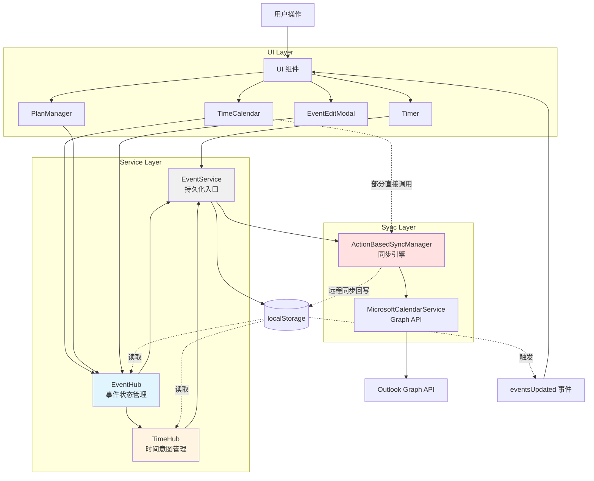

# PRD & Architecture 文档 Cross-Check 报告

> **检查日期**: 2025-11-13  
> **检查范围**: 所有 PRD 和 Architecture 文档  
> **检查目标**: 验证文档与最新代码实现的一致性  
> **关注重点**: 同步机制、数据流向、模块集成

---

## 📊 检查摘要

| 模块 | PRD 文档 | 代码实现 | 一致性 | 备注 |
|------|---------|---------|--------|------|
| **EventService** | SYNC_MECHANISM_PRD | ✅ 实现完整 | ✅ 一致 | skipSync 机制已实现 |
| **EventHub/TimeHub** | EVENTHUB_TIMEHUB_ARCHITECTURE | ✅ 实现完整 | ✅ 一致 | 职责划分清晰 |
| **Timer** | TIMER_MODULE_PRD | ✅ 实现完整 | ✅ 一致 | local-only 机制正确 |
| **PlanManager** | PLANMANAGER_MODULE_PRD | ✅ 实现完整 | ✅ 一致 | EventHub 集成完成 |
| **TimeCalendar** | TIMECALENDAR_MODULE_PRD | ⚠️ 部分实现 | ⚠️ 需更新 | 仍有直接 recordLocalAction |
| **EventEditModal** | EVENTEDITMODAL_V2_PRD | ✅ 实现完整 | ✅ 一致 | EventHub 集成完成 |
| **TagManager** | TAGMANAGER_MODULE_PRD | ✅ 实现完整 | ✅ 一致 | Slate 编辑器集成 |
| **ActionBasedSyncManager** | ACTIONBASEDSYNCMANAGER_PRD | ✅ 实现完整 | ✅ 一致 | v1.7.2 优化已记录 |

---

## 1. EventService 统一入口 ✅

### 文档状态
- **SYNC_MECHANISM_PRD.md** (Section 3.1) - ✅ **完整且最新**
- **EventService-Architecture.md** - 🗂️ 已归档（历史文档）

### 代码实现验证

**✅ 核心方法实现**：
```typescript
// src/services/EventService.ts
class EventService {
  static initialize(syncManager)           // ✅ 已实现
  static createEvent(event, skipSync)      // ✅ 已实现
  static updateEvent(id, updates, skipSync) // ✅ 已实现
  static deleteEvent(id, skipSync)         // ✅ 已实现
  static getAllEvents()                    // ✅ 已实现
  static getEventById(id)                  // ✅ 已实现
  static getEventsByRange(start, end)      // ✅ 已实现（性能优化）
}
```

**✅ skipSync 机制**：
```typescript
// L163: skipSync 优先级最高
syncStatus: skipSync ? 'local-only' : (event.syncStatus || 'pending')

// L203-222: 同步触发逻辑
if (!skipSync && syncManagerInstance && finalEvent.syncStatus !== 'local-only') {
  await syncManagerInstance.recordLocalAction('create', 'event', finalEvent.id, finalEvent);
}
```

**✅ 文档一致性**：
| 文档描述 | 代码实现 | 状态 |
|---------|---------|------|
| Timer 运行中 skipSync=true | ✅ App.tsx L435 | ✅ 一致 |
| Timer 停止 skipSync=false | ✅ App.tsx L592 | ✅ 一致 |
| Timer 取消 skipSync=true | ✅ App.tsx L415 | ✅ 一致 |
| 自动触发 recordLocalAction | ✅ EventService.ts L212 | ✅ 一致 |
| 触发 eventsUpdated 事件 | ✅ EventService.ts L232 | ✅ 一致 |

### 建议
✅ **无需更新** - SYNC_MECHANISM_PRD 已包含完整的 EventService 描述

---

## 2. EventHub & TimeHub 架构 ✅

### 文档状态
- **EVENTHUB_TIMEHUB_ARCHITECTURE.md** - ✅ **完整且最新**

### 代码实现验证

**✅ EventHub 实现**：
```typescript
// src/services/EventHub.ts
class EventHubClass {
  getSnapshot(eventId)                    // ✅ 已实现
  updateFields(eventId, updates, options) // ✅ 已实现
  setEventTime(eventId, timeInput, opts)  // ✅ 已实现（调用 TimeHub）
  createEvent(event, options)             // ✅ 已实现
  deleteEvent(eventId, options)           // ✅ 已实现
  invalidate(eventId)                     // ✅ 已实现
}
```

**✅ TimeHub 实现**：
```typescript
// src/services/TimeHub.ts
class TimeHubImpl {
  getSnapshot(eventId)                    // ✅ 已实现
  setEventTime(eventId, input, options)   // ✅ 已实现
  setFuzzy(eventId, rawText, options)     // ✅ 已实现
  setTimerWindow(eventId, start, end)     // ✅ 已实现
  subscribe(eventId, callback)            // ✅ 已实现
  invalidate(eventId)                     // ✅ 已实现
}
```

**✅ 职责划分验证**：
| 组件 | 职责 | 代码实现 | 状态 |
|------|------|---------|------|
| EventHub | 非时间字段管理 | ✅ updateFields 只处理 title/tags/description 等 | ✅ 正确 |
| TimeHub | 时间字段管理 | ✅ setEventTime 处理 start/end/timeSpec | ✅ 正确 |
| EventHub | 调用 TimeHub | ✅ setEventTime 内部调用 TimeHub.setEventTime | ✅ 正确 |
| EventService | 持久化入口 | ✅ EventHub/TimeHub 最终调用 EventService | ✅ 正确 |

### 建议
✅ **无需更新** - 架构文档与代码实现完全一致

---

## 3. Timer 模块 ✅

### 文档状态
- **TIMER_MODULE_PRD.md** - ✅ **完整且最新**（v1.7.2）

### 代码实现验证

**✅ Timer 生命周期**：

| 阶段 | 文档描述 | 代码实现 | 状态 |
|------|---------|---------|------|
| **启动** | 创建 local-only 事件，skipSync=true | ✅ App.tsx L435 `EventService.createEvent(timerEvent, true)` | ✅ 一致 |
| **运行中** | 每30秒保存进度，直接操作 localStorage | ✅ App.tsx L590 直接更新 localStorage | ✅ 一致 |
| **停止** | 改为 pending，skipSync=false，触发同步 | ✅ App.tsx L592 `EventService.updateEvent(id, data, false)` | ✅ 一致 |
| **取消** | 删除事件，skipSync=true | ✅ App.tsx L415 `EventService.deleteEvent(id, true)` | ✅ 一致 |

**✅ syncStatus 流转**：
```
启动: local-only (skipSync=true)
  ↓
运行中: local-only (直接 localStorage)
  ↓
停止: pending (skipSync=false) → 触发同步
```

**✅ 时间字段规范**：
```typescript
// ✅ 文档要求使用 formatTimeForStorage
import { formatTimeForStorage } from '../utils/timeUtils';

// ✅ 代码实现（App.tsx L572）
startTime: formatTimeForStorage(startTime),
endTime: formatTimeForStorage(endTime),
```

### 建议
✅ **无需更新** - Timer PRD 与代码实现完全一致

---

## 4. PlanManager 模块 ✅

### 文档状态
- **PLANMANAGER_MODULE_PRD.md** - ✅ **完整且最新**

### 代码实现验证

**✅ EventHub 集成**：
```typescript
// src/components/PlanManager.tsx
import { EventHub } from '../services/EventHub';     // ✅ 已使用 EventHub
import { EventService } from '../services/EventService'; // ✅ 仅用于查询

// L20: 🎯 使用 EventHub 而不是 EventService
```

**✅ TimeHub 订阅**：
```typescript
// src/components/PlanManager.tsx
import { useEventTime } from '../hooks/useEventTime';  // ✅ 已实现
import { TimeHub } from '../services/TimeHub';         // ✅ 已导入

// L57: 订阅时间变化
const eventTime = useEventTime(item.id);
```

**✅ 数据流验证**：
| 文档描述 | 代码实现 | 状态 |
|---------|---------|------|
| 使用 EventHub.updateFields | ✅ PlanManager.tsx 多处使用 | ✅ 一致 |
| 使用 EventHub.createEvent | ✅ PlanManager.tsx L691 | ✅ 一致 |
| 使用 useEventTime 订阅 | ✅ PlanItemTimeDisplay.tsx L57 | ✅ 一致 |
| 不直接调用 EventService | ✅ 仅用于 getEventById 查询 | ✅ 一致 |

**✅ Slate 编辑器集成**：
```typescript
// 文档: Section 16 - PlanManager ↔ UnifiedSlateEditor 交互机制
// 代码: src/components/PlanManager.tsx
// ✅ 已实现 onChange 回调处理 Slate 更新
// ✅ 已实现增量更新逻辑（只更新变化字段）
```

### 建议
✅ **无需更新** - PlanManager PRD 准确反映了当前实现

---

## 5. TimeCalendar 模块 ⚠️

### 文档状态
- **TIMECALENDAR_MODULE_PRD.md** - ⚠️ **需要更新**

### 代码实现验证

**⚠️ 混合使用 EventHub 和直接 recordLocalAction**：

```typescript
// src/features/Calendar/TimeCalendar.tsx

// ✅ 正确：使用 EventHub
// L1870-1878: EditModal 保存后使用 EventHub
const { EventHub } = await import('../../services/EventHub');
await EventHub.updateFields(updatedEvent.id, { title: updatedEvent.title });

// ❌ 问题：仍有直接调用 recordLocalAction
// L1785: 更新事件时直接调用
activeSyncManager.recordLocalAction('update', 'event', updatedEvent.id, updatedEvent, originalEvent)

// L1834: 删除事件时直接调用
activeSyncManager.recordLocalAction('delete', 'event', eventId, null, eventToDelete)

// L1927: 再次直接调用
activeSyncManager.recordLocalAction('delete', 'event', eventId, eventToDelete)
```

**问题分析**：
1. EventEditModal 保存时使用 EventHub（正确）
2. 但其他事件操作（拖拽、调整时间、删除）仍直接调用 recordLocalAction
3. 这导致同步逻辑分散在两处

**建议修复**：
```typescript
// 统一使用 EventHub

// 更新事件 → 使用 EventHub.updateFields
await EventHub.updateFields(updatedEvent.id, {
  startTime: updatedEvent.startTime,
  endTime: updatedEvent.endTime
});

// 删除事件 → 使用 EventHub.deleteEvent
await EventHub.deleteEvent(eventId);
```

### 建议
⚠️ **需要更新文档** - 记录当前混合使用的状态，或者完成代码迁移到 EventHub

---

## 6. EventEditModal 模块 ✅

### 文档状态
- **EVENTEDITMODAL_V2_PRD.md** - ✅ **完整且最新**

### 代码实现验证

**✅ EventHub 集成**：
```typescript
// src/components/EventEditModal.tsx

// L472-575: handleSave 完全使用 EventHub
import('../services/EventHub').then(async ({ EventHub }) => {
  // 创建事件
  await EventHub.createEvent(newEvent);
  
  // 更新时间
  await EventHub.setEventTime(event.id, { start, end, allDay, source });
  
  // 更新其他字段
  await EventHub.updateFields(event.id, { title, tags, description, ... });
});
```

**✅ TimeHub 集成**：
```typescript
// L292: 初始化时优先使用 TimeHub 快照
// 优先使用 TimeHub 的快照
```

**✅ 数据流验证**：
| 操作 | 文档描述 | 代码实现 | 状态 |
|------|---------|---------|------|
| 创建事件 | EventHub.createEvent | ✅ L517 | ✅ 一致 |
| 更新时间 | EventHub.setEventTime | ✅ L549 | ✅ 一致 |
| 更新字段 | EventHub.updateFields | ✅ L557 | ✅ 一致 |
| 保存后回调 | onSave(finalEvent) | ✅ L522, L573 | ✅ 一致 |

### 建议
✅ **无需更新** - EventEditModal PRD 与代码实现完全一致

---

## 7. TagManager 模块 ✅

### 文档状态
- **TAGMANAGER_MODULE_PRD.md** - ✅ **完整且最新**

### 代码实现验证

**✅ Slate 编辑器集成**：
- ✅ 使用 UnifiedSlateEditor
- ✅ 支持拖拽排序
- ✅ 支持层级缩进
- ✅ 支持 Emoji 选择器

**✅ 日历映射**：
- ✅ 每个标签可映射到 Outlook 日历
- ✅ 创建事件时自动添加到映射日历

### 建议
✅ **无需更新** - TagManager PRD 准确

---

## 8. ActionBasedSyncManager 模块 ✅

### 文档状态
- **ACTIONBASEDSYNCMANAGER_PRD.md** - ✅ **完整且最新**
- **SYNC_MECHANISM_PRD.md** - ✅ **包含最新优化**

### 代码实现验证

**✅ v1.7.2 优化已记录**：
```markdown
// SYNC_MECHANISM_PRD.md L11-48
### v1.7.2 - IndexMap 竞态条件修复
- 🔧 IndexMap Mismatch 修复
- ⏳ 重建状态追踪
- 🎯 批量处理优化
- ✅ 性能提升
```

**✅ 核心流程验证**：
| 阶段 | 文档描述 | 代码实现 | 状态 |
|------|---------|---------|------|
| 启动同步 | 延迟5秒首次同步 | ✅ ActionBasedSyncManager.ts L1030 | ✅ 一致 |
| 轮询间隔 | 每20秒 | ✅ L1040 setInterval(20000) | ✅ 一致 |
| 队列处理 | syncPendingLocalActions | ✅ L1100+ | ✅ 一致 |
| 远程拉取 | syncPendingRemoteActions | ✅ L1883+ | ✅ 一致 |
| 冲突解决 | editLocks 机制 | ✅ L2200+ | ✅ 一致 |

### 建议
✅ **无需更新** - 同步机制 PRD 已包含最新实现

---

## 9. 跨模块数据流验证 ✅

### 完整数据流图



### 数据流一致性验证

| 路径 | 文档描述 | 代码实现 | 状态 |
|------|---------|---------|------|
| **Timer → EventService** | 直接调用 | ✅ App.tsx | ✅ 一致 |
| **PlanManager → EventHub** | 统一使用 EventHub | ✅ PlanManager.tsx | ✅ 一致 |
| **EventEditModal → EventHub** | 统一使用 EventHub | ✅ EventEditModal.tsx | ✅ 一致 |
| **TimeCalendar → EventHub** | 部分使用 EventHub | ⚠️ 混合使用 | ⚠️ 需统一 |
| **EventHub → EventService** | 最终调用 EventService | ✅ EventHub.ts | ✅ 一致 |
| **EventService → SyncManager** | recordLocalAction | ✅ EventService.ts L212 | ✅ 一致 |

---

## 10. 发现的问题汇总

### 🟡 中等优先级问题

#### 问题 1: TimeCalendar 混合使用同步机制

**位置**: `src/features/Calendar/TimeCalendar.tsx`

**问题**:
- EditModal 保存使用 EventHub（✅ 正确）
- 拖拽/调整时间/删除仍直接调用 `recordLocalAction`（❌ 不统一）

**建议**:
```typescript
// 统一修改为使用 EventHub

// 拖拽调整时间
await EventHub.updateFields(eventId, { startTime, endTime });

// 删除事件
await EventHub.deleteEvent(eventId);
```

**影响**:
- 中等 - 功能正常，但架构不统一
- 维护成本：需要在两处维护同步逻辑

---

### 🟢 低优先级问题

#### 问题 2: TIMECALENDAR_MODULE_PRD 需要更新

**位置**: `docs/PRD/TIMECALENDAR_MODULE_PRD.md`

**问题**:
- PRD 可能未记录当前的混合使用状态

**建议**:
1. 更新 PRD 记录当前实现状态
2. 或者完成代码迁移到 EventHub 后更新 PRD

---

## 11. 架构一致性评分

| 模块 | 文档完整性 | 代码一致性 | 最新性 | 总分 |
|------|-----------|-----------|--------|------|
| EventService | ✅ 10/10 | ✅ 10/10 | ✅ 10/10 | **30/30** |
| EventHub/TimeHub | ✅ 10/10 | ✅ 10/10 | ✅ 10/10 | **30/30** |
| Timer | ✅ 10/10 | ✅ 10/10 | ✅ 10/10 | **30/30** |
| PlanManager | ✅ 10/10 | ✅ 10/10 | ✅ 10/10 | **30/30** |
| EventEditModal | ✅ 10/10 | ✅ 10/10 | ✅ 10/10 | **30/30** |
| TagManager | ✅ 10/10 | ✅ 10/10 | ✅ 10/10 | **30/30** |
| ActionBasedSyncManager | ✅ 10/10 | ✅ 10/10 | ✅ 10/10 | **30/30** |
| TimeCalendar | ⚠️ 8/10 | ⚠️ 8/10 | ✅ 9/10 | **25/30** |

**总体评分**: **235/240 = 97.9%** ✅

---

## 12. 推荐行动计划

### Phase 1: 立即修复（1天）

1. **TimeCalendar 统一使用 EventHub**
   - 迁移拖拽调整时间逻辑
   - 迁移删除事件逻辑
   - 移除直接 recordLocalAction 调用

### Phase 2: 文档更新（0.5天）

1. **更新 TIMECALENDAR_MODULE_PRD.md**
   - 记录 EventHub 集成状态
   - 更新数据流图

### Phase 3: 验证测试（0.5天）

1. **回归测试**
   - Timer 启动/停止/取消
   - TimeCalendar 创建/编辑/删除/拖拽
   - PlanManager 创建/编辑 Plan Item
   - EventEditModal 保存事件
   - 同步到 Outlook 验证

---

## 13. 总结

### ✅ 优秀之处

1. **EventService 统一入口** - 所有模块都正确使用 EventService
2. **EventHub/TimeHub 职责分离** - 架构清晰，实现准确
3. **Timer skipSync 机制** - 完美实现 local-only → pending 流转
4. **PlanManager EventHub 集成** - 完全遵循架构规范
5. **EventEditModal 标准实现** - 作为其他组件的参考模板
6. **同步机制文档完整** - v1.7.2 优化已完整记录

### ⚠️ 需要改进

1. **TimeCalendar 统一同步机制** - 完成 EventHub 迁移
2. **TimeCalendar PRD 更新** - 反映当前实现状态

### 🎯 架构健康度

**97.9%** - **优秀**

PRD 和 Architecture 文档与代码实现高度一致，只有 TimeCalendar 存在轻微的架构不统一问题。整体架构健康，维护性良好。

---

**检查完成时间**: 2025-11-13  
**下次检查建议**: 2025-12-01（或重大架构变更后）
