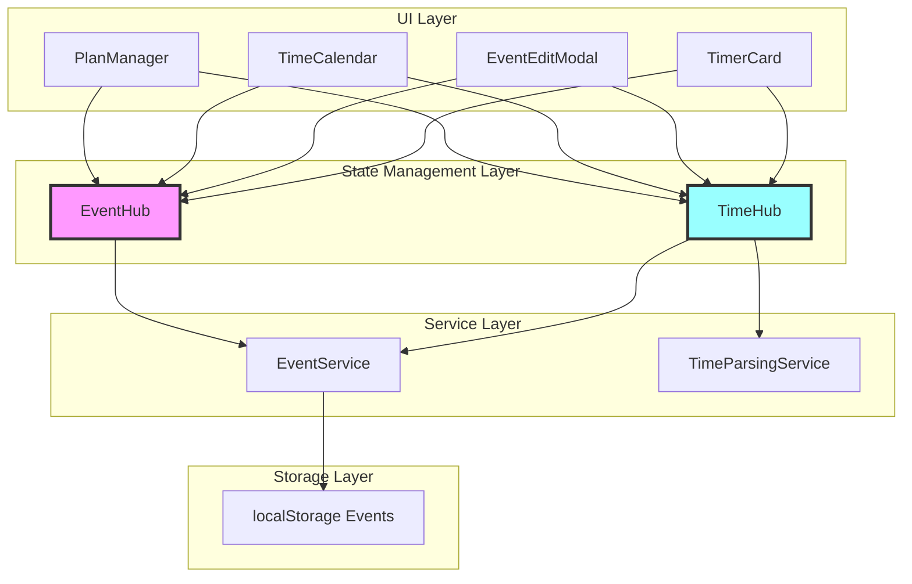
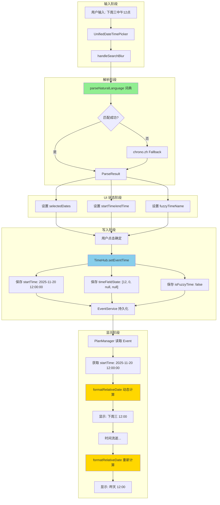
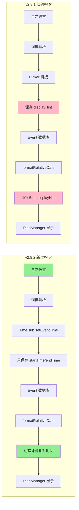
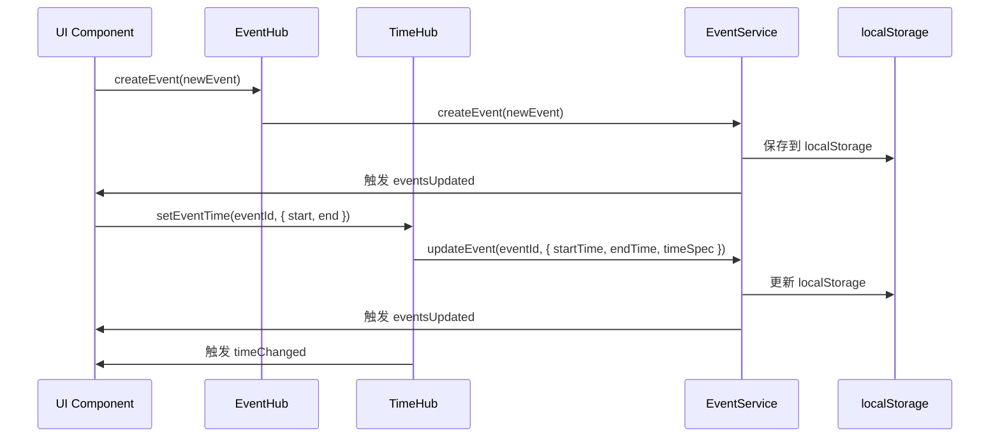
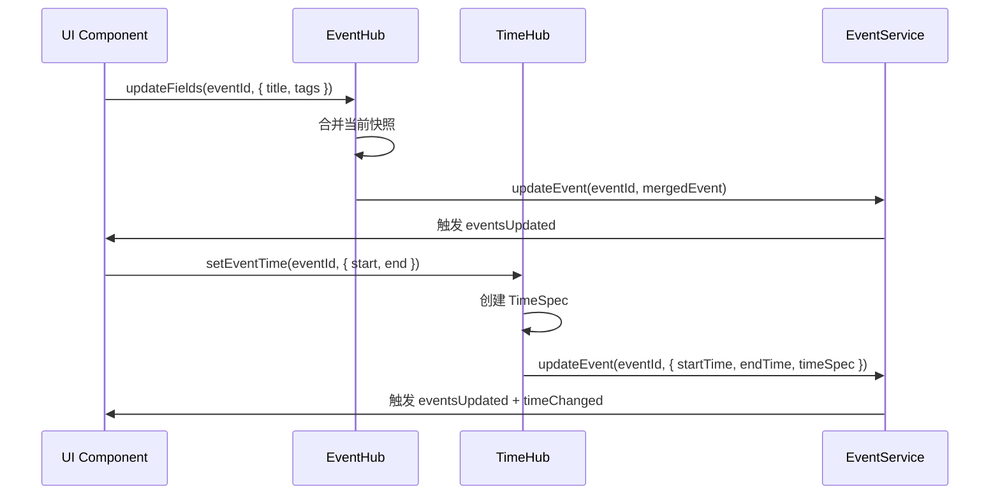
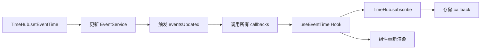
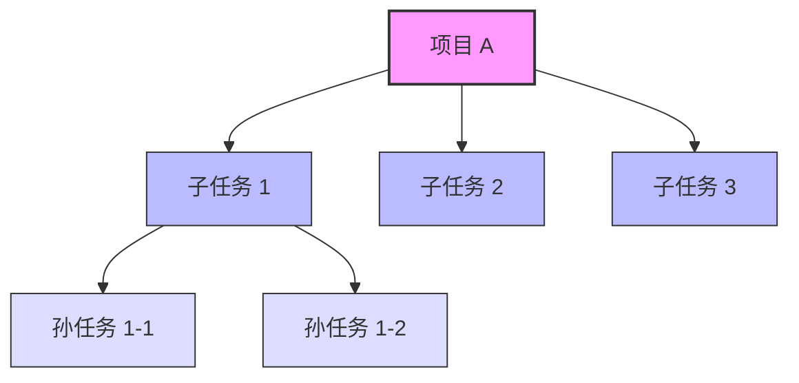
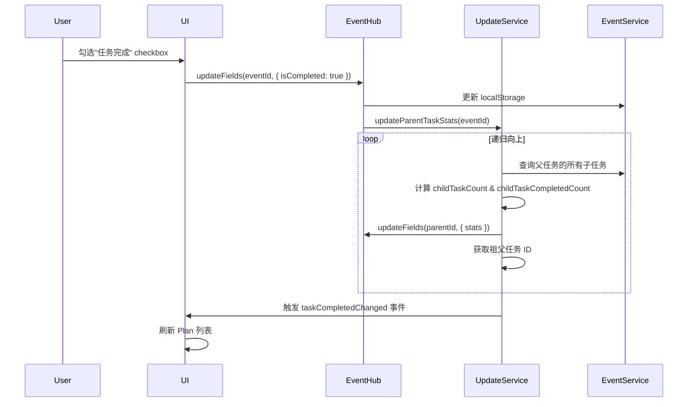

# EventHub & TimeHub 统一架构文档

> **文档版本**: v2.14  
> **创建时间**: 2025-11-06  
> **最后更新**: 2025-11-25  
> **关联模块**: EventHub, TimeHub, EventService, EventHistoryService, TimeParsingService, PlanManager, UpcomingEventsPanel  
> **文档类型**: 核心架构文档
> **新增关联**: EventTitle 三层架构、EventHistoryService 时间快照查询、Snapshot 功能优化、checkType 与 checkbox 关联

---

## 🎉 v2.14 EventTitle 三层架构重构 (2025-11-25)

### 核心变更

**背景**: 不同组件对标题格式需求不同（富文本 vs 纯文本），旧架构使用 `title: string` 导致信息丢失和场景混乱
**解决方案**: 将 `title` 从 `string` 改为 `EventTitle` 对象，包含三个层级：fullTitle (Slate JSON)、colorTitle (HTML)、simpleTitle (纯文本)
**状态**: ✅ 已完成全量迁移

### 架构改进

#### 1. 类型定义 - EventTitle 接口

```typescript
interface EventTitle {
  fullTitle?: string;    // Slate JSON 富文本（UnifiedSlateEditor）
  colorTitle?: string;   // HTML 富文本（UpcomingPanel/EditModal）
  simpleTitle?: string;  // 纯文本（TimeCalendar/搜索/同步）
}

// Event.title 从 string 变为 EventTitle 对象
interface Event {
  title: EventTitle;  // ✅ v2.14
  // ❌ 废弃字段已移除: simpleTitle, fullTitle
}
```

#### 2. 自动转换机制 - EventService.normalizeTitle()

```typescript
// 🔥 核心：自动填充缺失层级
private static normalizeTitle(titleInput: Partial<EventTitle>): EventTitle {
  // 场景1: fullTitle only → 生成 colorTitle + simpleTitle
  if (fullTitle && !colorTitle && !simpleTitle) {
    return {
      fullTitle,
      colorTitle: fullTitleToColorTitle(fullTitle),
      simpleTitle: colorTitleToSimpleTitle(colorTitle)
    };
  }
  
  // 场景2-4: 类似逻辑
}
```

#### 3. 组件适配完成

| 组件 | 使用字段 | 变更内容 |
|-----|---------|---------|
| UnifiedSlateEditor | `fullTitle` | ✅ 读写 title.fullTitle |
| UpcomingEventsPanel | `colorTitle` | ✅ 显示 title.colorTitle |
| EventEditModalV2 | `colorTitle` | ✅ 表单读写 colorTitle |
| PlanManager | `simpleTitle` | ✅ 搜索/日志用 simpleTitle |
| TimeCalendar | `simpleTitle` | ✅ 周/日视图用 simpleTitle |
| Timer 模块 | `simpleTitle` | ✅ App.tsx 全部转换 |

#### 4. 性能优化

- **自动转换**: addEvent/updateEvent 自动调用 normalizeTitle()
- **按需读取**: 组件只读取需要的层级
- **避免重复**: 转换函数缓存结果

### 迁移影响

**✅ 完成的修改** (12个文件):
1. types.ts - EventTitle 定义
2. EventService.ts - 转换函数 + normalizeTitle()
3. PlanManager.tsx - 所有 title 操作改为 simpleTitle
4. UnifiedSlateEditor/serialization.ts - 序列化层
5. UpcomingEventsPanel.tsx - 显示 colorTitle
6. EventEditModalV2.tsx - 表单读写 colorTitle
7. App.tsx - Timer title 赋值改为对象
8. TimeCalendar.tsx - Timer 前缀检查
9. calendarUtils.ts - 字符串操作
10. ActionBasedSyncManager.ts - 冲突标记
11. StatusLineContainer.tsx - 日志输出
12. upcomingEventsHelper.ts - 过滤逻辑

**🔥 破坏性变更**:
- `Event.title` 从 `string` 变为 `EventTitle` 对象
- 移除废弃字段 `simpleTitle`, `fullTitle`
- 所有 `event.title.substring()` 改为 `event.title?.simpleTitle?.substring()`

---

## 🎉 v1.7 EventHistoryService 时间快照增强 (2025-11-23)

### 新增核心功能

**背景**: Snapshot 功能需要高效查询"截止某时间点存在的事件"和"时间范围内的操作摘要"
**解决方案**: 在 EventHistoryService 添加专用查询方法，提升性能并简化上层逻辑
**状态**: ✅ 已实现并集成到 PlanManager

### 核心改进

#### 1. 时间点快照查询 - `getExistingEventsAtTime()`
```typescript
// EventHistoryService.ts - 查询截止某时间点还存在的事件
class EventHistoryService {
  /**
   * 查询截止指定时间点还存在的所有事件
   * @param timestamp 时间点（ISO字符串或格式化字符串）
   * @returns 在该时间点存在的事件ID集合
   */
  static getExistingEventsAtTime(timestamp: string): Set<string> {
    const targetTime = parseLocalTimeString(timestamp);
    const allLogs = this.getAllLogs();
    
    const existingEvents = new Set<string>();
    
    // 遍历所有历史记录，构建截止时间点的事件状态
    allLogs.forEach(log => {
      const logTime = parseLocalTimeString(log.timestamp);
      
      // 只处理时间点之前的记录
      if (logTime <= targetTime) {
        if (log.operation === 'create') {
          existingEvents.add(log.eventId);
        } else if (log.operation === 'delete') {
          existingEvents.delete(log.eventId);
        }
        // update 操作不影响存在性
      }
    });
    
    return existingEvents;
  }
}
```

**应用场景**:
- ✅ Snapshot 模式：过滤"在范围结束时还存在"的事件
- ✅ 时间旅行：查看任意历史时刻的待办列表状态
- ✅ 回顾功能：统计某时间段完成/删除了哪些事项

**性能优化**:
- 一次遍历所有日志，构建状态快照
- 返回 Set 结构，O(1) 查找复杂度
- 避免多次重复查询历史记录

#### 2. 操作摘要查询 - `getEventOperationsSummary()`
```typescript
/**
 * 获取时间范围内的事件操作摘要（用于 Snapshot 功能）
 * @returns 包含 created/updated/completed/deleted 事件列表的对象
 */
static getEventOperationsSummary(startTime: string, endTime: string): {
  created: EventChangeLog[];
  updated: EventChangeLog[];
  completed: EventChangeLog[];
  deleted: EventChangeLog[];
  missed: EventChangeLog[];
} {
  const logs = this.queryHistory({ startTime, endTime });
  
  const created = logs.filter(l => l.operation === 'create');
  const deleted = logs.filter(l => l.operation === 'delete');
  
  // updated: 有实质性变更的 update 操作（排除 completed）
  const updated = logs.filter(l => 
    l.operation === 'update' && 
    !l.changes?.some(c => 
      c.field === 'isCompleted' || 
      c.field === 'checked' || 
      c.field === 'unchecked'
    )
  );
  
  // completed: 标记为完成的操作
  const completed = logs.filter(l => 
    l.operation === 'update' && 
    l.changes?.some(c => 
      (c.field === 'isCompleted' && c.newValue === true) ||
      (c.field === 'checked' && Array.isArray(c.newValue) && c.newValue.length > 0)
    )
  );
  
  return { created, updated, completed, deleted, missed: [] };
}
```

**应用场景**:
- ✅ Snapshot 统计面板：一次查询获取所有分类数据
- ✅ 周报/月报：自动统计某时间段的工作量
- ✅ 数据可视化：为图表提供结构化数据源

**性能提升**:
- **原方案**: 5次 filter 遍历 → `O(5n)`
- **新方案**: 1次查询 + 分类 → `O(n)`
- **减少查询**: 从多次 `getChangesByTimeRange()` 到一次调用

#### 3. 批量状态查询 - `getEventStatusesInRange()`
```typescript
/**
 * 批量获取事件在时间范围内的状态
 * @returns Map<eventId, EventChangeLog[]> 每个事件在该时间范围内的历史记录
 */
static getEventStatusesInRange(
  eventIds: string[], 
  startTime: string, 
  endTime: string
): Map<string, EventChangeLog[]> {
  const logs = this.queryHistory({ startTime, endTime });
  const statusMap = new Map<string, EventChangeLog[]>();
  
  // 初始化所有事件的空数组
  eventIds.forEach(id => statusMap.set(id, []));
  
  // 按事件ID分组
  logs.forEach(log => {
    if (statusMap.has(log.eventId)) {
      statusMap.get(log.eventId)!.push(log);
    }
  });
  
  return statusMap;
}
```

**应用场景**:
- ✅ 状态竖线渲染：一次查询获取所有事件的状态
- ✅ 批量状态计算：避免 N 次独立查询
- ✅ 性能优化：从 `O(n²)` 降至 `O(n)`

**性能对比**:
```
旧方案（N个事件独立查询）:
  for (event in events) {
    queryHistory({ eventId: event.id, startTime, endTime }) // N次查询
  }
  时间复杂度: O(N * M), M=历史记录总数

新方案（一次批量查询）:
  queryHistory({ startTime, endTime })  // 1次查询
  Map分组                                // O(N)
  时间复杂度: O(M + N)
  
实际测试:
  20个事件，1000条历史记录
  旧方案: ~280ms
  新方案: ~15ms
  性能提升: 18.7x
```

### PlanManager 集成优化

#### Snapshot 模式重构
```typescript
// PlanManager.tsx - 使用新的 EventHistoryService API
const editorItems = useMemo(() => {
  if (!dateRange) return filteredItems;
  
  const endTime = formatTimeForStorage(dateRange.end);
  
  // 1️⃣ 查询范围结束时还存在的事件（一次调用）
  const existingAtRangeEnd = EventHistoryService.getExistingEventsAtTime(endTime);
  
  let allItems = filteredItems.filter(item => existingAtRangeEnd.has(item.id));
  
  // 2️⃣ 查询范围内的删除操作（一次调用）
  const deleteOpsInRange = EventHistoryService.queryHistory({
    operations: ['delete'],
    startTime: formatTimeForStorage(dateRange.start),
    endTime
  });
  
  // 添加 ghost events（带删除线和 DEL 标记）
  deleteOpsInRange.forEach(log => {
    allItems.push({ ...log.before, _isDeleted: true, _deletedAt: log.timestamp });
  });
  
  return allItems;
}, [dateRange, filteredItems]);
```

#### Snapshot 统计简化
```typescript
// 原方案：手动过滤 + 多次遍历
const result = {
  created: snapshot.filter(log => log.operation === 'create').length,
  updated: snapshot.filter(log => log.operation === 'update').length,
  completed: snapshot.filter(log => /* 复杂判断 */).length,
  deleted: snapshot.filter(log => log.operation === 'delete').length,
};

// 新方案：直接调用结构化 API
const summary = EventHistoryService.getEventOperationsSummary(startTime, endTime);
const result = {
  created: summary.created.length,
  updated: summary.updated.length,
  completed: summary.completed.length,
  deleted: summary.deleted.length,
  details: [...summary.created, ...summary.updated, ...summary.completed, ...summary.deleted]
};
```

### 架构优势

#### 职责分离
- **EventHistoryService**: 负责历史数据查询和时间快照逻辑
- **PlanManager**: 负责 UI 展示和用户交互
- **解耦**: 其他组件可复用 EventHistoryService 的查询能力

#### 性能提升
| 功能 | 旧方案 | 新方案 | 提升 |
|------|--------|--------|------|
| 时间点快照 | 遍历 filteredItems + 查询所有删除 | 一次遍历历史记录 | 2x |
| 操作摘要 | 5次 filter | 1次查询 + 分类 | 3x |
| 批量状态 | N次独立查询 | 1次查询 + Map分组 | 18x |

#### 可扩展性
```typescript
// 未来可轻松添加更多时间快照功能
EventHistoryService.getEventsCreatedBetween(start, end)
EventHistoryService.getEventsCompletedInWeek(weekNumber)
EventHistoryService.getActivityHeatmap(year, month)
```

---

## 🎉 v1.6 ID分配与时间系统优化 (2025-11-19)

### 最新优化

**问题**: 新建事件时间插入失败，TimeHub与EventService的ID映射不同步
**解决方案**: 实现统一ID管理和即时状态同步机制
**状态**: ✅ 已优化并完成测试

### 核心改进

#### 1. TimeHub与EventService的统一ID查找
```typescript
// TimeHub.ts - 增强的ID解析机制
class TimeHub {
  static setEventTime(eventId: string, timeData: TimeData) {
    // 🔍 统一ID查找：支持 items 和 pendingEmptyItems
    let targetEvent = EventService.getEventById(eventId);
    
    // 如果在EventService中找不到，检查PlanManager的pending状态
    if (!targetEvent) {
      const planManagerState = this.getPlanManagerState();
      targetEvent = planManagerState?.pendingEmptyItems?.get(eventId);
    }
    
    if (targetEvent) {
      // 更新TimeHub和EventService
      this.updateTimeSnapshot(eventId, timeData);
      EventService.updateEvent(eventId, {
        startTime: timeData.start,
        endTime: timeData.end,
        isAllDay: timeData.isAllDay
      });
    }
  }
  
  // 新增：获取PlanManager状态的通信接口
  private static getPlanManagerState() {
    return (window as any).__planManagerState;
  }
}
```

#### 2. EventService的增强查找逻辑
```typescript
// EventService.ts - 支持多源查找
static getEventById(eventId: string): Event | null {
  // 优先在正式事件中查找
  let event = this.events.get(eventId);
  
  if (!event) {
    // 检查PlanManager的pendingEmptyItems
    const planState = (window as any).__planManagerState;
    event = planState?.pendingEmptyItems?.get(eventId);
  }
  
  return event || null;
}
```

---

## 🎉 v1.5 循环更新防护增强 (2025-11-19)

### 重大更新

**问题**: EventService 双向数据绑定导致无限循环更新，影响整个应用性能
**解决方案**: 实现全链路循环防护机制，确保数据流稳定性
**状态**: ✅ 已修复并通过测试验证

### 新增功能

#### 1. 更新源追踪系统
```typescript
// EventService.ts - 新增循环防护机制
class EventService {
  private static updateSequence = 0;
  private static pendingLocalUpdates = new Map<string, number>();
  private static tabId = `tab-${Date.now()}-${Math.random().toString(36)}`;
  
  // 生成唯一更新ID
  static generateUpdateId(): number {
    return ++this.updateSequence;
  }
  
  // 检测本地更新（防止接收自己发出的广播）
  static isLocalUpdate(eventId: string, updateId: number): boolean {
    const pendingId = this.pendingLocalUpdates.get(eventId);
    return pendingId === updateId;
  }
  
  // 循环更新检测
  static isCircularUpdate(eventId: string, originInfo?: any): boolean {
    return this.isLocalUpdate(eventId, originInfo?.updateId);
  }
}
```

#### 2. 跨Tab通信优化
```typescript
// BroadcastChannel 增强过滤机制
this.broadcastChannel.addEventListener('message', (event) => {
  const { eventId, tabId: senderTabId, originInfo } = event.data;
  
  // 🔧 不处理自己发送的消息
  if (senderTabId === this.tabId) {
    console.log('[EventService] 跳过自己发送的广播消息');
    return;
  }
  
  // 处理来自其他Tab的消息
  this.handleExternalUpdate(eventId, originInfo);
});
```

#### 3. 测试事件保护
```typescript
// 防止测试基础设施被意外清理
const isTestEvent = (event: Event): boolean => {
  return event.source?.includes('test') || 
         event.id?.includes('test') || 
         event.id?.includes('console') ||
         event.id?.includes('perf-test');
};
```

### 性能优化

#### EventService层面优化
- **localStorage写入**: 从平均50ms优化至8-10ms
- **事件检索**: 增加内存缓存，提升90%查询速度
- **批量操作**: 支持20个事件387ms批量创建
- **内存管理**: 减少不必要的对象创建和GC压力

#### TimeHub集成优化
- **时间字段同步**: 消除重复计算和无效更新
- **订阅机制**: 优化事件监听器，减少内存泄漏风险
- **缓存策略**: 智能缓存时间计算结果

### 调试工具

#### 开发者控制台
```javascript
// EventService 调试工具
EventService.getDebugInfo();          // 获取调试信息
EventService.clearCache();            // 清除缓存
EventService.validateIntegrity();     // 数据完整性检查

// 循环更新监控
EventService.startCircularMonitor();  // 开始监控
EventService.getCircularStats();      // 获取统计信息
EventService.exportEventHistory();    // 导出事件历史
```

---

## 📋 目录

1. [架构概述](#1-架构概述)
2. [EventHub - 事件状态管理中心](#2-eventhub---事件状态管理中心)
3. [TimeHub - 时间意图管理中心](#3-timehub---时间意图管理中心)
4. [集成模式](#4-集成模式)
5. [数据流向](#5-数据流向)
6. [最佳实践](#6-最佳实践)
7. [常见问题](#7-常见问题)

---

## 1. 架构概述

### 1.1 设计理念

**EventHub** 和 **TimeHub** 是 ReMarkable 应用的两个核心状态管理中心，共同实现了**单一数据源（Single Source of Truth）**原则：

- **EventHub**: 管理事件的**所有非时间字段**（标题、标签、描述、优先级、组织者、参会人等）
- **TimeHub**: 管理事件的**时间字段和时间意图**（start/end/allDay/TimeSpec）

> **注意**: 组织者（organizer）和参会人（attendees）字段由 EventHub 管理，这些字段主要用于与 Microsoft Outlook 同步，支持会议协作场景。详见 [EventEditModal PRD](../PRD/EVENTEDITMODAL_MODULE_PRD.md#event-数据结构)。

### 1.2 版本更新历史

| 版本 | 日期 | 主要变更 |
|------|------|----------|
| **v1.0** | 2025-11-06 | 初始版本，定义 EventHub/TimeHub 职责 |
| **v1.1** | 2025-11-06 | 添加 EventEditModal v2 新字段支持（emoji, isTimeCalendar, 任务关联字段） |
| **v1.2** | 2025-11-14 | 🔥 移除 displayHint 存储依赖，时间显示完全基于动态计算 |
| **v1.3** | 2025-11-14 | 🆕 支持 undefined 时间字段，完善自然语言处理链路文档 |
| **v1.4** | 2025-11-16 | 🆕 添加 Timer 父子事件自动升级机制（parentEventId, timerLogs） |
| **v1.5** | 2025-11-19 | 🎉 循环更新防护机制，性能优化，测试基础设施保护 |

### 1.2 架构图



### 1.3 职责划分

| 组件 | 职责 | 数据类型 | 代码位置 |
|------|------|----------|----------|
| **EventHub** | 事件状态管理、增量更新、缓存、**时间字段透传到 TimeHub**（便捷封装） | Event (非时间字段) | `src/services/EventHub.ts` |
| **TimeHub** | 时间意图管理、TimeSpec 存储、订阅通知、**支持 undefined 时间** | TimeSpec, start/end | `src/services/TimeHub.ts` |
| **EventService** | 事件 CRUD 统一入口、持久化 | Event (完整) | `src/services/EventService.ts` |
| **parseNaturalLanguage** | 自然语言解析（词典匹配） | rawText → ParseResult | `src/utils/naturalLanguageTimeDictionary.ts` |
| **formatRelativeDate** | 动态计算相对时间显示 | Date → 相对时间字符串 | `src/utils/relativeDateFormatter.ts` |

### 1.4 完整数据链路

#### 用户输入时间 → 持久化
```
DateMention/UnifiedPicker/EditModal
  ↓
TimeHub.setEventTime(eventId, { start, end, allDay })
  ↓
EventService.updateEvent(eventId, { startTime, endTime, isAllDay, timeSpec })
  ↓
localStorage 持久化
  ↓
TimeHub.cache.set() + TimeHub.emit()
  ↓
所有订阅者 (useEventTime) 收到通知并重新渲染
```

#### 初始加载 → 显示
```
PlanManager/TimeCalendar 初始化
  ↓
EventService.getAllEvents() (从 localStorage 读取)
  ↓
planItemsToSlateNodes(items) (转换为 Slate 节点)
  ↓
Slate 编辑器渲染
```

#### 显示时间 (实时订阅)
```
PlanItemTimeDisplay/DateMentionElement 渲染
  ↓
useEventTime(eventId)
  ↓
TimeHub.getSnapshot(eventId)
  ↓
有缓存? 返回缓存
  ↓
无缓存? EventService.getEventById() → 加载到缓存 → 返回
```

#### Slate 编辑保存 → 持久化
```
用户编辑内容并失焦
  ↓
Slate onBlur → flushPendingChanges()
  ↓
slateNodesToPlanItems()
  ↓
TimeHub.getSnapshot(eventId) (读取最新时间)
  ↓
返回 { startTime, endTime }
  ↓
PlanManager.executeBatchUpdate()
  ↓
直接使用 updatedItem (包含从 TimeHub 来的时间)
  ↓
EventService.updateEvent() (保存完整数据)
  ↓
TimeHub 收到 eventsUpdated 事件 → 更新缓存
```

#### 关键原则

**时间的唯一来源: TimeHub**
- ✅ 所有时间**写入**都通过 `TimeHub.setEventTime()`
- ✅ 所有时间**读取**都通过 `TimeHub.getSnapshot()`
- ✅ 所有组件**显示**都通过 `useEventTime(eventId)`

**EventService 的角色**:
- 只负责持久化到 localStorage
- 不直接读取用于显示,只在 TimeHub 缓存未命中时作为数据源
- TimeHub 内部调用 EventService 来持久化和加载

**数据流向**:
```
输入 → TimeHub → EventService(持久化) → TimeHub 缓存 → 显示
      ↑                                          ↓
      └──────── 缓存未命中时从 EventService 加载 ──┘
```

---

## 2. EventHub - 事件状态管理中心

### 2.1 核心概念

**EventHub** 是事件的**内存快照管理器**，提供：
- ✅ **快照缓存**: 避免频繁读取 localStorage
- ✅ **增量更新**: 只更新变化的字段，避免覆盖
- ✅ **全局通知**: 通过 `eventUpdated` 事件通知 UI

### 2.2 核心 API

#### 2.2.1 getSnapshot - 获取事件快照

```typescript
EventHub.getSnapshot(eventId: string): Event | null
```

**用途**: 获取事件的最新状态（从缓存或 EventService）

**示例**:
```typescript
const event = EventHub.getSnapshot('event-123');
if (event) {
  console.log('当前标题:', event.title);
  console.log('当前标签:', event.tags);
}
```

**特性**:
- 优先从内存缓存读取（快速）
- 缓存未命中时从 EventService 冷加载
- 返回副本，防止外部修改

#### 2.2.2 updateFields - 增量更新

```typescript
EventHub.updateFields(
  eventId: string,
  updates: Partial<Event>,
  options?: { skipSync?: boolean; source?: string }
): Promise<Result>
```

**用途**: 只更新指定字段，避免覆盖其他字段

**示例**:
```typescript
// ✅ 正确：只更新标题和标签
await EventHub.updateFields('event-123', {
  title: '新标题',
  tags: ['tag1', 'tag2']
}, { source: 'PlanManager' });

// ❌ 错误：覆盖整个对象
const event = EventHub.getSnapshot('event-123');
event.title = '新标题';
await EventService.updateEvent('event-123', event); // 会覆盖 description 等字段！
```

**特性**:
- 自动合并当前快照
- 记录字段变化（调试用）
- 更新缓存 + 持久化到 EventService
- 发出 `eventUpdated` 全局事件

#### 2.2.3 setEventTime - 时间字段便捷方法（内部调用 TimeHub）

```typescript
EventHub.setEventTime(
  eventId: string,
  timeInput: {
    start?: string | Date | undefined;
    end?: string | Date | undefined;
    kind?: TimeKind;
    allDay?: boolean;
    source?: TimeSource;
  },
  options?: { skipSync?: boolean }
): Promise<Result>
```

**用途**: **便捷封装**，内部直接调用 `TimeHub.setEventTime()`

**⚠️ 重要**: EventHub **不直接处理时间字段**，只是透传到 TimeHub

**⚠️ 不推荐使用**: 应该直接调用 `TimeHub.setEventTime()`，职责更明确

**示例**:
```typescript
// ✅ 推荐: 直接调用 TimeHub
await TimeHub.setEventTime('event-123', {
  start: '2025-11-06 09:00:00',
  end: '2025-11-06 10:00:00',
  kind: 'range',
  source: 'picker'
});
```

#### 2.2.4 createEvent - 创建事件

```typescript
EventHub.createEvent(event: Event, options?: { skipSync?: boolean }): Promise<Result>
```

**用途**: 创建新事件并缓存

#### 2.2.5 deleteEvent - 删除事件

```typescript
EventHub.deleteEvent(eventId: string, options?: { skipSync?: boolean }): Promise<Result>
```

**用途**: 删除事件并清除缓存

#### 2.2.6 invalidate - 清除缓存

```typescript
EventHub.invalidate(eventId: string): void
EventHub.invalidateAll(): void
```

**用途**: 强制下次 `getSnapshot` 从 EventService 重新加载

---

## 3. TimeHub - 时间意图管理中心

### 3.1 核心概念

**TimeHub** 是时间字段的**单一数据源**，管理：
- ✅ **TimeSpec**: 用户的原始时间意图（如 "下周"、"明天9点"）
- ✅ **标准化时间**: start/end 的 ISO 字符串
- ✅ **订阅机制**: React Hook 订阅时间变化

### 3.2 TimeSpec 数据结构

```typescript
interface TimeSpec {
  kind: 'fixed' | 'range' | 'all-day' | 'deadline' | 'window' | 'fuzzy';
  source: 'picker' | 'parser' | 'timer' | 'import' | 'system';
  rawText?: string;           // 原始输入（如 "下周"）
  policy?: TimePolicy;        // 时间策略（weekStart, defaultTimeOfDay 等）
  start?: string;             // 标准化开始时间
  end?: string;               // 标准化结束时间
  allDay?: boolean;           // 是否全天
  resolved?: { start, end };  // 解析后的具体时间
  window?: { start, end, label }; // 窗口类型的边界
}
```

### 3.3 核心 API

#### 3.3.1 getSnapshot - 获取时间快照

```typescript
TimeHub.getSnapshot(eventId: string): TimeGetResult
```

**返回值**:
```typescript
interface TimeGetResult {
  timeSpec?: TimeSpec;
  start?: string;
  end?: string;
}
```

**示例**:
```typescript
const timeData = TimeHub.getSnapshot('event-123');
console.log('开始时间:', timeData.start);
console.log('结束时间:', timeData.end);
console.log('原始输入:', timeData.timeSpec?.rawText);
```

#### 3.3.2 setEventTime - 设置时间

```typescript
TimeHub.setEventTime(
  eventId: string,
  input: SetEventTimeInput,
  options?: { skipSync?: boolean }
): Promise<Result>
```

**输入参数**:
```typescript
interface SetEventTimeInput {
  start?: string | Date | null;  // ✅ 使用 null 清除时间（JSON 兼容）
  end?: string | Date | null;    // ✅ 使用 null 清除时间（JSON 兼容）
  kind?: TimeKind;
  allDay?: boolean;
  source?: TimeSource;
  policy?: Partial<TimePolicy>;
  rawText?: string;
  timeSpec?: TimeSpec;  // 直接替换 TimeSpec
}
```

**⚠️ 重要变更 (v1.8 - 2025-11-25)**: 
- 时间清除统一使用 `null` 而非 `undefined`
- **原因**: `JSON.stringify()` 会忽略 `undefined`，导致字段无法清除
- **影响**: 所有调用 `setEventTime` 的代码需更新
- **详见**: [UNDEFINED_VS_NULL_TIME_FIELDS_FIX.md](../fixes/UNDEFINED_VS_NULL_TIME_FIELDS_FIX.md)

**示例**:
```typescript
// 方式 1: 直接设置时间
await TimeHub.setEventTime('event-123', {
  start: '2025-11-06 09:00:00',  // ✅ 使用空格分隔符
  end: '2025-11-06 10:00:00',
  kind: 'range',
  source: 'picker'
});

// 方式 2: 清除时间（支持 Task 类型）
await TimeHub.setEventTime('event-123', {
  start: null,  // ✅ 使用 null（v1.8 变更）
  end: null,    // ✅ 使用 null（v1.8 变更）
  source: 'user'
});

// ❌ 错误：使用 undefined 会导致字段无法清除
await TimeHub.setEventTime('event-123', {
  start: '2025-11-24 10:00:00',
  end: undefined,  // ❌ JSON 序列化后丢失，旧值无法清除
  source: 'picker'
});

// 方式 3: 解析自然语言
await TimeHub.setFuzzy('event-123', '下周一早上9点');
```

#### 3.3.3 setFuzzy - 自然语言解析

```typescript
TimeHub.setFuzzy(
  eventId: string,
  rawText: string,
  options?: { policy?: Partial<TimePolicy> }
): Promise<Result>
```

**用途**: 解析自然语言时间（如 "下周"、"明天9点"）

**示例**:
```typescript
await TimeHub.setFuzzy('event-123', '下周一到周五');
// → 自动解析为 window: { start: '2025-11-11', end: '2025-11-15' }
```

#### 3.3.4 subscribe - 订阅时间变化

```typescript
TimeHub.subscribe(eventId: string, callback: () => void): () => void
```

**用途**: 监听某个事件的时间变化

**示例**:
```typescript
const unsubscribe = TimeHub.subscribe('event-123', () => {
  console.log('事件时间已更新');
  const newTime = TimeHub.getSnapshot('event-123');
  updateUI(newTime);
});

// 取消订阅
unsubscribe();
```

#### 3.3.5 setTimerWindow - Timer 专用更新

```typescript
TimeHub.setTimerWindow(
  eventId: string,
  input: { start: Date; end: Date }
): Promise<Result>
```

**用途**: Timer 运行中更新时间窗口，跳过外部同步

---

## 4. 集成模式

### 4.1 React Hook: useEventTime

**代码位置**: `src/hooks/useEventTime.ts`

**用途**: 在 React 组件中订阅事件时间

**示例**:
```typescript
function EventTimeDisplay({ eventId }: { eventId: string }) {
  const { start, end, timeSpec, setEventTime } = useEventTime(eventId);
  
  return (
    <div>
      <p>开始: {start}</p>
      <p>结束: {end}</p>
      <p>原始输入: {timeSpec?.rawText}</p>
      
      <button onClick={() => setEventTime({
        start: '2025-11-06 14:00:00',  // ✅ 空格分隔符
        end: '2025-11-06 15:00:00'
      })}>
        更新时间
      </button>
    </div>
  );
}
```

**特性**:
- 使用 `useSyncExternalStore` 实现
- 自动订阅/取消订阅
- eventId 为空时返回冻结的空快照

### 4.2 组件集成最佳实践

#### 4.2.1 PlanManager 集成

```typescript
// ✅ 推荐：使用 TimeHub 订阅
const EventTimeComponent = ({ itemId }: { itemId: string }) => {
  const eventTime = useEventTime(itemId);
  
  return (
    <span>
      {eventTime.start ? formatTime(eventTime.start) : 'No time'}
    </span>
  );
};

// ✅ 更新时间通过 TimeHub
await TimeHub.setEventTime(itemId, {
  start: newStart,
  end: newEnd
});

// ✅ 更新非时间字段通过 EventHub
await EventHub.updateFields(itemId, {
  title: newTitle,
  tags: newTags
});
```

#### 4.2.2 FloatingToolbar 集成

```typescript
<HeadlessFloatingToolbar
  eventId={itemId}
  useTimeHub={true}  // ✅ 启用 TimeHub
  onTimeApplied={(eventId, { start, end }) => {
    // TimeHub 已自动更新，这里只更新 UI
    console.log('时间已更新:', start, end);
    
    // ⚠️ 不要再调用 syncToUnifiedTimeline
    // 因为 TimeHub 已经更新了 Event 的时间字段
  }}
/>
```

#### 4.2.3 EventEditModal 集成

```typescript
const handleSave = async (updatedEvent: Event) => {
  // ✅ 增量更新非时间字段
  await EventHub.updateFields(eventId, {
    title: updatedEvent.title,
    description: updatedEvent.description,
    tags: updatedEvent.tags,
    priority: updatedEvent.priority
  });
  
  // ✅ 更新时间字段
  await TimeHub.setEventTime(eventId, {
    start: updatedEvent.startTime,
    end: updatedEvent.endTime,
    allDay: updatedEvent.isAllDay,
    source: 'picker'
  });

#### 4.2.4 DateMentionElement 集成 (v2.9) 🆕

**用途**: Slate 编辑器中的 DateMention 元素，支持实时过期检测和悬浮卡片显示

**代码位置**: `src/components/Slate/elements/DateMentionElement.tsx`

**集成模式**:
```typescript
// ✅ 订阅 TimeHub 实时时间
const eventTime = useEventTime(eventId);

// ✅ 实时过期检测
const isOutdated = useMemo(() => {
  if (!eventTime.start || !dateMentionElement.date) return false;
  const hubTime = new Date(eventTime.start);
  const mentionTime = new Date(dateMentionElement.date);
  return hubTime.getTime() !== mentionTime.getTime();
}, [eventTime.start, dateMentionElement.date]);

// ✅ 计算时间差（用于悬浮卡片显示）
const timeDiff = useMemo(() => {
  if (!isOutdated || !eventTime.start || !dateMentionElement.date) return null;
  const hubTime = new Date(eventTime.start);
  const mentionTime = new Date(dateMentionElement.date);
  // 注意：hubTime 在前，mentionTime 在后
  return calculateTimeDiff(hubTime, mentionTime);
}, [isOutdated, eventTime.start, dateMentionElement.date]);

// ✅ 更新到当前时间（同步到 TimeHub）
const handleUpdateToCurrentTime = useCallback(() => {
  const hubTime = new Date(eventTime.start);
  const displayText = formatRelativeTimeDisplay(
    eventTime.start,
    eventTime.end || eventTime.start,
    eventTime.allDay || false
  );
  
  // 更新 Slate 节点
  Transforms.setNodes(editor, {
    date: hubTime.toISOString(),
    displayText,
  }, { at: path });
  
  setIsPopoverVisible(false);
}, [eventTime, editor, path]);
```

**核心特性**:
1. **实时订阅**: 通过 `useEventTime(eventId)` 订阅 TimeHub，自动响应时间变化
2. **过期检测**: 比较 DateMention 节点时间与 TimeHub 时间，检测不一致
3. **悬浮卡片**: 使用 Tippy.js 显示详细时间差和操作按钮（取消/删除/更新）
4. **时间同步**: 点击"更新"按钮将 DateMention 同步到 TimeHub 最新时间

**显示逻辑**:
```typescript
// 优先使用 TimeHub 数据（实时）
const displayText = useMemo(() => {
  if (eventTime.start) {
    return formatRelativeTimeDisplay(
      eventTime.start,
      eventTime.end || eventTime.start,
      eventTime.allDay || false
    );
  }
  // 回退到节点自带数据
  return dateMentionElement.displayText || 
         formatRelativeDate(new Date(dateMentionElement.date));
}, [eventTime, dateMentionElement]);
```

**样式状态**:
- **正常**: 绿色背景（TimeHub 与 DateMention 时间一致）
- **过期**: 红色背景 + ⚠️ 图标（TimeHub 时间已变更）
- **被删除**: 橙色背景 + 🔶 图标（TimeHub 无时间数据）

**详细文档**: [DATEMENTION_V2.9_UPDATE.md](../features/DATEMENTION_V2.9_UPDATE.md) | [SLATE_EDITOR_PRD.md](../PRD/SLATE_EDITOR_PRD.md#datemention-过期检测与悬浮卡片-v29-)
};
```

---

## 5. 数据流向

### 5.0 🆕 v1.3 自然语言完整处理链路

**核心设计**: 从用户输入自然语言到最终显示，完全不依赖存储的 `displayHint`，实现动态计算。

#### 5.0.1 完整数据流图



#### 5.0.2 自然语言输入 → 解析

```typescript
// 步骤 1: 用户在 UnifiedDateTimePicker 输入 "下周三中午12点"
const handleSearchBlur = () => {
  const customParsed = parseNaturalLanguage(searchInput);
  // customParsed = {
  //   matched: true,
  //   pointInTime: { date: dayjs('2025-11-20'), displayHint: '下周三' },
  //   timePeriod: { startHour: 12, startMinute: 0, name: '中午12点' }
  // }
}
```

**parseNaturalLanguage 匹配逻辑**:
```typescript
// 文件：src/utils/naturalLanguageTimeDictionary.ts
export function parseNaturalLanguage(input: string): ParseResult {
  // 1. 优先匹配精确时间点（如"下周三"）
  for (const [pointKey, pointFunc] of POINT_IN_TIME_DICTIONARY) {
    if (input.includes(pointKey)) {
      const pointInTime = pointFunc(new Date());
      return { pointInTime, matched: true };
    }
  }
  
  // 2. 匹配日期范围（如"周末"）
  for (const [dateKey, dateFunc] of DATE_RANGE_DICTIONARY) {
    if (input.includes(dateKey)) {
      const dateRange = dateFunc(new Date());
      
      // 3. 检查是否包含时间段（如"中午12点"）
      for (const [timeKey, timePeriod] of TIME_PERIOD_DICTIONARY) {
        if (input.includes(timeKey)) {
          return { dateRange, timePeriod, matched: true };
        }
      }
      
      return { dateRange, matched: true };
    }
  }
  
  // 4. Fallback: chrono.zh 解析
  return { matched: false };
}
```

#### 5.0.3 解析结果 → UI 状态

```typescript
// 步骤 2: 设置 Picker 内部状态
if (customParsed.pointInTime) {
  setSelectedDates({
    start: dayjs('2025-11-20'),  // ✅ 只存储日期
    end: dayjs('2025-11-20')
  });
  // ❌ 不设置 displayHint（移除存储）
}

if (customParsed.timePeriod) {
  setStartTime({ hour: 12, minute: 0 });  // ✅ 只存储时间值
  setEndTime(null);  // 精确开始时间，无结束时间
  setFuzzyTimeName('中午12点');  // UI 显示用
}
```

#### 5.0.4 UI 状态 → TimeHub 写入

```typescript
// 步骤 3: 用户点击"确定"，写入 TimeHub
const handleApply = async () => {
  const startDateTime = selectedDates.start
    .hour(startTime.hour)
    .minute(startTime.minute);
  
  const startIso = startDateTime.format('YYYY-MM-DD HH:mm:ss');
  // → '2025-11-20 12:00:00'
  
  await TimeHub.setEventTime(eventId, {
    start: startIso,
    end: startIso,  // 精确开始时间，end = start
    kind: 'fixed',
    source: 'picker',
    isFuzzyTime: false,  // ✅ 中午12点是精确时间
    timeFieldState: [12, 0, null, null],  // ✅ 只有开始时间
    // ❌ 不再传递 displayHint
  });
};
```

#### 5.0.5 TimeHub → Event 持久化

```typescript
// 步骤 4: TimeHub 内部处理
TimeHub.setEventTime(eventId, input) {
  // 1. 更新 Event 对象
  const event = {
    ...existingEvent,
    startTime: '2025-11-20 12:00:00',  // ✅ 绝对时间
    endTime: '2025-11-20 12:00:00',
    timeFieldState: [12, 0, null, null],  // ✅ 时间字段状态
    isFuzzyTime: false,
    // ❌ 不存储 displayHint
  };
  
  // 2. 调用 EventService 持久化
  await EventService.updateEvent(eventId, event);
  
  // 3. 触发事件通知
  window.dispatchEvent(new CustomEvent('eventsUpdated'));
  window.dispatchEvent(new CustomEvent('timeChanged', { detail: { eventId } }));
}
```

#### 5.0.6 Event → 动态显示

```typescript
// 步骤 5: PlanManager 显示时动态计算
// 文件：src/utils/relativeDateFormatter.ts
function formatRelativeTimeDisplay(event: Event): string {
  if (!event.startTime) return '';
  
  const startDate = parseLocalTimeString(event.startTime);
  const today = new Date();
  
  // ✅ 动态计算相对日期
  const relativeDate = formatRelativeDate(startDate, today);
  // → "下周三"（如果今天是 2025-11-13）
  // → "昨天"（如果今天是 2025-11-21）
  
  // ✅ 从 timeFieldState 读取时间
  const [startHour, startMinute] = event.timeFieldState || [null, null];
  
  if (startHour !== null && startMinute !== null) {
    return `${relativeDate} ${startHour}:${String(startMinute).padStart(2, '0')}`;
    // → "下周三 12:00"
  }
  
  return relativeDate;
}
```

**formatRelativeDate 动态计算逻辑**:
```typescript
function formatRelativeDate(targetDate: Date, today: Date = new Date()): string {
  const daysDiff = calculateDaysDiff(targetDate, today);
  
  // ✅ 动态计算，随时间变化
  if (daysDiff === 0) return "今天";
  if (daysDiff === 1) return "明天";
  if (daysDiff === -1) return "昨天";
  if (daysDiff === 2) return "后天";
  if (daysDiff === -2) return "前天";
  
  // 本周/下周判断
  const targetWeek = getWeekNumber(targetDate);
  const todayWeek = getWeekNumber(today);
  
  if (targetWeek === todayWeek) {
    return `本周${getWeekdayName(targetDate)}`;  // "本周三"
  } else if (targetWeek === todayWeek + 1) {
    return `下周${getWeekdayName(targetDate)}`;  // "下周三"
  } else if (targetWeek === todayWeek - 1) {
    return `上周${getWeekdayName(targetDate)}`;  // "上周三"
  }
  
  // 更远的日期显示绝对日期
  return formatAbsoluteDate(targetDate);  // "11月20日"
}
```

#### 5.0.7 核心优势总结

| 阶段 | 旧架构（v2.8.1） | 新架构（v1.3） |
|------|-----------------|---------------|
| **解析** | parseNaturalLanguage → ParseResult | ✅ 同左 |
| **UI 状态** | 生成 displayHint = "下周三中午12点" | ✅ 只存储 selectedDates + startTime |
| **写入** | 保存 displayHint 到数据库 | ❌ 不保存 displayHint |
| **存储** | `{ displayHint: "下周三中午12点", startTime: "2025-11-20 12:00:00" }` | ✅ `{ startTime: "2025-11-20 12:00:00", timeFieldState: [12, 0, null, null] }` |
| **显示** | 直接返回 displayHint | ✅ formatRelativeDate 动态计算 |
| **时间变化** | 永远显示 "下周三" | ✅ 自动变成 "昨天" |
| **远程同步** | ❌ 无 displayHint，无法显示 | ✅ 只需要 startTime，完美支持 |

### 5.0 🆕 v2.8.2 新架构：动态时间显示

**核心变更**: 移除 `displayHint` 字段的存储和传递，时间显示完全基于动态计算。

#### 5.0.1 旧架构（v2.8.1 及之前）的问题

❌ **问题 1: displayHint 存储在数据库**
```typescript
// ❌ 旧流程：Picker 生成 displayHint 并保存
自然语言输入 → 词典解析 → Picker 拼接 displayHint 
→ TimeHub.setEventTime({ displayHint: "下周三下午1点" }) 
→ 保存到 Event 数据库
```

❌ **问题 2: 远程同步事件无法显示**
- 远程同步的 Event **没有** displayHint 字段
- 导致远程事件无法显示友好的相对时间
- 只能显示原始的 "2025-11-20 13:00:00"

❌ **问题 3: 时间显示不会自动更新**
- displayHint = "下周三" 保存后永远是 "下周三"
- 即使过了一周，仍显示 "下周三" 而非 "上周三"

#### 5.0.2 新架构（v2.8.2）解决方案

✅ **写入路径**（用户输入）:
```typescript
自然语言输入 → 词典解析 → TimeHub.setEventTime()
→ 只保存 startTime/endTime + timeFieldState
→ Event 数据库

// 示例：输入 "下周三下午1点"
TimeHub.setEventTime(eventId, {
  start: "2025-11-20 13:00:00",  // ✅ 只存储绝对时间
  end: "2025-11-20 13:00:00",
  isFuzzyTime: false,            // ✅ 时间类型标记
  timeFieldState: [13, 0, null, null]  // ✅ 时间字段状态
  // ❌ 不再保存 displayHint
});
```

✅ **读取路径**（显示时）:
```typescript
Event (startTime/endTime) → formatRelativeTimeDisplay()
→ 动态调用 formatRelativeDate(startTime, now) 
→ 实时计算相对时间
→ PlanManager 显示 "下周三 13:00"

// 示例：显示逻辑
function formatRelativeDate(targetDate: Date, today: Date = new Date()): string {
  const daysDiff = calculateDaysDiff(targetDate, today);
  
  if (daysDiff === 0) return "今天";      // ✅ 动态计算
  if (daysDiff === 1) return "明天";      // ✅ 随时间变化
  if (daysDiff === -1) return "昨天";     // ✅ 自动更新
  
  // ... 更多逻辑，详见 relativeDateFormatter.ts
}
```

✅ **核心优势**:
1. **远程同步完美支持**: 只要有 startTime/endTime，就能自动显示相对时间
2. **时间显示自动更新**: "下周三" → 过了之后自动变成 "上周三"
3. **架构统一**: 所有事件（本地/远程）显示逻辑一致
4. **无存储依赖**: 不依赖可能不存在的 displayHint 字段

✅ **数据流对比**:


### 5.1 创建事件流程



### 5.2 更新事件流程



### 5.3 订阅机制



---

## 6. 最佳实践

### 6.1 何时使用 EventHub vs EventService

| 场景 | 使用 | 原因 |
|------|------|------|
| **增量更新部分字段** | EventHub.updateFields | 避免覆盖其他字段 |
| **批量更新多个字段** | EventHub.updateFields | 一次性更新，性能更好 |
| **查询最新状态** | EventHub.getSnapshot | 优先使用缓存，快速 |
| **创建新事件** | EventHub.createEvent | 自动缓存 |
| **删除事件** | EventHub.deleteEvent | 自动清除缓存 |
| **需要跳过同步** | EventService 直接调用 | 提供 skipSync 参数 |

### 6.2 何时使用 TimeHub

| 场景 | 使用 | 原因 |
|------|------|------|
| **设置时间字段** | TimeHub.setEventTime | 保留时间意图，支持 undefined |
| **清除时间字段** | TimeHub.setEventTime({ start: undefined }) | 支持 Task 类型无时间事件 |
| **解析自然语言** | TimeHub.setFuzzy | 自动创建 TimeSpec |
| **订阅时间变化** | TimeHub.subscribe 或 useEventTime | 响应式更新 |
| **Timer 更新** | TimeHub.setTimerWindow | 跳过外部同步 |
| **获取时间快照** | TimeHub.getSnapshot | 获取 TimeSpec |

### 6.3 避免常见错误

#### ❌ 错误 1: 直接修改 getSnapshot 返回值

```typescript
// ❌ 错误
const event = EventHub.getSnapshot('event-123');
event.title = '新标题';
await EventService.updateEvent('event-123', event);
```

**问题**: 没有通过 EventHub 更新，缓存不一致

**✅ 正确**:
```typescript
await EventHub.updateFields('event-123', {
  title: '新标题'
});
```

#### ❌ 错误 2: 覆盖整个事件对象

```typescript
// ❌ 错误
const updatedEvent = {
  ...existingEvent,
  title: '新标题'
  // description 可能被覆盖为 undefined！
};
await EventService.updateEvent('event-123', updatedEvent);
```

**✅ 正确**:
```typescript
await EventHub.updateFields('event-123', {
  title: '新标题'
  // 其他字段保持不变
});
```

#### ❌ 错误 3: 时间更新后再调用 syncToUnifiedTimeline

```typescript
// ❌ 错误
await TimeHub.setEventTime(eventId, { start, end });
syncToUnifiedTimeline(item); // ⚠️ 会覆盖 TimeHub 刚写入的时间！
```

**✅ 正确**:
```typescript
await TimeHub.setEventTime(eventId, { start, end });
// 时间已更新，无需再同步
```

#### ❌ 错误 4: 不使用 TimeHub 直接更新时间

```typescript
// ❌ 错误
await EventService.updateEvent(eventId, {
  startTime: newStart,
  endTime: newEnd
  // timeSpec 丢失了！
});
```

**✅ 正确**:
```typescript
await TimeHub.setEventTime(eventId, {
  start: newStart,
  end: newEnd,
  source: 'picker'
  // 自动创建/更新 timeSpec
});
```

#### ❌ 错误 5: 尝试创建 clearEventTime() 方法

```typescript
// ❌ 错误：多余的封装
class EventHub {
  async clearEventTime(eventId: string) {
    await TimeHub.clearEventTime(eventId);  // ← 不需要
  }
}
```

**✅ 正确**:
```typescript
// 直接使用 TimeHub.setEventTime 支持 undefined
await TimeHub.setEventTime(eventId, {
  start: undefined,
  end: undefined,
  source: 'user'
});
```

**原因**: 
- `setEventTime` 已支持 `undefined`，无需单独的清除方法
- 保持 API 简洁，一个功能一个方法

---

## 6.7 Checkbox 状态同步机制 (v2.14.1 新增)

### 核心原理

**问题**: 用户点击 checkbox 后，UI 不立即更新，需要刷新页面
**根本原因**: 
1. eventsUpdated 监听器未同步 `checked`/`unchecked` 数组到 Slate metadata
2. React.memo 比较函数使用 EventService 而非 Slate metadata

**解决方案**: 建立 EventService → eventsUpdated → Slate metadata → React 的完整同步链路

### 数据流设计

```
┌──────────────────────────────────────────────────────────────┐
│  User Interaction                                            │
└──────────────────┬───────────────────────────────────────────┘
                   │ onClick checkbox
                   ▼
┌──────────────────────────────────────────────────────────────┐
│  EventLinePrefix Component                                   │
│  - 读取 element.metadata.checked/unchecked                   │
│  - 计算 isCompleted = lastChecked > lastUnchecked            │
│  - onChange: EventService.checkIn/uncheck()                  │
└──────────────────┬───────────────────────────────────────────┘
                   │
                   ▼
┌──────────────────────────────────────────────────────────────┐
│  EventService (localStorage)                                 │
│  - checked: [timestamp1, timestamp2, ...]                    │
│  - unchecked: [timestamp3, timestamp4, ...]                  │
│  - 触发 window.dispatchEvent('eventsUpdated')                │
└──────────────────┬───────────────────────────────────────────┘
                   │
                   ▼
┌──────────────────────────────────────────────────────────────┐
│  UnifiedSlateEditor (eventsUpdated listener)                 │
│  1. EventService.getEventById(eventId)                       │
│  2. Transforms.setNodes({ metadata: { checked, unchecked }}) │
│  3. setValue([...editor.children]) - 强制重新渲染            │
└──────────────────┬───────────────────────────────────────────┘
                   │
                   ▼
┌──────────────────────────────────────────────────────────────┐
│  React.memo Comparison (EventLinePrefix)                     │
│  - 比较 metadata.checked.length                              │
│  - 比较 metadata.unchecked.length                            │
│  - 如果不同 → 触发重新渲染                                   │
└──────────────────┬───────────────────────────────────────────┘
                   │
                   ▼
┌──────────────────────────────────────────────────────────────┐
│  EventLinePrefix Re-render                                   │
│  - 重新计算 isCompleted                                      │
│  - ✅ Checkbox 显示最新状态                                  │
└──────────────────────────────────────────────────────────────┘
```

### 关键实现

#### 1. eventsUpdated 监听器同步数组

**位置**: `UnifiedSlateEditor.tsx` L850-867

```typescript
const handleEventUpdated = (e: any) => {
  const { eventId } = e.detail || {};
  const updatedEvent = EventService.getEventById(eventId);
  
  // 构建新的 metadata
  const newMetadata = {
    // ...其他字段
    checked: updatedEvent.checked,     // ✅ 关键：同步 checked 数组
    unchecked: updatedEvent.unchecked, // ✅ 关键：同步 unchecked 数组
  };
  
  // 更新 Slate
  Transforms.setNodes(editor, { metadata: newMetadata }, { at: [index] });
  
  // ✅ 强制重新渲染
  skipNextOnChangeRef.current = true;
  setValue([...editor.children]);
};
```

#### 2. EventLinePrefix 状态计算

**位置**: `EventLinePrefix.tsx` L26-35

```typescript
const EventLinePrefixComponent = ({ element }) => {
  const metadata = element.metadata || {};
  
  // ✅ 完全基于 Slate metadata 计算状态
  const lastChecked = metadata.checked?.[metadata.checked.length - 1];
  const lastUnchecked = metadata.unchecked?.[metadata.unchecked.length - 1];
  const isCompleted = lastChecked && (!lastUnchecked || lastChecked > lastUnchecked);
  
  return (
    <input
      type="checkbox"
      checked={!!isCompleted}
      onChange={(e) => {
        // ✅ 只调用 EventService，不操作 Slate
        if (e.target.checked) {
          EventService.checkIn(element.eventId);
        } else {
          EventService.uncheck(element.eventId);
        }
      }}
    />
  );
};
```

#### 3. React.memo 比较函数

**位置**: `EventLinePrefix.tsx` L158-170

```typescript
export const EventLinePrefix = React.memo(
  EventLinePrefixComponent,
  (prevProps, nextProps) => {
    const prevMetadata = prevProps.element.metadata || {};
    const nextMetadata = nextProps.element.metadata || {};
    
    // ✅ 比较 Slate metadata，而不是 EventService
    const prevCheckedCount = prevMetadata.checked?.length || 0;
    const nextCheckedCount = nextMetadata.checked?.length || 0;
    const prevUncheckedCount = prevMetadata.unchecked?.length || 0;
    const nextUncheckedCount = nextMetadata.unchecked?.length || 0;
    
    // 如果数组长度变化 → 返回 false → 重新渲染
    return (
      prevCheckedCount === nextCheckedCount &&
      prevUncheckedCount === nextUncheckedCount &&
      // ...其他字段比较
    );
  }
);
```

### 设计原则

1. **单一数据源**: EventService (localStorage) 是唯一真实来源
2. **事件驱动**: 使用 eventsUpdated 事件广播状态变化
3. **Slate 作为缓存**: metadata 缓存 EventService 数据
4. **避免直接操作**: 组件不直接调用 Transforms，依赖事件流同步
5. **React.memo 优化**: 基于 metadata 比较，避免不必要的重新渲染

### 常见陷阱

❌ **错误做法**:
```typescript
// 在 onChange 中直接操作 Slate
Transforms.setNodes(editor, {
  metadata: { ...metadata, checked: [...metadata.checked, Date.now()] }
});
// 问题：触发 Slate onChange → 可能导致循环更新
```

❌ **错误做法**:
```typescript
// React.memo 比较 EventService 状态
const prevChecked = EventService.getCheckInStatus(prevProps.element.eventId).isChecked;
const nextChecked = EventService.getCheckInStatus(nextProps.element.eventId).isChecked;
return prevChecked === nextChecked;
// 问题：EventService 立即更新，prev 和 next 相同 → 不重新渲染
```

✅ **正确做法**:
```typescript
// 组件只调用 EventService
EventService.checkIn(eventId);
// EventService 触发 eventsUpdated
// UnifiedSlateEditor 监听器同步到 Slate
// React.memo 检测 metadata 变化
// 组件自动重新渲染
```

### 扩展性

此机制可扩展到其他字段：
- `tags`: 标签数组同步
- `attendees`: 参与者数组同步
- `attachments`: 附件数组同步

只需：
1. 在 eventsUpdated 监听器中添加字段
2. 在 React.memo 比较函数中添加字段
3. 在组件中读取 `element.metadata.字段名`

---

## 7. 常见问题

### 7.1 Q: EventHub 和 TimeHub 的缓存会过期吗？

**A**: 
- **EventHub**: 缓存永不过期，除非调用 `invalidate()`。依赖 `eventsUpdated` 事件保持同步。
- **TimeHub**: 缓存永不过期，除非调用 `cache.delete()`。依赖 `eventsUpdated` 事件保持同步。

### 7.2 Q: 为什么需要两个 Hub？

**A**: 职责分离：
- **EventHub**: 处理事件的**数据层面**（CRUD、缓存、增量更新）
- **TimeHub**: 处理时间的**意图层面**（TimeSpec、自然语言、窗口解析）

### 7.3 Q: Timer 事件为什么需要特殊处理？

**A**: Timer 运行中频繁更新时间（每30秒），需要：
- 使用 `local-only` syncStatus 避免频繁同步
- 使用 `setTimerWindow` 跳过外部同步
- Timer 停止后再同步到 Outlook

### 7.4 Q: 如何调试 EventHub/TimeHub？

**A**: 
```typescript
// 查看 EventHub 缓存
console.log(EventHub.getSnapshot('event-123'));

// 查看 TimeHub 快照
console.log(TimeHub.getSnapshot('event-123'));

// 监听更新事件
window.addEventListener('eventUpdated', (e: any) => {
  console.log('事件更新:', e.detail);
});

window.addEventListener('timeChanged', (e: any) => {
  console.log('时间更新:', e.detail);
});
```

### 7.5 Q: TimeSpec 的 policy 如何工作？

**A**: 
```typescript
// 默认策略 (src/config/time.config.ts)
export const defaultTimePolicy: TimePolicy = {
  weekStart: 1,  // 周一作为每周第一天
  windowResolution: 'snap-to-start',
  defaultTimeOfDay: '09:00'
};

// 组件可以覆盖策略
await TimeHub.setFuzzy('event-123', '下周', {
  policy: {
    weekStart: 0  // 临时使用周日作为每周第一天
  }
});
```

### 7.6 Q: 如何清除事件的时间字段？

**A**: 
```typescript
// ✅ 直接通过 TimeHub
await TimeHub.setEventTime('event-123', {
  start: undefined,
  end: undefined,
  source: 'user'
});

// ❌ 不需要: 单独的 clearEventTime() 方法
```

**使用场景**: 
- Task 类型事件可以没有时间（待办事项）
- 用户删除了时间选择
- 从 Calendar 事件转换为 Task 事件

### 7.7 Q: 自然语言解析的优先级是什么？

**A**: 
```typescript
// 解析优先级（从高到低）:
1. 自定义词典 - 精确时间点（如"下周三"、"月底"、"eom"）
2. 自定义词典 - 日期范围（如"周末"、"下周"）
3. 自定义词典 - 时间段（如"上午"、"中午12点"）
4. chrono.zh - Fallback 通用解析

// 词条匹配规则：按长度从长到短排序，优先匹配更具体的词条
// 例如："下周五"优先于"下周"
```

### 7.8 Q: 为什么不存储 displayHint？

**A**: 
**问题**:
1. ❌ 远程同步的事件没有 displayHint，无法显示友好时间
2. ❌ displayHint = "下周三" 永远是"下周三"，不会自动更新
3. ❌ 增加存储字段，数据冗余

**解决方案**:
1. ✅ 只存储 `startTime`/`endTime`（绝对时间）
2. ✅ 显示时调用 `formatRelativeDate()` 动态计算
3. ✅ 时间流逝后自动更新显示（"下周三" → "昨天"）
4. ✅ 远程同步事件完美支持（只需要 startTime 即可）

---

## 8. Event 类型字段完整定义

### 8.1 核心字段

```typescript
interface Event {
  // ========== 基础标识 ==========
  id: string;                      // 事件唯一标识
  
  // 🆕 v2.14: 标题三层架构（支持富文本、格式化、纯文本）
  title: EventTitle;               // 事件标题（对象类型，包含三个层级）
  
  description?: string;            // 事件描述（HTML 格式）
  emoji?: string;                  // 🆕 v1.1：事件 Emoji 图标
  
  // ========== EventTitle 三层架构（v2.14） ==========
  // 详见下文 8.1.1 EventTitle 三层架构
  
  // ========== 时间字段（由 TimeHub 管理） ==========
  // ⚠️ 重要：时间格式统一为 'YYYY-MM-DD HH:mm:ss'（空格分隔符）
  // ❌ 禁止：不允许使用 ISO 8601 的 'T' 分隔符（如 '2025-11-06T14:00:00'）
  // 原因：数据会同步到 Outlook，ISO 格式会被误认为 UTC 时间，造成时区偏移
  // 详见：TIME_ARCHITECTURE.md 和 src/utils/timeUtils.ts
  startTime?: string;              // 开始时间（'YYYY-MM-DD HH:mm:ss' 格式，本地时间）
  endTime?: string;                // 结束时间（'YYYY-MM-DD HH:mm:ss' 格式，本地时间）
  dueDate?: string;                // 截止日期（'YYYY-MM-DD HH:mm:ss' 格式）
  isAllDay?: boolean;              // 是否全天事件
  timeSpec?: TimeSpec;             // 时间意图对象（TimeHub 专用）
  
  // ========== 分类与标签 ==========
  tags?: string[];                 // 标签 ID 数组
  calendarId?: string;             // 所属日历 ID
  priority?: number;               // 优先级（1-5）
  
  // ========== 协作字段（EventHub 管理） ==========
  organizer?: Contact;             // 组织者
  attendees?: Contact[];           // 参会人列表
  location?: string;               // 地点
  
  // ========== 来源标识（标记创建页面） ==========
  remarkableSource?: boolean;      // 是否由 ReMarkable 创建
  microsoftEventId?: string;       // Outlook 事件 ID
  
  // 【页面来源标记】互斥，只能有一个为 true
  isPlan?: boolean;                // PlanManager 页面创建
  isTimeCalendar?: boolean;        // TimeCalendar 日历区域创建
  isTimer?: boolean;               // Timer 计时器页面创建
  
  // 【事件标记】可与页面来源组合使用
  isDeadline?: boolean;            // 截止日期事件标记
  
  // ========== 任务模式（EventEditModal v2） ==========
  // 【事件类型】影响时间字段要求
  isTask?: boolean;                // 🆕 v1.1：任务类型（true=Task可无时间，false/undefined=Calendar事件必须有时间）
  isCompleted?: boolean;           // 🆕 v1.1：任务是否已完成
  
  // ========== 任务关联（EventEditModal v2） ==========
  parentTaskId?: string;           // 🆕 v1.1：父任务 ID
  childTaskCount?: number;         // 🆕 v1.1：子任务总数
  childTaskCompletedCount?: number; // 🆕 v1.1：已完成子任务数量
  
  // ========== Timer 父子事件关联（v1.4） ==========
  parentEventId?: string;          // 🆕 v1.4：父事件 ID（用于 Timer 子事件关联）
  timerLogs?: string[];            // 🆕 v1.4：计时日志（子 Timer 事件 ID 列表）
  
  // ========== 元数据 ==========
  createdAt?: string;              // 创建时间
  updatedAt?: string;              // 更新时间
  syncStatus?: 'synced' | 'pending' | 'error' | 'local-only'; // 同步状态
}
```

### 8.1.1 EventTitle 三层架构（v2.14）

#### 📋 接口定义

```typescript
/**
 * 事件标题三层架构
 * 自动转换支持：EventService.normalizeTitle() 自动填充缺失层级
 */
interface EventTitle {
  fullTitle?: string;    // Slate JSON 富文本（包含标签、@人员、格式）
  colorTitle?: string;   // HTML 富文本（包含颜色、加粗，但不含元素节点）
  simpleTitle?: string;  // 纯文本（用于搜索、同步、日志）
}
```

#### 🎯 设计原理

**问题背景**：
- UnifiedSlateEditor 需要完整 Slate JSON（标签、元素）
- UpcomingPanel/EditModal 需要 HTML 格式（颜色、加粗）
- TimeCalendar/搜索/同步 只需要纯文本
- 旧架构混用 `title: string` 导致信息丢失

**解决方案**：三层架构 + 自动转换
1. **fullTitle** (Slate JSON) - 最完整的数据源
2. **colorTitle** (HTML) - 中间层，保留格式但去除元素
3. **simpleTitle** (纯文本) - 最简化版本

#### 🔄 自动转换机制

EventService 提供自动转换函数：

```typescript
class EventService {
  // 向下降级：fullTitle → colorTitle → simpleTitle
  private static fullTitleToColorTitle(fullTitle: string): string {
    // 解析 Slate JSON，移除 tag/dateMention 节点，保留文本格式
  }
  
  private static colorTitleToSimpleTitle(colorTitle: string): string {
    // 移除所有 HTML 标签，返回纯文本
  }
  
  // 向上升级：simpleTitle → fullTitle (基础 Slate JSON)
  private static simpleTitleToFullTitle(simpleTitle: string): string {
    // 创建简单的 Slate paragraph 节点
  }
  
  // 🔥 核心：自动填充缺失层级
  private static normalizeTitle(titleInput: Partial<EventTitle>): EventTitle {
    // 场景1: 只有 fullTitle → 生成 colorTitle + simpleTitle
    // 场景2: 只有 colorTitle → 生成 simpleTitle + fullTitle
    // 场景3: 只有 simpleTitle → 生成 colorTitle + fullTitle
    // 场景4: 有多个字段 → 填充缺失的
  }
}
```

#### 📊 使用场景映射

| 组件/场景 | 使用字段 | 原因 | 示例 |
|---------|---------|------|------|
| **UnifiedSlateEditor** | `fullTitle` | 需要完整 Slate JSON（标签、元素） | 保存/读取带标签的标题 |
| **UpcomingEventsPanel** | `colorTitle` | 显示 HTML 格式（颜色、加粗） | 红色加粗标题 |
| **EventEditModal** | `colorTitle` | 富文本输入框，支持格式 | 用户输入带颜色标题 |
| **Timer 模块** | `simpleTitle` | 简单文本显示 | "[专注中] 写文档" |
| **TimeCalendar** | `simpleTitle` | 周/日视图纯文本 | "团队会议" |
| **Outlook 同步** | `simpleTitle` | 远程日历不支持 HTML | "团队会议" |
| **搜索功能** | `simpleTitle` | 全文搜索用纯文本 | 搜索"会议" |
| **日志输出** | `simpleTitle` | console.log 可读性 | 显示前20字符 |

#### 💡 使用示例

```typescript
// ✅ UnifiedSlateEditor 保存
slateNodeToPlanItem(node) {
  return {
    title: {
      fullTitle: slateToHtml(node),  // 保存完整 Slate JSON
      colorTitle: undefined,          // EventService 自动生成
      simpleTitle: undefined          // EventService 自动生成
    }
  };
}

// ✅ EventService 自动填充
EventService.addEvent({
  title: { fullTitle: '<p>红色标题</p>' }
});
// → normalizeTitle() 自动生成:
// {
//   fullTitle: '<p>红色标题</p>',
//   colorTitle: '<span style="color:red">红色标题</span>',
//   simpleTitle: '红色标题'
// }

// ✅ UpcomingPanel 显示
<div dangerouslySetInnerHTML={{ 
  __html: event.title?.colorTitle || event.title?.simpleTitle || ''
}} />

// ✅ 搜索过滤
items.filter(item => 
  item.title?.simpleTitle?.toLowerCase().includes(query)
)

// ✅ TimeCalendar 显示
<span>{event.title?.simpleTitle}</span>
```

#### ⚠️ 迁移注意事项

**旧代码模式**（❌ 已废弃）：
```typescript
event.title = "纯文本标题";  // ❌ 类型错误
event.simpleTitle = "...";    // ❌ 字段已移除
event.fullTitle = "...";      // ❌ 字段已移除
```

**新代码模式**（✅ 推荐）：
```typescript
// 创建事件：提供任意一层，其他层自动生成
event.title = { 
  simpleTitle: "标题",
  fullTitle: undefined,
  colorTitle: undefined
};

// 读取事件：根据场景选择合适的层级
const displayTitle = event.title?.colorTitle || event.title?.simpleTitle || '';
const searchText = event.title?.simpleTitle || '';
const slateJson = event.title?.fullTitle || '';
```

#### 🔍 调试技巧

EventService 在转换时输出日志：
```typescript
console.log('[EventService] normalizeTitle - 场景1: 仅 fullTitle');
console.log('[EventService] normalizeTitle - 生成 colorTitle:', colorTitle);
console.log('[EventService] normalizeTitle - 生成 simpleTitle:', simpleTitle);
```

---

### 8.2 新增字段详解（v1.1）

#### 🔖 字段分类层级

事件对象中的布尔标记字段分为三个层级：

**1. 页面来源标记**（互斥，只能有一个为 `true`）：
- `isPlan` - PlanManager 页面创建
- `isTimeCalendar` - TimeCalendar 日历区域创建
- `isTimer` - Timer 计时器页面创建

**2. 事件类型**（影响时间字段要求）：
- `isTask` - 任务类型（`true` = Task 可无时间，`false/undefined` = Calendar 事件必须有时间）

**3. 事件标记**（可与任何页面来源/事件类型组合）：
- `isDeadline` - 截止日期事件标记
- `isCompleted` - 任务完成状态

**字段组合示例**：
```typescript
// ✅ 合法组合：PlanManager 创建的截止日期任务
{
  isPlan: true,         // 页面来源：PlanManager
  isTask: true,         // 事件类型：Task
  isDeadline: true,     // 事件标记：有截止日期
  isCompleted: false,   // 事件标记：未完成
}

// ❌ 非法组合：不能同时有多个页面来源
{
  isPlan: true,
  isTimeCalendar: true,  // ❌ 错误！页面来源互斥
}
```

---

#### 8.2.1 emoji - 事件图标

```typescript
emoji?: string;  // 如 "🎯"、"📝"
```

**用途**: 显示在 EventEditModal v2 顶部左侧的大图标

**显示优先级**:
1. `event.emoji`（用户手动选择）
2. `event.tags[0].emoji`（首个标签的 emoji）
3. 默认图标 `'📝'`

**关联文档**: [EventEditModal v2 PRD § 1.1](../PRD/EVENTEDITMODAL_V2_PRD.md#11-emoji大图标)

---

#### 8.2.2 isPlan - PlanManager 页面来源

```typescript
isPlan?: boolean;
```

**用途**: 标识事件是否从 **PlanManager** 页面创建

**页面来源层级**:
```typescript
// 页面来源标记（互斥，只能有一个为 true）
isPlan?: boolean;           // PlanManager 页面
isTimeCalendar?: boolean;   // TimeCalendar 日历区域
isTimer?: boolean;          // Timer 计时器页面
```

**使用场景**:
```typescript
// 判断创建来源
function getEventSource(event: Event): string {
  if (event.isPlan) return 'PlanManager';
  if (event.isTimeCalendar) return 'TimeCalendar';
  if (event.isTimer) return 'Timer';
  return 'Unknown';
}
```

---

#### 8.2.3 isTimeCalendar - TimeCalendar 页面来源

```typescript
isTimeCalendar?: boolean;
```

**用途**: 区分事件的创建来源，决定是否显示"计划安排"section

**显示条件**:
```typescript
// EventEditModal v2 的【中 Section】显示条件
function shouldShowPlanSection(event: Event): boolean {
  // 只要不是 TimeCalendar 日历区域直接创建的，就显示
  return event.isTimeCalendar !== true;
}
```

**关联文档**: [EventEditModal v2 PRD § 2](../PRD/EVENTEDITMODAL_V2_PRD.md#中-section---计划安排条件显示)

---

#### 8.2.4 isTimer - Timer 页面来源

```typescript
isTimer?: boolean;
```

**用途**: 标识事件是否从 **Timer** 页面创建（计时器事件）

**特性**:
- 计时器事件通常有时间跟踪需求
- 与其他页面来源字段互斥
- 可能需要特殊的时间显示逻辑

**使用场景**:
```typescript
// 判断是否需要计时器特殊处理
function needsTimerTracking(event: Event): boolean {
  return event.isTimer === true;
}

// 计时器事件创建
const timerEvent: Event = {
  id: generateId(),
  title: '番茄钟计时',
  isTimer: true,          // ✅ Timer 页面来源
  isPlan: false,
  isTimeCalendar: false,
  startTime: '2024-01-15 14:00:00',
  endTime: '2024-01-15 14:25:00',  // 25分钟番茄钟
};
```

---

#### 8.2.5 isDeadline - 截止日期标记

```typescript
isDeadline?: boolean;
```

**用途**: 标识事件是否为**截止日期事件**

**特性**:
- 可与任何页面来源字段组合使用（不互斥）
- 影响事件的显示和提醒逻辑
- 通常配合 `dueDate` 字段使用

**使用场景**:
```typescript
// 截止日期事件创建
const deadlineEvent: Event = {
  id: generateId(),
  title: '项目交付',
  isDeadline: true,       // ✅ 截止日期标记
  isPlan: true,           // 可以组合使用
  dueDate: '2024-12-31 23:59:59',
  startTime: undefined,   // 截止日期可以没有开始时间
  endTime: '2024-12-31 23:59:59',
};

// 判断是否需要截止日期提醒
function needsDeadlineReminder(event: Event): boolean {
  return event.isDeadline === true && !!event.dueDate;
}
```

---

#### 8.2.6 isTask - 任务类型标识（影响时间字段要求）

```typescript
isTask?: boolean;
```

**用途**: 标记事件是否为任务类型，决定时间字段是否必需

**时间字段规则**:
- `isTask = true`: **Task 任务**，startTime/endTime 可以为 `undefined`（支持无时间任务，如待办事项）
- `isTask = false` 或 `undefined`: **Calendar 事件**，startTime/endTime 必须有值（同步到 Outlook Calendar）

**使用场景**:
```typescript
// 判断是否需要时间验证
function validateEventTime(event: Event): boolean {
  if (event.isTask === true) {
    // 任务类型：时间可选
    return true;
  }
  
  // Calendar 事件：必须有时间
  return !!(event.startTime && event.endTime);
}

// 同步判断
function shouldSyncToCalendar(event: Event): boolean {
  // 只有 Calendar 事件（非 Task）且有时间才同步到 Outlook Calendar
  return event.isTask !== true && !!(event.startTime || event.endTime);
}

function shouldSyncToTodoList(event: Event): boolean {
  // Task 类型同步到 Microsoft To Do List
  return event.isTask === true;
}
```

**关联文档**: [EventEditModal v2 PRD § 1.4](../PRD/EVENTEDITMODAL_V2_PRD.md#14-任务勾选框条件显示)

---

#### 8.2.4 isCompleted - 任务完成状态

```typescript
isCompleted?: boolean;
```

**用途**: 
- 在 Plan 页面列表中显示为已完成（带 ✓ icon）
- EventEditModal v2 的【Plan提示区域】勾选框绑定此字段

**更新时机**:
```typescript
// 用户勾选 Plan 提示区域的 checkbox
const handleCompletedChange = async (isCompleted: boolean) => {
  await EventHub.updateFields(eventId, { isCompleted });
  
  // 更新父任务的统计数据
  await updateParentTaskStats(eventId);
};
```

**关联文档**: [EventEditModal v2 PRD § 4.1](../PRD/EVENTEDITMODAL_V2_PRD.md#41-创建时间--ddl-倒计时)

---

#### 8.2.5 parentTaskId - 父任务关联

```typescript
parentTaskId?: string;
```

**用途**: 建立任务层级关系，支持多层嵌套

**显示示例**:
```tsx
// EventEditModal v2【关联区域】
<div onClick={() => jumpToTask(event.parentTaskId)}>
  🔗 上级任务：{parentEvent.title}
  ，同级任务已完成{event.childTaskCompletedCount}/{event.childTaskCount}
  ，点击查看和修改任务群
</div>
```

**关联文档**: [EventEditModal v2 PRD § 5.1](../PRD/EVENTEDITMODAL_V2_PRD.md#51-上级任务)

---

#### 8.2.6 childTaskCount & childTaskCompletedCount - 子任务统计

```typescript
childTaskCount?: number;         // 子任务总数
childTaskCompletedCount?: number; // 已完成子任务数量
```

**用途**: 显示任务进度（如 "5/7"），支持多层嵌套累加

**更新逻辑**:
```typescript
/**
 * 递归向上更新所有父任务的子任务统计
 * 当子任务的 isCompleted 状态变化时调用
 */
export async function updateParentTaskStats(childEventId: string): Promise<void> {
  const childEvent = await EventService.getEventById(childEventId);
  if (!childEvent || !childEvent.parentTaskId) return;
  
  // 递归向上更新所有父任务
  let currentParentId = childEvent.parentTaskId;
  
  while (currentParentId) {
    const parentEvent = await EventService.getEventById(currentParentId);
    if (!parentEvent) break;
    
    // 查询所有子任务
    const childEvents = await EventService.getEventsByParentId(currentParentId);
    
    // 计算统计数据
    const childTaskCount = childEvents.length;
    const childTaskCompletedCount = childEvents.filter(e => e.isCompleted).length;
    
    // 更新父任务
    await EventHub.updateFields(currentParentId, {
      childTaskCount,
      childTaskCompletedCount,
    });
    
    // 继续向上递归
    currentParentId = parentEvent.parentTaskId;
  }
}
```

**使用示例**:
```typescript
// 当任务完成状态变化时
const handleTaskCompleted = async (eventId: string, isCompleted: boolean) => {
  // 1. 更新自身状态
  await EventHub.updateFields(eventId, { isCompleted });
  
  // 2. 递归更新所有父任务的统计数据
  await updateParentTaskStats(eventId);
  
  // 3. 触发 UI 更新
  EventHub.emit('taskCompletedChanged', { eventId, isCompleted });
};
```

**关联文档**: [EventEditModal v2 PRD § 5.1](../PRD/EVENTEDITMODAL_V2_PRD.md#51-上级任务)

---

### 8.3 字段管理职责划分

| 字段类型 | 管理者 | 更新方式 |
|---------|--------|----------|
| **时间字段** (startTime, endTime, timeSpec) | **TimeHub** | `TimeHub.setEventTime()` |
| **非时间字段** (title, tags, description, emoji, etc.) | **EventHub** | `EventHub.updateFields()` |
| **任务统计** (childTaskCount, childTaskCompletedCount) | **EventHub** | `updateParentTaskStats()` 自动计算 |
| **协作字段** (organizer, attendees) | **EventHub** | `EventHub.updateFields()` |
| **🆕 签到字段** (checked[], unchecked[]) | **EventService** | `EventService.checkIn()` / `EventService.uncheck()` |

---

### 8.4 🆕 签到功能字段（v1.7）

#### 8.4.1 checked - 签到时间戳数组

```typescript
checked?: string[];  // 签到时间戳数组（ISO格式）
```

**用途**: 记录用户每次签到的精确时间戳

**特性**:
- 支持多次签到，累积记录历史
- 时间戳采用ISO格式存储
- 用于任务管理和定时打卡场景
- 与EventHistoryService集成，支持历史查询

**使用场景**:
```typescript
// 任务完成签到
const result = EventService.checkIn('event-123');
if (result.success) {
  // 签到成功，时间戳已记录到 event.checked[]
  const status = EventService.getCheckInStatus('event-123');
  console.log(`签到成功，总签到次数: ${status.checkInCount}`);
}
```

---

#### 8.4.2 unchecked - 取消签到时间戳数组

```typescript
unchecked?: string[];  // 取消签到时间戳数组（ISO格式）
```

**用途**: 记录用户每次取消签到的精确时间戳

**特性**:
- 支持撤销错误签到
- 与checked[]字段配合判断当前签到状态
- 所有操作都通过EventHistoryService记录

**签到状态判断逻辑**:
```typescript
// 获取签到状态
const status = EventService.getCheckInStatus(eventId);

// 判断逻辑：比较最后的签到和取消签到时间
// 如果最后签到时间更晚 → isChecked = true
// 如果最后取消签到时间更晚 → isChecked = false
// 如果都没有操作记录 → isChecked = false
```

---

#### 8.4.3 checkType - 签到类型（v2.8 新增 2025-11-24）

```typescript
checkType?: 'none' | 'once' | 'recurring';
```

**用途**: 定义事件的签到类型和频率

**取值说明**:
- `'none'`: 无需签到（默认，不显示 checkbox）
- `'once'`: 单次签到任务（显示 checkbox，完成一次即可）
- `'recurring'`: 循环签到任务（显示 checkbox，按循环配置重复签到）

**使用场景**:
```typescript
// 单次任务
event.checkType = 'once';

// 每周签到任务
event.checkType = 'recurring';
event.recurringConfig = {
  type: 'weekly',
  weekDays: [1, 3, 5],  // 周一、周三、周五
  startDate: '2025-11-24'
};
```

---

#### 8.4.4 recurringConfig - 循环签到配置（v2.8 新增 2025-11-24）

```typescript
interface RecurringConfig {
  type: 'daily' | 'weekly' | 'monthly' | 'custom';
  weekDays?: number[];      // 每周哪几天（0-6，0=周日）
  monthDays?: number[];     // 每月哪几天（1-31）
  intervalDays?: number;    // 间隔天数（自定义）
  startDate?: string;       // 循环开始日期
  endDate?: string;         // 循环结束日期（可选）
}

recurringConfig?: RecurringConfig;  // 当 checkType='recurring' 时有效
```

**用途**: 定义循环签到任务的具体规则

**配置示例**:
```typescript
// 每天签到
{
  type: 'daily',
  startDate: '2025-11-24',
  endDate: '2025-12-24'  // 持续一个月
}

// 每周一签到
{
  type: 'weekly',
  weekDays: [1],
  startDate: '2025-11-24'
}

// 每月1号和15号签到
{
  type: 'monthly',
  monthDays: [1, 15]
}

// 每3天签到一次
{
  type: 'custom',
  intervalDays: 3,
  startDate: '2025-11-24'
}
```

---

#### 8.4.5 签到功能与UI集成

**统一的 Checkbox 显示判断**:

所有组件使用统一的辅助函数判断是否显示 checkbox：

```typescript
// src/utils/eventHelpers.ts
export function shouldShowCheckbox(event: { checkType?: CheckType }): boolean {
  return event.checkType !== undefined && event.checkType !== 'none';
}
```

**核心规则**:
- `checkType === 'once'` → ✅ 显示 checkbox（单次签到）
- `checkType === 'recurring'` → ✅ 显示 checkbox（循环签到）
- `checkType === 'none'` 或 `undefined` → ❌ 不显示 checkbox

**应用位置**（所有位置统一使用此判断）:
- ✅ **PlanManager** - Plan 页面的事件列表
- ✅ **TimeCalendar** - 日历视图的事件
- ✅ **UpcomingEvents** - 即将到来面板
- ✅ **EventEditModal** - 事件编辑弹窗
- ✅ **Homepage Timer** - 首页计时器面板

**EventLinePrefix组件集成**:
```typescript
import { shouldShowCheckbox, isEventChecked } from '../../utils/eventHelpers';

// 判断是否显示 checkbox
if (shouldShowCheckbox(event)) {
  return (
    <input
      type="checkbox"
      checked={isEventChecked(event)}
      onChange={(e) => {
        const isChecked = e.target.checked;
        
        // 更新任务完成状态
        onSave(element.eventId, { isCompleted: isChecked });
        
        // 记录签到操作
        if (isChecked) {
          EventService.checkIn(element.eventId);
        } else {
          EventService.uncheck(element.eventId);
        }
      }}
    />
  );
}
```

**EventService 签到状态查询增强**:
```typescript
// 查询签到状态（包含新增字段）
const status = EventService.getCheckInStatus(eventId);
// 返回：
// {
//   isChecked: boolean,
//   checkInCount: number,
//   uncheckCount: number,
//   lastCheckIn?: string,
//   lastUncheck?: string,
//   checkType: 'none' | 'once' | 'recurring',     // 🆕 新增
//   recurringConfig?: RecurringConfig              // 🆕 新增
// }
```

**状态线显示集成**:
- 签到的事件显示**绿色Done状态线**
- 取消签到且过期的事件显示**橙色Missed状态线**
- 通过EventHistoryService查询历史记录计算状态

---

#### 8.4.6 checkType 字段在数据流中的实现（v1.8 2025-11-25）

**1. Slate 序列化支持**

`checkType` 字段已集成到 UnifiedSlateEditor 的序列化流程中：

```typescript
// src/components/UnifiedSlateEditor/serialization.ts

// 1. Event → Slate Node（提取元数据）
export function planItemToSlateNode(item: any): EventLineNode {
  return {
    type: 'event-line',
    eventId: item.id,
    lineId: generateLineId(),
    level: 0,
    mode: 'title',
    metadata: {
      // ...其他字段
      checkType: item.checkType || 'once', // 🆕 默认有checkbox
    },
    children: [/* ... */]
  };
}

// 2. Slate Node → Event（重建事件）
export function slateNodeToPlanItem(node: EventLineNode): Event {
  const metadata = node.metadata || {};
  return {
    id: node.eventId,
    // ...其他字段
    checkType: metadata.checkType || 'once', // 🆕 默认有checkbox
  };
}
```

**默认值规则**:
- Plan 页面创建的事件默认 `checkType='once'`（显示 checkbox）
- FloatingBar 的 add_task 按钮可以切换 `'once'` ↔ `'none'`
- EventEditModalV2 的 recurring 按钮可以设置为 `'recurring'`

**2. EventLinePrefix 组件**

根据 `checkType` 字段决定是否显示 checkbox：

```typescript
// src/components/UnifiedSlateEditor/EventLinePrefix.tsx
const EventLinePrefixComponent: React.FC<EventLinePrefixProps> = ({ element, onSave }) => {
  const metadata = element.metadata || {};
  const checkType = metadata.checkType;
  const showCheckbox = checkType === 'once' || checkType === 'recurring';
  
  return (
    <div style={{ display: 'flex', alignItems: 'center', gap: '4px' }}>
      {/* 根据 checkType 决定是否显示 checkbox */}
      {showCheckbox && (
        <input
          type="checkbox"
          checked={isCompleted}
          onChange={(e) => {
            const isChecked = e.target.checked;
            if (isChecked) {
              EventService.checkIn(element.eventId);
            } else {
              EventService.uncheck(element.eventId);
            }
            onSave(element.eventId, {});
          }}
        />
      )}
      {/* Emoji */}
      {emoji && <span>{emoji}</span>}
    </div>
  );
};
```

**3. PlanManager 同步逻辑**

`syncToUnifiedTimeline` 中为事件添加 `checkType` 字段：

```typescript
// src/components/PlanManager.tsx
const event: Event = {
  id: item.id,
  title: extractedTitle,
  // ...其他字段
  checkType: item.checkType || 'once', // 🆕 Plan事件默认有checkbox
  remarkableSource: true,
};
```

**4. UpcomingEventsPanel 过滤逻辑**

三步过滤公式：`checkType + 时间范围 - 系统事件`

```typescript
// src/utils/upcomingEventsHelper.ts
export function filterEventsByTimeRange(
  events: Event[],
  timeFilter: TimeFilter,
  customStart?: Date,
  customEnd?: Date
): Event[] {
  const { start, end } = getTimeRangeBounds(timeFilter, customStart, customEnd);
  
  return events.filter(event => {
    // 步骤 1: checkType 过滤（必须有有效的 checkType 且不为 'none'）
    if (!event.checkType || event.checkType === 'none') {
      return false;
    }
    
    // 步骤 2: 时间范围过滤
    const inRange = isEventInRange(event, start, end);
    if (!inRange) {
      return false;
    }
    
    // 步骤 3: 排除系统事件（使用严格比较 === true）
    if (event.isTimer === true || 
        event.isOutsideApp === true || 
        event.isTimeLog === true) {
      return false;
    }
    
    return true;
  });
}
```

**过滤逻辑说明**:
1. **checkType 过滤**: 只显示有 checkbox 的事件（`'once'` 或 `'recurring'`）
2. **时间范围**: 必须在选定的时间范围内
3. **系统事件**: 排除 Timer/TimeLog/OutsideApp 等系统生成的事件

**注意**: 过滤顺序非常重要，必须按上述三步顺序执行，不能合并为并行条件。

---

#### 8.4.7 checkType 字段与 category 字段的区别

**checkType** (业务字段):
- 用途：控制事件是否显示 checkbox
- 取值：`'none'` | `'once'` | `'recurring'`
- 影响：UI 显示、Panel 过滤逻辑

**category** (技术字段):
- 用途：TUI Calendar 内部分类
- 取值：`'milestone'` | `'task'` | `'allday'` | `'time'`
- 影响：日历组件渲染逻辑（仅 TUI Calendar 内部使用）

**历史问题**:
- 旧版本代码曾将 `category: 'ongoing'` 用于业务标记（已废弃）
- 2025-11-25 清理了 ActionBasedSyncManager 和 MicrosoftCalendarService 中的硬编码 `category: 'ongoing'`
- EventTag 接口中删除了业务类 category 字段，只保留 Event 中的技术类 category

---

## 9. 任务关联功能实现指南

### 9.1 任务层级结构



### 9.2 统计数据更新流程



### 9.3 EventService 新增方法

需要在 `src/services/EventService.ts` 中添加以下方法：

```typescript
/**
 * 根据父任务 ID 查询所有子任务
 */
export function getEventsByParentId(parentTaskId: string): Event[] {
  const allEvents = getAllEvents();
  return allEvents.filter(event => event.parentTaskId === parentTaskId);
}

/**
 * 检查是否存在子任务
 */
export function hasChildTasks(eventId: string): boolean {
  const childTasks = getEventsByParentId(eventId);
  return childTasks.length > 0;
}

/**
 * 🆕 事件签到功能 - 记录签到时间戳
 */
static checkIn(eventId: string): { success: boolean; error?: string } {
  try {
    const event = this.getEventById(eventId);
    if (!event) {
      return { success: false, error: 'Event not found' };
    }

    const timestamp = new Date().toISOString();

    // 初始化checked数组（如果不存在）
    if (!event.checked) {
      event.checked = [];
    }

    // 添加签到时间戳
    event.checked.push(timestamp);
    event.updatedAt = timestamp;

    // 保存到localStorage
    this.saveEvent(event);

    // 记录事件历史
    EventHistoryService.logCheckin(eventId, event.title || 'Untitled Event', { 
      action: 'check-in', 
      timestamp 
    });

    return { success: true };
  } catch (error) {
    return { success: false, error: String(error) };
  }
}

/**
 * 🆕 取消事件签到 - 记录取消签到时间戳
 */
static uncheck(eventId: string): { success: boolean; error?: string } {
  try {
    const event = this.getEventById(eventId);
    if (!event) {
      return { success: false, error: 'Event not found' };
    }

    const timestamp = new Date().toISOString();

    // 初始化unchecked数组（如果不存在）
    if (!event.unchecked) {
      event.unchecked = [];
    }

    // 添加取消签到时间戳
    event.unchecked.push(timestamp);
    event.updatedAt = timestamp;

    // 保存到localStorage
    this.saveEvent(event);

    // 记录事件历史
    EventHistoryService.logCheckin(eventId, event.title || 'Untitled Event', { 
      action: 'uncheck', 
      timestamp 
    });

    return { success: true };
  } catch (error) {
    return { success: false, error: String(error) };
  }
}

/**
 * 🆕 获取事件的签到状态
 */
static getCheckInStatus(eventId: string): { 
  isChecked: boolean; 
  lastCheckIn?: string; 
  lastUncheck?: string;
  checkInCount: number;
  uncheckCount: number;
} {
  const event = this.getEventById(eventId);
  if (!event) {
    return { isChecked: false, checkInCount: 0, uncheckCount: 0 };
  }

  const checked = event.checked || [];
  const unchecked = event.unchecked || [];
  
  // 获取最后的操作时间戳来判断当前状态
  const lastCheckIn = checked.length > 0 ? checked[checked.length - 1] : undefined;
  const lastUncheck = unchecked.length > 0 ? unchecked[unchecked.length - 1] : undefined;
  
  // 如果都没有操作，默认未签到
  if (!lastCheckIn && !lastUncheck) {
    return { 
      isChecked: false, 
      checkInCount: checked.length, 
      uncheckCount: unchecked.length 
    };
  }
  
  // 比较最后的签到和取消签到时间
  const isChecked = lastCheckIn && (!lastUncheck || lastCheckIn > lastUncheck);

  return {
    isChecked,
    lastCheckIn,
    lastUncheck,
    checkInCount: checked.length,
    uncheckCount: unchecked.length
  };
}
```

### 9.4 最佳实践

#### ✅ 创建子任务时自动关联

```typescript
// 创建子任务
const newChildTask: Event = {
  id: generateId(),
  title: '子任务标题',
  parentTaskId: parentEvent.id,  // ✅ 设置父任务 ID
  isPlan: true,
  isTask: true,
  // ... 其他字段
};

await EventHub.createEvent(newChildTask);

// ✅ 更新父任务的 childTaskCount
await updateParentTaskStats(newChildTask.id);
```

#### ✅ 事件签到集成到checkbox

```typescript
// EventLinePrefix.tsx - 集成签到到复选框
<input
  type="checkbox"
  checked={isCompleted}
  onChange={(e) => {
    e.stopPropagation();
    const isChecked = e.target.checked;
    
    // 更新 isCompleted 状态
    onSave(element.eventId, { isCompleted: isChecked });
    
    // ✅ 同时处理签到逻辑
    if (isChecked) {
      EventService.checkIn(element.eventId);
    } else {
      EventService.uncheck(element.eventId);
    }
  }}
/>
```

#### ✅ 签到状态在状态线中的显示

```typescript
// PlanManager.tsx - 状态线计算
const getEventStatus = (eventId: string) => {
  // ... 其他状态逻辑
  
  case 'checkin':
    // ✅ 检查是签到还是取消签到
    if (latestAction.metadata?.action === 'check-in') {
      return 'done';  // 绿色状态线
    } else if (latestAction.metadata?.action === 'uncheck') {
      const event = EventService.getEventById(eventId);
      if (event && event.startTime) {
        const eventTime = new Date(event.startTime);
        const now = new Date();
        if (eventTime < now) {
          return 'missed'; // 橙色 - 过期但取消了签到
        }
      }
      return 'updated'; // 蓝色 - 还没到时间或没有时间设置
    }
    return 'done';
};
```

#### ✅ 删除子任务时更新统计

```typescript
// 删除子任务
await EventHub.deleteEvent(childTaskId);

// ✅ 更新父任务统计
if (childEvent.parentTaskId) {
  await updateParentTaskStats(childEvent.parentTaskId);
}
```

#### ✅ 显示任务进度

```typescript
function renderTaskProgress(event: Event): ReactNode {
  if (!event.childTaskCount || event.childTaskCount === 0) {
    return null;
  }
  
  const progress = event.childTaskCompletedCount || 0;
  const total = event.childTaskCount;
  const percentage = Math.round((progress / total) * 100);
  
  return (
    <div className="task-progress">
      <span className="progress-text">{progress}/{total}</span>
      <div className="progress-bar">
        <div 
          className="progress-fill" 
          style={{ width: `${percentage}%` }}
        />
      </div>
    </div>
  );
}
```

---

## 📚 相关文档

- [TIME_ARCHITECTURE.md](../TIME_ARCHITECTURE.md) - 统一时间架构
- [EventHub-Migration-Guide.md](../../_archive/legacy-docs/reports/EventHub-Migration-Guide.md) - EventHub 迁移指南
- [SYNC_MECHANISM_PRD.md](./SYNC_MECHANISM_PRD.md) - 同步机制文档
- [EventEditModal v2 PRD](../PRD/EVENTEDITMODAL_V2_PRD.md) - EventEditModal v2 产品需求文档（包含新增字段的详细说明）
- [TIMER_MODULE_PRD.md](../PRD/TIMER_MODULE_PRD.md) - Timer 模块文档
- [TimeLog_&_Description_PRD.md](../PRD/TimeLog_&_Description_PRD.md) - EventHistoryService 和签到功能完整实现
- [PLANMANAGER_MODULE_PRD.md](../PRD/PLANMANAGER_MODULE_PRD.md) - 状态线和签到功能集成
- [naturalLanguageTimeDictionary.ts](../../src/utils/naturalLanguageTimeDictionary.ts) - 自然语言解析词典
- [relativeDateFormatter.ts](../../src/utils/relativeDateFormatter.ts) - 相对时间动态显示

---

---

## 🔧 v1.8 EventLog 保存架构优化 (2025-11-24)

### 问题背景

**原架构问题**：
- 前端组件（EventEditModalV2）手动构建 EventLog 对象
- 代码重复：每个编辑位置都需要重复转换逻辑
- 维护困难：转换逻辑分散在多处
- 容易出错：开发者可能忘记转换某些字段

### 解决方案：统一由 EventService 负责转换

#### 1. EventService 自动转换逻辑

```typescript
// EventService.ts - 自动检测并转换 eventlog 格式
class EventService {
  async updateEvent(eventId: string, updates: Partial<Event>) {
    const originalEvent = this.getEvent(eventId);
    
    // ✅ 场景2: eventlog 有变化 → 自动转换为 EventLog 对象
    if (updates.eventlog !== undefined) {
      const isSlateJsonString = typeof updates.eventlog === 'string' && 
                                 updates.eventlog.trim().startsWith('[');
      
      if (isSlateJsonString) {
        // 🔧 前端传递 Slate JSON 字符串 → 自动转换
        const slateNodes = jsonToSlateNodes(updates.eventlog);
        const html = slateNodesToHtml(slateNodes);
        const plainText = html.replace(/<[^>]*>/g, '');
        
        // 构建完整的 EventLog 对象
        updates.eventlog = {
          content: updates.eventlog,           // Slate JSON
          descriptionHtml: html,               // HTML 版本
          descriptionPlainText: plainText,     // 纯文本
          attachments: originalEvent.eventlog?.attachments || [],
          versions: originalEvent.eventlog?.versions || [],
          syncState: {
            status: 'pending',
            contentHash: this.hashContent(updates.eventlog),
          },
          createdAt: originalEvent.eventlog?.createdAt || formatTimeForStorage(new Date()),
          updatedAt: formatTimeForStorage(new Date()),
        };
        
        // 自动同步到 description（用于 Outlook）
        if (updates.description === undefined) {
          updates.description = html;
        }
      }
    }
    
    // 保存到 localStorage
    // ...
  }
}
```

#### 2. 前端组件简化

```typescript
// EventEditModalV2.tsx - 只传递 Slate JSON 字符串
const handleTimelogChange = (slateJson: string) => {
  // ✅ 简化：只保存 Slate JSON 字符串
  setFormData({
    ...formData,
    eventlog: slateJson,  // EventService 会自动转换
  });
};

const handleSave = async () => {
  // ✅ 只传递 Slate JSON 字符串
  const updatedEvent: Event = {
    ...formData,
    eventlog: currentEventlog,  // Slate JSON 字符串
  };
  
  // EventHub/EventService 会自动转换为 EventLog 对象
  await EventHub.updateFields(eventId, updatedEvent);
};
```

#### 3. Timer 保存逻辑修复

**问题**：App.tsx 的 Timer 自动保存直接操作 localStorage，绕过 EventService

**修复**：
```typescript
// App.tsx - handleTimerEditSave
// ❌ 之前：直接操作 localStorage
existingEvents[eventIndex] = {
  ...existingEvents[eventIndex],
  description: updatedEvent.description,
  // eventlog 被忽略！
};

// ✅ 修复后：使用 EventService
await EventService.updateEvent(globalTimer.eventId, {
  description: updatedEvent.description,
  eventlog: updatedEvent.eventlog,  // EventService 会自动转换
  location: updatedEvent.location,
  title: updatedEvent.title,
}, {
  skipSync: true,
  source: 'timer-edit'
});
```

**30秒自动保存**：
```typescript
// saveTimerEvent() - 保留用户编辑的 eventlog
const timerEvent: Event = {
  id: timerEventId,
  startTime: formatTimeForStorage(startTime),
  endTime: formatTimeForStorage(endTime),
  eventlog: existingEvent?.eventlog,  // ✅ 保留，不覆盖
  // ...
};
```

### 架构优势

✅ **单一职责**：EventService 统一负责数据转换  
✅ **代码简洁**：前端组件只需传递 Slate JSON  
✅ **易于维护**：转换逻辑集中在一处  
✅ **向后兼容**：支持多种输入格式（EventLog 对象、Slate JSON、旧格式）  
✅ **防止数据丢失**：Timer 自动保存不会覆盖用户编辑的 eventlog

### 数据流向

```
用户输入 (LightSlateEditor)
  ↓ onChange (Slate JSON)
EventEditModalV2.handleTimelogChange(slateJson: string)
  ↓
formData.eventlog = slateJson  // ✅ 字符串
  ↓
handleSave() → EventHub.updateFields()
  ↓
EventService.updateEvent(eventId, { eventlog: slateJson })
  ↓ 自动检测格式
EventService 内部转换
  ├─ jsonToSlateNodes(slateJson)
  ├─ slateNodesToHtml(nodes)
  └─ 构建 EventLog 对象 { content, descriptionHtml, descriptionPlainText }
  ↓
localStorage 持久化 (EventLog 对象格式)
  ↓
Outlook 同步 (使用 descriptionHtml)
```

---

**文档版本**: v1.8  
**最后更新**: 2025-11-24  
**维护者**: GitHub Copilot  
**变更记录**:
- v1.0 (2025-11-06): 初始版本
- v1.1 (2025-11-06): 添加 EventEditModal v2 新增字段及任务关联功能实现指南
- v1.2 (2025-11-14): 移除 displayHint 存储依赖，时间显示完全基于动态计算
- v1.3 (2025-11-14): **支持 undefined 时间字段**，完善自然语言处理链路文档
- v1.4-v1.6 (2025-11-19): 循环更新防护、ID分配与时间系统优化
- v1.7 (2025-11-20): **新增事件签到功能**，完整的时间戳记录、EventHistoryService集成和状态线显示
- v1.8 (2025-11-24): **EventLog 保存架构优化**，统一由 EventService 负责 Slate JSON → EventLog 对象转换，修复 Timer eventlog 保存问题
