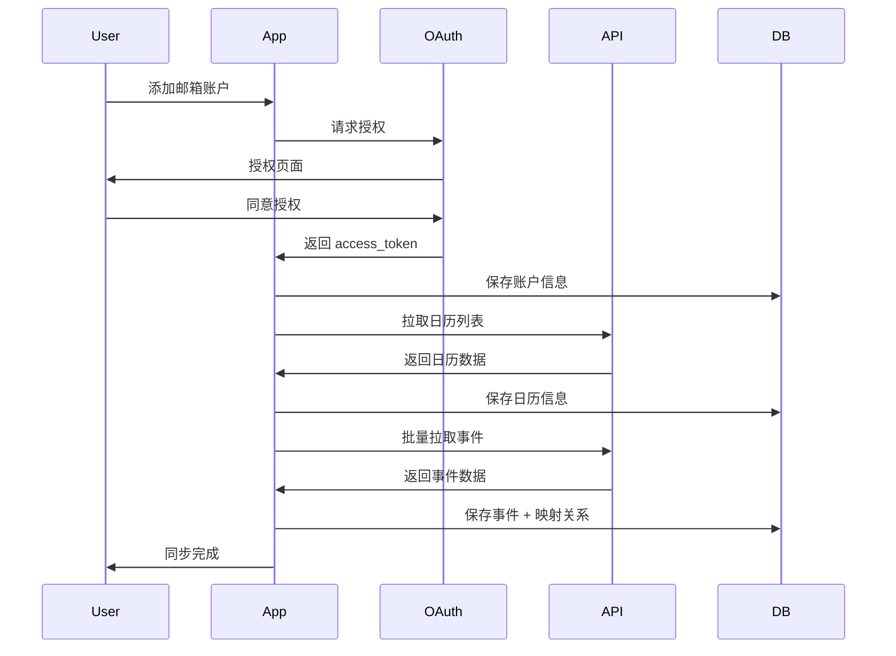

# 多邮箱日历同步架构

> **版本**: v1.0.0  
> **创建时间**: 2025-12-01  
> **关联文档**: [存储架构设计](./STORAGE_ARCHITECTURE.md)

---

## 1. 架构概览

### 1.1 支持的邮箱提供商

| 提供商 | 协议 | 认证方式 | API 端点 | 功能支持 |
|--------|------|----------|---------|----------|
| **Outlook** | Microsoft Graph | OAuth 2.0 | `graph.microsoft.com` | ✅ 日历 ✅ 联系人 ✅ Delta API |
| **Google** | Google Calendar API | OAuth 2.0 | `googleapis.com` | ✅ 日历 ✅ 联系人 ✅ Sync Token |
| **iCloud** | CalDAV | App Password | `caldav.icloud.com` | ✅ 日历 ⚠️ 联系人(CardDAV) |
| **其他** | CalDAV | 基本认证 | 自定义 | ✅ 日历 ❌ 联系人 |

### 1.2 统一数据流

```
┌─────────────────────────────────────────────────────────────────┐
│                    ReMarkable Application                        │
│                                                                   │
│  ┌────────────────┐         ┌────────────────┐                  │
│  │  统一日历视图   │         │  账户管理面板   │                  │
│  │  (Merged View) │         │  (Accounts)    │                  │
│  └────────┬───────┘         └────────┬───────┘                  │
│           │                          │                           │
│           └──────────────┬───────────┘                           │
│                          ▼                                       │
│           ┌──────────────────────────────┐                      │
│           │   Storage Manager (统一接口)  │                      │
│           │   - getEventsByAccount()     │                      │
│           │   - getMergedCalendarView()  │                      │
│           │   - syncAllAccounts()        │                      │
│           └──────────────┬───────────────┘                      │
│                          │                                       │
└──────────────────────────┼───────────────────────────────────────┘
                           │
          ┌────────────────┼────────────────┐
          │                │                │
          ▼                ▼                ▼
    ┌──────────┐     ┌──────────┐     ┌──────────┐
    │ Account  │     │ Account  │     │ Account  │
    │ #1       │     │ #2       │     │ #3       │
    │ Outlook  │     │ Google   │     │ iCloud   │
    └────┬─────┘     └────┬─────┘     └────┬─────┘
         │                │                │
         ▼                ▼                ▼
    ┌──────────┐     ┌──────────┐     ┌──────────┐
    │Calendar 1│     │Calendar 3│     │Calendar 5│
    │Calendar 2│     │Calendar 4│     │Calendar 6│
    └──────────┘     └──────────┘     └──────────┘
```

---

## 2. 数据库设计

### 2.1 核心表结构

#### Accounts 表

```sql
CREATE TABLE accounts (
    id TEXT PRIMARY KEY,
    provider TEXT NOT NULL,  -- 'outlook' | 'google' | 'icloud' | 'caldav'
    email TEXT UNIQUE NOT NULL,
    display_name TEXT,
    
    -- OAuth 凭证（加密存储）
    access_token_encrypted TEXT,
    refresh_token_encrypted TEXT,
    token_expires_at TEXT,
    
    -- 同步配置
    is_active BOOLEAN DEFAULT 1,
    sync_enabled BOOLEAN DEFAULT 1,
    last_sync_at TEXT,
    sync_interval INTEGER DEFAULT 300,
    
    created_at TEXT NOT NULL,
    updated_at TEXT NOT NULL
);
```

#### Calendars 表

```sql
CREATE TABLE calendars (
    id TEXT PRIMARY KEY,
    account_id TEXT NOT NULL,
    remote_id TEXT NOT NULL,  -- Outlook/Google/iCloud 的日历ID
    
    name TEXT NOT NULL,
    color TEXT,
    type TEXT NOT NULL,  -- 'plan' | 'actual' | 'mixed'
    
    is_visible BOOLEAN DEFAULT 1,
    sync_enabled BOOLEAN DEFAULT 1,
    sync_token TEXT,  -- Delta Link 或 Sync Token
    
    FOREIGN KEY (account_id) REFERENCES accounts(id),
    UNIQUE(account_id, remote_id)
);
```

#### Events 表（扩展）

```sql
CREATE TABLE events (
    id TEXT PRIMARY KEY,
    
    -- 多账户支持
    source_account_id TEXT,
    source_calendar_id TEXT,
    
    -- 事件数据
    simple_title TEXT NOT NULL,
    start_time TEXT,
    end_time TEXT,
    -- ... 其他字段
    
    FOREIGN KEY (source_account_id) REFERENCES accounts(id),
    FOREIGN KEY (source_calendar_id) REFERENCES calendars(id)
);
```

#### EventCalendarMappings 表（跨账户同步映射）

```sql
CREATE TABLE event_calendar_mappings (
    id TEXT PRIMARY KEY,
    event_id TEXT NOT NULL,
    account_id TEXT NOT NULL,
    calendar_id TEXT NOT NULL,
    remote_event_id TEXT NOT NULL,
    
    last_sync_at TEXT NOT NULL,
    sync_status TEXT DEFAULT 'synced',
    
    FOREIGN KEY (event_id) REFERENCES events(id) ON DELETE CASCADE,
    UNIQUE(account_id, calendar_id, remote_event_id)
);
```

### 2.2 数据映射关系

```
[本地事件] ←→ [多个远程事件]

Event(id=local-123)
  ├─ Mapping #1: Outlook Calendar → remote-event-abc
  ├─ Mapping #2: Google Calendar → remote-event-xyz
  └─ Mapping #3: iCloud Calendar → remote-event-def

目的：同一个本地事件可以同步到多个邮箱日历
```

---

## 3. 同步流程

### 3.1 初始同步（首次添加账户）



### 3.2 增量同步（定期更新）

**Outlook (Microsoft Graph Delta API)**:

```typescript
// 1. 初始请求
GET https://graph.microsoft.com/v1.0/me/calendar/events/delta

// 2. 后续请求（使用 deltaLink）
GET {deltaLink}

// 响应包含：
{
  "value": [
    { "id": "123", "subject": "会议", ... },  // 新建或更新
    { "id": "456", "@removed": { "reason": "deleted" } }  // 删除
  ],
  "@odata.deltaLink": "https://..."  // 保存以供下次使用
}
```

**Google Calendar (Sync Token)**:

```typescript
// 1. 初始请求
GET https://www.googleapis.com/calendar/v3/calendars/{calendarId}/events
  ?timeMin={now}&singleEvents=true

// 2. 后续请求（使用 syncToken）
GET https://www.googleapis.com/calendar/v3/calendars/{calendarId}/events
  ?syncToken={token}

// 响应包含：
{
  "items": [
    { "id": "abc", "summary": "事件", ... },  // 新建或更新
    { "id": "xyz", "status": "cancelled" }   // 删除
  ],
  "nextSyncToken": "..."  // 保存以供下次使用
}
```

### 3.3 智能去重算法

```typescript
async deduplicateEvents(): Promise<void> {
  // 1. 找出疑似重复的事件（同一时间开始）
  const candidates = await db.query(`
    SELECT e1.id, e2.id, e1.simple_title, e2.simple_title,
           e1.start_time, e1.location, e2.location
    FROM events e1
    JOIN events e2 ON e1.start_time = e2.start_time
    WHERE e1.id < e2.id
      AND e1.source_account_id != e2.source_account_id
      AND e1.deleted_at IS NULL
  `);
  
  // 2. 计算相似度
  for (const pair of candidates) {
    const titleSimilarity = this.calculateTextSimilarity(
      pair.e1_title, pair.e2_title
    );
    const locationSimilarity = this.calculateTextSimilarity(
      pair.e1_location, pair.e2_location
    );
    
    const overallSimilarity = 
      titleSimilarity * 0.7 + locationSimilarity * 0.3;
    
    // 3. 如果相似度 > 90%，标记为重复
    if (overallSimilarity > 0.9) {
      await this.mergeEvents(pair.e1_id, pair.e2_id);
    }
  }
}

async mergeEvents(primaryId: string, duplicateId: string): Promise<void> {
  // 1. 将 duplicate 的映射关系转移到 primary
  await db.exec(`
    UPDATE event_calendar_mappings
    SET event_id = ?
    WHERE event_id = ?
  `, [primaryId, duplicateId]);
  
  // 2. 软删除 duplicate 事件
  await db.exec(`
    UPDATE events
    SET deleted_at = ?
    WHERE id = ?
  `, [new Date().toISOString(), duplicateId]);
  
  console.log(`✅ Merged duplicate events: ${duplicateId} → ${primaryId}`);
}
```

---

## 4. 冲突解决策略

### 4.1 冲突类型

| 冲突类型 | 描述 | 解决策略 |
|---------|------|---------|
| **时间冲突** | 多个账户中同一事件的时间不同 | 最新修改优先 |
| **内容冲突** | 标题/地点等字段不一致 | 合并字段 + 用户确认 |
| **删除冲突** | 一个账户删除，另一个修改 | 保留修改，同步删除 |
| **创建冲突** | 同时在多个账户创建相似事件 | 智能去重 |

### 4.2 冲突解决流程

```typescript
async resolveConflict(conflict: Conflict): Promise<void> {
  switch (conflict.type) {
    case 'time':
      // 策略1: 最新修改优先
      const latestVersion = conflict.versions.sort(
        (a, b) => new Date(b.updatedAt) - new Date(a.updatedAt)
      )[0];
      await this.applyVersion(latestVersion);
      break;
      
    case 'content':
      // 策略2: 合并字段
      const merged = {
        title: conflict.v1.title || conflict.v2.title,
        location: conflict.v1.location || conflict.v2.location,
        // 优先选择非空字段
      };
      await this.applyMerged(merged);
      break;
      
    case 'delete':
      // 策略3: 删除优先（避免僵尸事件）
      await this.deleteEvent(conflict.eventId);
      await this.syncDeletionToAll(conflict.eventId);
      break;
      
    case 'duplicate':
      // 策略4: 智能去重
      await this.mergeEvents(conflict.primary, conflict.duplicate);
      break;
  }
}
```

---

## 5. 性能优化

### 5.1 并行同步

```typescript
async syncAllAccounts(): Promise<void> {
  const accounts = await this.getActiveAccounts();
  
  // 并行同步各账户（避免阻塞）
  await Promise.all(
    accounts.map(account => this.syncAccount(account.id))
  );
}
```

### 5.2 增量同步优化

- ✅ **Delta API**: 只拉取变更，不拉取全量数据
- ✅ **Sync Token**: 持久化同步点，避免重复拉取
- ✅ **批量操作**: 批量插入/更新事件（事务）
- ✅ **限流**: 遵守 API 速率限制

### 5.3 数据库查询优化

```sql
-- 索引优化
CREATE INDEX idx_events_account_time 
ON events(source_account_id, start_time);

CREATE INDEX idx_mappings_event 
ON event_calendar_mappings(event_id);

-- 查询优化（使用索引）
SELECT * FROM events
WHERE source_account_id = ?
  AND start_time >= ? AND start_time <= ?
ORDER BY start_time ASC;
```

---

## 6. 用户体验设计

### 6.1 账户管理界面

```
┌─────────────────────────────────────────────────────┐
│ 账户管理                                    [+ 添加] │
├─────────────────────────────────────────────────────┤
│                                                      │
│ ✅ john@outlook.com                      [🔄] [⚙️]  │
│    📅 工作日历 (3,245 事件)                         │
│    📅 个人日历 (1,032 事件)                         │
│    最后同步: 2分钟前                                │
│                                                      │
│ ✅ john@gmail.com                        [🔄] [⚙️]  │
│    📅 主日历 (2,156 事件)                           │
│    📅 生日日历 (42 事件)                            │
│    最后同步: 5分钟前                                │
│                                                      │
│ ⚠️ john@icloud.com                       [🔄] [⚙️]  │
│    ⚠️ 需要重新授权                                  │
│    最后同步: 2天前                                  │
│                                                      │
└─────────────────────────────────────────────────────┘
```

### 6.2 日历视图选择

```
[视图切换]
  ○ 合并视图 (显示所有账户的事件)
  ● 分账户视图 (按账户分组显示)

[筛选器]
  ☑ Outlook - 工作日历
  ☑ Outlook - 个人日历
  ☑ Gmail - 主日历
  ☐ Gmail - 生日日历
  ☑ iCloud - 日历
```

---

## 7. 实施计划

### Phase 1: 基础架构 (1周)

- [ ] 创建 accounts 和 calendars 表
- [ ] 创建 event_calendar_mappings 表
- [ ] 更新 events 表（添加 source_account_id 字段）
- [ ] 实现统一认证抽象层

### Phase 2: Outlook 集成 (1周)

- [ ] OAuth 2.0 认证流程
- [ ] Microsoft Graph API 集成
- [ ] Delta API 增量同步
- [ ] 日历列表拉取
- [ ] 事件批量同步

### Phase 3: Google 集成 (1周)

- [ ] Google OAuth 2.0 认证
- [ ] Google Calendar API 集成
- [ ] Sync Token 增量同步
- [ ] 日历列表拉取
- [ ] 事件批量同步

### Phase 4: iCloud 集成 (1周)

- [ ] CalDAV 认证（App Password）
- [ ] CalDAV 协议实现
- [ ] 日历列表拉取
- [ ] 事件同步（基于 PROPFIND）

### Phase 5: 高级功能 (1-2周)

- [ ] 智能去重算法
- [ ] 冲突解决机制
- [ ] 账户管理 UI
- [ ] 多账户统一视图
- [ ] 同步状态监控
- [ ] 错误处理与重试

---

## 8. 技术参考

### API 文档

- [Microsoft Graph Calendar API](https://learn.microsoft.com/en-us/graph/api/resources/calendar)
- [Google Calendar API](https://developers.google.com/calendar/api/v3/reference)
- [CalDAV RFC 4791](https://datatracker.ietf.org/doc/html/rfc4791)

### OAuth 2.0 流程

- [Microsoft Identity Platform](https://learn.microsoft.com/en-us/azure/active-directory/develop/v2-oauth2-auth-code-flow)
- [Google OAuth 2.0](https://developers.google.com/identity/protocols/oauth2)

### 增量同步

- [Microsoft Graph Delta Query](https://learn.microsoft.com/en-us/graph/delta-query-overview)
- [Google Calendar Sync](https://developers.google.com/calendar/api/guides/sync)

---

**下一步**: 开始 Phase 1 实施 - 创建多账户数据库结构
